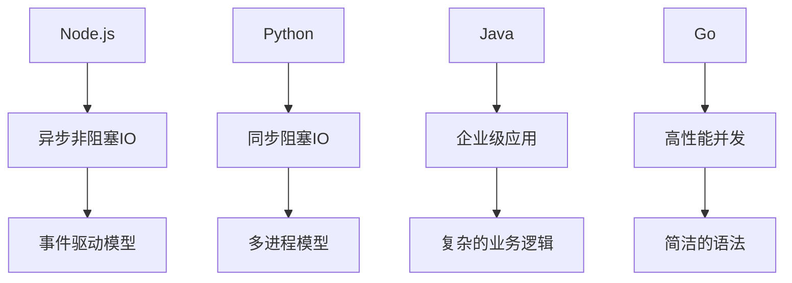

                 

关键词：后端框架，Node.js，Python，Java，Go，框架比较，性能，开发效率，应用场景，框架发展趋势

> 摘要：本文将深入探讨Node.js之外的其他主流后端框架，包括Python的Django和Flask，Java的Spring Boot，以及Go的Gin和Beego。通过对比分析这些框架的优缺点、适用场景以及发展趋势，帮助开发者选择最适合自己项目的后端框架。

## 1. 背景介绍

在当今的互联网时代，后端框架是开发者构建应用程序的基石。它们提供了构建、管理和维护应用程序所需的核心功能。Node.js 作为一种新兴的后端框架，因其高性能和单线程模型而广受欢迎。然而，随着技术的不断进步和应用场景的多样化，开发者开始探索Node.js之外的其他后端框架。

本文旨在对比分析Python的Django和Flask，Java的Spring Boot，以及Go的Gin和Beego。这些框架在性能、开发效率、适用场景等方面各有特点，为开发者提供了更多的选择。

## 2. 核心概念与联系

为了更好地理解这些框架，我们首先需要了解一些核心概念和它们之间的联系。



### 2.1. Node.js

Node.js 是一个基于 Chrome V8 引擎的 JavaScript 运行时，它允许开发者使用 JavaScript 编写后端代码。Node.js 的核心特性是异步非阻塞IO和事件驱动模型，这使得它非常适合处理高并发、高负载的Web应用程序。

### 2.2. Python

Python 是一种高级编程语言，以其简洁和易读性著称。Python 的后端框架如 Django 和 Flask，通常采用同步阻塞IO和多进程模型，这使得它们在处理复杂业务逻辑和企业级应用方面表现出色。

### 2.3. Java

Java 是一种成熟的编程语言，广泛用于企业级应用开发。Java 的后端框架如 Spring Boot，以其复杂的业务逻辑处理能力而闻名。Java 的多进程模型确保了高并发处理能力。

### 2.4. Go

Go，又称Golang，是一种新兴的编程语言，以其高性能和并发处理能力而受到关注。Go 的后端框架如 Gin 和 Beego，提供了简洁的语法和强大的并发支持，非常适合开发高性能的后端服务。

## 3. 核心算法原理 & 具体操作步骤

### 3.1. 算法原理概述

后端框架的核心算法主要包括路由算法、数据库查询优化、缓存策略等。这些算法的原理和操作步骤如下：

- **路由算法**：负责将HTTP请求映射到对应的处理函数。常用的路由算法有最长前缀匹配和树形路由。
- **数据库查询优化**：通过索引、分库分表、查询缓存等技术提高数据库查询效率。
- **缓存策略**：包括LRU缓存、Redis缓存等，用于减少数据库访问压力，提高系统性能。

### 3.2. 算法步骤详解

- **路由算法**：首先解析请求URL，然后与路由表中的规则进行匹配，最后找到对应的处理函数。
- **数据库查询优化**：首先创建索引，然后优化查询语句，最后考虑分库分表。
- **缓存策略**：首先判断缓存是否存在，如果存在则直接返回缓存结果，否则查询数据库并将结果缓存。

### 3.3. 算法优缺点

- **路由算法**：最长前缀匹配速度快，但需要更多的内存；树形路由速度快，但需要更多的CPU计算。
- **数据库查询优化**：索引可以提高查询速度，但会增加数据维护成本；分库分表可以提高查询速度，但会增加系统复杂性。
- **缓存策略**：可以有效减少数据库访问压力，但需要维护缓存一致性。

### 3.4. 算法应用领域

- **路由算法**：适用于Web应用程序，用于处理HTTP请求路由。
- **数据库查询优化**：适用于需要高并发、高查询效率的应用程序。
- **缓存策略**：适用于需要提高系统性能、减少数据库访问压力的应用程序。

## 4. 数学模型和公式 & 详细讲解 & 举例说明

### 4.1. 数学模型构建

后端框架的性能评估通常涉及以下几个数学模型：

- **响应时间模型**：用于评估系统处理请求的平均响应时间。
- **并发处理能力模型**：用于评估系统同时处理请求的最大能力。
- **吞吐量模型**：用于评估系统每秒处理请求的数量。

### 4.2. 公式推导过程

- **响应时间模型**：响应时间 \( T \) 可以通过以下公式计算：

  $$ T = \frac{1}{\lambda} + \frac{\mu}{\mu - \lambda} $$

  其中，\( \lambda \) 是请求到达率，\( \mu \) 是服务速率。

- **并发处理能力模型**：并发处理能力 \( C \) 可以通过以下公式计算：

  $$ C = \frac{\lambda}{\mu - \lambda} $$

  其中，\( \lambda \) 是请求到达率，\( \mu \) 是服务速率。

- **吞吐量模型**：吞吐量 \( Q \) 可以通过以下公式计算：

  $$ Q = \frac{\lambda}{\mu - \lambda} $$

  其中，\( \lambda \) 是请求到达率，\( \mu \) 是服务速率。

### 4.3. 案例分析与讲解

假设一个Web服务器的请求到达率 \( \lambda \) 为 10次/秒，服务速率 \( \mu \) 为 20次/秒，我们可以通过上述公式计算出：

- **响应时间**：\( T = \frac{1}{10} + \frac{20}{20 - 10} = 0.1 + 2 = 2.1 \) 秒
- **并发处理能力**：\( C = \frac{10}{20 - 10} = 1 \) 次
- **吞吐量**：\( Q = \frac{10}{20 - 10} = 1 \) 次/秒

这意味着该服务器可以同时处理1个请求，平均响应时间为2.1秒，每秒处理1个请求。

## 5. 项目实践：代码实例和详细解释说明

### 5.1. 开发环境搭建

为了更好地理解后端框架的应用，我们以Python的Django框架为例，介绍如何搭建开发环境。

首先，安装Python 3.8及以上版本，然后安装Django框架：

```bash
pip install django
```

### 5.2. 源代码详细实现

以下是一个简单的Django应用程序示例：

```python
# myapp/views.py
from django.http import HttpResponse

def home(request):
    return HttpResponse("Hello, world!")
```

在`myapp/urls.py`中定义路由：

```python
# myapp/urls.py
from django.urls import path
from .views import home

urlpatterns = [
    path('', home),
]
```

### 5.3. 代码解读与分析

上述代码定义了一个名为`home`的处理函数，用于处理HTTP GET请求。当访问应用程序的根路径时，该函数将返回一个包含"Hello, world!"的响应。

### 5.4. 运行结果展示

通过运行Django服务器：

```bash
python manage.py runserver
```

在浏览器中访问`http://127.0.0.1:8000/`，将看到"Hello, world!"的响应。

## 6. 实际应用场景

- **Node.js**：适用于实时Web应用程序，如聊天室、在线游戏等。
- **Django**：适用于复杂的企业级应用，如电子商务、管理系统等。
- **Spring Boot**：适用于大型企业级应用，如银行系统、保险系统等。
- **Go**：适用于高性能、高并发的后端服务，如API网关、微服务架构等。

## 7. 工具和资源推荐

- **学习资源推荐**：
  - 《Node.js官方文档》
  - 《Django官方文档》
  - 《Spring Boot官方文档》
  - 《Go官方文档》
  
- **开发工具推荐**：
  - Node.js：Visual Studio Code、Sublime Text
  - Django：PyCharm、VSCode
  - Spring Boot：IntelliJ IDEA、NetBeans
  - Go：Visual Studio Code、GoLand

- **相关论文推荐**：
  - 《Node.js的异步非阻塞IO》
  - 《Django的MVC架构》
  - 《Spring Boot的微服务架构》
  - 《Go的并发处理能力》

## 8. 总结：未来发展趋势与挑战

### 8.1. 研究成果总结

本文通过对Node.js之外的其他主流后端框架（Django、Flask、Spring Boot、Gin、Beego）的对比分析，总结了它们在性能、开发效率、适用场景等方面的优缺点，为开发者提供了更全面的选择。

### 8.2. 未来发展趋势

随着云计算、大数据、物联网等技术的不断发展，后端框架将更加注重性能、可扩展性和易用性。未来的发展趋势包括：

- **高性能并发**：更多的框架将采用并发处理技术，提高系统的处理能力。
- **微服务架构**：更多的框架将支持微服务架构，提高系统的可扩展性。
- **自动化的开发工具**：更多的开发工具将提供自动化的功能，提高开发效率。

### 8.3. 面临的挑战

后端框架在未来将面临以下挑战：

- **性能优化**：如何提高系统的性能，特别是在高并发场景下。
- **安全性**：如何确保系统的安全性，防止SQL注入、XSS攻击等。
- **易用性**：如何简化开发过程，提高开发者的工作效率。

### 8.4. 研究展望

未来的研究将重点关注如何进一步提高后端框架的性能、安全性和易用性，以满足不断变化的应用需求。

## 9. 附录：常见问题与解答

### 9.1. Node.js和Python后端框架如何选择？

- 如果项目需要高并发、实时处理能力，选择Node.js可能更合适。
- 如果项目需要处理复杂业务逻辑、企业级应用，选择Python后端框架（如Django、Flask）可能更合适。

### 9.2. Java后端框架Spring Boot的优势是什么？

- 支持微服务架构，易于扩展。
- 提供了丰富的开箱即用的功能，如数据访问、安全认证等。
- 支持多种数据库连接池，提高了数据访问效率。

### 9.3. Go后端框架的优势是什么？

- 高性能并发处理能力。
- 简洁的语法，易于学习和使用。
- 内置了高效的HTTP服务器和Web框架，如Gin、Beego等。

### 9.4. 如何选择后端框架？

- 根据项目需求，选择适合的后端框架。
- 考虑团队熟悉度，选择团队熟悉的框架。
- 考虑社区支持，选择有良好社区支持的框架。

---

作者：禅与计算机程序设计艺术 / Zen and the Art of Computer Programming

