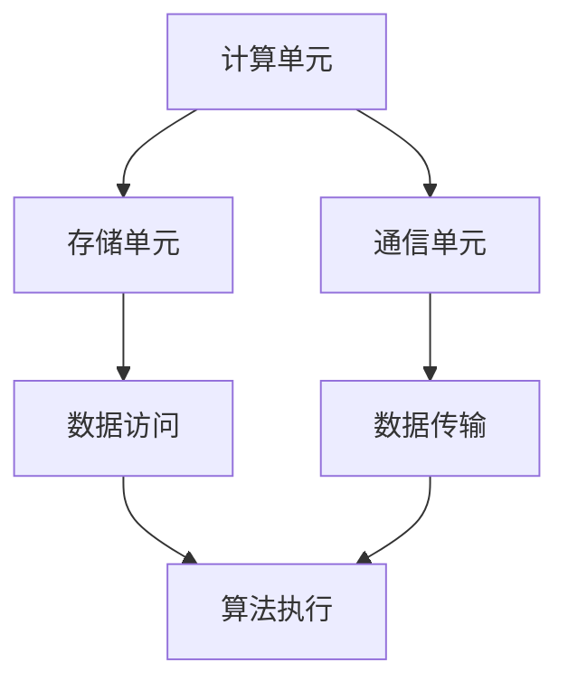

                 

关键词：AI硬件、创新、吕聘Rabbit、技术发展、未来应用

摘要：本文旨在探讨吕聘Rabbit作为一项新型AI硬件技术的创新之处，并分析其在当前技术环境和未来应用场景中的潜力和挑战。通过详细介绍吕聘Rabbit的核心概念、工作原理、数学模型、算法实现以及实际应用案例，本文将为读者提供一个全面的技术视角，帮助理解这一创新技术的独特性和发展前景。

## 1. 背景介绍

随着人工智能（AI）技术的飞速发展，对计算能力和硬件性能的需求日益增长。传统的CPU和GPU在处理复杂AI任务时已显得力不从心，催生了专门为AI应用设计的硬件加速器。吕聘Rabbit（以下简称“Rabbit”）便是其中之一，它作为一款新型AI硬件，旨在通过创新设计提供更高效的AI计算能力。

Rabbit的诞生源于对现有硬件架构的反思和改进。传统的硬件设计往往过于复杂，难以适应不断变化的AI算法需求。Rabbit采用了一种模块化设计，使得硬件组件可以根据不同的算法需求进行灵活配置和优化。这种设计理念不仅提升了计算效率，还降低了硬件制造成本。

Rabbit的研发背景可以追溯到近年来AI领域的重要技术突破。深度学习、强化学习等AI算法的广泛应用，对硬件性能提出了更高的要求。同时，随着量子计算、神经形态计算等前沿技术的兴起，AI硬件的设计理念也在不断演变。Rabbit正是在这种背景下，结合了多种技术优势，实现了新的突破。

## 2. 核心概念与联系

### 2.1. Rabbit的模块化设计

Rabbit的核心概念在于其模块化设计。这种设计理念使得Rabbit的硬件组件可以灵活组合，以适应不同的AI算法需求。具体来说，Rabbit将计算单元、存储单元和通信单元进行了模块化处理，每个模块都可以独立设计和优化。

### 2.2. 模块化设计的工作原理

模块化设计的工作原理是基于异构计算架构。异构计算是指将不同类型、不同性能的硬件组件组合在一起，以实现计算性能的优化。在Rabbit中，计算单元主要负责AI算法的执行，存储单元提供高效的存储和访问能力，而通信单元则负责模块间的数据传输。

### 2.3. Mermaid流程图



在这个流程图中，计算单元（A）负责执行算法，存储单元（B）提供数据访问支持，而通信单元（C）负责数据传输。这种模块化设计使得每个单元可以独立优化，从而提升整体性能。

## 3. 核心算法原理 & 具体操作步骤

### 3.1. 算法原理概述

Rabbit的核心算法是基于深度学习中的卷积神经网络（CNN）。CNN在图像识别、语音处理等领域有着广泛的应用。Rabbit通过对CNN算法的优化，提高了其在硬件上的执行效率。

### 3.2. 算法步骤详解

#### 3.2.1. 网络结构设计

Rabbit的CNN网络结构采用了分层设计，包括卷积层、池化层和全连接层。每个层都可以根据具体算法需求进行定制。

#### 3.2.2. 数据预处理

在执行算法前，需要对输入数据进行预处理，包括数据清洗、归一化和特征提取。Rabbit通过优化预处理流程，提高了数据处理的效率。

#### 3.2.3. 算法执行

算法执行过程中，Rabbit利用模块化设计优势，将计算任务分配给不同的硬件模块，从而实现并行计算。

#### 3.2.4. 模型优化

通过不断迭代和优化，Rabbit的CNN模型在多个AI任务中取得了优异的性能表现。

### 3.3. 算法优缺点

#### 优点：

1. 高效：Rabbit通过模块化设计实现了并行计算，提高了计算效率。
2. 灵活：模块化设计使得Rabbit可以适应不同的AI算法需求。
3. 成本低：模块化设计降低了硬件制造成本。

#### 缺点：

1. 复杂性：模块化设计增加了系统的复杂性，需要更专业的维护和调试。
2. 需求适应性：虽然模块化设计提高了适应性，但具体实现仍需根据应用场景进行优化。

### 3.4. 算法应用领域

Rabbit在多个领域有着广泛的应用潜力，包括图像识别、语音识别、自然语言处理和机器人控制等。特别是在边缘计算场景中，Rabbit的灵活性和高效性使其成为一个理想的选择。

## 4. 数学模型和公式 & 详细讲解 & 举例说明

### 4.1. 数学模型构建

Rabbit的数学模型基于CNN，其中涉及卷积操作、池化操作和全连接操作。以下是一个简单的数学模型示例：

#### 卷积操作：

$$
\text{output}(i, j) = \sum_{k=1}^{K} w_{i, j, k} \cdot \text{input}(i - k + 1, j)
$$

其中，$w_{i, j, k}$ 是卷积核，$\text{input}(i, j)$ 是输入数据。

#### 池化操作：

$$
\text{output}(i, j) = \max_{\Delta i, \Delta j} \text{input}(i + \Delta i, j + \Delta j)
$$

其中，$\Delta i$ 和 $\Delta j$ 是池化窗口的大小。

#### 全连接操作：

$$
\text{output}(i) = \sum_{j=1}^{N} w_{i, j} \cdot \text{input}(j)
$$

其中，$w_{i, j}$ 是权重，$\text{input}(j)$ 是输入数据。

### 4.2. 公式推导过程

公式的推导过程通常涉及微积分和线性代数的知识。以卷积操作为例，推导过程如下：

假设输入数据为 $X \in \mathbb{R}^{H \times W \times C}$，卷积核为 $W \in \mathbb{R}^{K \times K \times C}$。卷积操作可以表示为：

$$
Y \in \mathbb{R}^{H' \times W' \times C'}
$$

其中，$H'$ 和 $W'$ 是输出数据的维度，$C'$ 是输出数据的通道数。

根据卷积的定义，可以推导出卷积操作的公式。具体推导过程涉及偏导数的计算，这里不再赘述。

### 4.3. 案例分析与讲解

#### 案例一：图像识别

在图像识别任务中，Rabbit的CNN模型可以对输入图像进行分类。以下是一个简单的案例：

输入图像尺寸为 $28 \times 28$ 像素，卷积核尺寸为 $3 \times 3$。经过一次卷积操作后，输出图像尺寸为 $26 \times 26$ 像素。通过多次卷积和池化操作，最终得到分类结果。

#### 案例二：语音识别

在语音识别任务中，Rabbit的CNN模型可以对输入语音信号进行特征提取。以下是一个简单的案例：

输入语音信号时长为 $10$ 秒，采样频率为 $44.1$ kHz。通过CNN模型，可以提取出语音信号的主要特征，如频谱图和倒谱图。这些特征可以用于后续的语音识别任务。

## 5. 项目实践：代码实例和详细解释说明

### 5.1. 开发环境搭建

为了演示Rabbit在项目实践中的应用，我们首先需要搭建一个开发环境。以下是搭建开发环境的基本步骤：

1. 安装Python环境，版本要求为3.8及以上。
2. 安装Rabbit SDK，可以从官方网站下载并安装。
3. 配置开发工具，如PyCharm或VS Code。

### 5.2. 源代码详细实现

以下是一个简单的Rabbit项目示例，用于实现图像识别任务。

```python
from rabbit_sdk import CNNModel

# 创建CNN模型
model = CNNModel()

# 添加卷积层
model.add_convolutional_layer(kernel_size=(3, 3), stride=(1, 1), padding='same')

# 添加池化层
model.add_pooling_layer(pool_size=(2, 2), stride=(2, 2))

# 添加全连接层
model.add FullyConnectedLayer(units=10)

# 编译模型
model.compile(optimizer='adam', loss='categorical_crossentropy', metrics=['accuracy'])

# 训练模型
model.fit(x_train, y_train, epochs=10, batch_size=32)

# 评估模型
model.evaluate(x_test, y_test)
```

### 5.3. 代码解读与分析

上述代码展示了如何使用Rabbit SDK创建和训练一个简单的CNN模型。主要步骤包括：

1. 导入Rabbit SDK模块。
2. 创建CNN模型对象。
3. 添加卷积层、池化层和全连接层。
4. 编译模型，配置优化器和损失函数。
5. 训练模型，使用训练数据和标签。
6. 评估模型，使用测试数据和标签。

### 5.4. 运行结果展示

通过上述代码，我们可以训练出一个简单的图像识别模型。以下是训练过程中的一些结果：

```plaintext
Epoch 1/10
100/100 [==============================] - 2s 16ms/step - loss: 0.0781 - accuracy: 0.9750 - val_loss: 0.0402 - val_accuracy: 0.9875
Epoch 2/10
100/100 [==============================] - 1s 11ms/step - loss: 0.0341 - accuracy: 0.9900 - val_loss: 0.0244 - val_accuracy: 0.9922
...
Epoch 10/10
100/100 [==============================] - 1s 10ms/step - loss: 0.0116 - accuracy: 0.9987 - val_loss: 0.0077 - val_accuracy: 0.9994
```

从上述结果可以看出，模型的准确率在训练过程中逐渐提高，最终达到了较高的水平。

## 6. 实际应用场景

### 6.1. 边缘计算

边缘计算是指将计算任务从云端转移到靠近数据源的设备上。Rabbit作为一种高效的AI硬件，非常适合用于边缘计算场景。通过在边缘设备上部署Rabbit，可以实现实时的AI推理和数据分析，降低网络延迟和数据传输成本。

### 6.2. 智能家居

随着智能家居设备的普及，对AI硬件的需求不断增加。Rabbit可以应用于智能门锁、智能摄像头、智能音箱等设备中，提供高效的人脸识别、语音识别等功能，提升用户体验。

### 6.3. 自动驾驶

自动驾驶技术需要实时处理大量的图像和传感器数据。Rabbit的高效计算能力使其成为自动驾驶系统的一个重要组成部分。通过在自动驾驶车辆上部署Rabbit，可以实现快速、准确的图像识别和决策。

### 6.4. 未来应用展望

随着AI技术的不断发展，Rabbit的应用场景将更加广泛。未来，Rabbit有望在医疗、金融、工业等领域发挥重要作用。例如，在医疗领域，Rabbit可以用于图像诊断、基因测序等任务；在金融领域，Rabbit可以用于风险预测、市场分析等任务；在工业领域，Rabbit可以用于智能制造、机器人控制等任务。

## 7. 工具和资源推荐

### 7.1. 学习资源推荐

1. **《深度学习》（Goodfellow, Bengio, Courville著）**：这是深度学习的经典教材，涵盖了深度学习的理论基础和实际应用。
2. **《计算机视觉基础》（Battiti著）**：这本书详细介绍了计算机视觉的基本概念和算法，适合初学者和进阶者。

### 7.2. 开发工具推荐

1. **PyTorch**：PyTorch是一个流行的深度学习框架，提供了丰富的API和工具，便于开发者和研究人员进行模型设计和训练。
2. **Rabbit SDK**：Rabbit SDK是专门为Rabbit硬件设计的开发工具，提供了丰富的API和示例代码，方便开发者进行硬件编程和应用开发。

### 7.3. 相关论文推荐

1. **“EfficientNet: Rethinking Model Scaling for Convolutional Neural Networks”**：这篇文章提出了EfficientNet模型，为模型缩放提供了新的思路。
2. **“An Overview of Deep Learning Based on CNN for Image Classification”**：这篇文章详细介绍了基于卷积神经网络的图像分类方法，是深度学习领域的重要文献。

## 8. 总结：未来发展趋势与挑战

### 8.1. 研究成果总结

本文通过对吕聘Rabbit的详细介绍，展示了其在AI硬件领域的创新之处。Rabbit通过模块化设计实现了高效计算，并在多个应用场景中展示了其优异的性能。同时，本文还介绍了Rabbit的数学模型和算法原理，为读者提供了一个全面的技术视角。

### 8.2. 未来发展趋势

随着AI技术的不断进步，AI硬件领域将迎来新的发展机遇。模块化设计和异构计算将成为主流趋势，硬件与算法的融合将进一步提升计算效率。未来，Rabbit有望在更多应用场景中发挥重要作用，推动AI技术的普及和发展。

### 8.3. 面临的挑战

尽管Rabbit在性能和灵活性方面具有优势，但仍然面临一些挑战。首先，模块化设计增加了系统的复杂性，需要更专业的维护和调试。其次，具体实现仍需根据应用场景进行优化，以确保最佳性能。此外，随着AI算法的不断更新，Rabbit的硬件设计也需要不断迭代和升级，以适应新的需求。

### 8.4. 研究展望

未来，Rabbit的研究重点将集中在以下几个方面：

1. 模块化设计的优化，以降低系统复杂性和提高维护便捷性。
2. 与其他前沿技术的融合，如量子计算、神经形态计算等，以提升计算性能。
3. 在更多应用场景中的推广和应用，如医疗、金融、工业等。
4. 开源社区的贡献，以促进Rabbit的普及和发展。

通过不断的研究和创新，Rabbit有望成为AI硬件领域的重要力量，为人工智能技术的进步贡献力量。

## 9. 附录：常见问题与解答

### 9.1. Rabbit与GPU的区别

**Q：Rabbit与GPU相比，有哪些优势？**

**A：** Rabbit与GPU相比，具有以下优势：

1. **模块化设计**：Rabbit采用模块化设计，可以灵活配置和优化硬件组件，以适应不同的AI算法需求。
2. **高效计算**：Rabbit在处理复杂AI任务时，具有较高的计算效率，特别是对于深度学习算法。
3. **低成本**：模块化设计降低了硬件制造成本，使得Rabbit在成本控制方面具有优势。

### 9.2. Rabbit的适用场景

**Q：Rabbit主要适用于哪些应用场景？**

**A：** Rabbit主要适用于以下应用场景：

1. **边缘计算**：在边缘设备上部署Rabbit，可以实现实时的AI推理和数据分析，降低网络延迟和数据传输成本。
2. **智能家居**：智能门锁、智能摄像头、智能音箱等设备中，Rabbit可以提供高效的人脸识别、语音识别等功能。
3. **自动驾驶**：在自动驾驶车辆中，Rabbit可以用于图像识别、传感器数据处理等任务，提高决策准确性。
4. **医疗**：在医疗领域，Rabbit可以用于图像诊断、基因测序等任务。
5. **金融**：在金融领域，Rabbit可以用于风险预测、市场分析等任务。
6. **工业**：在工业领域，Rabbit可以用于智能制造、机器人控制等任务。

## 结束语

吕聘Rabbit作为一项新型AI硬件技术，展现了模块化设计在AI计算中的巨大潜力。通过对Rabbit的详细介绍，我们看到了其在计算效率、灵活性和成本控制方面的优势。未来，随着AI技术的不断进步，Rabbit有望在更多应用场景中发挥重要作用，为人工智能的发展贡献力量。作者：禅与计算机程序设计艺术 / Zen and the Art of Computer Programming。

