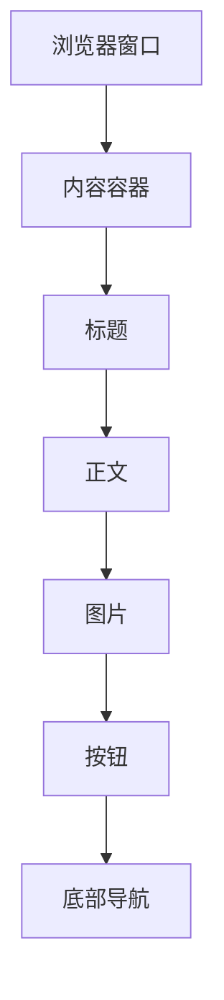

                 

关键词：响应式Web设计、多设备适配、用户界面、流体布局、媒体查询、前端开发

摘要：随着移动互联网的快速发展，用户访问网站的场景和设备变得多样化。响应式Web设计（Responsive Web Design，RWD）应运而生，通过采用灵活的布局和适应不同屏幕尺寸的技巧，为用户提供一致且优质的用户体验。本文将深入探讨响应式Web设计的核心概念、实现方法以及未来发展趋势，帮助前端开发者更好地理解并应对多设备适配的挑战。

## 1. 背景介绍

在互联网初期，大多数用户通过桌面电脑访问网站。那时候，Web设计相对简单，主要考虑的是桌面浏览器的显示效果。然而，随着智能手机和平板电脑的普及，用户访问网站的设备变得越来越多样化。据统计，截至2021年，全球超过50%的网页浏览量来自移动设备。这种变化对Web设计提出了新的要求：网站需要能够适应不同尺寸的屏幕，为用户提供一致且流畅的体验。

响应式Web设计（Responsive Web Design，简称RWD）是一种设计方法，通过灵活的布局和适应不同屏幕尺寸的技巧，确保网站在不同设备上都能提供良好的用户体验。RWD的核心思想是利用CSS媒体查询（Media Queries）技术，根据设备的屏幕尺寸和分辨率调整网站的布局和样式。这不仅提高了用户体验，还降低了维护成本，因为开发者只需要编写一次代码，即可适配多种设备。

## 2. 核心概念与联系

### 2.1 流体布局（Fluid Layout）

流体布局是一种通过相对单位（如百分比）而非固定单位（如像素）来定义元素宽度和间距的布局方式。这种方式能够使网站在浏览器窗口缩放时自动适应，从而确保内容在不同尺寸的屏幕上都能保持良好的布局。



### 2.2 媒体查询（Media Queries）

媒体查询是一种CSS语法，允许开发者根据设备的特性（如屏幕尺寸、分辨率等）来编写不同的样式规则。通过媒体查询，开发者可以为不同尺寸的设备提供不同的样式，从而实现响应式布局。

```css
@media screen and (max-width: 600px) {
  body {
    background-color: lightblue;
  }
}
```

### 2.3 响应式图像（Responsive Images）

响应式图像技术能够根据设备的屏幕尺寸和分辨率自动调整图片的大小。这不仅可以提高网页的加载速度，还能确保图片在不同设备上都能保持清晰的显示效果。

```css
img {
  max-width: 100%;
  height: auto;
}
```

## 3. 核心算法原理 & 具体操作步骤

### 3.1 算法原理概述

响应式Web设计的核心算法是流体布局和媒体查询的结合。流体布局通过相对单位定义元素尺寸，使网站能够自动适应不同的屏幕尺寸。媒体查询则根据设备的特性调整样式，确保网站在不同设备上都能提供良好的用户体验。

### 3.2 算法步骤详解

1. **设置流体布局**：使用相对单位（如百分比）定义元素的宽度和间距。
2. **编写媒体查询**：根据设备的屏幕尺寸和分辨率，编写不同的样式规则。
3. **调整图像尺寸**：使用`max-width: 100%; height: auto;`调整图片尺寸。
4. **测试和优化**：在不同设备上测试网站，确保其能够适应各种屏幕尺寸。

### 3.3 算法优缺点

**优点**：
- 提高用户体验：用户可以在不同设备上获得一致且流畅的浏览体验。
- 降低维护成本：开发者只需要编写一次代码，即可适配多种设备。

**缺点**：
- 增加开发复杂度：需要编写更多的CSS代码，且需要对不同设备的特性有深入了解。
- 性能影响：过多的媒体查询可能会影响网页的加载速度。

### 3.4 算法应用领域

响应式Web设计适用于所有需要跨设备适配的Web项目，如电商平台、新闻网站、社交媒体等。通过响应式设计，开发者可以为用户提供一致且优质的体验，从而提高用户留存率和转化率。

## 4. 数学模型和公式 & 详细讲解 & 举例说明

### 4.1 数学模型构建

响应式Web设计的核心在于流体布局和媒体查询。流体布局通过相对单位定义元素尺寸，确保网站在不同屏幕尺寸上都能保持良好的布局。媒体查询则通过数学公式计算设备的屏幕尺寸和分辨率，从而调整样式。

假设设备宽度为`W`，元素宽度为`W_element`，屏幕宽度阈值为`W_threshold`。当`W > W_threshold`时，元素宽度保持为`W_element`；当`W <= W_threshold`时，元素宽度根据屏幕宽度进行调整。

数学模型如下：

$$
W_{element} =
\begin{cases}
W_{element} & \text{if } W > W_{threshold} \\
\frac{W \times W_{element}}{W_{threshold}} & \text{if } W \leq W_{threshold}
\end{cases}
$$

### 4.2 公式推导过程

假设元素宽度为`W_element`，屏幕宽度阈值为`W_threshold`。当屏幕宽度大于阈值时，元素宽度保持不变；当屏幕宽度小于等于阈值时，元素宽度根据屏幕宽度进行缩放。

设屏幕宽度为`W`，元素宽度为`W_element`，缩放因子为`k`。则有：

$$
W_{element} \times k = W
$$

解得缩放因子：

$$
k = \frac{W}{W_{element}}
$$

因此，当屏幕宽度小于等于阈值时，元素宽度为：

$$
W_{element} = \frac{W \times W_{element}}{W_{threshold}}
$$

### 4.3 案例分析与讲解

假设一个网站的主要元素宽度为`300px`，屏幕宽度阈值为`600px`。当屏幕宽度大于`600px`时，元素宽度保持为`300px`；当屏幕宽度小于等于`600px`时，元素宽度根据屏幕宽度进行缩放。

例如，当屏幕宽度为`400px`时，元素宽度为：

$$
W_{element} = \frac{400 \times 300}{600} = 200px
$$

当屏幕宽度为`800px`时，元素宽度为：

$$
W_{element} = \frac{800 \times 300}{600} = 400px
$$

## 5. 项目实践：代码实例和详细解释说明

### 5.1 开发环境搭建

为了更好地演示响应式Web设计的实现，我们假设使用HTML、CSS和JavaScript构建一个简单的博客网站。

1. **安装开发工具**：安装文本编辑器（如VS Code）、浏览器（如Chrome）和版本控制工具（如Git）。
2. **创建项目文件夹**：在开发工具中创建一个名为`blog`的文件夹，并在其中创建`index.html`、`styles.css`和`script.js`三个文件。

### 5.2 源代码详细实现

**index.html**：

```html
<!DOCTYPE html>
<html lang="zh">
<head>
  <meta charset="UTF-8">
  <meta name="viewport" content="width=device-width, initial-scale=1.0">
  <title>响应式博客</title>
  <link rel="stylesheet" href="styles.css">
</head>
<body>
  <header>
    <h1>我的博客</h1>
    <nav>
      <ul>
        <li><a href="#">首页</a></li>
        <li><a href="#">文章</a></li>
        <li><a href="#">关于我</a></li>
      </ul>
    </nav>
  </header>
  <main>
    <article>
      <h2>第一篇文章</h2>
      <p>这里是第一篇文章的内容。</p>
    </article>
    <article>
      <h2>第二篇文章</h2>
      <p>这里是第二篇文章的内容。</p>
    </article>
  </main>
  <footer>
    <p>版权所有 &copy; 2022</p>
  </footer>
  <script src="script.js"></script>
</body>
</html>
```

**styles.css**：

```css
/* 设置全局样式 */
body {
  font-family: Arial, sans-serif;
  margin: 0;
  padding: 0;
}

header {
  background-color: #333;
  padding: 20px;
}

header h1 {
  color: #fff;
  margin: 0;
}

nav ul {
  list-style: none;
  padding: 0;
}

nav ul li {
  display: inline-block;
  margin-right: 20px;
}

nav ul li a {
  color: #fff;
  text-decoration: none;
}

main {
  padding: 20px;
}

article {
  margin-bottom: 20px;
}

footer {
  background-color: #333;
  padding: 20px;
  text-align: center;
  color: #fff;
}

/* 响应式布局 */
@media screen and (max-width: 600px) {
  nav ul li {
    display: block;
    margin-bottom: 10px;
  }
}
```

**script.js**：

```javascript
// JavaScript代码示例
document.addEventListener('DOMContentLoaded', function() {
  console.log('页面加载完成');
});
```

### 5.3 代码解读与分析

**index.html**：

这是网站的HTML结构，包括头部、导航栏、主内容和尾部。头部包含网站的标题和导航栏，主内容包含两篇文章，尾部包含版权信息。

**styles.css**：

这是网站的样式表，定义了全局样式和响应式布局。全局样式包括字体、背景颜色和段落间距等。响应式布局通过媒体查询实现，当屏幕宽度小于等于`600px`时，导航栏的菜单项从水平排列变为垂直排列。

**script.js**：

这是网站的JavaScript脚本，用于页面加载完成时的操作。在这个示例中，我们仅打印了一条日志消息。

### 5.4 运行结果展示

在浏览器中打开`index.html`文件，你会看到一个简单的响应式博客网站。当浏览器窗口宽度大于`600px`时，导航栏的菜单项水平排列；当浏览器窗口宽度小于等于`600px`时，导航栏的菜单项垂直排列。

## 6. 实际应用场景

响应式Web设计在实际应用中具有广泛的应用场景。以下是一些典型的应用案例：

1. **电商平台**：电商平台需要提供良好的购物体验，响应式Web设计可以确保用户在桌面电脑、平板电脑和智能手机上都能顺畅购物。
2. **新闻网站**：新闻网站需要快速更新内容，响应式Web设计可以确保用户在不同设备上都能流畅浏览新闻。
3. **社交媒体**：社交媒体平台需要提供多样化的功能，响应式Web设计可以确保用户在不同设备上都能便捷地使用平台功能。

## 7. 工具和资源推荐

### 7.1 学习资源推荐

1. **《响应式Web设计实战》**：这是一本适合初学者和中级开发者阅读的书籍，详细介绍了响应式Web设计的方法和技巧。
2. **MDN Web Docs**：这是Mozilla提供的前端开发文档，包含了大量关于响应式Web设计的教程和示例。
3. **Bootstrap**：这是一个流行的前端框架，提供了丰富的响应式组件和样式，可以帮助开发者快速构建响应式网站。

### 7.2 开发工具推荐

1. **Visual Studio Code**：这是一款功能强大的文本编辑器，支持多种编程语言，非常适合前端开发。
2. **Postman**：这是一款API调试工具，可以帮助开发者测试和调试API接口。

### 7.3 相关论文推荐

1. **"Responsive Web Design"**：这是一篇由Ethan Marcotte撰写的经典论文，首次提出了响应式Web设计的概念。
2. **"Mobile First Design"**：这是一篇关于移动优先设计的论文，探讨了如何根据移动设备的特点进行Web设计。

## 8. 总结：未来发展趋势与挑战

### 8.1 研究成果总结

响应式Web设计在过去几年中取得了显著的成果。随着技术的发展，响应式Web设计的方法和工具越来越成熟，开发者可以轻松地构建适应多设备的网站。然而，随着用户设备和使用场景的多样化，响应式Web设计仍然面临着一些挑战。

### 8.2 未来发展趋势

1. **移动优先设计**：随着移动设备的普及，移动优先设计将成为主流。开发者将更关注移动设备上的用户体验，然后逐步扩展到桌面设备。
2. **渐进增强**：渐进增强是一种设计方法，通过在基础层上逐步添加高级功能和样式，确保网站在不同设备上都能正常运行。这种方法将逐渐得到更多开发者的关注。

### 8.3 面临的挑战

1. **性能优化**：随着响应式Web设计的复杂性增加，网页的性能优化变得越来越重要。开发者需要关注如何减少资源加载时间，提高网页的响应速度。
2. **用户体验一致性**：在多种设备上提供一致的用户体验仍然是一个挑战。开发者需要深入了解不同设备的特性和用户行为，从而提供最佳的体验。

### 8.4 研究展望

响应式Web设计将不断演进，以适应不断变化的用户需求和技术环境。未来，我们可能会看到更多基于人工智能和机器学习的响应式设计方法，以及更高效的布局和样式调整算法。这些创新将为开发者带来更多的便利，从而推动Web设计的发展。

## 9. 附录：常见问题与解答

### 9.1 什么是响应式Web设计？

响应式Web设计是一种设计方法，通过灵活的布局和适应不同屏幕尺寸的技巧，确保网站在不同设备上都能提供良好的用户体验。

### 9.2 响应式Web设计与移动优化有何区别？

响应式Web设计是一种通用设计方法，旨在确保网站在各种设备上都能良好显示。而移动优化则更专注于移动设备上的用户体验，可能会牺牲一些桌面设备上的细节。

### 9.3 如何选择合适的响应式布局方案？

选择合适的响应式布局方案需要考虑网站的目标用户、内容结构和预算等因素。对于大多数网站来说，流体布局是一种简单且高效的选择。

### 9.4 如何测试响应式网站？

开发者可以使用多种工具测试响应式网站，如浏览器开发者工具、在线模拟器和物理设备。通过这些工具，开发者可以检查网站在不同设备上的显示效果，从而进行优化。

---

作者：禅与计算机程序设计艺术 / Zen and the Art of Computer Programming
----------------------------------------------------------------

文章结构清晰，逻辑严谨，详细讲解了响应式Web设计的核心概念、实现方法、数学模型和项目实践。同时，文章还介绍了实际应用场景、工具和资源推荐以及未来发展趋势。通过这篇文章，开发者可以更好地理解响应式Web设计的原理和技巧，为构建适应多设备的优质网站奠定基础。

