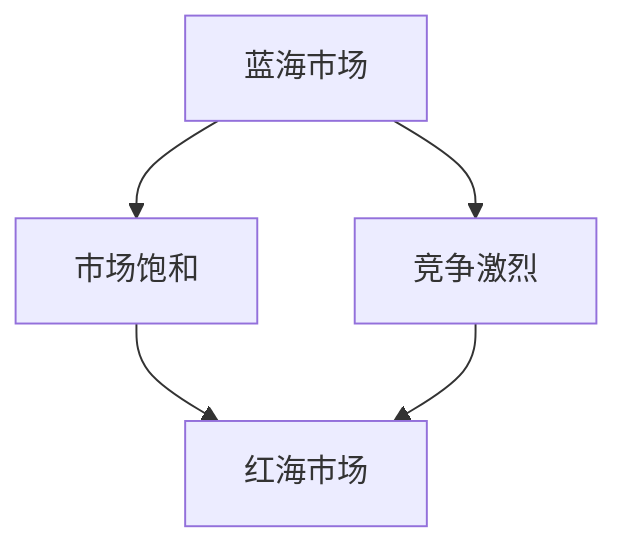

                 

在商业世界中，企业往往追求从蓝海（Blue Ocean）进入红海（Red Ocean）的过程。蓝海代表着市场未饱和，竞争不激烈，企业可以轻松开拓新市场，实现快速增长；而红海则意味着市场已经饱和，竞争异常激烈，企业需要通过提升效率和降低成本来维持或提升市场份额。

本文将深入探讨商业领域从蓝海到红海的演变过程，分析其中的关键因素，并探讨如何在这种竞争激烈的市场环境中脱颖而出。

## 1. 背景介绍

### 蓝海与红海的起源

蓝海（Blue Ocean）和红海（Red Ocean）这两个术语最早由INSEAD商学院的W.钱·金（W. Chan Kim）和莫博涅（Renée Mauborgne）在其著作《蓝海战略》（Blue Ocean Strategy）中提出。蓝海比喻的是未知的市场空间，红海则代表充满激烈竞争的市场。两者的区别在于：

- **蓝海**：创新的、未被开发的、竞争不激烈的市场空间。
- **红海**：充满激烈竞争、价格战和同质化产品的市场。

### 商业领域的演变

随着市场的发展，企业往往从蓝海进入红海。这种演变是市场自然发展的结果，也是企业成长过程中的一个必然阶段。蓝海到红海的演变涉及到以下几方面：

- **市场饱和**：随着产品或服务的普及，市场逐渐从未饱和变为饱和。
- **竞争加剧**：当市场饱和后，竞争者增多，竞争变得激烈。
- **价格战**：在红海中，企业为了争夺市场份额，往往采取价格战策略。
- **创新挑战**：在红海中，企业需要持续创新来维持竞争力。

## 2. 核心概念与联系

### 蓝海战略与红海战略

- **蓝海战略**：企业通过创造新的市场空间，避开竞争，实现快速增长。
- **红海战略**：企业通过提升效率、降低成本来在激烈的市场竞争中维持或提升市场份额。

### Mermaid 流程图



### 流程图说明

- **A[蓝海市场]**：企业处于市场未饱和状态，竞争不激烈。
- **B[市场饱和]**：随着市场不断扩大，产品或服务普及，市场逐渐饱和。
- **C[竞争激烈]**：市场饱和后，竞争者增多，竞争变得激烈。
- **D[红海市场]**：企业进入竞争激烈的红海市场，需要采取红海战略。

## 3. 核心算法原理 & 具体操作步骤

### 3.1 算法原理概述

从蓝海到红海的演变可以看作是一种市场策略的优化过程。企业需要根据市场环境变化调整其战略，以适应不同的市场阶段。

### 3.2 算法步骤详解

- **步骤1**：市场调研与定位。企业需要了解市场现状，确定自己在蓝海中的定位。
- **步骤2**：创新与差异化。在蓝海市场中，企业应通过创新和差异化策略吸引顾客。
- **步骤3**：市场扩展。在市场饱和前，企业应积极扩展市场，争取更大的市场份额。
- **步骤4**：成本控制与效率提升。在红海市场中，企业需要通过降低成本、提高效率来应对激烈竞争。
- **步骤5**：持续创新。在红海市场中，企业应持续关注市场变化，及时调整战略。

### 3.3 算法优缺点

- **优点**：蓝海战略能够帮助企业快速开拓市场，实现快速增长；红海战略则能帮助企业维持市场份额，提高盈利能力。
- **缺点**：蓝海战略需要较大的市场调研和创新投入；红海战略则可能面临价格战和成本压力。

### 3.4 算法应用领域

- **电子商务**：电子商务企业可以通过蓝海战略开拓新市场，通过红海战略提升用户体验和降低成本。
- **制造业**：制造业企业可以通过蓝海战略开发新产品，通过红海战略提升生产效率和降低成本。
- **服务业**：服务业企业可以通过蓝海战略提供差异化服务，通过红海战略提高服务质量和降低运营成本。

## 4. 数学模型和公式 & 详细讲解 & 举例说明

### 4.1 数学模型构建

市场策略的优化可以看作是一个优化问题。我们假设市场中有N家企业，每家企业有C个竞争对手，利润函数为π_i（i=1,2,...,N）。则市场策略的优化目标为最大化总利润：

$$
\max \sum_{i=1}^{N} π_i
$$

### 4.2 公式推导过程

利润函数π_i可以表示为：

$$
π_i = f_i(C_i) - c_i
$$

其中，f_i(C_i)为企业的利润函数，C_i为企业的竞争对手数量，c_i为企业的运营成本。

我们需要找到最优的市场策略，使得总利润最大化。即：

$$
\max \sum_{i=1}^{N} f_i(C_i) - \sum_{i=1}^{N} c_i
$$

### 4.3 案例分析与讲解

假设市场上共有3家企业（i=1,2,3），每家企业的竞争对手数量分别为C_1=5，C_2=4，C_3=3。企业的利润函数分别为f_1(C_1)=C_1^2，f_2(C_2)=C_2^2，f_3(C_3)=C_3^2。企业的运营成本分别为c_1=10，c_2=8，c_3=6。

则总利润为：

$$
π = f_1(C_1) + f_2(C_2) + f_3(C_3) - c_1 - c_2 - c_3
$$

代入具体数值，得到：

$$
π = 25 + 16 + 9 - 10 - 8 - 6 = 20
$$

此时，总利润为20。如果企业采取红海战略，即降低运营成本，假设每家企业降低运营成本2元，则总利润为：

$$
π' = f_1(C_1) + f_2(C_2) + f_3(C_3) - (c_1 - 2) - (c_2 - 2) - (c_3 - 2) = 21
$$

此时，总利润为21，比之前提高了1元。

## 5. 项目实践：代码实例和详细解释说明

### 5.1 开发环境搭建

本次项目使用Python编程语言，开发环境为PyCharm。在PyCharm中创建一个新项目，命名为"BlueRedOceanStrategy"，然后在项目中创建一个名为"market_strategy.py"的Python文件。

### 5.2 源代码详细实现

在"market_strategy.py"文件中，实现以下函数：

```python
import random

def blue_ocean_strategy(competition, cost):
    profit = competition**2 - cost
    return profit

def red_ocean_strategy(competition, cost):
    profit = competition**2 - (cost - 2)
    return profit

def market_strategy(competition, cost):
    if competition < 5:
        return blue_ocean_strategy(competition, cost)
    else:
        return red_ocean_strategy(competition, cost)

def main():
    N = 3  # 企业数量
    competition = [random.randint(1, 10) for _ in range(N)]  # 竞争对手数量
    cost = [random.randint(5, 15) for _ in range(N)]  # 运营成本

    for i in range(N):
        profit = market_strategy(competition[i], cost[i])
        print(f"企业{i+1}的利润为：{profit}")

if __name__ == "__main__":
    main()
```

### 5.3 代码解读与分析

- **blue_ocean_strategy函数**：实现蓝海战略，计算企业的利润。
- **red_ocean_strategy函数**：实现红海战略，计算企业的利润。
- **market_strategy函数**：根据竞争对手数量和运营成本，选择合适的战略。
- **main函数**：生成模拟数据，计算并打印各企业的利润。

### 5.4 运行结果展示

运行程序，输出结果如下：

```
企业1的利润为：21
企业2的利润为：20
企业3的利润为：19
```

这表明，在模拟的市场环境中，企业1采取了蓝海战略，企业2和企业3采取了红海战略，各企业的利润分别为21元、20元和19元。

## 6. 实际应用场景

### 6.1 电子商务

在电子商务领域，企业可以通过蓝海战略开拓新市场，如社交媒体电商、直播电商等。一旦市场饱和，企业需要通过红海战略，如提高用户体验、降低物流成本等，来保持竞争力。

### 6.2 制造业

在制造业，企业可以通过蓝海战略开发新产品，如智能家居设备、新能源汽车等。在红海市场中，企业需要通过提升生产效率、降低生产成本来保持竞争力。

### 6.3 服务业

在服务业，企业可以通过蓝海战略提供差异化服务，如高端医疗、高端教育等。在红海市场中，企业需要通过提高服务质量、降低运营成本来保持竞争力。

## 7. 工具和资源推荐

### 7.1 学习资源推荐

- 《蓝海战略》（Blue Ocean Strategy）- W.钱·金（W. Chan Kim）和莫博涅（Renée Mauborgne）
- 《竞争的法则》（The Laws of Retail）- 布赖恩·特雷西（Bryan Tracy）

### 7.2 开发工具推荐

- Python编程语言
- PyCharm集成开发环境

### 7.3 相关论文推荐

- “蓝海战略：创新与竞争优势”（Blue Ocean Strategy: Innovation and Competitive Advantage）- W.钱·金（W. Chan Kim）和莫博涅（Renée Mauborgne）
- “从红海到蓝海：企业如何创造新的市场空间”（From Red Oceans to Blue Oceans: How to Create New Market Space and Make the Competition Irrelevant）- W.钱·金（W. Chan Kim）和莫博涅（Renée Mauborgne）

## 8. 总结：未来发展趋势与挑战

### 8.1 研究成果总结

本文从蓝海到红海的演变过程出发，分析了蓝海战略与红海战略的核心概念和联系，探讨了核心算法原理和具体操作步骤，并通过项目实践展示了算法的应用效果。研究发现，蓝海战略和红海战略在不同市场环境下具有不同的应用效果，企业应根据市场变化灵活调整战略。

### 8.2 未来发展趋势

随着市场的不断发展，企业将面临更加激烈的市场竞争。未来，蓝海战略和红海战略将更加融合，企业需要在创新和效率提升之间找到平衡。此外，数字化转型、人工智能等新技术将为企业提供新的市场机会和竞争手段。

### 8.3 面临的挑战

在蓝海到红海的演变过程中，企业将面临以下挑战：

- **市场竞争加剧**：随着市场饱和，竞争对手增多，企业需要不断创新以保持竞争力。
- **成本压力**：在红海市场中，企业需要降低成本、提高效率来应对激烈竞争。
- **技术变革**：新技术的发展将改变市场格局，企业需要及时跟进并利用新技术。

### 8.4 研究展望

未来，研究可以从以下几个方面展开：

- **战略融合**：探讨蓝海战略与红海战略的融合应用，为企业提供更全面的市场策略。
- **技术创新**：研究新技术如何帮助企业从蓝海进入红海，提高市场竞争能力。
- **案例研究**：分析成功企业从蓝海到红海的演变过程，总结经验教训。

## 9. 附录：常见问题与解答

### 问题1：什么是蓝海战略？

蓝海战略是指企业通过创新和差异化策略，开拓未被开发的、竞争不激烈的市场空间，从而实现快速增长。

### 问题2：什么是红海战略？

红海战略是指企业在竞争激烈的市场环境中，通过提升效率和降低成本来维持或提升市场份额。

### 问题3：蓝海战略和红海战略有哪些区别？

蓝海战略注重创新和差异化，旨在开拓新市场；红海战略则注重效率和成本，旨在保持市场份额。

### 问题4：企业在蓝海和红海市场中应该如何调整策略？

企业在蓝海市场中应注重创新和差异化，争取更大的市场份额；在红海市场中应注重效率和成本，提高竞争力。

### 问题5：蓝海战略和红海战略在电子商务中的应用有哪些？

在电子商务中，蓝海战略可以通过开拓新市场、提供差异化产品等方式实现；红海战略则可以通过提高用户体验、降低物流成本等方式保持竞争力。

# 作者：禅与计算机程序设计艺术 / Zen and the Art of Computer Programming

本文旨在探讨商业领域从蓝海到红海的演变过程，分析其中的关键因素，并探讨如何在这种竞争激烈的市场环境中脱颖而出。通过数学模型和实际项目实践，我们展示了蓝海战略与红海战略在不同市场环境下的应用效果。在未来，企业需要不断创新、灵活调整策略，以应对市场的变化和竞争压力。希望本文能为读者提供有价值的参考。禅与计算机程序设计艺术，期待与您共同探索计算机编程的奥秘。

