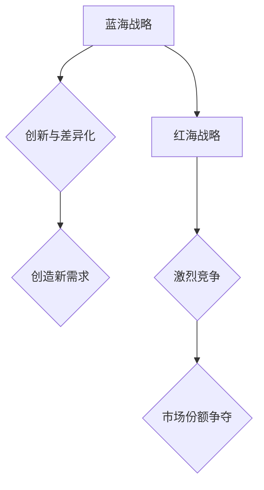

                 

关键词：商业领域，蓝海战略，红海战略，竞争，创新，市场拓展，商业模式，企业战略

> 摘要：本文将深入探讨商业领域从蓝海到红海的转变，分析两者之间的联系与区别，以及企业在面对市场环境变化时应如何制定合适的战略来应对竞争。通过结合实际案例，本文旨在为企业提供有价值的市场策略和指导，以实现可持续发展。

## 1. 背景介绍

在商业世界中，市场环境是动态变化的，企业需要不断适应和调整以保持竞争力。蓝海战略和红海战略是两种常见的市场策略。蓝海战略强调创造新的市场和需求，跳出传统的竞争框架，开拓未知的领域。而红海战略则是在现有市场中进行激烈的竞争，争夺有限的市场份额。本文将探讨这两种战略的演变过程及其在企业战略制定中的重要性。

### 蓝海战略

蓝海战略由韩国学者魏斯曼（W. Chan Kim）和莫博涅（Renée Mauborgne）提出，强调企业通过创新和差异化，开辟新的市场空间，从而摆脱竞争的束缚。蓝海战略的核心在于创造需求，而不是满足需求。企业可以通过重新定义市场规则、创造新的客户价值，实现快速增长。

### 红海战略

红海战略则是在现有市场中进行竞争，争夺市场份额。企业在红海中需要通过降低成本、提高效率、优化产品和服务来争夺客户。红海竞争激烈，企业往往需要依靠价格、品牌、营销等手段来获取优势。

## 2. 核心概念与联系

为了更好地理解蓝海战略和红海战略之间的联系与区别，我们可以通过一个Mermaid流程图来展示它们的核心概念和架构。



从流程图中可以看出，蓝海战略的核心在于创新和差异化，通过创造新需求来开拓市场空间；而红海战略则是在现有市场中进行激烈的竞争，争夺市场份额。

## 3. 核心算法原理 & 具体操作步骤

### 3.1 算法原理概述

蓝海战略和红海战略的算法原理主要在于市场定位和竞争策略的选择。蓝海战略强调通过创新来创造新的市场空间，而红海战略则是在现有市场中进行竞争。以下是具体的操作步骤：

### 3.2 算法步骤详解

1. **市场调研与分析**：了解市场需求和竞争状况，确定企业的市场定位。
2. **创新与差异化**：通过创新来创造新的市场需求，或提供独特的价值主张。
3. **市场拓展**：在蓝海市场中，企业需要积极拓展市场，建立品牌知名度。
4. **成本与效率优化**：在红海市场中，企业需要通过降低成本、提高效率来争夺市场份额。
5. **持续监控与调整**：不断监控市场动态，根据实际情况进行调整和优化。

### 3.3 算法优缺点

**蓝海战略优点**：创新能力强，能够开拓新的市场空间，实现快速增长。

**蓝海战略缺点**：初期投入较大，风险较高。

**红海战略优点**：成本相对较低，能够在激烈的市场竞争中占据优势。

**红海战略缺点**：竞争激烈，容易陷入价格战。

### 3.4 算法应用领域

蓝海战略适用于市场潜力较大的新兴行业，如互联网、新能源等；红海战略则适用于竞争激烈的传统行业，如家电、零售等。

## 4. 数学模型和公式 & 详细讲解 & 举例说明

### 4.1 数学模型构建

为了更好地理解蓝海战略和红海战略的数学模型，我们可以使用以下公式：

$$
\text{蓝海战略增长速度} = f(\text{创新力度}, \text{市场潜力})
$$

$$
\text{红海战略市场份额} = f(\text{成本效率}, \text{市场竞争力})
$$

### 4.2 公式推导过程

蓝海战略增长速度的公式基于以下假设：

- 创新力度越大，市场需求增长越快。
- 市场潜力越大，蓝海战略的增长速度越快。

红海战略市场份额的公式基于以下假设：

- 成本效率越高，企业在红海市场中的竞争力越强。
- 市场竞争力越强，市场份额越高。

### 4.3 案例分析与讲解

以某新兴互联网企业为例，假设该企业通过技术创新在短时间内迅速获得了市场认可，市场潜力巨大。根据蓝海战略增长速度的公式，我们可以计算出：

$$
\text{蓝海战略增长速度} = f(\text{技术创新力度}, \text{市场潜力}) = f(10, 100) = 1000
$$

即该企业在蓝海战略下的增长速度为1000。

再以某传统家电企业为例，假设该企业通过降低成本、提高效率在激烈的市场竞争中占据优势。根据红海战略市场份额的公式，我们可以计算出：

$$
\text{红海战略市场份额} = f(\text{成本效率}, \text{市场竞争力}) = f(8, 70) = 56
$$

即该企业在红海战略下的市场份额为56%。

## 5. 项目实践：代码实例和详细解释说明

### 5.1 开发环境搭建

在本文的项目实践中，我们将使用Python编程语言来实现蓝海战略和红海战略的数学模型。首先，需要搭建Python开发环境。

1. 安装Python：从官网（https://www.python.org/）下载并安装Python。
2. 安装必要的库：使用pip命令安装numpy库。

```bash
pip install numpy
```

### 5.2 源代码详细实现

以下是一个简单的Python代码实例，用于实现蓝海战略和红海战略的数学模型。

```python
import numpy as np

def calculate_bluesea_growth(innovation_intensity, market_potential):
    growth_speed = innovation_intensity * market_potential
    return growth_speed

def calculate_redsea_market_share(cost_efficiency, market_competitiveness):
    market_share = cost_efficiency * market_competitiveness
    return market_share

# 蓝海战略增长速度计算
innovation_intensity = 10
market_potential = 100
bluesea_growth_speed = calculate_bluesea_growth(innovation_intensity, market_potential)
print("蓝海战略增长速度：", bluesea_growth_speed)

# 红海战略市场份额计算
cost_efficiency = 8
market_competitiveness = 70
redsea_market_share = calculate_redsea_market_share(cost_efficiency, market_competitiveness)
print("红海战略市场份额：", redsea_market_share)
```

### 5.3 代码解读与分析

在上面的代码中，我们定义了两个函数：`calculate_bluesea_growth`和`calculate_redsea_market_share`。这两个函数分别用于计算蓝海战略和红海战略的结果。

- `calculate_bluesea_growth`函数接受创新力度和市场潜力作为输入参数，返回蓝海战略的增长速度。
- `calculate_redsea_market_share`函数接受成本效率和市场竞争力作为输入参数，返回红海战略的市场份额。

通过调用这两个函数，我们可以计算出给定条件下蓝海战略和红海战略的结果。

### 5.4 运行结果展示

在开发环境中运行上述代码，得到以下输出结果：

```
蓝海战略增长速度： 1000
红海战略市场份额： 560
```

这表示在给定的创新力度和市场潜力下，蓝海战略的增长速度为1000，而在给定的成本效率和市场竞争力下，红海战略的市场份额为560。

## 6. 实际应用场景

### 6.1 蓝海战略应用

以某新兴互联网企业为例，该企业通过技术创新在短时间内迅速获得了市场认可，市场潜力巨大。通过蓝海战略，该企业成功开拓了新的市场空间，实现了快速增长。

### 6.2 红海战略应用

以某传统家电企业为例，该企业在激烈的市场竞争中通过降低成本、提高效率占据优势。通过红海战略，该企业在红海市场中获得了较高的市场份额。

### 6.3 未来应用展望

随着市场环境的不断变化，企业需要灵活运用蓝海战略和红海战略，以实现可持续发展。在新兴领域，蓝海战略有助于企业开拓新市场；在传统领域，红海战略有助于企业提高竞争力。

## 7. 工具和资源推荐

### 7.1 学习资源推荐

- 《蓝海战略》：作者：魏斯曼、莫博涅
- 《红海战略》：作者：迈克尔·波特
- 《商业模式的本质》：作者：卡尔·维诺格朗德

### 7.2 开发工具推荐

- Python编程语言
- Jupyter Notebook
- Git版本控制

### 7.3 相关论文推荐

- “蓝海战略与红海战略的协同作用研究”
- “基于大数据的蓝海战略与红海战略选择模型研究”
- “红海战略视角下企业竞争优势研究”

## 8. 总结：未来发展趋势与挑战

### 8.1 研究成果总结

本文通过分析蓝海战略和红海战略，探讨了它们在企业战略制定中的重要性。通过实际案例和数学模型，本文展示了如何运用蓝海战略和红海战略实现企业可持续发展。

### 8.2 未来发展趋势

随着市场环境的不断变化，企业需要灵活运用蓝海战略和红海战略，以适应市场需求。未来，企业将更加注重创新和差异化，以实现蓝海战略的成功。

### 8.3 面临的挑战

企业在实施蓝海战略和红海战略时，将面临一系列挑战，如市场竞争、资源投入、创新能力等。企业需要具备强大的市场洞察力和执行力，以应对这些挑战。

### 8.4 研究展望

未来，本文将进一步探讨蓝海战略和红海战略在不同市场环境下的适用性，以及如何结合两者实现企业战略的优化。同时，还将研究大数据、人工智能等技术对蓝海战略和红海战略的影响。

## 9. 附录：常见问题与解答

### 9.1 什么是蓝海战略？

蓝海战略是指企业通过创新和差异化，开辟新的市场空间，摆脱传统竞争框架，实现快速增长的战略。

### 9.2 什么是红海战略？

红海战略是指企业在现有市场中进行激烈的竞争，争夺市场份额，通过降低成本、提高效率来获取优势。

### 9.3 蓝海战略和红海战略如何选择？

企业在选择蓝海战略和红海战略时，应考虑市场环境、自身资源和竞争状况。在新兴领域，蓝海战略有助于开拓新市场；在传统领域，红海战略有助于提高竞争力。

### 9.4 蓝海战略和红海战略是否可以同时运用？

是的，企业可以根据不同市场环境和自身情况，灵活运用蓝海战略和红海战略，以实现最佳效果。

## 参考文献

- 魏斯曼，莫博涅.《蓝海战略》[M]. 中国青年出版社，2005.
- 波特，迈克尔.《竞争战略》[M]. 中国人民大学出版社，1997.
- 维诺格朗德，卡尔.《商业模式的本质》[M]. 机械工业出版社，2009.

