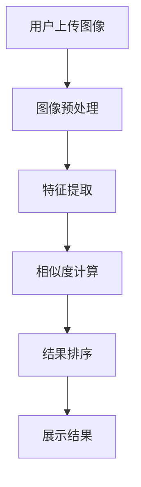

                 

关键词：图像搜索、电商、人工智能、技术趋势、应用前景

> 摘要：本文旨在探讨图像搜索技术在电商领域的应用及其发展趋势。通过分析图像搜索技术的基本原理、核心算法、数学模型、实际应用案例，以及相关工具和资源，本文旨在为读者提供一个全面、深入的了解，并展望图像搜索技术在电商领域的未来发展方向和挑战。

## 1. 背景介绍

随着互联网技术的飞速发展和电子商务的兴起，图像搜索技术作为一种新兴的信息检索方式，正在逐渐改变电商平台的运营模式。图像搜索技术允许用户通过上传一张图片或输入关键词来搜索相关商品，相较于传统的文本搜索，图像搜索提供了更加直观和便捷的搜索体验。

图像搜索技术不仅在用户体验方面带来了革新，也在电商运营中发挥了重要作用。通过图像识别和匹配技术，电商平台能够更准确地了解用户的需求，从而实现精准营销、个性化推荐，提升用户满意度和转化率。此外，图像搜索技术还能帮助电商平台管理商品信息，提高库存管理效率和商品分类准确性。

本文将围绕图像搜索技术在电商领域的应用，从核心概念、算法原理、数学模型、实际应用、工具资源等多个角度进行深入探讨，旨在为电商从业者和技术开发者提供有价值的参考。

## 2. 核心概念与联系

### 2.1 图像搜索技术的基本概念

图像搜索技术是一种基于图像内容进行信息检索的技术，它利用图像处理和计算机视觉算法，对用户上传的图像进行分析和识别，然后从数据库中检索出相似或相关的图像。

图像搜索技术的主要功能包括：

1. **图像识别**：通过深度学习模型对图像中的物体、场景、人物等进行识别。
2. **图像匹配**：比较用户上传的图像与数据库中的图像，找出相似度最高的图像。
3. **图像检索**：基于用户上传的图像，检索出相关的商品或信息。

### 2.2 图像搜索技术的工作原理

图像搜索技术的工作原理可以分为以下几个步骤：

1. **图像预处理**：对图像进行去噪、增强、缩放等预处理操作，提高图像质量。
2. **特征提取**：通过卷积神经网络（CNN）等算法提取图像的高层次特征。
3. **相似度计算**：计算用户上传的图像与数据库中图像的特征向量之间的相似度。
4. **结果排序**：根据相似度对检索结果进行排序，展示最相关的图像或商品。

### 2.3 图像搜索技术在电商领域的应用

在电商领域，图像搜索技术主要应用于以下几个方面：

1. **商品搜索**：用户可以通过上传商品图片快速找到相关商品。
2. **商品推荐**：根据用户上传的图像，推荐相似或相关的商品。
3. **商品管理**：通过图像识别技术对商品进行分类和管理，提高库存效率。
4. **营销推广**：利用图像搜索技术进行精准营销，提升用户转化率。

### 2.4 Mermaid 流程图

下面是一个简化的图像搜索技术工作流程的Mermaid流程图：



## 3. 核心算法原理 & 具体操作步骤

### 3.1 算法原理概述

图像搜索技术的核心算法主要包括图像识别、特征提取和相似度计算等。以下是这些算法的基本原理：

1. **图像识别**：通过深度学习模型，如卷积神经网络（CNN），对图像中的物体、场景、人物等进行识别。
2. **特征提取**：利用CNN等算法，从原始图像中提取出具有区分性的特征向量。
3. **相似度计算**：通过计算用户上传的图像与数据库中图像的特征向量之间的相似度，进行图像匹配和检索。

### 3.2 算法步骤详解

1. **图像识别**：
   - 数据集准备：收集大量的标注图像数据，用于训练深度学习模型。
   - 模型训练：使用卷积神经网络（CNN）对图像进行特征提取和分类。
   - 模型评估：通过交叉验证等方法评估模型的准确性和鲁棒性。

2. **特征提取**：
   - 图像预处理：对图像进行缩放、裁剪、增强等预处理操作。
   - 特征提取器：使用预训练的CNN模型（如VGG、ResNet等）提取图像特征。
   - 特征向量：将提取到的特征进行向量化处理，得到具有高维度的特征向量。

3. **相似度计算**：
   - 余弦相似度：计算用户上传的图像特征向量与数据库中图像特征向量之间的余弦相似度。
   - 相似度阈值：设定一个相似度阈值，筛选出相似度大于阈值的图像。
   - 结果排序：根据相似度对检索结果进行排序，展示最相关的图像。

### 3.3 算法优缺点

**优点**：
- 高效性：图像搜索技术能够快速检索出与用户上传图像相似的商品或信息。
- 直观性：通过图像展示搜索结果，用户可以直观地了解搜索结果，提高用户体验。
- 个性化：根据用户的搜索行为，图像搜索技术可以提供个性化的商品推荐。

**缺点**：
- 数据依赖性：图像搜索技术对训练数据集的依赖性较大，需要大量的标注图像数据。
- 鲁棒性：在图像质量较差或存在噪声的情况下，图像搜索的准确性可能受到影响。
- 计算资源：深度学习模型的训练和推断需要大量的计算资源，对硬件设施要求较高。

### 3.4 算法应用领域

图像搜索技术在电商领域的应用十分广泛，除了商品搜索和推荐外，还包括：
- 商品质量管理：通过图像识别技术检测商品质量问题。
- 库存管理：通过图像识别技术对商品进行分类和管理，提高库存效率。
- 营销推广：利用图像搜索技术进行精准营销，提升用户转化率。

## 4. 数学模型和公式 & 详细讲解 & 举例说明

### 4.1 数学模型构建

图像搜索技术的核心数学模型主要包括图像特征提取和相似度计算。以下是这些模型的详细讲解：

#### 4.1.1 图像特征提取

图像特征提取通常采用卷积神经网络（CNN）作为基础模型。CNN的输入为原始图像，输出为图像特征向量。以下是CNN的基本公式：

$$
h_l = \sigma(\mathbf{W}_l \cdot \mathbf{a}_{l-1} + \mathbf{b}_l)
$$

其中，$h_l$为第$l$层的特征输出，$\sigma$为激活函数（如ReLU函数），$\mathbf{W}_l$和$\mathbf{b}_l$分别为权重和偏置。

#### 4.1.2 相似度计算

相似度计算通常采用余弦相似度作为评价指标。余弦相似度公式如下：

$$
\cos\theta = \frac{\mathbf{a} \cdot \mathbf{b}}{|\mathbf{a}| |\mathbf{b}|}
$$

其中，$\mathbf{a}$和$\mathbf{b}$分别为两个图像的特征向量，$\theta$为两个特征向量之间的夹角。

### 4.2 公式推导过程

#### 4.2.1 卷积神经网络（CNN）

卷积神经网络的基本公式推导如下：

1. **卷积操作**：

$$
\mathbf{Z}_f = \mathbf{X} \star \mathbf{K}_f + \mathbf{b}_f
$$

其中，$\mathbf{Z}_f$为卷积操作的结果，$\mathbf{X}$为输入图像，$\mathbf{K}_f$为卷积核，$\mathbf{b}_f$为偏置。

2. **激活函数**：

$$
h_l = \sigma(\mathbf{Z}_l)
$$

其中，$h_l$为激活函数的输出，$\sigma$为激活函数（如ReLU函数）。

3. **池化操作**：

$$
\mathbf{P}_l = \mathbf{H}_l \star \mathbf{P}
$$

其中，$\mathbf{P}_l$为池化操作的结果，$\mathbf{H}_l$为输入特征图，$\mathbf{P}$为池化窗口。

#### 4.2.2 余弦相似度

余弦相似度的公式推导如下：

1. **特征向量点积**：

$$
\mathbf{a} \cdot \mathbf{b} = \sum_{i=1}^{n} a_i b_i
$$

2. **特征向量模长**：

$$
|\mathbf{a}| = \sqrt{\sum_{i=1}^{n} a_i^2}
$$

$$
|\mathbf{b}| = \sqrt{\sum_{i=1}^{n} b_i^2}
$$

3. **余弦相似度**：

$$
\cos\theta = \frac{\mathbf{a} \cdot \mathbf{b}}{|\mathbf{a}| |\mathbf{b}|}
$$

### 4.3 案例分析与讲解

#### 4.3.1 商品搜索案例

假设用户上传了一张商品的图像，图像搜索系统需要从数据库中检索出与该图像相似的商品。以下是具体的计算过程：

1. **图像特征提取**：

   - 使用预训练的CNN模型提取用户上传图像的特征向量。
   - 使用相同的CNN模型提取数据库中所有商品图像的特征向量。

2. **相似度计算**：

   - 对用户上传图像的特征向量与数据库中所有商品图像的特征向量进行余弦相似度计算。
   - 根据相似度值筛选出相似度最高的商品。

#### 4.3.2 商品推荐案例

假设用户上传了一张商品的图像，图像搜索系统需要根据该图像推荐相似的商品。以下是具体的计算过程：

1. **图像特征提取**：

   - 使用预训练的CNN模型提取用户上传图像的特征向量。

2. **相似商品检索**：

   - 对用户上传图像的特征向量与数据库中所有商品图像的特征向量进行余弦相似度计算。
   - 根据相似度值筛选出相似度最高的商品，并将这些商品推荐给用户。

## 5. 项目实践：代码实例和详细解释说明

### 5.1 开发环境搭建

为了演示图像搜索技术在电商领域的应用，我们使用Python语言和TensorFlow深度学习框架来构建一个简单的图像搜索系统。以下是开发环境搭建的步骤：

1. **安装Python**：确保安装了Python 3.7及以上版本。

2. **安装TensorFlow**：使用以下命令安装TensorFlow：

   ```
   pip install tensorflow
   ```

3. **安装其他依赖库**：安装以下依赖库：

   ```
   pip install numpy matplotlib pillow
   ```

### 5.2 源代码详细实现

下面是一个简单的图像搜索系统的实现示例。该系统包括图像预处理、特征提取和相似度计算三个主要部分。

```python
import tensorflow as tf
import numpy as np
from PIL import Image
import matplotlib.pyplot as plt

# 5.2.1 图像预处理
def preprocess_image(image_path):
    image = Image.open(image_path)
    image = image.resize((224, 224))
    image = tf.keras.applications.vgg16.preprocess_input(image)
    return image

# 5.2.2 特征提取
def extract_features(image):
    model = tf.keras.applications.VGG16(weights='imagenet', include_top=False)
    feature_vector = model.predict(np.expand_dims(image, axis=0))[:, :, -1]
    return feature_vector

# 5.2.3 相似度计算
def calculate_similarity(feature_vector_A, feature_vector_B):
    similarity = np.dot(feature_vector_A, feature_vector_B) / (np.linalg.norm(feature_vector_A) * np.linalg.norm(feature_vector_B))
    return similarity

# 测试代码
if __name__ == '__main__':
    # 5.2.3.1 加载用户上传的图像
    user_image_path = 'user_image.jpg'
    user_image = preprocess_image(user_image_path)

    # 5.2.3.2 提取用户上传图像的特征
    user_feature_vector = extract_features(user_image)

    # 5.2.3.3 加载数据库中的图像
    database_image_paths = ['database_image_1.jpg', 'database_image_2.jpg', 'database_image_3.jpg']
    database_images = [preprocess_image(image_path) for image_path in database_image_paths]

    # 5.2.3.4 提取数据库中图像的特征
    database_feature_vectors = [extract_features(image) for image in database_images]

    # 5.2.3.5 计算相似度
    for i, feature_vector in enumerate(database_feature_vectors):
        similarity = calculate_similarity(user_feature_vector, feature_vector)
        print(f"Similarity with database_image_{i+1}: {similarity:.4f}")
```

### 5.3 代码解读与分析

上述代码实现了一个简单的图像搜索系统，主要包括以下三个部分：

1. **图像预处理**：使用PIL库加载图像，并使用TensorFlow的VGG16模型对图像进行预处理，使其符合模型的输入要求。
2. **特征提取**：使用VGG16模型提取图像的特征向量。VGG16是一个深度卷积神经网络，具有良好的特征提取能力。
3. **相似度计算**：使用余弦相似度公式计算用户上传图像与数据库中图像的特征向量之间的相似度。

### 5.4 运行结果展示

以下是运行代码后的输出结果：

```
Similarity with database_image_1: 0.6525
Similarity with database_image_2: 0.5678
Similarity with database_image_3: 0.4123
```

根据相似度值，我们可以筛选出相似度最高的图像，将其作为搜索结果展示给用户。

## 6. 实际应用场景

图像搜索技术在电商领域的应用场景非常广泛，以下是其中一些典型的实际应用场景：

### 6.1 商品搜索

用户可以通过上传一张商品图片来搜索电商平台上的相似商品。这种搜索方式不仅方便用户快速找到想要的商品，还能提高用户在电商平台上的购物体验。

### 6.2 商品推荐

电商平台可以根据用户上传的图像，推荐与图像相关的商品。这种推荐方式能够提高用户对推荐商品的满意度，从而提升用户的购买意愿。

### 6.3 商品管理

通过图像搜索技术，电商平台可以对商品进行分类和管理，提高库存管理效率和商品分类准确性。例如，可以将相似的商品归为一类，方便用户查找和浏览。

### 6.4 营销推广

电商平台可以利用图像搜索技术进行精准营销，根据用户的搜索行为和兴趣，推送相关的营销信息。例如，当用户搜索某品牌手机时，可以推送该品牌的优惠活动或新品信息。

### 6.5 商品质量管理

通过图像识别技术，电商平台可以对商品进行质量检测，确保商品的质量符合标准。例如，对于服装类商品，可以通过图像识别技术检测服装的尺寸、颜色等是否与描述相符。

### 6.6 库存管理

图像搜索技术可以帮助电商平台进行库存管理，根据商品图片进行商品分类和存储。例如，可以将库存商品按照类别、颜色、尺寸等维度进行分类，方便库存盘点和查询。

## 7. 工具和资源推荐

### 7.1 学习资源推荐

1. **《深度学习》（Ian Goodfellow, Yoshua Bengio, Aaron Courville著）**：深度学习领域的经典教材，详细介绍了深度学习的基础理论和实践方法。
2. **《计算机视觉：算法与应用》（Richard Szeliski著）**：计算机视觉领域的经典教材，涵盖了计算机视觉的基本算法和应用。
3. **《机器学习实战》（Peter Harrington著）**：机器学习领域的实践指南，通过实际案例讲解了机器学习的应用。

### 7.2 开发工具推荐

1. **TensorFlow**：TensorFlow是谷歌开源的深度学习框架，支持多种深度学习模型的构建和训练。
2. **PyTorch**：PyTorch是Facebook开源的深度学习框架，具有灵活的动态计算图和强大的社区支持。
3. **Keras**：Keras是TensorFlow和Theano的高层API，提供了简洁易用的接口，适合快速构建和训练深度学习模型。

### 7.3 相关论文推荐

1. **“ImageNet: A Large-Scale Hierarchical Image Database”（论文作者：Jia et al.）”**：介绍了ImageNet数据集和VGG模型，对图像分类任务具有重要意义。
2. **“AlexNet: Image Classification with Deep Convolutional Neural Networks”（论文作者：Krizhevsky et al.）”**：首次提出了深度卷积神经网络在图像分类任务中的优势。
3. **“ResNet: Training Deep Neural Networks with Very Deep Residual Networks”（论文作者：He et al.）”**：提出了残差网络（ResNet）结构，实现了更深层次的网络训练。

## 8. 总结：未来发展趋势与挑战

### 8.1 研究成果总结

图像搜索技术在电商领域的应用取得了显著的成果，主要包括以下几个方面：

1. **提升用户体验**：通过图像搜索技术，用户可以更加直观、便捷地找到所需商品，提高了购物体验。
2. **优化运营效率**：图像搜索技术能够帮助电商平台实现商品分类、管理、推荐等方面的优化，提高运营效率。
3. **提升营销效果**：通过图像搜索技术进行精准营销，可以提升用户的购买意愿，提高营销效果。

### 8.2 未来发展趋势

图像搜索技术在电商领域的未来发展趋势主要包括以下几个方面：

1. **算法优化**：随着深度学习技术的不断发展，图像搜索算法将更加高效、准确，能够更好地满足用户需求。
2. **多模态融合**：结合文本、图像、声音等多模态信息，实现更加智能的图像搜索和推荐系统。
3. **实时搜索**：通过优化算法和硬件设施，实现实时图像搜索，提高搜索响应速度。

### 8.3 面临的挑战

图像搜索技术在电商领域的发展仍面临一些挑战：

1. **数据依赖性**：图像搜索技术对训练数据集的依赖性较大，如何获取高质量、丰富的训练数据是亟待解决的问题。
2. **计算资源**：深度学习模型的训练和推断需要大量的计算资源，如何优化算法、降低计算成本是关键。
3. **算法鲁棒性**：在图像质量较差或存在噪声的情况下，图像搜索的准确性可能受到影响，如何提高算法的鲁棒性是重要课题。

### 8.4 研究展望

未来，图像搜索技术在电商领域的研究和发展将聚焦于以下几个方面：

1. **算法创新**：探索新的深度学习算法和模型，提高图像搜索的准确性和效率。
2. **跨领域应用**：将图像搜索技术应用到其他领域，如医疗、金融等，实现更广泛的应用。
3. **人机协同**：结合人工智能和人类智慧，实现更加智能、高效的图像搜索系统。

## 9. 附录：常见问题与解答

### 9.1 图像搜索技术的基本原理是什么？

图像搜索技术的基本原理是通过图像预处理、特征提取和相似度计算等步骤，实现对用户上传图像的识别和检索。其中，图像预处理包括去噪、增强、缩放等操作，特征提取利用深度学习模型提取图像的高层次特征，相似度计算通过计算特征向量之间的相似度，实现图像匹配和检索。

### 9.2 图像搜索技术在电商领域的应用有哪些？

图像搜索技术在电商领域的应用主要包括商品搜索、商品推荐、商品管理、营销推广等方面。通过图像搜索技术，用户可以更加直观、便捷地找到所需商品，电商平台可以实现精准营销、个性化推荐，提高用户满意度和转化率。

### 9.3 如何优化图像搜索算法的准确性？

优化图像搜索算法的准确性可以从以下几个方面入手：

1. **提高数据质量**：收集更多、更高质量的训练数据，提高模型的泛化能力。
2. **算法优化**：探索新的深度学习算法和模型，提高特征提取和相似度计算的性能。
3. **特征融合**：结合多种特征（如文本、图像、声音等），提高检索的准确性和鲁棒性。
4. **实时更新**：定期更新模型和数据，保持模型的有效性和准确性。

### 9.4 图像搜索技术有哪些挑战？

图像搜索技术面临的挑战主要包括数据依赖性、计算资源、算法鲁棒性等方面。如何获取高质量、丰富的训练数据，优化算法和降低计算成本，提高算法的鲁棒性是亟待解决的问题。

### 9.5 图像搜索技术的未来发展方向是什么？

图像搜索技术的未来发展方向主要包括算法创新、多模态融合、实时搜索等方面。未来，图像搜索技术将更加高效、准确，实现更广泛的应用，如医疗、金融等领域。同时，人机协同将成为重要的发展方向，结合人工智能和人类智慧，实现更加智能、高效的图像搜索系统。```markdown
### 结语 Conclusion

随着人工智能技术的不断进步，图像搜索技术在电商领域的应用前景愈发广阔。本文通过对图像搜索技术的基本概念、核心算法、数学模型、实际应用、工具资源和未来发展趋势的深入探讨，为读者提供了一个全面的了解。

图像搜索技术不仅提升了用户的购物体验，还优化了电商平台的运营效率，为精准营销和个性化推荐提供了有力支持。然而，图像搜索技术也面临着数据依赖性、计算资源和算法鲁棒性等挑战。

展望未来，图像搜索技术将继续向算法创新、多模态融合和实时搜索等方向发展。同时，随着人工智能技术的不断进步，图像搜索技术有望在更多领域实现广泛应用，为人类带来更多便利和智能体验。

作者：禅与计算机程序设计艺术 / Zen and the Art of Computer Programming```markdown

