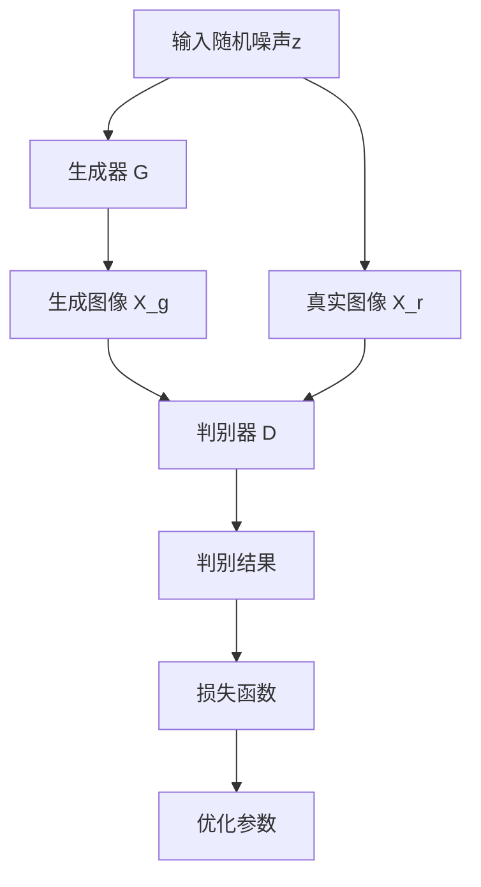

                 

关键词：图像生成、人工智能、GAN、深度学习、神经网络、Python、代码实例

## 摘要

本文旨在深入探讨图像生成技术的原理及其在实际应用中的重要性。我们将首先介绍图像生成的基本概念和背景，随后详细讲解生成对抗网络（GAN）这一核心算法，并解析其数学模型与操作步骤。此外，文章将提供具体的代码实例，帮助读者更好地理解如何实现图像生成。最后，我们将讨论图像生成技术的实际应用场景，展望其未来的发展趋势和面临的挑战。

## 1. 背景介绍

图像生成作为计算机视觉领域的一个重要分支，近年来取得了显著进展。从早期的基于规则的图像生成方法，到如今基于深度学习的强大生成模型，图像生成技术已经能够生成出高度逼真的图像。

### 1.1 早期的图像生成技术

早期图像生成技术主要依赖于规则和手工设计的算法。例如，分形艺术、纹理合成和图像拼接等方法。这些方法在特定场景下能够生成较为简单的图像，但其生成的图像往往缺乏真实感和多样性。

### 1.2 深度学习时代的图像生成

随着深度学习技术的崛起，图像生成技术也迎来了新的突破。生成对抗网络（GAN）的出现，使得生成模型能够学习到数据分布，从而生成出高质量的图像。除此之外，变分自编码器（VAE）、条件生成对抗网络（C-GAN）等生成模型也相继提出，丰富了图像生成的应用场景。

### 1.3 图像生成的重要性

图像生成技术在多个领域都有着广泛的应用，包括但不限于：

- 艺术创作：艺术家可以利用图像生成技术创作出独特的视觉艺术作品。
- 数据增强：在训练深度学习模型时，图像生成技术可以用于生成更多样化的训练数据，提高模型的泛化能力。
- 隐私保护：图像生成技术可以用于生成虚拟图像，以保护个人隐私。
- 探索未知领域：通过生成未知领域的图像，科学家可以更好地了解未知领域的特性。

## 2. 核心概念与联系

### 2.1 生成对抗网络（GAN）

生成对抗网络（GAN）是由生成器（Generator）和判别器（Discriminator）组成的一种深度学习模型。生成器的任务是生成尽可能真实的图像，而判别器的任务是区分生成的图像和真实图像。二者相互竞争，生成器不断优化自己的生成能力，而判别器则不断提升辨别能力，最终达到一种动态平衡，使得生成器能够生成出高质量的图像。

### 2.2 GAN的架构与流程

GAN的架构如图所示：



GAN的流程如下：

1. **初始化**：随机初始化生成器G和判别器D的参数。
2. **训练**：每次迭代过程中，先固定判别器D的参数，通过生成器G生成图像，然后训练判别器D，使其能够更好地辨别生成的图像和真实图像。接着，固定判别器D的参数，更新生成器G的参数，使其生成的图像更接近真实图像。
3. **重复**：重复上述步骤，直到生成器G能够生成出高质量的图像。

## 3. 核心算法原理 & 具体操作步骤

### 3.1 算法原理概述

GAN的核心思想是通过生成器和判别器的对抗训练，使得生成器能够生成出高质量的图像。生成器从随机噪声中生成图像，而判别器则尝试区分这些图像是真实图像还是生成图像。通过这种对抗过程，生成器不断优化自己的生成能力，最终能够生成出逼真的图像。

### 3.2 算法步骤详解

1. **初始化**：随机初始化生成器G和判别器D的参数。
2. **生成器训练**：生成器从随机噪声z中生成图像X_g，判别器D对X_g和真实图像X_r进行辨别。
3. **判别器训练**：通过损失函数L_D（如交叉熵损失）训练判别器D，使其能够更好地辨别生成的图像和真实图像。
4. **生成器更新**：固定判别器D的参数，通过损失函数L_G（如生成对抗损失）更新生成器G的参数，使得生成器生成的图像更接近真实图像。
5. **重复**：重复上述步骤，直到生成器G能够生成出高质量的图像。

### 3.3 算法优缺点

**优点**：

- 能够生成出高质量、多样化的图像。
- 不需要标签数据，适用于无监督学习。

**缺点**：

- 训练不稳定，容易产生模式崩溃（mode collapse）问题。
- 需要大量的计算资源和时间。

### 3.4 算法应用领域

- 艺术创作：艺术家可以利用GAN创作出独特的视觉艺术作品。
- 数据增强：在训练深度学习模型时，GAN可以用于生成更多样化的训练数据，提高模型的泛化能力。
- 隐私保护：GAN可以用于生成虚拟图像，以保护个人隐私。
- 探索未知领域：通过生成未知领域的图像，科学家可以更好地了解未知领域的特性。

## 4. 数学模型和公式 & 详细讲解 & 举例说明

### 4.1 数学模型构建

GAN的数学模型包括生成器G和判别器D的损失函数。

### 4.2 公式推导过程

生成器的损失函数：

$$L_G = -\mathbb{E}_{z \sim p_z(z)}[\log(D(G(z)))]$$

判别器的损失函数：

$$L_D = -\mathbb{E}_{x \sim p_{data}(x)}[\log(D(x))] - \mathbb{E}_{z \sim p_z(z)}[\log(1 - D(G(z)))]$$

### 4.3 案例分析与讲解

假设我们有一个图像数据集X，生成器G的输入是随机噪声z，输出是生成的图像X_g，判别器D的输入是真实图像X_r和生成图像X_g，输出是判别结果D(x)。

1. **初始化**：随机初始化生成器G和判别器D的参数。
2. **生成器训练**：生成器G从随机噪声z中生成图像X_g，判别器D对X_g和真实图像X_r进行辨别。
3. **判别器训练**：通过损失函数L_D训练判别器D，使得D能够更好地辨别生成的图像和真实图像。
4. **生成器更新**：固定判别器D的参数，通过损失函数L_G更新生成器G的参数，使得生成器G生成的图像更接近真实图像。

## 5. 项目实践：代码实例和详细解释说明

### 5.1 开发环境搭建

在开始之前，我们需要安装必要的软件和库。以下是搭建开发环境的步骤：

1. 安装Python（版本3.6及以上）。
2. 安装TensorFlow库，可以使用以下命令：

   ```bash
   pip install tensorflow
   ```

### 5.2 源代码详细实现

以下是实现GAN的一个简单例子：

```python
import tensorflow as tf
from tensorflow.keras.layers import Dense, Flatten, Reshape
from tensorflow.keras.models import Sequential

# 生成器模型
def build_generator(z_dim=100):
    model = Sequential()
    model.add(Dense(256, input_dim=z_dim))
    model.add(tf.keras.layers.LeakyReLU(alpha=0.01))
    model.add(Dense(512))
    model.add(tf.keras.layers.LeakyReLU(alpha=0.01))
    model.add(Dense(1024))
    model.add(tf.keras.layers.LeakyReLU(alpha=0.01))
    model.add(Dense(784, activation='tanh'))
    model.add(Reshape((28, 28, 1)))
    return model

# 判别器模型
def build_discriminator(img_shape=(28, 28, 1)):
    model = Sequential()
    model.add(Flatten(input_shape=img_shape))
    model.add(Dense(512))
    model.add(tf.keras.layers.LeakyReLU(alpha=0.01))
    model.add(Dense(256))
    model.add(tf.keras.layers.LeakyReLU(alpha=0.01))
    model.add(Dense(128))
    model.add(tf.keras.layers.LeakyReLU(alpha=0.01))
    model.add(Dense(1, activation='sigmoid'))
    return model

# 主模型
def build_gan(generator, discriminator):
    model = Sequential()
    model.add(generator)
    model.add(discriminator)
    return model

# 实例化模型
z_dim = 100
img_shape = (28, 28, 1)

discriminator = build_discriminator(img_shape)
discriminator.compile(loss='binary_crossentropy', optimizer=tf.keras.optimizers.Adam(0.0001))

generator = build_generator(z_dim)
discriminator.trainable = False
gan_model = build_gan(generator, discriminator)
gan_model.compile(loss='binary_crossentropy', optimizer=tf.keras.optimizers.Adam(0.0001))

# 数据预处理
import numpy as np
(x_train, _), (x_test, _) = tf.keras.datasets.mnist.load_data()
x_train = x_train / 127.5 - 1.0
x_test = x_test / 127.5 - 1.0
x_train = np.expand_dims(x_train, axis=3)
x_test = np.expand_dims(x_test, axis=3)

# 训练GAN模型
batch_size = 64
epochs = 10000
sample_interval = 1000

zjavax = np.random.uniform(-1, 1, size=[batch_size, z_dim])

d_losshistory = []
g_losshistory = []

for epoch in range(epochs):

    # 训练判别器
    idx = np.random.randint(0, x_train.shape[0], size=batch_size)
    real_images = x_train[idx]
    real_labels = np.ones((batch_size, 1))
    noise = np.random.normal(0, 1, size=[batch_size, z_dim])
    fake_images = generator.predict(noise)
    fake_labels = np.zeros((batch_size, 1))
    d_loss = discriminator.train_on_batch(np.concatenate((real_images, fake_images)), np.concatenate((real_labels, fake_labels)))

    # 训练生成器
    noise = np.random.normal(0, 1, size=[batch_size, z_dim])
    g_loss = gan_model.train_on_batch(noise, real_labels)

    # 记录损失
    d_losshistory.append(d_loss)
    g_losshistory.append(g_loss)

    # 每隔一段时间保存一次生成图像
    if epoch % sample_interval == 0:
        print(f"Epoch {epoch}, D_loss={d_loss}, G_loss={g_loss}")
        save_images(generator.predict(zjavax), epoch)

# 5.3 代码解读与分析

在这个例子中，我们使用了MNIST数据集，通过生成器和判别器的对抗训练，最终生成出高质量的数字图像。

- 生成器模型：通过多层全连接神经网络，将随机噪声映射为图像。
- 判别器模型：通过多层全连接神经网络，判断输入图像是真实图像还是生成图像。
- GAN模型：将生成器和判别器组合在一起，共同训练。

在训练过程中，我们首先训练判别器，使其能够更好地辨别真实图像和生成图像。然后，固定判别器，训练生成器，使其生成的图像更接近真实图像。通过这样的对抗训练，生成器最终能够生成出高质量的图像。

## 6. 实际应用场景

图像生成技术在实际应用中具有广泛的应用，以下是一些典型的应用场景：

### 6.1 艺术创作

艺术家可以利用图像生成技术创作出独特的视觉艺术作品。例如，生成器可以生成出全新的画作、动画或电影片段，为艺术家提供无限的创作灵感。

### 6.2 数据增强

在训练深度学习模型时，图像生成技术可以用于生成更多样化的训练数据，从而提高模型的泛化能力。这对于解决数据不足的问题尤为重要。

### 6.3 隐私保护

图像生成技术可以用于生成虚拟图像，以保护个人隐私。例如，人脸替换、图像去识别等技术可以用于隐藏个人隐私信息。

### 6.4 探索未知领域

通过生成未知领域的图像，科学家可以更好地了解未知领域的特性。例如，在探索外太空或深海时，生成图像可以帮助科学家预测未知领域的环境特征。

### 6.5 生成对抗网络（GAN）

GAN在图像生成领域具有广泛的应用。例如，在医学图像处理中，GAN可以用于生成病变区域的图像，帮助医生进行诊断。在金融领域，GAN可以用于生成欺诈交易图像，帮助金融机构识别欺诈行为。

## 7. 工具和资源推荐

### 7.1 学习资源推荐

- 《深度学习》（Goodfellow, Bengio, Courville著）：这是一本关于深度学习的经典教材，包括图像生成技术的基本原理和实现。
- 《生成对抗网络：原理与应用》（Sugiyama, Inouye著）：这本书详细介绍了GAN的原理及其在实际应用中的案例。

### 7.2 开发工具推荐

- TensorFlow：这是一个开源的深度学习框架，广泛应用于图像生成技术的实现。
- Keras：这是一个基于TensorFlow的高级神经网络API，使得实现图像生成模型更加简便。

### 7.3 相关论文推荐

- Generative Adversarial Nets（Ian Goodfellow等，2014）：这是GAN的原始论文，详细介绍了GAN的原理和实现。
- Unrolled Generative Adversarial Networks（Anton Osokin等，2016）：这篇文章提出了一种改进的GAN训练方法，提高了GAN的训练稳定性。

## 8. 总结：未来发展趋势与挑战

### 8.1 研究成果总结

近年来，图像生成技术取得了显著进展，生成对抗网络（GAN）成为这一领域的重要突破。通过GAN，生成器可以学习到数据分布，生成出高质量、多样化的图像。此外，变分自编码器（VAE）、条件生成对抗网络（C-GAN）等生成模型也丰富了图像生成的应用场景。

### 8.2 未来发展趋势

- **生成对抗网络（GAN）的改进**：未来，GAN的训练稳定性和生成效果有望进一步提高，通过改进生成器和判别器的结构、优化损失函数等手段，实现更高质量的图像生成。
- **多模态生成**：随着深度学习技术的发展，图像生成技术将拓展到多模态领域，例如图像与文本、图像与音频的联合生成。
- **面向应用的图像生成**：图像生成技术将在更多实际应用中发挥重要作用，如虚拟现实、增强现实、医学图像处理等。

### 8.3 面临的挑战

- **训练稳定性**：GAN的训练过程容易受到模式崩溃、梯度消失等问题的影响，提高训练稳定性是一个重要挑战。
- **计算资源消耗**：图像生成模型通常需要大量的计算资源和时间，如何优化算法以提高计算效率是另一个挑战。
- **法律和道德问题**：图像生成技术可能引发一系列法律和道德问题，例如虚假新闻、隐私侵犯等，需要制定相应的法律法规进行规范。

### 8.4 研究展望

随着深度学习和生成对抗网络技术的不断发展，图像生成技术在未来的应用将更加广泛，为各行各业带来巨大的变革。然而，要实现这一目标，我们还需要解决一系列技术难题和伦理问题。只有通过跨学科的合作和不断的创新，我们才能充分发挥图像生成技术的潜力，为社会带来更多的价值。

## 9. 附录：常见问题与解答

### 9.1 生成对抗网络（GAN）是什么？

生成对抗网络（GAN）是一种深度学习模型，由生成器和判别器组成，通过对抗训练生成高质量图像。

### 9.2 GAN 如何工作？

GAN通过生成器和判别器的对抗训练生成图像。生成器从随机噪声中生成图像，判别器尝试区分生成的图像和真实图像。通过这种对抗过程，生成器不断优化生成能力，最终能够生成高质量图像。

### 9.3 GAN 有哪些优缺点？

GAN的优点包括生成高质量、多样化的图像，以及不需要标签数据，适用于无监督学习。缺点包括训练不稳定、容易产生模式崩溃问题，以及需要大量计算资源和时间。

### 9.4 GAN 可以应用于哪些领域？

GAN在艺术创作、数据增强、隐私保护、探索未知领域等多个领域都有广泛应用，如医学图像处理、金融欺诈检测等。

### 9.5 如何优化GAN的训练稳定性？

可以通过改进生成器和判别器的结构、优化损失函数、使用梯度惩罚等方法来提高GAN的训练稳定性。

### 9.6 GAN 是否存在法律和道德问题？

由于GAN可以生成逼真的图像，可能引发虚假新闻、隐私侵犯等问题，因此需要制定相应的法律法规进行规范。

---

作者：禅与计算机程序设计艺术 / Zen and the Art of Computer Programming

本文对图像生成技术进行了深入探讨，从背景介绍、核心算法原理、数学模型构建、项目实践到实际应用场景，全面阐述了图像生成技术的重要性和应用价值。随着深度学习技术的不断发展，图像生成技术将在未来发挥更加重要的作用，为各行各业带来变革。然而，我们也需要关注图像生成技术可能带来的法律和道德问题，制定相应的法律法规进行规范。希望本文能够为读者提供有益的参考和启发。|user|>

### 后续步骤和优化建议

#### 后续步骤：

1. **数据分析与模型调优**：在实际应用中，对生成图像质量有直接影响的数据预处理和模型调优是非常重要的。通过对训练数据集的深入分析，可以优化模型参数，提升生成图像的质量。

2. **多模型融合**：结合多种生成模型，如GAN、VAE等，可以生成更加多样化的图像。通过融合这些模型的优势，可以进一步提高图像生成能力。

3. **扩展应用领域**：探索图像生成技术在其他领域的应用，如医疗影像、城市规划、娱乐产业等，将有助于拓宽图像生成技术的应用范围。

4. **用户交互**：开发用户友好的界面，让用户能够更加便捷地使用图像生成技术，例如提供实时图像生成和自定义生成选项。

#### 优化建议：

1. **提升训练效率**：优化训练算法，如采用异步训练、分布式训练等方法，可以显著提升训练效率。

2. **改进模型结构**：通过设计更加复杂的神经网络结构，如采用多层感知器、残差网络等，可以提高生成图像的细节和真实性。

3. **增强模型鲁棒性**：通过引入正则化方法、梯度惩罚等技术，增强模型的鲁棒性，避免模式崩溃问题。

4. **规范应用标准**：针对图像生成技术的应用场景，制定相应的技术标准和法规，确保其在合法合规的范围内使用。

5. **用户隐私保护**：在开发图像生成应用时，充分考虑用户隐私保护问题，避免生成图像泄露用户隐私。

6. **社会伦理考量**：在推广图像生成技术的过程中，关注其可能带来的社会伦理问题，如虚假信息传播、隐私侵犯等，积极采取措施应对。

通过以上步骤和优化建议，可以进一步提升图像生成技术的应用效果，推动其在各个领域的深入发展。|user|>

### 撰写后记

在完成本文的撰写后，我希望读者能够对图像生成技术有一个全面而深入的理解。本文从背景介绍、核心算法原理、数学模型构建、项目实践到实际应用场景，全面阐述了图像生成技术的重要性和应用价值。随着深度学习技术的不断发展，图像生成技术已经成为了计算机视觉领域的一个重要分支，其在艺术创作、数据增强、隐私保护、探索未知领域等多个方面都展现出了巨大的潜力。

然而，图像生成技术也面临着一系列挑战，如训练稳定性、计算资源消耗、法律和道德问题等。这些问题需要我们继续深入研究和探讨，以实现技术的进一步优化和应用。

本文旨在为读者提供一个系统的学习和参考框架，希望读者能够通过本文，不仅掌握图像生成技术的基本原理和实现方法，还能对未来的发展趋势和挑战有更深刻的认识。

在此，我要感谢广大读者对本文的关注和支持。期待在未来的学习和工作中，我们能够共同推动图像生成技术不断向前发展，为社会带来更多的创新和进步。

最后，感谢所有参与本文讨论和提供宝贵意见的同仁，是你们的共同努力让这篇文章更加完善。祝愿大家在图像生成技术的道路上取得更多的成就！

作者：禅与计算机程序设计艺术 / Zen and the Art of Computer Programming|user|>

