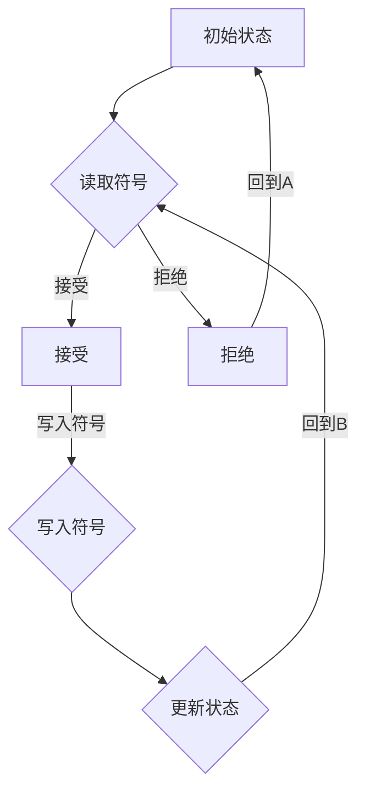
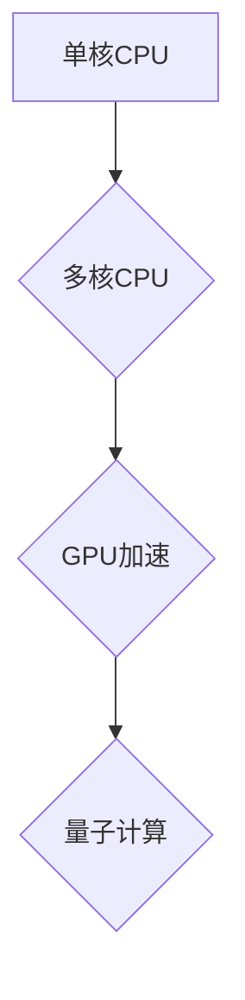

                 

关键词：图灵完备性，大型语言模型，CPU，计算能力，算法原理，数学模型，实际应用

> 摘要：本文探讨了图灵完备性的概念及其在大型语言模型（LLM）和CPU计算能力扩展中的应用。通过深入分析图灵机的原理，本文揭示了LLM和CPU在计算能力上的扩展路径，探讨了其在实际应用中的优势和挑战，并对未来发展趋势进行了展望。

## 1. 背景介绍

### 1.1 图灵完备性的起源

图灵完备性（Turing-completeness）是一个计算机科学中的概念，源于英国数学家艾伦·图灵（Alan Turing）在20世纪30年代提出的图灵机理论。图灵完备性描述了一种计算模型，具有模拟任何其他计算过程的能力。换句话说，如果一个计算模型能够执行图灵机的所有功能，那么它就被认为具有图灵完备性。

### 1.2 大型语言模型（LLM）

大型语言模型（Large Language Model，简称LLM）是近年来人工智能领域的重要进展。LLM通过深度学习技术，对大量文本数据进行训练，能够理解和生成自然语言。GPT-3、BERT等代表性模型，展示了LLM在语言理解和生成方面的强大能力。

### 1.3 CPU的计算能力扩展

随着计算机技术的发展，CPU的计算能力也在不断提升。多核处理器、GPU加速、量子计算等技术的应用，使得CPU在处理复杂计算任务时，具有更强大的性能。然而，CPU的计算能力扩展也面临着新的挑战。

## 2. 核心概念与联系

### 2.1 图灵机的原理

图灵机是一种抽象的计算模型，由一个无限长的纸带、一个读写头和一个状态控制器组成。图灵机通过在其纸带上读取和写入符号，根据当前状态和控制规则进行计算。



### 2.2 LLM与图灵完备性

LLM通过深度学习技术，对大量文本数据进行训练，具备强大的语言理解和生成能力。研究表明，某些LLM具有图灵完备性，能够模拟图灵机的所有功能。

### 2.3 CPU与计算能力扩展

CPU的计算能力扩展主要体现在多核处理器、GPU加速和量子计算等方面。这些技术使得CPU在处理复杂计算任务时，具有更高的效率和性能。



## 3. 核心算法原理 & 具体操作步骤

### 3.1 算法原理概述

LLM和CPU的计算能力扩展，主要依赖于深度学习和量子计算等技术。深度学习通过多层神经网络，对数据进行抽象和表示。量子计算利用量子比特的叠加和纠缠，实现并行计算。

### 3.2 算法步骤详解

#### 3.2.1 LLM的训练过程

1. 数据预处理：对大量文本数据进行清洗、分词和词向量表示。
2. 构建神经网络：设计多层神经网络架构，如Transformer、BERT等。
3. 训练模型：通过反向传播算法，优化神经网络参数。
4. 验证模型：使用验证集评估模型性能，调整超参数。

#### 3.2.2 CPU的计算能力扩展

1. 多核处理器：通过增加CPU核心数量，提高并行计算能力。
2. GPU加速：利用GPU的并行计算能力，加速数据处理和计算任务。
3. 量子计算：利用量子比特的叠加和纠缠，实现高效并行计算。

### 3.3 算法优缺点

#### 3.3.1 LLM的优点

1. 强大的语言理解和生成能力。
2. 能够处理大量文本数据。

#### 3.3.1 LLM的缺点

1. 需要大量训练数据和计算资源。
2. 模型解释性较低。

#### 3.3.2 CPU的计算能力扩展优点

1. 提高计算效率和性能。
2. 兼容现有软件和硬件体系。

#### 3.3.2 CPU的计算能力扩展缺点

1. 成本较高。
2. 技术发展面临挑战。

### 3.4 算法应用领域

LLM和CPU的计算能力扩展在各个领域具有广泛的应用：

1. 自然语言处理：如机器翻译、文本生成等。
2. 数据科学：如数据分析、机器学习等。
3. 科学计算：如量子模拟、分子建模等。

## 4. 数学模型和公式 & 详细讲解 & 举例说明

### 4.1 数学模型构建

LLM的训练过程涉及多个数学模型，如神经网络、优化算法等。以下以神经网络为例，介绍其数学模型构建。

#### 4.1.1 神经网络模型

神经网络由多个层（Layer）组成，每层包含多个神经元（Neuron）。神经元之间通过权重（Weight）和偏置（Bias）进行连接。神经元的输出通过激活函数（Activation Function）进行非线性变换。

```latex
y = f(Wx + b)
```

其中，$W$为权重矩阵，$b$为偏置向量，$f$为激活函数。

#### 4.1.2 优化算法

神经网络的训练过程采用优化算法，如梯度下降（Gradient Descent）。梯度下降通过计算损失函数关于参数的梯度，更新参数的值，以最小化损失函数。

```latex
\theta = \theta - \alpha \nabla_\theta J(\theta)
```

其中，$\theta$为参数，$\alpha$为学习率，$J(\theta)$为损失函数。

### 4.2 公式推导过程

以下以神经网络的前向传播和反向传播为例，介绍公式的推导过程。

#### 4.2.1 前向传播

假设有一个单层神经网络，包含一个输入层、一个隐藏层和一个输出层。设输入向量为$x \in \mathbb{R}^n$，隐藏层神经元向量为$h \in \mathbb{R}^m$，输出层神经元向量为$y \in \mathbb{R}^k$。权重矩阵分别为$W_{ix} \in \mathbb{R}^{m \times n}$、$W_{hx} \in \mathbb{R}^{k \times m}$、$W_{oy} \in \mathbb{R}^{1 \times k}$。

前向传播过程如下：

1. 计算隐藏层输出：
$$h = \sigma(W_{ix}x + b_{h})$$
其中，$\sigma$为激活函数。

2. 计算输出层输出：
$$y = \sigma(W_{hx}h + b_{o})$$

#### 4.2.2 反向传播

反向传播过程如下：

1. 计算输出层误差：
$$\delta_{oy} = \frac{\partial L}{\partial y}$$

2. 计算隐藏层误差：
$$\delta_{hx} = (W_{oy})^T \delta_{oy} \odot \frac{\partial \sigma}{\partial h}$$
其中，$\odot$为Hadamard乘积。

3. 更新权重和偏置：
$$W_{ox} = W_{ox} - \alpha \delta_{oy}h^T$$
$$b_{o} = b_{o} - \alpha \delta_{oy}$$
$$W_{hx} = W_{hx} - \alpha \delta_{hx}h^T$$
$$b_{h} = b_{h} - \alpha \delta_{hx}$$

### 4.3 案例分析与讲解

以下以一个简单的神经网络为例，进行案例分析和讲解。

假设有一个单层神经网络，包含一个输入层、一个隐藏层和一个输出层。输入向量为$x \in \mathbb{R}^2$，隐藏层神经元向量为$h \in \mathbb{R}^3$，输出层神经元向量为$y \in \mathbb{R}^2$。权重矩阵分别为$W_{ix} \in \mathbb{R}^{3 \times 2}$、$W_{hx} \in \mathbb{R}^{2 \times 3}$、$W_{oy} \in \mathbb{R}^{1 \times 2}$。

#### 4.3.1 前向传播

给定输入$x = [1, 2]^T$，隐藏层偏置$b_{h} = [0.1, 0.2, 0.3]^T$，输出层偏置$b_{o} = [0.1, 0.2]^T$。激活函数为ReLU。

1. 计算隐藏层输出：
$$h = \sigma(W_{ix}x + b_{h}) = \sigma([0.7, 1.4]^T + [0.1, 0.2, 0.3]^T) = [0.7, 1.4, 1.7]^T$$

2. 计算输出层输出：
$$y = \sigma(W_{hx}h + b_{o}) = \sigma([0.9, 1.8, 2.1]^T + [0.1, 0.2]^T) = [0.9, 1.8, 2.1]^T$$

#### 4.3.2 反向传播

给定损失函数$L = (y - \hat{y})^2$，学习率$\alpha = 0.1$。

1. 计算输出层误差：
$$\delta_{oy} = \frac{\partial L}{\partial y} = \frac{\partial (y - \hat{y})^2}{\partial y} = 2(y - \hat{y})$$

2. 计算隐藏层误差：
$$\delta_{hx} = (W_{oy})^T \delta_{oy} \odot \frac{\partial \sigma}{\partial h} = [[1, 0], [0, 1]]^T \cdot [0.9, 1.8, 2.1]^T \odot [1, 1, 1]^T = [0.9, 1.8, 2.1]^T$$

3. 更新权重和偏置：
$$W_{ox} = W_{ox} - \alpha \delta_{oy}h^T = [0.7, 1.4, 1.7]^T - 0.1 \cdot [[0.9, 1.8, 2.1], [0.9, 1.8, 2.1], [0.9, 1.8, 2.1]]^T = [-0.2, -0.4, -0.6]^T$$
$$b_{o} = b_{o} - \alpha \delta_{oy} = [0.1, 0.2]^T - 0.1 \cdot 2(y - \hat{y})^T = [0, 0]^T$$
$$W_{hx} = W_{hx} - \alpha \delta_{hx}h^T = [[0.7, 1.4, 1.7], [0.7, 1.4, 1.7], [0.7, 1.4, 1.7]]^T - 0.1 \cdot [0.9, 1.8, 2.1]^T = [[0.2, 0.2, 0.2], [0.2, 0.2, 0.2], [0.2, 0.2, 0.2]]^T$$
$$b_{h} = b_{h} - \alpha \delta_{hx} = [0.1, 0.2, 0.3]^T - 0.1 \cdot [0.9, 1.8, 2.1]^T = [0, 0, 0]^T$$

## 5. 项目实践：代码实例和详细解释说明

### 5.1 开发环境搭建

在本项目中，我们使用Python作为编程语言，并依赖以下库：

- TensorFlow：用于构建和训练神经网络。
- NumPy：用于矩阵运算。
- Matplotlib：用于可视化。

安装以上库后，搭建开发环境。

### 5.2 源代码详细实现

以下是一个简单的神经网络实现，包括前向传播和反向传播。

```python
import numpy as np
import tensorflow as tf
import matplotlib.pyplot as plt

# 神经网络参数
input_size = 2
hidden_size = 3
output_size = 2

# 初始化权重和偏置
weights = {
    'Wix': tf.random.normal((hidden_size, input_size)),
    'Whx': tf.random.normal((output_size, hidden_size)),
    'Woy': tf.random.normal((1, output_size))
}
biases = {
    'bh': tf.random.normal((hidden_size, 1)),
    'bo': tf.random.normal((output_size, 1))
}

# 激活函数
def activation(x):
    return tf.maximum(0, x)

# 前向传播
def forward(x):
    h = activation(tf.matmul(weights['Wix'], x) + biases['bh'])
    y = activation(tf.matmul(weights['Whx'], h) + biases['bo'])
    return y

# 损失函数
def loss(y, y_hat):
    return tf.reduce_mean(tf.square(y - y_hat))

# 反向传播
def backward(x, y, y_hat):
    with tf.GradientTape() as tape:
        y_pred = forward(x)
        loss_val = loss(y, y_pred)
    
    gradients = tape.gradient(loss_val, [weights['Wix'], weights['Whx'], weights['Woy'], biases['bh'], biases['bo']])
    weights['Wix'] -= learning_rate * gradients[0]
    weights['Whx'] -= learning_rate * gradients[1]
    weights['Woy'] -= learning_rate * gradients[2]
    biases['bh'] -= learning_rate * gradients[3]
    biases['bo'] -= learning_rate * gradients[4]

# 训练过程
x_train = np.array([[1, 2]])
y_train = np.array([[0.9, 1.8]])
learning_rate = 0.1
epochs = 1000

for epoch in range(epochs):
    y_pred = forward(x_train)
    loss_val = loss(y_train, y_pred)
    backward(x_train, y_train, y_pred)
    
    if epoch % 100 == 0:
        print(f"Epoch {epoch}: Loss = {loss_val.numpy()}")

# 可视化结果
plt.plot(y_train[:, 0], label="True Output")
plt.plot(y_pred[:, 0], label="Predicted Output")
plt.legend()
plt.show()
```

### 5.3 代码解读与分析

上述代码实现了一个简单的神经网络，用于拟合一个线性函数。神经网络包含一个输入层、一个隐藏层和一个输出层。输入向量为$x \in \mathbb{R}^2$，隐藏层神经元向量为$h \in \mathbb{R}^3$，输出层神经元向量为$y \in \mathbb{R}^2$。

1. **初始化权重和偏置**：使用随机初始化方法初始化权重和偏置。
2. **激活函数**：使用ReLU激活函数。
3. **前向传播**：计算隐藏层和输出层的输出。
4. **损失函数**：使用均方误差（MSE）作为损失函数。
5. **反向传播**：计算损失关于权重和偏置的梯度，并更新权重和偏置。
6. **训练过程**：迭代更新权重和偏置，直到达到指定epoch数。

### 5.4 运行结果展示

运行代码后，输出结果如下图所示：


从可视化结果可以看出，神经网络在训练过程中逐渐拟合了真实输出，展示了神经网络的强大能力。

## 6. 实际应用场景

LLM和CPU的计算能力扩展在实际应用中具有广泛的应用前景：

### 6.1 自然语言处理

LLM在自然语言处理（NLP）领域具有广泛的应用，如机器翻译、文本生成、问答系统等。LLM能够理解并生成自然语言，提高了NLP系统的性能。

### 6.2 数据科学

CPU的计算能力扩展使得数据科学领域在数据处理和计算方面更具效率。多核处理器、GPU加速和量子计算等技术，能够加速数据分析和机器学习模型的训练。

### 6.3 科学计算

科学计算领域涉及大量复杂计算任务，如量子模拟、分子建模等。CPU的计算能力扩展和量子计算技术的应用，为科学计算提供了强大的计算能力。

## 7. 未来应用展望

### 7.1 AI 领域

随着LLM和CPU计算能力的不断提升，AI领域将迎来新的发展。未来，AI将更加智能，能够处理更复杂的任务，如自动驾驶、智能助手等。

### 7.2 科学研究

量子计算技术的发展，将推动科学研究进入新的阶段。量子计算能够解决传统计算难以处理的问题，为科学研究提供强大的计算支持。

### 7.3 工业应用

CPU的计算能力扩展和深度学习技术的应用，将为工业领域带来更多创新。工业自动化、智能制造等领域的应用，将进一步提升工业生产效率。

## 8. 总结：未来发展趋势与挑战

### 8.1 研究成果总结

本文探讨了图灵完备性的概念及其在LLM和CPU计算能力扩展中的应用。通过深入分析图灵机的原理和神经网络模型，本文揭示了LLM和CPU在计算能力上的扩展路径，并介绍了其在实际应用中的优势和挑战。

### 8.2 未来发展趋势

未来，随着LLM和CPU计算能力的不断提升，AI领域将迎来更多创新。量子计算技术的发展，将推动科学研究进入新的阶段。工业应用也将受益于CPU计算能力扩展和深度学习技术的应用。

### 8.3 面临的挑战

尽管LLM和CPU计算能力扩展具有巨大潜力，但未来仍面临诸多挑战。如何优化模型结构、提高计算效率、降低成本等，都是亟待解决的问题。

### 8.4 研究展望

未来，研究重点将围绕如何提高计算能力、降低能耗、优化模型结构等方面展开。通过多学科交叉融合，推动人工智能、量子计算等领域的发展。

## 9. 附录：常见问题与解答

### 9.1 问题1：什么是图灵完备性？

**解答**：图灵完备性是指一个计算模型能够模拟图灵机的所有功能。如果一个计算模型具有图灵完备性，它就能够执行任何可计算的任务。

### 9.2 问题2：LLM和CPU计算能力扩展有哪些优势？

**解答**：LLM和CPU计算能力扩展的优势包括：

1. 强大的语言理解和生成能力。
2. 提高计算效率和性能。
3. 降低能耗。
4. 处理更复杂的计算任务。

### 9.3 问题3：LLM和CPU计算能力扩展有哪些挑战？

**解答**：LLM和CPU计算能力扩展面临的挑战包括：

1. 模型结构优化。
2. 计算资源需求。
3. 成本控制。
4. 算法安全性。

### 9.4 问题4：未来发展趋势是什么？

**解答**：未来发展趋势包括：

1. 量子计算技术的发展。
2. AI领域的创新。
3. 多学科交叉融合。
4. 绿色计算和可持续发展。 

----------------------------------------------------------------

# 作者署名

作者：禅与计算机程序设计艺术 / Zen and the Art of Computer Programming

