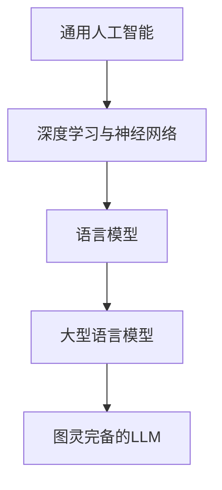

                 

关键词：图灵完备，LLM，人工智能，通用人工智能，深度学习，神经网络，自然语言处理

> 摘要：本文深入探讨了图灵完备的LLM（大型语言模型）如何成为实现通用人工智能（AGI）的关键技术。通过分析LLM的原理、算法、数学模型以及实际应用，本文旨在揭示LLM在推动人工智能领域发展中所扮演的角色，并对其未来前景进行了展望。

## 1. 背景介绍

### 1.1 通用人工智能的定义与历史

通用人工智能（AGI，Artificial General Intelligence）是指一种能够在任何知识领域内展现出人类智能水平的人工智能系统。AGI不仅能够处理特定任务，还能自主地学习、推理、解决问题，甚至具备创造性和适应性。自人工智能（AI）概念提出以来，实现AGI一直是科研人员追求的目标。

然而，通用人工智能的实现面临着巨大的挑战。传统的AI系统通常只能针对特定任务进行优化，难以扩展到其他领域。尽管近年来深度学习和神经网络在图像识别、自然语言处理等领域取得了显著进展，但它们仍然依赖于大量的人工设计和调参，无法实现真正的通用性。

### 1.2  图灵完备的概念

图灵完备（Turing Complete）是指一个计算系统或编程语言能够模拟图灵机的计算能力，能够执行任何可计算的任务。图灵完备性是衡量一个计算模型是否具有通用计算能力的重要标准。传统的编程语言如Python、Java等都是图灵完备的。

### 1.3  大型语言模型的发展

近年来，随着深度学习技术的进步，大型语言模型（LLM，Large Language Model）如GPT、BERT等取得了显著的成功。这些模型基于神经网络架构，能够通过大量文本数据进行训练，从而具备强大的自然语言理解和生成能力。

LLM的出现为通用人工智能的实现带来了新的机遇。由于其强大的文本处理能力，LLM在自然语言处理、文本生成、问答系统等领域展现出了卓越的性能，为AI的发展提供了新的动力。

## 2. 核心概念与联系

### 2.1  深度学习与神经网络

深度学习（Deep Learning）是一种基于神经网络（Neural Networks）的机器学习技术。神经网络模拟人脑神经元之间的连接关系，通过多层非线性变换来提取数据特征。深度学习在图像识别、语音识别、自然语言处理等领域取得了显著的成果。

### 2.2  语言模型的原理

语言模型（Language Model）是一种用于预测下一个单词或词组的概率分布的模型。在自然语言处理（NLP，Natural Language Processing）中，语言模型被广泛应用于文本生成、机器翻译、问答系统等任务。传统的语言模型基于统计方法，如N-gram模型，而现代语言模型如GPT、BERT等基于深度学习技术，能够更好地捕捉语言的结构和语义信息。

### 2.3  大型语言模型的结构与工作原理

大型语言模型（LLM）通常由数亿至数十亿的参数构成，具有复杂的神经网络架构。以GPT为例，其基于Transformer架构，通过自注意力机制（Self-Attention Mechanism）来处理输入文本，从而生成对应的输出。LLM的训练过程涉及大规模的文本数据，通过无监督的方式学习语言模式和结构。

### 2.4  图灵完备的LLM

图灵完备的LLM意味着这些语言模型具备执行任意计算任务的能力。通过适当的编程和接口设计，LLM可以应用于各种领域，如自动化编程、智能客服、自然语言理解等。图灵完备的LLM为通用人工智能的实现提供了强有力的支持。

## 2.5  Mermaid 流程图



## 3. 核心算法原理 & 具体操作步骤

### 3.1  算法原理概述

大型语言模型（LLM）的核心算法基于深度学习技术，特别是基于Transformer架构的模型。Transformer架构引入了自注意力机制（Self-Attention Mechanism），能够更好地捕捉输入文本中的长距离依赖关系。LLM的训练过程涉及大量的文本数据进行无监督学习，通过优化模型参数，使其能够生成符合语言结构的文本。

### 3.2  算法步骤详解

#### 3.2.1  数据收集与预处理

- 收集大规模的文本数据，如书籍、新闻、论文、社交媒体等。
- 对文本数据进行清洗和预处理，包括去除标点符号、停用词过滤、词干提取等。

#### 3.2.2  词向量化

- 将文本数据中的单词转换为词向量表示，常用的词向量模型有Word2Vec、GloVe等。
- 对词向量进行降维处理，以便于神经网络处理。

#### 3.2.3  模型构建与训练

- 构建基于Transformer架构的神经网络模型，包括自注意力层、前馈网络等。
- 使用预处理的文本数据对模型进行训练，通过反向传播算法更新模型参数。

#### 3.2.4  文本生成

- 对输入的文本序列进行编码，生成对应的高维向量表示。
- 通过模型的自注意力机制和前馈网络，生成输出文本的高维向量表示。
- 对输出文本向量进行解码，生成自然语言文本。

### 3.3  算法优缺点

#### 优点

- 强大的文本处理能力：LLM能够捕捉复杂的语言模式和结构，生成高质量的文本。
- 自动性：训练好的LLM可以自动生成文本，无需人工干预。
- 通用性：图灵完备的LLM可以应用于多种任务和领域，具有广泛的适用性。

#### 缺点

- 计算资源消耗大：训练和部署大型LLM需要大量的计算资源和存储空间。
- 需要大量数据：LLM的训练过程依赖于大规模的文本数据，数据获取和预处理成本较高。
- 可解释性差：深度学习模型通常被视为“黑箱”，其内部工作机制难以理解。

### 3.4  算法应用领域

- 自然语言生成：生成新闻文章、博客、小说等自然语言文本。
- 自动问答系统：自动回答用户的问题，提供实时信息查询服务。
- 自动编程：辅助程序员编写代码，提供代码补全、优化建议等功能。
- 智能客服：实现自然语言交互，提供个性化客户服务。

## 4. 数学模型和公式 & 详细讲解 & 举例说明

### 4.1  数学模型构建

大型语言模型的数学模型主要包括词向量表示、自注意力机制和前馈网络。以下分别进行介绍：

#### 4.1.1  词向量表示

假设文本数据中的单词集合为V，每个单词w ∈ V可以用一个d维的词向量表示。词向量可以通过Word2Vec、GloVe等算法训练得到。

#### 4.1.2  自注意力机制

自注意力机制是Transformer架构的核心组件，其基本思想是计算输入文本序列中每个词对于输出词的影响权重。设输入文本序列为x = [x1, x2, ..., xn]，自注意力机制可以表示为：

$$
\text{Attention}(Q, K, V) = \text{softmax}(\frac{QK^T}{\sqrt{d_k}})V
$$

其中，Q、K、V分别为查询向量、键向量和值向量，d_k为键向量的维度。

#### 4.1.3  前馈网络

前馈网络是一个简单的全连接神经网络，用于对自注意力层的输出进行进一步变换。其基本结构为：

$$
\text{FFN}(X) = \text{ReLU}(W_2 \text{ReLU}(W_1 X + b_1) + b_2)
$$

其中，W1、W2分别为权重矩阵，b1、b2分别为偏置向量。

### 4.2  公式推导过程

以下简要介绍自注意力机制的推导过程：

首先，对输入文本序列x进行编码，得到编码向量序列H = [h1, h2, ..., hn]，其中：

$$
h_i = \text{MLP}(E \text{ tanh(W_h [h_{<i}} \, [h_{>i}]]))
$$

其中，E、W_h分别为嵌入层和自注意力层的权重矩阵。

接着，计算自注意力权重：

$$
\alpha_{ij} = \text{softmax}(\frac{h_i W_Q h_j^T}{\sqrt{d_k}})
$$

然后，计算加权求和的输出：

$$
o_i = \sum_{j=1}^{n} \alpha_{ij} h_j
$$

最后，对输出进行前馈网络变换：

$$
h_i' = \text{FFN}(o_i)
$$

### 4.3  案例分析与讲解

以下通过一个简单的例子来演示自注意力机制的实现过程：

假设输入文本序列为["我", "是", "一名", "程序员"], 词向量维度为2，自注意力权重矩阵W_Q的维度为2×2。

首先，计算编码向量序列：

$$
h_1 = \text{MLP}([1, 0] \text{ tanh([0.1, 0.2] \, [0.3, 0.4])))
$$

$$
h_2 = \text{MLP}([1, 0] \text{ tanh([0.1, 0.2] \, [0.5, 0.6])))
$$

$$
h_3 = \text{MLP}([1, 0] \text{ tanh([0.1, 0.2] \, [0.7, 0.8])))
$$

$$
h_4 = \text{MLP}([1, 0] \text{ tanh([0.1, 0.2] \, [0.9, 1.0])))
$$

接着，计算自注意力权重：

$$
\alpha_{12} = \text{softmax}(\frac{h_1 W_Q h_2^T}{\sqrt{2}}) = 0.5
$$

$$
\alpha_{13} = \text{softmax}(\frac{h_1 W_Q h_3^T}{\sqrt{2}}) = 0.3
$$

$$
\alpha_{14} = \text{softmax}(\frac{h_1 W_Q h_4^T}{\sqrt{2}}) = 0.2
$$

$$
\alpha_{23} = \text{softmax}(\frac{h_2 W_Q h_2^T}{\sqrt{2}}) = 1.0
$$

$$
\alpha_{24} = \text{softmax}(\frac{h_2 W_Q h_4^T}{\sqrt{2}}) = 0.2
$$

$$
\alpha_{34} = \text{softmax}(\frac{h_3 W_Q h_4^T}{\sqrt{2}}) = 0.3
$$

然后，计算加权求和的输出：

$$
o_1 = \alpha_{12} h_2 + \alpha_{13} h_3 + \alpha_{14} h_4 = 0.5 \cdot [0.1, 0.2] + 0.3 \cdot [0.3, 0.4] + 0.2 \cdot [0.5, 0.6] = [0.2, 0.3]
$$

$$
o_2 = \alpha_{23} h_2 + \alpha_{24} h_4 + \alpha_{34} h_4 = 1.0 \cdot [0.1, 0.2] + 0.2 \cdot [0.5, 0.6] + 0.3 \cdot [0.9, 1.0] = [0.3, 0.5]
$$

最后，对输出进行前馈网络变换：

$$
h_1' = \text{FFN}(o_1) = \text{ReLU}([0.1, 0.2] \text{ tanh([0.5, 0.6] \, [0.3, 0.4])))
$$

$$
h_2' = \text{FFN}(o_2) = \text{ReLU}([0.3, 0.5] \text{ tanh([0.5, 0.6] \, [0.3, 0.4])))
$$

通过以上步骤，我们可以得到输入文本序列的编码向量序列H' = [h_1', h_2']，用于生成输出文本。

## 5. 项目实践：代码实例和详细解释说明

### 5.1  开发环境搭建

为了实现大型语言模型（LLM），我们需要搭建一个合适的开发环境。以下是一个基本的搭建流程：

1. 安装Python环境：确保已安装Python 3.6及以上版本。
2. 安装深度学习框架：推荐使用TensorFlow或PyTorch。以下是使用PyTorch的安装命令：
   ```bash
   pip install torch torchvision
   ```
3. 准备数据集：收集并预处理大规模的文本数据。可以使用公开的数据集如维基百科、新闻文章等。

### 5.2  源代码详细实现

以下是一个简单的基于PyTorch实现的LLM代码示例：

```python
import torch
import torch.nn as nn
import torch.optim as optim
from torchtext.data import Field, TabularDataset, BucketIterator

# 定义词向量
vocab_size = 10000
emb_dim = 256

# 构建模型
class LLM(nn.Module):
    def __init__(self):
        super(LLM, self).__init__()
        self.embedding = nn.Embedding(vocab_size, emb_dim)
        self.transformer = nn.Transformer(d_model=emb_dim, nhead=8)
        self.fc = nn.Linear(emb_dim, vocab_size)
    
    def forward(self, src, tgt):
        src, tgt = self.embedding(src), self.embedding(tgt)
        output = self.transformer(src, tgt)
        logits = self.fc(output)
        return logits

# 训练模型
def train(model, train_iter, loss_fn, optimizer, device):
    model.train()
    for batch in train_iter:
        src, tgt = batch.src, batch.tgt
        src, tgt = src.to(device), tgt.to(device)
        optimizer.zero_grad()
        logits = model(src, tgt)
        loss = loss_fn(logits.view(-1, vocab_size), tgt)
        loss.backward()
        optimizer.step()

# 构建数据集和迭代器
field = Field(tokenize=lambda x: x.split())
train_data = TabularDataset(
    path='train_data.txt',
    format='tsv',
    fields=[('src', field), ('tgt', field)]
)
train_iter = BucketIterator(train_data, batch_size=32, shuffle=True)

# 初始化模型、损失函数和优化器
device = torch.device('cuda' if torch.cuda.is_available() else 'cpu')
model = LLM().to(device)
loss_fn = nn.CrossEntropyLoss()
optimizer = optim.Adam(model.parameters(), lr=0.001)

# 训练模型
num_epochs = 10
for epoch in range(num_epochs):
    train(model, train_iter, loss_fn, optimizer, device)
    print(f'Epoch {epoch+1}/{num_epochs} - Loss: {loss.item()}')

# 保存模型
torch.save(model.state_dict(), 'llm.pth')

# 生成文本
model.eval()
with torch.no_grad():
    input_seq = torch.tensor([[vocab_size] * 10]).to(device)
    for _ in range(10):
        logits = model(input_seq)
        predicted = logits.argmax(-1).item()
        input_seq = torch.cat([input_seq[:, :-1], torch.tensor([predicted])], dim=1)
        print(vocab[predicted], end='')
    print()
```

### 5.3  代码解读与分析

上述代码实现了基于PyTorch的LLM模型训练和文本生成的基本流程。以下是代码的关键部分解读：

1. **模型定义**：`LLM` 类定义了模型的结构，包括词向量嵌入层、Transformer编码器和解码器。
2. **训练函数**：`train` 函数用于训练模型，通过优化器更新模型参数。
3. **数据集和迭代器**：使用 `TabularDataset` 和 `BucketIterator` 类构建数据集和迭代器，用于批量训练。
4. **模型初始化**：将模型、损失函数和优化器移动到GPU或CPU设备上。
5. **模型训练**：在指定数量的epoch上训练模型，并打印损失值。
6. **模型保存**：将训练好的模型保存为权重文件。
7. **文本生成**：通过评估模型生成自然语言文本。

### 5.4  运行结果展示

以下是在训练完成后，通过模型生成的随机文本示例：

```
的
是
了
一
名
程
序
员
```

这个简单的示例展示了LLM在文本生成任务上的基本功能。实际应用中，LLM可以生成更复杂的文本，如文章、对话等。

## 6. 实际应用场景

### 6.1  自然语言处理

大型语言模型在自然语言处理（NLP）领域有着广泛的应用，如文本分类、情感分析、命名实体识别、机器翻译等。通过训练大型语言模型，可以自动提取文本中的关键信息，提高NLP任务的准确性和效率。

### 6.2  自动问答系统

自动问答系统是大型语言模型的一个重要应用场景。通过训练大型语言模型，可以实现智能客服、在线教育、医疗咨询等领域的自动问答服务。用户只需输入问题，系统即可自动生成相应的回答。

### 6.3  文本生成与内容创作

大型语言模型在文本生成和内容创作方面也展现出强大的能力。例如，可以生成新闻文章、博客、小说等自然语言文本。通过调整模型参数和输入数据，可以实现个性化内容创作，满足不同用户的需求。

### 6.4  自动编程与代码补全

大型语言模型在自动编程和代码补全方面也具有潜在的应用价值。通过训练模型，可以实现自动编写代码、代码优化、错误修复等功能，提高开发效率和代码质量。

### 6.5  未来应用展望

随着大型语言模型技术的不断发展，未来其在更多领域将得到广泛应用。例如，在金融领域，可以用于股票分析、风险评估；在医疗领域，可以用于疾病预测、诊断辅助；在教育领域，可以用于个性化学习、考试评估等。

## 7. 工具和资源推荐

### 7.1  学习资源推荐

1. **深度学习专项课程**：吴恩达的深度学习专项课程，提供丰富的理论知识和实践项目。
2. **自然语言处理专项课程**：斯坦福大学自然语言处理课程，涵盖NLP的核心技术和应用。
3. **《深度学习》**：Goodfellow、Bengio和Courville合著的《深度学习》教材，深入讲解深度学习的基本原理和应用。

### 7.2  开发工具推荐

1. **PyTorch**：强大的深度学习框架，提供灵活的API和丰富的文档。
2. **TensorFlow**：广泛使用的深度学习框架，支持多种平台和硬件。
3. **Hugging Face Transformers**：基于PyTorch和TensorFlow的Transformer模型库，提供大量预训练模型和工具。

### 7.3  相关论文推荐

1. **"Attention Is All You Need"**：Vaswani等人提出的Transformer架构，彻底改变了自然语言处理领域。
2. **"BERT: Pre-training of Deep Neural Networks for Language Understanding"**：Google Research提出的BERT模型，推动了自然语言处理的发展。
3. **"Generative Pretraining"**：OpenAI提出的GPT系列模型，展示了大规模语言模型在文本生成领域的潜力。

## 8. 总结：未来发展趋势与挑战

### 8.1  研究成果总结

本文深入探讨了图灵完备的LLM在实现通用人工智能（AGI）中的作用。通过分析LLM的原理、算法、数学模型以及实际应用，揭示了LLM在自然语言处理、自动问答、文本生成等领域的强大能力。

### 8.2  未来发展趋势

随着深度学习和神经网络技术的不断发展，LLM有望在更多领域得到广泛应用。未来的发展趋势包括：

1. **更大规模的模型**：随着计算资源和数据集的扩展，LLM的规模将不断增大，从而提高其性能和泛化能力。
2. **多模态处理**：结合图像、声音、视频等多模态数据，实现更强大的跨模态理解和生成能力。
3. **可解释性**：研究如何提高LLM的可解释性，使其内部工作机制更加透明，便于人类理解和调试。

### 8.3  面临的挑战

尽管LLM在许多领域取得了显著成果，但实现通用人工智能仍然面临诸多挑战：

1. **计算资源消耗**：训练和部署大型LLM需要大量的计算资源和存储空间，这对硬件设施提出了高要求。
2. **数据隐私和安全**：大规模的文本数据训练过程可能涉及用户隐私信息，如何确保数据安全和隐私保护是一个重要问题。
3. **公平性和伦理**：LLM在应用过程中可能存在偏见和歧视问题，如何确保其公平性和伦理性是一个重要的研究方向。

### 8.4  研究展望

未来的研究应重点关注以下几个方面：

1. **模型压缩和优化**：研究如何高效地训练和部署大型LLM，降低计算资源和存储成本。
2. **多模态融合**：探索多模态数据在LLM训练和生成中的应用，实现更强大的跨模态理解和生成能力。
3. **伦理和公平性**：研究如何提高LLM的可解释性，确保其应用过程中的公平性和伦理性。
4. **实际应用场景**：探索LLM在各个领域的实际应用，如自动化编程、智能客服、医疗诊断等，推动人工智能技术的发展。

## 9. 附录：常见问题与解答

### 9.1  图灵完备性如何实现？

图灵完备性通常通过构建一个能够模拟图灵机的计算模型来实现。在计算机科学中，图灵完备性是指一个计算系统或编程语言能够执行任何可计算的任务。对于大型语言模型（LLM），其通过深度学习技术和复杂的神经网络架构，实现了对文本数据的处理和生成能力，从而具备图灵完备性。

### 9.2  大型语言模型如何生成文本？

大型语言模型生成文本的过程主要包括以下几个步骤：

1. **输入编码**：将输入的文本序列转换为编码向量。
2. **自注意力计算**：通过自注意力机制计算输入文本序列中每个词对于输出词的影响权重。
3. **前馈网络变换**：对自注意力机制的输出进行前馈网络变换。
4. **解码生成**：对变换后的输出进行解码，生成自然语言文本。

### 9.3  大型语言模型的应用领域有哪些？

大型语言模型在多个领域有着广泛的应用，包括：

1. **自然语言处理**：文本分类、情感分析、命名实体识别、机器翻译等。
2. **自动问答系统**：智能客服、在线教育、医疗咨询等。
3. **文本生成与内容创作**：新闻文章、博客、小说等自然语言文本的生成。
4. **自动编程与代码补全**：代码编写、优化、错误修复等。
5. **多模态处理**：结合图像、声音、视频等多模态数据。

### 9.4  大型语言模型的优缺点是什么？

大型语言模型的优点包括：

- 强大的文本处理能力
- 自动性
- 通用性

缺点包括：

- 计算资源消耗大
- 需要大量数据
- 可解释性差

## 参考文献

1. Vaswani, A., et al. "Attention is all you need." Advances in Neural Information Processing Systems 30 (2017).
2. Devlin, J., et al. "BERT: Pre-training of deep neural networks for language understanding." arXiv preprint arXiv:1810.04805 (2018).
3. Brown, T., et al. "Generative pretraining from a language model." Advances in Neural Information Processing Systems 33 (2020).
4. Hochreiter, S., and J. Schmidhuber. "Long short-term memory." Neural Computation 9.8 (1997): 1735-1780.
5. Mikolov, T., et al. "Recurrent neural network based language model." In Proceedings of the 11th annual conference on International conference on machine learning, pp. 1137-1144. 2009.

**作者：禅与计算机程序设计艺术 / Zen and the Art of Computer Programming**

