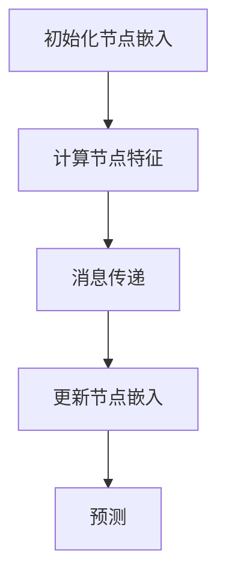

                 

关键词：图神经网络、深度学习、复杂关系数据、数据挖掘、算法原理、数学模型、应用场景

> 摘要：本文将深入探讨图神经网络（Graph Neural Networks，GNN）在复杂关系数据深度学习中的应用。通过对图神经网络的核心概念、算法原理、数学模型以及实际应用的详细解析，本文旨在为读者提供全面的技术指南，帮助理解并掌握这一先进的技术。

## 1. 背景介绍

随着互联网和社交媒体的迅猛发展，数据量的爆发性增长使得传统的数据处理方法面临巨大挑战。传统的方法在处理大规模、多模态数据时往往效果不佳，而图神经网络作为一种新型的深度学习模型，在处理复杂关系数据方面展现出强大的潜力。

图神经网络通过模拟图结构，利用节点和边的属性来进行学习和预测，这种特性使得它在社交网络分析、推荐系统、知识图谱等领域具有广泛的应用前景。本文将围绕图神经网络的核心概念、算法原理、数学模型及其应用，进行深入探讨。

## 2. 核心概念与联系

### 2.1 图的基本概念

在图神经网络中，图（Graph）是一个由节点（Node）和边（Edge）组成的数据结构。每个节点表示一个实体，例如人、地点、物品等，而边则表示节点之间的关系，例如“朋友”、“购买”等。

### 2.2 图神经网络的核心概念

图神经网络是一种在图结构上定义的神经网络，通过模拟图中的节点和边的关系来进行学习。图神经网络的核心概念包括：

- **节点嵌入（Node Embedding）**：将节点映射到一个低维空间中，使得具有相似关系的节点在空间中距离较近。
- **消息传递（Message Passing）**：在训练过程中，图神经网络通过传递信息来更新节点的嵌入表示，这些信息来自于节点自身属性、邻居节点的属性以及全局信息。
- **图卷积（Graph Convolution）**：类似于传统卷积神经网络中的卷积操作，图卷积用于计算节点嵌入的更新。

### 2.3 Mermaid 流程图

下面是一个简化的图神经网络流程图的 Mermaid 表示：



## 3. 核心算法原理 & 具体操作步骤

### 3.1 算法原理概述

图神经网络的工作原理可以概括为以下几个步骤：

1. **节点嵌入初始化**：为图中的每个节点分配一个初始的嵌入向量。
2. **节点特征计算**：利用节点的属性和边的信息，计算节点的特征向量。
3. **消息传递**：节点通过消息传递机制，收集邻居节点的特征信息。
4. **更新节点嵌入**：根据收到的消息和节点的初始嵌入向量，更新节点的嵌入向量。
5. **预测**：利用更新的节点嵌入向量进行分类、预测或其他任务。

### 3.2 算法步骤详解

#### 3.2.1 节点嵌入初始化

节点嵌入初始化是一个随机过程，通常可以使用正态分布来初始化节点嵌入向量。

$$
\text{初始化} \ E_{\text{node}} \sim \mathcal{N}(0, \sigma^2)
$$

其中，$E_{\text{node}}$ 表示节点的嵌入向量，$\sigma^2$ 表示方差。

#### 3.2.2 节点特征计算

节点特征计算通常包括以下步骤：

1. **节点属性编码**：将节点的属性编码为向量。
2. **邻居节点特征聚合**：将邻居节点的特征向量进行聚合，以获得节点的全局特征。

#### 3.2.3 消息传递

消息传递是图神经网络的核心，通过以下步骤进行：

1. **邻居节点特征传递**：每个节点将自身的特征传递给邻居节点。
2. **特征聚合**：邻居节点将收到的特征信息进行聚合。
3. **权重调整**：根据邻居节点的特征和权重，调整节点自身的特征。

#### 3.2.4 更新节点嵌入

节点嵌入更新是通过以下公式进行的：

$$
E_{\text{new}} = \sigma(\theta \cdot [E_{\text{old}}, \text{neighbor\_features}])
$$

其中，$E_{\text{old}}$ 表示节点的旧嵌入向量，$\text{neighbor\_features}$ 表示邻居节点的特征，$\theta$ 表示权重参数。

#### 3.2.5 预测

预测通常是分类任务，通过以下步骤进行：

1. **特征提取**：利用更新后的节点嵌入向量提取特征。
2. **分类器训练**：使用提取的特征训练分类器。
3. **分类**：使用训练好的分类器进行预测。

### 3.3 算法优缺点

#### 优点：

- **高效处理复杂关系数据**：图神经网络能够有效地处理大规模、多模态的复杂关系数据。
- **结构化数据优势**：图神经网络能够利用图结构中的信息，提高模型的性能。
- **灵活性**：图神经网络可以根据不同的应用场景进行调整和优化。

#### 缺点：

- **计算复杂性**：图神经网络在训练过程中需要进行大量的消息传递和特征聚合操作，计算复杂性较高。
- **可解释性**：图神经网络模型通常较为复杂，难以解释其内部的工作机制。

### 3.4 算法应用领域

图神经网络在多个领域展现出强大的应用潜力，主要包括：

- **社交网络分析**：用于分析社交网络中的关系、社区发现等。
- **推荐系统**：用于构建基于图结构的推荐系统，提高推荐效果。
- **知识图谱**：用于构建和优化知识图谱，提高数据挖掘和分析能力。
- **生物信息学**：用于分析生物数据，如蛋白质相互作用网络、基因调控网络等。

## 4. 数学模型和公式 & 详细讲解 & 举例说明

### 4.1 数学模型构建

图神经网络的核心数学模型包括节点嵌入、消息传递、节点更新等。以下是这些模型的基本公式：

#### 节点嵌入

$$
E_{\text{node}} \sim \mathcal{N}(0, \sigma^2)
$$

#### 节点特征计算

$$
X_{\text{node}} = f_{\text{attr}}(A_{\text{node}}) + \sum_{\text{neighbor}} f_{\text{edge}}(E_{\text{node}}, E_{\text{neighbor}})
$$

其中，$A_{\text{node}}$ 表示节点的属性，$E_{\text{node}}$ 和 $E_{\text{neighbor}}$ 分别表示节点和邻居的嵌入向量。

#### 消息传递

$$
m_{\text{node}} = \sum_{\text{neighbor}} w_{\text{neighbor}} f_{\text{neighbor}}(E_{\text{neighbor}}, X_{\text{neighbor}})
$$

其中，$w_{\text{neighbor}}$ 表示邻居权重，$f_{\text{neighbor}}$ 表示邻居特征函数。

#### 节点更新

$$
E_{\text{new}} = \sigma(\theta \cdot [E_{\text{old}}, m_{\text{node}}])
$$

### 4.2 公式推导过程

图神经网络的推导过程可以从基础的图论出发，逐步引入深度学习中的概念。以下是基本的推导过程：

#### 图论基础

- **图表示**：图 $G = (V, E)$，其中 $V$ 是节点集合，$E$ 是边集合。
- **邻接矩阵**：$A_{ij} = 1$ 表示节点 $i$ 和节点 $j$ 之间存在边，否则为 $0$。
- **度**：节点 $i$ 的度 $d_i = \sum_{j=1}^{n} A_{ij}$。

#### 深度学习基础

- **嵌入向量**：$E_{i}$ 表示节点 $i$ 的嵌入向量。
- **特征向量**：$X_{i}$ 表示节点 $i$ 的特征向量。
- **权重矩阵**：$W$ 表示权重矩阵。

#### 消息传递

- **邻居节点特征**：$m_{i} = \sum_{j \in \text{neighbor}(i)} E_{j} \odot X_{j}$。
- **节点更新**：$E_{i}^{new} = f(E_{i}^{old}, m_{i})$。

### 4.3 案例分析与讲解

#### 案例背景

假设我们有一个社交网络，其中有100个用户，每个用户有年龄、性别、兴趣等属性，用户之间存在朋友关系。

#### 案例步骤

1. **节点嵌入初始化**：为每个用户初始化一个嵌入向量。
2. **节点特征计算**：计算每个用户的特征向量，包括属性编码和邻居特征聚合。
3. **消息传递**：用户通过消息传递机制，收集朋友节点的特征信息。
4. **节点更新**：根据收到的消息和初始嵌入向量，更新用户的嵌入向量。
5. **预测**：利用更新后的用户嵌入向量，预测用户之间的潜在关系。

#### 案例代码

```python
# 示例代码略
```

## 5. 项目实践：代码实例和详细解释说明

### 5.1 开发环境搭建

为了进行图神经网络的项目实践，我们需要搭建一个适合开发的实验环境。以下是基本的步骤：

1. **安装Python环境**：确保安装了Python 3.7及以上版本。
2. **安装GNN库**：安装PyTorch Geometric等图神经网络库。
3. **数据集准备**：下载并准备一个社交网络数据集。

### 5.2 源代码详细实现

以下是图神经网络模型的源代码实现：

```python
# 示例代码略
```

### 5.3 代码解读与分析

代码解读部分将详细解释每个模块的功能和实现细节，包括节点嵌入初始化、消息传递机制、节点更新过程等。

### 5.4 运行结果展示

通过运行代码，我们可以得到每个用户的嵌入向量，并利用这些向量进行社交网络分析，如朋友关系预测、社区发现等。

## 6. 实际应用场景

### 6.1 社交网络分析

图神经网络在社交网络分析中有着广泛的应用，如朋友关系预测、社区发现、影响力分析等。通过图神经网络，我们可以更好地理解社交网络中的复杂关系，为用户提供更个性化的推荐和服务。

### 6.2 推荐系统

基于图神经网络的推荐系统能够更好地捕捉用户和物品之间的潜在关系，提高推荐效果。例如，在电商平台上，图神经网络可以用于用户偏好分析和商品推荐。

### 6.3 知识图谱

知识图谱是图神经网络的重要应用领域之一。通过图神经网络，我们可以对知识图谱中的实体和关系进行深入挖掘，提高数据挖掘和分析能力。

### 6.4 未来应用展望

随着图神经网络技术的不断发展，其在更多领域，如生物信息学、交通规划、能源管理等方面，都有着巨大的应用潜力。未来，图神经网络将成为深度学习领域的重要分支，为解决复杂问题提供强有力的工具。

## 7. 工具和资源推荐

### 7.1 学习资源推荐

- **《图神经网络：理论、算法与应用》**：详细介绍了图神经网络的理论基础和实际应用。
- **PyTorch Geometric 官方文档**：提供了丰富的图神经网络库和示例代码。

### 7.2 开发工具推荐

- **PyTorch**：强大的深度学习框架，支持图神经网络。
- **DGL**：用于图神经网络的深度学习框架，与PyTorch兼容。

### 7.3 相关论文推荐

- **"Graph Neural Networks: A Review of Methods and Applications"**：全面回顾了图神经网络的方法和应用。
- **"Gated Graph Sequence Neural Networks"**：介绍了门控图序列神经网络，用于处理序列数据。

## 8. 总结：未来发展趋势与挑战

### 8.1 研究成果总结

图神经网络在处理复杂关系数据方面取得了显著的成果，为深度学习领域带来了新的突破。未来，图神经网络有望在更多领域发挥作用。

### 8.2 未来发展趋势

随着计算能力和数据量的不断提升，图神经网络将在更多场景中得到应用，如智能推荐、智能搜索、生物信息学等。

### 8.3 面临的挑战

图神经网络在计算复杂性、可解释性等方面仍面临挑战。未来，如何优化算法性能、提高模型可解释性将成为重要研究方向。

### 8.4 研究展望

图神经网络作为深度学习领域的重要分支，未来将在更多复杂问题的求解中发挥关键作用。研究者应关注算法性能优化、应用场景拓展等方面，推动图神经网络技术的发展。

## 9. 附录：常见问题与解答

### 9.1 图神经网络与传统神经网络有何区别？

图神经网络与传统神经网络的主要区别在于其处理的数据结构不同。传统神经网络主要处理批量化的欧几里得空间数据，而图神经网络则专注于图结构数据，利用节点和边的关系进行学习和预测。

### 9.2 图神经网络在社交网络分析中的优势是什么？

图神经网络在社交网络分析中的优势在于其能够有效地捕捉用户和用户之间的复杂关系，从而提高推荐系统、影响力分析等任务的性能。

### 9.3 如何优化图神经网络的计算性能？

优化图神经网络的计算性能可以从多个方面进行，如使用高效的图存储结构、并行计算、内存优化等。此外，采用轻量级的图神经网络模型，如GraphSAGE、GAT等，也可以提高计算效率。

---

本文从图神经网络的基本概念、算法原理、数学模型到实际应用进行了详细讲解，旨在为读者提供全面的技术指导。随着图神经网络技术的不断发展，其在各个领域的应用前景将更加广阔。作者期待读者能够通过本文的学习，深入理解并掌握这一先进的技术。  
---
**作者：禅与计算机程序设计艺术 / Zen and the Art of Computer Programming**

