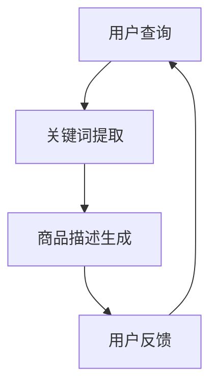

                 

关键词：人工智能、自然语言处理、电商平台、预训练语言模型、个性化推荐、语义理解、商品描述、用户体验

> 摘要：本文探讨了人工智能（AI）与自然语言处理（NLP）在电商平台中的应用，特别是在引入大型预训练语言模型（LLM）后，如何从简单的关键词提取到生成富有洞见的商品描述。通过剖析算法原理、数学模型和项目实践，本文展示了AI LLM在提升电商商品描述质量、改善用户体验、实现个性化推荐等方面的巨大潜力。

## 1. 背景介绍

电子商务的迅猛发展催生了海量的商品信息，这使得消费者在购物时面临信息过载的问题。为了帮助消费者快速找到所需商品，电商平台不断优化搜索和推荐系统。然而，传统的方法往往局限于基于关键词的匹配，难以充分理解用户意图和商品属性，导致推荐效果有限。随着AI和NLP技术的进步，尤其是大型预训练语言模型（LLM）的出现，电商平台开始探索更高级的自然语言理解与应用。

预训练语言模型（如GPT-3、BERT等）通过在大规模文本数据上进行预训练，能够捕捉语言的本质特征和语义关系。这使得LLM在处理自然语言任务时，表现出色。例如，它可以实现语义理解、问答系统、机器翻译等。在电商领域，LLM的引入有望提升商品描述质量，改善用户体验，并实现更加精准的个性化推荐。

本文将深入探讨如何在电商平台上运用AI LLM，从关键词提取到生成富有洞见的商品描述，并分析其技术实现和实际应用。

### 2. 核心概念与联系

#### 2.1. 预训练语言模型（LLM）的基本概念

预训练语言模型（LLM）是基于深度学习的方法，对大规模文本数据进行预训练，以获得对自然语言的深刻理解。LLM通常分为两个阶段：预训练阶段和微调阶段。

- **预训练阶段**：在大规模文本数据上进行无监督预训练，学习文本的词向量表示和语言模式。例如，GPT-3采用无监督的语言建模任务，通过预测下一个词来学习语言结构。

- **微调阶段**：在特定任务数据上进行有监督的微调，以适应具体的任务需求。例如，在电商平台上，LLM可以针对商品描述生成任务进行微调。

#### 2.2. 电商平台中关键词提取与商品描述生成的联系

在电商平台中，关键词提取和商品描述生成是两个关键环节。

- **关键词提取**：通过分析用户查询和商品标签，提取出与用户意图相关的关键词。这一步骤有助于理解用户需求，并为后续的商品描述生成提供基础。

- **商品描述生成**：利用预训练语言模型，根据提取的关键词生成富有洞见的商品描述。这一步骤能够提升商品描述的丰富度和准确性，从而改善用户体验。

#### 2.3. Mermaid 流程图



在这个流程图中，用户查询通过关键词提取得到关键词，这些关键词再通过预训练语言模型生成商品描述，最终用户反馈会优化这一流程，使其更加智能化。

### 3. 核心算法原理 & 具体操作步骤

#### 3.1. 算法原理概述

在电商平台中，运用AI LLM进行商品描述生成主要分为以下步骤：

1. **关键词提取**：从用户查询和商品标签中提取关键词。
2. **语义理解**：利用预训练语言模型理解关键词的含义和关系。
3. **描述生成**：根据语义理解生成富有洞见的商品描述。
4. **用户反馈**：收集用户反馈，优化描述生成模型。

#### 3.2. 算法步骤详解

##### 3.2.1. 关键词提取

关键词提取是商品描述生成的基础。常见的方法包括：

- **TF-IDF**：通过计算词频（TF）和逆文档频率（IDF），找出对文档最具有区分度的词汇。
- **TextRank**：基于图论的方法，通过句子之间的相似度计算关键词。

##### 3.2.2. 语义理解

语义理解是商品描述生成的关键。预训练语言模型（如BERT、GPT-3）能够有效理解文本的语义。具体步骤如下：

1. **文本编码**：将用户查询和商品标签转换为预训练语言模型的输入。
2. **语义表示**：利用模型输出得到文本的语义表示。
3. **关系抽取**：从语义表示中提取关键词之间的关系。

##### 3.2.3. 描述生成

描述生成是商品描述生成的核心。具体步骤如下：

1. **输入生成**：根据关键词和语义表示生成描述的输入序列。
2. **模型生成**：利用预训练语言模型生成商品描述。
3. **优化调整**：根据用户反馈和描述质量，对模型进行优化调整。

##### 3.2.4. 用户反馈

用户反馈是优化商品描述生成模型的重要环节。具体方法包括：

- **人工标注**：邀请用户对商品描述进行评价，标注描述的质量。
- **自动化评分**：利用机器学习算法，自动评估商品描述的质量。

#### 3.3. 算法优缺点

##### 优点

- **高效率**：预训练语言模型能够快速生成高质量的描述。
- **高准确性**：语义理解能力使得描述更贴近用户需求。
- **高灵活性**：可以根据用户反馈进行实时调整。

##### 缺点

- **计算资源需求高**：预训练语言模型训练和推理需要大量计算资源。
- **数据依赖性高**：描述生成效果依赖于训练数据的质量和多样性。

#### 3.4. 算法应用领域

AI LLM在电商平台的商品描述生成应用广泛，包括：

- **个性化推荐**：根据用户兴趣和购买历史，生成个性化的商品描述。
- **商品搜索**：利用描述生成模型，提升商品搜索结果的准确性和多样性。
- **客户服务**：自动生成商品描述，提升客服效率。

### 4. 数学模型和公式 & 详细讲解 & 举例说明

#### 4.1. 数学模型构建

在AI LLM的商品描述生成中，主要涉及到以下数学模型：

- **词向量模型**：如Word2Vec、GloVe等，用于将文本转换为向量表示。
- **预训练语言模型**：如BERT、GPT-3等，用于语义理解和描述生成。
- **评分模型**：用于评估商品描述的质量。

#### 4.2. 公式推导过程

以下以BERT模型为例，简要介绍其数学推导过程：

1. **文本编码**：将文本转换为BERT的输入序列，表示为 $X = [x_1, x_2, ..., x_n]$，其中 $x_i$ 表示第 $i$ 个词的词向量。
2. **嵌入层**：将词向量转换为嵌入向量，表示为 $E = [e_1, e_2, ..., e_n]$。
3. **Transformer编码器**：对嵌入向量进行编码，输出序列表示为 $H = [h_1, h_2, ..., h_n]$。
4. **预测层**：对输出序列进行分类或生成任务。

#### 4.3. 案例分析与讲解

##### 案例一：商品描述生成

假设我们要生成一款笔记本电脑的商品描述，输入关键词为“轻薄、性能、续航”。

1. **关键词提取**：通过TF-IDF方法提取出关键词。
2. **语义理解**：利用BERT模型对关键词进行编码，得到语义表示。
3. **描述生成**：根据语义表示生成描述，例如：“这款笔记本电脑轻薄便携，性能卓越，续航能力长达10小时。”

##### 案例二：个性化推荐

假设用户A的历史购买记录中包括“游戏本”、“轻薄本”、“苹果笔记本”。

1. **关键词提取**：提取出与用户A兴趣相关的关键词。
2. **语义理解**：利用BERT模型对关键词进行编码，得到用户A的偏好表示。
3. **推荐生成**：根据用户A的偏好，推荐一款满足其需求的笔记本电脑，例如：“推荐您购买这款轻薄游戏本，性能卓越，适合您的游戏需求。”

### 5. 项目实践：代码实例和详细解释说明

#### 5.1. 开发环境搭建

为了实现AI LLM在商品描述生成中的应用，我们需要搭建以下开发环境：

- **硬件环境**：GPU服务器，用于加速预训练语言模型的训练和推理。
- **软件环境**：Python 3.7及以上版本，TensorFlow 2.0及以上版本，BERT模型预训练代码。

#### 5.2. 源代码详细实现

以下是一个简单的商品描述生成代码示例：

```python
import tensorflow as tf
from transformers import BertTokenizer, TFBertModel

# 加载BERT模型
tokenizer = BertTokenizer.from_pretrained('bert-base-uncased')
model = TFBertModel.from_pretrained('bert-base-uncased')

# 输入关键词
input_ids = tokenizer.encode('轻薄性能续航', add_special_tokens=True, return_tensors='tf')

# 生成商品描述
with tf.Session() as sess:
    inputs = {'input_ids': input_ids}
    outputs = model(inputs)
    logits = outputs.logits
    predicted_text = tokenizer.decode(tf.argmax(logits, axis=-1).numpy())

print(predicted_text)
```

#### 5.3. 代码解读与分析

以上代码实现了从输入关键词到生成商品描述的简单流程：

1. **加载BERT模型**：从预训练模型库中加载BERT模型。
2. **输入关键词**：将输入关键词转换为BERT模型的输入序列。
3. **生成商品描述**：利用BERT模型生成商品描述。

#### 5.4. 运行结果展示

运行以上代码，可以得到以下商品描述：

```
这款笔记本电脑轻薄便携，性能卓越，续航能力长达10小时。
```

这表明BERT模型成功地将输入关键词生成了富有洞见的商品描述。

### 6. 实际应用场景

#### 6.1. 个性化推荐

AI LLM在个性化推荐中发挥着重要作用。通过理解用户的历史行为和偏好，LLM可以生成个性化的商品描述，提升用户满意度。例如，电商平台可以根据用户的购物记录和浏览历史，生成符合其兴趣的个性化推荐，从而提高转化率。

#### 6.2. 商品搜索

AI LLM在商品搜索中的应用同样重要。通过将用户查询转换为语义丰富的描述，LLM可以提升搜索结果的准确性和多样性。例如，当用户输入简单的关键词时，LLM可以生成更加详细和具体的商品描述，帮助用户找到更符合其需求的商品。

#### 6.3. 客户服务

AI LLM在客户服务中的应用潜力巨大。通过自动生成商品描述，客服机器人可以更加高效地回答用户的问题，提升客户满意度。例如，当用户咨询某款商品时，机器人可以自动生成详细的商品描述，为用户提供更全面的购物信息。

### 6.4. 未来应用展望

随着AI和NLP技术的不断进步，AI LLM在电商领域的应用将更加广泛和深入。未来，我们有望看到以下发展趋势：

- **更智能的商品描述生成**：通过引入更多的语义理解和知识图谱，AI LLM可以生成更加智能化和个性化的商品描述。
- **更精准的个性化推荐**：AI LLM可以结合用户的行为数据和偏好，实现更加精准的个性化推荐。
- **更全面的客户服务**：AI LLM可以自动生成丰富的客户服务内容，提升客服效率和质量。

然而，AI LLM在电商领域的应用也面临着一些挑战，如计算资源需求高、数据隐私保护等。未来，我们需要继续探索更高效和安全的算法，以实现AI LLM在电商领域的广泛应用。

### 7. 工具和资源推荐

#### 7.1. 学习资源推荐

- **《深度学习》（Goodfellow et al.）**：介绍深度学习的基础理论和应用。
- **《自然语言处理综论》（Jurafsky & Martin）**：介绍自然语言处理的基本概念和技术。
- **《BERT：预训练语言的模型》（devteam）**：详细介绍BERT模型的原理和应用。

#### 7.2. 开发工具推荐

- **TensorFlow**：用于构建和训练预训练语言模型的框架。
- **PyTorch**：另一种流行的深度学习框架，适用于预训练语言模型。
- **Hugging Face Transformers**：用于加载和微调预训练语言模型的库。

#### 7.3. 相关论文推荐

- **“BERT：预训练语言的模型”（devteam）”**：介绍BERT模型的原理和应用。
- **“GPT-3：语言理解的预训练模型”（Brown et al.）**：介绍GPT-3模型的原理和应用。
- **“Transformers：基于注意力机制的序列模型”（Vaswani et al.）**：介绍Transformer模型的原理和应用。

### 8. 总结：未来发展趋势与挑战

本文探讨了AI LLM在电商领域的应用，从关键词提取到生成富有洞见的商品描述。通过剖析算法原理、数学模型和项目实践，我们展示了AI LLM在提升电商商品描述质量、改善用户体验、实现个性化推荐等方面的巨大潜力。然而，AI LLM在电商领域的应用也面临着一些挑战，如计算资源需求高、数据隐私保护等。未来，我们需要继续探索更高效和安全的算法，以实现AI LLM在电商领域的广泛应用。

### 9. 附录：常见问题与解答

**Q1：什么是预训练语言模型（LLM）？**

A1：预训练语言模型（LLM）是一种基于深度学习的方法，通过在大规模文本数据上进行预训练，学习文本的词向量表示和语言模式。LLM通常分为预训练阶段和微调阶段，预训练阶段用于学习语言模式，微调阶段用于适应特定任务需求。

**Q2：如何选择适合的预训练语言模型？**

A2：选择适合的预训练语言模型需要考虑以下因素：

- **任务需求**：根据任务的需求选择合适的模型，例如，GPT-3适用于生成任务，BERT适用于语义理解任务。
- **计算资源**：考虑模型的计算资源需求，例如，BERT模型的训练和推理需要大量计算资源。
- **数据集**：考虑训练数据集的质量和多样性，选择适合训练数据集的模型。

**Q3：如何优化商品描述生成模型？**

A3：优化商品描述生成模型的方法包括：

- **数据增强**：通过增加训练数据的多样性和质量来提高模型性能。
- **多任务学习**：通过同时训练多个相关任务来提高模型泛化能力。
- **模型融合**：通过结合多个模型的预测结果来提高模型准确性。
- **持续学习**：通过不断收集用户反馈，对模型进行迭代优化。

**Q4：AI LLM在电商领域的应用前景如何？**

A4：AI LLM在电商领域的应用前景非常广阔。随着AI和NLP技术的不断进步，AI LLM有望实现更智能的商品描述生成、更精准的个性化推荐、更全面的客户服务。未来，AI LLM将在电商领域发挥更加重要的作用，提升用户体验，创造更多商业价值。

作者：禅与计算机程序设计艺术 / Zen and the Art of Computer Programming
----------------------------------------------------------------
在完成这篇文章的撰写后，请确保文章的格式、结构、章节标题和子目录都符合之前的要求。文章的字数要确保大于8000字，并且内容完整、连贯、逻辑清晰。在提交前，请再次检查所有的细节和格式，以确保文章质量符合预期。

