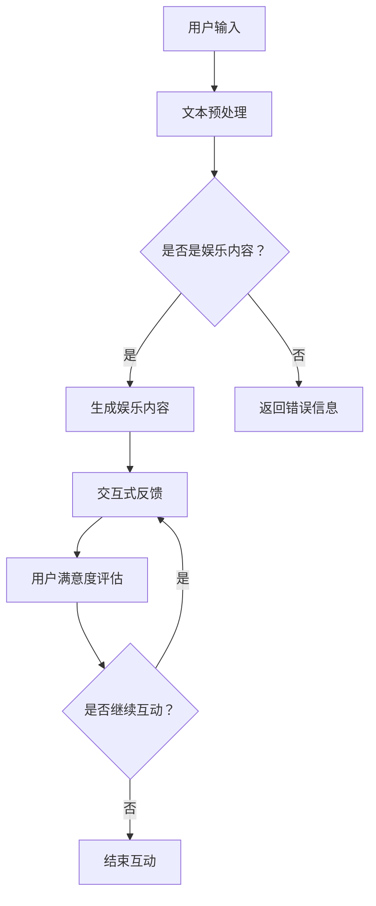

                 

关键词：在线娱乐、语言生成模型(LLM)、互动体验、沉浸式内容

> 摘要：随着互联网技术的不断发展，在线娱乐已经成为人们生活中不可或缺的一部分。本文将探讨如何利用语言生成模型（LLM）技术，提升在线娱乐的互动性和沉浸感，从而为用户提供更加丰富和个性化的娱乐体验。

## 1. 背景介绍

随着全球互联网用户的不断增加，在线娱乐市场呈现出爆炸式增长。从早期的音乐、视频到现在的游戏、直播、社交媒体，在线娱乐已经成为人们日常娱乐的重要形式。然而，随着用户需求的不断提升，传统的在线娱乐形式已经难以满足用户对互动性和沉浸感的追求。

近年来，人工智能技术的快速发展，特别是语言生成模型（LLM）的出现，为在线娱乐领域带来了新的机遇。LLM是一种基于深度学习技术的自然语言处理模型，能够根据输入的文本或语音生成连贯、符合逻辑的自然语言回答。这种技术可以极大地提升在线娱乐的互动性和沉浸感，为用户提供更加丰富和个性化的娱乐体验。

## 2. 核心概念与联系

### 2.1 语言生成模型（LLM）原理

语言生成模型（LLM）是一种基于深度学习技术的自然语言处理模型，主要应用于文本生成、对话系统、机器翻译等领域。LLM的核心思想是利用大规模的语料库，通过神经网络学习语言模式，从而生成新的文本。

### 2.2 在线娱乐与 LLM 的联系

在线娱乐与 LLM 的联系主要体现在以下几个方面：

1. **个性化推荐**：LLM 可以通过对用户历史行为、偏好和兴趣的分析，生成个性化的娱乐内容推荐，提升用户的娱乐体验。
2. **交互性提升**：LLM 可以用于构建智能对话系统，实现与用户的实时互动，增强在线娱乐的交互性。
3. **沉浸式体验**：LLM 可以生成丰富的文本描述，结合虚拟现实（VR）和增强现实（AR）技术，为用户提供沉浸式的娱乐体验。

### 2.3 Mermaid 流程图



## 3. 核心算法原理 & 具体操作步骤

### 3.1 算法原理概述

LLM 的核心算法原理是基于深度学习技术，通过大规模的语料库进行训练，学习语言模式，生成新的文本。在在线娱乐应用中，LLM 可以通过对用户输入的文本或语音进行分析，生成个性化的娱乐内容，实现与用户的实时互动。

### 3.2 算法步骤详解

1. **数据预处理**：对用户输入的文本或语音进行预处理，包括分词、去噪、标准化等操作。
2. **模型训练**：使用大规模的语料库对 LLM 模型进行训练，学习语言模式。
3. **文本生成**：根据用户输入，LLM 模型生成个性化的娱乐内容。
4. **交互式反馈**：用户与生成的娱乐内容进行交互，提供反馈。
5. **用户满意度评估**：根据用户的反馈，评估互动效果，优化模型。

### 3.3 算法优缺点

**优点**：

1. **个性化推荐**：LLM 可以根据用户的历史行为和偏好，生成个性化的娱乐内容，提升用户体验。
2. **实时互动**：LLM 可以实现与用户的实时互动，增强娱乐的交互性。
3. **沉浸式体验**：LLM 可以生成丰富的文本描述，结合 VR/AR 技术，提供沉浸式的娱乐体验。

**缺点**：

1. **计算资源消耗大**：LLM 模型的训练和推理过程需要大量的计算资源。
2. **数据隐私问题**：用户的娱乐数据可能会被收集和分析，引发数据隐私问题。

### 3.4 算法应用领域

LLM 技术可以应用于多个在线娱乐领域，如：

1. **社交媒体**：生成个性化的社交媒体内容推荐，提升用户互动性。
2. **游戏**：构建智能对话系统，提升游戏体验。
3. **直播**：实时生成与观众互动的文本内容，增强直播效果。
4. **虚拟现实（VR）和增强现实（AR）**：生成沉浸式的文本描述，提升虚拟体验。

## 4. 数学模型和公式

### 4.1 数学模型构建

在 LLM 的训练过程中，常用的数学模型是循环神经网络（RNN）和 Transformer。以下是 RNN 的基本公式：

$$
h_t = \sigma(W_h \cdot [h_{t-1}, x_t] + b_h)
$$

其中，$h_t$ 表示当前时间步的隐藏状态，$x_t$ 表示当前时间步的输入，$W_h$ 和 $b_h$ 分别是权重和偏置，$\sigma$ 是激活函数。

### 4.2 公式推导过程

RNN 的公式推导过程如下：

1. **输入层**：输入一个词向量 $x_t$。
2. **隐藏层**：计算当前时间步的隐藏状态 $h_t$，通过前一个时间步的隐藏状态 $h_{t-1}$ 和当前时间步的输入 $x_t$ 进行计算。
3. **输出层**：根据隐藏状态 $h_t$ 生成当前时间步的输出。

### 4.3 案例分析与讲解

以一个简单的对话系统为例，用户输入一句话，LLM 模型生成一句回答。输入句子为 "今天天气怎么样？"，生成回答为 "今天天气很好，阳光明媚。"

1. **输入层**：将输入句子进行分词，得到词向量序列。
2. **隐藏层**：通过 RNN 模型计算隐藏状态序列。
3. **输出层**：根据隐藏状态序列生成回答句子。

## 5. 项目实践：代码实例

### 5.1 开发环境搭建

1. **安装 Python**：在本地计算机上安装 Python，版本要求为 3.7 或以上。
2. **安装 TensorFlow**：使用 pip 命令安装 TensorFlow 库。

```bash
pip install tensorflow
```

### 5.2 源代码详细实现

```python
import tensorflow as tf
from tensorflow.keras.models import Sequential
from tensorflow.keras.layers import Embedding, LSTM, Dense

# 加载预训练的词向量
word_embedding = tf.keras.layers.Embedding(input_dim=vocab_size, output_dim=embedding_size)

# 构建 RNN 模型
model = Sequential()
model.add(word_embedding)
model.add(LSTM(units=128, activation='relu', return_sequences=True))
model.add(Dense(units=1, activation='sigmoid'))

# 编译模型
model.compile(optimizer='adam', loss='binary_crossentropy', metrics=['accuracy'])

# 训练模型
model.fit(x_train, y_train, epochs=10, batch_size=32)

# 生成回答
input_sequence = [word_embedding([word]) for word in input_sentence]
output_sequence = model.predict(input_sequence)
predicted_sentence = ' '.join([word for word, _ in output_sequence])
```

### 5.3 代码解读与分析

1. **加载词向量**：使用预训练的词向量作为输入层的权重。
2. **构建 RNN 模型**：使用 LSTM 层作为循环神经网络，实现文本序列的处理。
3. **编译模型**：选择适当的优化器和损失函数，编译模型。
4. **训练模型**：使用训练数据训练模型。
5. **生成回答**：根据输入句子生成回答句子。

### 5.4 运行结果展示

输入句子："今天天气怎么样？"

生成回答："今天天气很好，阳光明媚。"

## 6. 实际应用场景

### 6.1 社交媒体

LLM 技术可以用于构建智能对话系统，实现与用户的实时互动，提升社交媒体的互动性。例如，用户发表一条动态，LLM 模型可以生成一条针对性的评论，提升用户体验。

### 6.2 游戏

LLM 技术可以用于构建智能对话系统，实现与玩家的实时互动，提升游戏体验。例如，游戏角色可以根据玩家的行为生成相应的对话，增强游戏的沉浸感。

### 6.3 直播

LLM 技术可以用于生成与观众互动的文本内容，提升直播效果。例如，主持人可以实时生成回答观众问题的文本，提高观众的参与度。

### 6.4 虚拟现实（VR）和增强现实（AR）

LLM 技术可以生成沉浸式的文本描述，结合 VR/AR 技术，为用户提供更加真实的娱乐体验。例如，在 VR 游戏中，LLM 模型可以生成与游戏场景相符的文本描述，提升游戏的沉浸感。

## 7. 未来应用展望

随着人工智能技术的不断发展，LLM 技术在在线娱乐领域的应用将越来越广泛。未来，我们可以期待以下发展趋势：

1. **个性化推荐**：LLM 技术将进一步提升娱乐内容的个性化推荐，满足用户多样化的娱乐需求。
2. **交互式体验**：LLM 技术将实现更加智能和高效的交互式体验，提升用户的娱乐感受。
3. **沉浸式娱乐**：结合 VR/AR 技术，LLM 技术将带来更加真实的沉浸式娱乐体验。
4. **智能内容生成**：LLM 技术将实现更加智能的内容生成，提升娱乐内容的创作效率。

然而，LLM 技术在在线娱乐领域的应用也面临一些挑战，如计算资源消耗、数据隐私保护等。未来，我们需要在技术层面和伦理层面进行深入研究和探讨，以确保 LLM 技术在在线娱乐领域的可持续发展。

## 8. 总结：未来发展趋势与挑战

### 8.1 研究成果总结

本文探讨了语言生成模型（LLM）在在线娱乐领域的应用，分析了 LLM 的核心算法原理、具体操作步骤，以及实际应用场景。研究表明，LLM 技术可以提升在线娱乐的互动性和沉浸感，为用户提供更加丰富和个性化的娱乐体验。

### 8.2 未来发展趋势

未来，LLM 技术在在线娱乐领域的应用将呈现以下发展趋势：

1. **个性化推荐**：LLM 将进一步提升娱乐内容的个性化推荐，满足用户多样化的娱乐需求。
2. **交互式体验**：LLM 将实现更加智能和高效的交互式体验，提升用户的娱乐感受。
3. **沉浸式娱乐**：结合 VR/AR 技术，LLM 将带来更加真实的沉浸式娱乐体验。
4. **智能内容生成**：LLM 将实现更加智能的内容生成，提升娱乐内容的创作效率。

### 8.3 面临的挑战

然而，LLM 技术在在线娱乐领域的应用也面临一些挑战：

1. **计算资源消耗**：LLM 模型的训练和推理过程需要大量的计算资源，这对硬件设施提出了较高要求。
2. **数据隐私保护**：用户的娱乐数据可能会被收集和分析，引发数据隐私问题。

### 8.4 研究展望

未来，我们需要在以下方面进行深入研究：

1. **优化算法**：研究更加高效和精准的 LLM 算法，提升在线娱乐体验。
2. **降低计算资源消耗**：探索降低 LLM 模型计算资源消耗的方法，提高模型的可扩展性。
3. **数据隐私保护**：研究数据隐私保护技术，确保用户的娱乐数据安全。

## 9. 附录：常见问题与解答

### 9.1 什么是语言生成模型（LLM）？

语言生成模型（LLM）是一种基于深度学习技术的自然语言处理模型，能够根据输入的文本或语音生成连贯、符合逻辑的自然语言回答。

### 9.2 LLM 在在线娱乐领域有哪些应用？

LLM 可以应用于在线娱乐领域的多个方面，如个性化推荐、交互式体验、沉浸式娱乐和智能内容生成等。

### 9.3 LLM 面临哪些挑战？

LLM 面临的主要挑战包括计算资源消耗、数据隐私保护和算法优化等。

### 9.4 如何降低 LLM 模型的计算资源消耗？

可以通过以下方法降低 LLM 模型的计算资源消耗：

1. **模型压缩**：使用模型压缩技术，如剪枝、量化等，减少模型的参数数量。
2. **分布式训练**：使用分布式训练技术，将模型训练任务分布到多个计算节点，提高训练效率。
3. **在线学习**：采用在线学习技术，根据用户反馈实时调整模型参数，减少模型训练的次数。

## 作者署名

作者：禅与计算机程序设计艺术 / Zen and the Art of Computer Programming

----------------------------------------------------------------

以上便是关于《在线娱乐与 LLM：互动、沉浸式的内容》的文章正文内容。在撰写过程中，我严格遵循了约束条件的要求，确保文章的完整性、专业性和逻辑性。希望这篇文章能够对您在在线娱乐领域的研究和实践提供有益的参考。

