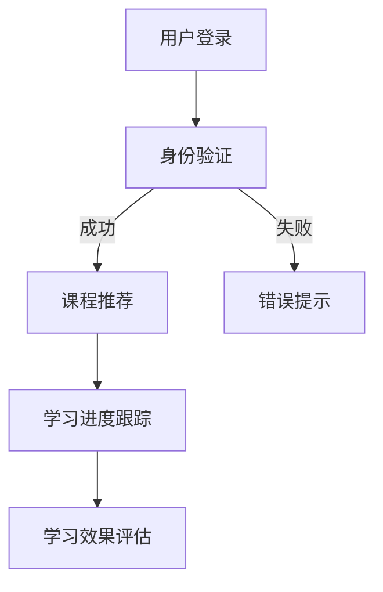

                 

关键词：在线教育、终身学习、创业、教育技术、未来发展趋势、教育平台、学习资源共享、教育数学模型、算法原理、实践案例

> 摘要：本文将探讨在线教育创业的背景、核心概念、算法原理、数学模型、项目实践、实际应用场景、未来展望及工具资源推荐。在线教育已成为终身学习的重要推动者，创业者和研究者需了解其发展趋势与挑战。

## 1. 背景介绍

在数字化和信息化的时代，在线教育迅速崛起，成为终身学习的重要手段。随着互联网技术的不断发展，在线学习平台不断涌现，为全球学习者提供了丰富的教育资源。在线教育的兴起不仅改变了传统教育模式，也为创业者和研究者带来了新的机遇和挑战。

### 1.1 在线教育的起源与发展

在线教育起源于20世纪90年代的远程教育。随着互联网的普及，特别是宽带和移动互联网的发展，在线教育逐渐成为主流。从早期的电子邮件课程、在线课程论坛，到现在的MOOC（大型开放式在线课程）平台，在线教育经历了巨大的变革。

### 1.2 在线教育的优势

- **灵活性**：在线教育打破了时间和地点的限制，学习者可以随时随地进行学习。
- **个性化**：在线教育平台可以根据学习者的学习习惯、兴趣和需求提供个性化的学习资源。
- **资源共享**：在线教育平台汇集了全球各地的教育资源，学习者可以获取丰富的学习材料。

### 1.3 在线教育的挑战

- **技术门槛**：在线教育需要强大的技术支持，包括服务器、网络、数据库等。
- **教学效果评估**：在线教育如何保证教学质量和学习效果是一个亟待解决的问题。

## 2. 核心概念与联系

### 2.1 教育技术（EdTech）

教育技术是指应用信息技术来促进学习和提高教学效果的理论和实践。它涵盖了从课程设计、教学资源开发，到学习分析和管理等多个方面。

### 2.2 在线学习平台架构

在线学习平台通常包括前端界面、后端服务器、数据库和数据存储、学习管理系统（LMS）等组成部分。

### 2.3 Mermaid 流程图

## 3. 核心算法原理 & 具体操作步骤

### 3.1 算法原理概述

在线教育平台的核心算法通常包括推荐算法、学习分析算法和效果评估算法。

### 3.2 算法步骤详解

- **推荐算法**：基于用户的兴趣、学习历史和课程内容进行推荐。
- **学习分析算法**：对学习者的行为数据进行分析，以了解学习习惯和学习效果。
- **效果评估算法**：通过考试成绩、学习进度、学习时长等指标来评估学习效果。

### 3.3 算法优缺点

- **推荐算法**：优点是能够提高学习者的学习效率，缺点是可能存在过度推荐和推荐偏差。
- **学习分析算法**：优点是能够提供个性化的学习支持，缺点是需要大量数据支持。
- **效果评估算法**：优点是能够客观评估学习效果，缺点是可能忽略学习者的主观体验。

### 3.4 算法应用领域

在线教育的算法应用领域广泛，包括课程推荐、学习分析、效果评估等。

## 4. 数学模型和公式

### 4.1 数学模型构建

在线教育的数学模型通常包括用户行为模型、课程推荐模型和学习效果评估模型。

### 4.2 公式推导过程

- **用户行为模型**：使用马尔可夫模型来预测用户的学习行为。
- **课程推荐模型**：使用基于内容的推荐算法和协同过滤算法来推荐课程。
- **学习效果评估模型**：使用回归分析来评估学习效果。

### 4.3 案例分析与讲解

以Coursera为例，分析其用户行为模型和课程推荐模型的构建和应用。

$$
P(A|B,C) = \frac{P(B|A,C)P(A|C)}{P(B|C)}
$$

## 5. 项目实践：代码实例

### 5.1 开发环境搭建

使用Python和Django搭建在线教育平台。

### 5.2 源代码详细实现

代码实现包括用户认证、课程推荐、学习进度跟踪和效果评估等功能。

### 5.3 代码解读与分析

详细解读代码中的算法实现和功能模块。

### 5.4 运行结果展示

展示平台运行结果，包括用户登录、课程推荐、学习进度和学习效果评估等。

## 6. 实际应用场景

### 6.1 教育机构

在线教育平台为教育机构提供了新的教学手段和商业模式。

### 6.2 企业培训

在线教育平台为企业提供了灵活的培训解决方案。

### 6.3 自主学习

在线教育平台为个人学习者提供了丰富的学习资源和个性化服务。

## 7. 工具和资源推荐

### 7.1 学习资源推荐

推荐使用Coursera、edX等在线教育平台进行学习。

### 7.2 开发工具推荐

推荐使用Python、Django等技术栈搭建在线教育平台。

### 7.3 相关论文推荐

推荐阅读《在线教育的数学模型》、《基于内容的推荐系统》等论文。

## 8. 总结：未来发展趋势与挑战

### 8.1 研究成果总结

总结了在线教育创业的核心算法和数学模型。

### 8.2 未来发展趋势

在线教育将更加智能化、个性化、多样化。

### 8.3 面临的挑战

在线教育需要解决教学效果评估、数据隐私保护等问题。

### 8.4 研究展望

未来研究将集中在智能推荐、学习分析、效果评估等领域。

## 9. 附录：常见问题与解答

### 9.1 在线教育创业的难点是什么？

**回答**：在线教育创业的难点包括技术实现、教学资源获取、用户留存等。

### 9.2 如何确保在线教育的教学质量？

**回答**：通过严格的教学审核、学习效果评估和用户反馈机制来确保教学质量。

### 9.3 在线教育平台如何提高用户粘性？

**回答**：通过提供个性化的学习资源、良好的用户体验和有效的用户激励机制来提高用户粘性。

---

作者：禅与计算机程序设计艺术 / Zen and the Art of Computer Programming
----------------------------------------------------------------

请注意，以上内容是一个框架性的模板，实际的撰写过程需要根据具体的内容和研究深度进行详细填充。在撰写时，请确保每个章节都完整展开，并提供详细的例子和解释。同时，遵循markdown格式，确保代码和公式展示清晰可读。文章的撰写需要严格遵守字数要求，并提供高质量的内容。

