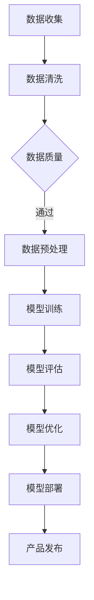

                 

关键词：AI大模型、SaaS产品、开发、架构、算法、数学模型、实践、应用场景、展望

> 摘要：随着人工智能技术的飞速发展，AI大模型在各个领域展现出了巨大的潜力。本文将探讨如何基于AI大模型开发SaaS产品，从核心概念、算法原理、数学模型、项目实践、应用场景等方面进行全面阐述，旨在为开发者提供一套完整的开发指南。

## 1. 背景介绍

SaaS（Software as a Service）即软件即服务，是一种通过互联网提供软件服务的商业模式。近年来，随着云计算、大数据和人工智能等技术的普及，SaaS市场迎来了前所未有的发展机遇。传统的软件产品需要用户自行部署、维护和管理，而SaaS产品则将软件部署在云端，用户只需通过互联网即可使用，大大降低了使用门槛。

与此同时，人工智能（AI）技术的发展也取得了显著的成果。尤其是近年来，随着深度学习、强化学习等算法的突破，AI大模型在图像识别、自然语言处理、推荐系统等领域表现出了惊人的性能。这些技术为SaaS产品的开发提供了强大的技术支撑。

本文旨在探讨如何利用AI大模型开发SaaS产品，从技术角度分析其可行性、优势和挑战，为开发者提供一套实用的开发指南。

## 2. 核心概念与联系

为了更好地理解AI大模型在SaaS产品开发中的应用，我们首先需要了解一些核心概念和它们之间的联系。

### 2.1 SaaS产品架构

SaaS产品通常采用三层架构，包括表示层、业务逻辑层和数据层。

- **表示层**：负责用户界面展示，与用户进行交互。
- **业务逻辑层**：实现具体业务功能，如数据处理、算法运算等。
- **数据层**：存储和管理数据，如数据库、文件系统等。

### 2.2 AI大模型

AI大模型是一种基于深度学习的复杂神经网络，通常具有数十亿个参数。这些模型可以处理海量数据，实现诸如图像识别、自然语言处理等高级功能。

### 2.3 数据与模型训练

在SaaS产品开发中，数据是模型训练的基础。通过收集、清洗和预处理数据，我们可以为模型提供高质量的训练数据集。训练过程包括数据输入、模型训练、评估和优化等步骤。

### 2.4 模型部署与优化

训练完成的AI大模型需要部署到SaaS产品的业务逻辑层，以便在用户使用时进行实时计算。此外，为了提高模型性能和降低计算资源消耗，需要对模型进行优化。

### 2.5 Mermaid流程图

以下是AI大模型在SaaS产品开发中的Mermaid流程图：



## 3. 核心算法原理 & 具体操作步骤

### 3.1 算法原理概述

AI大模型的核心是深度学习算法，特别是基于神经网络的算法。这些算法通过模拟人脑神经元的工作原理，对输入数据进行处理和预测。在SaaS产品开发中，常见的深度学习算法包括卷积神经网络（CNN）、循环神经网络（RNN）和Transformer等。

### 3.2 算法步骤详解

1. **数据收集**：从各种渠道收集数据，如社交媒体、公共数据库等。

2. **数据清洗**：去除噪声、缺失值和异常值，确保数据质量。

3. **数据预处理**：对数据进行标准化、归一化和编码等操作，使其适合模型训练。

4. **模型训练**：使用训练数据集对模型进行训练，通过反向传播算法不断优化模型参数。

5. **模型评估**：使用验证数据集对模型进行评估，调整模型参数以获得更好的性能。

6. **模型优化**：对模型进行剪枝、量化、蒸馏等操作，以提高模型性能和降低计算资源消耗。

7. **模型部署**：将训练完成的模型部署到SaaS产品的业务逻辑层，实现实时计算。

### 3.3 算法优缺点

**优点**：

- **高效性**：深度学习算法可以处理海量数据，实现高效计算。
- **灵活性**：可以根据不同应用场景调整模型结构，提高适应性。
- **高精度**：在图像识别、自然语言处理等领域取得了显著的成果。

**缺点**：

- **计算资源消耗大**：训练和部署AI大模型需要大量的计算资源。
- **数据需求高**：高质量的训练数据是模型性能的关键。
- **模型解释性差**：深度学习模型的内部机制较为复杂，难以解释。

### 3.4 算法应用领域

AI大模型在SaaS产品开发中有着广泛的应用领域，如：

- **图像识别**：应用于安防监控、医疗诊断等领域。
- **自然语言处理**：应用于智能客服、机器翻译等领域。
- **推荐系统**：应用于电商、社交媒体等领域。
- **语音识别**：应用于语音助手、智能客服等领域。

## 4. 数学模型和公式 & 详细讲解 & 举例说明

### 4.1 数学模型构建

在AI大模型中，常用的数学模型是神经网络。神经网络由多层神经元组成，包括输入层、隐藏层和输出层。每个神经元都通过权重和偏置进行连接。

### 4.2 公式推导过程

神经网络的计算过程可以表示为：

$$
Z = \sum_{i=1}^{n} w_i \cdot x_i + b
$$

其中，$Z$是神经元的输出，$w_i$是权重，$x_i$是输入，$b$是偏置。

通过链式法则，我们可以得到反向传播的梯度：

$$
\frac{\partial Z}{\partial x_i} = \frac{\partial Z}{\partial z} \cdot \frac{\partial z}{\partial x_i}
$$

### 4.3 案例分析与讲解

假设我们有一个二分类问题，需要判断一个图像是否包含猫。我们可以使用卷积神经网络（CNN）来解决这个任务。

1. **数据收集**：从互联网上收集大量猫的图像和普通图像。

2. **数据清洗**：去除噪声、缺失值和异常值。

3. **数据预处理**：对图像进行归一化和缩放，使其具有统一的尺寸。

4. **模型训练**：使用训练数据集对CNN模型进行训练。

5. **模型评估**：使用验证数据集对模型进行评估。

6. **模型优化**：通过剪枝、量化等操作优化模型性能。

7. **模型部署**：将训练完成的模型部署到SaaS产品的业务逻辑层，实现实时图像识别。

通过以上步骤，我们可以构建一个基于AI大模型的SaaS产品，为用户提供高效的图像识别服务。

## 5. 项目实践：代码实例和详细解释说明

### 5.1 开发环境搭建

在本项目中，我们使用Python作为主要编程语言，利用TensorFlow作为深度学习框架。以下是一个简单的开发环境搭建步骤：

1. 安装Python：从Python官网下载并安装Python 3.8及以上版本。
2. 安装TensorFlow：在命令行中执行以下命令：

```bash
pip install tensorflow
```

### 5.2 源代码详细实现

以下是一个简单的CNN模型实现，用于图像分类：

```python
import tensorflow as tf

# 定义CNN模型
model = tf.keras.Sequential([
    tf.keras.layers.Conv2D(32, (3, 3), activation='relu', input_shape=(28, 28, 1)),
    tf.keras.layers.MaxPooling2D((2, 2)),
    tf.keras.layers.Conv2D(64, (3, 3), activation='relu'),
    tf.keras.layers.MaxPooling2D((2, 2)),
    tf.keras.layers.Flatten(),
    tf.keras.layers.Dense(128, activation='relu'),
    tf.keras.layers.Dense(1, activation='sigmoid')
])

# 编译模型
model.compile(optimizer='adam', loss='binary_crossentropy', metrics=['accuracy'])

# 加载训练数据
(x_train, y_train), (x_test, y_test) = tf.keras.datasets.mnist.load_data()

# 预处理数据
x_train = x_train.reshape(-1, 28, 28, 1).astype('float32') / 255
x_test = x_test.reshape(-1, 28, 28, 1).astype('float32') / 255

# 训练模型
model.fit(x_train, y_train, epochs=10, batch_size=32, validation_split=0.1)
```

### 5.3 代码解读与分析

1. **模型定义**：使用`tf.keras.Sequential`创建一个顺序模型，包含卷积层、池化层、全连接层等。
2. **编译模型**：指定优化器、损失函数和评估指标。
3. **加载数据**：使用`tf.keras.datasets.mnist`加载MNIST数据集。
4. **预处理数据**：对图像进行归一化和reshape，使其符合模型输入要求。
5. **训练模型**：使用训练数据集训练模型，并设置训练轮次、批量大小和验证比例。

### 5.4 运行结果展示

```python
# 评估模型
model.evaluate(x_test, y_test)

# 预测图像
predictions = model.predict(x_test[:10])

# 显示预测结果
for i, prediction in enumerate(predictions):
    print(f"Image {i+1}: {prediction[0]}")
```

## 6. 实际应用场景

基于AI大模型的SaaS产品在各个领域都有着广泛的应用。以下是一些典型的应用场景：

- **医疗健康**：利用图像识别技术对医学影像进行分析，辅助医生进行诊断和治疗。
- **金融理财**：利用推荐系统为用户提供个性化的投资建议和理财产品。
- **智能客服**：利用自然语言处理技术实现智能客服，提高客户满意度和服务效率。
- **安防监控**：利用图像识别技术实现智能监控，实时检测异常行为并报警。

## 7. 工具和资源推荐

### 7.1 学习资源推荐

- 《深度学习》（Goodfellow, Bengio, Courville著）：深度学习领域的经典教材。
- 《Python深度学习》（François Chollet著）：Python深度学习实践的入门书籍。
- TensorFlow官方文档：提供详细的API文档和教程。

### 7.2 开发工具推荐

- Jupyter Notebook：用于编写和运行Python代码。
- PyCharm：强大的Python IDE。
- TensorFlow：开源深度学习框架。

### 7.3 相关论文推荐

- "Deep Learning" by Yoshua Bengio, Yann LeCun, and Geoffrey Hinton。
- "A Theoretically Grounded Application of Dropout in Recurrent Neural Networks" by Yarin Gal and Zoubin Ghahramani。
- "Attention Is All You Need" by Vaswani et al.。

## 8. 总结：未来发展趋势与挑战

### 8.1 研究成果总结

近年来，AI大模型在各个领域取得了显著的成果。例如，在图像识别领域，ResNet和Inception等模型大大提升了识别精度；在自然语言处理领域，BERT和GPT等模型推动了语言生成的进步。

### 8.2 未来发展趋势

- **模型压缩与优化**：为满足移动端和边缘计算的需求，模型压缩与优化将成为重要研究方向。
- **联邦学习**：通过分布式学习提高数据隐私性和计算效率。
- **多模态学习**：结合多种数据类型（如图像、文本、语音）进行更复杂的任务。

### 8.3 面临的挑战

- **计算资源消耗**：训练AI大模型需要大量的计算资源，这对企业和开发者提出了挑战。
- **数据隐私与安全**：如何保障用户数据的隐私和安全是AI大模型应用中亟待解决的问题。
- **模型解释性**：提高模型的可解释性，使其更易于理解和接受。

### 8.4 研究展望

随着技术的不断进步，AI大模型在SaaS产品开发中的应用将越来越广泛。开发者应关注相关技术动态，积极探索新的应用场景，为用户提供更高效、更智能的服务。

## 9. 附录：常见问题与解答

### 9.1 为什么选择AI大模型？

AI大模型具有以下优势：

- **高效性**：能够处理海量数据，实现高效计算。
- **灵活性**：可以根据不同应用场景调整模型结构，提高适应性。
- **高精度**：在图像识别、自然语言处理等领域取得了显著的成果。

### 9.2 如何优化模型性能？

以下是一些优化模型性能的方法：

- **数据预处理**：对数据进行标准化、归一化和编码等操作，提高数据质量。
- **模型剪枝**：减少模型参数数量，降低计算资源消耗。
- **量化**：将模型参数从浮点数转换为低精度格式，提高计算速度。
- **蒸馏**：将大模型的知识迁移到小模型中，提高小模型性能。

### 9.3 如何保障数据隐私？

以下是一些保障数据隐私的方法：

- **联邦学习**：通过分布式学习提高数据隐私性和计算效率。
- **差分隐私**：在数据处理过程中加入噪声，降低对单个数据点的依赖。
- **数据加密**：对数据进行加密处理，确保数据在传输和存储过程中的安全。

### 9.4 如何评估模型性能？

以下是一些评估模型性能的方法：

- **准确率**：预测正确的样本数与总样本数之比。
- **召回率**：预测正确的正样本数与实际正样本数之比。
- **F1值**：准确率和召回率的调和平均数。
- **ROC曲线**：通过不同阈值计算得到的真阳性率与假阳性率之间的曲线。

---

**作者：禅与计算机程序设计艺术 / Zen and the Art of Computer Programming**

