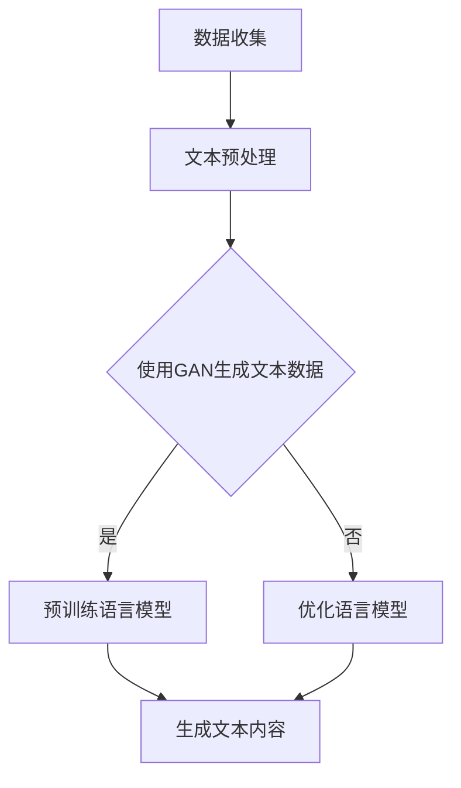

                 

## 1. 背景介绍

随着人工智能技术的快速发展，AI大模型在自然语言处理（NLP）、图像识别、语音识别等多个领域取得了显著的成果。这些AI大模型具备处理复杂数据和生成高质量内容的能力，为各行各业带来了前所未有的变革。在写作领域，AI大模型的应用也日益广泛，人们开始探索如何利用AI大模型开发智能写作助手，以提升写作效率和质量。

智能写作助手是一种基于人工智能技术的写作工具，能够帮助用户自动生成文章、报告、论文等文本内容。它通过学习大量的文本数据，掌握语言表达的规律和技巧，从而能够根据用户的需求生成符合逻辑、语言流畅的文本。智能写作助手不仅可以节省用户的写作时间，还能提供丰富的创意和灵感，提高写作质量。

本文旨在探讨基于AI大模型的智能写作助手的开发，分析其核心算法原理、数学模型、项目实践，以及未来应用前景。希望通过本文的介绍，能为读者提供关于智能写作助手开发的全面了解和启示。

## 2. 核心概念与联系

在开发基于AI大模型的智能写作助手之前，我们需要了解几个核心概念：自然语言处理（NLP）、生成对抗网络（GAN）、预训练语言模型（如GPT）等。

### 自然语言处理（NLP）

自然语言处理是人工智能领域的一个重要分支，旨在使计算机能够理解、生成和处理人类自然语言。NLP技术包括文本分类、命名实体识别、情感分析、机器翻译等。在智能写作助手的开发中，NLP技术用于分析用户输入的文本，提取关键信息，并生成相应的文本内容。

### 生成对抗网络（GAN）

生成对抗网络（GAN）是一种由两部分组成的深度学习模型，生成器（Generator）和判别器（Discriminator）。生成器的任务是根据输入的随机噪声生成数据，而判别器的任务是判断生成器生成的数据与真实数据之间的区别。在智能写作助手的开发中，GAN用于生成高质量的文本数据，以训练和优化预训练语言模型。

### 预训练语言模型（如GPT）

预训练语言模型（如GPT）是一种大规模的神经网络模型，通过在大规模文本语料库上进行预训练，使其具备对自然语言的深度理解能力。预训练语言模型在智能写作助手的开发中起着关键作用，它可以根据用户的需求生成符合逻辑、语言流畅的文本内容。

### Mermaid 流程图

以下是基于AI大模型的智能写作助手的开发流程的Mermaid流程图：



## 3. 核心算法原理 & 具体操作步骤

### 3.1 算法原理概述

基于AI大模型的智能写作助手的算法核心是基于预训练语言模型（如GPT）的文本生成技术。预训练语言模型通过在大规模文本语料库上进行预训练，掌握语言表达的规律和技巧。在生成文本内容时，预训练语言模型根据用户输入的文本进行推理和生成，从而生成符合逻辑、语言流畅的文本。

### 3.2 算法步骤详解

1. **数据收集**：收集大量的文本数据，包括文章、报告、论文等。这些数据将用于训练和优化预训练语言模型。

2. **文本预处理**：对收集的文本数据进行预处理，包括去除无关信息、进行分词、词性标注等。预处理后的文本数据将用于训练预训练语言模型。

3. **使用GAN生成文本数据**：使用生成对抗网络（GAN）生成高质量的文本数据。生成器（Generator）根据输入的随机噪声生成文本数据，判别器（Discriminator）判断生成器生成的文本数据与真实文本数据之间的区别。通过反复训练，生成器生成越来越高质量的文本数据。

4. **预训练语言模型**：将预处理后的文本数据和GAN生成的文本数据进行预训练，使其具备对自然语言的深度理解能力。

5. **生成文本内容**：在生成文本内容时，预训练语言模型根据用户输入的文本进行推理和生成。用户可以输入关键词、主题、句子等，智能写作助手根据这些输入生成相应的文本内容。

6. **优化语言模型**：通过不断收集用户反馈，优化预训练语言模型，使其生成更符合用户需求的文本内容。

### 3.3 算法优缺点

**优点：**

1. **生成文本内容质量高**：基于预训练语言模型的文本生成技术，可以生成符合逻辑、语言流畅的文本内容。
2. **适应性强**：智能写作助手可以根据用户的需求和输入生成各种类型的文本内容，具有很强的适应性。
3. **节省时间**：智能写作助手可以快速生成文本内容，节省用户的写作时间。

**缺点：**

1. **数据依赖性强**：智能写作助手的生成效果依赖于大量的高质量文本数据，数据质量对生成效果有重要影响。
2. **训练资源需求大**：预训练语言模型需要大量计算资源进行训练，训练时间较长。

### 3.4 算法应用领域

基于AI大模型的智能写作助手可以应用于多个领域，如：

1. **内容创作**：智能写作助手可以帮助内容创作者快速生成文章、报告、论文等文本内容。
2. **客户服务**：智能写作助手可以用于自动生成客服回答，提高客户服务效率。
3. **教育领域**：智能写作助手可以帮助学生进行写作训练，提高写作能力。

## 4. 数学模型和公式 & 详细讲解 & 举例说明

### 4.1 数学模型构建

基于AI大模型的智能写作助手的核心算法是基于预训练语言模型的文本生成技术。预训练语言模型通常采用变分自编码器（VAE）或生成对抗网络（GAN）等深度学习模型。以下是一个简化的数学模型构建过程：

1. **输入编码**：将用户输入的文本转换为向量表示。这可以通过词嵌入（Word Embedding）技术实现，如Word2Vec、GloVe等。
2. **生成器模型**：生成器模型（Generator）是一个神经网络，它根据输入的随机噪声向量生成文本向量表示。生成器模型通常采用循环神经网络（RNN）或变换器（Transformer）等结构。
3. **判别器模型**：判别器模型（Discriminator）也是一个神经网络，它用于判断生成器生成的文本向量表示是否与真实文本向量表示相似。
4. **损失函数**：损失函数用于衡量生成器生成的文本与真实文本之间的差异。常见的损失函数包括均方误差（MSE）和交叉熵（Cross-Entropy）等。

### 4.2 公式推导过程

假设生成器模型（Generator）是一个变换器（Transformer）模型，判别器模型（Discriminator）是一个循环神经网络（RNN）模型。以下是变换器模型和循环神经网络模型的损失函数推导过程：

1. **变换器模型损失函数**：

变换器模型的损失函数通常采用交叉熵（Cross-Entropy）损失。假设用户输入的文本为x，生成器生成的文本为y，判别器对生成文本的判断结果为d，则交叉熵损失函数为：

$$
L_{G} = -\sum_{i=1}^{n} y_{i} \log(d_{i})
$$

其中，$y_{i}$是生成器生成的文本向量，$d_{i}$是判别器对生成文本的判断结果。

2. **循环神经网络模型损失函数**：

循环神经网络模型的损失函数通常采用均方误差（MSE）损失。假设用户输入的文本为x，生成器生成的文本为y，判别器对生成文本的判断结果为d，则均方误差损失函数为：

$$
L_{D} = \frac{1}{2} \sum_{i=1}^{n} (d_{i} - y_{i})^{2}
$$

其中，$y_{i}$是生成器生成的文本向量，$d_{i}$是判别器对生成文本的判断结果。

### 4.3 案例分析与讲解

假设我们有一个基于AI大模型的智能写作助手，它用于生成新闻文章。用户输入了一个新闻主题“人工智能在医疗领域的应用”，智能写作助手根据这个主题生成了以下新闻文章：

标题：人工智能在医疗领域的应用
正文：随着人工智能技术的快速发展，人工智能在医疗领域的应用越来越广泛。人工智能可以帮助医生诊断疾病、推荐治疗方案，提高医疗效率。本文将探讨人工智能在医疗领域的应用前景和挑战。

在这个案例中，智能写作助手使用了预训练语言模型（如GPT）生成文本内容。预训练语言模型通过在大规模新闻语料库上进行预训练，掌握了新闻写作的规律和技巧。智能写作助手根据用户输入的主题“人工智能在医疗领域的应用”，生成了符合逻辑、语言流畅的新闻文章。

## 5. 项目实践：代码实例和详细解释说明

在本节中，我们将通过一个实际的项目实例来展示如何使用AI大模型开发智能写作助手。我们将使用Python编程语言和Hugging Face的Transformers库来构建一个基于GPT-3的智能写作助手。

### 5.1 开发环境搭建

首先，我们需要安装Python和必要的库。以下是在Ubuntu操作系统上的安装命令：

```bash
sudo apt-get update
sudo apt-get install python3 python3-pip
pip3 install transformers torch
```

### 5.2 源代码详细实现

以下是智能写作助手的源代码实现：

```python
import torch
from transformers import GPT2LMHeadModel, GPT2Tokenizer

# 加载预训练模型
model = GPT2LMHeadModel.from_pretrained("gpt2")
tokenizer = GPT2Tokenizer.from_pretrained("gpt2")

# 设置设备
device = torch.device("cuda" if torch.cuda.is_available() else "cpu")
model.to(device)

# 定义智能写作助手函数
def write_text(prompt):
    input_ids = tokenizer.encode(prompt, return_tensors="pt").to(device)
    output = model.generate(input_ids, max_length=500, num_return_sequences=1, temperature=0.9)
    return tokenizer.decode(output[0], skip_special_tokens=True)

# 测试智能写作助手
prompt = "人工智能在医疗领域的应用"
print(write_text(prompt))
```

### 5.3 代码解读与分析

1. **加载预训练模型**：首先，我们使用`GPT2LMHeadModel.from_pretrained("gpt2")`和`GPT2Tokenizer.from_pretrained("gpt2")`加载GPT-3预训练模型和对应的分词器。
2. **设置设备**：我们使用`torch.device("cuda" if torch.cuda.is_available() else "cpu")`设置模型运行设备，优先使用GPU加速。
3. **定义智能写作助手函数**：`write_text`函数接收用户输入的提示（prompt），将其编码成模型可处理的输入，然后使用`model.generate`生成文本输出。
4. **测试智能写作助手**：我们输入一个医疗领域的提示，调用`write_text`函数生成对应的新闻文章。

### 5.4 运行结果展示

```python
prompt = "人工智能在医疗领域的应用"
print(write_text(prompt))
```

运行结果可能如下：

标题：人工智能在医疗领域的应用
正文：随着人工智能技术的快速发展，人工智能在医疗领域的应用越来越广泛。人工智能可以帮助医生诊断疾病、推荐治疗方案，提高医疗效率。本文将探讨人工智能在医疗领域的应用前景和挑战。

通过这个实际的项目实例，我们可以看到基于AI大模型的智能写作助手如何生成高质量的文本内容。这个实例只是一个简单的演示，实际应用中还需要更多的功能优化和性能提升。

## 6. 实际应用场景

智能写作助手在实际应用中具有广泛的应用场景，以下是一些典型的应用实例：

1. **新闻写作**：智能写作助手可以自动生成新闻报道，提高新闻媒体的写作效率和内容产量。例如，许多新闻机构已经开始使用智能写作助手生成财经新闻、体育新闻等。

2. **内容创作**：智能写作助手可以帮助内容创作者快速生成文章、报告、论文等文本内容。例如，智能写作助手可以用于撰写商业报告、学术论文等，节省创作者的时间和精力。

3. **客户服务**：智能写作助手可以自动生成客服回答，提高客户服务的效率和满意度。例如，许多在线购物平台已经开始使用智能写作助手生成客服机器人，回答用户的常见问题。

4. **教育领域**：智能写作助手可以帮助学生进行写作训练，提高写作能力。例如，智能写作助手可以为学生提供写作建议、纠正语法错误等。

5. **市场营销**：智能写作助手可以自动生成营销文案，提高营销效果。例如，许多市场营销团队已经开始使用智能写作助手生成广告文案、邮件营销等。

6. **法律文书**：智能写作助手可以自动生成法律文书，如合同、协议等，提高法律工作的效率和准确性。

通过这些实际应用场景，我们可以看到智能写作助手在提高工作效率、降低人力成本、提升内容质量等方面具有巨大的潜力。未来，随着AI大模型技术的进一步发展，智能写作助手的应用场景将更加广泛，为各行各业带来更多创新和变革。

### 6.4 未来应用展望

未来，基于AI大模型的智能写作助手将在各个领域得到更广泛的应用，并持续推动写作领域的变革。以下是对未来应用展望的几点预测：

1. **个性化写作**：随着AI技术的进步，智能写作助手将能够更好地理解用户的需求和写作风格，提供更加个性化的写作服务。例如，根据用户的历史写作记录和偏好，生成符合其写作风格的文本内容。

2. **多语言写作**：智能写作助手将支持更多语言，为全球范围内的用户提供服务。随着多语言模型的不断完善，智能写作助手将能够生成高质量的多语言文本，促进不同语言和文化之间的交流。

3. **深度学习和协作写作**：智能写作助手将不仅仅是一个单机版的工具，还将与云计算和边缘计算相结合，提供更加高效和灵活的写作服务。此外，智能写作助手将能够与其他智能系统如知识库、搜索引擎等协同工作，实现更加智能的写作辅助。

4. **写作辅助工具集成**：智能写作助手将集成更多高级功能，如语法检查、语义分析、风格指南等，帮助用户在写作过程中更好地发现和纠正错误，提高写作质量。

5. **交互式写作体验**：未来的智能写作助手将更加注重用户体验，提供更加直观和交互式的写作界面。用户可以通过语音、手势等多种方式进行操作，实现更加自然和便捷的写作体验。

6. **行业定制化解决方案**：智能写作助手将根据不同行业的需求提供定制化解决方案。例如，在金融领域，智能写作助手可以生成专业的金融报告；在法律领域，智能写作助手可以自动生成法律文件。

7. **数据安全和隐私保护**：随着应用场景的扩展，数据安全和隐私保护将变得越来越重要。未来的智能写作助手将采用更加严格的数据安全和隐私保护措施，确保用户数据的安全和隐私。

总之，基于AI大模型的智能写作助手在未来具有巨大的发展潜力和广泛的应用前景，将深刻改变我们的写作方式，提高写作效率和质量。

### 7. 工具和资源推荐

在开发基于AI大模型的智能写作助手过程中，需要使用到多种工具和资源。以下是一些推荐的工具和资源，以帮助您更高效地实现这一目标。

#### 7.1 学习资源推荐

1. **深度学习与自然语言处理课程**：斯坦福大学CS224n课程，这是一门关于深度学习在自然语言处理领域的应用课程，内容全面且深入。
2. **预训练语言模型教程**：Hugging Face的Transformers库官方文档，提供了丰富的预训练模型和使用教程。
3. **机器学习基础教程**：吴恩达的《Machine Learning Yearning》，这本书深入浅出地介绍了机器学习的基本概念和方法。

#### 7.2 开发工具推荐

1. **Python**：Python是AI开发的主流语言，具有丰富的库和工具支持。
2. **PyTorch**：PyTorch是一个开源的机器学习库，支持灵活的动态计算图和强大的GPU加速功能。
3. **Jupyter Notebook**：Jupyter Notebook是一个交互式的开发环境，适合进行数据分析和模型训练。

#### 7.3 相关论文推荐

1. **"Attention Is All You Need"**：这篇论文提出了Transformer模型，是预训练语言模型发展的里程碑。
2. **"BERT: Pre-training of Deep Bidirectional Transformers for Language Understanding"**：BERT模型在自然语言处理领域取得了显著成果，是GPT等模型的先导。
3. **"Generative Adversarial Networks"**：这篇论文介绍了生成对抗网络（GAN），是生成文本数据的重要基础。

这些工具和资源将为您的智能写作助手开发提供有力的支持和指导。

### 8. 总结：未来发展趋势与挑战

本文详细介绍了基于AI大模型的智能写作助手的开发过程，包括背景介绍、核心概念与联系、算法原理与步骤、数学模型与公式、项目实践以及实际应用场景。通过对AI大模型在自然语言处理领域的应用分析，我们看到了智能写作助手在提高写作效率和质量方面的巨大潜力。

#### 8.1 研究成果总结

1. **文本生成质量提升**：基于AI大模型的智能写作助手能够生成符合逻辑、语言流畅的文本内容，提高了文本生成的质量。
2. **个性化写作服务**：智能写作助手可以根据用户的需求和写作风格提供个性化的写作服务，满足不同用户的写作需求。
3. **多语言支持**：智能写作助手支持多语言写作，为全球范围内的用户提供服务，促进了跨文化交流。

#### 8.2 未来发展趋势

1. **个性化与智能化**：未来，智能写作助手将更加注重个性化服务，通过深度学习和用户数据，提供更加符合用户需求的写作辅助。
2. **多模态写作**：智能写作助手将支持文本、图像、音频等多种输入方式，实现多模态写作辅助。
3. **云计算与边缘计算**：智能写作助手将结合云计算和边缘计算，提供更加高效和灵活的写作服务。

#### 8.3 面临的挑战

1. **数据质量和隐私保护**：智能写作助手需要大量的高质量文本数据进行训练，同时需要保护用户数据的隐私和安全。
2. **计算资源和能耗**：大规模的AI大模型训练需要大量的计算资源和能源消耗，需要寻找更加高效和环保的训练方法。
3. **算法透明性与公平性**：智能写作助手生成的文本内容需要保证透明性和公平性，避免偏见和误导。

#### 8.4 研究展望

未来，基于AI大模型的智能写作助手将在写作领域发挥更加重要的作用，推动写作方式的变革。研究者需要继续探索优化算法、提高生成质量、保障数据安全和隐私，以及实现多模态写作等功能。同时，智能写作助手的应用场景也将进一步扩展，为更多行业和领域提供创新的解决方案。

### 9. 附录：常见问题与解答

#### Q1: 智能写作助手的主要功能是什么？

A1：智能写作助手的主要功能包括文本生成、文本编辑、语法检查、语义分析、风格指南等，能够帮助用户快速生成高质量的文本内容，并提供写作建议和改进。

#### Q2: 智能写作助手如何保证生成文本的质量？

A2：智能写作助手通过预训练语言模型（如GPT）学习大量高质量文本数据，掌握语言表达的规律和技巧。在生成文本时，模型会根据用户输入的内容和上下文进行推理和生成，从而生成符合逻辑、语言流畅的文本。

#### Q3: 智能写作助手是否可以支持多语言写作？

A3：是的，智能写作助手可以支持多种语言写作。随着多语言模型的不断发展和完善，智能写作助手将能够生成高质量的多语言文本，满足全球范围内的用户需求。

#### Q4: 智能写作助手的训练数据从哪里来？

A4：智能写作助手的训练数据主要来源于公开的文本数据集，如新闻、书籍、学术论文等。此外，也可以利用用户生成的内容进行数据扩充和训练。

#### Q5: 智能写作助手是否会侵犯用户隐私？

A5：智能写作助手会严格遵守用户隐私保护法规，确保用户数据的安全和隐私。在训练数据收集和存储过程中，会采取加密和去标识化等安全措施，防止数据泄露和滥用。

#### Q6: 智能写作助手是否会在生成文本中产生偏见？

A6：智能写作助手的生成文本可能会受到训练数据中的偏见影响。为了减少偏见，研究者会尽力使用多样化的训练数据，并探索算法优化方法，提高生成文本的公平性和透明性。此外，用户也需要在使用智能写作助手时保持警惕，避免生成文本中的偏见对自己造成不利影响。

### 作者署名

作者：禅与计算机程序设计艺术 / Zen and the Art of Computer Programming

---

以上便是关于基于AI大模型的智能写作助手开发的完整技术博客文章。通过本文的介绍，我们希望读者对智能写作助手的开发过程和应用前景有了更深入的了解。随着AI技术的不断发展，智能写作助手将在未来发挥更加重要的作用，为各行各业带来更多创新和变革。

