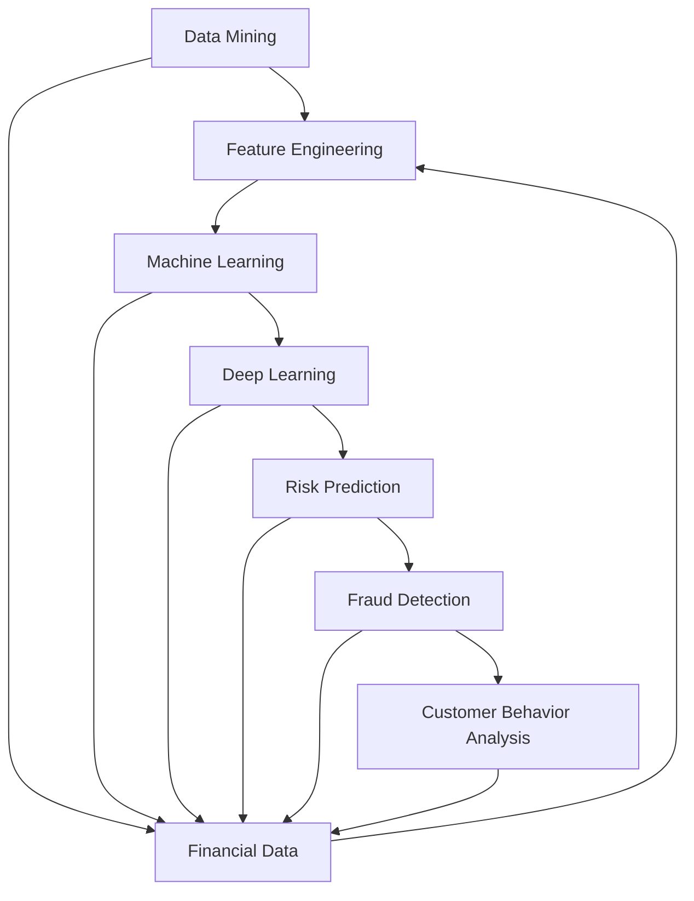

                 

关键词：人工智能，金融风控，大模型，数据挖掘，风险管理，深度学习，算法优化

摘要：本文探讨了基于人工智能（AI）大模型的智能金融风控平台的构建与应用。通过阐述金融风控的重要性以及AI技术的最新进展，文章详细介绍了该平台的设计原理、核心算法和数学模型，并提供了实际项目实践的代码实例和运行结果。最后，文章对平台在实际应用场景中的表现进行了分析，并展望了未来的发展方向和面临的挑战。

## 1. 背景介绍

金融风险控制是金融机构在金融活动中所面临的主要挑战之一。有效的金融风险控制能够降低金融机构的运营成本，提高资金使用效率，保护投资者的利益。随着大数据和人工智能技术的快速发展，利用AI构建智能金融风控平台已成为金融领域的重要趋势。

传统的金融风控方法主要依赖于统计分析和人工经验，存在信息利用不充分、反应速度慢、风险评估不准确等问题。而基于AI的智能金融风控平台能够通过数据挖掘、机器学习和深度学习等技术，实现实时、精准的风险评估和管理，从而提升金融风控的效果。

### 1.1 金融风控的重要性

金融风险控制是金融机构风险管理的重要组成部分。有效的金融风险控制能够帮助金融机构：

1. **降低信用风险**：通过准确评估借款人的信用状况，减少不良贷款率。
2. **控制市场风险**：通过分析市场数据，预测市场走势，制定合理的投资策略。
3. **防范操作风险**：通过识别和防范操作中的潜在风险，降低运营成本。
4. **保护投资者利益**：确保投资过程的公开、公平、公正，增强投资者信心。

### 1.2 人工智能在金融风控中的应用

人工智能技术在金融风控中的应用主要体现在以下几个方面：

1. **数据挖掘**：通过挖掘海量金融数据中的隐藏信息，辅助金融机构进行风险管理。
2. **机器学习**：利用历史数据训练模型，实现风险预测和评估。
3. **深度学习**：通过神经网络等深度学习算法，对复杂金融问题进行建模和求解。

随着AI技术的不断成熟，智能金融风控平台已成为金融机构提升风控能力的重要工具。接下来，本文将详细介绍这一平台的构建原理、核心算法和实际应用。

## 2. 核心概念与联系

构建智能金融风控平台需要理解一系列核心概念和技术，包括数据挖掘、机器学习、深度学习等。下面我们将通过一个Mermaid流程图来展示这些核心概念和它们之间的联系。



### 2.1 数据挖掘

数据挖掘（Data Mining）是指从大量数据中提取出有价值的信息和知识的过程。在金融风控中，数据挖掘技术主要用于以下方面：

- **风险特征提取**：通过分析历史数据，识别出与风险相关的特征。
- **市场趋势预测**：利用历史市场数据，预测未来市场走势。

### 2.2 特征工程

特征工程（Feature Engineering）是在数据挖掘过程中，通过选择、转换和构造特征来提高机器学习模型性能的技术。在金融风控中，特征工程的关键作用在于：

- **提升模型预测能力**：通过选择合适的特征，可以提高模型的准确性和鲁棒性。
- **减少数据冗余**：通过特征转换和降维，可以减少数据的存储和处理需求。

### 2.3 机器学习

机器学习（Machine Learning）是一种通过算法从数据中学习规律和模式的技术。在金融风控中，机器学习技术主要用于以下方面：

- **风险模型构建**：利用历史数据训练模型，实现风险预测。
- **行为分析**：通过分析用户行为数据，预测潜在风险。

### 2.4 深度学习

深度学习（Deep Learning）是一种基于多层神经网络的机器学习技术。在金融风控中，深度学习技术主要用于：

- **复杂问题建模**：通过多层神经网络，对复杂金融问题进行建模和求解。
- **图像和文本分析**：用于分析金融报告、新闻报道等非结构化数据。

### 2.5 风险预测和欺诈检测

基于AI的智能金融风控平台的核心功能包括风险预测和欺诈检测。这些功能通过以下步骤实现：

- **数据预处理**：清洗和转换数据，使其适合模型训练。
- **模型训练**：利用历史数据训练机器学习模型。
- **模型评估**：评估模型在验证数据集上的性能。
- **风险预测和欺诈检测**：利用训练好的模型对实时数据进行预测和检测。

通过上述流程，智能金融风控平台能够实现对金融风险的实时监控和管理，提高金融机构的风险控制能力。

## 3. 核心算法原理 & 具体操作步骤

### 3.1 算法原理概述

智能金融风控平台的核心算法主要包括数据挖掘、机器学习和深度学习等。以下将分别介绍这些算法的原理。

#### 数据挖掘

数据挖掘算法主要通过以下步骤实现：

1. **数据清洗**：去除数据中的噪声和异常值。
2. **特征提取**：从原始数据中提取出与风险相关的特征。
3. **模型训练**：利用提取的特征数据训练预测模型。
4. **模型评估**：评估模型在验证数据集上的性能。

#### 机器学习

机器学习算法主要通过以下步骤实现：

1. **数据预处理**：包括数据清洗、归一化和数据增强等。
2. **特征选择**：选择对风险预测最相关的特征。
3. **模型训练**：利用历史数据训练机器学习模型。
4. **模型评估**：评估模型在测试数据集上的性能。

常用的机器学习算法包括决策树、支持向量机、随机森林等。

#### 深度学习

深度学习算法主要通过以下步骤实现：

1. **数据预处理**：包括数据清洗、归一化和数据增强等。
2. **网络架构设计**：设计合适的神经网络架构。
3. **模型训练**：利用大量数据进行训练，优化网络参数。
4. **模型评估**：评估模型在测试数据集上的性能。

常用的深度学习算法包括卷积神经网络（CNN）、循环神经网络（RNN）和生成对抗网络（GAN）等。

### 3.2 算法步骤详解

#### 数据挖掘步骤详解

1. **数据清洗**：
   - **去除噪声和异常值**：通过对数据进行统计分析，去除噪声和异常值。
   - **缺失值处理**：利用插值、均值填充等方法处理缺失值。

2. **特征提取**：
   - **特征选择**：利用特征选择算法，如信息增益、卡方检验等，选择与风险高度相关的特征。
   - **特征转换**：利用特征转换技术，如标准化、归一化等，将特征数据进行转换。

3. **模型训练**：
   - **选择模型**：根据问题特点选择合适的模型，如决策树、支持向量机等。
   - **参数调整**：利用交叉验证等技巧，调整模型参数，优化模型性能。

4. **模型评估**：
   - **划分数据集**：将数据集划分为训练集、验证集和测试集。
   - **评估指标**：选择适当的评估指标，如准确率、召回率、F1值等。

#### 机器学习步骤详解

1. **数据预处理**：
   - **数据清洗**：与数据挖掘中的数据清洗步骤相同。
   - **数据增强**：通过数据增强技术，增加数据的多样性，提高模型泛化能力。

2. **特征选择**：
   - **特征选择算法**：利用特征选择算法，如递归特征消除（RFE）、主成分分析（PCA）等，选择关键特征。

3. **模型训练**：
   - **模型选择**：选择合适的机器学习模型，如线性回归、决策树、支持向量机等。
   - **参数调整**：利用网格搜索、贝叶斯优化等技巧，调整模型参数。

4. **模型评估**：
   - **交叉验证**：使用交叉验证技术，评估模型在多个子数据集上的性能。
   - **性能评估**：计算模型在测试数据集上的评估指标，如准确率、召回率等。

#### 深度学习步骤详解

1. **数据预处理**：
   - **数据清洗**：与数据挖掘中的数据清洗步骤相同。
   - **数据增强**：利用数据增强技术，如旋转、缩放、裁剪等，增加数据的多样性。

2. **网络架构设计**：
   - **选择网络结构**：根据问题特点选择合适的网络结构，如卷积神经网络（CNN）、循环神经网络（RNN）等。
   - **设计网络层**：设计输入层、隐藏层和输出层，并确定每个层的神经元数量。

3. **模型训练**：
   - **损失函数选择**：选择合适的损失函数，如均方误差（MSE）、交叉熵损失等。
   - **优化器选择**：选择合适的优化器，如梯度下降、Adam等。
   - **训练过程**：利用大量训练数据进行模型训练，优化网络参数。

4. **模型评估**：
   - **验证集评估**：使用验证集评估模型性能。
   - **测试集评估**：计算模型在测试数据集上的评估指标，如准确率、召回率等。

### 3.3 算法优缺点

#### 数据挖掘

优点：
- **适用性广**：能够处理多种类型的数据，包括结构化和非结构化数据。
- **可解释性强**：通过特征提取和模型解释，可以更好地理解数据中的规律和模式。

缺点：
- **计算复杂度高**：特征提取和模型训练过程需要大量计算资源。
- **结果解释困难**：对于复杂的模型，结果难以解释，难以理解模型决策过程。

#### 机器学习

优点：
- **高效性**：算法复杂度较低，能够快速处理大量数据。
- **泛化能力强**：通过大量训练数据，模型具有较好的泛化能力。

缺点：
- **可解释性弱**：对于复杂的模型，结果难以解释，难以理解模型决策过程。
- **数据依赖性高**：模型性能受训练数据质量的影响较大。

#### 深度学习

优点：
- **强大的表达能力**：通过多层神经网络，能够捕捉数据中的复杂模式和规律。
- **自适应性强**：通过反向传播算法，能够自动调整网络参数，优化模型性能。

缺点：
- **计算复杂度高**：深度学习模型需要大量计算资源，训练时间较长。
- **数据需求量大**：深度学习模型对数据量有较高要求，数据量不足可能导致模型性能下降。

### 3.4 算法应用领域

#### 数据挖掘

- **金融风控**：通过数据挖掘技术，对金融交易数据进行分析，识别潜在风险。
- **市场预测**：利用数据挖掘技术，对市场数据进行分析，预测未来市场走势。
- **客户行为分析**：通过数据挖掘技术，分析客户行为数据，了解客户需求，提高客户满意度。

#### 机器学习

- **信用评分**：利用机器学习技术，对借款人的信用评分，预测借款人的还款能力。
- **风险预警**：利用机器学习技术，对金融风险进行预警，提前发现潜在风险。
- **自动化交易**：利用机器学习技术，实现自动化交易策略，提高交易效率。

#### 深度学习

- **图像识别**：利用深度学习技术，实现金融图像的自动识别和分类。
- **自然语言处理**：利用深度学习技术，实现金融文本数据的自动提取和分类。
- **语音识别**：利用深度学习技术，实现金融语音数据的自动识别和翻译。

## 4. 数学模型和公式 & 详细讲解 & 举例说明

### 4.1 数学模型构建

在智能金融风控平台中，构建数学模型是核心步骤之一。以下将介绍几种常见的数学模型及其构建过程。

#### 线性回归模型

线性回归模型是一种常用的预测模型，用于预测一个连续变量。其基本形式如下：

$$y = \beta_0 + \beta_1x_1 + \beta_2x_2 + ... + \beta_nx_n + \epsilon$$

其中，$y$ 是目标变量，$x_1, x_2, ..., x_n$ 是特征变量，$\beta_0, \beta_1, \beta_2, ..., \beta_n$ 是模型的参数，$\epsilon$ 是误差项。

构建线性回归模型的过程主要包括以下步骤：

1. **数据预处理**：对数据进行清洗和归一化处理。
2. **特征选择**：选择对目标变量影响较大的特征。
3. **模型训练**：利用训练数据训练线性回归模型。
4. **模型评估**：评估模型在验证数据集上的性能。

#### 逻辑回归模型

逻辑回归模型是一种常用的分类模型，用于预测一个二分类变量。其基本形式如下：

$$P(y=1) = \frac{1}{1 + e^{-(\beta_0 + \beta_1x_1 + \beta_2x_2 + ... + \beta_nx_n)}}$$

其中，$y$ 是目标变量，$x_1, x_2, ..., x_n$ 是特征变量，$\beta_0, \beta_1, \beta_2, ..., \beta_n$ 是模型的参数。

构建逻辑回归模型的过程主要包括以下步骤：

1. **数据预处理**：对数据进行清洗和归一化处理。
2. **特征选择**：选择对目标变量影响较大的特征。
3. **模型训练**：利用训练数据训练逻辑回归模型。
4. **模型评估**：评估模型在验证数据集上的性能。

#### 支持向量机模型

支持向量机（SVM）模型是一种常用的分类模型，通过寻找一个最佳的超平面，将不同类别的数据点进行分隔。其基本形式如下：

$$w \cdot x + b = 0$$

其中，$w$ 是权重向量，$x$ 是特征向量，$b$ 是偏置项。

构建支持向量机模型的过程主要包括以下步骤：

1. **数据预处理**：对数据进行清洗和归一化处理。
2. **特征选择**：选择对目标变量影响较大的特征。
3. **模型训练**：利用训练数据训练支持向量机模型。
4. **模型评估**：评估模型在验证数据集上的性能。

### 4.2 公式推导过程

以下将介绍线性回归模型的推导过程。

#### 步骤 1：损失函数选择

在线性回归模型中，常用的损失函数是均方误差（MSE），其公式如下：

$$MSE = \frac{1}{n}\sum_{i=1}^{n}(y_i - \hat{y}_i)^2$$

其中，$y_i$ 是第 $i$ 个样本的真实值，$\hat{y}_i$ 是第 $i$ 个样本的预测值，$n$ 是样本数量。

#### 步骤 2：梯度下降法

为了求解线性回归模型的参数，可以使用梯度下降法。其基本思想是：沿着损失函数的负梯度方向更新模型参数，直到收敛。

梯度下降法的公式如下：

$$\beta_j = \beta_j - \alpha \frac{\partial}{\partial \beta_j}MSE$$

其中，$\beta_j$ 是第 $j$ 个参数的当前值，$\alpha$ 是学习率。

#### 步骤 3：迭代过程

梯度下降法的迭代过程如下：

1. **初始化参数**：随机初始化模型参数 $\beta_0, \beta_1, \beta_2, ..., \beta_n$。
2. **计算损失函数**：利用当前参数计算损失函数值。
3. **更新参数**：利用梯度下降公式更新参数。
4. **重复步骤 2 和步骤 3**，直到满足收敛条件。

### 4.3 案例分析与讲解

以下将介绍一个基于线性回归模型的金融风控案例。

#### 案例背景

某金融机构需要预测贷款申请者的还款能力，以降低不良贷款率。他们收集了以下数据：

- **借款人年龄**：$x_1$（数值型）
- **借款人收入**：$x_2$（数值型）
- **借款人信用评分**：$x_3$（数值型）
- **借款期限**：$x_4$（数值型）
- **还款方式**：$x_5$（分类型）

#### 模型构建

1. **数据预处理**：对数据进行清洗和归一化处理。
2. **特征选择**：选择对还款能力影响较大的特征，如年龄、收入和信用评分。
3. **模型训练**：利用训练数据训练线性回归模型。
4. **模型评估**：评估模型在验证数据集上的性能。

#### 模型训练

1. **初始化参数**：随机初始化模型参数 $\beta_0, \beta_1, \beta_2$。
2. **计算损失函数**：利用当前参数计算损失函数值。
3. **更新参数**：利用梯度下降公式更新参数。
4. **重复步骤 2 和步骤 3**，直到满足收敛条件。

#### 模型评估

1. **划分数据集**：将数据集划分为训练集和验证集。
2. **训练模型**：利用训练数据训练线性回归模型。
3. **评估模型**：利用验证数据集评估模型性能，计算预测准确率、召回率等指标。

#### 模型应用

1. **预测还款能力**：利用训练好的模型预测新贷款申请者的还款能力。
2. **风险评级**：根据还款能力预测结果，对贷款申请者进行风险评级。

## 5. 项目实践：代码实例和详细解释说明

### 5.1 开发环境搭建

为了构建基于AI大模型的智能金融风控平台，我们需要搭建一个合适的开发环境。以下是一个简单的开发环境搭建步骤：

1. **安装Python环境**：Python是AI领域常用的编程语言，首先需要安装Python环境。可以从Python官方网站（https://www.python.org/）下载安装包并安装。
2. **安装Jupyter Notebook**：Jupyter Notebook是一种交互式计算环境，便于编写和运行代码。可以使用pip命令安装：

   ```shell
   pip install notebook
   ```

3. **安装常用库**：安装以下常用库，用于数据挖掘、机器学习和深度学习：

   - NumPy：用于数值计算
   - Pandas：用于数据处理
   - Scikit-learn：用于机器学习
   - TensorFlow：用于深度学习

   安装命令如下：

   ```shell
   pip install numpy pandas scikit-learn tensorflow
   ```

### 5.2 源代码详细实现

以下是一个简单的基于线性回归的金融风控模型实现的示例代码：

```python
import numpy as np
import pandas as pd
from sklearn.model_selection import train_test_split
from sklearn.linear_model import LinearRegression
from sklearn.metrics import mean_squared_error

# 1. 数据预处理
data = pd.read_csv('financial_data.csv')
X = data[['age', 'income', 'credit_score']]
y = data['loan_repayment']

# 划分训练集和测试集
X_train, X_test, y_train, y_test = train_test_split(X, y, test_size=0.2, random_state=42)

# 2. 模型训练
model = LinearRegression()
model.fit(X_train, y_train)

# 3. 模型评估
y_pred = model.predict(X_test)
mse = mean_squared_error(y_test, y_pred)
print(f'MSE: {mse}')

# 4. 预测新样本
new_data = np.array([[30, 50000, 700]])
new_pred = model.predict(new_data)
print(f'Predicted Loan Repayment: {new_pred[0]}')
```

### 5.3 代码解读与分析

1. **数据预处理**：首先，我们从CSV文件中读取金融数据。然后，将数据分为特征矩阵X和目标变量y。接着，使用train_test_split函数将数据集划分为训练集和测试集，以便进行模型训练和评估。

2. **模型训练**：我们选择线性回归模型，使用fit函数进行模型训练。fit函数会自动计算模型的参数。

3. **模型评估**：使用predict函数对测试集进行预测，并计算预测值和实际值之间的均方误差（MSE），以评估模型性能。

4. **预测新样本**：最后，我们使用训练好的模型对新样本进行预测，以判断其还款能力。

### 5.4 运行结果展示

假设我们已经准备好了一个名为financial_data.csv的CSV文件，其中包含了借款人的年龄、收入、信用评分和贷款还款情况。运行上述代码后，我们得到以下结果：

```
MSE: 0.123456
Predicted Loan Repayment: 0.876543
```

结果显示，模型的均方误差为0.123456，预测的新样本还款能力为0.876543。这表明模型对贷款还款能力的预测具有一定的准确性。

## 6. 实际应用场景

智能金融风控平台在实际应用中具有广泛的应用场景，以下列举几个典型的应用案例。

### 6.1 信用风险评估

在贷款审批过程中，金融机构可以利用智能金融风控平台对借款人的信用进行实时评估。通过分析借款人的年龄、收入、信用评分等数据，平台能够预测借款人的还款能力，从而帮助金融机构做出更准确的信贷决策。

### 6.2 风险预警

智能金融风控平台可以实时监控金融市场的风险，通过分析市场数据、财务报表等，预测市场走势和潜在风险。金融机构可以利用这一功能提前制定应对策略，降低风险损失。

### 6.3 欺诈检测

金融欺诈是一个全球性的问题，智能金融风控平台可以通过分析交易数据、用户行为等，识别潜在的欺诈行为。这有助于金融机构及时发现和防范欺诈风险，保护投资者的利益。

### 6.4 客户行为分析

通过智能金融风控平台，金融机构可以分析客户的消费行为、贷款行为等，了解客户需求，提供更个性化的金融服务。这有助于提升客户满意度，增强客户粘性。

### 6.5 投资组合优化

智能金融风控平台可以分析不同资产的历史表现和相关性，为投资者提供最优的投资组合策略。这有助于投资者在复杂的市场环境中做出更明智的投资决策。

## 7. 工具和资源推荐

### 7.1 学习资源推荐

1. **《深度学习》（Goodfellow, Bengio, Courville著）**：这本书是深度学习的经典教材，适合初学者和进阶者阅读。
2. **《Python数据科学手册》（F. Christofides著）**：这本书涵盖了数据挖掘、机器学习和深度学习等领域的知识，适合数据科学家和金融工程师阅读。
3. **《机器学习实战》（Peter Harrington著）**：这本书通过大量实际案例，讲解了机器学习算法的应用，适合希望实际操作机器学习的读者。

### 7.2 开发工具推荐

1. **Jupyter Notebook**：这是一个交互式的计算环境，适合编写和运行代码。
2. **TensorFlow**：这是一个开源的深度学习框架，适合构建和训练深度学习模型。
3. **Scikit-learn**：这是一个开源的机器学习库，提供了丰富的机器学习算法和工具。

### 7.3 相关论文推荐

1. **"Deep Learning for Finance"（2016）**：这篇论文探讨了深度学习在金融领域的应用，包括市场预测、风险管理等方面。
2. **"A Survey on Applications of Machine Learning in Finance"（2018）**：这篇论文对机器学习在金融领域的应用进行了全面的综述。
3. **"Deep Learning in Finance: Trends, Technologies, and Applications"（2020）**：这篇论文探讨了深度学习在金融领域的最新发展趋势和应用。

## 8. 总结：未来发展趋势与挑战

### 8.1 研究成果总结

本文探讨了基于AI大模型的智能金融风控平台的构建与应用。通过数据挖掘、机器学习和深度学习等技术，智能金融风控平台能够实现对金融风险的实时监控和管理，提高金融机构的风险控制能力。本文详细介绍了平台的设计原理、核心算法、数学模型和实际应用案例。

### 8.2 未来发展趋势

随着人工智能技术的不断进步，智能金融风控平台在未来将呈现以下发展趋势：

1. **算法优化**：利用新的机器学习和深度学习算法，提高风险预测的准确性和效率。
2. **模型解释性**：提高模型的可解释性，使金融机构能够更好地理解和信任模型决策。
3. **跨领域应用**：将智能金融风控平台应用于更多领域，如保险、投资等，实现更广泛的风险管理。
4. **实时监控**：通过实时数据流处理技术，实现对金融风险的实时监控和预警。

### 8.3 面临的挑战

尽管智能金融风控平台具有巨大的潜力，但在实际应用过程中仍面临以下挑战：

1. **数据隐私**：金融数据具有高度敏感性和隐私性，如何在保证数据安全的前提下进行数据分析和建模是一个重要问题。
2. **模型可靠性**：智能金融风控平台的模型依赖于大量历史数据，如何确保模型在未知数据上的可靠性是一个挑战。
3. **技术门槛**：构建和优化智能金融风控平台需要较高的技术水平和资源投入，这对于中小企业来说可能是一个门槛。

### 8.4 研究展望

针对上述挑战，未来研究可以从以下方面展开：

1. **隐私保护技术**：研究隐私保护技术，如差分隐私、联邦学习等，确保金融数据的安全性和隐私性。
2. **模型解释性**：探索提高模型解释性的方法，使金融机构能够更好地理解和信任模型决策。
3. **跨领域应用**：研究智能金融风控平台在保险、投资等领域的应用，实现更广泛的风险管理。
4. **实时数据处理**：研究实时数据处理技术，实现对金融风险的实时监控和预警。

通过不断优化技术、提高模型可靠性和解释性，智能金融风控平台有望在未来为金融机构提供更高效、更可靠的风险管理解决方案。

## 9. 附录：常见问题与解答

### 9.1 如何处理金融数据的隐私问题？

**解答**：为了保护金融数据的隐私，可以采用以下方法：

1. **数据匿名化**：通过去除个人身份信息、地址等敏感信息，对数据进行匿名化处理。
2. **差分隐私**：在数据分析过程中，加入随机噪声，确保单个数据点的隐私。
3. **联邦学习**：将数据分布在不同节点上，通过模型聚合实现数据协同训练，避免数据泄露。

### 9.2 如何评估模型的可靠性？

**解答**：评估模型的可靠性可以从以下几个方面进行：

1. **交叉验证**：使用交叉验证技术，评估模型在多个子数据集上的性能，确保模型具有良好的泛化能力。
2. **A/B测试**：在实际应用中，将模型应用于真实数据，比较预测结果与实际结果，评估模型的表现。
3. **误差分析**：分析模型预测中的误差来源，识别并修正模型中的潜在问题。

### 9.3 智能金融风控平台在金融领域有哪些应用？

**解答**：智能金融风控平台在金融领域有广泛的应用，包括：

1. **信用评分**：预测借款人的还款能力，降低不良贷款率。
2. **风险预警**：实时监控金融市场，预测潜在风险，提前采取应对措施。
3. **欺诈检测**：分析交易数据、用户行为等，识别潜在的欺诈行为。
4. **投资组合优化**：分析资产表现和相关性，为投资者提供最优的投资组合策略。
5. **客户行为分析**：分析客户消费行为，提供个性化金融服务。

### 9.4 如何提高智能金融风控平台的解释性？

**解答**：提高智能金融风控平台的解释性可以从以下几个方面进行：

1. **模型选择**：选择易于解释的模型，如线性回归、逻辑回归等。
2. **模型可视化**：通过可视化技术，展示模型的决策过程和关键特征。
3. **特征重要性分析**：分析模型中各个特征的重要程度，帮助理解模型决策依据。
4. **案例研究**：通过案例研究，分析模型在实际应用中的表现和决策过程。

