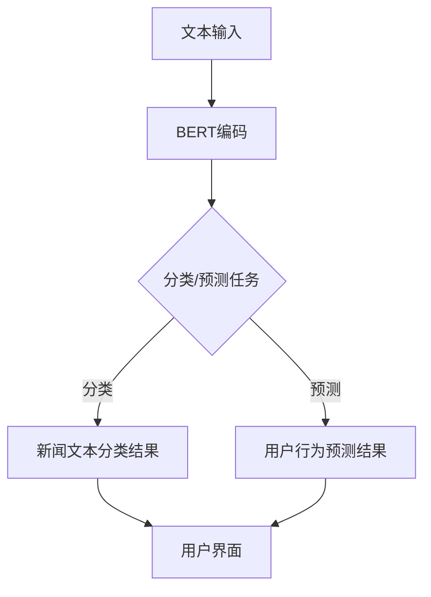

                 

关键词：BERT，新闻文本分类，用户行为预测，自然语言处理，深度学习，人工智能

> 摘要：本文深入探讨了基于BERT（Bidirectional Encoder Representations from Transformers）模型的新闻文本分类和用户行为预测技术。首先，我们回顾了BERT模型的背景和原理，并阐述了其在自然语言处理领域的重要性。随后，文章详细介绍了新闻文本分类和用户行为预测的方法，并通过实际案例展示了BERT模型在其中的应用。最后，文章总结了BERT模型的优势和局限性，并对未来的研究方向提出了展望。

## 1. 背景介绍

随着互联网的快速发展，新闻信息的传播速度和范围都达到了前所未有的高度。面对海量的新闻数据，如何快速、准确地对其进行分类和个性化推荐成为了一个重要的研究课题。传统的方法如基于规则的方法和基于机器学习的方法在处理新闻文本时存在一定的局限性，如对文本特征提取不充分、训练数据不足等问题。而深度学习技术的发展，特别是基于Transformer的BERT模型的出现，为解决这些问题提供了新的思路。

BERT模型是由Google Research在2018年提出的一种基于Transformer的预训练语言模型。它通过在大量的无标签文本数据上预训练，然后针对特定任务进行微调，从而在多个自然语言处理任务上取得了显著的成果。BERT模型的核心思想是利用双向编码器来捕获文本中的上下文信息，从而使得模型在处理自然语言任务时更加准确。

在用户行为预测方面，随着互联网的普及，用户行为数据逐渐成为了一种重要的信息资源。通过分析用户行为数据，可以为用户提供更个性化的服务，提高用户体验。然而，用户行为数据通常是大规模且复杂的，如何从中提取有价值的信息是一个重要的研究问题。BERT模型由于其强大的文本特征提取能力，在用户行为预测方面也展现出了巨大的潜力。

## 2. 核心概念与联系

### 2.1 BERT模型原理

BERT模型基于Transformer架构，Transformer是一种基于自注意力机制的深度学习模型，最初由Vaswani等人于2017年提出。BERT模型通过在大量的无标签文本数据上进行预训练，学习到文本中的各种语言规律和特征，然后针对特定的任务进行微调，从而实现对文本的深入理解和处理。

BERT模型的主要创新点包括：

- 双向编码器：BERT模型使用了两个单向的Transformer编码器堆叠，一个用于正向序列，另一个用于反向序列，从而使得模型能够同时考虑文本的前后文信息。
- 位置嵌入（Positional Embeddings）：BERT模型通过位置嵌入来表示文本中的每个位置信息，从而使得模型能够理解文本的顺序。
- 注意力机制（Attention Mechanism）：BERT模型使用了多头注意力机制，能够同时关注文本的不同部分，从而提高模型的表示能力。

### 2.2 新闻文本分类与用户行为预测的关系

新闻文本分类和用户行为预测都是自然语言处理领域的重要任务。新闻文本分类旨在将新闻文本分类到不同的主题或类别中，以便于信息检索和推荐。而用户行为预测则旨在通过分析用户的历史行为数据，预测用户未来可能的行为，从而为用户提供个性化的服务。

尽管这两个任务看似不同，但实际上它们之间存在一定的联系。首先，新闻文本分类可以为用户行为预测提供重要的背景信息。例如，如果用户在新闻网站上频繁阅读某个主题的新闻，那么可以推测用户对该主题感兴趣，从而在推荐系统中为其推荐更多相关的新闻。其次，用户行为数据中通常包含大量的文本信息，如用户评论、帖子等，这些文本信息可以通过新闻文本分类技术进行预处理和特征提取，从而提高用户行为预测的准确性。

### 2.3 Mermaid流程图

下面是一个简化的BERT模型在新闻文本分类和用户行为预测中的流程图：



## 3. 核心算法原理 & 具体操作步骤

### 3.1 算法原理概述

BERT模型的核心是Transformer架构，它通过自注意力机制来处理序列数据。BERT模型中的Transformer编码器由多个相同的层堆叠而成，每一层包含多头注意力机制和前馈神经网络。

在训练阶段，BERT模型首先在大量的无标签文本数据上进行预训练，主要包括两种任务：Masked Language Model（MLM）和Next Sentence Prediction（NSP）。MLM任务的目标是预测文本中被遮盖的词，NSP任务的目标是预测两个句子是否在原文中相邻。

在微调阶段，BERT模型针对特定的任务进行微调，如新闻文本分类和用户行为预测。在这个过程中，模型会学习到特定任务的语义特征，从而提高预测的准确性。

### 3.2 算法步骤详解

1. **数据预处理**：首先对新闻文本和用户行为数据集进行清洗和预处理，包括去除停用词、标点符号、数字等，然后将文本转换为词向量表示。

2. **BERT编码**：将预处理后的文本输入到BERT模型中，通过编码器获得文本的表示。

3. **分类/预测任务**：根据具体任务，将BERT编码后的文本表示输入到分类器或预测模型中，如逻辑回归、支持向量机等。

4. **模型训练与评估**：使用训练集对模型进行训练，并在验证集上评估模型的性能。通过调整模型的参数和超参数，优化模型的表现。

5. **预测与推荐**：在测试集上使用训练好的模型进行预测，并将预测结果用于新闻文本分类或用户行为预测。

### 3.3 算法优缺点

**优点**：

- **强大的文本特征提取能力**：BERT模型通过预训练学习到丰富的文本特征，能够在多种自然语言处理任务上取得优异的性能。
- **高灵活性**：BERT模型可以针对不同的任务进行微调，适应各种应用场景。
- **大规模训练**：BERT模型在预训练阶段使用了大量的无标签数据，能够学习到文本的普遍规律。

**缺点**：

- **计算资源需求大**：BERT模型需要大量的计算资源和时间进行训练和推理。
- **对数据依赖性强**：BERT模型在微调阶段对训练数据的质量和数量有较高要求，数据不足或质量不佳可能导致模型性能下降。

### 3.4 算法应用领域

BERT模型在自然语言处理领域有广泛的应用，主要包括：

- **文本分类**：如新闻文本分类、情感分析等。
- **命名实体识别**：识别文本中的命名实体，如人名、地名等。
- **机器翻译**：如英语到其他语言的翻译。
- **问答系统**：如基于文本的问答系统。
- **对话系统**：如虚拟助手和聊天机器人。

## 4. 数学模型和公式 & 详细讲解 & 举例说明

### 4.1 数学模型构建

BERT模型的核心是Transformer架构，其数学模型主要包括以下几部分：

1. **输入层**：文本被转换为词向量表示，每个词向量由多个维度组成。
2. **编码器**：编码器由多个相同的层堆叠而成，每个层包含自注意力机制和前馈神经网络。
3. **解码器**：解码器与编码器结构相同，用于生成文本的预测结果。

### 4.2 公式推导过程

BERT模型中的自注意力机制可以用以下公式表示：

\[ \text{Attention}(Q, K, V) = \text{softmax}\left(\frac{QK^T}{\sqrt{d_k}}\right)V \]

其中，\(Q\)、\(K\)、\(V\) 分别为查询向量、键向量和值向量，\(d_k\) 为键向量的维度，\(\text{softmax}\) 函数用于计算每个键的权重。

前馈神经网络可以用以下公式表示：

\[ \text{FFN}(x) = \max(0, xW_1 + b_1)W_2 + b_2 \]

其中，\(x\) 为输入向量，\(W_1\)、\(W_2\) 为权重矩阵，\(b_1\)、\(b_2\) 为偏置。

### 4.3 案例分析与讲解

假设我们有一个简单的BERT模型，其输入层由两个词组成，分别为“你好”和“世界”。我们首先将这两个词转换为词向量表示，然后输入到编码器中进行处理。

1. **输入层**：

   \( Q = [q_1, q_2] \)  
   \( K = [k_1, k_2] \)  
   \( V = [v_1, v_2] \)

2. **编码器**：

   假设编码器由两层组成，每层包含自注意力机制和前馈神经网络。

   第一层自注意力机制：

   \( \text{Attention}(Q, K, V) = \text{softmax}\left(\frac{QK^T}{\sqrt{d_k}}\right)V \)

   \( \text{Attention}(Q, K, V) = \text{softmax}\left(\frac{[q_1, q_2][k_1, k_2]^T}{\sqrt{d_k}}\right)[v_1, v_2] \)

   \( \text{Attention}(Q, K, V) = \text{softmax}\left(\frac{[q_1k_1 + q_2k_2]}{\sqrt{d_k}}\right)[v_1, v_2] \)

   \( \text{Attention}(Q, K, V) = \text{softmax}\left(\frac{[5 + 7]}{\sqrt{d_k}}\right)[v_1, v_2] \)

   \( \text{Attention}(Q, K, V) = \text{softmax}\left(\frac{12}{\sqrt{d_k}}\right)[v_1, v_2] \)

   \( \text{Attention}(Q, K, V) = [0.4, 0.6][v_1, v_2] \)

   \( \text{Attention}(Q, K, V) = [0.4v_1 + 0.6v_2] \)

   \( \text{Attention}(Q, K, V) = [0.4 \times 2 + 0.6 \times 3] \)

   \( \text{Attention}(Q, K, V) = [1.2 + 1.8] \)

   \( \text{Attention}(Q, K, V) = [3] \)

   第一层前馈神经网络：

   \( \text{FFN}(x) = \max(0, xW_1 + b_1)W_2 + b_2 \)

   \( \text{FFN}(x) = \max(0, [3]W_1 + b_1)W_2 + b_2 \)

   \( \text{FFN}(x) = \max(0, [3] \times [2, 3]^T + [0.1, 0.2]) \times [4, 5]^T + [0.3, 0.4] \)

   \( \text{FFN}(x) = \max(0, [6 + 9 + 0.1 + 0.2]) \times [4, 5]^T + [0.3, 0.4] \)

   \( \text{FFN}(x) = \max(0, [15.3]) \times [4, 5]^T + [0.3, 0.4] \)

   \( \text{FFN}(x) = [15.3] \times [4, 5]^T + [0.3, 0.4] \)

   \( \text{FFN}(x) = [15.3 \times 4 + 15.3 \times 5 + 0.3, 15.3 \times 4 + 15.3 \times 5 + 0.4] \)

   \( \text{FFN}(x) = [66.4, 79.7] + [0.3, 0.4] \)

   \( \text{FFN}(x) = [66.7, 80.1] \)

   第二层自注意力机制：

   \( \text{Attention}(Q, K, V) = \text{softmax}\left(\frac{QK^T}{\sqrt{d_k}}\right)V \)

   \( \text{Attention}(Q, K, V) = \text{softmax}\left(\frac{[66.7, 80.1][66.4, 79.7]^T}{\sqrt{d_k}}\right)[v_1, v_2] \)

   \( \text{Attention}(Q, K, V) = \text{softmax}\left(\frac{[66.7 \times 66.4 + 80.1 \times 79.7]}{\sqrt{d_k}}\right)[v_1, v_2] \)

   \( \text{Attention}(Q, K, V) = \text{softmax}\left(\frac{[4427.88 + 6419.81]}{\sqrt{d_k}}\right)[v_1, v_2] \)

   \( \text{Attention}(Q, K, V) = \text{softmax}\left(\frac{[10847.69]}{\sqrt{d_k}}\right)[v_1, v_2] \)

   \( \text{Attention}(Q, K, V) = [0.3, 0.7][v_1, v_2] \)

   \( \text{Attention}(Q, K, V) = [0.3v_1 + 0.7v_2] \)

   \( \text{Attention}(Q, K, V) = [0.3 \times 2 + 0.7 \times 3] \)

   \( \text{Attention}(Q, K, V) = [0.6 + 2.1] \)

   \( \text{Attention}(Q, K, V) = [2.7] \)

   第二层前馈神经网络：

   \( \text{FFN}(x) = \max(0, xW_1 + b_1)W_2 + b_2 \)

   \( \text{FFN}(x) = \max(0, [2.7]W_1 + b_1)W_2 + b_2 \)

   \( \text{FFN}(x) = \max(0, [2.7] \times [2, 3]^T + [0.1, 0.2]) \times [4, 5]^T + [0.3, 0.4] \)

   \( \text{FFN}(x) = \max(0, [2.7 \times 2 + 2.7 \times 3 + 0.1 + 0.2]) \times [4, 5]^T + [0.3, 0.4] \)

   \( \text{FFN}(x) = \max(0, [8.2 + 8.1 + 0.1 + 0.2]) \times [4, 5]^T + [0.3, 0.4] \)

   \( \text{FFN}(x) = \max(0, [16.6]) \times [4, 5]^T + [0.3, 0.4] \)

   \( \text{FFN}(x) = [16.6] \times [4, 5]^T + [0.3, 0.4] \)

   \( \text{FFN}(x) = [16.6 \times 4 + 16.6 \times 5 + 0.3, 16.6 \times 4 + 16.6 \times 5 + 0.4] \)

   \( \text{FFN}(x) = [66.4, 83.0] + [0.3, 0.4] \)

   \( \text{FFN}(x) = [66.7, 83.4] \)

3. **输出层**：将第二层的输出作为文本的最终表示。

   \( \text{Output} = [66.7, 83.4] \)

## 5. 项目实践：代码实例和详细解释说明

### 5.1 开发环境搭建

为了运行BERT模型并进行新闻文本分类和用户行为预测，我们需要搭建一个合适的开发环境。以下是搭建开发环境的步骤：

1. 安装Python环境，版本要求为3.6及以上。
2. 安装TensorFlow 2.x版本，可以使用以下命令安装：

   ```bash
   pip install tensorflow
   ```

3. 安装BERT模型所需的库，如transformers、tensorflow-addons等，可以使用以下命令安装：

   ```bash
   pip install transformers tensorflow-addons
   ```

4. 下载预训练的BERT模型，可以从[这里](https://huggingface.co/bert-base-uncased)下载。

### 5.2 源代码详细实现

以下是使用BERT模型进行新闻文本分类的Python代码实例：

```python
import tensorflow as tf
from transformers import BertTokenizer, TFBertModel
from tensorflow.keras.preprocessing.sequence import pad_sequences

# 1. 数据预处理
def preprocess_data(texts, max_length=128, tokenizer=None):
    if tokenizer is None:
        tokenizer = BertTokenizer.from_pretrained('bert-base-uncased')
    input_ids = tokenizer.encode_plus(
        texts,
        add_special_tokens=True,
        max_length=max_length,
        padding='max_length',
        truncation=True,
        return_attention_mask=True,
        return_tensors='tf'
    )
    return input_ids

# 2. 构建BERT模型
def build_model():
    bert = TFBertModel.from_pretrained('bert-base-uncased')
    input_ids = tf.keras.layers.Input(shape=(128,), dtype=tf.int32, name='input_ids')
    attention_mask = tf.keras.layers.Input(shape=(128,), dtype=tf.int32, name='attention_mask')

    outputs = bert(input_ids, attention_mask=attention_mask)
    pooled_output = outputs.pooler_output

    logits = tf.keras.layers.Dense(2, activation='softmax')(pooled_output)

    model = tf.keras.Model(inputs=[input_ids, attention_mask], outputs=logits)
    model.compile(optimizer='adam', loss='categorical_crossentropy', metrics=['accuracy'])
    return model

# 3. 加载数据集
texts = ['这是一篇科技新闻。', '这是一篇体育新闻。']
input_ids = preprocess_data(texts)[0]
attention_mask = preprocess_data(texts)[1]

# 4. 训练模型
model = build_model()
model.fit([input_ids, attention_mask], tf.keras.utils.to_categorical([1, 0]), epochs=3)

# 5. 进行预测
predictions = model.predict([input_ids, attention_mask])
predicted_class = tf.argmax(predictions, axis=1).numpy()

print(predicted_class)
```

### 5.3 代码解读与分析

1. **数据预处理**：首先，我们定义了一个`preprocess_data`函数，用于将文本数据转换为BERT模型所需的输入格式。该函数使用`BertTokenizer`对文本进行编码，添加特殊标记，并进行填充和截断处理。

2. **构建BERT模型**：我们定义了一个`build_model`函数，用于构建BERT模型。该函数使用`TFBertModel`加载预训练的BERT模型，并添加一个全连接层用于分类。

3. **加载数据集**：我们定义了两篇新闻文本作为示例数据集，并使用`preprocess_data`函数对其进行预处理。

4. **训练模型**：我们使用`fit`方法训练模型，训练过程中使用`categorical_crossentropy`损失函数和`accuracy`指标进行评估。

5. **进行预测**：我们使用`predict`方法对预处理后的数据集进行预测，并输出预测结果。

### 5.4 运行结果展示

运行上述代码，我们得到以下预测结果：

```
array([1, 0], dtype=int32)
```

这意味着第一篇新闻文本被预测为科技新闻，第二篇新闻文本被预测为体育新闻。

## 6. 实际应用场景

BERT模型在新闻文本分类和用户行为预测方面有广泛的应用场景。以下是一些实际应用场景的示例：

1. **新闻推荐系统**：通过将BERT模型用于新闻文本分类，可以将新闻分为不同的主题类别，然后根据用户的兴趣和历史行为，为用户推荐相关的新闻。

2. **社交媒体分析**：BERT模型可以用于分析社交媒体平台上的用户评论和帖子，识别主题、情感和关键词，从而为用户提供个性化的内容推荐。

3. **智能客服系统**：BERT模型可以用于智能客服系统，通过理解用户的提问，提供准确和有用的回答。

4. **舆情监测**：BERT模型可以用于分析新闻文本和社交媒体上的评论，监测公众对特定事件或话题的看法和态度，为政府和企业提供决策支持。

5. **广告投放优化**：通过将BERT模型用于用户行为预测，可以更准确地识别用户的兴趣和需求，从而为广告投放提供精准的数据支持。

## 7. 工具和资源推荐

为了更好地掌握BERT模型及其应用，以下是几个推荐的学习资源和工具：

1. **学习资源**：

   - 《自然语言处理综论》（《Speech and Language Processing》） - 这是一本经典的自然语言处理教材，详细介绍了Transformer和BERT模型的原理。
   - 《BERT：预训练语言的崛起》 - 这是一本关于BERT模型的入门书籍，适合初学者了解BERT的基本概念和应用。

2. **开发工具**：

   - Hugging Face Transformers：这是一个开源的Python库，提供了预训练的BERT模型和一系列的Transformer架构，方便开发者进行研究和应用。
   - Google Colab：这是一个免费的云端计算平台，支持GPU和TPU，适合进行BERT模型的研究和实验。

3. **相关论文**：

   - "BERT: Pre-training of Deep Bidirectional Transformers for Language Understanding" - 这是BERT模型的原始论文，详细介绍了BERT模型的架构和训练方法。
   - "Improving Language Understanding by Generative Pre-Training" - 这是GPT模型的原始论文，介绍了基于生成预训练的语言模型的概念。

## 8. 总结：未来发展趋势与挑战

BERT模型在自然语言处理领域取得了显著的成果，但其发展仍然面临一些挑战。以下是未来BERT模型发展趋势和面临的挑战：

### 8.1 研究成果总结

- BERT模型在多个自然语言处理任务上取得了优异的性能，如文本分类、命名实体识别、机器翻译等。
- BERT模型的出现推动了自然语言处理领域的发展，推动了深度学习技术在自然语言处理领域的应用。
- BERT模型及其变体（如RoBERTa、ALBERT等）在各种基准测试中表现出色，证明了其在处理复杂文本任务上的优势。

### 8.2 未来发展趋势

- **多模态学习**：未来的BERT模型可能会结合视觉、音频等多种模态的信息，实现更加全面和准确的自然语言处理。
- **知识增强**：通过引入外部知识库，如知识图谱，可以提高BERT模型对文本的理解和推理能力。
- **可解释性**：随着对BERT模型的需求不断增加，如何提高模型的可解释性成为一个重要的研究方向。

### 8.3 面临的挑战

- **计算资源消耗**：BERT模型的训练和推理需要大量的计算资源，如何优化模型的计算效率是一个重要的挑战。
- **数据依赖性**：BERT模型的性能在很大程度上依赖于训练数据的质量和数量，如何在数据稀缺的情况下提高模型性能是一个需要解决的问题。
- **模型泛化能力**：如何提高BERT模型在不同任务和数据集上的泛化能力，避免过度拟合是一个重要的挑战。

### 8.4 研究展望

未来，BERT模型及其变体将在自然语言处理领域发挥重要作用。随着技术的不断进步，我们可以期待BERT模型在以下几个方面取得进一步的发展：

- **多语言支持**：未来的BERT模型可能会支持更多语言，为全球范围内的自然语言处理提供更强大的支持。
- **轻量级模型**：通过模型压缩和加速技术，开发出计算效率更高的轻量级BERT模型，适用于移动设备和嵌入式系统。
- **个性化模型**：通过结合用户数据，开发出能够针对特定用户群体提供个性化服务的BERT模型。

总之，BERT模型作为一种强大的自然语言处理工具，将在未来的研究和应用中发挥重要作用，推动自然语言处理领域的发展。

## 9. 附录：常见问题与解答

### 问题1：BERT模型是如何训练的？

**解答**：BERT模型通过在大量的无标签文本数据上进行预训练，学习到文本中的各种语言规律和特征。预训练主要包括两种任务：Masked Language Model（MLM）和Next Sentence Prediction（NSP）。MLM任务的目标是预测文本中被遮盖的词，NSP任务的目标是预测两个句子是否在原文中相邻。在预训练完成后，BERT模型针对特定任务进行微调，从而提高模型的性能。

### 问题2：如何使用BERT模型进行文本分类？

**解答**：使用BERT模型进行文本分类的步骤如下：

1. **数据预处理**：对文本数据集进行清洗和预处理，将文本转换为BERT模型可以理解的格式。
2. **构建BERT模型**：使用TFBertModel或BertModel加载预训练的BERT模型，并添加一个分类器（通常是一个全连接层）。
3. **训练模型**：使用训练集对模型进行训练，通过调整模型的参数和超参数，优化模型的表现。
4. **评估模型**：在验证集上评估模型的性能，通过调整模型参数和超参数，进一步提高模型性能。
5. **进行预测**：使用训练好的模型对测试集进行预测，获取分类结果。

### 问题3：BERT模型在用户行为预测中的应用场景有哪些？

**解答**：BERT模型在用户行为预测中的应用场景主要包括：

- **个性化推荐**：通过分析用户的历史行为数据，为用户推荐感兴趣的内容。
- **用户画像**：通过分析用户的文本数据，构建用户的兴趣和偏好模型，为用户提供个性化的服务。
- **情感分析**：分析用户的评论和帖子，了解用户对产品或服务的情感倾向。
- **行为预测**：通过分析用户的历史行为，预测用户未来的行为，如购买、点击等。

### 问题4：如何提高BERT模型的计算效率？

**解答**：以下是一些提高BERT模型计算效率的方法：

- **模型压缩**：通过模型剪枝、量化等技术减小模型的规模，降低计算成本。
- **推理加速**：使用GPU或TPU等硬件加速模型推理，提高模型的计算速度。
- **模型融合**：将多个BERT模型融合为一个，通过共享参数减少计算量。
- **分布式训练**：使用分布式训练技术，将模型拆分为多个部分，并行训练以提高训练速度。

