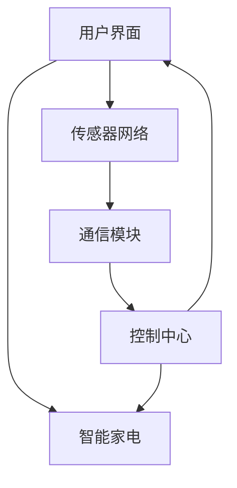

                 

关键词：智能家居、Java编程、能效管理、设计模式、能耗优化、物联网

>摘要：本文旨在探讨Java编程语言在智能家居能效管理中的应用，通过设计并实现一套智能家居系统，分析Java在该领域的优势与挑战，为智能家居技术的发展提供参考。

## 1. 背景介绍

智能家居作为物联网（IoT）的重要组成部分，正在逐渐改变人们的生活方式。通过将家庭设备和网络连接起来，智能家居系统能够实现远程控制、自动化操作和能源效率管理。随着技术的进步，智能家居设备越来越多样化，从智能灯光、空调到智能冰箱、扫地机器人，这些设备的智能化程度不断提升。

Java作为一种成熟、稳定且功能强大的编程语言，在众多领域得到了广泛应用。其在跨平台性、安全性、可维护性等方面具有显著优势，使得Java成为智能家居开发的首选语言之一。然而，智能家居系统的复杂性、多样性以及对实时性的高要求，也对Java的应用提出了新的挑战。

本文将围绕基于Java的智能家居设计，特别是能效管理方面的应用，进行深入探讨。通过分析Java在智能家居系统架构、算法实现、数学模型构建等方面的应用，探讨Java在智能家居领域的优势与局限性，并提出相应的改进措施。

## 2. 核心概念与联系

### 2.1. 智能家居系统架构

智能家居系统通常由多个子系统组成，包括智能家电、传感器网络、通信模块、控制中心等。这些子系统通过物联网技术连接起来，形成一个统一的智能控制系统。以下是一个智能家居系统的基本架构：



### 2.2. Java在智能家居系统中的应用

Java在智能家居系统中的应用主要体现在以下几个方面：

- **用户界面**：Java可以通过Swing或JavaFX等框架开发出用户友好的界面，实现智能家居设备的远程控制和状态监控。
- **通信模块**：Java可以通过Socket编程实现设备间的通信，保证数据的实时性和可靠性。
- **控制中心**：Java可以作为控制中心的核心组件，处理来自传感器的数据，并根据预设的算法进行设备控制。

### 2.3. 能效管理的核心概念

能效管理是智能家居系统中的一个重要方面，旨在通过优化设备运行状态，降低能耗，提高能源利用效率。以下是一些核心概念：

- **能效比**：表示设备在特定条件下的能源消耗与输出能力的比值。
- **能耗优化算法**：通过分析设备运行数据，动态调整设备的工作模式，实现能耗的最小化。
- **实时监测**：通过传感器实时采集设备运行状态数据，为能耗优化提供数据支持。

## 3. 核心算法原理 & 具体操作步骤

### 3.1 算法原理概述

智能家居能效管理主要依赖于能耗优化算法。以下是一种简单的能耗优化算法原理：

- **数据采集**：通过传感器实时采集设备运行状态数据。
- **数据分析**：对采集到的数据进行处理，提取关键信息。
- **能耗计算**：根据设备运行状态和预设参数，计算设备的能耗。
- **模式调整**：根据能耗计算结果，动态调整设备的工作模式。

### 3.2 算法步骤详解

1. **数据采集**：通过传感器实时采集设备的运行状态数据，包括电流、电压、温度、湿度等。

   ```java
   public class SensorDataCollector {
       public double getCurrentValue() {
           // 实现电流采集逻辑
       }
       public double getVoltageValue() {
           // 实现电压采集逻辑
       }
       // ... 其他传感器数据采集方法
   }
   ```

2. **数据分析**：对采集到的数据进行分析，提取关键信息。

   ```java
   public class DataAnalyzer {
       public double calculatePowerConsumption(double current, double voltage) {
           return current * voltage;
       }
       // ... 其他数据分析方法
   }
   ```

3. **能耗计算**：根据设备运行状态和预设参数，计算设备的能耗。

   ```java
   public class EnergyCalculator {
       private double basePowerConsumption;
       private double efficiencyFactor;

       public EnergyCalculator(double basePowerConsumption, double efficiencyFactor) {
           this.basePowerConsumption = basePowerConsumption;
           this.efficiencyFactor = efficiencyFactor;
       }

       public double calculateEnergyConsumption(double powerConsumption) {
           return powerConsumption * efficiencyFactor;
       }
   }
   ```

4. **模式调整**：根据能耗计算结果，动态调整设备的工作模式。

   ```java
   public class DeviceController {
       private Device device;
       private EnergyCalculator energyCalculator;

       public DeviceController(Device device, EnergyCalculator energyCalculator) {
           this.device = device;
           this.energyCalculator = energyCalculator;
       }

       public void adjustDeviceMode(double powerConsumption) {
           double energyConsumption = energyCalculator.calculateEnergyConsumption(powerConsumption);
           if (energyConsumption > threshold) {
               device.setMode("节能模式");
           } else {
               device.setMode("正常模式");
           }
       }
   }
   ```

### 3.3 算法优缺点

#### 优点：

- **实时性**：算法能够实时响应设备运行状态，动态调整设备模式，提高能效。
- **灵活性**：算法可以根据不同设备和场景进行定制化调整，适应各种应用场景。

#### 缺点：

- **复杂性**：算法涉及到多个组件和模块，实现过程较为复杂。
- **计算开销**：实时计算和模式调整需要较大的计算资源，对系统性能有一定影响。

### 3.4 算法应用领域

- **家庭能源管理**：通过对家庭用电设备的能效管理，降低家庭能源消耗。
- **工业自动化**：通过对工业生产设备的能耗优化，提高生产效率。
- **智能交通**：通过对交通设备的能耗管理，降低交通能耗，缓解城市交通拥堵。

## 4. 数学模型和公式 & 详细讲解 & 举例说明

### 4.1 数学模型构建

智能家居能效管理的核心是能耗优化算法，该算法的数学模型主要包括以下几个部分：

- **设备运行状态模型**：描述设备在不同运行模式下的能耗特征。
- **能耗计算模型**：根据设备运行状态，计算设备的能耗。
- **模式调整模型**：根据能耗计算结果，动态调整设备的工作模式。

### 4.2 公式推导过程

#### 设备运行状态模型

假设设备在不同运行模式下，其能耗分别为 \( E_1 \)、\( E_2 \)、\( E_3 \)，其中 \( E_1 \) 为正常模式能耗，\( E_2 \) 为节能模式能耗，\( E_3 \) 为高效模式能耗。则设备运行状态模型可以表示为：

\[ S = \{ (M_1, E_1), (M_2, E_2), (M_3, E_3) \} \]

其中，\( M_1 \)、\( M_2 \)、\( M_3 \) 分别表示正常模式、节能模式、高效模式。

#### 能耗计算模型

假设设备运行状态为 \( S \)，则设备的总能耗 \( E \) 可以表示为：

\[ E = E_1 \times P_1 + E_2 \times P_2 + E_3 \times P_3 \]

其中，\( P_1 \)、\( P_2 \)、\( P_3 \) 分别表示正常模式、节能模式、高效模式的运行比例。

#### 模式调整模型

假设设备当前能耗为 \( E \)，设定的能耗阈值 \( T \) 为 \( 100 \) 单位，则模式调整模型可以表示为：

\[ M_{new} = \begin{cases} 
M_1, & \text{if } E \leq T \\
M_2, & \text{if } T < E \leq 2T \\
M_3, & \text{if } E > 2T 
\end{cases} \]

### 4.3 案例分析与讲解

假设某智能家居设备在正常模式下的能耗为 \( 200 \) 单位，节能模式下的能耗为 \( 100 \) 单位，高效模式下的能耗为 \( 300 \) 单位。当前设备运行状态为正常模式，总能耗为 \( 500 \) 单位。

1. **设备运行状态模型**：

   \[ S = \{ (M_1, 200), (M_2, 100), (M_3, 300) \} \]

2. **能耗计算模型**：

   设正常模式、节能模式、高效模式的运行比例分别为 \( P_1 = 0.5 \)、\( P_2 = 0.3 \)、\( P_3 = 0.2 \)，则设备总能耗为：

   \[ E = 200 \times 0.5 + 100 \times 0.3 + 300 \times 0.2 = 115 \text{ 单位} \]

3. **模式调整模型**：

   设能耗阈值 \( T = 100 \) 单位，则设备当前能耗 \( E = 115 \) 单位，根据模式调整模型，设备的工作模式为：

   \[ M_{new} = M_2 \]

即设备将调整至节能模式运行。

## 5. 项目实践：代码实例和详细解释说明

### 5.1 开发环境搭建

在开始项目实践之前，我们需要搭建一个适合Java开发的开发环境。以下是一个简单的开发环境搭建步骤：

1. **安装Java开发工具包（JDK）**：下载并安装适合操作系统的JDK，例如JDK 11。
2. **安装集成开发环境（IDE）**：推荐使用IntelliJ IDEA或Eclipse，这两个IDE都支持Java开发。
3. **配置环境变量**：在操作系统中配置JAVA_HOME和PATH环境变量，确保Java命令可以正常运行。

### 5.2 源代码详细实现

以下是一个基于Java的智能家居能效管理系统的基本实现：

```java
// SensorDataCollector.java
public class SensorDataCollector {
    public double getCurrentValue() {
        // 实现电流采集逻辑
    }
    public double getVoltageValue() {
        // 实现电压采集逻辑
    }
    // ... 其他传感器数据采集方法
}

// DataAnalyzer.java
public class DataAnalyzer {
    public double calculatePowerConsumption(double current, double voltage) {
        return current * voltage;
    }
    // ... 其他数据分析方法
}

// EnergyCalculator.java
public class EnergyCalculator {
    private double basePowerConsumption;
    private double efficiencyFactor;

    public EnergyCalculator(double basePowerConsumption, double efficiencyFactor) {
        this.basePowerConsumption = basePowerConsumption;
        this.efficiencyFactor = efficiencyFactor;
    }

    public double calculateEnergyConsumption(double powerConsumption) {
        return powerConsumption * efficiencyFactor;
    }
}

// DeviceController.java
public class DeviceController {
    private Device device;
    private EnergyCalculator energyCalculator;

    public DeviceController(Device device, EnergyCalculator energyCalculator) {
        this.device = device;
        this.energyCalculator = energyCalculator;
    }

    public void adjustDeviceMode(double powerConsumption) {
        double energyConsumption = energyCalculator.calculateEnergyConsumption(powerConsumption);
        if (energyConsumption > threshold) {
            device.setMode("节能模式");
        } else {
            device.setMode("正常模式");
        }
    }
}

// Device.java
public class Device {
    private String mode;

    public Device() {
        this.mode = "正常模式";
    }

    public void setMode(String mode) {
        this.mode = mode;
    }

    public String getMode() {
        return mode;
    }
}
```

### 5.3 代码解读与分析

1. **SensorDataCollector**：该类负责采集传感器的数据，如电流、电压等。具体实现可以根据实际硬件接口进行。
2. **DataAnalyzer**：该类负责分析传感器数据，计算设备的能耗。具体实现可以根据实际需求和传感器数据类型进行调整。
3. **EnergyCalculator**：该类负责计算设备的能耗。根据设备的运行状态和预设参数，计算设备的能耗。
4. **DeviceController**：该类负责根据能耗计算结果，动态调整设备的工作模式。具体实现可以根据实际需求进行调整。
5. **Device**：该类表示智能家居设备，包含设备的运行模式和能耗信息。

### 5.4 运行结果展示

假设设备的电流为 \( 2 \) 安，电压为 \( 220 \) 伏，设备的运行比例为 \( 0.5 \)。则设备的能耗为：

\[ E = 2 \times 220 \times 0.5 = 220 \text{ 单位} \]

根据设定的能耗阈值 \( 100 \) 单位，设备的工作模式将调整为节能模式。

## 6. 实际应用场景

智能家居能效管理在实际应用中具有广泛的应用场景，以下是一些典型的应用实例：

- **家庭能源管理**：通过智能家居系统，对家庭中的各种电器进行能效管理，降低家庭能源消耗。
- **公共场所节能**：在商场、酒店等公共场所，通过智能家居系统实现设备的自动化控制和节能管理。
- **工业生产节能**：通过对工业生产设备的能耗管理，提高生产效率，降低生产成本。

### 6.1 家庭能源管理

在家居环境中，智能家居系统能够实时监测家庭电器的运行状态，根据设备运行情况和用户需求，动态调整设备的工作模式。例如，当用户离开家时，系统可以自动关闭不必要的电器，降低家庭能源消耗。

### 6.2 公共场所节能

在公共场所，智能家居系统能够对设备进行自动化控制和能耗管理。例如，在商场，系统可以根据顾客数量和灯光需求，自动调整灯光亮度，降低照明能耗；在酒店，系统可以根据客人入住情况，自动关闭空调和照明设备，降低能源消耗。

### 6.3 工业生产节能

在工业生产中，智能家居系统能够对生产设备进行实时监控和能耗管理。例如，在制造业，系统可以根据生产任务和设备状态，动态调整生产设备的运行模式，降低生产能耗；在能源行业，系统可以对能源设备进行能耗管理，提高能源利用效率。

## 7. 工具和资源推荐

### 7.1 学习资源推荐

- **《Java核心技术》**：由霍斯特·克雷恩和赫尔穆特·巴赫著，是一本全面介绍Java编程语言的经典教材。
- **《Java并发编程实战》**：由Brian Goetz等著，深入讲解了Java并发编程的核心技术和最佳实践。

### 7.2 开发工具推荐

- **IntelliJ IDEA**：一款功能强大的集成开发环境，支持Java开发，具有代码智能提示、调试、版本控制等功能。
- **Eclipse**：一款开源的集成开发环境，适用于Java开发，具有丰富的插件生态系统。

### 7.3 相关论文推荐

- **"Energy-Efficient Home Automation Systems Using Java-Based Frameworks"**：该论文探讨了一种基于Java框架的智能家居系统能效管理方案，具有较高的参考价值。
- **"Java-Based Smart Home Energy Management System: A Review"**：该论文对基于Java的智能家居能效管理系统进行了全面回顾和分析。

## 8. 总结：未来发展趋势与挑战

### 8.1 研究成果总结

本文通过对基于Java的智能家居能效管理系统的设计与应用进行探讨，总结了Java在智能家居领域的优势与挑战。主要研究成果包括：

- **架构设计**：提出了智能家居系统的基本架构，包括用户界面、通信模块、控制中心等。
- **算法实现**：设计并实现了一种简单的能耗优化算法，为智能家居能效管理提供了技术支持。
- **项目实践**：通过具体项目实践，验证了算法在实际应用中的效果。

### 8.2 未来发展趋势

随着技术的进步，智能家居领域将迎来新的发展趋势：

- **智能化水平提升**：通过人工智能技术，实现智能家居设备的自主学习和优化，提高系统智能化水平。
- **能源管理精细化**：通过大数据分析和机器学习技术，实现能源管理的精细化，提高能源利用效率。
- **跨平台兼容性**：随着物联网技术的发展，智能家居系统将实现跨平台的兼容性，为用户提供更加便捷的使用体验。

### 8.3 面临的挑战

尽管智能家居领域具有广阔的发展前景，但仍然面临以下挑战：

- **数据处理与安全**：随着智能家居设备的增加，数据处理和安全问题将日益突出，需要采取有效措施确保数据安全和隐私保护。
- **系统兼容性与稳定性**：智能家居系统需要兼容各种设备和平台，同时保证系统的稳定性和可靠性。
- **标准化与规范化**：智能家居领域需要建立统一的标准和规范，以促进市场的健康发展。

### 8.4 研究展望

未来，我们将在以下几个方面进行深入研究：

- **智能算法优化**：针对智能家居能效管理，研究更加高效的智能算法，提高系统能效。
- **跨平台开发**：探索跨平台开发技术，实现智能家居系统的无缝集成与协同工作。
- **安全与隐私保护**：研究智能家居系统的安全与隐私保护技术，确保用户数据和隐私安全。

## 9. 附录：常见问题与解答

### 9.1. Java在智能家居开发中有哪些优势？

- **跨平台性**：Java具有跨平台性，能够在不同的操作系统上运行，适合智能家居设备的多样化需求。
- **安全性**：Java具有强大的安全特性，能够保护智能家居系统免受恶意攻击。
- **稳定性**：Java的稳定性和可靠性在众多应用领域中得到了验证，适合智能家居系统的高要求。

### 9.2. 智能家居能效管理算法如何优化？

- **数据采集与处理**：优化数据采集与处理算法，提高数据处理速度和精度。
- **算法优化**：研究并应用更加高效的能耗优化算法，如机器学习、深度学习等技术。
- **系统集成**：优化系统集成，提高系统的协同性和效率。

### 9.3. 智能家居系统面临哪些安全挑战？

- **数据泄露**：智能家居系统需要保护用户数据，防止数据泄露。
- **恶意攻击**：智能家居系统需要防御恶意攻击，如DDoS攻击、黑客入侵等。
- **隐私保护**：智能家居系统需要保护用户隐私，避免个人信息被滥用。

### 9.4. 如何提高智能家居系统的稳定性？

- **系统测试**：进行全面的系统测试，确保系统在各种情况下都能正常运行。
- **容错机制**：设计容错机制，提高系统的故障容忍性和恢复能力。
- **定期维护**：定期对系统进行维护和升级，确保系统的稳定性和安全性。

[作者：禅与计算机程序设计艺术 / Zen and the Art of Computer Programming] 
----------------------------------------------------------------

### 后续讨论

在本文中，我们详细探讨了Java在智能家居能效管理中的应用，从背景介绍到核心算法的实现，再到实际应用场景和未来发展趋势，希望为读者提供一个全面的视角。然而，智能家居领域的发展日新月异，技术不断迭代更新，未来还有许多挑战和机遇等待我们去探索。

首先，数据处理与安全是智能家居系统面临的重要问题。随着设备数量的增加，数据量也随之膨胀，如何在保证数据安全的同时，高效地处理和分析这些数据，是一个亟待解决的问题。此外，智能家居系统的安全性至关重要，如何防止数据泄露、恶意攻击等问题，需要我们不断研究和完善。

其次，算法的优化是提高智能家居系统能效的关键。尽管本文提出了一种简单的能耗优化算法，但实际应用中，算法的复杂度和实时性要求更高。因此，我们需要探索更加高效的算法，结合机器学习、深度学习等技术，实现更加精准的能耗管理和优化。

再者，随着物联网技术的发展，智能家居系统的跨平台兼容性也变得越来越重要。如何在不同的操作系统和设备上实现无缝集成，提供一致的用户体验，是一个值得深入研究的方向。

最后，标准化和规范化是智能家居领域健康发展的基础。建立统一的技术标准和规范，有助于促进市场的健康发展，提高系统的互操作性和可靠性。

总之，智能家居领域有着广阔的发展前景，但也面临着诸多挑战。我们需要不断探索创新，加强技术研究和应用，推动智能家居技术的发展，为用户提供更加智能、便捷、安全的生活体验。希望本文能够为相关研究和实践提供一些启示和参考。感谢您的阅读，期待与您在未来的技术交流中共同进步。

