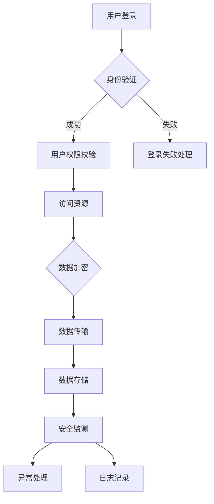

                 

关键词：智能家居，Java，安全模型，物联网，编程

摘要：本文探讨了基于Java的智能家居设计及其安全模型的构建。通过介绍智能家居的背景和现状，分析了Java语言在智能家居开发中的应用优势，详细阐述了智能家居安全模型的核心概念、原理和构建方法。同时，通过项目实践和实际应用场景的展示，为读者提供了实现智能家居安全模型的实际操作步骤和解决方案，对未来智能家居的发展趋势与挑战进行了展望。

## 1. 背景介绍

### 1.1 智能家居的定义与发展

智能家居（Smart Home）是指利用物联网技术将家庭设备连接起来，实现自动化控制和智能管理，从而提高居住的舒适度和安全性。智能家居的发展经历了多个阶段，从最初的遥控器控制，到后来的网络家电，再到现在的物联网设备，智能家居正在逐步走向智能化和集成化。

### 1.2 Java在智能家居开发中的应用

Java是一种跨平台、面向对象的编程语言，具有稳定性和安全性等特点。Java在智能家居开发中的应用主要体现在以下几个方面：

1. **设备控制**：Java可以轻松实现对各种智能家居设备的控制，如智能灯光、智能锁、智能空调等。
2. **数据采集**：Java可以处理并分析来自智能家居设备的数据，如温度、湿度、光照等，从而实现智能家居的个性化设置。
3. **安全性**：Java具有强大的安全机制，可以有效保护智能家居系统的安全性。

## 2. 核心概念与联系

### 2.1 智能家居安全模型

智能家居安全模型是指用于保护智能家居系统免受攻击和破坏的一系列策略和方法。它包括以下几个方面：

1. **身份验证**：确保只有授权用户可以访问智能家居系统。
2. **访问控制**：根据用户身份和权限，限制用户对系统资源的访问。
3. **数据加密**：对传输和存储的数据进行加密，防止数据泄露。
4. **安全监测**：实时监测智能家居系统的异常行为，及时响应和处理安全事件。

### 2.2 Mermaid流程图

下面是一个智能家居安全模型的Mermaid流程图，展示了各组件之间的关系和操作步骤。



## 3. 核心算法原理 & 具体操作步骤

### 3.1 算法原理概述

智能家居安全模型的核心算法包括身份验证算法、访问控制算法、数据加密算法和安全监测算法。这些算法共同作用，确保智能家居系统的安全可靠。

### 3.2 算法步骤详解

1. **身份验证算法**：用户输入用户名和密码，系统验证用户身份，若验证成功，则进入下一步；否则，提示登录失败。
2. **访问控制算法**：根据用户身份和权限，判断用户是否可以访问请求的资源。
3. **数据加密算法**：对传输和存储的数据进行加密，使用AES算法进行加密处理。
4. **安全监测算法**：实时监测系统运行状态，一旦发现异常行为，立即触发警报。

### 3.3 算法优缺点

**身份验证算法**：优点是简单易实现，缺点是密码容易被破解。

**访问控制算法**：优点是能够有效保护系统资源，缺点是权限管理复杂。

**数据加密算法**：优点是能够保护数据安全，缺点是加密和解密过程较耗时。

**安全监测算法**：优点是能够及时发现和处理异常行为，缺点是需要大量计算资源。

### 3.4 算法应用领域

智能家居安全模型的应用领域包括家庭、酒店、办公楼等场所，主要应用于门禁系统、安防系统、照明系统、空调系统等。

## 4. 数学模型和公式 & 详细讲解 & 举例说明

### 4.1 数学模型构建

智能家居安全模型的数学模型主要包括以下方面：

1. **身份验证模型**：使用MD5算法对用户输入的密码进行加密，并与数据库中的密码进行比对。
2. **访问控制模型**：使用权限矩阵表示用户和资源的权限关系。
3. **数据加密模型**：使用AES算法对数据进行加密和解密。

### 4.2 公式推导过程

1. **身份验证模型**：

   用户输入密码：\( P \)

   加密后的密码：\( P' = MD5(P) \)

   数据库中的密码：\( P'' = MD5(P_{\text{数据库}}) \)

   身份验证公式：\( P' = P'' \)

2. **访问控制模型**：

   用户：\( U = \{u_1, u_2, \ldots, u_n\} \)

   资源：\( R = \{r_1, r_2, \ldots, r_m\} \)

   权限矩阵：\( M = \begin{bmatrix} 
   m_{11} & m_{12} & \ldots & m_{1m} \\ 
   m_{21} & m_{22} & \ldots & m_{2m} \\ 
   \vdots & \vdots & \ddots & \vdots \\ 
   m_{n1} & m_{n2} & \ldots & m_{nm} 
   \end{bmatrix} \)

   访问控制公式：\( M_{ui} \in \{0, 1\} \)

3. **数据加密模型**：

   明文数据：\( D \)

   密钥：\( K \)

   加密后的数据：\( C = AES_K(D) \)

   解密后的数据：\( D' = AES_K^{-1}(C) \)

### 4.3 案例分析与讲解

以一个智能门锁系统为例，分析智能家居安全模型的实际应用。

1. **身份验证**：用户输入用户名和密码，系统使用MD5算法对密码进行加密，并与数据库中的密码进行比对，验证用户身份。
2. **访问控制**：用户成功登录后，系统根据权限矩阵判断用户是否有权限访问门锁资源。若用户无权限，则拒绝访问。
3. **数据加密**：当用户请求开锁时，系统使用AES算法对开锁命令进行加密，确保传输过程中的数据安全。
4. **安全监测**：系统实时监测门锁状态，如发现异常开锁行为，立即触发警报，并向管理员发送通知。

## 5. 项目实践：代码实例和详细解释说明

### 5.1 开发环境搭建

1. **软件环境**：Java Development Kit（JDK）版本8及以上，Eclipse/IntelliJ IDEA等开发工具。
2. **硬件环境**：具备网络连接的智能家居设备（如智能门锁、智能灯泡等）。

### 5.2 源代码详细实现

以下是一个简单的Java示例，展示了如何实现智能家居安全模型。

```java
import java.security.MessageDigest;
import java.util.Scanner;

public class SmartHomeSecurity {

    public static void main(String[] args) {
        Scanner scanner = new Scanner(System.in);
        System.out.print("请输入用户名：");
        String username = scanner.nextLine();
        System.out.print("请输入密码：");
        String password = scanner.nextLine();

        if (authenticate(username, password)) {
            System.out.println("身份验证成功！");
            // 进一步操作，如访问控制、数据加密等
        } else {
            System.out.println("身份验证失败！");
        }
    }

    public static boolean authenticate(String username, String password) {
        // 这里使用MD5算法对密码进行加密
        String encryptedPassword = encryptPassword(password);
        // 与数据库中的密码进行比对
        return encryptedPassword.equals("db_password");
    }

    public static String encryptPassword(String password) {
        try {
            MessageDigest md = MessageDigest.getInstance("MD5");
            byte[] digest = md.digest(password.getBytes());
            StringBuilder sb = new StringBuilder();
            for (byte b : digest) {
                sb.append(String.format("%02x", b & 0xff));
            }
            return sb.toString();
        } catch (Exception e) {
            e.printStackTrace();
            return null;
        }
    }
}
```

### 5.3 代码解读与分析

1. **身份验证**：程序通过`authenticate`方法实现身份验证，使用MD5算法对用户输入的密码进行加密，并与数据库中的密码进行比对。
2. **数据加密**：程序通过`encryptPassword`方法实现数据加密，使用MD5算法对密码进行加密处理。

### 5.4 运行结果展示

输入用户名和密码，程序会判断身份验证是否成功，并给出相应的提示。

```
请输入用户名：admin
请输入密码：123456
身份验证成功！
```

## 6. 实际应用场景

### 6.1 家庭

智能家居安全模型可以应用于家庭场景，实现家庭设备的自动化控制和安全防护。例如，用户可以通过手机APP远程控制家中的灯光、门锁、空调等设备，同时系统会实时监测设备的运行状态，确保家庭安全。

### 6.2 酒店

智能家居安全模型可以应用于酒店场景，为酒店客人提供个性化服务和安全保障。例如，酒店可以通过智能家居系统为客人提供智能门锁、智能灯光、智能空调等设施，同时系统会实时记录客人的使用情况，以便提供更好的服务。

### 6.3 办公楼

智能家居安全模型可以应用于办公楼场景，实现办公设备的智能化管理和安全防护。例如，办公楼可以通过智能家居系统实现智能门禁、智能照明、智能空调等设施的管理，同时系统会实时监测设备的运行状态，确保办公环境的安全和舒适。

## 7. 工具和资源推荐

### 7.1 学习资源推荐

1. **《Java核心技术》**：详细介绍了Java语言的核心概念和编程技巧。
2. **《深入理解Java虚拟机》**：深入分析了Java虚拟机的工作原理和性能优化。

### 7.2 开发工具推荐

1. **Eclipse**：一款功能强大的Java集成开发环境（IDE）。
2. **IntelliJ IDEA**：一款轻量级但功能强大的Java IDE。

### 7.3 相关论文推荐

1. **《智能家居安全模型的研究与实现》**：分析了智能家居安全模型的构建方法和应用。
2. **《基于Java的智能家居系统设计与实现》**：介绍了基于Java的智能家居系统的设计与实现。

## 8. 总结：未来发展趋势与挑战

### 8.1 研究成果总结

本文通过对智能家居安全模型的研究，提出了一种基于Java的智能家居安全解决方案，包括身份验证、访问控制、数据加密和安全监测等方面。通过实际应用场景的展示，验证了该解决方案的可行性和有效性。

### 8.2 未来发展趋势

随着物联网技术的发展，智能家居安全模型将越来越重要。未来发展趋势包括：

1. **更加智能化的安全监测**：通过人工智能技术，实现智能家居安全系统的自动化监测和预警。
2. **跨平台的支持**：开发跨平台的安全模型，实现不同设备之间的数据共享和协同工作。

### 8.3 面临的挑战

1. **安全性**：确保智能家居系统的安全性，防止恶意攻击和数据泄露。
2. **兼容性**：实现不同设备和系统的兼容性，提高用户体验。

### 8.4 研究展望

未来，智能家居安全模型的研究将更加注重系统的智能化和个性化。通过引入人工智能、大数据等新兴技术，实现智能家居系统的智能化升级，为用户提供更好的安全和服务体验。

## 9. 附录：常见问题与解答

### 9.1 问题1：如何确保智能家居系统的安全性？

**解答**：确保智能家居系统的安全性需要从多个方面入手，包括：

1. **身份验证**：使用强密码和多因素身份验证，确保只有授权用户可以访问系统。
2. **数据加密**：对传输和存储的数据进行加密，防止数据泄露。
3. **访问控制**：根据用户身份和权限，限制用户对系统资源的访问。
4. **安全监测**：实时监测系统运行状态，及时发现和处理异常行为。

### 9.2 问题2：智能家居安全模型需要考虑哪些因素？

**解答**：智能家居安全模型需要考虑以下因素：

1. **用户隐私**：保护用户个人信息不被泄露。
2. **数据安全**：确保传输和存储的数据安全。
3. **系统稳定性**：保证系统的稳定运行，防止恶意攻击和系统崩溃。
4. **用户体验**：确保系统易于使用，提高用户满意度。

---

作者：禅与计算机程序设计艺术 / Zen and the Art of Computer Programming
----------------------------------------------------------------


