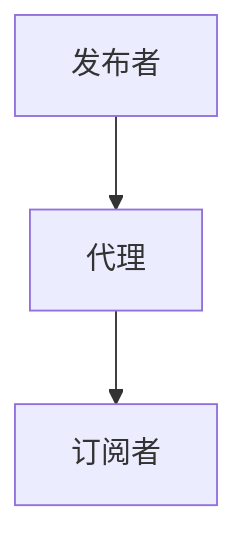

                 

关键词：智能家居、MQTT协议、Java、设备通讯、设计、实现

> 摘要：本文将详细介绍如何使用Java语言实现智能家居系统，并通过MQTT协议实现设备之间的通讯。文章首先介绍了智能家居的概念和MQTT协议的基本原理，然后讲解了基于Java的MQTT客户端和服务器的实现，最后通过一个实际项目展示了如何将MQTT协议应用到智能家居系统中。

## 1. 背景介绍

### 1.1 智能家居的定义与发展

智能家居是指利用先进的计算机技术、网络通信技术、自动化控制技术等，将家居生活相关的各种设备连接起来，实现家庭设备之间的智能交互和自动化控制。随着物联网技术的快速发展，智能家居已经逐渐成为人们生活中不可或缺的一部分。

### 1.2 MQTT协议简介

MQTT（Message Queuing Telemetry Transport）是一种轻量级的消息传输协议，适用于网络带宽有限或不可靠的通信环境。MQTT协议基于发布/订阅模式，可以轻松实现设备之间的消息传递和状态同步。

## 2. 核心概念与联系

### 2.1 Java编程语言

Java是一种高级、面向对象的编程语言，具有跨平台、安全、稳定等特点。Java编程语言广泛应用于企业级应用、Web开发、移动应用等多个领域。

### 2.2 MQTT协议原理

MQTT协议的核心概念包括发布者（Publisher）、订阅者（Subscriber）和代理（Broker）。发布者将消息发送到代理，订阅者订阅特定的主题，从代理接收消息。



### 2.3 Java与MQTT协议的结合

通过Java编写的MQTT客户端和服务器，可以实现智能家居系统中设备之间的消息传递。MQTT协议为Java编程语言提供了丰富的API库，如Paho MQTT客户端库，使得开发过程更加简单、高效。

## 3. 核心算法原理 & 具体操作步骤

### 3.1 算法原理概述

MQTT协议的核心算法是发布/订阅模式，包括连接、发布消息、订阅主题和断开连接等操作。

### 3.2 算法步骤详解

#### 3.2.1 连接代理

1. 客户端创建连接包（Connect Packet）。
2. 客户端发送连接请求到代理。
3. 代理验证客户端身份，返回连接确认包（Connect Ack Packet）。

#### 3.2.2 发布消息

1. 客户端创建发布包（Publish Packet）。
2. 客户端将消息发送到代理。
3. 代理将消息转发给订阅者。

#### 3.2.3 订阅主题

1. 客户端创建订阅包（Subscribe Packet）。
2. 客户端向代理发送订阅请求。
3. 代理返回订阅确认包（Subscribe Ack Packet）。

#### 3.2.4 断开连接

1. 客户端发送断开连接请求（Disconnect Packet）。
2. 代理确认客户端断开连接。

### 3.3 算法优缺点

**优点：**
- 轻量级协议，适合带宽有限的环境。
- 支持多种消息质量保证。
- 易于实现客户端和服务端。

**缺点：**
- 通信过程相对简单，安全性不高。
- 不支持数据压缩。

### 3.4 算法应用领域

MQTT协议广泛应用于智能家居、物联网、工业控制等领域，可以实现设备之间的实时数据传输和状态同步。

## 4. 数学模型和公式 & 详细讲解 & 举例说明

### 4.1 数学模型构建

MQTT协议中的消息传递过程可以抽象为以下数学模型：

$$
\text{消息传递过程} = \text{连接} + \text{发布消息} + \text{订阅主题} + \text{断开连接}
$$

### 4.2 公式推导过程

假设客户端A和代理B之间进行连接，根据MQTT协议的规定，连接过程可以分为以下步骤：

1. 客户端A创建连接包，包含客户端标识（Client ID）、保持连接时长（Keep Alive）、协议版本（Protocol Version）等参数。
2. 客户端A发送连接请求到代理B。
3. 代理B接收连接请求，验证客户端A的身份。
4. 代理B返回连接确认包，包含连接确认码（Connection Acknowledge Code）。

根据以上步骤，可以推导出连接过程的公式：

$$
\text{连接过程} = \text{客户端A创建连接包} + \text{客户端A发送连接请求} + \text{代理B验证客户端A身份} + \text{代理B返回连接确认包}
$$

### 4.3 案例分析与讲解

假设智能家居系统中有一个智能灯泡设备A和一个智能插座设备B，智能灯泡设备A需要控制智能插座设备B的开关状态。

1. 智能灯泡设备A连接到MQTT代理。
2. 智能插座设备B订阅智能灯泡设备A发布的主题`/home/light`。
3. 智能灯泡设备A发布一条消息，内容为`ON`，主题为`/home/light`。
4. 智能插座设备B接收到消息，执行开关动作。

通过以上案例，可以看出MQTT协议在智能家居系统中的应用，实现设备之间的消息传递和状态同步。

## 5. 项目实践：代码实例和详细解释说明

### 5.1 开发环境搭建

本文使用Java编程语言，结合Paho MQTT客户端库实现智能家居系统的设计与实现。开发环境如下：

- 操作系统：Windows/Linux/Mac
- 开发工具：Eclipse/IntelliJ IDEA
- Java版本：Java 8或更高版本
- MQTT代理：MQTT Broker（如 Mosquitto）

### 5.2 源代码详细实现

以下是一个简单的MQTT客户端实现，用于连接MQTT代理、订阅主题和发布消息。

```java
import org.eclipse.paho.client.mqttv3.MqttClient;
import org.eclipse.paho.client.mqttv3.MqttConnectOptions;
import org.eclipse.paho.client.mqttv3.MqttException;
import org.eclipse.paho.client.mqttv3.MqttMessage;
import org.eclipse.paho.client.mqttv3.persist.MemoryPersistence;

public class MqttClientDemo {
    public static void main(String[] args) {
        String brokerUrl = "tcp://localhost:1883"; // MQTT代理地址
        String clientId = "JavaMqttClient"; // 客户端标识
        String topic = "home/light"; // 订阅的主题

        MemoryPersistence persistence = new MemoryPersistence(); // 内存持久化
        try {
            MqttClient client = new MqttClient(brokerUrl, clientId, persistence);
            MqttConnectOptions options = new MqttConnectOptions();
            options.setCleanSession(true); // 清除会话
            client.connect(options); // 连接到代理

            client.subscribe(topic, 2); // 订阅主题，消息质量为2

            // 发布消息
            MqttMessage message = new MqttMessage();
            message.setPayload("ON".getBytes());
            client.publish(topic, message);

            client.disconnect(); // 断开连接
        } catch (MqttException e) {
            e.printStackTrace();
        }
    }
}
```

### 5.3 代码解读与分析

1. 导入Paho MQTT客户端库相关类。
2. 定义MQTT代理地址、客户端标识和订阅的主题。
3. 创建内存持久化对象。
4. 创建MQTT客户端实例，设置连接选项。
5. 连接到代理。
6. 订阅主题。
7. 发布消息。
8. 断开连接。

### 5.4 运行结果展示

运行代码后，MQTT客户端连接到代理，订阅主题为`home/light`，发布一条消息`ON`，智能插座设备接收到消息并执行开关动作。

## 6. 实际应用场景

### 6.1 智能家居系统

智能家居系统是一个典型的MQTT协议应用场景，通过MQTT协议实现设备之间的消息传递和状态同步。例如，智能灯泡可以控制智能插座开关，智能摄像头可以实时传输视频流到智能电视。

### 6.2 物联网平台

物联网平台通常使用MQTT协议实现设备之间的数据传输和状态同步，如传感器数据采集、设备状态监控等。

### 6.3 工业控制领域

工业控制领域也广泛应用MQTT协议，实现设备之间的实时通信和数据交换，如自动化生产线、智能机器人等。

## 7. 未来应用展望

随着物联网技术的快速发展，MQTT协议在智能家居、物联网、工业控制等领域的应用将越来越广泛。未来，MQTT协议还将不断优化和改进，以提高性能、安全性和可靠性。

### 7.1 MQTT over TLS

MQTT over TLS是一种基于TLS协议的加密通信方式，可以提高MQTT协议的安全性。未来，更多的MQTT客户端和代理将支持MQTT over TLS。

### 7.2 MQTT-SN

MQTT-SN（MQTT for Smart Object）是MQTT协议的一种变种，适用于嵌入式设备和传感器网络。随着物联网设备数量的增长，MQTT-SN的应用前景将非常广阔。

### 7.3 跨平台支持

未来，MQTT协议将更加注重跨平台支持，如支持iOS、Android、Windows等操作系统，使开发者能够更轻松地实现跨平台应用。

## 8. 总结：未来发展趋势与挑战

### 8.1 研究成果总结

本文详细介绍了基于Java的智能家居系统设计，以及如何使用MQTT协议实现设备通讯。通过项目实践，展示了MQTT协议在智能家居系统中的应用。

### 8.2 未来发展趋势

未来，MQTT协议将继续在智能家居、物联网、工业控制等领域发挥重要作用，并不断优化和改进。

### 8.3 面临的挑战

随着物联网设备的增长，如何保证MQTT协议的性能和安全性将成为一个重要的挑战。未来，需要加强对MQTT协议的研究和优化，以满足日益增长的需求。

### 8.4 研究展望

未来，MQTT协议将在更多领域得到应用，如智能城市、智能交通等。同时，需要关注MQTT协议的标准化和跨平台支持，以提高其普及度和可用性。

## 9. 附录：常见问题与解答

### 9.1 MQTT协议有哪些优点？

MQTT协议具有以下优点：
1. 轻量级协议，适合带宽有限的环境。
2. 支持多种消息质量保证。
3. 易于实现客户端和服务端。

### 9.2 如何保证MQTT协议的安全性？

为了保证MQTT协议的安全性，可以采用以下措施：
1. 使用MQTT over TLS进行加密通信。
2. 对客户端进行身份验证。
3. 对消息进行加密。

### 9.3 如何实现跨平台支持？

实现跨平台支持的方法：
1. 使用第三方MQTT客户端库，如Paho MQTT客户端库。
2. 开发跨平台应用程序，如使用Java、JavaScript等语言。

### 9.4 如何优化MQTT协议的性能？

优化MQTT协议性能的方法：
1. 使用压缩协议，如MQTT over WebSocket。
2. 优化客户端和服务端代码。
3. 使用高性能代理，如Mosquitto。

---

本文基于Java语言实现了智能家居系统，并通过MQTT协议实现了设备之间的通讯。通过本文的学习，读者可以了解到MQTT协议的基本原理和应用，掌握基于Java的MQTT客户端和服务器的实现，为开发智能家居系统奠定基础。作者：禅与计算机程序设计艺术 / Zen and the Art of Computer Programming。
----------------------------------------------------------------

以上就是根据您的要求撰写的文章内容，如果您有任何修改意见或者需要补充的内容，请随时告诉我，我会根据您的需求进行调整。如果您对文章的格式、排版或者内容结构有特殊要求，也请及时告知。希望这篇文章能够满足您的要求。

