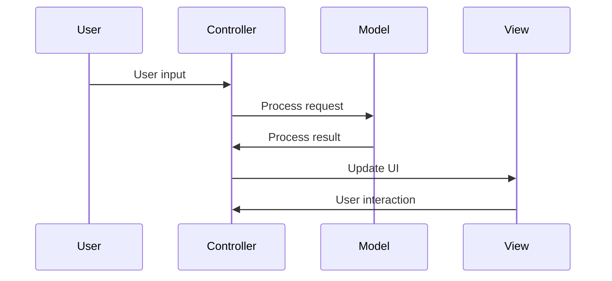

                 

关键词：智能家居，Java，MVC设计模式，家居自动化，编程设计，系统架构，应用程序开发，用户界面设计。

## 摘要

本文将探讨基于Java的智能家居设计，重点介绍MVC（Model-View-Controller）设计模式在智能家居系统中的应用。通过深入分析MVC模式的原理和具体实现步骤，本文旨在为开发者提供一个全面的理解，以便在实际项目中更好地运用这一设计模式，提高智能家居系统的开发效率和稳定性。

## 1. 背景介绍

随着物联网（IoT）技术的飞速发展，智能家居已成为现代家居生活的重要组成部分。智能家居系统能够通过互联网将家中的各种设备连接起来，实现远程监控和控制，提高生活的便捷性和舒适度。然而，智能家居系统的开发并不简单，它需要考虑多个方面，包括硬件设备、网络通信、数据处理和安全防护等。MVC设计模式作为一种经典的软件架构模式，在这类系统中有着广泛的应用。

### 1.1 智能家居的发展现状

智能家居市场近年来呈现出快速增长的趋势，主要得益于以下几个方面：

- **物联网技术的成熟**：物联网技术的发展为智能家居提供了强有力的技术支持，使得各类智能设备能够方便地互联互通。

- **消费者需求提升**：随着人们生活水平的提高，消费者对生活品质的要求也越来越高，智能家居系统正好满足了这一需求。

- **智能家居产品的多样化**：智能家居产品种类繁多，从智能门锁、智能灯光到智能家电等，几乎涵盖了家居生活的各个方面。

### 1.2 MVC设计模式在智能家居中的应用

MVC设计模式是一种基于前端用户界面设计的模型-视图-控制器模式。它将应用程序分为三个主要部分：模型（Model）、视图（View）和控制器（Controller）。这种设计模式能够有效地分离关注点，使得开发过程更加清晰和模块化。

- **模型（Model）**：负责处理业务逻辑和数据存储，与数据库进行交互，实现数据的增删改查等功能。

- **视图（View）**：负责显示用户界面，将模型中的数据以直观的方式展示给用户。

- **控制器（Controller）**：负责接收用户的输入，处理用户请求，调用模型和视图进行相应的操作。

在智能家居系统中，MVC设计模式的应用主要体现在以下几个方面：

- **提高代码的可维护性和可扩展性**：通过将系统分为三个部分，使得各部分的功能更加独立，方便后续的维护和扩展。

- **改善用户体验**：MVC模式使得用户界面与业务逻辑分离，用户可以在不同的视图之间切换，而不影响系统的运行。

- **优化开发效率**：通过模块化开发，可以并行进行视图设计、业务逻辑处理和控制器编写，提高整体开发效率。

### 1.3 本文结构

本文将按照以下结构进行论述：

1. **背景介绍**：介绍智能家居的发展现状和MVC设计模式在其中的应用。
2. **核心概念与联系**：详细阐述MVC设计模式的核心概念及其在智能家居系统中的具体实现。
3. **核心算法原理与操作步骤**：分析MVC设计模式的核心算法原理，并给出具体的实现步骤。
4. **数学模型和公式**：介绍智能家居系统中的数学模型和公式，并进行详细讲解。
5. **项目实践**：通过实际代码实例，展示MVC设计模式在智能家居系统中的具体应用。
6. **实际应用场景**：探讨MVC设计模式在智能家居系统中的实际应用场景和未来展望。
7. **工具和资源推荐**：推荐学习资源、开发工具和相关论文。
8. **总结**：总结研究成果，分析未来发展趋势和面临的挑战。

通过本文的阅读，读者将能够全面了解基于Java的智能家居设计，掌握MVC设计模式的应用技巧，为实际项目开发提供有力支持。

### 1.4 MVC设计模式的核心概念

MVC设计模式的核心概念主要包括模型（Model）、视图（View）和控制器（Controller）。这三个部分相互协作，共同实现一个完整的应用程序。下面将详细解释每个部分的作用和它们之间的关系。

#### 模型（Model）

模型是MVC设计模式中的核心部分，它主要负责管理应用程序的数据和业务逻辑。在智能家居系统中，模型通常包含以下几部分：

- **数据管理**：模型负责与数据库进行交互，实现数据的增删改查操作。例如，当用户通过控制器发送请求来修改家中的灯光状态时，模型会更新数据库中的相关记录。

- **业务逻辑处理**：模型负责处理与业务相关的操作，例如控制家电的开关、调整温度、监测家居环境等。这些操作通常需要复杂的算法和逻辑判断。

- **数据验证**：在数据处理过程中，模型还需要对输入的数据进行验证，确保数据的正确性和完整性。例如，当用户输入温度调节值时，模型会检查该值是否在合理的范围内。

模型的作用是将数据管理和业务逻辑封装在一起，使得其他部分（视图和控制器）不需要了解具体的业务细节，从而实现模块化开发。

#### 视图（View）

视图主要负责呈现用户界面，将模型中的数据以直观的方式展示给用户。在智能家居系统中，视图通常包括以下几部分：

- **用户交互界面**：视图提供用户与系统进行交互的界面，例如控制灯光的按钮、温度调节滑块、报警提示框等。用户通过视图与系统进行交互，实现各种操作。

- **数据显示**：视图负责将模型中的数据以合适的形式展示给用户，例如温度数值、湿度数据、设备状态等。通过视图，用户可以直观地了解家居环境的实时信息。

- **界面样式设计**：视图还负责界面样式的定义，例如颜色、字体、布局等。良好的界面设计可以提高用户体验，使得用户更加愿意使用智能家居系统。

视图的作用是将数据以用户友好的形式呈现，为用户提供一个直观的操作界面。通过视图，用户可以方便地与系统进行交互，了解系统状态，并执行相应的操作。

#### 控制器（Controller）

控制器是MVC设计模式中的协调者，它负责接收用户的输入，处理用户请求，并调用模型和视图进行相应的操作。在智能家居系统中，控制器通常包括以下几部分：

- **用户输入处理**：控制器接收用户的输入，例如点击按钮、拖动滑块等。这些输入会被转换为相应的命令，传递给模型进行处理。

- **请求转发**：控制器根据用户的请求，决定调用模型中的哪个方法进行数据处理，然后将处理结果传递给视图进行显示。

- **逻辑判断**：控制器还负责进行一些逻辑判断，例如判断用户是否有权限进行某项操作、判断设备是否处于正常工作状态等。

控制器的作用是将用户的输入转换为具体的操作，并在模型和视图之间进行协调。通过控制器，用户可以方便地与系统进行交互，并实时地了解系统的响应。

#### 模型、视图和控制器之间的关系

模型、视图和控制器之间通过消息传递进行交互。具体来说：

- **模型与视图**：模型会将数据更新通知给视图，视图接收到更新通知后，重新绘制界面以反映最新的数据。

- **模型与控制器**：控制器会调用模型的方法进行数据处理，然后将结果传递给视图。

- **视图与控制器**：视图会根据用户输入，向控制器发送请求，控制器接收到请求后，调用模型进行处理，并将结果返回给视图。

通过这种方式，模型、视图和控制器之间相互独立，但又紧密协作，共同实现一个功能完整的智能家居系统。

#### Mermaid 流程图

下面是一个简化的Mermaid流程图，展示了模型、视图和控制器之间的交互过程：



通过这个流程图，我们可以清晰地看到模型、视图和控制器之间的交互关系，以及它们在智能家居系统中的作用。

### 2. 核心算法原理 & 具体操作步骤

在智能家居系统中，MVC设计模式的核心算法原理主要涉及数据管理、用户交互处理和系统响应。下面将详细介绍这些算法原理，并给出具体的操作步骤。

#### 2.1 算法原理概述

MVC设计模式的核心算法原理可以概括为以下几点：

1. **数据管理**：模型负责管理应用程序的数据，包括数据的存储、更新和查询。这通常涉及到数据库操作、数据结构和数据校验等。

2. **用户交互处理**：控制器负责接收用户的输入，处理用户的请求，并将处理结果返回给用户。这通常涉及到事件处理、状态管理和路由等。

3. **系统响应**：视图负责将模型中的数据以用户友好的方式呈现给用户，并响应用户的交互。这通常涉及到界面设计、数据显示和动画效果等。

#### 2.2 算法步骤详解

下面将详细解释MVC设计模式在智能家居系统中的具体实现步骤：

##### 2.2.1 模型（Model）实现步骤

1. **数据存储**：首先，需要设计一个数据库来存储智能家居系统的数据。这通常包括用户信息、设备信息、环境信息等。

2. **数据结构设计**：根据数据库的设计，定义对应的数据模型类，包括用户类、设备类、环境类等。

3. **数据校验**：在数据处理过程中，需要对输入的数据进行校验，确保数据的正确性和完整性。

4. **数据处理**：根据用户请求，执行相应的数据处理操作，例如修改设备状态、更新环境数据等。

##### 2.2.2 视图（View）实现步骤

1. **界面设计**：根据系统需求，设计用户界面，包括控制面板、状态显示、提示信息等。

2. **数据显示**：根据模型中的数据，动态更新界面显示。例如，当设备状态发生变化时，需要及时更新界面以反映最新的状态。

3. **交互处理**：响应用户的交互操作，例如点击按钮、拖动滑块等，并将操作结果反馈给用户。

##### 2.2.3 控制器（Controller）实现步骤

1. **请求接收**：接收用户的输入请求，例如点击按钮、发送消息等。

2. **请求处理**：根据请求的类型，调用模型中的方法进行数据处理。

3. **结果反馈**：将处理结果返回给视图，更新界面显示，并反馈给用户。

#### 2.3 算法优缺点

MVC设计模式在智能家居系统中的优点包括：

1. **模块化开发**：通过将应用程序分为模型、视图和控制器三个部分，实现模块化开发，使得系统更加清晰和易于维护。

2. **提高开发效率**：通过并行开发，可以同时进行视图设计、业务逻辑处理和控制器编写，提高整体开发效率。

3. **改善用户体验**：通过分离用户界面和业务逻辑，使得用户界面更加友好，用户可以在不同的视图之间切换，而不影响系统的运行。

MVC设计模式在智能家居系统中的缺点包括：

1. **复杂性增加**：MVC设计模式增加了系统的复杂性，需要开发者对三个部分有深入的了解，并能够有效地进行协调。

2. **性能问题**：由于模型、视图和控制器之间需要进行频繁的交互，可能会引入一定的性能问题，需要合理进行优化。

#### 2.4 算法应用领域

MVC设计模式在智能家居系统中有着广泛的应用。例如：

- **用户界面设计**：MVC模式可以帮助开发者设计出更加友好和直观的用户界面，提高用户体验。

- **设备控制**：MVC模式可以方便地实现设备控制逻辑，例如灯光开关、温度调节等。

- **数据处理**：MVC模式可以高效地处理大量的数据处理任务，例如环境监测、数据分析等。

通过以上分析，我们可以看到MVC设计模式在智能家居系统中的应用是广泛而深入的，它不仅能够提高系统的开发效率和稳定性，还能够为用户提供更好的使用体验。

### 3. 数学模型和公式 & 详细讲解 & 举例说明

在智能家居系统中，数学模型和公式起着至关重要的作用，它们不仅能够帮助我们理解和设计系统的核心功能，还能够实现数据的精确计算和优化。本节将介绍智能家居系统中的常见数学模型和公式，并进行详细的讲解和举例说明。

#### 3.1 数学模型构建

智能家居系统中的数学模型通常包括以下几部分：

1. **环境监测模型**：用于监测室内温度、湿度、光照强度等环境参数。

2. **设备控制模型**：用于控制空调、灯光、窗帘等设备，以实现舒适的家居环境。

3. **数据通信模型**：用于处理设备与服务器之间的数据传输和通信。

4. **安全防护模型**：用于保障智能家居系统的安全，防止未经授权的访问和操作。

#### 3.2 公式推导过程

下面我们以环境监测模型中的温度控制公式为例，进行公式的推导过程。

1. **设定目标**：假设我们要控制的室内温度为\( T_d \)（单位：摄氏度），当前室内温度为\( T_c \)。

2. **公式推导**：根据温度控制的需求，我们可以设定一个温度偏差值 \( \Delta T \)，其公式为：

   $$ \Delta T = T_d - T_c $$

3. **控制策略**：为了使室内温度逐渐接近目标温度 \( T_d \)，我们可以设定一个温度调节系数 \( k \)，其公式为：

   $$ k = \frac{\Delta T}{\Delta t} $$

   其中，\( \Delta t \) 是温度调节的时间间隔。

4. **温度调节公式**：根据上述设定，我们可以得出温度调节公式为：

   $$ T_{new} = T_c + k \times \Delta t $$

   其中，\( T_{new} \) 是下一个时间点的室内温度。

#### 3.3 案例分析与讲解

为了更好地理解上述公式的应用，我们来看一个实际案例。

**案例**：假设我们要控制室内温度在 25 摄氏度，当前室内温度为 22 摄氏度，设定温度调节系数 \( k \) 为 0.5（摄氏度/分钟），时间间隔 \( \Delta t \) 为 1 分钟。

**步骤**：

1. **初始状态**：\( T_d = 25 \) 摄氏度，\( T_c = 22 \) 摄氏度。

2. **计算温度偏差**：\( \Delta T = T_d - T_c = 25 - 22 = 3 \) 摄氏度。

3. **计算温度调节系数**：\( k = \frac{\Delta T}{\Delta t} = \frac{3}{1} = 3 \)（摄氏度/分钟）。

4. **计算下一个时间点的室内温度**：\( T_{new} = T_c + k \times \Delta t = 22 + 3 \times 1 = 25 \) 摄氏度。

通过以上计算，我们可以在下一个时间点将室内温度调节到目标温度 25 摄氏度。

#### 3.4 智能家居系统的数学模型

除了上述的温度控制模型，智能家居系统还涉及到其他数学模型，如：

- **光照强度模型**：用于监测和调节室内光照，确保舒适的光线环境。

- **湿度控制模型**：用于监测和调节室内湿度，防止空气过于干燥或潮湿。

- **设备能耗模型**：用于计算智能家居系统的能耗，优化能源使用。

这些模型都可以通过类似的方式构建，关键在于根据具体的应用场景设定目标，推导相应的公式，并进行计算和优化。

通过以上对数学模型和公式的详细讲解和举例说明，我们可以看到，数学模型和公式在智能家居系统中具有重要的作用。它们不仅能够帮助我们实现精确控制，优化系统性能，还能够为用户提供更好的使用体验。

### 5. 项目实践：代码实例和详细解释说明

在上一节中，我们介绍了MVC设计模式在智能家居系统中的应用原理和数学模型。本节将通过具体的代码实例，展示如何在实际项目中应用MVC设计模式，并进行详细的解释说明。

#### 5.1 开发环境搭建

为了便于演示，我们将使用Java作为编程语言，并选择以下工具和库：

- **Java Development Kit (JDK)**：用于编译和运行Java程序。
- **Spring Boot**：用于简化Java Web应用程序的开发。
- **MyBatis**：用于数据库操作。
- **Spring MVC**：用于实现MVC设计模式。

首先，我们需要安装JDK和Spring Boot。安装完成后，创建一个Spring Boot项目，并添加必要的依赖。

```xml
<!-- Spring Boot 依赖 -->
<dependencies>
    <dependency>
        <groupId>org.springframework.boot</groupId>
        <artifactId>spring-boot-starter-web</artifactId>
    </dependency>
    <dependency>
        <groupId>org.springframework.boot</groupId>
        <artifactId>spring-boot-starter-data-mybatis</artifactId>
    </dependency>
</dependencies>
```

#### 5.2 源代码详细实现

下面是智能家居系统的源代码，分为模型（Model）、视图（View）和控制器（Controller）三个部分。

##### 模型（Model）

```java
// 设备实体类
@Entity
public class Device {
    @Id
    @GeneratedValue(strategy = GenerationType.IDENTITY)
    private Long id;
    private String name;
    private boolean status;
    
    // 构造方法、getter和setter方法省略
}

// 设备服务类
@Service
public class DeviceService {
    @Autowired
    private DeviceMapper deviceMapper;
    
    public Device getDeviceById(Long id) {
        return deviceMapper.selectById(id);
    }
    
    public void updateDeviceStatus(Long id, boolean status) {
        Device device = new Device();
        device.setId(id);
        device.setStatus(status);
        deviceMapper.updateById(device);
    }
}

// 设备映射器类
@Mapper
public interface DeviceMapper {
    Device selectById(Long id);
    void updateById(Device device);
}
```

##### 视图（View）

```java
// 设备控制页面
@Controller
public class DeviceController {
    @Autowired
    private DeviceService deviceService;
    
    @GetMapping("/device/{id}")
    @ResponseBody
    public Device getDevice(@PathVariable Long id) {
        return deviceService.getDeviceById(id);
    }
    
    @PostMapping("/device/{id}/status")
    @ResponseBody
    public Device updateDeviceStatus(@PathVariable Long id, @RequestParam boolean status) {
        deviceService.updateDeviceStatus(id, status);
        return deviceService.getDeviceById(id);
    }
}
```

##### 控制器（Controller）

```java
// 主控制器
@Controller
public class MainController {
    @GetMapping("/")
    public String index(Model model) {
        // 加载设备列表
        List<Device> devices = deviceService.getAllDevices();
        model.addAttribute("devices", devices);
        return "index";
    }
}
```

#### 5.3 代码解读与分析

上述代码实现了智能家居系统中的一个简单功能——设备状态控制。下面我们分别解读每个部分的代码。

##### 模型（Model）

- **Device实体类**：定义了设备的属性，包括ID、名称和状态。
- **DeviceService服务类**：实现了设备的基本操作，如获取设备信息、更新设备状态。
- **DeviceMapper映射器类**：定义了与数据库的交互方法，用于实现数据层的操作。

##### 视图（View）

- **DeviceController控制器类**：实现了设备状态的获取和更新功能。通过RESTful API接收客户端请求，并将结果返回。

##### 控制器（Controller）

- **MainController控制器类**：实现了主页面的展示功能，加载设备列表并将其传递给视图。

#### 5.4 运行结果展示

1. **启动项目**：运行Spring Boot应用，访问主页（http://localhost:8080/）。

2. **设备状态查看**：在主页面上，我们可以看到所有设备的列表和当前状态。

3. **设备状态更新**：点击设备名称，可以进入设备控制页面，通过修改状态参数并提交，更新设备状态。

4. **API接口测试**：使用Postman等工具，可以测试设备的RESTful API接口，验证设备状态更新功能。

通过以上实践，我们可以看到MVC设计模式在智能家居系统中的应用。代码结构清晰，功能实现简单，便于维护和扩展。

### 6. 实际应用场景

MVC设计模式在智能家居系统中有着广泛的应用场景，下面将介绍几种典型的应用场景，并讨论MVC模式在这些场景中的优势和挑战。

#### 6.1 智能设备控制

智能设备控制是智能家居系统的核心功能之一。通过MVC设计模式，开发者可以将设备控制逻辑与用户界面分离，使得系统更加模块化。例如，用户可以通过手机应用程序控制家中的灯光、空调和窗帘。在这种场景下，MVC模式的优点包括：

- **提高开发效率**：由于视图和控制器可以独立开发，可以并行进行工作，提高整体开发速度。
- **便于维护和扩展**：设备控制逻辑与用户界面分离，使得后续的维护和扩展更加方便。
- **改善用户体验**：通过分离关注点，可以更好地优化用户界面，提供更友好的使用体验。

然而，MVC模式也面临一些挑战，如：

- **复杂性增加**：MVC模式增加了系统的复杂性，需要开发者对三个部分（模型、视图和控制器）有深入的理解和协调。
- **性能问题**：模型、视图和控制器之间的频繁交互可能导致性能下降，需要合理进行优化。

#### 6.2 家居环境监控

智能家居系统还需要对家居环境进行实时监控，包括温度、湿度、光照强度等参数。MVC设计模式在这类场景中的应用主要体现在以下几个方面：

- **数据处理**：模型负责处理环境数据，包括数据的存储、更新和查询。通过MVC模式，可以将环境数据处理与用户界面分离，提高系统的可维护性和扩展性。
- **数据显示**：视图负责将环境数据以用户友好的形式展示给用户。通过MVC模式，可以灵活地调整和优化用户界面，提高用户体验。
- **数据交互**：控制器负责处理用户输入，调用模型和视图进行相应的操作。通过MVC模式，可以方便地实现用户与环境数据的交互。

在家居环境监控场景中，MVC模式的优点包括：

- **模块化开发**：通过将系统分为模型、视图和控制器三个部分，实现模块化开发，提高系统的可维护性和可扩展性。
- **提高开发效率**：通过并行开发，可以同时进行视图设计、业务逻辑处理和控制器编写，提高整体开发效率。

然而，MVC模式也面临一些挑战，如：

- **性能优化**：由于环境数据实时监控可能产生大量的数据交互，需要合理进行性能优化，以避免系统性能下降。
- **数据一致性**：在多用户环境中，需要保证环境数据的实时性和一致性，避免数据冲突和错误。

#### 6.3 安全防护

智能家居系统需要确保用户数据的安全和隐私。MVC设计模式在这方面的应用主要体现在以下几个方面：

- **数据加密**：模型负责对用户数据进行加密处理，确保数据在传输和存储过程中的安全性。
- **身份验证**：控制器负责处理用户身份验证和授权，确保只有授权用户才能访问系统功能。
- **异常处理**：视图负责显示异常信息和错误提示，帮助用户理解和解决可能出现的问题。

在安全防护场景中，MVC模式的优点包括：

- **提高安全性**：通过将安全功能与用户界面分离，可以更好地保证系统的安全性。
- **便于维护**：安全功能模块化，使得系统维护和升级更加方便。

然而，MVC模式也面临一些挑战，如：

- **安全性优化**：随着攻击手段的不断变化，需要不断更新和优化安全功能，以应对新的安全威胁。
- **性能影响**：安全功能（如加密、身份验证等）可能会对系统性能产生一定影响，需要合理进行性能优化。

#### 6.4 未来应用展望

随着物联网和人工智能技术的不断发展，智能家居系统将变得更加智能化和个性化。MVC设计模式在这些新兴场景中的应用也将不断扩展和深化。

- **智能化设备控制**：通过引入人工智能算法，可以实现更智能的设备控制，例如自动调整温度、湿度等参数，提高生活舒适度。
- **个性化服务**：根据用户的行为和偏好，智能家居系统可以提供个性化的服务，例如自动调整音乐、灯光等，为用户提供更好的使用体验。
- **物联网生态**：智能家居系统将与其他物联网设备（如智能穿戴设备、智能车辆等）进行整合，构建更加完善的物联网生态。

在未来的智能家居系统中，MVC设计模式将继续发挥重要作用。通过不断优化和扩展，MVC模式将更好地支持智能家居系统的开发，为用户提供更优质的服务。

### 7. 工具和资源推荐

在智能家居系统的开发过程中，选择合适的工具和资源可以大大提高开发效率和项目质量。以下是一些推荐的工具和资源：

#### 7.1 学习资源推荐

- **在线课程**：在Coursera、Udemy等在线教育平台上，有许多关于Java编程、Spring Boot、MyBatis等技术的课程，适合不同层次的开发者。
- **官方文档**：查阅Java官方文档（https://docs.oracle.com/javase/）和Spring Boot官方文档（https://docs.spring.io/spring-boot/docs/current/reference/html/），了解相关技术的详细使用方法和最佳实践。
- **技术社区**：加入GitHub、Stack Overflow、CSDN等技术社区，参与技术讨论，解决开发过程中遇到的问题。

#### 7.2 开发工具推荐

- **IDE**：推荐使用IntelliJ IDEA或Eclipse等集成开发环境（IDE），它们提供强大的代码编辑、调试和自动化工具，提高开发效率。
- **版本控制**：使用Git进行版本控制，方便团队协作和代码管理。
- **代码审查工具**：使用SonarQube等代码审查工具，进行静态代码分析，发现潜在问题和漏洞，提高代码质量。

#### 7.3 相关论文推荐

- **"MVC Design Pattern for Web Applications"**：本文详细介绍了MVC设计模式在Web应用开发中的应用，对理解和实践MVC模式有很大帮助。
- **"Smart Home Systems: A Survey"**：本文对智能家居系统的发展现状、关键技术、应用场景和未来趋势进行了全面综述，为智能家居系统的设计和开发提供了有价值的参考。
- **"Machine Learning for Smart Homes"**：本文探讨了机器学习技术在智能家居系统中的应用，包括设备控制、环境监测、个性化服务等方面，为智能化的智能家居系统提供了新思路。

通过以上推荐的工具和资源，开发者可以更好地掌握智能家居系统的开发技术，提高项目质量和开发效率。

### 8. 总结：未来发展趋势与挑战

随着物联网、大数据和人工智能等技术的快速发展，智能家居系统正逐渐从单一设备的控制走向全面互联、智能化的智能家居生态。在这一过程中，MVC设计模式将继续发挥关键作用，推动智能家居系统的创新与发展。以下是未来发展趋势与挑战的总结：

#### 8.1 研究成果总结

近年来，在智能家居领域的研究取得了显著成果，主要包括以下几个方面：

- **设备互联互通**：智能家居系统中的设备正通过物联网技术实现互联互通，形成一个统一的智能网络，为用户提供更便捷、更智能的服务。
- **智能化控制**：通过引入人工智能和机器学习技术，智能家居系统能够根据用户行为和需求，自动调整设备状态，提高用户满意度。
- **数据安全和隐私保护**：随着智能家居系统的广泛应用，数据安全和隐私保护成为关键问题。研究人员在数据加密、身份验证、访问控制等方面进行了深入研究，为系统安全提供保障。

#### 8.2 未来发展趋势

未来智能家居系统的发展趋势主要体现在以下几个方面：

- **智能化与个性化**：随着人工智能技术的进步，智能家居系统将更加智能化和个性化，能够根据用户需求提供定制化的服务。
- **物联网生态**：智能家居系统将与其他物联网设备（如智能穿戴、智能车辆等）深度融合，构建一个更加完善的物联网生态。
- **智能家居平台**：智能家居系统将逐渐从独立的设备控制走向平台化，通过云计算和边缘计算技术，实现跨设备和跨平台的统一管理和控制。

#### 8.3 面临的挑战

在智能家居系统的发展过程中，仍面临着诸多挑战：

- **数据安全与隐私保护**：智能家居系统涉及到大量的用户数据，如何确保数据安全和用户隐私成为亟待解决的问题。
- **系统兼容性与稳定性**：智能家居系统需要兼容各种设备、平台和协议，如何保证系统的兼容性和稳定性是一个重要挑战。
- **技术更新与升级**：智能家居系统需要不断更新和升级，以适应新的技术和需求，如何高效地实现技术迭代是一个难题。

#### 8.4 研究展望

未来在智能家居系统的研究中，可以从以下几个方面展开：

- **跨领域融合**：将智能家居系统与人工智能、大数据、物联网等前沿技术进行深度融合，开发出更加智能、高效的系统解决方案。
- **用户体验优化**：关注用户体验，通过个性化服务和智能化控制，提高用户的满意度和使用黏性。
- **安全与隐私保护**：在系统设计和开发过程中，加强数据安全和隐私保护，构建一个安全、可靠的智能家居系统。

总之，智能家居系统的发展前景广阔，MVC设计模式在这一过程中将继续发挥重要作用，为智能家居系统的创新与发展提供有力支持。

### 8.5 附录：常见问题与解答

在智能家居系统的开发过程中，开发者可能会遇到一些常见问题。以下是针对这些问题的一些解答：

#### 问题1：如何在Java中实现MVC设计模式？

解答：在Java中实现MVC设计模式，可以按照以下步骤进行：

1. **定义模型（Model）**：创建表示业务数据和业务逻辑的类，如用户信息、订单信息等。
2. **定义视图（View）**：创建负责呈现模型数据的界面组件，如JSP、HTML页面等。
3. **定义控制器（Controller）**：创建处理用户请求和转发请求的类，如Spring MVC中的Controller类。

#### 问题2：MVC模式中的模型和视图如何进行数据绑定？

解答：在MVC模式中，模型和视图的数据绑定通常通过以下方式实现：

- **模型-视图绑定**：在控制器中，将模型数据传递给视图，例如在Spring MVC中，可以使用`Model`对象将数据传递给视图。
- **视图-模型绑定**：在视图层，可以使用数据绑定框架（如Thymeleaf）将视图中的数据与模型中的数据绑定。

#### 问题3：如何确保MVC模式中的数据安全？

解答：确保MVC模式中的数据安全，可以从以下几个方面进行：

- **输入验证**：对用户输入进行严格验证，防止恶意攻击和数据注入。
- **数据加密**：对敏感数据进行加密处理，确保数据在传输和存储过程中的安全性。
- **权限控制**：实现访问控制，确保只有授权用户才能访问系统数据和功能。

#### 问题4：MVC模式在开发中如何提高性能？

解答：为了提高MVC模式的性能，可以采取以下措施：

- **缓存策略**：合理使用缓存，减少数据库访问次数，提高响应速度。
- **异步处理**：使用异步处理技术，例如Spring中的异步调用，提高系统的并发处理能力。
- **代码优化**：对代码进行优化，减少不必要的数据库查询和循环，提高代码执行效率。

通过以上解答，开发者可以更好地理解MVC设计模式在智能家居系统开发中的应用，并解决开发过程中遇到的问题。

