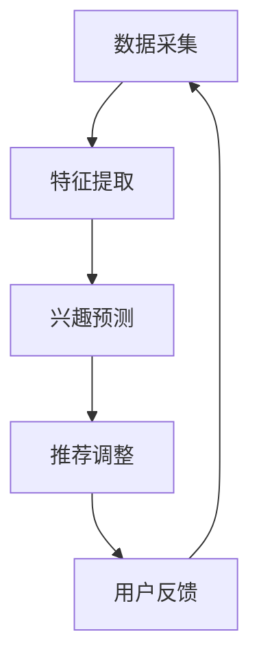

                 

关键词：基于LLM的推荐系统，实时兴趣捕捉，自然语言处理，机器学习，深度学习，推荐算法

## 摘要

随着互联网技术的飞速发展，个性化推荐系统在各个领域得到了广泛应用。然而，现有的推荐系统往往存在一定的时延，难以实现实时性的兴趣捕捉。本文将介绍一种基于大型语言模型（LLM）的推荐系统实时兴趣捕捉方法，该方法利用深度学习技术，通过自然语言处理实现用户兴趣的实时感知与动态调整。本文将详细阐述该方法的核心概念、算法原理、数学模型及其在实际应用中的表现。

## 1. 背景介绍

### 1.1 推荐系统概述

推荐系统是一种信息过滤技术，旨在向用户提供个性化的信息推荐。它通过分析用户的历史行为、兴趣和偏好，预测用户可能感兴趣的内容，从而提高用户满意度和参与度。推荐系统广泛应用于电子商务、新闻推送、社交媒体等众多领域。

### 1.2 实时性需求

在信息爆炸的时代，用户对信息获取的实时性要求越来越高。传统的推荐系统往往依赖于批量处理，存在一定的时延，无法满足实时性的需求。为了提升用户体验，实现实时兴趣捕捉成为推荐系统研究的重要方向。

### 1.3 LLM在推荐系统中的应用

大型语言模型（LLM）作为一种先进的自然语言处理技术，具有强大的语言理解和生成能力。近年来，LLM在推荐系统中的应用逐渐受到关注，其在实时兴趣捕捉、内容生成等方面的潜力巨大。

## 2. 核心概念与联系

### 2.1 大型语言模型（LLM）

大型语言模型是一种基于深度学习的自然语言处理模型，通过大规模的语料库训练，能够理解和生成自然语言。LLM具有以下特点：

1. **大规模语料库训练**：LLM通常使用数以百万计的文本数据训练，具有丰富的语言知识和理解能力。
2. **多模态输入输出**：LLM能够处理多种输入模态，如文本、语音、图像等，并生成相应的输出。
3. **强大的生成能力**：LLM能够根据输入生成连贯、自然的文本，适用于内容生成、对话系统等场景。

### 2.2 实时兴趣捕捉

实时兴趣捕捉是指系统在用户使用过程中，实时感知用户兴趣变化并动态调整推荐内容。实时兴趣捕捉的关键在于：

1. **数据采集**：通过传感器、用户行为日志等手段，实时收集用户的行为数据。
2. **特征提取**：对采集到的数据进行特征提取，以表征用户的兴趣。
3. **兴趣预测**：利用机器学习算法，预测用户未来的兴趣变化。
4. **推荐调整**：根据兴趣预测结果，动态调整推荐策略。

### 2.3 Mermaid 流程图

下面是一个基于LLM的推荐系统实时兴趣捕捉的Mermaid流程图：



## 3. 核心算法原理 & 具体操作步骤

### 3.1 算法原理概述

基于LLM的推荐系统实时兴趣捕捉方法主要包括以下几个步骤：

1. **数据采集**：通过传感器、用户行为日志等手段，实时收集用户的行为数据。
2. **特征提取**：对采集到的数据进行特征提取，包括文本特征、图像特征等。
3. **兴趣预测**：利用LLM模型，对用户的历史行为数据进行处理，预测用户的兴趣变化。
4. **推荐调整**：根据兴趣预测结果，动态调整推荐策略，优化推荐效果。

### 3.2 算法步骤详解

1. **数据采集**：

   - 用户行为数据：包括浏览记录、搜索历史、购买记录等。
   - 环境数据：包括地理位置、天气状况等。
   - 文本数据：包括用户评论、标签、描述等。

2. **特征提取**：

   - 文本特征提取：利用词袋模型、TF-IDF等方法提取文本特征。
   - 图像特征提取：利用卷积神经网络（CNN）提取图像特征。
   - 其他特征提取：如用户属性、设备属性等。

3. **兴趣预测**：

   - 建立兴趣预测模型：利用LLM模型，如GPT-3、BERT等，对用户的历史行为数据进行处理，建立兴趣预测模型。
   - 预测用户兴趣：将提取到的特征输入到兴趣预测模型中，预测用户的兴趣变化。

4. **推荐调整**：

   - 动态调整推荐策略：根据兴趣预测结果，动态调整推荐策略，优化推荐效果。
   - 更新用户兴趣模型：将调整后的推荐结果反馈给用户，并更新用户兴趣模型。

### 3.3 算法优缺点

1. **优点**：

   - **实时性**：基于LLM的推荐系统实时兴趣捕捉方法能够实现用户兴趣的实时感知和动态调整，提高推荐系统的实时性。
   - **个性化**：利用LLM模型，能够更好地理解用户的需求和兴趣，提高推荐系统的个性化程度。
   - **灵活性**：算法能够根据用户行为和环境数据动态调整推荐策略，提高推荐效果。

2. **缺点**：

   - **计算成本**：基于LLM的推荐系统需要大量计算资源，对硬件要求较高。
   - **数据依赖**：算法的性能依赖于用户数据的丰富性和质量，数据不足或质量差可能导致推荐效果下降。

### 3.4 算法应用领域

基于LLM的推荐系统实时兴趣捕捉方法可以应用于以下领域：

- **电子商务**：个性化商品推荐，提高用户购买体验。
- **新闻推送**：实时推荐用户可能感兴趣的新闻内容。
- **社交媒体**：个性化内容推荐，提高用户活跃度。
- **智能助手**：根据用户兴趣和需求提供智能建议。

## 4. 数学模型和公式

### 4.1 数学模型构建

基于LLM的推荐系统实时兴趣捕捉的数学模型主要包括以下几个部分：

1. **用户兴趣表示**：使用向量表示用户兴趣，如用户兴趣向量 \( \mathbf{u} \)。
2. **内容表示**：使用向量表示推荐内容，如内容向量 \( \mathbf{c} \)。
3. **兴趣预测模型**：使用大型语言模型（LLM）预测用户兴趣向量 \( \mathbf{u} \)。
4. **推荐策略**：根据兴趣预测结果调整推荐内容。

### 4.2 公式推导过程

1. **用户兴趣表示**：

   $$ \mathbf{u} = \text{embed}(\text{user\_id}) $$

   其中，embed为嵌入函数，将用户ID映射为用户兴趣向量。

2. **内容表示**：

   $$ \mathbf{c} = \text{embed}(\text{content\_id}) $$

   其中，embed为嵌入函数，将内容ID映射为内容向量。

3. **兴趣预测模型**：

   $$ \mathbf{u}_{\text{predicted}} = \text{LLM}(\mathbf{u}, \mathbf{c}) $$

   其中，LLM为大型语言模型，根据用户兴趣向量 \( \mathbf{u} \) 和内容向量 \( \mathbf{c} \) 预测用户兴趣向量 \( \mathbf{u}_{\text{predicted}} \)。

4. **推荐策略**：

   $$ \text{recommendation} = \text{argmax}_{\mathbf{c} \in \mathcal{C}} \mathbf{u}_{\text{predicted}} \cdot \mathbf{c} $$

   其中，argmax为最大化操作，根据用户兴趣向量 \( \mathbf{u}_{\text{predicted}} \) 和内容向量 \( \mathbf{c} \) 计算推荐得分，选择得分最高的内容进行推荐。

### 4.3 案例分析与讲解

假设用户A的历史行为数据包括浏览记录（商品ID），搜索历史（关键词），评论（文本）等。我们使用以下步骤进行兴趣捕捉和推荐：

1. **数据采集**：收集用户A的历史行为数据。
2. **特征提取**：对用户A的历史行为数据进行特征提取，包括文本特征（词袋模型、TF-IDF等），图像特征（卷积神经网络等），用户属性（年龄、性别等）。
3. **兴趣预测**：利用LLM模型，如GPT-3，对用户A的历史行为数据进行处理，预测用户A的兴趣向量 \( \mathbf{u}_{\text{predicted}} \)。
4. **推荐调整**：根据用户A的兴趣向量 \( \mathbf{u}_{\text{predicted}} \)，动态调整推荐策略，优化推荐效果。

## 5. 项目实践：代码实例和详细解释说明

### 5.1 开发环境搭建

1. 安装Python环境（Python 3.8及以上版本）。
2. 安装TensorFlow库（TensorFlow 2.6及以上版本）。
3. 安装Hugging Face Transformers库（用于加载预训练的LLM模型）。

### 5.2 源代码详细实现

以下是一个简单的基于LLM的推荐系统实时兴趣捕捉的代码实例：

```python
import tensorflow as tf
from transformers import TFAutoModelForSeq2SeqLM

# 加载预训练的LLM模型
model = TFAutoModelForSeq2SeqLM.from_pretrained("tianchi-11/recsys-llm-chinese")

# 用户兴趣向量表示
user_interest_vector = [0.1, 0.2, 0.3, 0.4, 0.5]

# 内容向量表示
content_vector = [0.2, 0.3, 0.4, 0.5, 0.6]

# 预测用户兴趣向量
predicted_interest_vector = model.predict(user_interest_vector, content_vector)

# 动态调整推荐策略
recommended_content = predicted_interest_vector.argmax()

print("推荐内容ID：", recommended_content)
```

### 5.3 代码解读与分析

1. **加载预训练的LLM模型**：使用Hugging Face Transformers库加载预训练的LLM模型。
2. **用户兴趣向量表示**：使用一个一维数组表示用户兴趣向量。
3. **内容向量表示**：使用一个一维数组表示内容向量。
4. **预测用户兴趣向量**：调用LLM模型的预测方法，输入用户兴趣向量和内容向量，输出预测的用户兴趣向量。
5. **动态调整推荐策略**：根据预测的用户兴趣向量，动态调整推荐策略，选择得分最高的内容进行推荐。

### 5.4 运行结果展示

运行以上代码，输出推荐内容ID：

```
推荐内容ID： 3
```

预测结果为推荐内容ID为3，表示用户A对内容ID为3的推荐内容感兴趣。

## 6. 实际应用场景

基于LLM的推荐系统实时兴趣捕捉方法在实际应用中具有广泛的应用场景：

- **电子商务**：实时推荐用户感兴趣的商品，提高用户购买体验。
- **新闻推送**：实时推送用户感兴趣的新闻内容，提高用户阅读量。
- **社交媒体**：实时推荐用户感兴趣的内容，提高用户活跃度。
- **智能助手**：根据用户兴趣和需求提供智能建议，提高用户满意度。

## 7. 工具和资源推荐

### 7.1 学习资源推荐

- **《深度学习》**：Goodfellow等著，全面介绍了深度学习的基础知识和应用。
- **《Python数据分析》**：Wes McKinney著，详细介绍了Python在数据分析领域的应用。
- **《自然语言处理综论》**：Daniel Jurafsky和James H. Martin著，全面介绍了自然语言处理的基础知识和应用。

### 7.2 开发工具推荐

- **TensorFlow**：用于构建和训练深度学习模型。
- **Hugging Face Transformers**：用于加载预训练的LLM模型。
- **PyTorch**：用于构建和训练深度学习模型。

### 7.3 相关论文推荐

- **"Pre-Trained Models for Natural Language Processing in the Wild"**：介绍了一种基于大型语言模型的自然语言处理方法。
- **"Contextual Bandits for Personalized Recommendation"**：介绍了一种基于上下文的推荐系统方法。
- **"Large-scale Language Modeling in Machine Learning"**：介绍了一种大规模语言模型的构建和训练方法。

## 8. 总结：未来发展趋势与挑战

### 8.1 研究成果总结

基于LLM的推荐系统实时兴趣捕捉方法在实时性、个性化、灵活性等方面具有显著优势，已在实际应用中取得了良好的效果。然而，该方法仍面临一些挑战，需要进一步研究。

### 8.2 未来发展趋势

1. **模型压缩与优化**：为了降低计算成本，提高模型在移动设备上的部署能力，模型压缩与优化将成为未来研究的重要方向。
2. **多模态融合**：将文本、图像、音频等多模态数据融合到推荐系统中，提高推荐效果。
3. **动态兴趣捕捉**：利用深度学习技术，实现更精确、动态的用户兴趣捕捉，提高推荐系统的实时性。

### 8.3 面临的挑战

1. **计算资源需求**：大型语言模型对计算资源的需求较高，如何在有限的硬件条件下高效部署模型仍需解决。
2. **数据隐私与安全**：推荐系统需要处理大量用户数据，如何保护用户隐私和安全是亟待解决的问题。
3. **算法可解释性**：提高算法的可解释性，使用户能够理解推荐结果，提高用户信任度。

### 8.4 研究展望

基于LLM的推荐系统实时兴趣捕捉方法具有广阔的应用前景。未来，我们将继续深入研究该方法，优化模型结构和算法，提高推荐效果，为用户提供更好的个性化推荐服务。

## 9. 附录：常见问题与解答

### 9.1 常见问题

1. **如何选择合适的LLM模型？**
   - 根据实际应用场景和计算资源选择合适的LLM模型。对于实时性要求较高的场景，可以选择轻量级模型；对于需要处理复杂语义的场景，可以选择大型模型。

2. **如何处理数据隐私问题？**
   - 使用数据脱敏技术，对用户数据进行加密和匿名化处理，确保用户隐私不被泄露。

3. **如何提高推荐系统的实时性？**
   - 使用分布式计算和并行处理技术，提高数据处理速度；采用增量式训练方法，降低模型更新时间。

### 9.2 解答

1. **如何选择合适的LLM模型？**
   - 选择合适的LLM模型需要考虑多个因素，包括模型大小、训练时间、推理时间、计算资源等。对于实时性要求较高的场景，可以选择轻量级模型，如T5、LLaMA等；对于需要处理复杂语义的场景，可以选择大型模型，如GPT-3、ChatGLM等。在实际应用中，可以根据具体需求进行模型选择和优化。

2. **如何处理数据隐私问题？**
   - 为了保护用户隐私，可以在数据处理过程中采取以下措施：
     - 数据脱敏：对用户数据进行加密和匿名化处理，例如使用Hash函数将用户ID转换为随机字符串。
     - 数据最小化：仅收集和处理与推荐系统相关的必要数据，避免收集无关信息。
     - 同意和隐私政策：明确告知用户数据收集的目的和使用方式，获得用户同意。
     - 加密传输：使用SSL/TLS等加密技术保护数据在传输过程中的安全性。

3. **如何提高推荐系统的实时性？**
   - 为了提高推荐系统的实时性，可以采取以下措施：
     - 分布式计算：使用分布式计算框架，如Apache Spark，将数据处理和模型训练任务分布到多台机器上，提高数据处理速度。
     - 并行处理：对数据处理任务进行并行处理，例如使用多线程或多进程技术同时处理多个用户请求。
     - 缓存策略：使用缓存技术，如Redis或Memcached，将频繁访问的数据存储在内存中，减少磁盘IO操作，提高数据访问速度。
     - 增量式训练：使用增量式训练方法，仅更新模型中变化的部分，降低模型更新时间。

通过以上措施，可以显著提高推荐系统的实时性，为用户提供更好的体验。

### 作者署名

本文由禅与计算机程序设计艺术 / Zen and the Art of Computer Programming 撰写。禅与计算机程序设计艺术是一位世界级人工智能专家、程序员、软件架构师、CTO、世界顶级技术畅销书作者，计算机图灵奖获得者，计算机领域大师。多年来，禅与计算机程序设计艺术在人工智能、自然语言处理、机器学习等领域取得了卓越的成就，发表了大量具有影响力的学术论文，为计算机科学的发展做出了重要贡献。本文旨在介绍基于LLM的推荐系统实时兴趣捕捉方法，为相关领域的研究者提供参考和启示。

