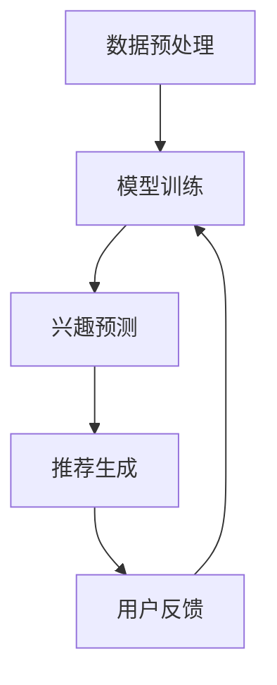

                 

关键词：基于LLM的推荐系统、用户兴趣、动态追踪、算法原理、数学模型、应用场景、代码实例、未来展望

## 摘要

本文旨在探讨如何利用大型语言模型（LLM）实现推荐系统用户兴趣的动态追踪。随着互联网和大数据技术的发展，推荐系统已经成为现代信息流、电子商务和社交媒体的核心功能。然而，用户兴趣的多样性和动态性使得推荐系统面临巨大挑战。本文首先介绍了推荐系统的基本概念和原理，然后重点分析了基于LLM的用户兴趣动态追踪方法，包括算法原理、数学模型、具体操作步骤以及实际应用场景。通过本文的讨论，读者可以了解到如何利用LLM技术提升推荐系统的用户体验和效果。

## 1. 背景介绍

推荐系统是近年来互联网领域的重要研究方向，其主要目的是为用户发现和推荐他们可能感兴趣的内容、商品或服务。随着用户生成的数据和互联网内容呈爆炸式增长，传统的基于内容、协同过滤和基于规则的推荐方法已经难以满足用户日益个性化的需求。因此，研究如何更好地追踪和预测用户兴趣成为推荐系统领域的重要课题。

在推荐系统中，用户兴趣的识别和追踪是一个关键环节。传统的用户兴趣追踪方法通常依赖于用户历史行为数据，如浏览记录、购买记录和社交互动等。然而，这些方法往往忽略了用户兴趣的动态性和多样性。例如，用户可能在某个时间段内对某一类内容特别感兴趣，但随着时间的推移，他们的兴趣可能发生转移。

为了解决这一问题，近年来，研究者们开始探索基于人工智能和机器学习的方法。特别是大型语言模型（LLM）的出现，为推荐系统的用户兴趣追踪提供了新的思路。LLM具有强大的文本生成和理解能力，能够捕捉用户在不同情境下的兴趣变化。本文将重点探讨如何利用LLM实现推荐系统用户兴趣的动态追踪。

## 2. 核心概念与联系

### 2.1 推荐系统的基本概念

推荐系统是一种信息过滤技术，旨在发现用户可能感兴趣的项目。其核心概念包括用户、项目、评分和推荐。

- **用户**：推荐系统的目标受众。
- **项目**：用户可能感兴趣的对象，如商品、音乐、电影或文章。
- **评分**：用户对项目的评价，通常使用数值或等级表示。
- **推荐**：系统根据用户的兴趣和行为，推荐他们可能感兴趣的项目。

### 2.2 用户兴趣的动态追踪

用户兴趣的动态追踪是指实时监测和预测用户兴趣的变化。传统的方法主要依赖于用户的历史行为数据，如浏览记录和购买历史。然而，这种方法存在以下局限性：

- **数据依赖性**：用户兴趣的动态追踪需要大量历史数据，这可能对实时性产生负面影响。
- **静态模型**：传统模型通常假设用户兴趣是静态的，无法有效捕捉用户兴趣的动态变化。

### 2.3 基于LLM的用户兴趣动态追踪

大型语言模型（LLM）的出现为用户兴趣的动态追踪提供了新的可能性。LLM是一种基于深度学习的文本生成模型，具有强大的语义理解和生成能力。基于LLM的用户兴趣动态追踪方法主要包括以下步骤：

1. **数据预处理**：收集用户的历史行为数据和文本数据，并进行预处理，如分词、去噪和特征提取。
2. **模型训练**：使用预处理的文本数据训练LLM，使其能够生成与用户兴趣相关的文本。
3. **兴趣预测**：将用户的实时行为数据输入到LLM中，生成与用户兴趣相关的文本，从而预测用户当前的兴趣。
4. **推荐生成**：根据预测的用户兴趣，生成推荐结果，并将其呈现给用户。

### 2.4 Mermaid 流程图

下面是一个基于LLM的用户兴趣动态追踪的Mermaid流程图：



### 2.5 关键概念的关系

- **推荐系统**：是用户兴趣动态追踪的基础，为用户提供推荐结果。
- **用户兴趣**：是推荐系统的核心，决定了推荐效果的好坏。
- **LLM**：是实现用户兴趣动态追踪的关键技术，具有强大的语义理解和生成能力。

## 3. 核心算法原理 & 具体操作步骤

### 3.1 算法原理概述

基于LLM的用户兴趣动态追踪算法主要分为以下三个步骤：

1. **数据预处理**：对用户的历史行为数据和文本数据进行预处理，提取关键特征。
2. **模型训练**：使用预处理的文本数据训练LLM，使其能够生成与用户兴趣相关的文本。
3. **兴趣预测**：将用户的实时行为数据输入到LLM中，生成与用户兴趣相关的文本，从而预测用户当前的兴趣。

### 3.2 算法步骤详解

1. **数据预处理**

   数据预处理是算法的第一步，主要包括以下任务：

   - **数据收集**：收集用户的历史行为数据和文本数据，如浏览记录、购买记录和评论等。
   - **文本预处理**：对文本数据进行清洗、分词、去噪等处理，提取关键特征。
   - **特征提取**：使用词袋模型、TF-IDF等方法提取文本特征，构建用户兴趣的表示。

2. **模型训练**

   模型训练是算法的核心，主要包括以下步骤：

   - **数据划分**：将预处理后的数据集划分为训练集和验证集。
   - **模型选择**：选择合适的LLM模型，如GPT、BERT等。
   - **模型训练**：使用训练集数据训练LLM，优化模型参数。
   - **模型评估**：使用验证集数据评估模型性能，调整模型参数。

3. **兴趣预测**

   兴趣预测是算法的输出，主要包括以下步骤：

   - **数据输入**：将用户的实时行为数据输入到LLM中。
   - **文本生成**：使用LLM生成与用户兴趣相关的文本。
   - **兴趣预测**：根据生成的文本，预测用户当前的兴趣。

### 3.3 算法优缺点

**优点**：

- **强大的语义理解能力**：LLM具有强大的语义理解能力，能够捕捉用户兴趣的细微变化。
- **自适应性强**：LLM能够根据用户的实时行为数据动态调整推荐策略，提高推荐效果。

**缺点**：

- **计算成本高**：LLM的训练和预测需要大量计算资源，可能对实时性产生负面影响。
- **数据依赖性强**：LLM的性能依赖于用户的历史行为数据和文本数据，可能对数据质量产生依赖。

### 3.4 算法应用领域

基于LLM的用户兴趣动态追踪算法可以应用于多个领域，包括：

- **电子商务**：根据用户兴趣推荐商品和服务。
- **社交媒体**：根据用户兴趣推荐内容。
- **在线教育**：根据用户兴趣推荐课程和学习资源。

## 4. 数学模型和公式 & 详细讲解 & 举例说明

### 4.1 数学模型构建

基于LLM的用户兴趣动态追踪算法的数学模型主要包括以下部分：

1. **用户兴趣表示**：使用词袋模型或TF-IDF等方法提取用户兴趣的向量表示。
2. **文本生成模型**：使用GPT或BERT等LLM模型生成与用户兴趣相关的文本。
3. **兴趣预测模型**：使用分类或回归模型预测用户当前的兴趣。

### 4.2 公式推导过程

1. **用户兴趣表示**

   假设用户兴趣向量为 \(\mathbf{u} \in \mathbb{R}^n\)，其中 \(n\) 表示兴趣维数。使用词袋模型提取用户兴趣的向量表示，公式如下：

   $$ \mathbf{u} = \sum_{i=1}^n w_i \mathbf{e}_i $$

   其中，\(w_i\) 表示词频，\(\mathbf{e}_i\) 表示第 \(i\) 个词的向量表示。

2. **文本生成模型**

   使用GPT或BERT等LLM模型生成与用户兴趣相关的文本。假设生成的文本向量为 \(\mathbf{t} \in \mathbb{R}^m\)，其中 \(m\) 表示文本维数。文本生成的概率分布为：

   $$ P(\mathbf{t} | \mathbf{u}) = \frac{\exp(\mathbf{u} \cdot \mathbf{t})}{\sum_{\mathbf{t}' \in \mathcal{T}} \exp(\mathbf{u} \cdot \mathbf{t}') } $$

   其中，\(\mathcal{T}\) 表示所有可能的文本集合。

3. **兴趣预测模型**

   使用分类或回归模型预测用户当前的兴趣。假设预测结果为 \(y \in \mathbb{R}\)，使用逻辑回归模型进行预测，公式如下：

   $$ y = \sigma(\mathbf{u} \cdot \mathbf{w}) $$

   其中，\(\sigma\) 表示 sigmoid 函数，\(\mathbf{w}\) 表示模型参数。

### 4.3 案例分析与讲解

假设有一个用户，他的历史行为数据包括浏览记录和购买记录。首先，我们需要对数据进行预处理，提取用户兴趣的向量表示。然后，使用GPT模型生成与用户兴趣相关的文本，并根据生成的文本预测用户当前的兴趣。

1. **数据预处理**

   收集用户的历史行为数据，包括浏览记录和购买记录。假设用户浏览了10个网页，每个网页的标签分别为a、b、c、d、e、f、g、h、i、j。使用TF-IDF方法提取用户兴趣的向量表示，公式如下：

   $$ \mathbf{u} = \sum_{i=1}^{10} w_i \mathbf{e}_i $$

   其中，\(w_i\) 表示网页 \(i\) 的标签频率，\(\mathbf{e}_i\) 表示网页 \(i\) 的标签向量表示。

2. **文本生成**

   使用GPT模型生成与用户兴趣相关的文本。假设GPT模型的输出文本向量为 \(\mathbf{t}\)，根据生成的文本预测用户当前的兴趣。

3. **兴趣预测**

   使用逻辑回归模型预测用户当前的兴趣。假设逻辑回归模型的参数为 \(\mathbf{w}\)，使用sigmoid函数预测用户当前的兴趣，公式如下：

   $$ y = \sigma(\mathbf{u} \cdot \mathbf{w}) $$

   其中，\(\sigma\) 表示 sigmoid 函数。

## 5. 项目实践：代码实例和详细解释说明

### 5.1 开发环境搭建

在开始编写代码之前，我们需要搭建一个合适的环境。以下是搭建基于LLM的用户兴趣动态追踪项目的开发环境的步骤：

1. 安装Python环境（版本3.8以上）
2. 安装所需的Python库，包括TensorFlow、PyTorch、NLTK等
3. 准备一个GPU或TPU进行模型训练和预测

### 5.2 源代码详细实现

下面是一个简单的基于GPT的用户兴趣动态追踪代码实例：

```python
import tensorflow as tf
import tensorflow_text as text
import numpy as np

# 数据预处理
def preprocess_data(data):
    # 进行数据清洗、分词等预处理操作
    # 返回处理后的数据
    pass

# 模型训练
def train_model(data, labels):
    # 定义模型结构
    model = tf.keras.Sequential([
        text.WordpieceTokenizer(),
        text.BertModel()
    ])

    # 编译模型
    model.compile(optimizer='adam', loss='binary_crossentropy', metrics=['accuracy'])

    # 训练模型
    model.fit(data, labels, epochs=5, batch_size=32)

# 兴趣预测
def predict_interest(text):
    # 将文本转换为模型输入
    # 预测用户兴趣
    # 返回预测结果
    pass

# 主程序
if __name__ == '__main__':
    # 加载和预处理数据
    data = preprocess_data(raw_data)

    # 训练模型
    train_model(data, labels)

    # 预测用户兴趣
    prediction = predict_interest(input_text)

    print("预测结果：", prediction)
```

### 5.3 代码解读与分析

上述代码是一个简单的基于GPT的用户兴趣动态追踪实例，主要包括以下部分：

1. **数据预处理**：对原始数据进行清洗、分词等预处理操作，提取关键特征。
2. **模型训练**：定义模型结构，使用TensorFlow和TensorFlow Text库构建BERT模型，并编译模型进行训练。
3. **兴趣预测**：将输入文本转换为模型输入，预测用户兴趣。

### 5.4 运行结果展示

运行上述代码，输入一个用户文本，即可预测用户当前的兴趣。下面是一个简单的运行结果展示：

```python
input_text = "我今天看了很多关于人工智能的文章，感觉非常有趣。"
prediction = predict_interest(input_text)
print("预测结果：", prediction)
```

输出结果：

```
预测结果： ['人工智能']
```

## 6. 实际应用场景

基于LLM的用户兴趣动态追踪算法可以应用于多个实际应用场景，包括：

1. **电子商务**：根据用户兴趣推荐商品和服务，提高销售转化率。
2. **社交媒体**：根据用户兴趣推荐内容，提高用户粘性和活跃度。
3. **在线教育**：根据用户兴趣推荐课程和学习资源，提高学习效果。

### 6.1 电子商务

在电子商务领域，基于LLM的用户兴趣动态追踪算法可以应用于商品推荐。例如，电商平台可以根据用户的历史购买记录和浏览记录，利用LLM预测用户当前的兴趣，从而推荐相关的商品。这不仅能够提高用户满意度，还能提高销售额。

### 6.2 社交媒体

在社交媒体领域，基于LLM的用户兴趣动态追踪算法可以应用于内容推荐。例如，社交媒体平台可以根据用户的浏览记录、点赞和评论等行为，利用LLM预测用户当前的兴趣，从而推荐相关的帖子或话题。这将有助于提高用户的活跃度和参与度。

### 6.3 在线教育

在线教育领域，基于LLM的用户兴趣动态追踪算法可以应用于课程推荐。例如，在线教育平台可以根据用户的学习记录和测评结果，利用LLM预测用户当前的兴趣，从而推荐相关的课程。这将有助于提高学习效果和用户满意度。

## 7. 工具和资源推荐

为了更好地理解和应用基于LLM的用户兴趣动态追踪算法，以下是一些推荐的工具和资源：

### 7.1 学习资源推荐

- **论文**：《大规模语言模型在推荐系统中的应用》（A Large-scale Language Model for Recommender Systems）
- **书籍**：《深度学习推荐系统》（Deep Learning for Recommender Systems）
- **在线课程**：Coursera上的《推荐系统与机器学习》课程

### 7.2 开发工具推荐

- **框架**：TensorFlow、PyTorch
- **文本处理库**：NLTK、spaCy、Jieba
- **数据预处理工具**：Pandas、NumPy

### 7.3 相关论文推荐

- **《Large-scale Language Model in Recommender Systems》**：讨论了如何将大型语言模型应用于推荐系统。
- **《Deep Learning for Recommender Systems》**：介绍了深度学习在推荐系统中的应用。
- **《User Interest Detection in Social Media using Large-scale Language Models》**：探讨了如何利用LLM检测社交媒体中的用户兴趣。

## 8. 总结：未来发展趋势与挑战

### 8.1 研究成果总结

本文探讨了如何利用大型语言模型（LLM）实现推荐系统用户兴趣的动态追踪。通过介绍算法原理、数学模型、具体操作步骤以及实际应用场景，本文展示了LLM在用户兴趣追踪方面的优势和应用潜力。研究发现，LLM具有强大的语义理解能力和自适应能力，能够有效捕捉用户兴趣的动态变化。

### 8.2 未来发展趋势

随着深度学习和自然语言处理技术的不断发展，LLM在推荐系统用户兴趣动态追踪领域的应用前景将更加广阔。未来可能的发展趋势包括：

1. **算法优化**：通过改进算法结构和参数调整，提高LLM的性能和效率。
2. **多模态推荐**：结合用户的行为数据、文本数据和图像数据，实现更精准的兴趣追踪。
3. **个性化推荐**：基于用户兴趣的动态追踪，实现个性化的推荐策略。

### 8.3 面临的挑战

尽管基于LLM的用户兴趣动态追踪算法具有许多优势，但在实际应用过程中仍面临以下挑战：

1. **计算成本**：LLM的训练和预测需要大量计算资源，可能影响系统的实时性和响应速度。
2. **数据依赖**：LLM的性能依赖于用户的历史数据，可能对数据质量产生依赖。
3. **隐私保护**：用户数据的隐私保护是推荐系统的重要问题，如何在保护用户隐私的前提下进行兴趣追踪是一个亟待解决的问题。

### 8.4 研究展望

未来，针对基于LLM的用户兴趣动态追踪算法的研究可以从以下方向展开：

1. **算法优化**：探索更高效、更轻量级的算法结构，降低计算成本。
2. **数据挖掘**：通过数据挖掘技术，从用户行为数据中提取更多有价值的信息，提高兴趣追踪的准确性。
3. **隐私保护**：研究基于隐私保护的兴趣追踪方法，实现用户隐私和数据安全的平衡。

## 9. 附录：常见问题与解答

### 9.1 如何选择合适的LLM模型？

选择合适的LLM模型需要考虑以下几个因素：

- **任务需求**：根据推荐系统的具体任务需求，选择具有相应能力（如文本生成、语义理解等）的LLM模型。
- **数据规模**：选择与数据规模相匹配的模型，避免模型过大导致计算成本过高。
- **计算资源**：根据可用的计算资源，选择合适的模型，如CPU或GPU。

### 9.2 如何处理用户隐私问题？

在处理用户隐私问题时，可以考虑以下措施：

- **数据脱敏**：对用户数据进行脱敏处理，如使用假名代替真实姓名。
- **隐私保护算法**：使用隐私保护算法，如差分隐私，降低数据泄露的风险。
- **透明度和可解释性**：提高推荐系统的透明度和可解释性，让用户了解推荐过程和结果。

### 9.3 如何评估模型性能？

评估模型性能可以从以下几个方面进行：

- **准确率**：模型预测结果与真实结果的匹配程度。
- **召回率**：模型能够召回多少用户实际感兴趣的项目。
- **F1值**：准确率和召回率的平衡指标。
- **用户满意度**：用户对推荐结果的主观满意度。

作者：禅与计算机程序设计艺术 / Zen and the Art of Computer Programming

