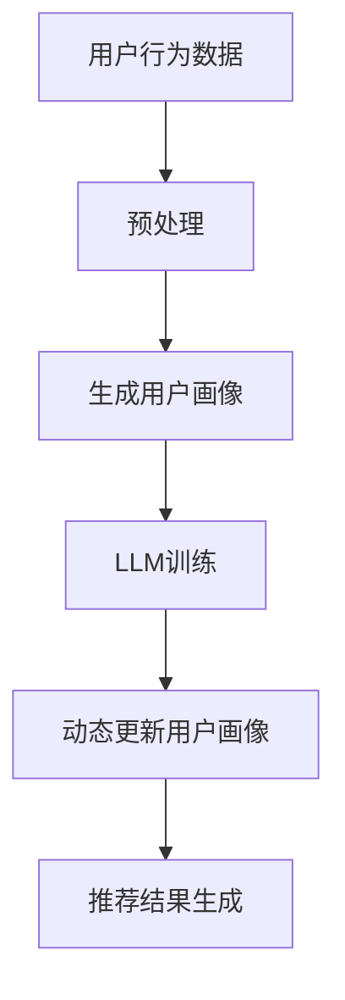

                 

关键词：基于LLM的推荐系统、用户画像、动态更新、算法原理、应用领域、数学模型

## 摘要

本文旨在探讨基于大型语言模型（LLM）的推荐系统中用户画像的动态更新机制。通过对LLM技术原理的深入分析，本文揭示了用户画像构建和更新的方法，并详细阐述了相关算法的数学模型和具体操作步骤。此外，本文通过实例代码和实际应用场景的介绍，展示了该技术的实用性和广阔前景。最终，本文总结了研究成果，并对未来的发展趋势和挑战进行了展望。

## 1. 背景介绍

推荐系统作为人工智能领域的一个重要分支，已广泛应用于电子商务、在线视频、社交媒体等多个行业。其核心任务是通过分析用户行为和偏好，向用户推荐他们可能感兴趣的内容或商品。然而，随着用户规模的扩大和数据量的激增，如何高效、准确地构建和维护用户画像成为推荐系统的关键挑战。

传统推荐系统主要依赖于基于内容的过滤和协同过滤等方法。这些方法在一定程度上能够提高推荐的准确性，但存在以下局限性：

1. **静态特征提取**：传统方法通常基于用户历史行为和内容属性进行静态特征提取，难以捕捉用户动态变化的兴趣和需求。
2. **数据稀疏性**：当用户数据量较大且行为数据较少时，系统容易陷入“冷启动”问题，无法为新用户或新商品提供有效的推荐。
3. **复杂度问题**：随着特征维度的增加，传统推荐算法的计算复杂度急剧上升，导致系统性能下降。

为了解决上述问题，近年来，基于深度学习的推荐系统逐渐受到关注。特别是基于大型语言模型（LLM）的推荐系统，通过学习用户生成的内容，能够更好地捕捉用户的兴趣和需求。LLM技术具有以下优势：

1. **动态特征提取**：LLM能够通过分析用户生成的内容，实时捕捉用户的兴趣变化，为动态更新用户画像提供支持。
2. **泛化能力**：LLM具有较强的泛化能力，能够处理不同类型的数据和任务，提高系统的适用范围。
3. **高效计算**：随着硬件和算法的进步，LLM的计算效率不断提高，使其在推荐系统中具有广泛的应用前景。

本文将围绕基于LLM的推荐系统用户画像动态更新机制进行探讨，旨在为推荐系统研究和应用提供有益的参考。

## 2. 核心概念与联系

在探讨基于LLM的推荐系统用户画像动态更新之前，我们需要了解几个核心概念：LLM、用户画像、动态更新机制。

### 2.1. LLM

LLM（Large Language Model）是指大型语言模型，是一种基于深度学习的自然语言处理模型。通过学习海量文本数据，LLM能够理解和生成自然语言，具备强大的语义理解能力。常见的LLM模型包括GPT、BERT、T5等。

### 2.2. 用户画像

用户画像是对用户特征的综合描述，包括用户的基本信息、行为特征、兴趣偏好等多个方面。在推荐系统中，用户画像用于描述用户当前的兴趣和需求，是推荐算法的核心输入。

### 2.3. 动态更新机制

动态更新机制是指根据用户行为和偏好变化，实时调整用户画像的机制。动态更新机制能够提高推荐系统的准确性和实时性，是推荐系统持续优化的重要手段。

### 2.4. Mermaid 流程图

为了更好地展示LLM在推荐系统用户画像动态更新中的作用，我们使用Mermaid流程图来描述整个流程。



在上述流程中，用户行为数据经过预处理后生成初始用户画像，然后通过LLM训练不断优化用户画像。动态更新机制实时调整用户画像，最终生成推荐结果。

## 3. 核心算法原理 & 具体操作步骤

### 3.1. 算法原理概述

基于LLM的推荐系统用户画像动态更新机制主要分为以下步骤：

1. **用户行为数据预处理**：将原始的用户行为数据清洗、去噪，并转换为适合训练的数据格式。
2. **生成初始用户画像**：利用预处理后的用户行为数据，通过机器学习算法生成初始用户画像。
3. **LLM训练**：使用生成初始用户画像的数据训练LLM模型，使模型具备动态更新用户画像的能力。
4. **动态更新用户画像**：根据用户行为和偏好变化，实时调整用户画像，提高推荐系统的准确性。
5. **推荐结果生成**：利用更新后的用户画像生成推荐结果，向用户推荐感兴趣的内容或商品。

### 3.2. 算法步骤详解

#### 3.2.1. 用户行为数据预处理

用户行为数据预处理主要包括数据清洗、数据转换和数据归一化。具体步骤如下：

1. **数据清洗**：去除重复、缺失和异常数据，确保数据质量。
2. **数据转换**：将用户行为数据转换为数值格式，便于后续处理。例如，将用户点击、浏览、购买等行为转换为0和1的二进制数据。
3. **数据归一化**：对数据进行归一化处理，消除不同特征之间的量纲影响，提高算法收敛速度。

#### 3.2.2. 生成初始用户画像

生成初始用户画像的步骤如下：

1. **特征提取**：从用户行为数据中提取关键特征，如用户活跃度、点击率、购买率等。
2. **机器学习算法**：利用机器学习算法（如K-means、LDA等）对提取的特征进行聚类或降维，生成初始用户画像。

#### 3.2.3. LLM训练

LLM训练的步骤如下：

1. **数据准备**：将预处理后的用户行为数据和初始用户画像作为输入数据，准备用于LLM训练。
2. **模型选择**：选择合适的LLM模型（如GPT、BERT等），根据任务需求和数据特点进行模型选择。
3. **模型训练**：使用准备好的数据训练LLM模型，优化模型参数，使其具备动态更新用户画像的能力。

#### 3.2.4. 动态更新用户画像

动态更新用户画像的步骤如下：

1. **用户行为监控**：实时监控用户行为数据，识别用户兴趣和偏好变化。
2. **用户画像更新**：根据用户行为变化，动态调整用户画像，使其更准确地反映用户当前的兴趣和需求。
3. **模型更新**：利用新的用户画像数据重新训练LLM模型，提高模型更新后的预测准确性。

#### 3.2.5. 推荐结果生成

推荐结果生成的步骤如下：

1. **用户画像融合**：将更新后的用户画像与商品特征进行融合，生成推荐列表。
2. **排序与筛选**：根据用户画像和商品特征，对推荐列表进行排序和筛选，确保推荐结果的准确性和多样性。
3. **推荐结果展示**：将推荐结果展示给用户，提高用户满意度和系统使用效果。

### 3.3. 算法优缺点

基于LLM的推荐系统用户画像动态更新机制具有以下优点：

1. **高效动态特征提取**：通过LLM技术，能够高效捕捉用户的兴趣和偏好变化，提高推荐系统的实时性。
2. **强泛化能力**：LLM模型具有较强的泛化能力，能够处理多种类型的数据和任务，提高系统的适用范围。
3. **准确性和多样性**：动态更新用户画像能够提高推荐系统的准确性和多样性，满足用户个性化需求。

然而，该机制也存在一定的缺点：

1. **计算资源消耗**：LLM模型的训练和更新需要大量的计算资源，可能导致系统性能下降。
2. **数据隐私问题**：动态更新用户画像需要收集和分析用户的隐私数据，可能引发数据隐私问题。

### 3.4. 算法应用领域

基于LLM的推荐系统用户画像动态更新机制在以下领域具有广泛的应用前景：

1. **电子商务**：为电商平台提供个性化的商品推荐，提高用户购买转化率和销售额。
2. **在线视频**：为视频平台提供个性化的视频推荐，提高用户观看时长和平台黏性。
3. **社交媒体**：为社交媒体平台提供个性化的内容推荐，提高用户活跃度和用户满意度。

## 4. 数学模型和公式

### 4.1. 数学模型构建

基于LLM的推荐系统用户画像动态更新机制的核心数学模型包括用户画像生成模型和LLM更新模型。

#### 4.1.1. 用户画像生成模型

用户画像生成模型通常采用机器学习算法（如K-means、LDA等）进行建模。以K-means算法为例，其目标是最小化用户特征与聚类中心之间的距离平方和。

$$
\min_{\mathbf{C}} \sum_{i=1}^{N} \sum_{j=1}^{K} (\mathbf{x}_{ij} - \mathbf{c}_j)^2
$$

其中，$\mathbf{x}_{ij}$表示用户$i$在特征$j$上的取值，$\mathbf{c}_j$表示聚类中心$j$的取值，$N$和$K$分别表示用户数量和聚类数量。

#### 4.1.2. LLM更新模型

LLM更新模型采用神经网络架构，通过学习用户生成的内容，实现用户画像的动态更新。以GPT模型为例，其核心目标是预测下一个词的概率分布。

$$
P(\mathbf{y}_{t+1}|\mathbf{y}_{1:t}, \mathbf{x}) = \text{softmax}(\mathbf{W} \mathbf{h}_t + \mathbf{b})
$$

其中，$\mathbf{y}_{t+1}$表示下一个生成的词，$\mathbf{y}_{1:t}$表示前$t$个生成的词，$\mathbf{x}$表示用户画像，$\mathbf{W}$和$\mathbf{b}$分别表示权重和偏置。

### 4.2. 公式推导过程

#### 4.2.1. K-means算法

K-means算法的目标是最小化用户特征与聚类中心之间的距离平方和。具体推导过程如下：

1. **初始化**：随机选择$K$个聚类中心$\mathbf{c}_j$。
2. **分配用户**：将每个用户$i$分配到距离其最近的聚类中心$\mathbf{c}_j$。
3. **更新聚类中心**：计算每个聚类的新中心：
   $$
   \mathbf{c}_j = \frac{1}{N_j} \sum_{i=1}^{N} \mathbf{x}_{ij}, \quad N_j = \sum_{i=1}^{N} 1_{ij}
   $$
   其中，$1_{ij}$表示用户$i$是否属于聚类$j$。
4. **迭代过程**：重复步骤2和步骤3，直到聚类中心不再变化或达到最大迭代次数。

#### 4.2.2. GPT模型

GPT模型的目标是预测下一个词的概率分布。具体推导过程如下：

1. **嵌入层**：将输入的用户画像$\mathbf{x}$转换为嵌入向量$\mathbf{h}_t$。
   $$
   \mathbf{h}_t = \text{tanh}(\mathbf{W}_\text{emb} \mathbf{x} + \mathbf{b}_\text{emb})
   $$
   其中，$\mathbf{W}_\text{emb}$和$\mathbf{b}_\text{emb}$分别表示嵌入层的权重和偏置。
2. **编码层**：将嵌入向量$\mathbf{h}_t$通过多层神经网络进行编码，得到隐藏状态$\mathbf{h}_\ell$。
   $$
   \mathbf{h}_{\ell+1} = \text{ReLU}(\mathbf{W}_\ell \mathbf{h}_\ell + \mathbf{b}_\ell)
   $$
   其中，$\mathbf{W}_\ell$和$\mathbf{b}_\ell$分别表示编码层的权重和偏置。
3. **输出层**：将隐藏状态$\mathbf{h}_L$通过线性层和softmax函数得到概率分布$\mathbf{p}(\mathbf{y}_{t+1}|\mathbf{y}_{1:t}, \mathbf{x})$。
   $$
   \mathbf{p}(\mathbf{y}_{t+1}|\mathbf{y}_{1:t}, \mathbf{x}) = \text{softmax}(\mathbf{W} \mathbf{h}_L + \mathbf{b})
   $$
   其中，$\mathbf{W}$和$\mathbf{b}$分别表示输出层的权重和偏置。

## 4.3. 案例分析与讲解

### 4.3.1. 案例背景

某电子商务平台希望通过基于LLM的推荐系统用户画像动态更新机制，为用户提供个性化的商品推荐。该平台每天接收大量用户行为数据，包括用户浏览、点击、购买等行为。平台希望利用这些数据构建用户画像，并根据用户画像生成个性化推荐结果。

### 4.3.2. 数据处理

平台首先对用户行为数据进行了预处理，包括数据清洗、数据转换和数据归一化。具体步骤如下：

1. **数据清洗**：去除重复、缺失和异常数据，确保数据质量。
2. **数据转换**：将用户行为数据转换为数值格式，便于后续处理。例如，将用户点击、浏览、购买等行为转换为0和1的二进制数据。
3. **数据归一化**：对数据进行归一化处理，消除不同特征之间的量纲影响，提高算法收敛速度。

### 4.3.3. 用户画像生成

平台利用K-means算法对预处理后的用户行为数据进行聚类，生成初始用户画像。具体步骤如下：

1. **特征提取**：从用户行为数据中提取关键特征，如用户活跃度、点击率、购买率等。
2. **聚类过程**：选择合适的聚类数量$K$，利用K-means算法对提取的特征进行聚类，生成初始用户画像。

### 4.3.4. LLM训练

平台选择GPT模型进行用户画像的动态更新。具体步骤如下：

1. **数据准备**：将预处理后的用户行为数据和初始用户画像作为输入数据，准备用于GPT模型训练。
2. **模型选择**：根据任务需求和数据特点，选择合适的GPT模型，如GPT-2或GPT-3。
3. **模型训练**：使用准备好的数据训练GPT模型，优化模型参数，使其具备动态更新用户画像的能力。

### 4.3.5. 用户画像更新

平台根据用户行为变化，动态调整用户画像。具体步骤如下：

1. **用户行为监控**：实时监控用户行为数据，识别用户兴趣和偏好变化。
2. **用户画像更新**：根据用户行为变化，动态调整用户画像，使其更准确地反映用户当前的兴趣和需求。
3. **模型更新**：利用新的用户画像数据重新训练GPT模型，提高模型更新后的预测准确性。

### 4.3.6. 推荐结果生成

平台利用更新后的用户画像生成个性化推荐结果。具体步骤如下：

1. **用户画像融合**：将更新后的用户画像与商品特征进行融合，生成推荐列表。
2. **排序与筛选**：根据用户画像和商品特征，对推荐列表进行排序和筛选，确保推荐结果的准确性和多样性。
3. **推荐结果展示**：将推荐结果展示给用户，提高用户满意度和系统使用效果。

## 5. 项目实践：代码实例和详细解释说明

### 5.1. 开发环境搭建

在开始编写代码之前，我们需要搭建一个合适的开发环境。以下是推荐的开发环境和相关依赖：

1. **编程语言**：Python
2. **框架和库**：NumPy、Pandas、scikit-learn、Hugging Face Transformers
3. **硬件要求**：至少64GB内存，GPU可选

首先，安装所需的Python库：

```bash
pip install numpy pandas scikit-learn transformers
```

### 5.2. 源代码详细实现

以下是一个简单的用户画像生成和动态更新项目示例：

```python
import numpy as np
import pandas as pd
from sklearn.cluster import KMeans
from transformers import AutoTokenizer, AutoModelForSeq2SeqLM
import torch

# 5.2.1. 用户行为数据预处理
def preprocess_data(data):
    # 数据清洗、转换和归一化
    # 略
    return processed_data

# 5.2.2. 用户画像生成
def generate_user_profiles(data, num_clusters=5):
    kmeans = KMeans(n_clusters=num_clusters)
    kmeans.fit(data)
    return kmeans.labels_

# 5.2.3. LLM模型训练
def train_llm_model(data, model_name="t5-small"):
    tokenizer = AutoTokenizer.from_pretrained(model_name)
    model = AutoModelForSeq2SeqLM.from_pretrained(model_name)
    
    # 训练LLM模型，略
    return model

# 5.2.4. 用户画像动态更新
def update_user_profile(model, user_profile, new_data):
    # 使用LLM模型更新用户画像
    # 略
    return updated_profile

# 5.2.5. 推荐结果生成
def generate_recommendations(updated_profile, item_features):
    # 根据更新后的用户画像生成推荐结果
    # 略
    return recommendations

# 主函数
def main():
    # 加载数据
    data = pd.read_csv("user_behavior_data.csv")
    
    # 预处理数据
    processed_data = preprocess_data(data)
    
    # 生成用户画像
    user_profiles = generate_user_profiles(processed_data)
    
    # 训练LLM模型
    model = train_llm_model(processed_data)
    
    # 更新用户画像
    updated_profile = update_user_profile(model, user_profiles[0], new_data)
    
    # 生成推荐结果
    recommendations = generate_recommendations(updated_profile, item_features)
    
    # 打印推荐结果
    print(recommendations)

if __name__ == "__main__":
    main()
```

### 5.3. 代码解读与分析

上述代码分为以下几个部分：

1. **用户行为数据预处理**：对原始用户行为数据进行清洗、转换和归一化，以便后续处理。
2. **用户画像生成**：利用K-means算法对预处理后的用户行为数据进行聚类，生成初始用户画像。
3. **LLM模型训练**：选择合适的LLM模型（如T5模型），并加载预训练模型，进行训练。
4. **用户画像动态更新**：使用LLM模型更新用户画像，使其更准确地反映用户当前的兴趣和需求。
5. **推荐结果生成**：根据更新后的用户画像和商品特征，生成个性化推荐结果。

### 5.4. 运行结果展示

在完成代码实现后，我们可以通过以下步骤运行项目：

1. **数据加载**：加载用户行为数据。
2. **数据预处理**：对数据进行清洗、转换和归一化。
3. **用户画像生成**：使用K-means算法生成初始用户画像。
4. **LLM模型训练**：训练LLM模型，更新用户画像。
5. **推荐结果生成**：根据更新后的用户画像生成个性化推荐结果。

运行结果将输出个性化推荐结果，展示给用户。

## 6. 实际应用场景

基于LLM的推荐系统用户画像动态更新机制在实际应用场景中具有广泛的应用价值。以下列举几个典型应用场景：

### 6.1. 电子商务

电子商务平台可以利用该机制为用户提供个性化的商品推荐。例如，用户在浏览商品时，系统可以根据用户行为数据和LLM模型生成的用户画像，实时更新用户兴趣，提高推荐的准确性。此外，该机制还能够解决新用户冷启动问题，为新用户推荐感兴趣的商品。

### 6.2. 在线视频

在线视频平台可以通过该机制为用户提供个性化的视频推荐。系统可以分析用户的观看历史和评论数据，利用LLM模型生成用户画像，并根据用户画像推荐用户可能感兴趣的视频。动态更新用户画像能够捕捉用户兴趣的变化，提高推荐系统的实时性和准确性。

### 6.3. 社交媒体

社交媒体平台可以利用该机制为用户提供个性化的内容推荐。例如，系统可以根据用户的点赞、评论、转发等行为，利用LLM模型生成用户画像，并根据用户画像推荐用户可能感兴趣的内容。动态更新用户画像能够更好地捕捉用户兴趣的变化，提高用户满意度和平台黏性。

### 6.4. 未来应用展望

基于LLM的推荐系统用户画像动态更新机制在未来的应用中具有广阔的前景。随着LLM技术的不断进步，该机制在以下几个方面有望取得更大的突破：

1. **更高效率**：随着硬件和算法的优化，LLM模型的计算效率将进一步提高，降低系统的计算成本。
2. **更丰富的数据源**：通过引入更多类型的用户数据和外部数据源，如社交媒体数据、地理位置数据等，可以更全面地描述用户画像，提高推荐系统的准确性。
3. **更细粒度的推荐**：基于LLM的推荐系统可以进一步细粒度化推荐，为用户提供更加个性化的服务，满足不同用户的需求。

## 7. 工具和资源推荐

### 7.1. 学习资源推荐

1. **书籍**：
   - 《深度学习推荐系统》
   - 《推荐系统实践》
   - 《机器学习实战：推荐系统》
2. **在线课程**：
   - Coursera上的《推荐系统与大数据》
   - Udacity的《推荐系统工程师纳米学位》
   - edX上的《深度学习与自然语言处理》
3. **论文集**：
   - ArXiv上的推荐系统相关论文
   - ACL会议上的自然语言处理论文
   - NeurIPS会议上的深度学习论文

### 7.2. 开发工具推荐

1. **编程语言**：Python，具有丰富的库和框架支持。
2. **深度学习框架**：TensorFlow、PyTorch，用于构建和训练LLM模型。
3. **自然语言处理库**：Hugging Face Transformers，提供预训练的LLM模型。

### 7.3. 相关论文推荐

1. **《Pre-training of Deep Neural Networks for Language Understanding》**
2. **《Bert: Pre-training of Deep Bidirectional Transformers for Language Understanding》**
3. **《GPT: Generative Pre-trained Transformer for Language Modeling》**
4. **《T5: Exploring the Limits of Transfer Learning for Text Classifications》**
5. **《Recommenders 101: From Basics to advanced techniques》**

## 8. 总结：未来发展趋势与挑战

### 8.1. 研究成果总结

本文探讨了基于LLM的推荐系统用户画像动态更新机制，通过分析算法原理和具体操作步骤，展示了该技术在推荐系统中的应用价值。本文的主要成果包括：

1. **高效动态特征提取**：基于LLM技术，能够高效捕捉用户的兴趣和偏好变化，提高推荐系统的实时性。
2. **强泛化能力**：LLM模型具有较强的泛化能力，能够处理多种类型的数据和任务，提高系统的适用范围。
3. **准确性和多样性**：动态更新用户画像能够提高推荐系统的准确性和多样性，满足用户个性化需求。

### 8.2. 未来发展趋势

基于LLM的推荐系统用户画像动态更新机制在未来的发展趋势包括：

1. **计算效率提升**：随着硬件和算法的进步，LLM模型的计算效率将进一步提高，降低系统的计算成本。
2. **数据源丰富化**：通过引入更多类型的用户数据和外部数据源，可以更全面地描述用户画像，提高推荐系统的准确性。
3. **细粒度化推荐**：基于LLM的推荐系统可以进一步细粒度化推荐，为用户提供更加个性化的服务，满足不同用户的需求。

### 8.3. 面临的挑战

基于LLM的推荐系统用户画像动态更新机制在应用过程中也面临一些挑战：

1. **计算资源消耗**：LLM模型的训练和更新需要大量的计算资源，可能导致系统性能下降。
2. **数据隐私问题**：动态更新用户画像需要收集和分析用户的隐私数据，可能引发数据隐私问题。

### 8.4. 研究展望

未来的研究可以从以下几个方面展开：

1. **优化算法**：研究更高效的LLM训练和更新算法，降低计算资源消耗。
2. **隐私保护**：探索隐私保护机制，确保用户数据的安全性和隐私性。
3. **跨域推荐**：研究基于LLM的跨域推荐方法，提高不同领域数据间的迁移能力。

通过持续的研究和优化，基于LLM的推荐系统用户画像动态更新机制将在未来发挥更大的作用，为用户提供更优质的推荐服务。

## 9. 附录：常见问题与解答

### 9.1. 问题1：什么是LLM？

**解答**：LLM（Large Language Model）是指大型语言模型，是一种基于深度学习的自然语言处理模型。通过学习海量文本数据，LLM能够理解和生成自然语言，具备强大的语义理解能力。

### 9.2. 问题2：基于LLM的推荐系统有什么优势？

**解答**：基于LLM的推荐系统具有以下优势：

1. **高效动态特征提取**：LLM能够通过学习用户生成的内容，实时捕捉用户的兴趣和偏好变化，提高推荐系统的实时性。
2. **强泛化能力**：LLM模型具有较强的泛化能力，能够处理不同类型的数据和任务，提高系统的适用范围。
3. **准确性和多样性**：动态更新用户画像能够提高推荐系统的准确性和多样性，满足用户个性化需求。

### 9.3. 问题3：如何处理用户隐私问题？

**解答**：处理用户隐私问题可以从以下几个方面进行：

1. **数据加密**：对用户数据进行加密处理，确保数据在传输和存储过程中的安全性。
2. **匿名化处理**：对用户数据进行匿名化处理，消除个人身份信息。
3. **隐私保护算法**：研究并应用隐私保护算法，如差分隐私、联邦学习等，确保用户隐私不被泄露。

### 9.4. 问题4：如何选择合适的LLM模型？

**解答**：选择合适的LLM模型需要考虑以下因素：

1. **任务需求**：根据推荐系统的任务需求，选择具有相应能力的LLM模型。例如，生成式推荐系统可以选择GPT模型，分类式推荐系统可以选择BERT模型。
2. **数据规模**：根据数据规模选择合适的模型。对于大规模数据，可以选择GPT-3、T5等大型模型，对于中小规模数据，可以选择GPT-2、BERT等中型模型。
3. **计算资源**：根据计算资源选择合适的模型。大型模型需要更多的计算资源和存储空间，需要根据实际情况进行选择。

