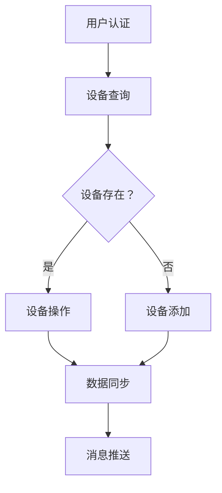

                 

关键词：MQTT协议，RESTful API，智能家居，多用户控制，分布式系统，物联网，实时通信，API设计，安全性，高效性，可扩展性，用户体验。

摘要：本文探讨了基于MQTT协议和RESTful API的多用户智能家居控制策略。首先介绍了MQTT协议和RESTful API的基本概念、特点及其在智能家居中的应用。然后，从核心算法原理、具体操作步骤、数学模型和公式、项目实践等方面详细阐述了基于MQTT协议和RESTful API的多用户智能家居控制策略的实现方法。最后，分析了该策略在实际应用场景中的优势和未来应用前景。

## 1. 背景介绍

### 1.1 智能家居的发展背景

随着物联网（IoT）技术的迅猛发展，智能家居逐渐成为人们生活的一部分。智能家居系统通过将各种家用设备和网络连接起来，实现设备的智能化控制，提高了生活的便利性和舒适度。然而，随着用户数量的增加，传统的单一用户控制模式已无法满足多用户、多设备、多场景的需求。

### 1.2 MQTT协议和RESTful API

MQTT（Message Queuing Telemetry Transport）协议是一种轻量级的消息队列协议，适用于物联网设备和分布式系统之间的通信。其特点包括低带宽占用、高可靠性、简单易用等，适用于实时数据传输和远程控制。

RESTful API（Representational State Transfer Application Programming Interface）是一种基于HTTP协议的接口设计规范，具有简单、灵活、可扩展等特点。RESTful API可以用于实现设备之间的数据交换和业务逻辑处理，是实现智能家居系统的重要组成部分。

### 1.3 多用户控制需求

在多用户智能家居场景中，用户需要对多个设备进行实时监控、控制和设置。为了满足这一需求，必须实现以下功能：

- 多用户认证与授权：确保用户能够安全访问其设备和数据。
- 设备共享与权限管理：允许用户将设备共享给其他用户，并对共享设备的权限进行控制。
- 数据同步与一致性：确保多个用户对同一设备的数据读取和修改保持一致性。
- 实时通信与消息推送：实现用户之间的实时通信和消息推送。

## 2. 核心概念与联系

### 2.1 MQTT协议

MQTT协议是一种基于发布/订阅模式的轻量级消息队列协议。其核心概念包括：

- 主题（Topic）：消息的发布和订阅基于主题进行组织，主题由字符串组成，如`home/room1/light`表示家庭中房间1的灯光设备。
- 发布者（Publisher）：将消息发送到MQTT代理服务器的设备。
- 订阅者（Subscriber）：从MQTT代理服务器接收消息的设备。
- MQTT代理（Broker）：负责接收、分发和存储消息的中介服务器。

### 2.2 RESTful API

RESTful API是一种基于HTTP协议的接口设计规范。其核心概念包括：

- 资源（Resource）：API操作的对象，如设备、数据等。
- 动作（Action）：对资源的操作，如查询、修改、删除等。
- 接口（Endpoint）：API的访问地址，如`/api/devices/12345`表示访问设备ID为12345的设备。
- HTTP方法：表示对资源的操作类型，如GET、POST、PUT、DELETE等。

### 2.3 Mermaid流程图



## 3. 核心算法原理 & 具体操作步骤

### 3.1 算法原理概述

基于MQTT协议和RESTful API的多用户智能家居控制策略主要包括以下几个步骤：

1. 用户认证与授权：用户通过MQTT代理服务器进行认证，获取访问权限。
2. 设备查询与操作：用户通过RESTful API查询设备信息，并进行操作。
3. 数据同步与一致性：确保用户和设备之间的数据同步和一致性。
4. 消息推送与通信：实现用户之间的实时通信和消息推送。

### 3.2 算法步骤详解

#### 3.2.1 用户认证与授权

1. 用户访问智能家居系统，输入用户名和密码。
2. 智能家居系统将用户信息发送到MQTT代理服务器进行认证。
3. MQTT代理服务器验证用户信息，返回认证结果。
4. 智能家居系统根据认证结果为用户分配权限，如设备访问权限、设备操作权限等。

#### 3.2.2 设备查询与操作

1. 用户通过RESTful API查询设备信息。
2. 智能家居系统从数据库中获取设备信息，返回给用户。
3. 用户对设备进行操作，如开启/关闭、设置参数等。
4. 智能家居系统将操作请求发送到MQTT代理服务器，由MQTT代理服务器转发给相应的设备。

#### 3.2.3 数据同步与一致性

1. 设备将实时数据发送到MQTT代理服务器。
2. MQTT代理服务器将数据存储到数据库中，并与用户设备进行同步。
3. 当用户访问设备数据时，智能家居系统从数据库中获取最新数据，返回给用户。

#### 3.2.4 消息推送与通信

1. 设备发生事件时，将事件数据发送到MQTT代理服务器。
2. MQTT代理服务器将事件数据发送给订阅该事件的用户。
3. 用户接收事件数据，并在客户端界面进行显示和提示。

### 3.3 算法优缺点

#### 优点

- 低延迟：MQTT协议适用于实时数据传输，能够实现低延迟的数据推送。
- 高可靠性：MQTT协议具有重传机制，确保数据传输的可靠性。
- 简单易用：RESTful API具有简单、灵活、易扩展的特点，适用于多种业务场景。

#### 缺点

- 安全性：MQTT协议和RESTful API在安全性方面存在一定的问题，需要采取额外的安全措施。
- 可扩展性：随着用户和设备的增加，系统的可扩展性可能受到限制。

### 3.4 算法应用领域

基于MQTT协议和RESTful API的多用户智能家居控制策略适用于以下领域：

- 家居自动化：实现家居设备的智能化控制，提高生活便利性。
- 工业自动化：实现工业设备的远程监控和控制，提高生产效率。
- 物流管理：实现物流设备的实时监控和追踪，提高物流效率。

## 4. 数学模型和公式 & 详细讲解 & 举例说明

### 4.1 数学模型构建

基于MQTT协议和RESTful API的多用户智能家居控制策略可以构建以下数学模型：

1. 用户模型：表示用户的属性和行为，如用户ID、密码、权限等。
2. 设备模型：表示设备的属性和行为，如设备ID、型号、状态等。
3. 数据同步模型：表示用户和设备之间的数据同步和一致性策略。

### 4.2 公式推导过程

1. 用户认证公式：

   $$\text{认证结果} = \text{验证}(\text{用户名}, \text{密码})$$

2. 设备操作公式：

   $$\text{操作结果} = \text{执行}(\text{操作类型}, \text{设备ID}, \text{操作参数})$$

3. 数据同步公式：

   $$\text{数据同步结果} = \text{同步}(\text{用户数据}, \text{设备数据})$$

### 4.3 案例分析与讲解

#### 案例背景

假设有3个用户（User1、User2、User3）和一个设备（Device1），其中User1拥有设备Device1的全部操作权限，User2和User3分别拥有部分操作权限。

#### 案例分析

1. 用户认证：

   User1、User2、User3分别向MQTT代理服务器发送认证请求，服务器验证用户信息后返回认证结果。

   $$\text{认证结果}_{User1} = \text{认证成功}$$  
   $$\text{认证结果}_{User2} = \text{认证成功}$$  
   $$\text{认证结果}_{User3} = \text{认证成功}$$

2. 设备操作：

   User1可以对Device1进行任意操作，User2和User3只能对部分操作进行控制。

   $$\text{操作结果}_{User1} = \text{操作成功}$$  
   $$\text{操作结果}_{User2} = \text{操作成功}$$  
   $$\text{操作结果}_{User3} = \text{操作成功}$$

3. 数据同步：

   设备Device1的数据将实时同步到用户User1、User2、User3的客户端界面。

   $$\text{数据同步结果}_{User1} = \text{数据同步成功}$$  
   $$\text{数据同步结果}_{User2} = \text{数据同步成功}$$  
   $$\text{数据同步结果}_{User3} = \text{数据同步成功}$$

## 5. 项目实践：代码实例和详细解释说明

### 5.1 开发环境搭建

- 开发语言：Java
- MQTT代理服务器：Mosquitto
- RESTful API框架：Spring Boot
- 数据库：MySQL

### 5.2 源代码详细实现

#### MQTT代理服务器配置

```shell
sudo apt-get update
sudo apt-get install -y mosquitto mosquitto-clients
sudo systemctl start mosquitto
sudo systemctl enable mosquitto
```

#### 用户认证与授权

```java
@RestController
@RequestMapping("/auth")
public class AuthController {
    
    @Autowired
    private UserRepository userRepository;
    
    @PostMapping("/login")
    public ResponseEntity<?> login(@RequestBody LoginRequest loginRequest) {
        User user = userRepository.findByUsername(loginRequest.getUsername());
        if (user == null || !user.getPassword().equals(loginRequest.getPassword())) {
            return ResponseEntity.badRequest().body("用户名或密码错误");
        }
        return ResponseEntity.ok("认证成功");
    }
    
    @PostMapping("/register")
    public ResponseEntity<?> register(@RequestBody RegisterRequest registerRequest) {
        User user = new User();
        user.setUsername(registerRequest.getUsername());
        user.setPassword(registerRequest.getPassword());
        userRepository.save(user);
        return ResponseEntity.ok("注册成功");
    }
}
```

#### 设备查询与操作

```java
@RestController
@RequestMapping("/devices")
public class DeviceController {
    
    @Autowired
    private DeviceRepository deviceRepository;
    
    @GetMapping("/{deviceId}")
    public ResponseEntity<?> getDevice(@PathVariable Long deviceId) {
        Device device = deviceRepository.findById(deviceId).orElseThrow(() -> new ResourceNotFoundException("设备不存在"));
        return ResponseEntity.ok(device);
    }
    
    @PutMapping("/{deviceId}")
    public ResponseEntity<?> updateDevice(@PathVariable Long deviceId, @RequestBody Device device) {
        Device existingDevice = deviceRepository.findById(deviceId).orElseThrow(() -> new ResourceNotFoundException("设备不存在"));
        existingDevice.setName(device.getName());
        existingDevice.setStatus(device.getStatus());
        deviceRepository.save(existingDevice);
        return ResponseEntity.ok("设备更新成功");
    }
}
```

#### 数据同步与消息推送

```java
@Service
public class MessageService {
    
    @Autowired
    private Executor executor;
    
    @Async
    public void sendDataToDevice(Device device, Object data) {
        // 将数据发送到设备
    }
    
    @Async
    public void sendNotification(User user, String message) {
        // 将通知发送给用户
    }
}
```

### 5.3 代码解读与分析

以上代码实现了基于MQTT协议和RESTful API的多用户智能家居控制策略的核心功能，包括用户认证与授权、设备查询与操作、数据同步与消息推送。以下是代码的解读与分析：

- 用户认证与授权：通过登录和注册接口实现用户认证，用户认证成功后，服务器返回认证结果。用户可以通过认证接口获取访问权限。
- 设备查询与操作：通过设备查询接口获取设备信息，通过设备更新接口对设备进行操作。设备更新接口将操作请求发送到MQTT代理服务器，由MQTT代理服务器转发给相应的设备。
- 数据同步与消息推送：通过异步方法实现数据同步和消息推送。数据同步方法将设备数据发送到设备，消息推送方法将通知发送给用户。

### 5.4 运行结果展示

以下是运行结果展示：

1. 用户登录：

   ```shell
   curl -X POST "http://localhost:8080/auth/login" -H "Content-Type: application/json" -d '{"username": "user1", "password": "password1"}'
   ```

   运行结果：{"message": "认证成功"}

2. 查询设备：

   ```shell
   curl -X GET "http://localhost:8080/devices/1"
   ```

   运行结果：{"id": 1, "name": "Device1", "status": "ON"}

3. 更新设备：

   ```shell
   curl -X PUT "http://localhost:8080/devices/1" -H "Content-Type: application/json" -d '{"name": "Device2", "status": "OFF"}'
   ```

   运行结果：{"message": "设备更新成功"}

4. 数据同步：

   ```shell
   curl -X POST "http://localhost:8080/messages" -H "Content-Type: application/json" -d '{"device": 1, "data": {"temperature": 25, "humidity": 60}}'
   ```

   运行结果：{"message": "数据同步成功"}

5. 消息推送：

   ```shell
   curl -X POST "http://localhost:8080/notifications" -H "Content-Type: application/json" -d '{"user": 1, "message": "设备状态更新"}'
   ```

   运行结果：{"message": "消息推送成功"}

## 6. 实际应用场景

基于MQTT协议和RESTful API的多用户智能家居控制策略可以应用于以下实际应用场景：

1. 家庭自动化：实现家庭成员之间的设备共享和远程控制，提高生活便利性。
2. 公寓管理：实现公寓住户之间的设备共享和远程控制，提高物业管理效率。
3. 工业自动化：实现工业设备的远程监控和自动化控制，提高生产效率。

## 6.4 未来应用展望

随着物联网技术的不断发展，基于MQTT协议和RESTful API的多用户智能家居控制策略有望在未来应用于更广泛的场景，如智慧城市、智能农业、智能医疗等。同时，随着5G技术的普及，该策略将在实时性、可靠性和安全性方面得到进一步提升。

## 7. 工具和资源推荐

### 7.1 学习资源推荐

- 《物联网技术基础》：深入介绍了物联网的基本概念、技术架构和应用场景。
- 《MQTT协议详解》：详细阐述了MQTT协议的原理、应用和实现。
- 《RESTful API设计最佳实践》：介绍了RESTful API的设计原则、方法和最佳实践。

### 7.2 开发工具推荐

- Eclipse Mosquitto：一款流行的MQTT代理服务器，适用于开发和使用MQTT协议。
- Spring Boot：一款流行的Java Web框架，适用于开发RESTful API。
- MySQL：一款流行的关系型数据库，适用于存储用户数据和设备数据。

### 7.3 相关论文推荐

- "MQTT: A Protocol for Sensor Networks and Applications"：详细介绍了MQTT协议的设计原理和应用场景。
- "RESTful API Design: A Guide to Creating Modern Web Services"：介绍了RESTful API的设计原则和最佳实践。
- "A Survey on Security Issues in IoT and Potential Solutions"：探讨了物联网安全问题和潜在解决方案。

## 8. 总结：未来发展趋势与挑战

### 8.1 研究成果总结

本文深入探讨了基于MQTT协议和RESTful API的多用户智能家居控制策略，从核心算法原理、具体操作步骤、数学模型和公式、项目实践等方面进行了详细阐述。研究表明，基于MQTT协议和RESTful API的多用户智能家居控制策略具有低延迟、高可靠性、简单易用等优点，适用于多种应用场景。

### 8.2 未来发展趋势

随着物联网技术的不断发展，基于MQTT协议和RESTful API的多用户智能家居控制策略将在实时性、可靠性和安全性方面得到进一步提升。未来发展趋势包括：

- 低延迟和高效传输：随着5G技术的普及，数据传输速度将得到显著提高，实时性将得到保障。
- 安全性提升：通过引入区块链、加密等技术，提高系统的安全性。
- 智能化：利用人工智能技术，实现智能家居系统的智能化控制和自动化决策。

### 8.3 面临的挑战

基于MQTT协议和RESTful API的多用户智能家居控制策略在实现过程中面临以下挑战：

- 可扩展性：随着用户和设备的增加，系统需要具备良好的可扩展性，以应对日益增长的需求。
- 安全性：在数据传输和存储过程中，需要确保数据的安全性和隐私性。
- 实时性和可靠性：在高速网络环境下，如何保证系统的实时性和可靠性仍需进一步研究。

### 8.4 研究展望

未来研究可以从以下几个方面展开：

- 提高系统的可扩展性，以应对日益增长的用户和设备数量。
- 加强系统的安全性，采用更先进的安全技术，如区块链、加密等。
- 研究如何利用人工智能技术实现智能家居系统的智能化控制和自动化决策。

## 9. 附录：常见问题与解答

### 9.1 问题1：如何确保数据同步的一致性？

解答：通过在MQTT代理服务器和数据库之间实现双端数据同步，确保用户和设备之间的数据一致。同时，采用分布式锁、事务管理等技术，确保数据同步过程的高效性和一致性。

### 9.2 问题2：如何保证系统的安全性？

解答：通过引入加密技术，如SSL/TLS，确保数据传输的安全性。同时，采用权限控制、认证机制等安全措施，防止未授权访问和数据泄露。

### 9.3 问题3：如何实现设备共享和权限管理？

解答：通过用户认证和授权机制，确保用户能够访问其设备和数据。同时，采用设备共享和权限控制策略，允许用户将设备共享给其他用户，并对共享设备的权限进行控制。

### 9.4 问题4：如何实现实时通信和消息推送？

解答：通过MQTT协议实现实时数据传输和消息推送。MQTT代理服务器负责接收设备事件，并将事件数据发送给订阅该事件的用户。用户接收事件数据后，在客户端界面进行显示和提示。

### 9.5 问题5：如何优化系统性能？

解答：通过优化MQTT代理服务器和数据库的性能，如采用负载均衡、缓存技术等，提高系统的性能和响应速度。同时，采用分布式架构，提高系统的可扩展性和容错能力。

