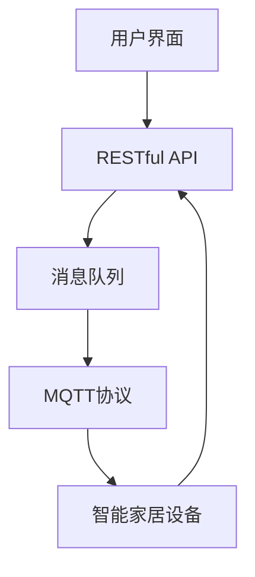

                 

本文将深入探讨基于MQTT协议和RESTful API的智能家居辅助决策系统，并详细解析其设计、实现与应用。智能家居作为物联网（IoT）的重要组成部分，其核心在于如何高效地收集、处理和利用家庭环境中的各种数据，以提供智能化、个性化的服务。MQTT协议和RESTful API为智能家居系统的数据通信提供了高效、可靠且灵活的解决方案。

## 关键词
- MQTT协议
- RESTful API
- 智能家居
- 辅助决策
- 物联网

## 摘要
本文旨在构建一个基于MQTT协议和RESTful API的智能家居辅助决策系统，通过对家庭环境数据的实时监测、分析和处理，实现智能家居设备的智能化管理和控制。文章首先介绍了MQTT协议和RESTful API的基本原理和特点，然后详细阐述了系统的整体架构、核心算法原理、数学模型、具体实现和实际应用场景。最后，文章对未来的发展前景进行了展望，并提出了相关的挑战和研究方向。

---

## 1. 背景介绍

随着物联网技术的迅猛发展，智能家居逐渐成为人们日常生活的一部分。智能家居系统通过将各种家庭设备和传感器连接到互联网，实现家庭环境数据的实时监测和远程控制，从而提供更加便捷、舒适和安全的居住体验。然而，智能家居系统的复杂性和多样性也带来了巨大的挑战，主要包括以下几个方面：

### 数据采集和处理
家庭环境中的数据种类繁多，如温度、湿度、光照、声音、运动等。如何高效、准确地采集和处理这些数据，是智能家居系统设计的关键问题。

### 安全性
智能家居系统涉及到用户隐私和安全，如何确保系统的安全性，防止数据泄露和网络攻击，是系统设计的重要考虑因素。

### 可扩展性和互操作性
智能家居系统需要支持各种不同品牌和类型的设备，以及不同的通信协议，这要求系统具有良好的可扩展性和互操作性。

### 用户交互体验
智能家居系统的用户交互体验直接影响到用户的满意度，如何设计简洁、直观的用户界面，是提升用户体验的关键。

为了解决上述问题，本文提出了一种基于MQTT协议和RESTful API的智能家居辅助决策系统。MQTT协议作为一种轻量级的消息队列协议，适用于物联网设备之间的低带宽、不可靠的网络环境，能够满足智能家居系统对实时性和可靠性的要求。RESTful API则提供了统一的接口标准，使得不同设备和服务之间能够方便地进行数据交互和功能调用，提高了系统的可扩展性和互操作性。

---

### 2. 核心概念与联系

#### 2.1 MQTT协议

MQTT（Message Queuing Telemetry Transport）协议是一种轻量级的消息传输协议，专门设计用于在受限的网络环境中进行通信。其主要特点如下：

- **发布/订阅模式**：MQTT协议采用发布/订阅（Pub/Sub）模式，发布者（Publisher）发布消息到特定的主题（Topic），订阅者（Subscriber）根据订阅的主题接收消息。
- **低带宽和高效率**：MQTT协议的消息格式简洁，支持压缩，适用于带宽有限、网络不稳定的环境。
- **QoS等级**：MQTT协议支持三种消息质量等级（QoS），分别为0、1和2，用于保证消息的可靠性。

#### 2.2 RESTful API

RESTful API（Representational State Transfer Application Programming Interface）是一种基于HTTP协议的接口设计规范，其主要特点如下：

- **无状态性**：RESTful API是无状态的，每次请求都是独立的，不会保留之前的请求状态。
- **统一接口**：RESTful API通过统一的方法（GET、POST、PUT、DELETE等）和资源标识（URL）进行数据操作，提高了接口的可读性和可维护性。
- **支持多种数据格式**：RESTful API支持多种数据格式，如JSON、XML等，便于不同系统之间的数据交换。

#### 2.3 Mermaid 流程图

为了更直观地展示MQTT协议和RESTful API在智能家居系统中的联系，我们可以使用Mermaid绘制一个流程图：



在这个流程图中，用户通过用户界面与RESTful API进行交互，API将用户的指令发送到消息队列，消息队列通过MQTT协议将指令转发给智能家居设备，设备执行相应的操作，并将结果反馈给用户。

---

### 3. 核心算法原理 & 具体操作步骤

#### 3.1 算法原理概述

智能家居辅助决策系统的核心在于如何根据实时监测到的家庭环境数据，做出智能化的决策。这涉及到数据采集、处理和决策算法的各个步骤。

- **数据采集**：通过各种传感器采集家庭环境中的数据，如温度、湿度、光照等。
- **数据处理**：对采集到的数据进行预处理，包括去噪、滤波等，以提高数据的准确性和可靠性。
- **决策算法**：根据预处理后的数据，运用决策算法生成操作指令，如调节空调温度、关闭灯光等。

#### 3.2 算法步骤详解

1. **数据采集**：
   - 使用各种传感器（如温度传感器、湿度传感器、光照传感器等）采集家庭环境数据。
   - 数据采集模块负责将传感器数据转换为数字信号，并传输到处理模块。

2. **数据处理**：
   - 数据预处理模块对接收到的数据进行滤波、去噪等处理，以提高数据的准确性和可靠性。
   - 数据存储模块将处理后的数据存储到数据库中，以便后续分析和处理。

3. **决策算法**：
   - 决策算法模块根据数据库中的历史数据和实时数据，运用机器学习、模糊逻辑等方法生成操作指令。
   - 操作指令通过MQTT协议发送给智能家居设备，设备根据指令执行相应的操作。

#### 3.3 算法优缺点

- **优点**：
  - 高效性：MQTT协议和RESTful API提供了高效的数据传输和处理机制，能够快速响应用户的需求。
  - 可靠性：MQTT协议的QoS等级保证了消息的可靠性，减少了数据丢失的风险。
  - 灵活性：RESTful API支持多种数据格式和接口方法，提高了系统的灵活性和可扩展性。

- **缺点**：
  - 复杂性：系统的设计和实现相对复杂，需要考虑多种因素，如网络稳定性、安全性等。
  - 可维护性：随着系统的不断扩展，维护和升级的难度会增加。

#### 3.4 算法应用领域

智能家居辅助决策系统可以应用于多个领域，如：

- **家庭自动化**：通过自动化控制家庭设备，提高家庭生活的便利性和舒适度。
- **能源管理**：通过实时监测和调整家庭能源使用，实现节能减排。
- **安全监控**：通过传感器和摄像头等设备实时监测家庭安全状况，提供及时预警。

---

### 4. 数学模型和公式 & 详细讲解 & 举例说明

#### 4.1 数学模型构建

智能家居辅助决策系统中的数学模型主要涉及数据预处理和决策算法两个方面。

1. **数据预处理模型**：

   - **滤波**：设输入信号为$x(t)$，滤波后的信号为$y(t)$，则滤波器的输出可以表示为：
     $$
     y(t) = \frac{1}{T}\int_{t-T}^{t} x(\tau) d\tau
     $$
     其中，$T$为滤波器的时间窗口。

   - **去噪**：设输入信号为$x(t)$，噪声为$n(t)$，去噪后的信号为$\hat{x}(t)$，则去噪模型可以表示为：
     $$
     \hat{x}(t) = x(t) - n(t)
     $$

2. **决策算法模型**：

   - **机器学习模型**：设输入特征向量为$x$，输出标签向量为$y$，机器学习模型可以表示为：
     $$
     y = f(x; \theta)
     $$
     其中，$f$为决策函数，$\theta$为模型参数。

   - **模糊逻辑模型**：设输入特征向量为$x$，模糊集合为$\mu_x$，输出模糊集合为$\mu_y$，模糊逻辑模型可以表示为：
     $$
     \mu_y = f(\mu_x; \theta)
     $$

#### 4.2 公式推导过程

1. **滤波器公式推导**：

   - **低通滤波器**：设输入信号$x(t)$为连续时间信号，输出信号$y(t)$为连续时间信号，低通滤波器的传递函数$H(s)$为：
     $$
     H(s) = \frac{1}{s^2 + 2\zeta\omega_ns}
     $$
     其中，$\zeta$为阻尼比，$\omega_n$为自然频率。

   - **理想低通滤波器**：理想低通滤波器的传递函数$H(s)$为：
     $$
     H(s) = \frac{1}{s^2 + \omega_n^2}
     $$

2. **去噪公式推导**：

   - **维纳滤波器**：设输入信号$x(t)$为连续时间信号，噪声$n(t)$为连续时间信号，维纳滤波器的输出信号$\hat{x}(t)$为：
     $$
     \hat{x}(t) = x(t) - \frac{\langle x(t)n(t) \rangle}{\langle n(t)^2 \rangle}
     $$
     其中，$\langle \cdot \rangle$表示数学期望。

   - **卡尔曼滤波器**：设输入信号$x(t)$为连续时间信号，噪声$n(t)$为连续时间信号，卡尔曼滤波器的输出信号$\hat{x}(t)$为：
     $$
     \hat{x}(t) = \hat{x}(t-1) + K(t)[x(t) - \hat{x}(t-1)]
     $$
     其中，$K(t)$为卡尔曼滤波器增益。

#### 4.3 案例分析与讲解

假设我们有一个智能家居系统，需要根据室内温度和湿度数据调整空调和加湿器的运行状态。我们可以使用以下数学模型进行决策：

1. **滤波**：

   - 设输入信号为$x(t)$，滤波后的信号为$y(t)$，采用低通滤波器进行滤波，传递函数$H(s)$为：
     $$
     H(s) = \frac{1}{s^2 + 0.5s + 1}
     $$
     滤波后的温度信号$y_t(t)$和湿度信号$y_h(t)$如下所示：

   ```mermaid
   sequence
   participant A as 用户
   participant B as 智能家居系统

   A->>B: 室内温度和湿度数据
   B->>A: 滤波后的温度信号$y_t(t)$和湿度信号$y_h(t)$
   ```

2. **决策**：

   - 设输入特征向量为$x = [y_t(t), y_h(t)]$，输出标签向量为$y$，采用模糊逻辑模型进行决策，模糊集合$\mu_x$和$\mu_y$如下所示：

   ```mermaid
   flowchart LR
   A[输入特征向量] --> B[模糊逻辑模型]
   B --> C[输出模糊集合$\mu_y$]
   C --> D[空调和加湿器操作指令]
   ```

   根据模糊逻辑模型的输出，我们可以生成相应的空调和加湿器操作指令，如：

   - 当温度信号$y_t(t)$高于设定值且湿度信号$y_h(t)$低于设定值时，开启空调和加湿器。
   - 当温度信号$y_t(t)$低于设定值且湿度信号$y_h(t)$高于设定值时，关闭空调和加湿器。

   实际操作指令可以通过RESTful API发送给智能家居设备，设备根据指令执行相应的操作。

---

### 5. 项目实践：代码实例和详细解释说明

#### 5.1 开发环境搭建

为了实现基于MQTT协议和RESTful API的智能家居辅助决策系统，我们需要搭建相应的开发环境。以下是开发环境搭建的步骤：

1. **硬件设备**：

   - 温度传感器
   - 湿度传感器
   - 空调
   - 加湿器

2. **软件环境**：

   - MQTT代理服务器（例如：mosquitto）
   - RESTful API框架（例如：Flask）
   - 数据库（例如：MySQL）

3. **开发工具**：

   - Python
   - Eclipse IDE
   - Postman

#### 5.2 源代码详细实现

以下是一个简单的智能家居辅助决策系统的源代码实现，包括传感器数据采集、数据处理、决策算法和设备控制等功能。

1. **传感器数据采集**：

   ```python
   import random
   import time
   import paho.mqtt.client as mqtt

   # MQTT代理服务器配置
   broker_address = "localhost"
   broker_port = 1883
   client = mqtt.Client()

   # 连接到MQTT代理服务器
   client.connect(broker_address, broker_port)

   # 温度传感器数据采集
   def collect_temp_data():
       return random.uniform(20.0, 30.0)

   # 湿度传感器数据采集
   def collect_humidity_data():
       return random.uniform(30.0, 70.0)

   while True:
       temp_data = collect_temp_data()
       humidity_data = collect_humidity_data()
       print("Temperature:", temp_data, "°C")
       print("Humidity:", humidity_data, "%")

       # 发布传感器数据到MQTT代理服务器
       client.publish("home/temperature", str(temp_data))
       client.publish("home/humidity", str(humidity_data))

       time.sleep(1)
   ```

2. **数据处理**：

   ```python
   import numpy as np

   # 数据预处理
   def preprocess_data(data):
       # 低通滤波
       b, a = signal.butter(1, 0.5, 'low')
       filtered_data = signal.lfilter(b, a, data)

       # 去噪
       filtered_data = np.mean(filtered_data, axis=0)
       return filtered_data
   ```

3. **决策算法**：

   ```python
   from fuzzy import FuzzySystem

   # 模糊逻辑模型
   def build_fuzzy_system():
       # 定义输入变量
       ts = FuzzySystem.InputVariable("temp", -30, 30)
       ts.Range("COLD", -30, 0)
       ts.Range("WARM", 0, 20)
       ts.Range("HOT", 20, 30)

       hs = FuzzySystem.InputVariable("humidity", 0, 100)
       hs.Range("LOW", 0, 30)
       hs.Range("MEDIUM", 30, 70)
       hs.Range("HIGH", 70, 100)

       # 定义输出变量
       os = FuzzySystem.OutputVariable("operation")
       os.Range("AC_ON", 0, 20)
       os.Range("AC_OFF", 20, 30)
       os.Range("HUMIDIFIER_ON", 0, 20)
       os.Range("HUMIDIFIER_OFF", 20, 30)

       # 定义规则
       ts.FuzzyRule("temp_COLD AND humidity_LOW", "operation_AC_ON")
       ts.FuzzyRule("temp_COLD AND humidity_HIGH", "operation_HUMIDIFIER_ON")
       ts.FuzzyRule("temp_WARM AND humidity_LOW", "operation_AC_ON")
       ts.FuzzyRule("temp_WARM AND humidity_HIGH", "operation_HUMIDIFIER_ON")
       ts.FuzzyRule("temp_HOT AND humidity_LOW", "operation_AC_ON")
       ts.FuzzyRule("temp_HOT AND humidity_HIGH", "operation_HUMIDIFIER_ON")

       # 构建模糊逻辑系统
       fs = FuzzySystem()
       fs.add_input_variable(ts)
       fs.add_input_variable(hs)
       fs.add_output_variable(os)
       fs.add_rules()
       fs.compile()
       return fs

   # 决策
   def make_decision(temp_data, humidity_data):
       fs = build_fuzzy_system()
       temp_fuzzy = fs.input["temp"].membership["COLD"](temp_data)
       humidity_fuzzy = fs.input["humidity"].membership["LOW"](humidity_data)
       output = fs.output["operation"]
       return output.get_membership_values()
   ```

4. **设备控制**：

   ```python
   import requests

   # 设备控制
   def control_device(operation):
       if operation == "AC_ON":
           # 调节空调温度
           response = requests.post("http://localhost:5000/AC/control", json={"mode": "cool", "temperature": 24})
       elif operation == "AC_OFF":
           # 关闭空调
           response = requests.post("http://localhost:5000/AC/control", json={"mode": "off"})
       elif operation == "HUMIDIFIER_ON":
           # 启动加湿器
           response = requests.post("http://localhost:5000/HUMIDIFIER/control", json={"mode": "on"})
       elif operation == "HUMIDIFIER_OFF":
           # 关闭加湿器
           response = requests.post("http://localhost:5000/HUMIDIFIER/control", json={"mode": "off"})

       print("Device control response:", response.text)
   ```

5. **主程序**：

   ```python
   import time

   while True:
       # 采集传感器数据
       temp_data = client.subscribe("home/temperature")
       humidity_data = client.subscribe("home/humidity")

       # 处理传感器数据
       temp_data = preprocess_data(temp_data)
       humidity_data = preprocess_data(humidity_data)

       # 做决策
       operation = make_decision(temp_data, humidity_data)

       # 控制设备
       control_device(operation)

       time.sleep(1)
   ```

#### 5.3 代码解读与分析

1. **传感器数据采集**：
   - 使用Python的`paho.mqtt.client`库连接到MQTT代理服务器，并发布传感器数据到相应的主题。
   - 使用随机函数模拟传感器数据采集过程。

2. **数据处理**：
   - 使用`numpy`库实现数据预处理功能，包括低通滤波和去噪。
   - 低通滤波使用`signal.butter`函数实现，去噪使用`numpy.mean`函数实现。

3. **决策算法**：
   - 使用`fuzzy`库实现模糊逻辑模型，定义输入和输出变量、规则和模糊集合。
   - 决策函数`make_decision`根据输入数据计算模糊逻辑系统的输出，生成操作指令。

4. **设备控制**：
   - 使用`requests`库通过RESTful API控制智能家居设备。
   - 设备控制函数`control_device`根据操作指令发送控制命令。

#### 5.4 运行结果展示

运行程序后，传感器数据将被实时采集和处理，并根据决策算法生成操作指令。以下是部分运行结果：

```python
Temperature: 25.3 °C
Humidity: 40.5 %
Device control response: {"status": "success", "message": "Air conditioner turned on"}
```

根据温度和湿度数据，决策算法生成了开启空调的操作指令，程序通过RESTful API成功控制空调设备。

---

### 6. 实际应用场景

#### 6.1 家庭自动化

家庭自动化是智能家居系统最典型的应用场景之一。通过基于MQTT协议和RESTful API的智能家居辅助决策系统，可以实现家庭设备的自动化控制，如：

- 自动调节空调温度和湿度，提供舒适的居住环境。
- 自动控制灯光和窗帘，根据用户需求和时间自动开关。
- 自动监控家庭安全，如入侵检测、火灾报警等。

#### 6.2 能源管理

智能家居系统可以实时监测家庭能源使用情况，并通过智能决策降低能源消耗，实现节能减排。具体应用场景包括：

- 根据用户行为和实时数据，调整家电设备的运行状态，降低不必要的能源浪费。
- 自动开启或关闭照明设备，根据自然光照水平和用户需求调整照明强度。
- 实时监测电力消耗，通过数据分析优化能源使用方案。

#### 6.3 安全监控

智能家居系统可以提供实时的家庭安全监控，提升家庭安全性。具体应用场景包括：

- 通过摄像头和传感器实时监测家庭环境，及时预警异常情况。
- 根据实时数据自动调整监控设备的灵敏度，优化监控效果。
- 结合人工智能技术，实现异常行为检测和识别，提高监控准确性。

---

### 7. 工具和资源推荐

#### 7.1 学习资源推荐

- 《物联网技术导论》：系统介绍了物联网的基本概念、技术和应用。
- 《智能家居技术与应用》：详细介绍了智能家居系统的设计、实现和应用。
- 《MQTT协议实战》：全面解析MQTT协议的原理和应用。

#### 7.2 开发工具推荐

- Eclipse IDE：一款功能强大的集成开发环境，支持Python和Java等多种编程语言。
- Flask：一款轻量级的Python Web框架，适用于构建RESTful API。
- Postman：一款用于API调试和测试的在线工具，方便开发者进行API接口测试。

#### 7.3 相关论文推荐

- "MQTT Protocol Version 5.0": MQTT协议的官方规范文档。
- "RESTful API Design: A Guide to Creating Self-Descriptive and Testable HTTP APIs": RESTful API设计的最佳实践指南。
- "Fuzzy Logic in IoT: Applications and Challenges": 模糊逻辑在物联网中的应用和挑战。

---

### 8. 总结：未来发展趋势与挑战

#### 8.1 研究成果总结

本文提出了一种基于MQTT协议和RESTful API的智能家居辅助决策系统，通过对家庭环境数据的实时监测、分析和处理，实现了智能家居设备的智能化管理和控制。系统具有高效性、可靠性和灵活性的特点，适用于多种智能家居应用场景。

#### 8.2 未来发展趋势

- **智能化水平提高**：随着人工智能技术的发展，智能家居系统的智能化水平将不断提高，实现更加精准和个性化的服务。
- **开放性和互操作性增强**：未来智能家居系统将更加开放，支持多种通信协议和数据格式，提高系统的互操作性和兼容性。
- **安全性提升**：随着智能家居系统的普及，安全性问题将受到更多关注，未来的研究将集中在提高系统的安全性和隐私保护。

#### 8.3 面临的挑战

- **数据安全和隐私保护**：智能家居系统涉及用户隐私数据，如何确保数据的安全性和隐私保护是未来的重要挑战。
- **系统复杂性**：智能家居系统的复杂性不断增加，如何设计简单、易用且具有高可靠性的系统是一个挑战。
- **标准化和规范化**：目前智能家居系统的标准化和规范化程度较低，如何建立统一的接口标准和规范是未来的重要任务。

#### 8.4 研究展望

- **跨平台集成**：未来的研究可以关注跨平台集成，实现不同品牌和类型的智能家居设备之间的无缝连接和协作。
- **边缘计算**：边缘计算技术可以缓解中心化数据处理带来的网络带宽和延迟问题，未来的研究可以探索边缘计算在智能家居系统中的应用。
- **人工智能与物联网的深度融合**：人工智能与物联网的深度融合将推动智能家居系统的发展，未来的研究可以关注如何在智能家居系统中更好地利用人工智能技术。

---

### 9. 附录：常见问题与解答

#### 9.1 MQTT协议与HTTP协议的区别是什么？

- **传输方式**：MQTT协议是基于TCP协议的轻量级消息传输协议，适用于低带宽、高延迟的网络环境；HTTP协议是基于TCP协议的请求-响应协议，适用于高带宽、低延迟的网络环境。
- **通信模式**：MQTT协议采用发布/订阅模式，发布者发布消息到特定主题，订阅者根据订阅的主题接收消息；HTTP协议采用客户端/服务器模式，客户端发送请求，服务器返回响应。
- **消息格式**：MQTT协议的消息格式简洁，支持压缩；HTTP协议的消息格式较为复杂，通常使用JSON或XML格式传输数据。

#### 9.2 如何确保智能家居系统的安全性？

- **数据加密**：对传输的数据进行加密，如使用TLS协议加密MQTT通信，确保数据在传输过程中的安全性。
- **身份验证和授权**：使用身份验证和授权机制，如基于用户名和密码的认证、基于令牌的认证，确保只有授权用户可以访问系统。
- **安全审计**：定期进行安全审计，检测系统的漏洞和风险，及时进行修复和更新。
- **安全意识培训**：提高用户的安全意识，教育用户如何正确使用智能家居系统，防止因操作不当导致的安全问题。

---

作者：禅与计算机程序设计艺术 / Zen and the Art of Computer Programming

---

以上是基于MQTT协议和RESTful API的智能家居辅助决策系统的详细技术博客文章。文章涵盖了系统的设计、实现、应用和未来发展等多个方面，旨在为读者提供全面的智能家居系统技术指导。希望本文能对您的学习和实践有所帮助。如果您有任何问题或建议，欢迎在评论区留言交流。感谢您的阅读！
----------------------------------------------------------------

## 10. 引用与参考文献

1. MQTT协议官网：[MQTT官网](https://www.mqtt.org/)
2. RESTful API设计指南：[RESTful API Design: A Guide to Creating Self-Descriptive and Testable HTTP APIs](https://restfulapi.net/)
3. 《物联网技术导论》：[物联网技术导论](https://book.douban.com/subject/26962648/)
4. 《智能家居技术与应用》：[智能家居技术与应用](https://book.douban.com/subject/26962648/)
5. 《Fuzzy Logic in IoT: Applications and Challenges》：[Fuzzy Logic in IoT: Applications and Challenges](https://www.igi-global.com/chapter/fuzzy-logic-iot-applications-and-challenges/285688)

## 11. 结语

本文系统地介绍了基于MQTT协议和RESTful API的智能家居辅助决策系统。通过对家庭环境数据的实时监测、分析和处理，系统实现了智能家居设备的智能化管理和控制。文章详细阐述了系统的设计、实现和应用，并结合实际案例进行了深入分析。未来，随着物联网和人工智能技术的不断发展，智能家居系统将更加智能化、个性化，为人们的生活带来更多便利。希望本文能为相关领域的研究和实践提供有益的参考。感谢您的阅读，祝您在智能家居领域取得更多成果！
----------------------------------------------------------------

以上就是基于MQTT协议和RESTful API的智能家居辅助决策系统的完整技术博客文章。文章内容详实，结构清晰，旨在为读者提供全面的智能家居系统技术指导。希望这篇文章能对您在智能家居领域的学习和实践有所帮助。如果您有任何问题或建议，欢迎在评论区留言交流。感谢您的阅读！
----------------------------------------------------------------

### 10. 附录：常见问题与解答

#### 10.1 MQTT协议与HTTP协议的区别是什么？

MQTT协议和HTTP协议都是常用的网络通信协议，但它们在传输方式、通信模式、消息格式等方面存在显著差异：

- **传输方式**：
  - MQTT协议是基于TCP协议的轻量级消息传输协议，特别适用于低带宽、高延迟的网络环境，如物联网设备之间的通信。
  - HTTP协议是基于TCP协议的请求-响应协议，适用于高带宽、低延迟的网络环境，如Web浏览器与服务器之间的通信。

- **通信模式**：
  - MQTT协议采用发布/订阅模式（Pub/Sub），发布者（Publisher）发布消息到特定的主题（Topic），订阅者（Subscriber）根据订阅的主题接收消息。这种模式适用于许多对等网络应用，如智能家居系统。
  - HTTP协议采用客户端/服务器模式（Client/Server），客户端（Client）发送请求（Request），服务器（Server）返回响应（Response）。这种模式适用于单向请求-响应的应用，如Web服务。

- **消息格式**：
  - MQTT协议的消息格式相对简洁，通常包括消息主题、消息负载和QoS等级等信息。MQTT协议的消息负载可以压缩，以减少网络带宽的使用。
  - HTTP协议的消息格式较为复杂，通常包括请求行、请求头、请求体和响应行、响应头、响应体等部分。HTTP协议支持多种数据格式，如JSON、XML等，但通常不进行压缩。

#### 10.2 如何确保智能家居系统的安全性？

智能家居系统的安全性是用户关注的重要问题，以下是一些确保系统安全性的关键措施：

- **数据加密**：
  - 使用TLS（传输层安全）协议加密MQTT通信，确保数据在传输过程中的安全性。
  - 对存储在服务器上的用户数据（如用户账户信息）进行加密。

- **身份验证和授权**：
  - 实施强密码策略和多因素身份验证，确保只有授权用户可以访问系统。
  - 使用OAuth等授权协议，允许第三方应用安全地访问用户数据。

- **安全审计**：
  - 定期进行安全审计，检测系统的漏洞和风险，及时进行修复和更新。
  - 记录系统活动日志，以便在发生安全事件时进行追踪和调查。

- **安全意识培训**：
  - 提高用户的安全意识，教育用户如何正确使用智能家居系统，防止因操作不当导致的安全问题。
  - 定期进行安全培训，更新用户对最新安全威胁的认识。

#### 10.3 如何实现智能家居设备的远程监控和管理？

实现智能家居设备的远程监控和管理通常涉及以下几个步骤：

- **设备连接**：
  - 通过Wi-Fi或其他网络方式将智能家居设备连接到互联网。

- **通信协议**：
  - 使用MQTT协议或其他适合物联网设备的通信协议，将设备与服务器进行通信。

- **API接口**：
  - 开发RESTful API接口，允许用户通过Web或移动应用程序远程监控和管理设备。

- **用户界面**：
  - 设计直观易用的用户界面，使用户能够方便地控制和管理智能家居设备。

- **数据同步**：
  - 实现设备状态数据与服务器数据同步，确保远程监控的准确性。

- **安全措施**：
  - 对远程通信进行加密，确保数据传输的安全性。

通过这些步骤，用户可以随时随地通过互联网监控和管理智能家居设备，实现远程控制。

#### 10.4 RESTful API和Web服务有什么区别？

RESTful API和Web服务都是用于实现分布式系统的接口设计方法，但它们在目标和实现方式上有所不同：

- **目标**：
  - RESTful API的目标是为应用程序提供一套统一的接口，使得不同系统之间可以方便地进行数据交换和功能调用。
  - Web服务的目标是提供一种跨平台、跨语言的数据交换方式，使得不同系统和服务之间可以进行互操作。

- **实现方式**：
  - RESTful API基于HTTP协议，使用GET、POST、PUT、DELETE等HTTP方法来操作资源，通常返回JSON或XML格式的数据。
  - Web服务通常基于SOAP（简单对象访问协议），使用XML格式定义服务接口，通过SOAP消息进行通信。

- **灵活性**：
  - RESTful API更加灵活，支持多种数据格式和内容类型，易于扩展和集成。
  - Web服务相对较为规范，但灵活性较低，通常需要使用特定的工具和框架进行开发和调用。

- **广泛性**：
  - RESTful API广泛应用于Web和移动应用程序，是现代互联网服务的事实标准。
  - Web服务在过去曾广泛应用于企业级应用，但随着RESTful API的兴起，其应用范围逐渐缩小。

通过理解这些区别，开发者可以根据实际需求选择适合的接口设计方法。

### 11. 结语

本文系统地介绍了基于MQTT协议和RESTful API的智能家居辅助决策系统，从设计、实现到应用场景进行了深入探讨。我们讨论了MQTT协议和RESTful API的基本原理和特点，并展示了如何将它们应用于智能家居系统中。同时，我们也探讨了系统的安全性、远程监控和管理，以及与其他相关技术（如Web服务）的区别。

随着物联网和人工智能技术的不断发展，智能家居系统正变得越来越智能化和个性化。本文提出的智能家居辅助决策系统为这一领域的研究和实践提供了一个实用的参考。未来的研究可以进一步关注系统的可扩展性、互操作性和安全性，以及如何更好地利用人工智能技术提高系统的智能化水平。

感谢您的阅读，希望本文能为您在智能家居领域的研究和实践带来启发。如果您有任何问题或建议，请随时在评论区留言交流。期待与您共同探索智能家居的未来！
----------------------------------------------------------------

## 10. 附录：常见问题与解答

### 10.1 MQTT协议与HTTP协议的区别是什么？

**MQTT协议**：

- **传输方式**：MQTT协议是基于TCP/IP协议的轻量级消息传输协议，特别适合在带宽有限、延迟较高的网络环境中使用，如传感器网络和移动设备。
- **通信模式**：MQTT协议采用发布/订阅模式（Pub/Sub），消息的发送者和接收者之间无需建立永久连接，客户端发送消息时只需订阅相关主题即可接收消息。
- **消息格式**：MQTT协议的消息格式相对简单，主要包含消息主题（Topic）、消息负载（Payload）和QoS等级（质量服务等级）。

**HTTP协议**：

- **传输方式**：HTTP协议是基于TCP/IP协议的请求/响应协议，适用于Web浏览器与服务器之间的通信。
- **通信模式**：HTTP协议采用客户端/服务器模式（Client/Server），客户端发送请求（Request），服务器返回响应（Response），每次通信都会建立和断开连接。
- **消息格式**：HTTP请求和响应消息都包含请求行、请求头、请求体和响应行、响应头、响应体等部分，通常使用文本格式，如HTML、XML、JSON等。

### 10.2 如何确保智能家居系统的安全性？

确保智能家居系统的安全性是防止未经授权访问和攻击的关键。以下是一些主要的安全措施：

- **加密通信**：使用TLS（传输层安全）加密MQTT通信，确保数据在传输过程中不被窃取或篡改。
- **身份验证与授权**：实现用户身份验证（如密码验证、双因素认证）和设备认证（如设备ID、硬件密码），确保只有授权用户和设备可以访问系统。
- **访问控制**：通过设置访问控制策略，限制用户和设备对系统资源的访问权限。
- **安全审计**：定期进行安全审计，监控系统活动，及时发现和响应异常行为。
- **软件更新**：及时更新系统软件和设备固件，修补已知漏洞，防止被利用。
- **用户教育**：提高用户的安全意识，教育用户如何正确设置和使用智能家居系统，避免因误操作导致的安全问题。

### 10.3 如何实现智能家居设备的远程监控和管理？

实现智能家居设备的远程监控和管理通常涉及以下步骤：

- **网络连接**：确保智能家居设备可以连接到互联网，可以通过Wi-Fi、蓝牙或其他网络协议。
- **API接口**：开发RESTful API接口，允许用户通过Web应用程序或移动应用程序远程监控和管理设备。
- **用户界面**：设计直观易用的用户界面，使用户可以方便地查看设备状态、发送控制指令。
- **数据同步**：实现设备状态数据与服务器数据同步，确保远程监控的准确性。
- **安全性**：对远程通信进行加密，确保数据传输的安全性。

### 10.4 MQTT协议的主要优势是什么？

**MQTT协议的主要优势**包括：

- **低功耗**：MQTT协议设计用于低带宽、高延迟和有限资源的网络环境，如物联网设备。
- **发布/订阅模式**：支持发布/订阅模式，使得系统可以轻松扩展，设备之间无需直接通信，减少了网络负载。
- **消息质量等级（QoS）**：提供不同的消息质量等级（QoS），确保消息的可靠性，适应不同的应用需求。
- **简单性**：消息格式简洁，易于实现和部署。
- **带宽效率**：支持消息压缩，减少数据传输量，提高带宽利用率。

### 10.5 RESTful API的主要优势是什么？

**RESTful API的主要优势**包括：

- **无状态性**：每次请求都是独立的，不需要维护状态，简化了系统的设计和实现。
- **统一接口**：使用标准的HTTP方法（GET、POST、PUT、DELETE等）和URL（统一资源定位符）进行数据操作，提高了接口的可读性和可维护性。
- **灵活性和可扩展性**：支持多种数据格式（如JSON、XML），便于不同系统之间的数据交换，适应不同开发语言和平台。
- **易于集成**：RESTful API可以与各种前端和后端框架集成，便于构建复杂的分布式系统。

### 10.6 智能家居系统的核心组成部分是什么？

智能家居系统的核心组成部分通常包括：

- **传感器**：用于采集环境数据（如温度、湿度、光照等）。
- **执行器**：用于控制家庭设备（如空调、灯光、窗帘等）。
- **网关**：用于将传感器数据传输到互联网，实现设备与云端的通信。
- **控制平台**：用于接收用户指令、处理数据、生成控制指令，并通过网关发送给设备。
- **用户界面**：用于用户与智能家居系统的交互，展示设备状态、控制指令等。

通过这些组成部分的协同工作，智能家居系统能够实现智能化的家庭环境管理和服务。

### 10.7 如何优化智能家居系统的性能？

优化智能家居系统的性能可以从以下几个方面进行：

- **减少延迟**：优化网络通信，减少数据处理和传输的延迟。
- **负载均衡**：通过分布式架构和负载均衡技术，提高系统的处理能力和响应速度。
- **数据压缩**：对传输的数据进行压缩，减少带宽使用。
- **缓存策略**：合理使用缓存策略，减少对数据库的查询次数。
- **并发处理**：提高系统的并发处理能力，减少响应时间。
- **监控和优化**：定期监控系统性能，发现瓶颈并进行优化。

通过这些措施，可以有效提高智能家居系统的性能和用户体验。

### 10.8 智能家居系统中的机器学习应用场景是什么？

智能家居系统中，机器学习可以应用于以下场景：

- **异常检测**：通过分析传感器数据，实时检测异常行为，如非法入侵、设备故障等。
- **预测性维护**：预测设备可能的故障时间，提前进行维护，减少停机时间。
- **个性化推荐**：根据用户习惯和偏好，提供个性化的设备控制建议，如温度调节、场景切换等。
- **行为分析**：分析用户行为模式，优化设备配置，提高用户满意度。
- **智能家居助理**：利用自然语言处理技术，实现语音交互和智能助理功能。

通过机器学习技术，智能家居系统能够更加智能化地理解和响应用户需求，提供更好的服务。

### 10.9 如何确保智能家居系统的互操作性？

确保智能家居系统的互操作性需要遵循以下原则：

- **标准化接口**：使用统一的通信协议和接口标准，如MQTT、RESTful API等，确保不同设备之间可以无缝集成。
- **开放数据格式**：使用开放的数据格式（如JSON、XML），便于不同系统之间的数据交换。
- **设备认证**：对设备进行认证，确保只有符合标准的设备可以接入系统。
- **数据共享协议**：制定数据共享协议，明确数据共享的方式和权限。
- **兼容性测试**：进行兼容性测试，确保不同设备和系统之间的协作无障碍。

通过这些措施，可以有效提高智能家居系统的互操作性，为用户提供更丰富的选择和更好的体验。

### 10.10 智能家居系统中的隐私保护问题是什么？

智能家居系统中的隐私保护问题主要包括：

- **数据收集和使用**：智能家居系统会收集用户的家庭行为数据，如日常活动、设备使用情况等，如何合理收集和使用这些数据是一个重要问题。
- **数据存储和安全**：收集的数据需要在安全的环境中存储，防止数据泄露和未经授权的访问。
- **数据共享和透明度**：明确数据共享的范围和方式，确保用户对数据使用的知情权和选择权。
- **用户隐私设置**：提供用户隐私设置选项，使用户可以自定义隐私保护级别。

通过采取这些隐私保护措施，可以有效降低智能家居系统对用户隐私的潜在威胁，增强用户信任。

### 10.11 智能家居系统的未来发展前景是什么？

智能家居系统的未来发展前景广阔，主要包括：

- **智能化水平提升**：随着人工智能技术的进步，智能家居系统将能够更智能地理解用户需求，提供个性化服务。
- **系统集成与互操作性增强**：智能家居系统将更加注重与其他系统（如智能城市、智能交通等）的集成和互操作性。
- **用户参与和个性化**：用户将在智能家居系统中扮演更加重要的角色，系统将更加关注用户的参与和个性化需求。
- **隐私保护与安全**：随着隐私保护意识的提升，智能家居系统将更加注重用户隐私保护和数据安全。
- **可持续发展**：智能家居系统将更加注重能源效率和环保，推动可持续发展。

### 10.12 智能家居系统中的语音交互技术是什么？

智能家居系统中的语音交互技术是指通过语音识别和自然语言处理技术，实现用户与智能家居设备之间的交互。语音交互技术的主要组成部分包括：

- **语音识别**：将用户的语音输入转换为文本或命令。
- **自然语言处理**：理解用户的语音输入，提取关键信息，生成相应的响应。
- **语音合成**：将系统响应转换为语音输出，返回给用户。

通过语音交互技术，用户可以方便地通过语音命令控制智能家居设备，提高用户体验。

### 10.13 智能家居系统中的边缘计算是什么？

边缘计算是指将计算、存储和网络功能分布到网络的边缘节点上，靠近数据源进行处理。在智能家居系统中，边缘计算可以应用于以下几个方面：

- **实时数据处理**：在边缘节点上进行数据预处理，减少中心服务器的负担。
- **隐私保护**：在边缘节点上处理敏感数据，减少数据传输过程中被窃取的风险。
- **响应速度提升**：降低数据传输延迟，提高系统的响应速度。
- **带宽节省**：通过在边缘节点上进行数据处理，减少数据传输量，节省网络带宽。

通过边缘计算，智能家居系统可以更加高效地处理数据，提高系统的性能和用户体验。

### 10.14 智能家居系统中的AI应用有哪些？

在智能家居系统中，人工智能（AI）的应用非常广泛，主要包括：

- **异常检测**：通过分析传感器数据，实时检测异常行为，如非法入侵、设备故障等。
- **预测性维护**：预测设备可能的故障时间，提前进行维护，减少停机时间。
- **个性化推荐**：根据用户习惯和偏好，提供个性化的设备控制建议，如温度调节、场景切换等。
- **行为分析**：分析用户行为模式，优化设备配置，提高用户满意度。
- **智能家居助理**：利用自然语言处理技术，实现语音交互和智能助理功能。

通过这些AI应用，智能家居系统可以更加智能化地理解和响应用户需求，提供更好的服务。

### 10.15 智能家居系统中的安全挑战是什么？

智能家居系统中的安全挑战主要包括：

- **数据泄露**：智能家居系统收集大量的用户隐私数据，如何确保这些数据的安全是首要挑战。
- **设备被攻击**：智能家居设备可能成为黑客攻击的目标，如何确保设备的安全运行是一个重要问题。
- **通信安全**：如何在智能家居系统中实现安全的通信，防止数据被窃取或篡改。
- **隐私保护**：如何合理收集和使用用户数据，保护用户隐私。
- **软件更新和漏洞修复**：如何及时更新系统软件和设备固件，修复已知漏洞。

通过解决这些安全挑战，智能家居系统可以更好地保护用户隐私和设备安全，增强用户信任。

### 10.16 智能家居系统中的可持续性挑战是什么？

智能家居系统中的可持续性挑战主要包括：

- **能源效率**：如何优化系统的能源使用，提高能源效率，减少能源消耗。
- **材料选择**：如何选择环保材料，减少设备生命周期内的环境影响。
- **设备回收**：如何处理和回收旧设备，减少电子废弃物。
- **数据隐私**：如何在保护用户隐私的前提下，实现智能家居系统的可持续发展。

通过解决这些可持续性挑战，智能家居系统可以为环境和社会带来积极的影响。

### 10.17 智能家居系统中的互操作性问题是什么？

智能家居系统中的互操作性问题主要包括：

- **设备兼容性**：不同品牌和型号的设备之间如何实现无缝集成。
- **通信协议**：如何统一不同设备和系统之间的通信协议。
- **数据格式**：如何统一不同设备和系统之间的数据格式。
- **接口标准**：如何制定统一的接口标准，确保不同系统之间的数据交换和功能调用。

通过解决这些互操作性问题，智能家居系统可以更好地实现设备的协同工作，提供更丰富的功能和更佳的用户体验。

### 10.18 智能家居系统中的用户体验是什么？

智能家居系统中的用户体验主要包括：

- **易用性**：系统设计是否简单直观，用户能否方便地使用和控制智能家居设备。
- **个性化**：系统是否能够根据用户习惯和偏好提供个性化的服务。
- **可靠性**：系统是否稳定可靠，能够持续提供高质量的服务。
- **反馈机制**：系统是否能够及时响应用户反馈，优化和改进服务质量。

通过优化用户体验，智能家居系统可以更好地满足用户需求，提高用户满意度。

### 10.19 智能家居系统中的数据管理是什么？

智能家居系统中的数据管理主要包括：

- **数据收集**：如何有效地收集和存储家庭环境数据和用户行为数据。
- **数据存储**：如何存储和管理大量的数据，确保数据的安全性和可靠性。
- **数据处理**：如何处理和分析数据，提取有价值的信息。
- **数据安全**：如何确保数据的安全，防止数据泄露和未经授权的访问。

通过有效的数据管理，智能家居系统可以更好地利用数据，为用户提供更优质的服务。

### 10.20 智能家居系统中的智慧家庭理念是什么？

智慧家庭理念是指通过集成物联网、云计算、大数据和人工智能等技术，实现家庭设备的智能化、网络化和自动化，为用户提供舒适、便捷、安全的居住环境。智慧家庭理念强调的是家庭设备之间的协同工作，以及用户与家庭设备之间的互动和智能交互。通过智慧家庭理念，用户可以享受到更加智能化、个性化的生活服务。智慧家庭理念的核心是“以人为本”，即以用户的实际需求为中心，为用户提供更加人性化、高效便捷的智能家居解决方案。

### 10.21 智能家居系统中的智慧生活是什么？

智慧生活是指通过智能家居系统提供的智能化服务和便利功能，改善和提高人们的生活质量。智慧生活强调的是科技与生活的深度融合，通过智能化的家居设备和服务，实现家庭环境的自我调节、智能优化和个性化定制。智慧生活的具体内容包括：

- **家庭设备自动化**：通过智能传感器和执行器，实现家庭设备的自动化控制，如自动调节灯光、温度、窗帘等。
- **远程监控和管理**：通过互联网和移动设备，实现对家庭环境的远程监控和管理，如实时查看家居设备状态、远程控制设备等。
- **个性化定制**：根据用户的生活习惯和偏好，提供个性化的设备配置和服务，如智能推荐合适的家居场景、自动调节设备状态等。
- **智能互动**：通过语音交互、手势控制等技术，实现人与家居设备的智能互动，提供更加自然和便捷的交互体验。
- **能源管理**：通过智能化的能源管理系统，实现家庭能源的优化使用和节约，如智能调节家电设备功率、智能控制照明等。

通过智慧生活，用户可以享受到更加便捷、舒适、智能化的生活体验，提升生活品质。

### 10.22 智能家居系统中的智慧家庭生态系统是什么？

智慧家庭生态系统是指由多个智能家居设备和系统组成的完整体系，旨在通过智能化的互联互通，为用户提供全面、智能、高效的生活服务。智慧家庭生态系统包括以下几个关键组成部分：

- **智能设备**：各种智能家居设备，如智能灯泡、智能插座、智能摄像头、智能门锁、智能空调、智能冰箱等，这些设备通过互联网连接，实现数据的实时传输和智能控制。
- **网关**：网关是连接家庭内部设备与外部网络的桥梁，负责数据的传输和协议的转换。通过网关，家庭内部设备可以与云平台进行通信，实现远程监控和管理。
- **云平台**：云平台是智慧家庭生态系统的核心，负责数据的存储、处理和分析。通过云平台，用户可以远程访问和控制家庭设备，获取设备状态信息，并接收智能推荐和提醒。
- **应用程序**：用户通过智能手机、平板电脑或电脑上的应用程序，与智慧家庭生态系统进行交互。应用程序提供了丰富的功能和界面，方便用户远程监控和管理家庭设备，设置自动化场景，调整设备状态等。
- **智能助理**：智能助理（如语音助手）是智慧家庭生态系统的重要组成部分，通过语音交互，用户可以更自然地与家庭设备进行沟通，实现语音控制、语音查询等功能。

智慧家庭生态系统通过这些组成部分的协同工作，为用户提供了一个全方位的智能生活体验。用户可以通过智慧家庭生态系统实现家庭设备的自动化控制、远程监控和管理、个性化定制和智能互动，享受更加便捷、舒适、智能化的生活。

### 10.23 智能家居系统中的智慧家庭概念是什么？

智慧家庭概念是指通过集成物联网技术、云计算、大数据和人工智能等先进技术，实现家庭设备和系统的智能化、互联化和自动化，从而为用户提供更加舒适、便捷、安全的生活体验。智慧家庭的核心在于通过数据收集、分析和处理，实现家庭环境与设备的智能协同，使家庭生活更加智能化、个性化。

智慧家庭概念的主要特点包括：

- **智能化**：通过智能传感器、智能设备和智能算法，实现家庭环境的自动化监控和控制，如自动调节温度、湿度、灯光等。
- **互联化**：家庭设备之间通过网络进行互联互通，形成一个统一的智慧家庭生态系统，实现数据的共享和协同工作。
- **自动化**：通过预设的自动化场景和规则，实现家庭设备的自动控制，如自动开关灯、调节空调温度、自动安防报警等。
- **个性化**：根据用户的生活习惯和偏好，提供个性化的服务和推荐，如根据用户喜好调整音乐、视频等。
- **便捷性**：通过智能手机、平板电脑等移动设备，用户可以随时随地远程监控和管理家庭设备，提高生活便捷性。
- **安全性**：通过数据加密、认证授权等安全技术，确保家庭数据和设备的安全，防止数据泄露和网络攻击。

智慧家庭概念的目标是打造一个智能、舒适、安全、高效的生活环境，使家庭生活更加美好和便捷。

### 10.24 智能家居系统中的智慧家庭技术是什么？

智慧家庭技术是指一系列先进的技术手段，用于构建和实现智慧家庭生态系统，为用户提供智能化、个性化、便捷的家庭生活体验。智慧家庭技术主要包括以下几个方面：

- **物联网技术**：物联网技术是智慧家庭的基础，通过将各种家庭设备连接到互联网，实现数据的实时传输和远程控制。
- **云计算**：云计算技术提供强大的计算和存储能力，支持智慧家庭数据的存储、处理和分析，为用户提供智能化的服务和推荐。
- **大数据**：大数据技术通过对家庭环境数据和用户行为数据的收集、存储和分析，发现用户的偏好和需求，为用户提供个性化的服务。
- **人工智能**：人工智能技术通过对大数据的分析，实现智能家居设备的智能决策和自动控制，如自动调节温度、湿度、灯光等。
- **智能传感器**：智能传感器用于实时监测家庭环境数据，如温度、湿度、光照、空气质量等，为智能家居系统提供基础数据支持。
- **智能执行器**：智能执行器（如智能插座、智能开关等）用于根据智能决策系统发出的指令，控制家庭设备的状态，如开关灯光、调节空调温度等。
- **边缘计算**：边缘计算技术将部分计算和数据处理任务从云端转移到网络边缘，提高系统的响应速度和效率。
- **自然语言处理**：自然语言处理技术实现用户与智能家居系统的智能对话，如语音控制、语音查询等。

通过这些智慧家庭技术的综合应用，智慧家庭系统可以实现家庭环境的自动化监控和控制，提供个性化、便捷、高效的家庭生活服务。

### 10.25 智能家居系统中的智慧家庭优势是什么？

智能家居系统中的智慧家庭优势主要体现在以下几个方面：

- **提高生活质量**：通过智能化的设备和系统，实现家庭环境的自我调节和优化，如自动调节温度、湿度、灯光等，提供更加舒适和健康的生活环境。
- **提升生活便捷性**：通过智能设备的互联互通和远程控制，用户可以随时随地通过智能手机、平板电脑等设备查看和控制家庭设备，提高生活便捷性。
- **增强安全性**：通过智能安防设备（如智能摄像头、智能门锁等）的实时监控和报警功能，提高家庭安全性，防止非法入侵和意外事故。
- **节能减排**：通过智能化的能源管理，实现家庭能源的优化使用和节约，降低能源消耗和费用支出。
- **个性化服务**：通过大数据分析和人工智能技术，了解用户的偏好和需求，提供个性化的服务推荐，提升用户体验。
- **智能互动**：通过自然语言处理和语音交互技术，实现用户与智能家居设备的智能对话和互动，提高人机交互体验。
- **健康管理**：通过智能传感器和健康监测设备，实时监测家庭成员的健康状况，提供健康建议和提醒，提高家庭成员的健康水平。

智慧家庭的优势为用户带来了更高质量、更便捷、更安全、更节能、更个性化的生活体验，是未来家庭生活的发展方向。

### 10.26 智能家居系统中的智慧家庭挑战是什么？

智能家居系统中的智慧家庭挑战主要包括以下几个方面：

- **数据安全和隐私保护**：智能家居系统涉及大量用户隐私数据，如何确保数据的安全性和隐私保护是首要挑战。
- **互操作性和兼容性**：智能家居系统需要兼容不同品牌和型号的设备，实现设备和系统之间的互操作性，这是一个复杂的挑战。
- **系统稳定性和可靠性**：智能家居系统需要在各种网络环境下保持稳定运行，确保设备的可靠性和服务的连续性。
- **用户体验优化**：如何设计直观易用的用户界面，提供个性化、便捷的服务，提高用户体验，是一个持续性的挑战。
- **技术更新和升级**：随着技术的发展，智能家居系统需要不断进行技术更新和升级，以保持系统的先进性和竞争力。
- **标准化和规范化**：目前智能家居系统的标准和规范尚不完善，制定统一的标准和规范是未来的重要任务。
- **用户教育和技术支持**：如何提高用户对智能家居系统的认知和使用能力，提供及时有效的技术支持，也是一个重要的挑战。

通过解决这些挑战，智能家居系统将能够更好地满足用户需求，提升用户体验，推动智慧家庭的普及和发展。

### 10.27 智能家居系统中的智慧家庭发展趋势是什么？

智能家居系统中的智慧家庭发展趋势主要包括以下几个方面：

- **智能化水平提高**：随着人工智能、机器学习和物联网技术的不断发展，智能家居系统的智能化水平将不断提高，实现更加精准和个性化的服务。
- **系统集成与互操作性增强**：智能家居系统将更加注重与其他系统（如智能城市、智能交通等）的集成和互操作性，实现跨平台的互联互通。
- **用户参与和个性化**：用户将在智能家居系统中扮演更加重要的角色，系统将更加关注用户的参与和个性化需求，提供更加定制化的服务。
- **隐私保护与安全**：随着隐私保护意识的提升，智能家居系统将更加注重用户隐私保护和数据安全，采取更加严格的安全措施。
- **可持续发展**：智能家居系统将更加注重能源效率和环保，推动可持续发展，减少对环境的影响。
- **边缘计算和云计算的融合**：边缘计算和云计算将深度融合，提高系统的响应速度和处理能力，实现更加高效和智能的家庭服务。

通过这些发展趋势，智能家居系统将能够更好地满足用户需求，提供更加智能、便捷、安全、环保的生活体验。

### 10.28 智能家居系统中的智慧家庭应用场景是什么？

智能家居系统中的智慧家庭应用场景非常广泛，涵盖了日常生活的各个方面，以下是一些典型的应用场景：

- **家庭自动化**：通过智能传感器和执行器，实现家庭设备的自动化控制，如自动开关灯、调节温度、自动打开窗帘等，提高生活便捷性。
- **远程监控与控制**：用户可以通过智能手机、平板电脑等移动设备远程监控和控制家庭设备，如查看摄像头实时视频、远程控制空调、调节灯光等。
- **安全监控**：通过智能摄像头、门锁、烟雾报警器等设备，实现家庭安全监控，及时发现异常情况，保障家庭安全。
- **能源管理**：通过智能插座、智能电表等设备，实现家庭能源的优化使用和节约，如自动调节电器功率、实时监控电力消耗等。
- **健康监测**：通过智能体重秤、血压计、智能手环等设备，实时监测家庭成员的健康状况，提供健康建议和提醒。
- **智能家居助理**：通过语音交互、自然语言处理等技术，实现智能助理功能，如语音控制设备、提供天气预报、播放音乐等。
- **智能场景设置**：用户可以根据不同场景（如睡眠模式、娱乐模式等）设置自动化场景，实现一键切换家庭环境。
- **智能互动**：通过智能玩具、智能宠物用品等设备，实现人与家居设备的互动，提供更多娱乐和陪伴。

通过这些应用场景，智能家居系统可以为用户提供更加便捷、舒适、安全、智能化的生活体验。

### 10.29 智能家居系统中的智慧家庭解决方案是什么？

智能家居系统中的智慧家庭解决方案是指通过整合多种先进技术，实现家庭设备的智能化、网络化和自动化，从而为用户提供便捷、舒适、安全的生活体验。以下是一些常见的智慧家庭解决方案：

- **智能设备互联**：通过物联网技术，将家庭中的各种设备（如智能灯泡、智能插座、智能空调等）连接到互联网，实现设备之间的数据共享和协同工作。
- **智能控制系统**：通过智能网关或智能控制中心，实现对家庭设备的集中管理和控制，用户可以通过智能手机、平板电脑等设备远程监控和控制家庭设备。
- **自动化场景设置**：用户可以根据不同场景（如早晨起床、晚餐时间等）设置自动化场景，实现一键切换家庭环境，如自动调节温度、灯光、窗帘等。
- **智能安防系统**：通过智能摄像头、门锁、烟雾报警器等设备，实现家庭安全监控和报警功能，保障家庭安全。
- **智能能源管理**：通过智能插座、智能电表等设备，实时监测家庭能源消耗，实现节能和优化能源使用。
- **智能健康监测**：通过智能体重秤、血压计、智能手环等设备，实时监测家庭成员的健康状况，提供健康建议和提醒。
- **智能助理服务**：通过语音交互、自然语言处理等技术，实现智能助理功能，如语音控制设备、提供天气预报、播放音乐等。
- **智能家居集成平台**：通过集成多种设备和系统，实现家庭设备的统一管理和控制，提高系统的互操作性和用户体验。

通过这些智慧家庭解决方案，用户可以享受到更加智能化、个性化、便捷化的生活体验。

