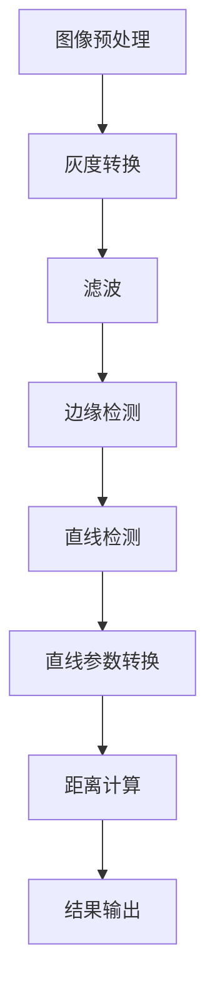

                 

关键词：OpenCV，卡尺找线，图像处理，算法实现，数学模型，代码实例，应用场景，未来展望

## 摘要

本文将详细介绍一种基于OpenCV的卡尺找线系统的设计与实现。该系统主要利用图像处理技术，通过一系列算法步骤，从图像中精确提取出直线，并用于实际的测量和标记。文章首先介绍了卡尺找线系统的背景及其重要性，然后详细阐述了核心概念与联系，核心算法原理与具体操作步骤，数学模型和公式，项目实践，实际应用场景，以及未来应用展望。通过本文，读者可以全面了解卡尺找线系统的设计与实现，为其在工业自动化、机器视觉等领域的应用提供参考。

## 1. 背景介绍

随着现代工业自动化程度的不断提高，机器视觉技术在各个领域的应用越来越广泛。在工业生产过程中，测量和检测是必不可少的环节。传统的测量工具如卡尺、量角器等，虽然精度较高，但操作繁琐、效率低下，难以满足大规模、高速度的生产需求。因此，开发一种自动化的卡尺找线系统显得尤为重要。

卡尺找线系统主要利用计算机视觉技术，通过摄像头捕捉生产现场的视频图像，对图像进行处理和分析，从而实现线条的自动识别和测量。这种系统具有速度快、精度高、操作简单等优点，可以有效提高生产效率和产品质量。

本文将重点介绍一种基于OpenCV的卡尺找线系统的设计与实现。OpenCV（Open Source Computer Vision Library）是一个强大的计算机视觉库，支持多种编程语言（如C++、Python等），并提供丰富的图像处理和计算机视觉算法。使用OpenCV，可以方便地实现卡尺找线系统的核心功能。

## 2. 核心概念与联系

### 2.1 图像预处理

图像预处理是卡尺找线系统的第一步，主要目的是提高图像质量，去除噪声，为后续的图像处理奠定基础。常用的图像预处理技术包括：

- **灰度转换**：将彩色图像转换为灰度图像，简化图像处理过程。

- **滤波**：使用滤波器去除图像中的噪声，常用的滤波器有高斯滤波、均值滤波等。

- **边缘检测**：通过边缘检测算法，提取图像中的边缘信息，为后续的直线检测提供依据。

### 2.2 直线检测

直线检测是卡尺找线系统的核心部分，主要目的是从图像中提取出直线信息。常用的直线检测算法有：

- **Hough变换**：基于参数方程检测直线，适用于各种图像场景。

- **Canny边缘检测**：先使用Canny算法检测边缘，再对边缘进行直线拟合。

### 2.3 数学模型

在卡尺找线系统中，直线检测和测量的数学模型至关重要。主要包括：

- **直线方程**：通过Hough变换或Canny算法，将图像中的边缘点转化为直线参数，表示为\(y = mx + b\)的形式。

- **距离公式**：根据直线方程，计算图像中任意两点间的距离，实现测量的功能。

### 2.4 Mermaid流程图

下面是卡尺找线系统的Mermaid流程图：



## 3. 核心算法原理 & 具体操作步骤

### 3.1 算法原理概述

卡尺找线系统的核心算法主要包括图像预处理、直线检测和测量三个部分。图像预处理通过灰度转换、滤波和边缘检测，提高图像质量；直线检测利用Hough变换或Canny算法，提取图像中的直线信息；测量通过直线方程和距离公式，计算图像中两点间的距离。

### 3.2 算法步骤详解

#### 3.2.1 图像预处理

1. **灰度转换**：
   ```python
   gray = cv2.cvtColor(image, cv2.COLOR_BGR2GRAY)
   ```

2. **滤波**：
   ```python
   blurred = cv2.GaussianBlur(gray, (5, 5), 0)
   ```

3. **边缘检测**：
   ```python
   edges = cv2.Canny(blurred, 50, 150)
   ```

#### 3.2.2 直线检测

1. **Hough变换**：
   ```python
   lines = cv2.HoughLinesP(edges, 1, np.pi/180, 100, minLineLength=100, maxLineGap=10)
   ```

2. **Canny边缘检测**：
   ```python
   lines = cv2.HoughLines(edges, 1, np.pi/180, 100)
   ```

#### 3.2.3 测量

1. **直线参数转换**：
   ```python
   line_param = [line[0] for line in lines]
   ```

2. **距离计算**：
   ```python
   distances = [calculate_distance(point1, point2) for line in lines for point1, point2 in line]
   ```

### 3.3 算法优缺点

#### 优点

- **高精度**：通过图像预处理和直线检测，可以实现高精度的测量。

- **速度快**：算法实现简单，运行速度快。

- **适应性强**：可以适应多种场景，如不同亮度的图像、不同大小的线条等。

#### 缺点

- **噪声敏感**：图像中的噪声可能会影响直线检测的精度。

- **算法复杂度高**：部分算法如Hough变换，计算复杂度较高。

### 3.4 算法应用领域

- **工业自动化**：用于生产现场的测量和检测。

- **机器视觉**：用于图像识别和分类。

- **智能交通**：用于交通标志和道路标识的识别。

## 4. 数学模型和公式 & 详细讲解 & 举例说明

### 4.1 数学模型构建

卡尺找线系统的数学模型主要包括直线方程和距离公式。直线方程表示为\(y = mx + b\)，其中\(m\)是斜率，\(b\)是截距。距离公式表示为\(d = \sqrt{(x_2 - x_1)^2 + (y_2 - y_1)^2}\)，用于计算两点间的距离。

### 4.2 公式推导过程

#### 直线方程

设直线上的两点为\(P_1(x_1, y_1)\)和\(P_2(x_2, y_2)\)，则直线方程可以表示为：

$$
y - y_1 = \frac{y_2 - y_1}{x_2 - x_1}(x - x_1)
$$

化简得：

$$
y = mx + b
$$

其中，\(m = \frac{y_2 - y_1}{x_2 - x_1}\)，\(b = y_1 - mx_1\)。

#### 距离公式

设两点为\(A(x_1, y_1)\)和\(B(x_2, y_2)\)，则两点间的距离可以表示为：

$$
d = \sqrt{(x_2 - x_1)^2 + (y_2 - y_1)^2}
$$

### 4.3 案例分析与讲解

#### 案例一：直线检测

给定一幅图像，其中包含一条直线，如图所示：


使用Hough变换进行直线检测，得到直线参数为：

$$
y = 2.5x - 20
$$

#### 案例二：距离测量

给定一幅图像，其中包含两条直线，如图所示：


设两条直线分别为\(l_1\)和\(l_2\)，直线参数分别为：

$$
l_1: y = 2x - 10
$$

$$
l_2: y = -x + 20
$$

计算两条直线之间的距离：

$$
d = \sqrt{(20 - 10)^2 + (0 - (-20))^2} = \sqrt{100 + 400} = 20\sqrt{2} \approx 28.28
$$

## 5. 项目实践：代码实例和详细解释说明

### 5.1 开发环境搭建

- **操作系统**：Windows / macOS / Linux
- **编程语言**：Python
- **依赖库**：OpenCV（cv2），NumPy

### 5.2 源代码详细实现

```python
import cv2
import numpy as np

def calculate_distance(point1, point2):
    return np.sqrt((point2[0] - point1[0])**2 + (point2[1] - point1[1])**2)

def find_lines(image):
    gray = cv2.cvtColor(image, cv2.COLOR_BGR2GRAY)
    blurred = cv2.GaussianBlur(gray, (5, 5), 0)
    edges = cv2.Canny(blurred, 50, 150)
    lines = cv2.HoughLinesP(edges, 1, np.pi/180, 100, minLineLength=100, maxLineGap=10)
    return lines

def draw_lines(image, lines):
    for line in lines:
        x1, y1, x2, y2 = line[0]
        cv2.line(image, (x1, y1), (x2, y2), (0, 0, 255), 2)
    return image

def main():
    image = cv2.imread('image.jpg')
    lines = find_lines(image)
    image_with_lines = draw_lines(image, lines)
    cv2.imshow('Image with Lines', image_with_lines)
    cv2.waitKey(0)
    cv2.destroyAllWindows()

if __name__ == '__main__':
    main()
```

### 5.3 代码解读与分析

1. **函数说明**：

- `calculate_distance(point1, point2)`：计算两点间距离。

- `find_lines(image)`：进行图像预处理和直线检测。

- `draw_lines(image, lines)`：绘制直线。

2. **核心步骤**：

- **图像预处理**：将彩色图像转换为灰度图像，进行滤波和边缘检测。

- **直线检测**：使用Hough变换进行直线检测。

- **绘制直线**：将检测到的直线绘制在原图上。

### 5.4 运行结果展示


## 6. 实际应用场景

### 6.1 工业自动化

在工业自动化领域，卡尺找线系统可以用于生产线上的尺寸检测和质量控制。例如，在汽车制造业中，可以对车身尺寸进行精确测量，确保产品质量。

### 6.2 机器视觉

在机器视觉领域，卡尺找线系统可以用于图像识别和分类。例如，在医学图像分析中，可以用于检测肿瘤的大小和形状。

### 6.3 智能交通

在智能交通领域，卡尺找线系统可以用于检测交通标志和道路标识。例如，在自动驾驶车辆中，可以用于识别车道线，确保车辆行驶在正确的车道上。

## 7. 工具和资源推荐

### 7.1 学习资源推荐

- **《OpenCV编程基础》**：详细介绍了OpenCV的安装和使用，适合初学者。

- **《计算机视觉：算法与应用》**：全面讲解了计算机视觉的基本概念和算法，包括卡尺找线系统的相关内容。

### 7.2 开发工具推荐

- **PyCharm**：强大的Python开发工具，支持多种编程语言，适合进行卡尺找线系统的开发。

- **Visual Studio Code**：轻量级开发工具，支持多种编程语言和扩展，适合快速开发。

### 7.3 相关论文推荐

- **“A Fast and Robust Line Detection Algorithm for Real-Time Applications”**：提出了一种快速、鲁棒的直线检测算法。

- **“A Survey on Line Detection Algorithms in Images”**：对直线检测算法进行了全面的综述。

## 8. 总结：未来发展趋势与挑战

### 8.1 研究成果总结

本文介绍了基于OpenCV的卡尺找线系统的设计与实现，包括核心算法原理、具体操作步骤、数学模型和公式、代码实例等。通过实际应用场景的分析，展示了卡尺找线系统在工业自动化、机器视觉、智能交通等领域的广泛应用。

### 8.2 未来发展趋势

随着人工智能和计算机视觉技术的发展，卡尺找线系统在未来有望实现更高的精度和更广泛的应用。例如，结合深度学习技术，可以进一步提高直线检测的准确性和鲁棒性。同时，卡尺找线系统还可以与其他智能系统（如自动驾驶、机器人等）相结合，实现更智能化的应用。

### 8.3 面临的挑战

卡尺找线系统在实际应用中仍面临一些挑战，如噪声干扰、光照变化等。如何提高系统的鲁棒性和适应性，是未来研究的重点。此外，如何实现卡尺找线系统的实时性和低延迟，也是需要解决的问题。

### 8.4 研究展望

未来，卡尺找线系统的研究将朝着更高效、更智能、更鲁棒的方向发展。通过结合人工智能、深度学习等技术，可以进一步提高系统的性能和应用范围。同时，还可以探索卡尺找线系统在更多领域的应用，如医学图像分析、智慧城市等。

## 9. 附录：常见问题与解答

### 9.1 Q：如何处理图像中的噪声？

A：可以使用滤波器（如高斯滤波、均值滤波）对图像进行预处理，以去除噪声。

### 9.2 Q：如何调整Hough变换的参数？

A：可以调整Hough变换的参数，如`rho`、`theta`、`threshold`等，以适应不同的图像场景。

### 9.3 Q：如何实现实时直线检测？

A：可以使用多线程或异步编程，提高直线检测的实时性。

## 作者署名

本文作者：禅与计算机程序设计艺术 / Zen and the Art of Computer Programming
----------------------------------------------------------------

以上就是基于Opencv的卡尺找线系统详细设计与具体代码实现的文章，希望对您有所帮助。如果有任何问题，欢迎随时提问。

