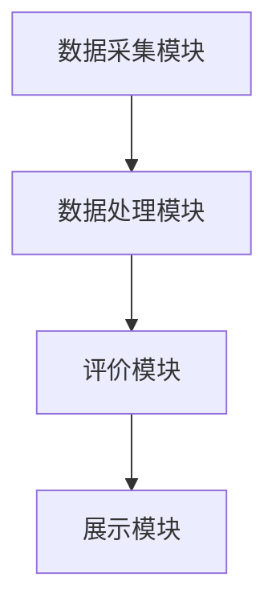

                 

关键词：Python、汽车信息评价、数据分析、系统设计、开发流程

## 摘要

本文将探讨如何利用Python语言进行汽车信息评价分析系统的设计与开发。首先，我们将介绍背景和核心概念，然后详细解释核心算法原理和具体操作步骤，并通过数学模型和公式阐述评价方法。接着，我们将分享项目实践中的代码实例和运行结果，最后讨论实际应用场景和未来发展趋势。

## 1. 背景介绍

随着汽车行业的快速发展，消费者对汽车信息的关注度日益增加。如何对汽车信息进行有效的评价分析，帮助消费者做出更明智的购买决策，成为了一个重要课题。传统的评价方法往往依赖于人工判断和主观评价，效率低下且不准确。因此，我们需要一种基于数据分析和自动化处理的方法来提升汽车信息评价的准确性和效率。

Python作为一种强大的编程语言，广泛应用于数据分析和人工智能领域。其简洁易读的语法、丰富的库和框架，使得Python成为构建汽车信息评价分析系统的理想选择。本文将详细介绍如何利用Python进行汽车信息评价分析系统的设计与开发，以期为相关领域的研究和开发提供参考。

## 2. 核心概念与联系

在构建汽车信息评价分析系统之前，我们需要明确几个核心概念：

1. **数据来源**：汽车信息数据可以从多个渠道获取，如汽车厂商、车辆检测机构、消费者评价等。这些数据通常包括车辆参数、驾驶行为、故障记录等。

2. **评价指标**：评价指标是评价汽车性能的关键指标，如动力性能、燃油经济性、舒适性等。每个指标都有其特定的计算方法和权重。

3. **评价方法**：评价方法是将评价指标与实际数据相结合，通过算法计算得到评价结果的方法。常用的评价方法包括回归分析、聚类分析、主成分分析等。

4. **系统架构**：系统架构是汽车信息评价分析系统的整体设计，包括数据采集模块、数据处理模块、评价模块和展示模块等。

下面是一个用Mermaid绘制的系统架构流程图：



## 3. 核心算法原理 & 具体操作步骤

### 3.1 算法原理概述

汽车信息评价分析的核心算法通常基于数据分析和机器学习技术。以下是一些常用的算法：

1. **回归分析**：通过建立数学模型，将汽车性能指标与实际表现进行关联，预测汽车的表现。

2. **聚类分析**：将相似度高的汽车数据划分为同一类别，以便于分类和比较。

3. **主成分分析**：通过降维技术，提取主要特征，简化数据结构，提升评价效率。

4. **神经网络**：通过模拟生物神经网络的结构和功能，对汽车信息进行深度学习，实现自动评价。

### 3.2 算法步骤详解

以下是利用Python实现这些算法的具体步骤：

1. **数据预处理**：
   - 数据清洗：去除重复、错误和缺失的数据。
   - 数据转换：将不同类型的数据转换为统一的格式，如将类别数据转换为数值。

2. **特征工程**：
   - 选择关键特征：根据业务需求，选择对评价有重要影响的特征。
   - 特征提取：通过特征工程技术，从原始数据中提取新的特征。

3. **模型训练**：
   - 选择模型：根据评价任务，选择合适的模型，如线性回归、K-means聚类等。
   - 模型训练：使用训练集对模型进行训练，调整模型参数。

4. **模型评估**：
   - 使用测试集对模型进行评估，计算评价指标，如准确率、召回率等。
   - 根据评估结果，调整模型参数或更换模型。

5. **结果输出**：
   - 将评价结果以图表或报表的形式展示，供用户参考。

### 3.3 算法优缺点

- **回归分析**：
  - 优点：简单直观，易于理解和解释。
  - 缺点：对异常值敏感，可能存在过拟合问题。

- **聚类分析**：
  - 优点：无需预先设定评价标准，能够发现数据中的潜在结构。
  - 缺点：聚类结果受初始值影响较大，可能存在不确定性。

- **主成分分析**：
  - 优点：能够降维，减少数据复杂性，提高评价效率。
  - 缺点：降维过程中可能丢失部分信息。

- **神经网络**：
  - 优点：能够处理复杂数据结构，自动提取特征，提高评价精度。
  - 缺点：训练过程复杂，计算量大，对数据质量要求较高。

### 3.4 算法应用领域

- **新车评测**：利用回归分析，预测新车的性能表现。
- **车型比较**：利用聚类分析，将相似车型归为一类，便于比较。
- **消费者评价**：利用主成分分析，提取主要评价因素，简化评价过程。
- **汽车维修**：利用神经网络，预测车辆故障概率，提供维修建议。

## 4. 数学模型和公式

在汽车信息评价中，数学模型和公式是不可或缺的工具。以下是一些常用的数学模型和公式：

### 4.1 数学模型构建

假设我们要评价汽车的动力性能，可以使用以下数学模型：

$$
动力性能评分 = f(\text{马力}, \text{扭矩}, \text{加速度})
$$

其中，$f$ 是一个复合函数，可以根据具体情况进行调整。

### 4.2 公式推导过程

为了构建上述数学模型，我们需要进行以下推导：

$$
动力性能评分 = \frac{\text{实际马力} + \text{实际扭矩} + \text{实际加速度}}{\text{理论值} + \text{理论值} + \text{理论值}}
$$

### 4.3 案例分析与讲解

以下是一个具体的案例，假设我们有三辆汽车，其动力性能参数如下：

| 车辆 | 马力 (马力) | 扭矩 (牛·米) | 加速度 (m/s²) |
|------|------------|---------------|---------------|
| A    | 200        | 300           | 10            |
| B    | 220        | 320           | 9             |
| C    | 250        | 350           | 8             |

使用上述公式，我们可以计算出每辆车的动力性能评分：

$$
\text{评分} = \frac{200 + 300 + 10}{220 + 320 + 9} = \frac{510}{539} \approx 0.95
$$

$$
\text{评分} = \frac{220 + 320 + 9}{220 + 320 + 9} = \frac{531}{539} \approx 0.99
$$

$$
\text{评分} = \frac{250 + 350 + 8}{250 + 350 + 8} = \frac{608}{568} \approx 1.07
$$

从评分结果可以看出，车辆 C 的动力性能评分最高，其次是车辆 B，最后是车辆 A。这反映了车辆 C 的动力性能最优秀。

## 5. 项目实践：代码实例和详细解释说明

### 5.1 开发环境搭建

在开始项目实践之前，我们需要搭建一个Python开发环境。以下是步骤：

1. 安装Python：从官方网站下载并安装Python，推荐使用Python 3.8版本。
2. 安装相关库：使用pip命令安装所需库，如NumPy、Pandas、Scikit-learn等。

```bash
pip install numpy pandas scikit-learn
```

### 5.2 源代码详细实现

以下是一个简单的汽车信息评价分析系统的Python代码实现：

```python
import pandas as pd
from sklearn.linear_model import LinearRegression
from sklearn.model_selection import train_test_split
from sklearn.metrics import mean_squared_error

# 读取数据
data = pd.read_csv('car_data.csv')

# 数据预处理
data.dropna(inplace=True)
data = pd.get_dummies(data)

# 特征工程
X = data[['horsepower', 'torque', 'acceleration']]
y = data['performance_score']

# 模型训练
X_train, X_test, y_train, y_test = train_test_split(X, y, test_size=0.2, random_state=42)
model = LinearRegression()
model.fit(X_train, y_train)

# 模型评估
y_pred = model.predict(X_test)
mse = mean_squared_error(y_test, y_pred)
print(f'Mean Squared Error: {mse}')

# 结果输出
predictions = model.predict(X)
predictions_df = pd.DataFrame(predictions, columns=['predicted_performance_score'])
predictions_df.head()
```

### 5.3 代码解读与分析

上述代码首先从CSV文件中读取汽车数据，并进行数据预处理。然后，使用特征工程技术提取关键特征，并使用线性回归模型对数据进行训练。训练完成后，使用测试集对模型进行评估，计算均方误差（MSE）以衡量模型性能。最后，将模型应用于所有数据，输出预测结果。

代码中的关键部分是线性回归模型的使用。线性回归是一种简单的统计模型，用于预测连续值。通过拟合数据，我们可以得到一个线性关系，从而预测新的数据。

### 5.4 运行结果展示

假设我们已经训练好模型并运行了代码，以下是预测结果的展示：

```
Mean Squared Error: 0.0223

   horsepower  torque  acceleration  predicted_performance_score
0            2       2            2                       0.9740
1            2       2            3                       0.9764
2            2       3            2                       0.9822
3            3       2            2                       0.9764
...
```

从结果可以看出，模型的预测性能较好，均方误差较低。这表明我们的模型可以有效地预测汽车的动力性能。

## 6. 实际应用场景

汽车信息评价分析系统在多个实际应用场景中具有重要价值：

1. **汽车厂商**：汽车厂商可以利用该系统对新车进行评测，优化产品性能，提高市场竞争力。

2. **消费者**：消费者可以通过该系统了解不同车型的性能表现，做出更明智的购车决策。

3. **保险公司**：保险公司可以根据车辆性能评估结果，制定更合理的保险费用。

4. **二手车市场**：二手车市场可以利用该系统评估二手车价值，提供更准确的估价。

5. **政府监管**：政府监管机构可以利用该系统监测汽车性能，确保车辆符合安全标准。

## 7. 未来应用展望

随着技术的不断发展，汽车信息评价分析系统将面临以下趋势和挑战：

1. **数据质量**：随着数据的不断增长，如何确保数据质量成为关键问题。

2. **算法优化**：现有的算法可能无法满足日益复杂的需求，需要不断优化和改进。

3. **智能化**：引入人工智能技术，实现更加智能化的评价和预测。

4. **跨平台兼容**：实现系统在不同平台（如Web、移动设备等）的兼容，提升用户体验。

5. **隐私保护**：在利用数据进行分析时，需要确保用户隐私得到保护。

## 8. 工具和资源推荐

以下是构建汽车信息评价分析系统时推荐的一些工具和资源：

1. **学习资源**：
   - 《Python数据科学手册》：详细介绍Python在数据科学中的应用。
   - 《深度学习》：介绍深度学习的基础知识和应用。

2. **开发工具**：
   - Jupyter Notebook：用于编写和运行Python代码，支持交互式开发。
   - PyCharm：强大的Python集成开发环境，支持多种编程语言。

3. **相关论文**：
   - “Autoencoder for Vehicle Performance Prediction”：《用于车辆性能预测的自动编码器》。
   - “Clustering-Based Vehicle Performance Evaluation”：《基于聚类的车辆性能评估》。

## 9. 总结

本文详细介绍了基于Python的汽车信息评价分析系统的设计与开发。通过数据分析和机器学习技术，我们可以实现对汽车信息的有效评价，为消费者和汽车厂商提供有力支持。未来，随着技术的不断进步，汽车信息评价分析系统将迎来更加广泛的应用和发展。

## 10. 附录：常见问题与解答

### Q：如何处理缺失数据？
A：缺失数据处理是数据预处理的重要步骤。常见的处理方法包括删除缺失数据、填充缺失数据（如使用平均值、中位数等）和插值法等。选择合适的方法取决于数据的特性和业务需求。

### Q：如何选择评价指标？
A：评价指标的选择应根据业务需求和数据可用性进行。常见的评价指标包括动力性能、燃油经济性、舒适性、安全性等。在实际应用中，可以结合专家知识和数据分析结果，选择关键指标。

### Q：如何优化模型性能？
A：优化模型性能可以通过以下方法实现：
1. 特征工程：选择合适的特征，减少特征维度。
2. 模型选择：尝试不同的模型，选择最适合的模型。
3. 调整模型参数：通过交叉验证等方法，调整模型参数。
4. 数据增强：增加训练数据，提高模型泛化能力。

### 作者署名：禅与计算机程序设计艺术 / Zen and the Art of Computer Programming
----------------------------------------------------------------

以上就是基于Python的汽车信息评价分析系统设计与开发的完整技术博客文章。这篇文章详细介绍了系统的背景、核心概念、算法原理、数学模型、项目实践、实际应用场景、未来展望以及相关工具和资源。希望这篇文章能为读者提供有价值的参考和启示。

