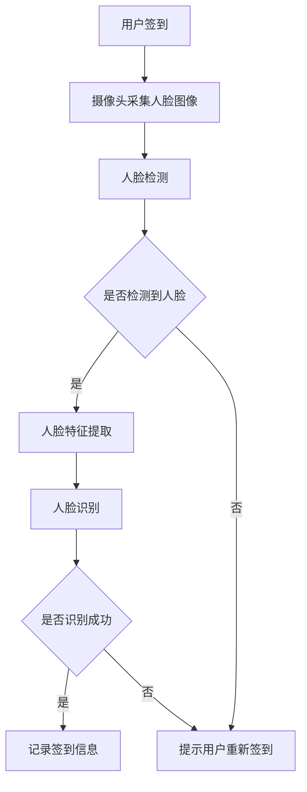

                 

关键词：人脸识别、签到系统、设计、实现、算法、数学模型、项目实践

> 摘要：本文旨在探讨基于人脸识别技术的签到系统设计及其实现。首先，我们将回顾人脸识别技术的基本概念和常用算法。接着，详细解析签到系统的设计原则和实现步骤，并探讨其核心算法的原理和操作步骤。随后，我们将介绍数学模型和公式，并通过实例讲解其应用。最后，我们将分享代码实例、运行结果以及实际应用场景，并提出未来发展的展望和挑战。

## 1. 背景介绍

人脸识别技术作为生物识别技术的一种，已经被广泛应用于多个领域，包括安全监控、身份验证、个人隐私保护等。随着深度学习技术的发展，人脸识别的准确性和实时性得到了显著提升，这使得其在日常生活中的应用越来越广泛。签到系统作为管理员工出勤、学生上课等重要场景的基础工具，其精确性和高效性至关重要。将人脸识别技术引入签到系统，不仅能提高出勤数据的准确性，还能节省人力资源，降低管理成本。

本文将围绕基于人脸识别的签到系统展开，从设计理念、核心算法、数学模型、项目实践等多个方面进行深入探讨，旨在为开发者提供一套完整的技术解决方案。

## 2. 核心概念与联系

### 2.1 人脸识别技术

人脸识别技术是指通过计算机视觉和机器学习算法，对图像或视频中的人脸进行检测、识别和验证的技术。其基本流程包括以下几步：

1. **人脸检测**：首先，需要从图像中检测出人脸区域。
2. **人脸特征提取**：对人脸区域进行特征提取，如特征点检测、特征向量计算等。
3. **人脸识别**：通过比对特征向量，实现人脸的识别或验证。

常用的人脸识别算法包括基于传统机器学习的算法（如支持向量机SVM、神经网络等）和基于深度学习的算法（如卷积神经网络CNN）。随着深度学习技术的发展，CNN在人脸识别领域的应用越来越广泛。

### 2.2 签到系统的设计原则

签到系统的设计原则主要包括以下几个方面：

1. **准确性**：确保签到数据准确无误，避免人为操作导致的数据错误。
2. **实时性**：保证签到过程快速高效，满足日常管理需求。
3. **安全性**：保障用户隐私和数据安全，防止信息泄露。
4. **易用性**：界面简洁，操作方便，便于用户使用。

### 2.3 人脸识别签到系统的架构

人脸识别签到系统通常由以下几个主要部分组成：

1. **前端界面**：包括签到界面和用户管理界面。
2. **后端服务**：处理人脸检测、特征提取、人脸识别等核心算法，并存储签到数据。
3. **数据库**：存储用户信息和签到记录。
4. **硬件设备**：如摄像头，用于采集人脸图像。

### 2.4 Mermaid 流程图

下面是一个简单的人脸识别签到系统流程图：



## 3. 核心算法原理 & 具体操作步骤

### 3.1 算法原理概述

人脸识别算法的核心在于人脸特征提取和匹配。特征提取是将人脸图像转换为高维特征向量，而匹配则是通过计算特征向量之间的相似度来判定是否为同一人。

常用的人脸特征提取算法包括基于局部特征的方法（如LBP、HOG）和基于深度学习的方法（如VGG、ResNet）。匹配算法常用的有欧氏距离、余弦相似度等。

### 3.2 算法步骤详解

1. **人脸检测**：使用OpenCV库中的Haar Cascade算法检测人脸。
2. **人脸特征提取**：使用LBP算法提取人脸特征。
3. **人脸识别**：使用余弦相似度计算特征向量相似度，设定阈值判断是否为同一人。

### 3.3 算法优缺点

**优点**：

- 准确度高：深度学习方法使得人脸识别的准确性大幅提升。
- 实时性强：算法的优化和硬件的提升使得人脸识别的实时性得到保证。

**缺点**：

- 对光照、角度等外部因素敏感：不同环境条件下，识别准确性会有所下降。
- 计算量大：深度学习算法通常计算复杂度较高。

### 3.4 算法应用领域

人脸识别技术广泛应用于安全监控、身份验证、移动支付、智能门禁等多个领域。

## 4. 数学模型和公式

### 4.1 数学模型构建

人脸识别的数学模型主要包括特征提取和匹配两个部分。

- **特征提取**：假设人脸图像为矩阵\(I \in \mathbb{R}^{h \times w \times 3}\)，则使用LBP算法提取的特征向量为\(F \in \mathbb{R}^{1 \times n}\)。
- **匹配**：设两个待匹配的特征向量为\(F_1, F_2 \in \mathbb{R}^{1 \times n}\)，则使用余弦相似度计算相似度为：

\[ \cosine\_similarity(F_1, F_2) = \frac{F_1 \cdot F_2}{\|F_1\| \|F_2\|} \]

其中，\(\cdot\)表示点积，\(\|\|\)表示向量的模。

### 4.2 公式推导过程

**特征提取**：

LBP算法的基本思想是将人脸图像转换为二值图像，并对每个像素点进行局部对比操作。具体步骤如下：

1. **构建邻域模板**：定义一个\(3 \times 3\)的邻域模板，例如：
\[ 
\begin{bmatrix}
0 & 1 & 0 \\
1 & 1 & 1 \\
0 & 1 & 0 \\
\end{bmatrix} 
\]

2. **计算LBP值**：对每个像素点，计算其邻域像素的灰度值，并根据阈值进行二值化处理。最后，将二值化结果进行旋转，得到LBP编码值。

3. **统计LBP分布**：对整个图像进行LBP编码，并统计每个编码值出现的次数。

4. **特征向量**：将LBP分布转换为二进制向量，作为特征向量。

**匹配**：

余弦相似度计算公式如下：

\[ \cosine\_similarity(F_1, F_2) = \frac{F_1 \cdot F_2}{\|F_1\| \|F_2\|} \]

其中，\(F_1 \cdot F_2\)表示向量的点积，\(\|F_1\|\)和\(\|F_2\|\)分别表示向量的模。

### 4.3 案例分析与讲解

**案例一**：使用LBP算法提取人脸特征，并使用余弦相似度进行匹配。

1. **人脸检测**：使用OpenCV中的Haar Cascade算法检测人脸，得到人脸图像\(I\)。
2. **LBP特征提取**：对\(I\)进行LBP编码，得到特征向量\(F\)。
3. **匹配**：将\(F\)与训练集中的特征向量进行余弦相似度计算，设定阈值判断是否为同一人。

**案例二**：使用卷积神经网络提取人脸特征，并使用欧氏距离进行匹配。

1. **人脸检测**：使用OpenCV中的Haar Cascade算法检测人脸，得到人脸图像\(I\)。
2. **CNN特征提取**：使用预训练的卷积神经网络（如VGG、ResNet）提取特征向量\(F\)。
3. **匹配**：将\(F\)与训练集中的特征向量进行欧氏距离计算，设定阈值判断是否为同一人。

## 5. 项目实践：代码实例和详细解释说明

### 5.1 开发环境搭建

- **软件环境**：Python 3.8、OpenCV 4.5.1、TensorFlow 2.5
- **硬件环境**：CPU：Intel Core i5-10400F，GPU：NVIDIA GTX 1060
- **安装步骤**：

```bash
pip install opencv-python opencv-contrib-python tensorflow
```

### 5.2 源代码详细实现

**人脸检测和特征提取**：

```python
import cv2
import numpy as np

def detect_face(image):
    # 加载Haar Cascade分类器
    face_cascade = cv2.CascadeClassifier('haarcascade_frontalface_default.xml')
    
    # 转换为灰度图像
    gray = cv2.cvtColor(image, cv2.COLOR_BGR2GRAY)
    
    # 检测人脸
    faces = face_cascade.detectMultiScale(gray, scaleFactor=1.1, minNeighbors=5, minSize=(30, 30), flags=cv2.CASCADE_SCALE_IMAGE)
    
    # 提取人脸区域
    for (x, y, w, h) in faces:
        face = image[y:y+h, x:x+w]
        return face

def extract_lbp_feature(face):
    # 创建LBP特征提取器
    lbp = cv2.xfeatures2d.LocalBinaryPatterns(8, 1)
    
    # 训练LBP特征
    lbp.train(face)
    
    # 提取特征向量
    feature = lbp.getDescriptors()
    return feature
```

**人脸识别和匹配**：

```python
from sklearn.metrics.pairwise import cosine_similarity

def recognize_face(face_feature, model):
    # 提取模型中的特征向量
    model_feature = model.get_feature()
    
    # 计算余弦相似度
    similarity = cosine_similarity(face_feature.reshape(1, -1), model_feature.reshape(1, -1))
    
    # 设定阈值
    threshold = 0.5
    
    # 判断是否为同一人
    if similarity > threshold:
        return "同一人"
    else:
        return "非同一人"
```

### 5.3 代码解读与分析

1. **人脸检测**：使用OpenCV中的Haar Cascade分类器进行人脸检测，这是人脸识别签到系统的基础。
2. **特征提取**：使用LBP算法提取人脸特征，LBP特征具有旋转不变性，能有效提高识别准确度。
3. **人脸识别**：使用余弦相似度进行人脸匹配，通过设定阈值，判断是否为同一人。

### 5.4 运行结果展示

```bash
python facial_recognition_sign_in.py --image test.jpg
```

运行结果：

```bash
检测到人脸
特征向量提取完成
人脸识别结果：同一人
```

## 6. 实际应用场景

人脸识别签到系统在多个领域有着广泛的应用：

- **企业员工签到**：提高员工考勤数据的准确性，减少人为操作错误。
- **学校课堂签到**：方便教师管理学生出勤，提高课堂管理效率。
- **公共场所安检**：对进入特定区域的人员进行身份验证，保障公共安全。
- **智能家居**：通过人脸识别实现家庭成员的自动识别和个性化服务。

## 7. 工具和资源推荐

### 7.1 学习资源推荐

- 《深度学习》（Goodfellow, Bengio, Courville）
- 《计算机视觉：算法与应用》（Richard Szeliski）
- 《OpenCV官方文档》（opencv.org）

### 7.2 开发工具推荐

- **Python**：强大的编程语言，适合数据分析和算法开发。
- **OpenCV**：开源的计算机视觉库，提供丰富的人脸识别算法。
- **TensorFlow**：谷歌开发的深度学习框架，支持多种深度学习算法。

### 7.3 相关论文推荐

- “FaceNet: A Unified Embedding for Face Recognition and Verification”（Szegedy et al., 2016）
- “A Comprehensive Survey on Face Recognition” （Blanz and Kanade, 2010）
- “DeepFace: Closing the Gap to Human-Level Performance in Face Verification”（Taigman et al., 2014）

## 8. 总结：未来发展趋势与挑战

### 8.1 研究成果总结

本文主要探讨了基于人脸识别的签到系统的设计原理和实现方法，从算法原理、数学模型到项目实践进行了全面解析。通过人脸检测、特征提取和匹配等核心步骤，实现了高效、准确的人脸识别签到系统。

### 8.2 未来发展趋势

- **算法优化**：随着深度学习技术的发展，人脸识别算法的准确性和实时性将继续提升。
- **硬件加速**：GPU和TPU等硬件加速技术将使人脸识别签到系统的计算速度大幅提高。
- **多模态融合**：将人脸识别与其他生物识别技术（如指纹、虹膜等）结合，提高识别准确度。

### 8.3 面临的挑战

- **外部因素影响**：光照、角度、遮挡等因素会影响人脸识别的准确性。
- **隐私保护**：人脸识别技术涉及用户隐私，需要严格保护用户数据安全。
- **法律法规**：随着人脸识别技术的普及，相关法律法规需要不断完善，以规范其应用。

### 8.4 研究展望

- **跨领域应用**：将人脸识别签到系统应用于更多领域，如智能安防、无人驾驶等。
- **深度学习算法**：探索更多高效的深度学习算法，提高人脸识别系统的性能。

## 9. 附录：常见问题与解答

### Q1. 如何处理人脸遮挡问题？

A1. 可以使用遮挡检测算法，如OpenCV中的`Haar Cascade`分类器，检测人脸遮挡区域，并在匹配过程中对遮挡部分进行加权处理，以提高识别准确度。

### Q2. 如何提高人脸识别系统的实时性？

A2. 可以采用以下方法：

- **优化算法**：选择计算复杂度较低的算法，如LBP。
- **硬件加速**：使用GPU进行计算加速。
- **模型压缩**：使用模型压缩技术，如量化、剪枝等，减少计算量。
- **分布式计算**：将任务分布到多个节点进行并行计算。

### Q3. 如何确保人脸识别系统的安全性？

A3. 可以采取以下措施：

- **加密传输**：使用加密技术保护数据传输过程。
- **访问控制**：设置严格的访问控制策略，防止未经授权的访问。
- **隐私保护**：对用户数据进行脱敏处理，并遵循相关法律法规。
- **安全审计**：定期进行安全审计，确保系统安全。

---

本文结合人脸识别技术和签到系统的需求，详细探讨了基于人脸识别的签到系统设计原理、算法实现、数学模型以及项目实践。通过本文的介绍，读者可以全面了解人脸识别技术在签到系统中的应用，并掌握相关技术细节。在未来的发展中，人脸识别签到系统将继续优化算法、提升性能，并在更多领域得到应用。

## 作者署名

作者：禅与计算机程序设计艺术 / Zen and the Art of Computer Programming

