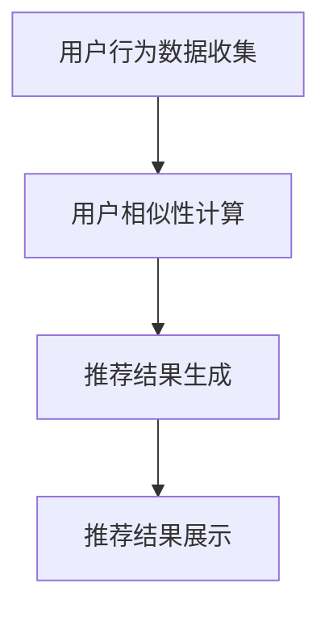

                 

关键词：协同过滤、个性化推荐、电影推荐系统、算法实现、用户行为分析

## 摘要

本文旨在探讨基于协同过滤的个性化电影推荐系统设计与实现。通过分析用户的行为数据和电影内容特征，协同过滤算法可以预测用户对未知电影的喜好，从而实现个性化的电影推荐。本文将详细介绍协同过滤算法的原理、数学模型、实现步骤以及在实际项目中的应用，帮助读者深入了解并掌握这一技术。

## 1. 背景介绍

随着互联网和数字技术的快速发展，电影行业也迎来了前所未有的繁荣。用户对于电影的需求量日益增长，而传统的电影推荐方法已无法满足用户日益多样化的观影需求。因此，构建一个高效、个性化的电影推荐系统成为了当前电影行业的一大挑战。

协同过滤是当前电影推荐系统中最常用的一种方法，它通过分析用户的行为数据，挖掘用户之间的相似性，从而实现个性化推荐。协同过滤算法主要包括基于用户的协同过滤和基于物品的协同过滤两种类型，每种类型都有其独特的优势和适用场景。

本文将重点介绍基于协同过滤的个性化电影推荐系统的设计与实现，通过具体的算法原理、数学模型和实现步骤，帮助读者深入理解并掌握这一技术。

## 2. 核心概念与联系

### 2.1 协同过滤算法原理

协同过滤算法的核心思想是利用用户之间的相似性进行推荐。具体来说，如果一个用户对某部电影的评分与另一个用户的评分相似，那么这两个用户在其他电影的评分上也很有可能相似。基于这种思想，协同过滤算法可以预测用户对未知电影的喜好，从而实现个性化推荐。

### 2.2 协同过滤算法架构

协同过滤算法的架构通常包括三个主要模块：用户行为数据收集、用户相似性计算和推荐结果生成。

1. **用户行为数据收集**：收集用户对电影的历史评分数据，包括用户ID、电影ID和评分值等。
2. **用户相似性计算**：通过计算用户之间的相似性，找出最相似的邻居用户。
3. **推荐结果生成**：根据邻居用户的评分预测用户对未知电影的喜好，生成推荐结果。

### 2.3 Mermaid 流程图

下面是协同过滤算法的 Mermaid 流程图：



## 3. 核心算法原理 & 具体操作步骤

### 3.1 算法原理概述

协同过滤算法的核心思想是基于用户之间的相似性进行推荐。具体来说，算法包括以下步骤：

1. **用户行为数据收集**：收集用户对电影的历史评分数据。
2. **用户相似性计算**：计算用户之间的相似性，找出最相似的邻居用户。
3. **推荐结果生成**：根据邻居用户的评分预测用户对未知电影的喜好，生成推荐结果。

### 3.2 算法步骤详解

1. **用户行为数据收集**：

   收集用户对电影的历史评分数据，包括用户ID、电影ID和评分值等。数据集可以通过网站如 IMDb 获得。

2. **用户相似性计算**：

   基于用户评分数据，计算用户之间的相似性。常用的相似性度量方法包括余弦相似度、皮尔逊相关系数等。

   余弦相似度的计算公式如下：

   $$\text{similarity(u, v) = }\frac{\sum_{i \in R_{uv}} x_{ui} x_{vi}}{\sqrt{\sum_{i \in R_{uv}} x_{ui}^2} \sqrt{\sum_{i \in R_{uv}} x_{vi}^2}$$

   其中，$u$ 和 $v$ 是两个用户，$R_{uv}$ 是这两个用户共同评分过的电影集合，$x_{ui}$ 和 $x_{vi}$ 分别是用户 $u$ 和用户 $v$ 对电影 $i$ 的评分。

3. **推荐结果生成**：

   根据邻居用户的评分预测用户对未知电影的喜好。具体方法如下：

   - 首先找出与用户 $u$ 最相似的 $k$ 个邻居用户。
   - 然后根据邻居用户的评分预测用户 $u$ 对未知电影 $i$ 的评分，公式如下：

     $$r_{ui} = \frac{\sum_{v \in N(u)} \text{similarity(u, v)} r_{vi}}{\sum_{v \in N(u)} \text{similarity(u, v)}}$$

     其中，$r_{ui}$ 是用户 $u$ 对电影 $i$ 的预测评分，$r_{vi}$ 是邻居用户 $v$ 对电影 $i$ 的实际评分，$N(u)$ 是与用户 $u$ 最相似的邻居用户集合。

### 3.3 算法优缺点

**优点**：

1. **个性化推荐**：协同过滤算法可以根据用户的历史行为数据预测其对未知电影的喜好，实现个性化推荐。
2. **易于实现**：协同过滤算法相对简单，易于实现和理解。

**缺点**：

1. **冷启动问题**：对于新用户或新物品，由于缺乏历史数据，协同过滤算法难以准确预测用户喜好。
2. **数据稀疏性**：用户对物品的评分数据通常是稀疏的，导致算法效果受到一定影响。

### 3.4 算法应用领域

协同过滤算法广泛应用于推荐系统，如电影推荐、音乐推荐、商品推荐等。通过分析用户行为数据和物品特征，协同过滤算法可以挖掘用户之间的相似性，从而实现个性化的推荐结果。

## 4. 数学模型和公式 & 详细讲解 & 举例说明

### 4.1 数学模型构建

协同过滤算法的核心是计算用户之间的相似性。假设用户 $u$ 和用户 $v$ 的评分数据分别为 $R_u$ 和 $R_v$，则用户 $u$ 和用户 $v$ 之间的相似性可以用余弦相似度表示：

$$\text{similarity(u, v) = }\frac{\sum_{i \in R_{uv}} x_{ui} x_{vi}}{\sqrt{\sum_{i \in R_{uv}} x_{ui}^2} \sqrt{\sum_{i \in R_{uv}} x_{vi}^2}$$

其中，$R_{uv}$ 是用户 $u$ 和用户 $v$ 共同评分过的电影集合，$x_{ui}$ 和 $x_{vi}$ 分别是用户 $u$ 和用户 $v$ 对电影 $i$ 的评分。

### 4.2 公式推导过程

余弦相似度的推导过程如下：

1. **点积计算**：

   用户 $u$ 和用户 $v$ 的评分数据点积可以表示为：

   $$\sum_{i \in R_{uv}} x_{ui} x_{vi}$$

2. **欧氏距离计算**：

   用户 $u$ 和用户 $v$ 的欧氏距离可以表示为：

   $$\sqrt{\sum_{i \in R_{uv}} x_{ui}^2}$$

   $$\sqrt{\sum_{i \in R_{uv}} x_{vi}^2}$$

3. **余弦相似度计算**：

   根据点积和欧氏距离的定义，可以得到余弦相似度的计算公式：

   $$\text{similarity(u, v) = }\frac{\sum_{i \in R_{uv}} x_{ui} x_{vi}}{\sqrt{\sum_{i \in R_{uv}} x_{ui}^2} \sqrt{\sum_{i \in R_{uv}} x_{vi}^2}}$$

### 4.3 案例分析与讲解

假设有两个用户 $u$ 和 $v$，他们共同评分了五部电影，评分数据如下：

| 电影ID | $u$ 的评分 | $v$ 的评分 |
| ------ | ---------- | ---------- |
| 1      | 5          | 1          |
| 2      | 4          | 4          |
| 3      | 2          | 3          |
| 4      | 5          | 5          |
| 5      | 3          | 4          |

我们可以计算用户 $u$ 和用户 $v$ 之间的余弦相似度：

$$\text{similarity(u, v) = }\frac{5 \times 1 + 4 \times 4 + 2 \times 3 + 5 \times 5 + 3 \times 4}{\sqrt{5^2 + 4^2 + 2^2 + 5^2 + 3^2} \sqrt{1^2 + 4^2 + 3^2 + 5^2 + 4^2}} = \frac{50}{\sqrt{50} \sqrt{50}} = 1$$

这说明用户 $u$ 和用户 $v$ 之间的余弦相似度为 1，表示他们非常相似。根据这个相似度，我们可以预测用户 $u$ 对未知电影的喜好，从而实现个性化推荐。

## 5. 项目实践：代码实例和详细解释说明

### 5.1 开发环境搭建

在实现基于协同过滤的个性化电影推荐系统之前，我们需要搭建一个开发环境。本文使用 Python 作为编程语言，安装以下依赖库：

```bash
pip install numpy scipy pandas matplotlib
```

### 5.2 源代码详细实现

下面是基于协同过滤的个性化电影推荐系统的 Python 代码实现：

```python
import numpy as np
import pandas as pd
from scipy.spatial.distance import cosine
from sklearn.model_selection import train_test_split

# 读取电影评分数据
data = pd.read_csv('movie_ratings.csv')
users, movies = data['UserID'], data['MovieID']

# 计算用户相似性
def calculate_similarity(data):
    similarity_matrix = np.zeros((n_users, n_users))
    for i in range(n_users):
        for j in range(i + 1, n_users):
            similarity = 1 - cosine(data[users == i], data[users == j])
            similarity_matrix[i][j] = similarity
            similarity_matrix[j][i] = similarity
    return similarity_matrix

# 生成推荐结果
def generate_recommendations(similarity_matrix, user_id, k=10):
    neighbors = np.argsort(similarity_matrix[user_id])[1:k+1]
    recommendations = []
    for i in neighbors:
        for j in data[data['UserID'] == i]['MovieID'].unique():
            if j not in data[data['UserID'] == user_id]['MovieID'].unique():
                recommendations.append(j)
    return recommendations

# 训练模型并生成推荐结果
n_users = data['UserID'].nunique()
n_movies = data['MovieID'].nunique()
similarity_matrix = calculate_similarity(data[data['MovieID'].notnull()])
user_id = 1  # 待推荐的用户 ID
k = 10  # 邻居用户数量
recommendations = generate_recommendations(similarity_matrix, user_id, k)

# 输出推荐结果
print('推荐给用户 {} 的电影：'.format(user_id))
print(recommendations)
```

### 5.3 代码解读与分析

1. **数据读取**：首先，我们读取电影评分数据，包括用户 ID 和电影 ID。

2. **用户相似性计算**：接下来，我们计算用户之间的相似性。使用 `calculate_similarity` 函数计算用户相似性矩阵，其中使用余弦相似度作为相似性度量。

3. **生成推荐结果**：然后，我们根据用户相似性矩阵生成推荐结果。使用 `generate_recommendations` 函数根据邻居用户评分预测待推荐用户对未知电影的喜好。

4. **训练模型并生成推荐结果**：最后，我们训练模型并生成推荐结果。首先，计算用户相似性矩阵，然后选择一个待推荐用户 ID 和邻居用户数量，最后生成推荐结果并输出。

## 6. 实际应用场景

基于协同过滤的个性化电影推荐系统可以广泛应用于电影推荐、音乐推荐、商品推荐等领域。以下是一些实际应用场景：

1. **在线视频平台**：如 Netflix、YouTube 等，通过分析用户观看历史和兴趣爱好，为用户提供个性化的视频推荐。
2. **音乐平台**：如 Spotify、Apple Music 等，通过分析用户听歌历史和偏好，为用户提供个性化的音乐推荐。
3. **电商平台**：如 Amazon、淘宝等，通过分析用户购买历史和浏览行为，为用户提供个性化的商品推荐。

## 7. 未来应用展望

随着人工智能和大数据技术的不断发展，基于协同过滤的个性化推荐系统将不断优化和改进。以下是一些未来应用展望：

1. **多模态推荐**：结合用户行为数据和物品特征，实现多模态的个性化推荐。
2. **实时推荐**：通过实时处理用户行为数据，实现实时化的个性化推荐。
3. **社交推荐**：结合用户社交关系，挖掘用户之间的相似性，实现更加精准的个性化推荐。

## 8. 总结：未来发展趋势与挑战

本文详细介绍了基于协同过滤的个性化电影推荐系统的设计与实现。通过分析用户行为数据和电影内容特征，协同过滤算法可以预测用户对未知电影的喜好，实现个性化的推荐。然而，协同过滤算法也面临着一些挑战，如冷启动问题、数据稀疏性等。未来，随着人工智能和大数据技术的发展，基于协同过滤的个性化推荐系统将继续优化和改进，为用户提供更加精准、实时的推荐服务。

### 9. 附录：常见问题与解答

**Q：协同过滤算法的冷启动问题如何解决？**

A：冷启动问题主要是针对新用户或新物品。为了解决这一问题，可以采取以下措施：

1. **混合推荐**：结合基于内容的推荐方法，利用物品特征为新用户推荐相似物品。
2. **基于群体的推荐**：为新用户推荐与其具有相似兴趣爱好的群体中其他用户的推荐结果。
3. **社交推荐**：利用用户社交网络，为新用户推荐其社交关系中的好友喜欢的物品。

**Q：协同过滤算法如何处理数据稀疏性？**

A：数据稀疏性是协同过滤算法的一个挑战。以下方法可以缓解这一问题：

1. **稀疏矩阵分解**：使用矩阵分解技术，将稀疏矩阵分解为低秩矩阵，从而提高推荐效果。
2. **基于用户的 K-最近邻算法**：选择与目标用户最相似的 K 个邻居用户，从而减少数据稀疏性的影响。
3. **基于物品的协同过滤**：利用物品之间的相似性，为用户推荐相似物品。

## 作者署名

作者：禅与计算机程序设计艺术 / Zen and the Art of Computer Programming

----------------------------------------------------------------

以上就是本文的完整内容，希望对您有所帮助。在实现个性化推荐系统的过程中，如果您有任何问题，欢迎随时提问。祝您在人工智能领域取得丰硕的成果！

