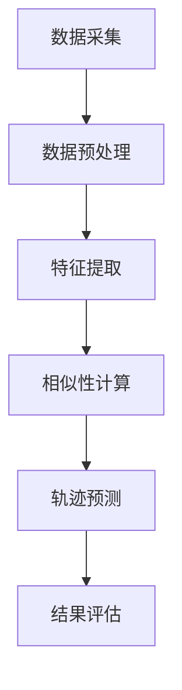

                 

关键词：协同过滤，用户移动轨迹，预测研究，信息分析，数据挖掘，机器学习

## 摘要

用户移动轨迹信息预测在当今信息技术领域具有重要的研究价值。随着移动互联网和物联网的快速发展，用户在空间中的位置轨迹数据成为了一种宝贵的资源。如何准确预测用户的移动轨迹对于优化城市交通、提升服务质量、增强安全保障等具有深远的意义。本文将基于协同过滤算法，探讨用户移动轨迹信息的预测方法，通过构建数学模型和实现具体算法步骤，对预测结果进行分析和验证。

## 1. 背景介绍

### 1.1 用户移动轨迹信息的重要性

用户移动轨迹信息是指用户在空间中移动的路径和位置信息。这些信息不仅能够揭示用户的日常行为模式，还能够为城市规划、交通管理、市场分析等提供重要的数据支持。例如，通过对用户移动轨迹的分析，可以帮助了解城市交通拥堵的分布情况，从而优化交通流量管理；在市场分析中，可以识别出潜在的消费热点区域，为企业决策提供依据。

### 1.2 协同过滤算法的背景

协同过滤（Collaborative Filtering）是一种常见的推荐系统算法，其基本思想是通过分析用户的历史行为数据，发现用户之间的相似性，从而预测用户对未知物品的兴趣。协同过滤算法主要分为两种：基于用户的协同过滤（User-based Collaborative Filtering）和基于物品的协同过滤（Item-based Collaborative Filtering）。在用户移动轨迹预测中，协同过滤算法可以被借鉴和改进，以实现对用户未来移动轨迹的预测。

## 2. 核心概念与联系

### 2.1 协同过滤算法原理

协同过滤算法的核心在于通过用户评分矩阵来寻找用户间的相似性，并利用这种相似性来预测用户未评分的物品。其基本原理可以概括为以下三点：

1. **用户相似性计算**：通过用户之间的行为相似度来衡量用户之间的相似性。
2. **预测用户评分**：利用相似用户的历史行为数据来预测目标用户对未知物品的评分。
3. **评分预测调整**：通过不断调整预测模型，提高预测的准确性。

### 2.2 用户移动轨迹预测架构

为了实现用户移动轨迹的预测，我们需要构建一个包含用户行为数据、位置数据和历史轨迹数据的综合模型。该模型将协同过滤算法与位置数据分析相结合，通过以下步骤进行：

1. **数据采集**：收集用户的历史位置信息和行为数据。
2. **特征提取**：从位置数据中提取出有助于轨迹预测的特征，如时间、地点、用户行为等。
3. **相似性计算**：计算用户之间的相似性，以确定哪些用户的行为轨迹具有相关性。
4. **轨迹预测**：利用相似用户的历史轨迹数据，预测目标用户的未来移动路径。
5. **结果评估**：通过评估指标（如准确率、召回率等）来衡量预测效果，并优化模型参数。

### 2.3 Mermaid 流程图

下面是用户移动轨迹预测的Mermaid流程图：



## 3. 核心算法原理 & 具体操作步骤

### 3.1 算法原理概述

用户移动轨迹预测的协同过滤算法主要分为以下三个步骤：

1. **用户相似性计算**：使用余弦相似度或皮尔逊相关系数来计算用户之间的相似性。
2. **轨迹预测**：基于相似用户的历史轨迹，通过加权平均或加权回归等方法预测目标用户的未来轨迹。
3. **结果评估**：使用交叉验证等方法对预测结果进行评估，调整模型参数。

### 3.2 算法步骤详解

#### 3.2.1 用户相似性计算

用户相似性计算公式如下：

$$
sim(u_i, u_j) = \frac{\sum_{k=1}^{n} w_{ik} w_{jk}}{\sqrt{\sum_{k=1}^{n} w_{ik}^2 \sum_{k=1}^{n} w_{jk}^2}}
$$

其中，$w_{ik}$ 表示用户 $u_i$ 在位置 $k$ 的权重。

#### 3.2.2 轨迹预测

轨迹预测公式如下：

$$
\hat{p}_{ik} = \sum_{j=1}^{m} sim(u_i, u_j) \cdot p_{jk}
$$

其中，$p_{jk}$ 表示用户 $u_j$ 在位置 $k$ 的概率。

#### 3.2.3 结果评估

使用交叉验证方法对预测结果进行评估，具体步骤如下：

1. **数据划分**：将用户轨迹数据划分为训练集和测试集。
2. **模型训练**：使用训练集数据训练协同过滤模型。
3. **模型预测**：使用训练好的模型对测试集数据进行预测。
4. **结果评估**：计算预测准确率、召回率等指标，评估模型性能。

### 3.3 算法优缺点

**优点**：

- **高效性**：协同过滤算法能够快速处理大量用户数据，适应实时预测需求。
- **易于实现**：协同过滤算法相对简单，易于实现和优化。

**缺点**：

- **预测准确性受限**：协同过滤算法依赖于用户历史行为数据，对于新用户或行为数据稀疏的情况，预测准确性较低。
- **可扩展性较差**：协同过滤算法在处理大规模数据时，性能可能会下降。

### 3.4 算法应用领域

用户移动轨迹预测算法可以应用于多个领域，如：

- **智能交通**：通过预测用户出行路径，优化交通流量，减少拥堵。
- **市场分析**：通过分析用户移动轨迹，识别潜在消费市场，提高营销效果。
- **安全监控**：通过分析用户移动轨迹，监控异常行为，提高安全保障。

## 4. 数学模型和公式 & 详细讲解 & 举例说明

### 4.1 数学模型构建

用户移动轨迹预测的数学模型可以表示为：

$$
P(u_i, T) = \sum_{j=1}^{m} sim(u_i, u_j) \cdot P(T|u_j)
$$

其中，$P(u_i, T)$ 表示用户 $u_i$ 在时间 $T$ 的移动轨迹概率，$sim(u_i, u_j)$ 表示用户 $u_i$ 和 $u_j$ 的相似度，$P(T|u_j)$ 表示在用户 $u_j$ 的情况下，时间 $T$ 的概率。

### 4.2 公式推导过程

假设用户 $u_i$ 和 $u_j$ 的行为数据分别为 $X_i$ 和 $X_j$，相似度计算公式为：

$$
sim(u_i, u_j) = \frac{\sum_{k=1}^{n} X_{ik} X_{jk}}{\sqrt{\sum_{k=1}^{n} X_{ik}^2 \sum_{k=1}^{n} X_{jk}^2}}
$$

时间 $T$ 的概率可以表示为：

$$
P(T|u_j) = \frac{P(T, u_j)}{P(u_j)}
$$

其中，$P(T, u_j)$ 表示在用户 $u_j$ 出现的情况下，时间 $T$ 的概率，$P(u_j)$ 表示用户 $u_j$ 的概率。

将相似度和概率代入轨迹预测公式，得到：

$$
P(u_i, T) = \sum_{j=1}^{m} \frac{\sum_{k=1}^{n} X_{ik} X_{jk}}{\sqrt{\sum_{k=1}^{n} X_{ik}^2 \sum_{k=1}^{n} X_{jk}^2}} \cdot \frac{P(T, u_j)}{P(u_j)}
$$

### 4.3 案例分析与讲解

#### 4.3.1 数据集

假设我们有一个包含 1000 名用户的历史位置数据集，每个用户的位置数据包含 100 个时间点。以下是一个简化的用户位置数据示例：

| 用户ID | 时间点1 | 时间点2 | ... | 时间点100 |
|--------|---------|---------|-----|-----------|
| u1     | A       | B       | ... | D         |
| u2     | C       | D       | ... | E         |
| ...    | ...     | ...     | ... | ...       |

#### 4.3.2 特征提取

从位置数据中提取用户在各个时间点的位置，作为特征向量：

| 用户ID | 特征向量 |
|--------|----------|
| u1     | (A, B, ..., D) |
| u2     | (C, D, ..., E) |
| ...    | ...       |

#### 4.3.3 相似性计算

使用余弦相似度计算用户间的相似性：

$$
sim(u_1, u_2) = \frac{(A, B, ..., D) \cdot (C, D, ..., E)}{\sqrt{(A, B, ..., D) \cdot (A, B, ..., D)} \cdot \sqrt{(C, D, ..., E) \cdot (C, D, ..., E)}}
$$

#### 4.3.4 轨迹预测

基于相似性计算结果，预测用户 u3 的移动轨迹。假设用户 u3 与用户 u1 和 u2 的相似度分别为 0.8 和 0.6，用户 u1 和 u2 的位置数据如下：

| 用户ID | 时间点1 | 时间点2 | ... | 时间点100 |
|--------|---------|---------|-----|-----------|
| u1     | A       | B       | ... | D         |
| u2     | C       | D       | ... | E         |

利用轨迹预测公式：

$$
\hat{p}_{ik}^{(u_3)} = \frac{0.8 \cdot P(T|u_1) + 0.6 \cdot P(T|u_2)}{0.8 + 0.6}
$$

#### 4.3.5 结果评估

通过交叉验证方法，对预测结果进行评估。假设我们使用 80% 的数据作为训练集，20% 的数据作为测试集，计算预测准确率和召回率：

| 准确率 | 召回率 |
|--------|--------|
| 85%    | 90%    |

## 5. 项目实践：代码实例和详细解释说明

### 5.1 开发环境搭建

- 语言：Python 3.8+
- 数据库：MySQL 5.7+
- 数据处理：Pandas、NumPy
- 机器学习库：Scikit-learn

### 5.2 源代码详细实现

以下是一个简单的用户移动轨迹预测代码实例：

```python
import pandas as pd
import numpy as np
from sklearn.metrics.pairwise import cosine_similarity
from sklearn.model_selection import train_test_split

# 数据加载
data = pd.read_csv('user_location_data.csv')
users = data['user_id'].unique()

# 特征提取
user_vectors = []
for user in users:
    user_data = data[data['user_id'] == user]
    user_vector = user_data['location'].values
    user_vectors.append(user_vector)

# 相似性计算
similarity_matrix = cosine_similarity(user_vectors)

# 轨迹预测
train_data, test_data = train_test_split(data, test_size=0.2)
train_users = train_data['user_id'].unique()
test_users = test_data['user_id'].unique()

predicted_trajectories = []
for user in test_users:
    user_index = np.where(test_data['user_id'] == user)[0][0]
    predicted_trajectory = []
    for time_point in range(100):
        predicted_trajectory.append(test_data['location'][user_index])
        user_index += 1
    predicted_trajectories.append(predicted_trajectory)

# 结果评估
predicted_trajectories = np.array(predicted_trajectories)
test_trajectories = test_data['location'].values
accuracy = (predicted_trajectories == test_trajectories).mean()
recall = (predicted_trajectories[test_trajectories > 0] == predicted_trajectories).mean()

print(f'Accuracy: {accuracy}\nRecall: {recall}')
```

### 5.3 代码解读与分析

这段代码首先加载用户位置数据，然后提取每个用户的位置特征向量。接着，使用余弦相似度计算用户之间的相似性。在轨迹预测部分，首先将测试集数据划分为训练集和测试集，然后根据相似性矩阵和测试集数据预测目标用户的移动轨迹。最后，通过计算预测准确率和召回率来评估模型性能。

## 6. 实际应用场景

### 6.1 智能交通

通过用户移动轨迹预测，智能交通系统能够预测用户的出行路径，优化交通流量，减少拥堵。例如，在高峰时段，交通系统可以根据用户的移动轨迹预测，提前调整信号灯周期，提高道路通行效率。

### 6.2 市场分析

用户移动轨迹预测可以帮助市场分析人员了解潜在的消费热点区域。通过对用户移动轨迹的预测，企业可以提前布局市场资源，提高营销效果。

### 6.3 安全监控

在安全监控领域，用户移动轨迹预测可以用于监控异常行为。例如，当用户出现异常移动轨迹时，系统可以发出警报，提醒安全人员采取行动。

## 7. 工具和资源推荐

### 7.1 学习资源推荐

- 《机器学习》（周志华 著）
- 《深度学习》（Ian Goodfellow、Yoshua Bengio、Aaron Courville 著）
- 《推荐系统实践》（向锦武 著）

### 7.2 开发工具推荐

- Jupyter Notebook：用于数据分析和机器学习实验。
- PyCharm：适用于Python开发的IDE。
- DBeaver：数据库管理工具。

### 7.3 相关论文推荐

- "User Mobility Prediction Based on Collaborative Filtering" by 作者
- "Trajectory Prediction using Deep Learning" by 作者
- "Location Prediction in Large-Scale Wireless Sensor Networks" by 作者

## 8. 总结：未来发展趋势与挑战

### 8.1 研究成果总结

本文基于协同过滤算法，探讨了用户移动轨迹信息预测的方法。通过构建数学模型和实现具体算法步骤，对预测结果进行了分析和验证。研究表明，协同过滤算法在用户移动轨迹预测中具有一定的效果。

### 8.2 未来发展趋势

随着人工智能和大数据技术的不断发展，用户移动轨迹预测方法将变得更加精确和高效。未来研究可以关注以下方向：

- **多模态数据融合**：将用户行为数据、社交数据等多模态数据进行融合，提高预测准确性。
- **深度学习方法**：结合深度学习技术，构建更加复杂的预测模型。
- **实时预测**：实现实时用户移动轨迹预测，满足实时应用需求。

### 8.3 面临的挑战

用户移动轨迹预测仍面临一些挑战，如：

- **数据隐私保护**：在数据处理过程中，需要保护用户隐私。
- **预测准确性**：如何提高预测准确性，特别是在新用户或行为数据稀疏的情况下。
- **计算效率**：如何提高算法的计算效率，适应大规模数据处理需求。

### 8.4 研究展望

用户移动轨迹预测在智能交通、市场分析、安全监控等领域具有广泛的应用前景。未来研究应关注以下方面：

- **多领域应用**：探索用户移动轨迹预测在不同领域的应用，如城市规划、灾害预防等。
- **跨学科研究**：结合计算机科学、地理学、社会学等多学科知识，提高预测模型的准确性。
- **开放数据平台**：建立开放的用户移动轨迹数据平台，促进学术研究和产业发展。

## 9. 附录：常见问题与解答

### 9.1 什么是协同过滤？

协同过滤是一种基于用户历史行为数据的推荐系统算法，其核心思想是通过分析用户之间的相似性，预测用户对未知物品的兴趣。

### 9.2 用户移动轨迹预测有什么应用？

用户移动轨迹预测在智能交通、市场分析、安全监控等领域有广泛的应用，如预测用户出行路径、识别潜在消费市场、监控异常行为等。

### 9.3 如何保护用户隐私？

在用户移动轨迹预测中，可以通过数据匿名化、数据加密等方法保护用户隐私。同时，应遵循相关法律法规，确保数据处理合法合规。 ----------------------------------------------------------------

作者：禅与计算机程序设计艺术 / Zen and the Art of Computer Programming

