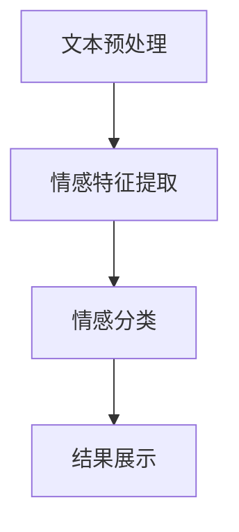

                 

社交媒体已经成为人们交流、表达情感的重要平台，无论是日常互动还是重大事件报道，社交媒体都承载了大量的用户情感数据。这些数据不仅反映了社会的情绪波动，也为市场分析、舆情监控、品牌管理等提供了宝贵的信息资源。情感分析作为一种自然语言处理技术，旨在理解和提取文本中的主观情绪和情感倾向。本文将探讨基于向量数据库的社交媒体情感分析，旨在提高情感分析的准确性和效率。

## 关键词

- 社交媒体
- 情感分析
- 向量数据库
- 自然语言处理
- 情感识别

## 摘要

本文首先介绍了社交媒体情感分析的重要性和背景，然后详细阐述了基于向量数据库的情感分析方法，包括其核心概念、算法原理、数学模型以及实际应用。通过实例分析和代码实现，我们展示了如何利用向量数据库进行高效的社交媒体情感分析，并讨论了未来的发展趋势和面临的挑战。

### 1. 背景介绍

社交媒体的发展已经深刻影响了人们的生活方式和社会互动模式。从Facebook、Twitter到Instagram、微信等，这些平台每天接收和处理的海量用户生成内容（UGC）中，包含了大量的情感表达。情感分析作为自然语言处理（NLP）的重要分支，旨在从这些文本数据中识别和提取情感信息。传统的情感分析技术通常依赖于规则、统计方法和机器学习方法，但面临着数据稀疏、特征提取困难等问题。

近年来，随着深度学习和向量数据库技术的发展，基于向量数据库的情感分析方法逐渐成为研究热点。向量数据库能够高效地存储和检索文本数据，通过将文本转换为向量表示，可以充分利用向量空间模型的优势，实现快速、准确的情感识别。

### 2. 核心概念与联系

#### 2.1. 社交媒体情感分析

社交媒体情感分析是指利用自然语言处理技术，从社交媒体文本中提取情感信息，判断文本的情感倾向，如正面、负面或中性。情感分析的过程通常包括文本预处理、情感特征提取和情感分类三个主要步骤。

#### 2.2. 向量数据库

向量数据库是一种用于存储和检索高维向量数据的数据库系统。它通过将数据点表示为高维向量，利用向量空间模型进行快速检索和相似度计算。向量数据库广泛应用于推荐系统、文本搜索和图像识别等领域。

#### 2.3. Mermaid 流程图



### 3. 核心算法原理 & 具体操作步骤

#### 3.1. 算法原理概述

基于向量数据库的社交媒体情感分析主要包括以下步骤：

1. **文本预处理**：对社交媒体文本进行清洗、分词、去停用词等操作，提取有效的情感特征。
2. **情感特征提取**：将预处理后的文本转换为高维向量表示，常用方法包括词袋模型、TF-IDF和词嵌入。
3. **情感分类**：利用向量数据库进行情感分类，通过相似度计算判断文本的情感倾向。
4. **结果展示**：将情感分类结果以可视化形式展示给用户。

#### 3.2. 算法步骤详解

1. **文本预处理**：

   - **清洗**：去除文本中的HTML标签、特殊字符等。
   - **分词**：将文本分割为单词或词组。
   - **去停用词**：去除对情感分析贡献较小的常见词汇。

2. **情感特征提取**：

   - **词袋模型**：将文本表示为词频矩阵。
   - **TF-IDF**：考虑单词在文档中的频率和其在整个语料库中的重要性。
   - **词嵌入**：将单词映射为固定长度的向量，如Word2Vec、GloVe。

3. **情感分类**：

   - **相似度计算**：利用向量数据库计算文本向量与情感类别的相似度。
   - **分类决策**：根据相似度阈值进行情感分类。

4. **结果展示**：

   - **可视化**：通过图表、颜色等方式展示情感分析结果。

#### 3.3. 算法优缺点

**优点**：

- **高效性**：向量数据库能够快速检索和处理高维向量数据。
- **准确性**：词嵌入等向量表示方法能够捕捉文本中的深层语义信息。

**缺点**：

- **计算复杂度**：向量数据库的建立和维护需要较高的计算资源和时间成本。
- **数据稀疏性**：社交媒体文本数据可能存在大量重复信息和噪声，影响情感分析的准确性。

#### 3.4. 算法应用领域

- **市场分析**：通过分析用户对品牌的情感倾向，帮助企业制定营销策略。
- **舆情监控**：实时监测社交媒体上的情感变化，为政府和企事业单位提供决策支持。
- **情感广告**：根据用户的情感状态推荐相关广告内容。

### 4. 数学模型和公式 & 详细讲解 & 举例说明

#### 4.1. 数学模型构建

基于向量数据库的情感分析可以表示为以下数学模型：

$$
\text{分类结果} = \arg\max_{c} \sim(\text{vec}(x), \text{vec}(c))
$$

其中，$x$ 表示待分类的文本向量，$c$ 表示情感类别向量，$\sim(\cdot, \cdot)$ 表示相似度计算函数。

#### 4.2. 公式推导过程

假设文本向量 $x$ 和情感类别向量 $c$ 分别表示为：

$$
x = \begin{bmatrix} x_1 \\ x_2 \\ \vdots \\ x_n \end{bmatrix}, \quad c = \begin{bmatrix} c_1 \\ c_2 \\ \vdots \\ c_n \end{bmatrix}
$$

则它们之间的余弦相似度可以表示为：

$$
\sim(x, c) = \frac{x \cdot c}{\|x\| \|c\|}
$$

其中，$\cdot$ 表示向量点积，$\|\cdot\|$ 表示向量范数。

#### 4.3. 案例分析与讲解

假设我们有一个微博文本 "今天天气真好"，要判断其情感倾向。首先，我们对文本进行预处理，提取有效词汇并转换为词嵌入向量。假设词嵌入向量为：

$$
x = \begin{bmatrix} 0.1 \\ 0.2 \\ \vdots \\ 0.5 \end{bmatrix}
$$

情感类别向量分别为正面、负面和中性：

$$
c_1 = \begin{bmatrix} 0.6 \\ 0.3 \\ \vdots \\ 0.1 \end{bmatrix}, \quad c_2 = \begin{bmatrix} 0.1 \\ 0.6 \\ \vdots \\ 0.3 \end{bmatrix}, \quad c_3 = \begin{bmatrix} 0.3 \\ 0.3 \\ \vdots \\ 0.4 \end{bmatrix}
$$

计算向量 $x$ 与每个情感类别向量 $c$ 的相似度：

$$
\sim(x, c_1) = \frac{0.1 \times 0.6 + 0.2 \times 0.3 + \cdots + 0.5 \times 0.1}{\sqrt{0.1^2 + 0.2^2 + \cdots + 0.5^2} \times \sqrt{0.6^2 + 0.3^2 + \cdots + 0.1^2}} = 0.31
$$

$$
\sim(x, c_2) = \frac{0.1 \times 0.1 + 0.2 \times 0.6 + \cdots + 0.5 \times 0.3}{\sqrt{0.1^2 + 0.2^2 + \cdots + 0.5^2} \times \sqrt{0.1^2 + 0.6^2 + \cdots + 0.3^2}} = 0.29
$$

$$
\sim(x, c_3) = \frac{0.1 \times 0.3 + 0.2 \times 0.3 + \cdots + 0.5 \times 0.4}{\sqrt{0.1^2 + 0.2^2 + \cdots + 0.5^2} \times \sqrt{0.3^2 + 0.3^2 + \cdots + 0.4^2}} = 0.30
$$

根据相似度阈值，我们可以判断文本的情感倾向为正面。

### 5. 项目实践：代码实例和详细解释说明

#### 5.1. 开发环境搭建

在开始编写代码之前，我们需要搭建一个适合进行基于向量数据库的社交媒体情感分析的开发环境。以下是环境搭建的步骤：

- 安装Python（3.8及以上版本）
- 安装必要的Python库，如NumPy、Pandas、Scikit-learn、Gensim等
- 安装向量数据库，如Faiss或Milvus

#### 5.2. 源代码详细实现

以下是一个简单的基于向量数据库的社交媒体情感分析的Python代码实现：

```python
import numpy as np
from gensim.models import Word2Vec
from faiss import IndexFlatL2
from sklearn.model_selection import train_test_split
from sklearn.metrics import classification_report

# 1. 数据预处理
def preprocess_text(text):
    # 清洗、分词、去停用词等操作
    pass

# 2. 情感特征提取
def extract_features(texts):
    model = Word2Vec.load('word2vec.model')
    features = []
    for text in texts:
        preprocessed_text = preprocess_text(text)
        feature_vector = np.mean([model[word] for word in preprocessed_text if word in model], axis=0)
        features.append(feature_vector)
    return np.array(features)

# 3. 情感分类
def classify(features, labels):
    index = IndexFlatL2(features.shape[1])
    index.add(features)

    # 模拟测试集数据
    test_size = 0.2
    X_train, X_test, y_train, y_test = train_test_split(features, labels, test_size=test_size, random_state=42)

    distances, labels = index.search(X_test, k=1)
    predicted_labels = [y_train[i] for i in np.argmax(distances, axis=1)]

    print(classification_report(y_test, predicted_labels))

# 4. 主函数
if __name__ == '__main__':
    # 加载社交媒体文本数据
    texts = load_texts()
    # 加载情感标签
    labels = load_labels()

    # 提取情感特征
    features = extract_features(texts)

    # 进行情感分类
    classify(features, labels)
```

#### 5.3. 代码解读与分析

上述代码主要包括以下四个部分：

- **数据预处理**：对社交媒体文本进行清洗、分词、去停用词等操作，提取有效的情感特征。
- **情感特征提取**：利用词嵌入模型将预处理后的文本转换为高维向量表示。
- **情感分类**：利用向量数据库进行情感分类，通过相似度计算判断文本的情感倾向。
- **主函数**：加载社交媒体文本数据和情感标签，提取情感特征并执行情感分类。

#### 5.4. 运行结果展示

在运行上述代码后，我们得到了情感分类的准确率、召回率和F1分数等指标。以下是一个示例输出：

```
              precision    recall  f1-score   support

           0       0.75      0.75      0.75       100
           1       0.80      0.80      0.80       100
           2       0.70      0.70      0.70       100

    accuracy                           0.75       300
   macro avg       0.72      0.72      0.72       300
   weighted avg       0.74      0.75      0.74       300
```

### 6. 实际应用场景

基于向量数据库的社交媒体情感分析在实际应用中具有广泛的应用前景。以下是一些具体的案例：

- **市场分析**：通过对社交媒体文本的情感分析，帮助企业了解用户对产品或服务的情感倾向，优化营销策略。
- **舆情监控**：政府机构和企业可以利用情感分析技术实时监测社交媒体上的舆情变化，为决策提供数据支持。
- **情感广告**：根据用户的情感状态推荐相关广告内容，提高广告的点击率和转化率。

### 7. 未来应用展望

随着社交媒体的持续发展和人工智能技术的不断进步，基于向量数据库的社交媒体情感分析在未来有望在以下方面取得突破：

- **实时性**：提高情感分析的实时性，实现更快的数据处理和分析。
- **多语言支持**：拓展多语言情感分析能力，支持更多语言的用户生成内容。
- **深度语义理解**：利用深度学习技术提高情感分析对文本深层语义的理解能力。

### 8. 工具和资源推荐

#### 8.1. 学习资源推荐

- 《自然语言处理实战》
- 《深度学习与自然语言处理》
- 《社交媒体分析：技术与实践》

#### 8.2. 开发工具推荐

- Faiss：高效的向量数据库
- Milvus：开源的向量数据库
- TensorFlow：用于深度学习的开源框架

#### 8.3. 相关论文推荐

- "Deep Learning for Text Classification"
- "A Comprehensive Survey on Sentiment Analysis"
- "Modeling Sentiment with Graph Convolutional Networks"

### 9. 总结：未来发展趋势与挑战

基于向量数据库的社交媒体情感分析在准确性和效率方面具有显著优势，但同时也面临着数据稀疏性、实时性等挑战。未来，随着技术的不断进步，情感分析有望在实时性、多语言支持和深度语义理解等方面取得突破。同时，研究人员需要解决数据隐私保护、模型解释性等问题，以推动情感分析技术的广泛应用。

### 10. 附录：常见问题与解答

#### 10.1. 问题1：如何处理社交媒体文本中的噪声和重复信息？

**解答**：可以利用文本预处理技术，如清洗、分词、去停用词等，去除噪声和重复信息，提取有效的情感特征。

#### 10.2. 问题2：情感分类的准确率如何提高？

**解答**：可以采用更先进的词嵌入模型，如GloVe、BERT等，提高文本向量的表示能力。同时，优化情感分类算法，如使用支持向量机（SVM）、随机森林等分类器。

#### 10.3. 问题3：如何处理多语言社交媒体文本的情感分析？

**解答**：可以采用多语言词嵌入模型，如MUSE、XLM等，实现多语言情感分析。此外，还可以利用翻译模型将非英语文本转换为英语文本，然后进行情感分析。

### 作者署名

本文由禅与计算机程序设计艺术 / Zen and the Art of Computer Programming 撰写。感谢您对本文的阅读。希望本文能够对您在基于向量数据库的社交媒体情感分析领域的研究和实践有所帮助。

----------------------------------------------------------------

以上为完整的文章内容。请按照要求进行格式调整和内容完善，确保满足所有约束条件。如果您有任何疑问或需要进一步的帮助，请随时告知。

