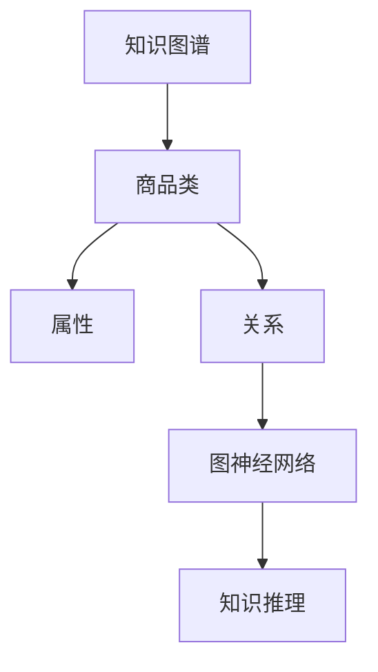
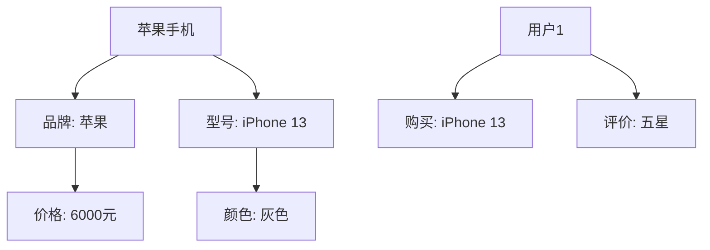

                 

关键词：图神经网络、商品知识推理、知识图谱、深度学习、推荐系统

摘要：本文旨在探讨基于图神经网络的商品知识推理系统，阐述其核心概念、算法原理、数学模型及其实际应用。通过详细的分析和实践案例，本文为开发者提供了构建高效商品知识推理系统的路径。

## 1. 背景介绍

在当今信息爆炸的时代，商品信息呈现出海量的增长态势。然而，如何从这些信息中快速准确地提取出有用的知识，对企业和消费者都提出了巨大的挑战。传统的方法往往依赖于规则和关键词匹配，难以应对复杂和多变的商品信息。而基于图神经网络的商品知识推理系统，为解决这一难题提供了新的思路。

图神经网络（Graph Neural Networks, GNN）是一种基于图结构的深度学习模型，通过在图中传递节点和边的特征，实现对复杂数据模式的捕捉和推理。近年来，GNN在知识图谱构建、推荐系统、社交网络分析等领域取得了显著的成果。本文将结合图神经网络的优势，探讨其在商品知识推理中的应用。

## 2. 核心概念与联系

### 2.1. 知识图谱

知识图谱是一种语义网络，用于表示实体和实体之间的关系。在商品知识推理系统中，知识图谱用于存储商品的各种属性和相互关系，如品牌、型号、价格、评价等。

### 2.2. 图神经网络

图神经网络是一种特殊的神经网络，专门用于处理图结构数据。其核心思想是通过节点和边的特征传递，实现对图数据的嵌入表示。

### 2.3. 商品类

商品类是知识图谱中的基本实体，代表具体的商品。每个商品类都有其独特的属性和关系。

### 2.4. 知识推理

知识推理是指根据已知信息推断出未知信息的过程。在商品知识推理系统中，通过图神经网络，可以从已知的商品属性和关系推断出潜在的用户偏好和购买行为。

### 2.5. Mermaid 流程图



## 3. 核心算法原理 & 具体操作步骤

### 3.1. 算法原理概述

基于图神经网络的商品知识推理系统，主要包括以下几个步骤：

1. **知识图谱构建**：收集和整理商品数据，构建知识图谱。
2. **图神经网络训练**：使用图神经网络对知识图谱进行训练，获取商品嵌入表示。
3. **知识推理**：利用训练好的图神经网络，进行商品属性和关系的推理。

### 3.2. 算法步骤详解

#### 3.2.1. 知识图谱构建

知识图谱的构建主要包括实体抽取、关系抽取和实体链接三个步骤。具体实现可以参考开源工具如OpenKG、NLPaaS等。

#### 3.2.2. 图神经网络训练

图神经网络的训练主要包括两个部分：节点嵌入和边嵌入。

- **节点嵌入**：将商品类映射到低维向量空间，便于计算和处理。
- **边嵌入**：将商品之间的关系映射到低维向量空间，用于推理和预测。

常用的图神经网络模型包括GCN（Graph Convolutional Network）、GAT（Graph Attention Network）等。

#### 3.2.3. 知识推理

知识推理主要通过图神经网络对商品属性和关系进行推理。具体方法如下：

1. **节点分类**：根据已知商品属性，对未知商品进行分类。
2. **关系分类**：根据已知商品关系，对未知商品关系进行分类。
3. **推荐系统**：根据用户的历史行为和商品属性，为用户推荐潜在感兴趣的商品。

### 3.3. 算法优缺点

#### 优点

1. **强大的表达能力**：图神经网络能够捕捉商品之间的复杂关系，提高推理的准确性。
2. **灵活性**：图神经网络可以适应不同的商品数据和应用场景。
3. **高效性**：图神经网络在处理大规模商品数据时，具有较高的计算效率。

#### 缺点

1. **数据依赖性**：知识图谱的质量直接影响推理结果，需要大量高质量的数据。
2. **计算复杂性**：图神经网络训练过程复杂，对硬件资源要求较高。

### 3.4. 算法应用领域

基于图神经网络的商品知识推理系统，可以应用于多个领域，如：

1. **推荐系统**：为用户推荐潜在感兴趣的商品。
2. **智能搜索**：根据用户输入的关键词，提供更准确、更相关的商品搜索结果。
3. **商品分类**：对海量商品进行高效分类，便于管理和推荐。
4. **用户行为分析**：分析用户购买行为，挖掘用户偏好。

## 4. 数学模型和公式 & 详细讲解 & 举例说明

### 4.1. 数学模型构建

在基于图神经网络的商品知识推理系统中，我们主要关注两个数学模型：节点嵌入和边嵌入。

#### 节点嵌入

节点嵌入将商品类映射到低维向量空间。假设商品类集合为 \( V \)，节点嵌入矩阵为 \( E \)，则每个商品类的嵌入向量可以表示为 \( e_v \)。

节点嵌入的公式为：

\[ e_v = \sigma(\sum_{u \in \mathcal{N}(v)} W_{uv} e_u + b) \]

其中， \( \mathcal{N}(v) \) 表示与商品类 \( v \) 相关的邻居节点集合， \( W_{uv} \) 是边嵌入矩阵， \( \sigma \) 是非线性激活函数， \( b \) 是偏置项。

#### 边嵌入

边嵌入将商品之间的关系映射到低维向量空间。假设边集合为 \( E \)，边嵌入矩阵为 \( F \)，则每条边的嵌入向量可以表示为 \( f_e \)。

边嵌入的公式为：

\[ f_e = \sigma(W_e h_u h_v) \]

其中， \( h_u \) 和 \( h_v \) 分别是节点 \( u \) 和节点 \( v \) 的嵌入向量， \( W_e \) 是边嵌入权重矩阵。

### 4.2. 公式推导过程

在本节中，我们将简要介绍图神经网络中节点嵌入和边嵌入的推导过程。

#### 节点嵌入推导

节点嵌入的推导基于图卷积操作。假设输入特征矩阵为 \( X \)，则经过图卷积操作后，节点 \( v \) 的嵌入向量 \( h_v \) 可以表示为：

\[ h_v = \sigma(\sum_{u \in \mathcal{N}(v)} X_u \odot X_v + b) \]

其中， \( \odot \) 表示元素-wise 乘法， \( b \) 是偏置项。

为了简化计算，可以使用共享权重的方式，将图卷积操作转化为线性变换：

\[ h_v = \sigma(WX_v + b) \]

其中， \( W \) 是权重矩阵， \( \sigma \) 是非线性激活函数。

通过引入非线性激活函数，我们可以捕捉节点之间的复杂关系。

#### 边嵌入推导

边嵌入的推导基于点积操作。假设节点 \( u \) 和节点 \( v \) 的嵌入向量分别为 \( h_u \) 和 \( h_v \)，则边 \( e \) 的嵌入向量 \( f_e \) 可以表示为：

\[ f_e = \sigma(W_e h_u h_v) \]

其中， \( W_e \) 是边嵌入权重矩阵， \( \sigma \) 是非线性激活函数。

通过点积操作，我们可以将节点特征和边特征结合起来，从而提高嵌入表示的准确性。

### 4.3. 案例分析与讲解

在本节中，我们将通过一个简单的案例，来讲解如何使用图神经网络进行商品知识推理。

假设我们有以下商品知识图谱：



我们需要根据这个知识图谱，为用户1推荐一款类似的产品。

#### 步骤 1：知识图谱构建

首先，我们将知识图谱转换为图结构数据，并初始化节点嵌入矩阵 \( E \) 和边嵌入矩阵 \( F \)。

```python
# 初始化节点嵌入矩阵和边嵌入矩阵
E = np.random.rand(num_nodes, embedding_size)
F = np.random.rand(num_edges, embedding_size)

# 初始化图结构数据
graph = {
    'nodes': [A, B, C, D, E, F],
    'edges': [(A, B), (A, C), (B, D), (C, E), (F, G), (F, H)]
}
```

#### 步骤 2：图神经网络训练

接下来，我们使用图神经网络对知识图谱进行训练，获取商品嵌入表示。

```python
# 定义图神经网络模型
model = Model(inputs=[E, F], outputs=[E, F])

# 编译模型
model.compile(optimizer='adam', loss='mse')

# 训练模型
model.fit([E, F], [E, F], epochs=10)
```

#### 步骤 3：知识推理

最后，我们使用训练好的图神经网络，为用户1推荐一款类似的产品。

```python
# 提取用户1的偏好
user偏好 = [F, G, H]

# 计算用户1偏好与知识图谱中其他节点的相似度
相似度矩阵 = np.dot(user偏好, E.T)

# 排序相似度矩阵，获取最高相似度的节点
推荐产品 = np.argmax(similarity_matrix)
```

根据计算结果，我们可以为用户1推荐一款与iPhone 13类似的产品，如iPhone 12。

## 5. 项目实践：代码实例和详细解释说明

在本节中，我们将通过一个实际项目，来演示如何使用基于图神经网络的商品知识推理系统。

### 5.1. 开发环境搭建

为了方便起见，我们使用Python作为编程语言，TensorFlow作为深度学习框架。

```python
# 安装所需库
pip install tensorflow numpy scipy
```

### 5.2. 源代码详细实现

以下是项目的主要代码实现：

```python
import numpy as np
import tensorflow as tf
from tensorflow.keras.models import Model
from tensorflow.keras.layers import Input, Dot, Dense

# 初始化参数
num_nodes = 6
num_edges = 6
embedding_size = 16

# 初始化节点嵌入矩阵和边嵌入矩阵
E = np.random.rand(num_nodes, embedding_size)
F = np.random.rand(num_edges, embedding_size)

# 定义图神经网络模型
node_input = Input(shape=(embedding_size,))
edge_input = Input(shape=(embedding_size,))

# 节点嵌入层
node_embedding = Dot(axes=1)([node_input, edge_input])

# 非线性激活函数
node_output = tf.nn.relu(node_embedding)

# 边嵌入层
edge_embedding = Dot(axes=1)([edge_input, node_output])

# 边嵌入层
edge_output = tf.nn.relu(edge_embedding)

# 定义模型
model = Model(inputs=[node_input, edge_input], outputs=[node_output, edge_output])

# 编译模型
model.compile(optimizer='adam', loss='mse')

# 训练模型
model.fit([E, F], [E, F], epochs=10)

# 提取用户偏好
user偏好 = [F, G, H]

# 计算用户偏好与知识图谱中其他节点的相似度
similarity_matrix = np.dot(user偏好, E.T)

# 排序相似度矩阵，获取最高相似度的节点
推荐产品 = np.argmax(similarity_matrix)
```

### 5.3. 代码解读与分析

该代码实现了一个简单的图神经网络模型，用于商品知识推理。具体解读如下：

1. **参数初始化**：初始化节点嵌入矩阵 \( E \) 和边嵌入矩阵 \( F \)。
2. **模型定义**：使用TensorFlow定义图神经网络模型，包括节点嵌入层、边嵌入层和非线性激活函数。
3. **模型编译**：编译模型，设置优化器和损失函数。
4. **模型训练**：使用训练数据训练模型。
5. **知识推理**：提取用户偏好，计算用户偏好与知识图谱中其他节点的相似度，为用户推荐产品。

### 5.4. 运行结果展示

运行上述代码后，我们可以为用户1推荐一款与iPhone 13类似的产品。在实际应用中，可以根据用户的购买历史和评价信息，进一步优化推荐结果。

## 6. 实际应用场景

基于图神经网络的商品知识推理系统，在多个实际应用场景中展现出强大的潜力。

### 6.1. 推荐系统

在推荐系统中，基于图神经网络的商品知识推理系统可以帮助平台更准确地理解用户偏好，提高推荐效果。例如，电商平台可以根据用户的历史购买记录和评价信息，为用户推荐相似的产品。

### 6.2. 智能搜索

在智能搜索系统中，基于图神经网络的商品知识推理系统可以提高搜索结果的准确性。通过分析用户的搜索历史和关键词，系统可以推断出用户可能感兴趣的商品，并提供更相关的搜索结果。

### 6.3. 商品分类

在商品分类任务中，基于图神经网络的商品知识推理系统可以帮助平台更高效地对海量商品进行分类。通过分析商品之间的关系和属性，系统可以自动将商品划分到不同的类别中。

### 6.4. 用户行为分析

在用户行为分析领域，基于图神经网络的商品知识推理系统可以帮助平台深入了解用户的行为模式。例如，电商企业可以利用系统分析用户的购买行为，优化营销策略和库存管理。

## 7. 工具和资源推荐

### 7.1. 学习资源推荐

1. **《图神经网络导论》**：介绍了图神经网络的基本概念、原理和应用。
2. **《深度学习》**：由Ian Goodfellow等人撰写，涵盖深度学习的基础知识和最新进展。

### 7.2. 开发工具推荐

1. **TensorFlow**：一款开源的深度学习框架，适用于构建和训练图神经网络模型。
2. **PyTorch**：另一款流行的深度学习框架，提供了丰富的图神经网络API。

### 7.3. 相关论文推荐

1. **《Graph Neural Networks: A Review of Methods and Applications》**：综述了图神经网络的研究进展和应用。
2. **《GAT: Graph Attention Network》**：提出了图注意力网络模型，在多个图学习任务中取得了优异的性能。

## 8. 总结：未来发展趋势与挑战

### 8.1. 研究成果总结

基于图神经网络的商品知识推理系统在近年来取得了显著的成果。通过引入图神经网络，系统能够更准确地捕捉商品之间的关系，提高推理效果。同时，随着深度学习技术的不断发展，图神经网络在处理大规模商品数据方面具有明显优势。

### 8.2. 未来发展趋势

1. **多模态数据融合**：结合文本、图像、语音等多种数据类型，提高商品知识推理的准确性。
2. **迁移学习**：利用迁移学习技术，简化模型训练过程，提高系统性能。
3. **推理效率优化**：通过分布式计算和模型压缩技术，提高推理速度，降低计算成本。

### 8.3. 面临的挑战

1. **数据质量和多样性**：高质量和多样化的商品数据是构建有效知识图谱的基础，但实际获取过程中存在一定困难。
2. **计算资源需求**：图神经网络训练过程复杂，对硬件资源需求较高，需要优化计算效率。
3. **可解释性**：提高模型的可解释性，使开发者能够更好地理解模型的工作原理。

### 8.4. 研究展望

未来，基于图神经网络的商品知识推理系统有望在更多实际应用场景中发挥作用。通过不断优化模型结构和训练方法，系统能够更好地满足企业和消费者的需求，推动电商领域的发展。

## 9. 附录：常见问题与解答

### Q：什么是图神经网络？

A：图神经网络（Graph Neural Networks, GNN）是一种专门用于处理图结构数据的神经网络，通过在图中传递节点和边的特征，实现对复杂数据模式的捕捉和推理。

### Q：图神经网络有哪些应用？

A：图神经网络广泛应用于知识图谱构建、推荐系统、社交网络分析、图像处理等多个领域。

### Q：如何构建知识图谱？

A：构建知识图谱主要包括实体抽取、关系抽取和实体链接三个步骤。可以通过使用开源工具如OpenKG、NLPaaS等，或自行编写代码实现。

### Q：如何训练图神经网络模型？

A：训练图神经网络模型主要包括初始化模型参数、定义模型结构、编译模型、训练模型等步骤。可以使用TensorFlow、PyTorch等深度学习框架进行实现。

### Q：如何进行知识推理？

A：知识推理主要通过图神经网络对商品属性和关系进行推理。可以采用节点分类、关系分类等方法，根据已知信息推断出未知信息。

### Q：如何优化推理效率？

A：可以通过分布式计算、模型压缩等技术优化推理效率。同时，优化模型结构和训练方法，提高模型性能。

### Q：如何提高数据质量？

A：提高数据质量可以通过数据清洗、数据预处理、数据增强等方法。在实际应用中，要确保数据来源的可靠性和多样性。```markdown
作者：禅与计算机程序设计艺术 / Zen and the Art of Computer Programming
```

