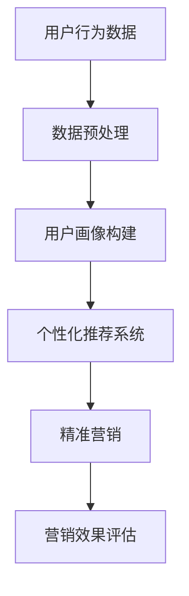

                 

关键词：大数据、智能手机、营销对策、用户行为分析、个性化推荐、精准营销、数据挖掘、用户画像、广告投放、隐私保护、用户体验。

## 摘要

本文旨在探讨大数据时代下智能手机营销的新趋势和对策。随着智能手机的普及和大数据技术的发展，用户行为数据的海量积累为智能手机营销提供了丰富的信息资源。本文首先介绍了大数据背景下智能手机营销的重要性，然后探讨了用户行为分析、个性化推荐、精准营销等核心概念，并详细阐述了基于大数据的智能手机营销策略。此外，本文还分析了当前面临的隐私保护和用户体验挑战，提出了相应的解决方案和未来研究方向。

## 1. 背景介绍

### 1.1 大数据时代来临

随着互联网的普及和智能手机的广泛应用，人们的生活变得越来越数字化。每一个用户在互联网上的行为，如搜索、浏览、购买、社交媒体互动等，都产生了大量的数据。这些数据积累起来，形成了大数据。大数据具有四个显著特点：海量性、多样性、高速性和真实性。海量性指的是数据规模庞大；多样性指的是数据来源广泛，包括文本、图片、音频、视频等不同类型；高速性指的是数据处理速度越来越快；真实性指的是数据来自真实的用户行为，具有较高的可信度。

### 1.2 智能手机营销的现状

智能手机作为现代人的必备设备，其用户数据为营销提供了丰富的信息资源。然而，传统的营销方法往往无法充分挖掘这些数据的潜在价值。在大数据背景下，智能手机营销呈现出以下几个趋势：

1. **用户行为分析**：通过对用户行为数据的分析，企业可以了解用户的需求和偏好，从而提供更加个性化的服务。
2. **个性化推荐**：利用大数据分析技术，为用户提供个性化的产品推荐，提高用户满意度和购买转化率。
3. **精准营销**：通过用户画像和数据挖掘技术，实现精准的目标用户定位，提高广告投放的效果。
4. **数据驱动的决策**：基于大数据分析结果，企业可以做出更加科学的营销决策，提高营销效率。

## 2. 核心概念与联系

### 2.1 大数据概念

大数据（Big Data）是指无法用传统数据库工具进行存储、管理和分析的数据集合。其特点可以概括为“4V”：Volume（海量）、Velocity（高速）、Variety（多样性）和Veracity（真实性）。

### 2.2 智能手机用户行为分析

智能手机用户行为分析是指通过收集和分析智能手机用户在使用设备时的行为数据，如应用使用情况、位置信息、社交互动等，来了解用户需求和行为模式。用户行为分析是大数据技术在智能手机营销中的核心应用之一。

### 2.3 个性化推荐系统

个性化推荐系统（Personalized Recommendation System）是基于用户行为数据，利用机器学习、数据挖掘等技术，为用户提供个性化内容推荐的服务。个性化推荐系统在智能手机营销中起着重要作用，能够提高用户满意度和购买转化率。

### 2.4 精准营销

精准营销（Precision Marketing）是指利用大数据分析技术，对目标用户进行精确的定位和营销。精准营销的目标是提高营销效果，降低营销成本。

### 2.5 数据挖掘

数据挖掘（Data Mining）是从大量数据中提取有价值信息的过程。在智能手机营销中，数据挖掘技术可以用于用户画像构建、广告投放优化等。

### 2.6 用户画像

用户画像（User Profile）是对用户特征的综合描述，包括用户的基本信息、兴趣爱好、行为习惯等。用户画像是精准营销的基础。

### 2.7 Mermaid 流程图

## 3. 核心算法原理 & 具体操作步骤

### 3.1 算法原理概述

基于大数据的智能手机营销算法主要包括以下几个步骤：

1. **数据采集**：通过应用接口、SDK等技术手段，收集用户在智能手机上的行为数据。
2. **数据预处理**：对采集到的数据进行清洗、去噪和格式转换，使其适合后续分析。
3. **用户画像构建**：利用数据挖掘技术，从预处理后的数据中提取用户的兴趣标签、行为特征等，构建用户画像。
4. **个性化推荐**：基于用户画像和物品特征，利用协同过滤、基于内容的推荐等技术，为用户生成个性化推荐列表。
5. **精准营销**：结合用户画像和营销目标，设计精准的营销策略，如精准广告投放、个性化优惠券推送等。
6. **营销效果评估**：通过用户反馈和行为数据，评估营销策略的效果，并根据评估结果进行优化。

### 3.2 算法步骤详解

#### 3.2.1 数据采集

数据采集是整个算法的基础。常用的数据采集方式包括：

1. **应用内事件追踪**：通过在应用中嵌入事件追踪代码，收集用户使用应用时的行为数据，如点击、浏览、下载等。
2. **SDK采集**：利用第三方SDK（如Google Analytics、百度统计等），采集用户在应用中的行为数据。
3. **匿名化数据共享**：与第三方数据平台合作，获取匿名化用户行为数据。

#### 3.2.2 数据预处理

数据预处理是保证数据质量的关键步骤。主要任务包括：

1. **数据清洗**：去除重复、错误、无效的数据。
2. **数据去噪**：通过滤波、插值等方法，处理噪声数据。
3. **格式转换**：将不同来源、不同格式的数据进行统一转换，使其适合后续分析。

#### 3.2.3 用户画像构建

用户画像构建是核心步骤，主要包括：

1. **特征提取**：从原始数据中提取用户的基本信息、行为特征、兴趣标签等。
2. **特征融合**：将不同来源、不同格式的特征数据进行整合，形成统一的用户画像。
3. **特征筛选**：通过统计分析和机器学习技术，筛选出对用户行为有显著影响的关键特征。

#### 3.2.4 个性化推荐

个性化推荐是基于用户画像和物品特征，为用户生成个性化推荐列表。主要技术包括：

1. **协同过滤**：通过分析用户之间的相似性，为用户推荐相似的物品。
2. **基于内容的推荐**：根据用户的历史行为和物品的特征，为用户推荐与其兴趣相关的物品。
3. **混合推荐**：结合协同过滤和基于内容的推荐，提高推荐效果。

#### 3.2.5 精准营销

精准营销是结合用户画像和营销目标，设计个性化的营销策略。主要任务包括：

1. **目标用户定位**：根据用户画像，筛选出对营销目标有价值的用户群体。
2. **营销策略设计**：根据用户画像和营销目标，设计个性化的营销策略，如广告投放、优惠券推送等。
3. **营销效果评估**：通过用户反馈和行为数据，评估营销策略的效果，并根据评估结果进行优化。

#### 3.2.6 营销效果评估

营销效果评估是保证营销策略有效性的关键。主要任务包括：

1. **效果指标设计**：根据营销目标和用户行为数据，设计合适的评估指标，如点击率、转化率、留存率等。
2. **效果数据收集**：通过用户反馈和行为数据，收集营销效果数据。
3. **效果分析**：通过统计分析方法，分析营销效果数据，评估营销策略的有效性。
4. **效果优化**：根据效果分析结果，对营销策略进行优化。

### 3.3 算法优缺点

#### 3.3.1 优点

1. **个性化强**：基于用户行为数据，能够为用户生成个性化的推荐和营销策略。
2. **效果显著**：通过精准的用户定位和个性化推荐，提高用户满意度和购买转化率。
3. **数据驱动**：以数据为基础，通过数据分析和挖掘，指导营销决策。

#### 3.3.2 缺点

1. **数据质量要求高**：算法效果依赖于数据质量，需要保证数据清洗和预处理的质量。
2. **计算复杂度高**：算法涉及到大量的数据计算和分析，对计算资源和时间要求较高。
3. **隐私保护挑战**：在数据采集和使用过程中，需要关注用户隐私保护问题。

### 3.4 算法应用领域

基于大数据的智能手机营销算法可以广泛应用于多个领域，如电子商务、社交媒体、在线教育、金融保险等。通过个性化推荐和精准营销，企业可以提高用户满意度、降低营销成本、提升品牌价值。

## 4. 数学模型和公式 & 详细讲解 & 举例说明

### 4.1 数学模型构建

在智能手机营销中，常用的数学模型包括用户画像构建模型、个性化推荐模型和精准营销模型。

#### 4.1.1 用户画像构建模型

用户画像构建模型通常基于用户行为数据和用户特征数据，采用聚类分析和因子分析等方法。其中，聚类分析用于发现用户群体的相似性，因子分析用于提取用户特征的重要维度。

#### 4.1.2 个性化推荐模型

个性化推荐模型通常采用协同过滤、基于内容的推荐和混合推荐等方法。协同过滤模型基于用户之间的相似性进行推荐，基于内容的推荐模型基于用户的历史行为和物品特征进行推荐，混合推荐模型结合协同过滤和基于内容的推荐方法，提高推荐效果。

#### 4.1.3 精准营销模型

精准营销模型通常结合用户画像和营销目标，采用决策树、支持向量机、神经网络等方法进行建模。这些方法可以根据用户特征和营销目标，为用户推荐合适的营销策略。

### 4.2 公式推导过程

#### 4.2.1 用户画像构建模型

假设我们有 $n$ 个用户，每个用户有 $m$ 个特征，用户行为数据矩阵可以表示为 $X \in R^{n \times m}$。采用K-means算法进行用户聚类，目标函数为：

$$
J = \sum_{i=1}^{n}\sum_{j=1}^{m}(x_{ij} - \mu_{ij})^2
$$

其中，$x_{ij}$ 表示第 $i$ 个用户在第 $j$ 个特征上的取值，$\mu_{ij}$ 表示第 $i$ 个用户所在聚类中心的第 $j$ 个特征值。

#### 4.2.2 个性化推荐模型

假设我们有 $n$ 个用户，每个用户有 $m$ 个行为特征，物品有 $k$ 个特征。用户 $i$ 对物品 $j$ 的评分可以表示为：

$$
r_{ij} = \langle \vec{x_i}, \vec{x_j} \rangle + \epsilon_{ij}
$$

其中，$\langle \vec{x_i}, \vec{x_j} \rangle$ 表示用户 $i$ 和物品 $j$ 的相似度，$\epsilon_{ij}$ 表示随机误差。

#### 4.2.3 精准营销模型

假设我们有 $n$ 个用户，每个用户有 $m$ 个特征，营销策略有 $k$ 个维度。用户 $i$ 对营销策略 $j$ 的偏好可以表示为：

$$
p_{ij} = \frac{1}{1 + e^{-\alpha \langle \vec{x_i}, \vec{w_j} \rangle}}
$$

其中，$\vec{w_j}$ 表示营销策略 $j$ 的权重，$\alpha$ 是调节参数。

### 4.3 案例分析与讲解

#### 4.3.1 用户画像构建案例

假设我们有100个用户，每个用户有5个特征（年龄、性别、收入、教育水平、职业）。采用K-means算法进行用户聚类，聚类中心如下：

$$
\mu_1 = [25, F, 3000, Bachelor, Engineer]
$$

$$
\mu_2 = [30, M, 5000, Master, Manager]
$$

$$
\mu_3 = [40, F, 8000, Doctor, Professor]
$$

用户 $i=1$ 的特征如下：

$$
x_1 = [30, M, 5000, Master, Manager]
$$

计算用户 $i=1$ 与各个聚类中心的距离，选取距离最近的聚类中心，将其归为第2类用户。

#### 4.3.2 个性化推荐案例

假设我们有10个用户，每个用户有5个行为特征（浏览次数、点赞次数、评论次数、分享次数、购买次数）。用户 $i=1$ 的行为特征如下：

$$
x_1 = [10, 5, 2, 1, 0]
$$

用户 $i=2$ 的行为特征如下：

$$
x_2 = [5, 10, 3, 0, 1]
$$

计算用户 $i=1$ 和用户 $i=2$ 的相似度：

$$
\langle \vec{x_1}, \vec{x_2} \rangle = 10 \times 5 + 5 \times 10 + 2 \times 3 + 1 \times 0 + 0 \times 1 = 70
$$

用户 $i=1$ 对物品 $j=1$ 的评分预测为：

$$
r_{1j} = \langle \vec{x_1}, \vec{x_2} \rangle + \epsilon_{ij} = 70 + \epsilon_{ij}
$$

#### 4.3.3 精准营销案例

假设我们有10个用户，每个用户有5个特征（年龄、性别、收入、教育水平、职业）。营销策略有2个维度（优惠券金额、优惠券类型）。用户 $i=1$ 的特征如下：

$$
x_1 = [30, M, 5000, Master, Manager]
$$

计算用户 $i=1$ 对营销策略 $j=1$ 的偏好概率：

$$
p_{1j} = \frac{1}{1 + e^{-\alpha \langle \vec{x_1}, \vec{w_1} \rangle}} = \frac{1}{1 + e^{-\alpha \times (30 \times 0.5 + 5000 \times 0.3 + 1 \times 0.2 + 0 \times 0.1 + 0 \times 0.

