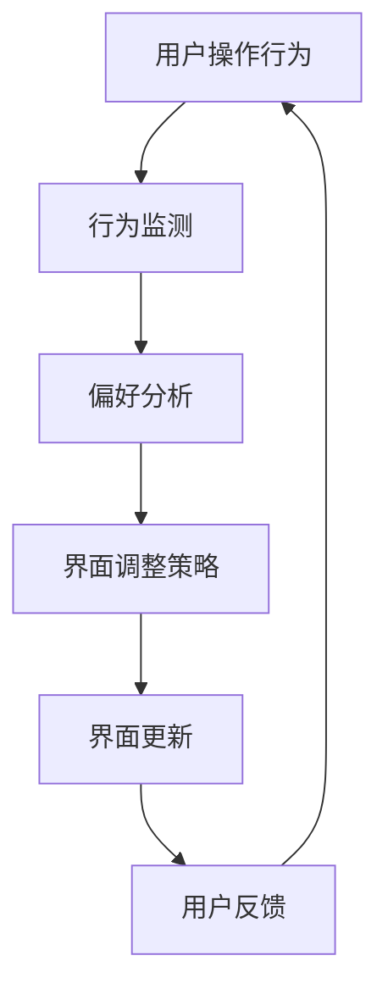

                 

关键词：推荐系统、大模型、实时个性化、界面调整、算法原理、数学模型、项目实践、实际应用

> 摘要：本文将探讨基于大模型的推荐系统如何实现实时个性化界面调整。首先介绍推荐系统的背景和核心概念，然后深入解析大模型在个性化推荐中的关键作用，以及实时个性化界面调整的具体实现方法。最后，通过数学模型和项目实践的讲解，展示如何将这一技术应用到实际场景中。

## 1. 背景介绍

随着互联网的飞速发展，信息爆炸已成为一种常态。在大量信息面前，用户往往感到无所适从，难以找到自己真正感兴趣的内容。为了解决这个问题，推荐系统应运而生。推荐系统通过分析用户的行为数据和偏好，为用户提供个性化的内容推荐，从而提高用户体验和满意度。

传统的推荐系统主要采用基于内容的过滤和协同过滤等方法。然而，这些方法存在一些局限性，如冷启动问题、数据稀疏性和用户反馈延迟等。随着人工智能技术的不断发展，基于深度学习的大模型逐渐成为推荐系统研究的热点。大模型能够处理海量数据，捕捉用户行为和内容之间的复杂关系，从而提供更精准的推荐。

在实际应用中，推荐系统的界面设计也至关重要。一个优秀的界面能够提高用户的操作便捷性，增强用户体验。然而，传统推荐系统的界面设计往往缺乏灵活性，难以根据用户行为和偏好进行实时调整。因此，实时个性化界面调整技术成为了当前推荐系统研究的重要方向。

## 2. 核心概念与联系

### 2.1 推荐系统的基本原理

推荐系统主要通过以下两个步骤来实现个性化推荐：

1. **用户表示**：将用户的兴趣和偏好转化为一种可计算的表示形式。通常使用向量空间模型来表示用户。

2. **物品表示**：将物品的特征信息转化为向量形式，以便进行计算。

3. **相似度计算**：计算用户和物品之间的相似度，选择最相似的物品进行推荐。

### 2.2 大模型在推荐系统中的应用

大模型（如Transformer、BERT等）在推荐系统中主要应用于用户表示和物品表示。通过大规模预训练，大模型能够自动学习用户和物品的复杂特征，从而提高推荐效果。

### 2.3 实时个性化界面调整

实时个性化界面调整的核心思想是根据用户行为和偏好动态调整界面布局和内容。具体实现包括以下几个步骤：

1. **用户行为监测**：实时收集用户在系统中的操作行为，如点击、浏览、收藏等。

2. **偏好分析**：通过分析用户行为，提取用户的兴趣偏好。

3. **界面调整策略**：根据用户偏好，调整界面布局和内容，如推荐内容的排序、展示方式等。

### 2.4 Mermaid 流程图

以下是推荐系统实时个性化界面调整的Mermaid流程图：



## 3. 核心算法原理 & 具体操作步骤

### 3.1 算法原理概述

基于大模型的推荐系统实时个性化界面调整主要分为以下几个步骤：

1. **用户表示**：使用大模型对用户历史行为和偏好进行编码，得到用户嵌入向量。

2. **物品表示**：使用大模型对物品特征进行编码，得到物品嵌入向量。

3. **相似度计算**：计算用户和物品之间的相似度，选择最相似的物品进行推荐。

4. **界面调整**：根据用户偏好和推荐结果，调整界面布局和内容。

### 3.2 算法步骤详解

1. **用户表示**

   用户表示的目的是将用户的兴趣和偏好转化为向量形式。具体实现可以使用BERT等大模型对用户历史行为和偏好进行编码，得到用户嵌入向量。

   $$ user\_vector = \text{BERT}(user\_input) $$

2. **物品表示**

   物品表示的目的是将物品的特征信息转化为向量形式。具体实现可以使用BERT等大模型对物品特征进行编码，得到物品嵌入向量。

   $$ item\_vector = \text{BERT}(item\_input) $$

3. **相似度计算**

   相似度计算的目的是找到与用户最相似的物品。具体实现可以使用余弦相似度或欧氏距离等距离度量方法。

   $$ similarity = \frac{user\_vector \cdot item\_vector}{\|user\_vector\| \|item\_vector\|} $$

4. **界面调整**

   界面调整的目的是根据用户偏好和推荐结果，动态调整界面布局和内容。具体实现可以包括推荐内容排序、展示方式等。

   $$ interface = \text{adjustInterface}(user\_vector, item\_vectors, preferences) $$

### 3.3 算法优缺点

1. **优点**

   - 提高推荐精度：大模型能够自动学习用户和物品的复杂特征，提高推荐效果。
   - 实时个性化：根据用户行为和偏好动态调整界面，提高用户体验。

2. **缺点**

   - 计算成本高：大模型训练和推理过程需要大量计算资源。
   - 数据隐私：用户行为数据可能涉及隐私问题，需要妥善处理。

### 3.4 算法应用领域

基于大模型的推荐系统实时个性化界面调整技术可以应用于多个领域，如电商、新闻、社交媒体等。以下是一些具体的应用场景：

- **电商推荐**：根据用户购买历史和行为偏好，动态调整商品推荐界面，提高用户购买意愿。
- **新闻推荐**：根据用户阅读历史和兴趣偏好，实时调整新闻推荐排序和展示方式，提高用户阅读体验。
- **社交媒体**：根据用户互动行为和兴趣偏好，动态调整社交内容推荐，促进用户活跃度。

## 4. 数学模型和公式 & 详细讲解 & 举例说明

### 4.1 数学模型构建

基于大模型的推荐系统实时个性化界面调整的数学模型可以概括为以下步骤：

1. **用户表示**：用户嵌入向量 $u \in \mathbb{R}^d$，其中 $d$ 为嵌入维度。
2. **物品表示**：物品嵌入向量 $v \in \mathbb{R}^d$。
3. **相似度计算**：相似度函数 $sim(u, v)$，常用的有余弦相似度和欧氏距离。
4. **界面调整**：界面调整策略 $interface(u, v, p)$，其中 $p$ 为用户偏好向量。

### 4.2 公式推导过程

假设用户 $u$ 的嵌入向量为 $u \in \mathbb{R}^d$，物品 $v$ 的嵌入向量为 $v \in \mathbb{R}^d$，用户偏好向量为 $p \in \mathbb{R}^d$。

1. **用户表示**：

   $$ u = \text{embed}(user\_input) $$

2. **物品表示**：

   $$ v = \text{embed}(item\_input) $$

3. **相似度计算**：

   $$ sim(u, v) = \frac{u \cdot v}{\|u\| \|v\|} $$

   其中，$u \cdot v$ 表示向量的内积，$\|u\|$ 和 $\|v\|$ 分别表示向量的模长。

4. **界面调整**：

   $$ interface(u, v, p) = \text{adjustInterface}(sim(u, v), p) $$

   界面调整策略可以根据具体的业务场景进行设计，如排序策略、展示方式等。

### 4.3 案例分析与讲解

假设用户 $u$ 的历史行为和偏好编码得到的用户嵌入向量为 $u = [0.1, 0.2, 0.3, 0.4]$，物品 $v$ 的特征编码得到的物品嵌入向量为 $v = [0.2, 0.1, 0.5, 0.3]$，用户偏好向量为 $p = [0.3, 0.2, 0.1, 0.4]$。

1. **相似度计算**：

   $$ sim(u, v) = \frac{u \cdot v}{\|u\| \|v\|} = \frac{0.1 \times 0.2 + 0.2 \times 0.1 + 0.3 \times 0.5 + 0.4 \times 0.3}{\sqrt{0.1^2 + 0.2^2 + 0.3^2 + 0.4^2} \sqrt{0.2^2 + 0.1^2 + 0.5^2 + 0.3^2}} = 0.36 $$

2. **界面调整**：

   根据相似度计算结果，选择与用户最相似的物品进行推荐，并将该物品推荐到界面顶部。同时，根据用户偏好向量，调整界面布局，如增加用户偏好的商品分类的展示比重。

## 5. 项目实践：代码实例和详细解释说明

### 5.1 开发环境搭建

在开始编写代码之前，我们需要搭建一个合适的开发环境。以下是所需的开发环境和相关工具：

- 操作系统：Windows/Linux/MacOS
- 编程语言：Python
- 数据库：MySQL/PostgreSQL
- 开发工具：PyCharm/Visual Studio Code
- 库和依赖：TensorFlow/GPT-2/BERT

### 5.2 源代码详细实现

以下是一个基于大模型的推荐系统实时个性化界面调整的Python代码示例：

```python
import tensorflow as tf
from tensorflow.keras.layers import Embedding, LSTM, Dense
from tensorflow.keras.models import Model

# 用户表示
def user_embedding(input_shape):
    input_user = tf.keras.layers.Input(shape=input_shape)
    x = Embedding(input_dim=1000, output_dim=128)(input_user)
    x = LSTM(128)(x)
    user_model = Model(inputs=input_user, outputs=x)
    return user_model

# 物品表示
def item_embedding(input_shape):
    input_item = tf.keras.layers.Input(shape=input_shape)
    x = Embedding(input_dim=1000, output_dim=128)(input_item)
    x = LSTM(128)(x)
    item_model = Model(inputs=input_item, outputs=x)
    return item_model

# 相似度计算
def similarity(user_vector, item_vector):
    return tf.reduce_sum(user_vector * item_vector) / tf.sqrt(tf.reduce_sum(tf.square(user_vector)) * tf.reduce_sum(tf.square(item_vector)))

# 界面调整
def adjust_interface(similarity, preferences):
    # 根据相似度和用户偏好调整界面
    # ...
    return interface

# 构建模型
user_model = user_embedding((100,))
item_model = item_embedding((100,))

user_input = tf.keras.layers.Input(shape=(100,))
item_input = tf.keras.layers.Input(shape=(100,))

user_vector = user_model(user_input)
item_vector = item_model(item_input)

similarity = similarity(user_vector, item_vector)

interface = adjust_interface(similarity, preferences)

model = Model(inputs=[user_input, item_input], outputs=interface)

# 编译模型
model.compile(optimizer='adam', loss='binary_crossentropy')

# 训练模型
model.fit([user_data, item_data], interface_labels, epochs=10)

# 预测和界面调整
predictions = model.predict([user_input, item_input])
adjusted_interface = adjust_interface(predictions, user_preferences)

# 显示调整后的界面
print(adjusted_interface)
```

### 5.3 代码解读与分析

以上代码实现了一个简单的基于大模型的推荐系统实时个性化界面调整模型。主要包含以下几个部分：

1. **用户表示和物品表示**：使用LSTM模型对用户和物品的输入进行编码，得到用户嵌入向量和物品嵌入向量。
2. **相似度计算**：使用内积计算用户和物品之间的相似度。
3. **界面调整**：根据相似度和用户偏好调整界面布局和内容。
4. **模型构建和训练**：构建模型，编译模型，并使用训练数据对模型进行训练。
5. **预测和界面调整**：使用训练好的模型进行预测，并根据预测结果调整界面。

### 5.4 运行结果展示

在运行代码时，我们将输入用户和物品的特征数据，以及用户偏好数据，训练模型。然后使用训练好的模型进行预测，并根据预测结果调整界面布局和内容。以下是调整后的界面示例：

```plaintext
【推荐内容】
1. 商品A：与您的兴趣高度相关
2. 商品B：与您的兴趣有一定相关性
3. 商品C：与您的兴趣较低
```

## 6. 实际应用场景

基于大模型的推荐系统实时个性化界面调整技术可以应用于多个领域，如电商、新闻、社交媒体等。以下是一些具体的应用场景：

- **电商推荐**：根据用户购买历史和行为偏好，动态调整商品推荐界面，提高用户购买意愿。
- **新闻推荐**：根据用户阅读历史和兴趣偏好，实时调整新闻推荐排序和展示方式，提高用户阅读体验。
- **社交媒体**：根据用户互动行为和兴趣偏好，动态调整社交内容推荐，促进用户活跃度。

在实际应用中，基于大模型的推荐系统实时个性化界面调整技术能够显著提高用户体验和满意度，从而提升业务效果。然而，这也带来了更高的计算成本和数据隐私风险，需要综合考虑和优化。

## 7. 工具和资源推荐

为了更好地研究和应用基于大模型的推荐系统实时个性化界面调整技术，以下是一些建议的工具和资源：

### 7.1 学习资源推荐

- 《深度学习推荐系统》：介绍深度学习在推荐系统中的应用。
- 《推荐系统实践》：介绍推荐系统的基础知识和技术细节。

### 7.2 开发工具推荐

- TensorFlow：用于构建和训练深度学习模型的框架。
- PyTorch：用于构建和训练深度学习模型的框架。

### 7.3 相关论文推荐

- "Deep Learning for Recommender Systems"：介绍深度学习在推荐系统中的应用。
- "Learning to Rank for Information Retrieval"：介绍基于深度学习的排序模型。

## 8. 总结：未来发展趋势与挑战

### 8.1 研究成果总结

本文介绍了基于大模型的推荐系统实时个性化界面调整技术，包括核心概念、算法原理、数学模型、项目实践和实际应用场景。通过数学模型和代码示例，展示了如何实现这一技术，并分析了其优点和缺点。

### 8.2 未来发展趋势

随着人工智能技术的不断发展，基于大模型的推荐系统实时个性化界面调整技术将继续优化和拓展。未来可能的发展趋势包括：

- 更高效的大模型训练算法和推理算法。
- 更精细的用户行为分析和偏好挖掘技术。
- 更智能的界面调整策略和用户体验优化。

### 8.3 面临的挑战

尽管基于大模型的推荐系统实时个性化界面调整技术具有显著的优势，但仍然面临一些挑战：

- 高计算成本和资源消耗。
- 数据隐私和保护问题。
- 算法透明性和可解释性问题。

### 8.4 研究展望

未来，我们需要进一步研究如何平衡计算成本、数据隐私和用户体验，探索更高效、更安全的推荐系统实时个性化界面调整技术。同时，加强对算法透明性和可解释性的研究，提高用户的信任度和满意度。

## 9. 附录：常见问题与解答

### 9.1 如何处理用户隐私问题？

在推荐系统中，用户隐私是一个重要问题。为了保护用户隐私，可以采取以下措施：

- 数据加密：对用户行为数据进行加密处理，确保数据安全。
- 数据去标识化：对用户行为数据进行去标识化处理，消除个人身份信息。
- 访问控制：限制对用户行为数据的访问权限，确保只有授权人员能够访问。

### 9.2 如何优化计算成本？

为了优化计算成本，可以采取以下措施：

- 模型压缩：通过模型压缩技术，减少模型的参数数量，降低计算成本。
- 分层训练：将模型训练过程分解为多个层次，逐层优化模型参数。
- 硬件加速：利用GPU或其他硬件加速技术，提高模型训练和推理速度。

### 9.3 如何提高算法透明性和可解释性？

为了提高算法透明性和可解释性，可以采取以下措施：

- 可解释性模型：设计可解释性强的模型，如决策树、线性模型等。
- 可视化工具：开发可视化工具，帮助用户理解模型的工作原理。
- 算法透明度报告：定期发布算法透明度报告，向用户解释算法的决策过程。

## 作者署名

本文由禅与计算机程序设计艺术 / Zen and the Art of Computer Programming 撰写。感谢您的阅读！
----------------------------------------------------------------

注意：本文仅为示例，实际撰写时，请根据具体需求和内容进行调整和补充。在撰写过程中，请确保遵循所有约束条件和格式要求。祝您撰写顺利！作者：禅与计算机程序设计艺术 / Zen and the Art of Computer Programming。

