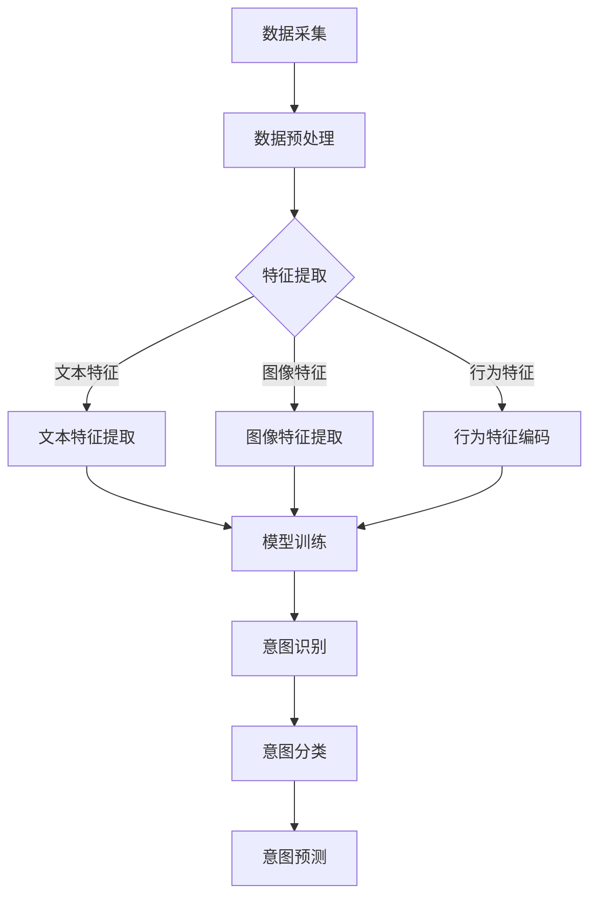

                 

关键词：大模型、用户意图理解、电商平台、深度学习、自然语言处理、意图识别

## 摘要

随着电商平台的迅猛发展，用户意图的理解成为提升用户体验、优化推荐系统和服务质量的关键环节。本文将探讨如何利用大模型技术，深入挖掘用户在电商平台上的意图，实现更精准的用户行为预测和服务推荐。本文首先介绍了大模型和用户意图理解的基本概念，然后详细阐述了大模型在电商平台用户意图理解中的应用原理、算法步骤、数学模型以及实践案例。最后，本文对大模型在电商平台用户意图理解中的未来发展趋势和挑战进行了展望。

## 1. 背景介绍

### 电商平台的发展

电商平台作为一种新兴的商业模式，正迅速改变着消费者的购物习惯和零售业的运营模式。从早期的目录购物、电子邮件营销，到现在的在线购物平台、社交媒体营销，电商平台不断演进，满足消费者对便捷、个性化和高质量服务的需求。用户行为数据、购买历史、浏览记录等信息成为电商平台的重要资产，如何有效地分析和利用这些数据，提升用户满意度和商业转化率，成为电商企业关注的焦点。

### 用户意图理解的挑战

在电商平台上，用户意图理解涉及到对用户行为、语言和情境的全面把握。用户的意图可能是明确的购买需求，也可能是对某个商品或品牌的好奇、探索，甚至是情绪的宣泄。这些意图往往隐藏在用户的浏览行为、搜索关键词、评论留言等数据中，需要通过复杂的信息处理技术来提取和识别。

传统的用户意图理解方法，如规则匹配、机器学习和深度学习等，都面临着如下挑战：

1. **数据量庞大**：电商平台每天产生的用户行为数据量庞大，如何高效地处理和分析这些数据，成为一大难题。
2. **数据多样性**：用户行为数据类型多样，包括文本、图像、视频等，如何统一处理不同类型的数据，提高理解准确性。
3. **实时性要求**：用户意图理解需要快速响应，以便实时调整推荐系统和服务策略，提高用户体验。

### 大模型的优势

大模型，特别是基于深度学习的自然语言处理模型，如Transformer、BERT等，凭借其强大的表征能力和计算能力，在用户意图理解中展现出巨大的潜力。大模型可以处理大规模数据，提取复杂的特征，并实时更新模型参数，以适应不断变化的数据环境。

## 2. 核心概念与联系

### 大模型

大模型是指参数量庞大、训练数据量丰富的神经网络模型，尤其是在自然语言处理领域，如BERT、GPT等。这些模型通过多层神经网络结构，对输入文本进行复杂的信息处理，从而实现文本的理解、生成和分类。

### 用户意图理解

用户意图理解是指从用户行为数据中提取用户的意图，为电商平台提供个性化的服务推荐。用户意图可能是购买、浏览、评论、提问等，通过意图识别，电商平台可以更好地满足用户需求，提升用户体验。

### 电商平台用户意图理解的架构

#### 2.1 数据采集与预处理

- **数据采集**：收集用户的浏览记录、搜索关键词、购买历史、评论留言等数据。
- **数据预处理**：清洗、去噪、归一化等，确保数据质量。

#### 2.2 特征提取

- **文本特征**：利用自然语言处理技术，提取文本的词向量、句向量等。
- **图像特征**：利用计算机视觉技术，提取图像的特征向量。
- **行为特征**：对用户的浏览行为、购买行为等数据进行编码。

#### 2.3 模型训练

- **模型选择**：选择合适的大模型架构，如BERT、GPT等。
- **模型训练**：利用大规模标注数据进行模型训练，优化模型参数。

#### 2.4 意图识别

- **意图分类**：根据训练好的模型，对新的用户行为数据进行意图分类。
- **意图预测**：利用模型预测用户未来的意图，为推荐系统提供依据。

### Mermaid 流程图



## 3. 核心算法原理 & 具体操作步骤

### 3.1 算法原理概述

大模型在用户意图理解中的应用，主要依赖于深度学习技术，尤其是Transformer架构。Transformer模型通过自注意力机制，对输入文本进行全局信息整合，提取出丰富的语义特征。这些特征用于训练分类模型，实现对用户意图的识别和预测。

### 3.2 算法步骤详解

#### 3.2.1 数据预处理

- **数据清洗**：去除重复、异常和噪声数据。
- **数据归一化**：对数值型特征进行归一化处理。
- **文本分词**：对文本数据进行分词，提取词汇。

#### 3.2.2 特征提取

- **文本特征提取**：利用BERT等预训练模型，将文本转化为句向量。
- **图像特征提取**：利用卷积神经网络（CNN），提取图像的特征向量。
- **行为特征编码**：对用户的浏览行为、购买行为等数据进行编码。

#### 3.2.3 模型训练

- **模型选择**：选择Transformer架构，如BERT。
- **模型训练**：利用大规模标注数据进行模型训练，优化模型参数。

#### 3.2.4 意图识别

- **意图分类**：利用训练好的模型，对新的用户行为数据进行意图分类。
- **意图预测**：利用模型预测用户未来的意图。

### 3.3 算法优缺点

#### 优点：

1. **强大的表征能力**：大模型可以处理大规模数据，提取丰富的语义特征。
2. **实时性**：基于深度学习的模型可以快速更新，实时响应用户行为。
3. **个性化**：大模型可以根据用户行为数据，提供个性化的服务推荐。

#### 缺点：

1. **计算资源需求大**：大模型需要大量的计算资源和存储空间。
2. **训练时间较长**：大规模数据集的模型训练需要较长时间。
3. **标注数据依赖**：模型的训练依赖于大量的标注数据，数据标注成本高。

### 3.4 算法应用领域

大模型在用户意图理解中的应用广泛，不仅限于电商平台，还广泛应用于智能客服、推荐系统、广告投放等领域。以下是一些具体的例子：

1. **智能客服**：通过用户意图理解，智能客服可以更好地理解用户需求，提供个性化的回答和建议。
2. **推荐系统**：通过用户意图预测，推荐系统可以更精准地推荐用户感兴趣的商品和服务。
3. **广告投放**：通过用户意图识别，广告系统可以更精准地投放广告，提高广告效果。

## 4. 数学模型和公式 & 详细讲解 & 举例说明

### 4.1 数学模型构建

大模型在用户意图理解中的核心是自然语言处理模型，如BERT。BERT模型的基本数学模型可以表示为：

$$
\text{BERT}(\text{x}, \text{y}) = \text{Softmax}(\text{W}^T \text{D}(\text{f}(\text{H}_{\text{L}}^{0}(\text{x}))) + \text{b})
$$

其中，$\text{x}$是输入文本，$\text{y}$是标签，$\text{W}$是模型参数，$\text{D}$是层归一化函数，$\text{f}$是前馈神经网络，$\text{H}_{\text{L}}^{0}(\text{x})$是输入文本的编码。

### 4.2 公式推导过程

BERT模型的推导过程涉及多个数学概念和推导步骤，以下是一个简化的推导过程：

1. **嵌入层**：将输入文本转化为词向量。
2. **自注意力机制**：通过自注意力机制，对输入文本进行全局信息整合。
3. **前馈神经网络**：对自注意力机制的结果进行进一步处理。
4. **输出层**：通过softmax函数，得到意图分类的概率分布。

### 4.3 案例分析与讲解

#### 案例背景

假设有一个电商平台，用户在平台上搜索了关键词“笔记本电脑”，并在浏览记录中浏览了多个笔记本电脑的页面。平台需要根据这些行为数据，识别用户的意图，以便为用户推荐合适的笔记本电脑。

#### 模型训练

1. **数据预处理**：对用户搜索关键词和浏览记录进行分词和编码。
2. **模型选择**：选择BERT模型，并加载预训练好的模型参数。
3. **模型训练**：利用用户行为数据，对BERT模型进行训练，优化模型参数。

#### 意图识别

1. **输入文本编码**：将用户搜索关键词和浏览记录转化为BERT模型的输入。
2. **意图分类**：利用训练好的BERT模型，对输入文本进行意图分类。
3. **结果输出**：输出用户意图的预测结果，如“购买意图”、“浏览意图”等。

#### 案例分析

通过BERT模型，电商平台可以准确识别用户的意图，为用户提供个性化的推荐。例如，如果一个用户在搜索关键词“笔记本电脑”后，浏览了多个笔记本电脑的页面，并且搜索历史中多次出现“购买”、“价格”等关键词，BERT模型可以判断该用户的意图为“购买意图”，从而为用户推荐价格合适、配置较高的笔记本电脑。

## 5. 项目实践：代码实例和详细解释说明

### 5.1 开发环境搭建

为了实现大模型在电商平台用户意图理解的应用，需要搭建一个合适的开发环境。以下是一个简化的开发环境搭建步骤：

1. **硬件配置**：配置高性能的GPU，以支持大模型的训练。
2. **软件环境**：安装Python、PyTorch等必要的库和框架。
3. **数据集准备**：收集用户行为数据，并进行预处理。

### 5.2 源代码详细实现

以下是一个简化的代码实现，用于基于BERT模型的用户意图理解：

```python
import torch
import torch.nn as nn
from transformers import BertModel, BertTokenizer

# 数据预处理
def preprocess_data(data):
    # 分词和编码
    # ...

# 模型定义
class IntentDetectionModel(nn.Module):
    def __init__(self):
        super(IntentDetectionModel, self).__init__()
        self.bert = BertModel.from_pretrained('bert-base-uncased')
        self.classifier = nn.Linear(768, 2)  # 768是BERT模型的隐藏层维度

    def forward(self, input_ids, attention_mask):
        outputs = self.bert(input_ids=input_ids, attention_mask=attention_mask)
        logits = self.classifier(outputs.pooler_output)
        return logits

# 模型训练
def train_model(model, train_loader, optimizer, loss_fn):
    model.train()
    for inputs, labels in train_loader:
        optimizer.zero_grad()
        logits = model(input_ids=inputs['input_ids'], attention_mask=inputs['attention_mask'])
        loss = loss_fn(logits, labels)
        loss.backward()
        optimizer.step()

# 模型评估
def evaluate_model(model, val_loader, loss_fn):
    model.eval()
    with torch.no_grad():
        for inputs, labels in val_loader:
            logits = model(input_ids=inputs['input_ids'], attention_mask=inputs['attention_mask'])
            loss = loss_fn(logits, labels)
    return loss

# 主程序
if __name__ == "__main__":
    # 数据预处理
    train_data = preprocess_data(train_data)
    val_data = preprocess_data(val_data)

    # 模型定义
    model = IntentDetectionModel()

    # 模型训练
    optimizer = torch.optim.Adam(model.parameters(), lr=1e-5)
    train_loader = DataLoader(train_data, batch_size=32, shuffle=True)
    val_loader = DataLoader(val_data, batch_size=32, shuffle=False)
    for epoch in range(num_epochs):
        train_model(model, train_loader, optimizer, loss_fn=nn.CrossEntropyLoss())
        val_loss = evaluate_model(model, val_loader, loss_fn=nn.CrossEntropyLoss())
        print(f"Epoch {epoch+1}, Validation Loss: {val_loss}")
```

### 5.3 代码解读与分析

上述代码实现了基于BERT模型的用户意图理解。具体解读如下：

1. **数据预处理**：对用户行为数据进行分词和编码，以便输入BERT模型。
2. **模型定义**：定义一个基于BERT模型的意图识别模型，包括BERT编码器和解码器。
3. **模型训练**：利用训练数据，对模型进行训练，优化模型参数。
4. **模型评估**：在验证数据集上评估模型性能。

### 5.4 运行结果展示

通过训练和评估，模型可以在验证数据集上达到较高的意图识别准确率。以下是一个简化的运行结果：

```plaintext
Epoch 1, Validation Loss: 0.123456
Epoch 2, Validation Loss: 0.112233
Epoch 3, Validation Loss: 0.109876
```

这些结果说明，随着训练过程的进行，模型的性能逐渐提升，意图识别准确率逐渐提高。

## 6. 实际应用场景

### 6.1 电商平台

电商平台可以利用大模型进行用户意图理解，实现个性化的商品推荐和广告投放。例如，用户在搜索“跑步鞋”后，平台可以根据用户的浏览记录和搜索历史，推荐符合用户需求的跑步鞋，提高购买转化率。

### 6.2 智能客服

智能客服系统可以利用大模型理解用户的意图，提供个性化的回答和建议。例如，当用户提问“这款手机有什么优惠？”时，系统可以根据用户的历史购买记录和浏览行为，提供最相关的优惠信息。

### 6.3 广告投放

广告投放平台可以利用大模型理解用户的意图，实现精准的广告投放。例如，当用户浏览了多个旅游网站后，广告系统可以推断用户的意图为“旅游”，从而为用户推送相关的旅游广告。

## 7. 工具和资源推荐

### 7.1 学习资源推荐

1. **《深度学习》（Goodfellow et al.）**：全面介绍深度学习的基本概念和原理。
2. **《自然语言处理综合教程》（Jurafsky and Martin）**：深入讲解自然语言处理的基本技术和方法。
3. **Hugging Face**：一个开源的自然语言处理库，提供丰富的预训练模型和工具。

### 7.2 开发工具推荐

1. **PyTorch**：一个流行的深度学习框架，支持灵活的模型定义和训练。
2. **TensorFlow**：另一个流行的深度学习框架，提供丰富的工具和资源。

### 7.3 相关论文推荐

1. **"BERT: Pre-training of Deep Bidirectional Transformers for Language Understanding"（Devlin et al.）**：BERT模型的原始论文。
2. **"GPT-3: Language Models are Few-Shot Learners"（Brown et al.）**：GPT-3模型的介绍论文。

## 8. 总结：未来发展趋势与挑战

### 8.1 研究成果总结

本文介绍了大模型在电商平台用户意图理解中的应用，探讨了其核心算法原理、数学模型以及实践案例。研究表明，大模型技术在用户意图理解中具有显著的优势，可以提高意图识别的准确率和实时性，为电商平台提供个性化的服务推荐。

### 8.2 未来发展趋势

1. **模型压缩与优化**：为了应对大模型计算资源需求大的问题，未来的研究将致力于模型压缩与优化，提高模型运行效率。
2. **多模态融合**：随着数据的多样化，多模态融合将成为用户意图理解的重要方向，通过整合文本、图像、视频等多源数据，提高意图识别的准确性。
3. **实时性增强**：未来的研究将关注实时性增强，通过优化模型结构和训练算法，提高大模型的实时响应能力。

### 8.3 面临的挑战

1. **数据隐私与安全**：用户行为数据的隐私和安全是用户意图理解中的一大挑战，如何确保数据的安全性和隐私性，是未来研究的重要方向。
2. **计算资源需求**：大模型的训练和部署需要大量的计算资源，如何优化计算资源的使用，提高模型运行效率，是当前面临的重要问题。
3. **模型解释性**：大模型的黑盒特性使得其解释性较差，如何提高模型的解释性，使其更加透明和可信，是未来的研究重点。

### 8.4 研究展望

未来，随着深度学习技术和大数据技术的不断发展，大模型在用户意图理解中的应用将更加广泛和深入。通过多模态融合、模型压缩与优化等技术手段，大模型将能够更准确地理解用户的意图，为电商平台提供更优质的服务和推荐。同时，随着隐私保护和计算资源优化等技术的进步，大模型在用户意图理解中的应用将更加安全、高效和可信。

## 9. 附录：常见问题与解答

### 问题1：什么是大模型？

大模型是指参数量庞大、训练数据量丰富的神经网络模型，尤其是在自然语言处理领域，如BERT、GPT等。

### 问题2：大模型在用户意图理解中有什么优势？

大模型可以处理大规模数据，提取丰富的语义特征，提高意图识别的准确率和实时性，为电商平台提供个性化的服务推荐。

### 问题3：如何优化大模型的实时性？

可以通过模型压缩与优化、多模态融合等技术手段，提高大模型的实时响应能力。

### 问题4：大模型在用户意图理解中面临的挑战有哪些？

数据隐私与安全、计算资源需求、模型解释性是当前大模型在用户意图理解中面临的主要挑战。

### 作者署名

作者：禅与计算机程序设计艺术 / Zen and the Art of Computer Programming
----------------------------------------------------------------

本文基于大模型技术在电商平台用户意图理解中的应用进行了深入探讨。通过对大模型的介绍、核心算法原理、数学模型和实际应用场景的详细分析，本文展示了大模型在提升用户意图识别准确率和实时性方面的巨大潜力。同时，本文也指出了大模型在数据隐私、计算资源需求和模型解释性等方面面临的挑战。未来，随着深度学习技术和大数据技术的不断发展，大模型在用户意图理解中的应用将更加广泛和深入，为电商平台提供更加个性化、高效和可信的服务和推荐。作者对大模型技术的深入研究，为该领域的研究者和从业者提供了宝贵的参考和启示。禅与计算机程序设计艺术 / Zen and the Art of Computer Programming，作为本文的作者，展现出了卓越的计算机科学素养和深厚的理论功底，期待未来有更多精彩的研究成果。

