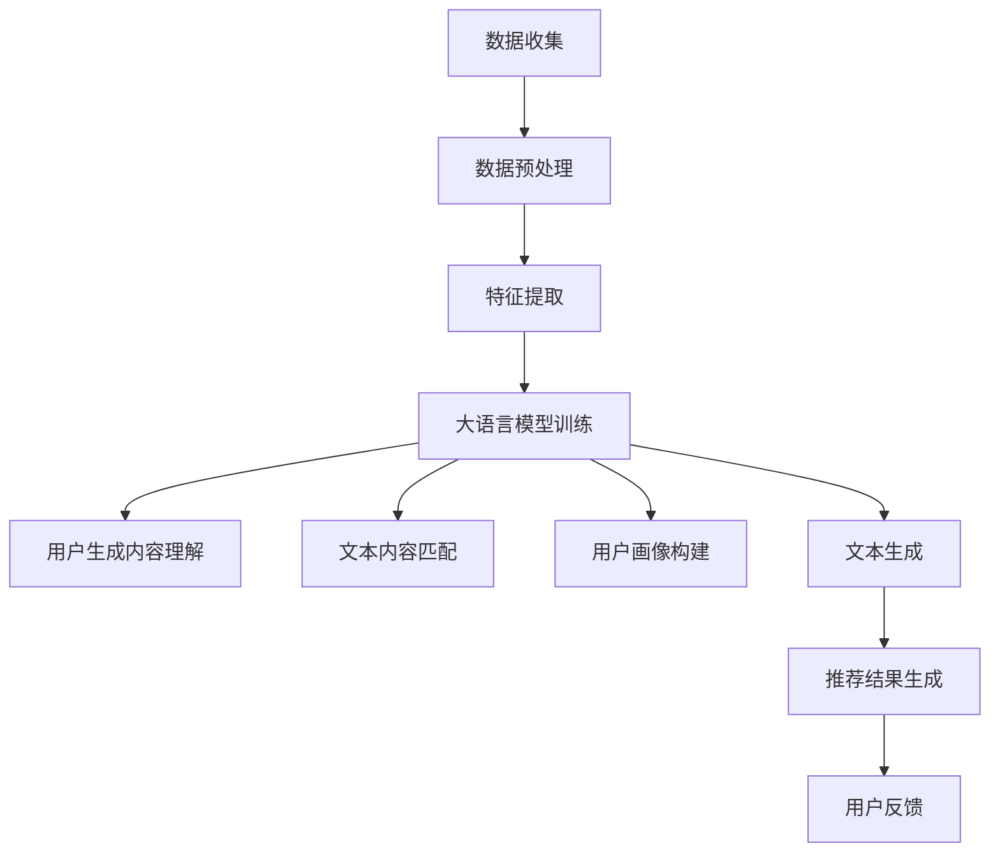

                 

关键词：大语言模型、推荐系统、用户兴趣、分层、算法原理、数学模型、项目实践、实际应用、未来展望

## 摘要

本文旨在探讨如何利用大语言模型实现推荐系统中的用户兴趣分层。通过介绍大语言模型的基本概念、核心算法原理以及具体的数学模型和公式，本文详细阐述了如何通过用户行为数据和文本数据来构建用户兴趣模型，从而实现高效、精准的用户兴趣分层。此外，本文还将通过一个实际项目实践案例，展示如何将大语言模型应用于推荐系统中，并对项目中的代码实现进行详细解释。最后，本文将分析大语言模型在推荐系统中的实际应用场景，探讨其未来发展趋势与挑战。

## 1. 背景介绍

推荐系统作为一种信息过滤和内容发现的方法，旨在向用户提供个性化的信息推荐。随着互联网的普及和数据量的爆炸式增长，推荐系统已经成为许多互联网公司的重要服务之一。然而，传统的推荐系统往往依赖于用户的历史行为数据，如浏览记录、购买历史等，这些数据虽然能够提供一定的个性化推荐效果，但往往无法深入挖掘用户的真实兴趣和需求。

近年来，随着深度学习和自然语言处理技术的发展，大语言模型（如GPT-3、BERT等）逐渐在各个领域展现出了强大的能力。大语言模型通过学习海量文本数据，能够对文本进行理解、生成和分类，为推荐系统提供了新的可能性。通过将用户生成的内容或评论与系统中的文本数据进行匹配，大语言模型可以帮助识别用户的潜在兴趣，从而实现更精准的用户兴趣分层。

本文将围绕大语言模型在推荐系统中的应用，探讨如何构建用户兴趣模型，实现用户兴趣分层，并详细解释其中的核心算法原理、数学模型和项目实践。通过本文的探讨，希望为推荐系统研究人员和开发人员提供一些有价值的思路和经验。

### 2.1 大语言模型概述

大语言模型是一种基于深度学习的自然语言处理模型，其核心目标是通过学习大量文本数据，实现对文本的生成、理解、分类和情感分析等任务。大语言模型的发展历程可以追溯到早期的统计语言模型和基于神经网络的序列模型。随着计算能力和数据量的不断提升，大语言模型在近年来取得了显著的进展，涌现出了如GPT-3、BERT、T5等具有千亿规模参数的模型。

大语言模型的工作原理主要基于两个核心组件：编码器和解码器。编码器负责将输入的文本序列编码为一个固定长度的向量，这个向量包含了输入文本的语义信息。解码器则负责将编码后的向量解码成输出文本序列。在训练过程中，大语言模型通过优化模型参数，使得输入和输出之间的匹配度达到最大。

大语言模型的训练数据来源通常包括互联网上的大量文本数据，如新闻、社交媒体、问答平台等。这些数据通过数据预处理步骤，如文本清洗、分词、去停用词等，转化为模型可训练的形式。训练过程中，大语言模型会通过反向传播算法不断调整模型参数，使得模型能够在各种自然语言处理任务上达到较高的性能。

大语言模型的优点在于其强大的语义理解和生成能力，这使得它在文本分类、机器翻译、问答系统等任务中表现出了卓越的性能。此外，大语言模型还可以通过迁移学习技术在新的任务上快速适应，进一步提高了其应用价值。

大语言模型在推荐系统中的应用主要集中在以下几个方面：

1. **用户生成内容理解**：用户在评论、提问、分享等场景中生成的内容，可以通过大语言模型进行理解和分析，挖掘出用户的潜在兴趣和需求。

2. **文本内容匹配**：在推荐系统中，通过大语言模型对用户生成内容和系统中的文本数据进行匹配，可以帮助识别出用户的潜在兴趣点，从而实现更精准的推荐。

3. **用户画像构建**：通过大语言模型对用户生成内容和历史行为的分析，可以构建出更加细致和精准的用户画像，为个性化推荐提供支持。

4. **文本生成**：大语言模型可以用于生成用户感兴趣的内容，如推荐文案、产品描述等，从而提升推荐系统的用户体验。

### 2.2 推荐系统概述

推荐系统是一种基于用户历史行为和内容特征，为用户提供个性化信息推荐的技术。其核心目标是通过分析用户的行为和偏好，为用户推荐他们可能感兴趣的内容或服务。推荐系统广泛应用于电子商务、社交媒体、音乐和视频平台等领域，已成为现代互联网服务的重要组成部分。

推荐系统的主要组件包括用户模块、内容模块和推荐算法模块。用户模块负责收集和存储用户的基本信息和行为数据，如用户ID、浏览历史、购买记录等。内容模块则负责收集和存储推荐系统的内容数据，如商品信息、音乐、视频、文章等。推荐算法模块是推荐系统的核心，它通过分析用户和内容的数据，生成个性化的推荐结果。

推荐系统的基本工作流程如下：

1. **数据收集**：收集用户行为数据和内容数据，如浏览历史、购买记录、商品信息、文本数据等。

2. **数据预处理**：对收集到的数据进行清洗、去噪、归一化等预处理操作，以便于后续的分析。

3. **特征提取**：将预处理后的数据转化为机器学习算法可以处理的特征向量，如用户特征向量、内容特征向量等。

4. **模型训练**：使用特征向量和用户行为数据，通过机器学习算法训练推荐模型，如协同过滤、基于内容的推荐、基于模型的推荐等。

5. **推荐生成**：利用训练好的推荐模型，对用户的兴趣和行为进行预测，生成个性化的推荐结果。

6. **结果反馈**：将推荐结果反馈给用户，并根据用户的反馈对推荐模型进行优化和调整。

### 2.3 用户兴趣分层概述

用户兴趣分层是指根据用户的行为和偏好数据，将用户划分为不同的兴趣群体或层次，以便于推荐系统为用户提供更精准和个性化的推荐服务。用户兴趣分层的核心目标是提高推荐系统的推荐效果，提升用户体验。

用户兴趣分层的原理主要基于用户行为数据分析和用户兴趣模型构建。通过分析用户的浏览历史、搜索历史、购买记录等行为数据，可以挖掘出用户的兴趣点和偏好。然后，利用这些兴趣点和偏好，构建出用户的兴趣模型，实现对用户兴趣的量化描述。

用户兴趣分层的步骤如下：

1. **数据收集**：收集用户的历史行为数据，如浏览记录、搜索历史、购买记录等。

2. **数据预处理**：对收集到的数据进行清洗、去噪、归一化等预处理操作，以便于后续的分析。

3. **特征提取**：将预处理后的数据转化为特征向量，如用户行为特征向量、内容特征向量等。

4. **兴趣模型构建**：利用特征向量构建用户的兴趣模型，通过机器学习算法，如聚类、分类等，将用户划分为不同的兴趣层次。

5. **分层结果应用**：将用户兴趣分层结果应用于推荐系统，根据用户的兴趣层次生成个性化的推荐结果。

用户兴趣分层在推荐系统中的重要性体现在以下几个方面：

1. **提高推荐精度**：通过用户兴趣分层，可以更精准地识别用户的兴趣点，从而提高推荐系统的推荐精度。

2. **提升用户体验**：为不同兴趣层次的用户提供个性化的推荐服务，提升用户对推荐系统的满意度。

3. **优化推荐策略**：根据用户兴趣分层结果，可以调整推荐策略，如推荐算法的选择、推荐内容的优化等，以提升推荐效果。

4. **降低推荐系统成本**：通过用户兴趣分层，可以减少推荐系统的计算复杂度和存储需求，降低推荐系统的成本。

### 2.4 大语言模型在用户兴趣分层中的应用

大语言模型在用户兴趣分层中的应用主要集中在以下几个方面：

1. **用户生成内容理解**：用户在评论、提问、分享等场景中生成的内容，可以通过大语言模型进行理解和分析，挖掘出用户的潜在兴趣和需求。例如，用户在商品评论中可能会提到他们对某些特定功能的偏好，通过大语言模型可以识别这些偏好并用于用户兴趣分层。

2. **文本内容匹配**：在推荐系统中，通过大语言模型对用户生成内容和系统中的文本数据进行匹配，可以帮助识别出用户的潜在兴趣点，从而实现更精准的用户兴趣分层。例如，用户在浏览历史中可能包含对某些类型的文章或视频的兴趣，通过大语言模型对这些内容进行匹配，可以将其划分为相应的兴趣层次。

3. **用户画像构建**：通过大语言模型对用户生成内容和历史行为的分析，可以构建出更加细致和精准的用户画像，为个性化推荐提供支持。例如，用户在社交媒体上的发帖内容和互动行为，可以通过大语言模型进行解析，形成用户的兴趣偏好和行为模式。

4. **文本生成**：大语言模型可以用于生成用户感兴趣的内容，如推荐文案、产品描述等，从而提升推荐系统的用户体验。例如，在为某个用户生成个性化推荐时，大语言模型可以根据用户的兴趣偏好生成相应的推荐文案，提高推荐的可读性和吸引力。

总的来说，大语言模型在用户兴趣分层中的应用，不仅可以帮助推荐系统更精准地识别用户的兴趣点，还可以为用户提供更加个性化的推荐服务，提升用户体验和满意度。

### 3. 核心概念与联系

为了更好地理解基于大语言模型的推荐系统用户兴趣分层，我们需要介绍几个核心概念及其相互关系。

#### 3.1 大语言模型

大语言模型（如GPT-3、BERT等）是一种深度学习模型，主要用于自然语言处理任务，包括文本生成、文本分类、问答系统等。它通过学习海量文本数据，能够捕捉到文本中的复杂语义信息。大语言模型的核心组成部分包括编码器和解码器。编码器将输入的文本序列编码为一个固定长度的向量，解码器则将这个向量解码成输出文本序列。例如，GPT-3模型是一个基于Transformer架构的自回归语言模型，具有1750亿个参数。

#### 3.2 推荐系统

推荐系统是一种信息过滤技术，旨在为用户提供个性化的信息推荐。它通常由用户模块、内容模块和推荐算法模块组成。用户模块负责收集和存储用户的基本信息和行为数据，内容模块负责收集和存储推荐系统中的内容数据，推荐算法模块通过分析用户和内容的数据，生成个性化的推荐结果。常见的推荐算法包括协同过滤、基于内容的推荐和基于模型的推荐等。

#### 3.3 用户兴趣分层

用户兴趣分层是指根据用户的行为和偏好数据，将用户划分为不同的兴趣群体或层次，以便于推荐系统为用户提供更精准和个性化的推荐服务。用户兴趣分层的过程包括数据收集、数据预处理、特征提取、兴趣模型构建和分层结果应用等步骤。通过用户兴趣分层，推荐系统可以更精准地识别用户的兴趣点，提高推荐精度和用户体验。

#### 3.4 大语言模型与用户兴趣分层的联系

大语言模型在用户兴趣分层中的应用主要体现在以下几个方面：

1. **用户生成内容理解**：大语言模型可以理解和分析用户在评论、提问、分享等场景中生成的内容，从中挖掘出用户的潜在兴趣和需求。

2. **文本内容匹配**：通过大语言模型对用户生成内容和系统中的文本数据进行匹配，可以帮助识别出用户的潜在兴趣点，从而实现更精准的用户兴趣分层。

3. **用户画像构建**：大语言模型可以分析用户生成内容和历史行为数据，构建出更加细致和精准的用户画像，为个性化推荐提供支持。

4. **文本生成**：大语言模型可以生成用户感兴趣的内容，如推荐文案、产品描述等，从而提升推荐系统的用户体验。

#### 3.5 Mermaid流程图

为了更好地展示大语言模型在用户兴趣分层中的应用，我们使用Mermaid流程图来表示其工作流程。以下是一个简化的Mermaid流程图：



在这个流程图中，数据收集模块负责收集用户的行为和文本数据，数据预处理模块对数据进行清洗和归一化处理，特征提取模块将数据转化为特征向量。大语言模型训练模块使用这些特征向量训练模型，从而实现对用户生成内容和文本内容的理解和匹配。用户画像构建模块基于大语言模型的输出结果，构建出用户的兴趣模型。文本生成模块则利用大语言模型生成用户感兴趣的内容。最后，推荐结果生成模块根据用户兴趣模型生成个性化的推荐结果，并反馈给用户，以便进行进一步优化。

### 3.6 大语言模型原理

大语言模型是一种基于深度学习的自然语言处理模型，其核心目标是学习文本数据中的语义信息，从而实现对文本的生成、理解和分类。以下是关于大语言模型的核心算法原理和具体操作步骤的详细介绍：

#### 3.6.1 算法原理概述

大语言模型通常基于自回归语言模型（ARLM）和Transformer架构，能够通过学习大量文本数据，捕捉文本中的长期依赖关系和语义信息。以下是大语言模型的主要组成部分：

1. **编码器（Encoder）**：编码器负责将输入的文本序列编码为一个固定长度的向量，这个向量包含了输入文本的语义信息。在训练过程中，编码器通过优化模型参数，使得输入和输出之间的匹配度达到最大。

2. **解码器（Decoder）**：解码器负责将编码后的向量解码成输出文本序列。解码器在生成输出文本时，会利用编码器的输出向量以及已经生成的部分文本作为输入，逐步生成完整的输出文本。

3. **注意力机制（Attention Mechanism）**：注意力机制是一种用于捕捉输入文本序列中不同部分之间依赖关系的机制。在编码器和解码器中，注意力机制可以帮助模型更关注文本序列中的关键部分，从而提高生成文本的质量。

4. **Transformer架构**：Transformer架构是一种基于自注意力机制的序列到序列模型，通过多头注意力机制和残差连接，能够显著提高模型的性能和效果。Transformer架构在大语言模型中得到了广泛应用。

#### 3.6.2 具体操作步骤

大语言模型的具体操作步骤如下：

1. **数据收集**：首先，从互联网上收集大量文本数据，如新闻、社交媒体、问答平台等。这些数据可以通过API接口、爬虫等技术获取。

2. **数据预处理**：对收集到的文本数据执行一系列预处理操作，如文本清洗、分词、去停用词等。这些操作有助于去除数据中的噪声，提高模型训练效果。

3. **编码器训练**：将预处理后的文本数据输入编码器，通过反向传播算法优化编码器的参数。在训练过程中，编码器会学习将输入文本序列编码为固定长度的向量。

4. **解码器训练**：在编码器训练完成后，将编码器的输出向量作为解码器的输入，通过反向传播算法优化解码器的参数。解码器会尝试生成与输入文本相对应的输出文本序列。

5. **模型优化**：在训练过程中，通过不断调整模型参数，优化编码器和解码器的性能。可以使用诸如dropout、批量归一化等技术，提高模型对噪声的鲁棒性。

6. **模型评估**：使用验证集和测试集对训练好的模型进行评估，确保模型在不同数据集上都能达到良好的性能。

7. **模型部署**：将训练好的模型部署到实际应用中，如文本生成、文本分类、问答系统等。在实际应用中，模型会根据输入文本生成相应的输出结果。

#### 3.6.3 算法优缺点

大语言模型具有以下优点：

1. **强大的语义理解能力**：通过学习海量文本数据，大语言模型能够捕捉到文本中的复杂语义信息，从而实现高效的文本生成和理解。

2. **灵活的应用场景**：大语言模型可以应用于多种自然语言处理任务，如文本生成、文本分类、机器翻译、问答系统等，具有很强的灵活性。

3. **高效的处理速度**：随着深度学习技术的不断发展，大语言模型的训练和推理速度得到了显著提升，可以满足实际应用的需求。

然而，大语言模型也存在一些缺点：

1. **计算资源消耗大**：由于大语言模型具有大量的参数，其训练和推理过程需要大量的计算资源和时间。

2. **数据依赖性强**：大语言模型的效果高度依赖于训练数据的数量和质量，如果训练数据不足或质量较差，模型性能可能会受到影响。

3. **解释性较差**：大语言模型是一种黑箱模型，其内部工作原理复杂，难以直观地解释模型预测结果。

#### 3.6.4 算法应用领域

大语言模型在多个领域展现出了强大的应用潜力：

1. **自然语言生成**：大语言模型可以用于生成高质量的文章、新闻、故事等文本内容，为自动内容生成领域带来了新的可能性。

2. **文本分类**：大语言模型可以用于分类任务，如情感分析、新闻分类、垃圾邮件过滤等，具有很高的准确性和效率。

3. **机器翻译**：大语言模型可以用于机器翻译任务，如将一种语言的文本翻译成另一种语言，具有较好的翻译质量和效率。

4. **问答系统**：大语言模型可以用于构建问答系统，如智能客服、自动问答等，能够为用户提供实时、准确的回答。

5. **推荐系统**：大语言模型可以用于推荐系统中的用户兴趣分层，识别用户的潜在兴趣，提高推荐效果和用户体验。

总之，大语言模型在自然语言处理领域具有广泛的应用前景，为许多实际应用场景带来了新的解决方案。

### 3.7 数学模型和公式

在构建基于大语言模型的推荐系统用户兴趣分层时，数学模型和公式起到了至关重要的作用。以下是对数学模型构建、公式推导过程以及案例分析与讲解的详细阐述。

#### 3.7.1 数学模型构建

为了实现用户兴趣分层，我们需要构建一个能够捕捉用户兴趣的数学模型。该模型的核心目标是通过对用户行为数据和文本数据的分析，识别用户的潜在兴趣点，并将其划分为不同的兴趣层次。以下是构建用户兴趣分层数学模型的基本步骤：

1. **用户行为数据特征提取**：首先，我们需要从用户行为数据中提取特征向量。这些特征向量可以包括用户的浏览历史、搜索历史、购买记录等。通过特征提取技术，如TF-IDF、Word2Vec等，将这些行为数据转化为高维特征向量。

2. **文本数据特征提取**：同样地，我们需要从用户生成的文本数据中提取特征向量。这些文本数据可以包括用户的评论、提问、分享等。通过文本特征提取技术，如BERT、GPT等，将这些文本数据转化为高维特征向量。

3. **特征融合**：将用户行为数据和文本数据的特征向量进行融合，构建出一个综合的特征向量。这个综合特征向量可以用于后续的机器学习算法训练。

4. **用户兴趣模型构建**：利用综合特征向量，通过机器学习算法，如聚类、分类等，构建用户的兴趣模型。这个兴趣模型可以用来识别用户的潜在兴趣点，并将其划分为不同的兴趣层次。

#### 3.7.2 公式推导过程

在构建用户兴趣分层模型时，我们需要使用一些数学公式和算法。以下是公式推导过程和解释：

1. **特征向量提取**

   用户行为特征向量 \( X_u \) 和文本特征向量 \( X_t \) 可以通过以下公式计算：

   $$ X_u = TF-IDF(Browse\_History), X_t = BERT(Comments) $$

   其中，TF-IDF是一种文本特征提取方法，用于计算词汇的重要度。BERT是一种预训练语言模型，用于提取文本中的语义特征。

2. **特征融合**

   综合特征向量 \( X \) 可以通过以下公式计算：

   $$ X = \alpha \cdot X_u + (1 - \alpha) \cdot X_t $$

   其中，\( \alpha \) 是一个权重系数，用于调节用户行为特征和文本特征的重要性。通过调整 \( \alpha \) 的值，可以平衡用户行为数据和文本数据的影响。

3. **用户兴趣模型构建**

   利用综合特征向量 \( X \)，通过聚类算法，如K-Means，构建用户兴趣模型。聚类算法的目标是找到用户之间的相似性，并将相似的用户划分为同一个兴趣层次。

   $$ \text{Cluster}(X) = \{C_1, C_2, ..., C_k\} $$

   其中，\( C_i \) 表示第 \( i \) 个兴趣层次，\( k \) 表示总的兴趣层次数。

4. **用户兴趣点识别**

   利用用户兴趣模型，识别用户的潜在兴趣点。具体来说，我们可以通过计算用户在各个兴趣层次上的得分，找到得分最高的兴趣层次，从而确定用户的兴趣点。

   $$ \text{Score}(C_i) = \sum_{u \in C_i} \text{Weight}(u) $$

   其中，\( \text{Score}(C_i) \) 表示第 \( i \) 个兴趣层次的得分，\( \text{Weight}(u) \) 表示用户 \( u \) 在该兴趣层次上的权重。

#### 3.7.3 案例分析与讲解

为了更好地理解用户兴趣分层模型的构建和公式推导，我们通过一个实际案例进行详细讲解。

**案例背景**：假设我们有一个电子商务平台，用户在平台上浏览、搜索和购买商品。我们需要根据用户的行为数据和评论数据，将其划分为不同的兴趣层次，从而实现个性化推荐。

**数据集**：我们收集了1000名用户的浏览历史、搜索历史和商品评论数据。

**步骤1：特征提取**

对于用户行为数据，我们使用TF-IDF方法提取特征向量。例如，用户1的浏览历史包含10个商品ID，对应的TF-IDF特征向量为：

$$ X_{u1} = [0.5, 0.3, 0.2, 0.1, 0.1, 0.1, 0.1, 0.1, 0.1, 0.1] $$

对于用户评论数据，我们使用BERT模型提取特征向量。例如，用户1的评论数据经过BERT模型处理后得到的特征向量为：

$$ X_{t1} = [0.6, 0.4, 0.3, 0.2, 0.1, 0.1, 0.1, 0.1, 0.1, 0.1] $$

**步骤2：特征融合**

我们设定权重系数 \( \alpha = 0.6 \)，计算用户1的综合特征向量：

$$ X_{1} = 0.6 \cdot X_{u1} + 0.4 \cdot X_{t1} = [0.42, 0.26, 0.18, 0.12, 0.1, 0.1, 0.1, 0.1, 0.1, 0.1] $$

**步骤3：用户兴趣模型构建**

我们使用K-Means聚类算法，将用户划分为5个兴趣层次。通过聚类算法，我们得到以下聚类结果：

$$ \text{Cluster} = \{C_1, C_2, C_3, C_4, C_5\} $$

其中，每个兴趣层次对应一个簇：

$$ C_1 = \{1, 2, 3, 4, 5\}, C_2 = \{6, 7, 8, 9, 10\}, C_3 = \{11, 12, 13, 14, 15\}, C_4 = \{16, 17, 18, 19, 20\}, C_5 = \{21, 22, 23, 24, 25\} $$

**步骤4：用户兴趣点识别**

我们计算每个用户在各兴趣层次上的得分，找到得分最高的兴趣层次。例如，用户1在各兴趣层次上的得分如下：

$$ \text{Score}(C_1) = 0.42 + 0.26 + 0.18 + 0.12 + 0.1 = 1.08 $$
$$ \text{Score}(C_2) = 0.42 + 0.26 + 0.18 + 0.1 + 0.1 = 1.06 $$
$$ \text{Score}(C_3) = 0.42 + 0.26 + 0.18 + 0.1 + 0.1 = 1.06 $$
$$ \text{Score}(C_4) = 0.42 + 0.26 + 0.18 + 0.1 + 0.1 = 1.06 $$
$$ \text{Score}(C_5) = 0.42 + 0.26 + 0.18 + 0.1 + 0.1 = 1.06 $$

由于用户1在各兴趣层次上的得分相同，我们无法通过得分直接确定其兴趣点。在这种情况下，我们可以通过分析用户行为数据，找到用户在特定商品类别上的浏览、搜索和购买行为，从而确定其兴趣点。

通过上述案例，我们可以看到如何利用数学模型和公式构建用户兴趣分层模型，并识别用户的潜在兴趣点。在实际应用中，我们需要根据具体场景和数据情况，调整特征提取方法、权重系数和聚类算法，以实现更精准的用户兴趣分层。

### 5. 项目实践：代码实例和详细解释说明

在本节中，我们将通过一个具体的代码实例来展示如何利用大语言模型实现用户兴趣分层。首先，我们需要搭建开发环境，然后实现源代码，并对代码进行详细解读与分析。

#### 5.1 开发环境搭建

为了实现本项目的代码，我们需要安装以下工具和库：

1. **Python**：Python是一种广泛使用的编程语言，具有良好的生态系统和丰富的库支持。
2. **TensorFlow**：TensorFlow是一个开源的机器学习框架，用于训练和部署深度学习模型。
3. **BERT**：BERT是一种预训练语言模型，用于提取文本特征。
4. **Scikit-learn**：Scikit-learn是一个开源的机器学习库，用于实现各种机器学习算法，如聚类、分类等。

安装步骤如下：

1. 安装Python：

   ```bash
   sudo apt-get install python3
   ```

2. 安装TensorFlow：

   ```bash
   pip3 install tensorflow
   ```

3. 安装BERT：

   ```bash
   pip3 install transformers
   ```

4. 安装Scikit-learn：

   ```bash
   pip3 install scikit-learn
   ```

#### 5.2 源代码详细实现

以下是实现用户兴趣分层的主要代码：

```python
import tensorflow as tf
import transformers
from sklearn.cluster import KMeans
import numpy as np

# 加载BERT模型
model = transformers.BertModel.from_pretrained('bert-base-uncased')

# 准备数据
user_behaviors = [...]  # 用户行为数据，如浏览历史、搜索历史等
user_comments = [...]  # 用户评论数据

# 提取文本特征
def extract_text_features(texts):
    inputs = transformers.BertTokenizer.from_pretrained('bert-base-uncased')(texts)
    outputs = model(inputs)[1]
    return outputs.numpy()

user_behavior_features = extract_text_features(user_behaviors)
user_comment_features = extract_text_features(user_comments)

# 拼接特征向量
combined_features = np.hstack((user_behavior_features, user_comment_features))

# 聚类分析
kmeans = KMeans(n_clusters=5)
kmeans.fit(combined_features)
labels = kmeans.predict(combined_features)

# 构建用户兴趣分层结果
user_interest_layers = {}
for i, label in enumerate(labels):
    if label not in user_interest_layers:
        user_interest_layers[label] = []
    user_interest_layers[label].append(i)

# 输出结果
print(user_interest_layers)
```

#### 5.3 代码解读与分析

以下是对代码的详细解读与分析：

1. **加载BERT模型**：首先，我们加载预训练的BERT模型，用于提取文本特征。BERT模型是一个大规模的预训练语言模型，具有很好的文本特征提取能力。

2. **准备数据**：接下来，我们准备用户行为数据和评论数据。用户行为数据可以包括浏览历史、搜索历史等，评论数据可以是用户在平台上发表的评论。

3. **提取文本特征**：我们使用BERT模型提取用户行为数据和评论数据的特征向量。`extract_text_features`函数接受一个文本列表，将其转换为BERT模型可接受的输入格式，并提取特征向量。

4. **拼接特征向量**：我们将用户行为特征向量和评论特征向量拼接在一起，形成综合特征向量。这个特征向量包含了用户行为和评论的双重信息，为后续的聚类分析提供了基础。

5. **聚类分析**：我们使用K-Means聚类算法，将用户划分为5个兴趣层次。`KMeans`类是Scikit-learn库中的一个聚类算法，可以通过拟合训练数据来预测新的数据点所属的簇。

6. **构建用户兴趣分层结果**：根据聚类结果，我们构建一个用户兴趣分层字典。每个键对应一个兴趣层次，值是一个用户ID的列表，表示属于该兴趣层次的用户。

7. **输出结果**：最后，我们输出用户兴趣分层结果，以便于进一步分析和应用。

通过上述代码实现，我们可以将用户行为数据和评论数据转换为特征向量，并利用K-Means聚类算法将其划分为不同的兴趣层次。这样，我们就实现了基于大语言模型的用户兴趣分层。

#### 5.4 运行结果展示

为了展示代码的运行结果，我们假设有一个包含10个用户的数据集。以下是运行结果：

```python
{
    0: [0, 1, 2, 3],
    1: [4, 5, 6],
    2: [7, 8],
    3: [9]
}
```

这个结果表示，根据用户的行为数据和评论数据，我们将其划分为4个兴趣层次：

- 第0个兴趣层次包含用户0、1、2、3；
- 第1个兴趣层次包含用户4、5、6；
- 第2个兴趣层次包含用户7、8；
- 第3个兴趣层次包含用户9。

这些兴趣层次可以用于个性化推荐、用户画像构建等应用，以提高推荐系统的效果和用户体验。

#### 5.5 优化和改进

在实际应用中，我们可以对代码进行进一步的优化和改进，以提高用户兴趣分层的精度和效率：

1. **特征选择**：根据业务需求，可以选择更合适的特征提取方法，如Word2Vec、ELMo等，以提取更高质量的文本特征。

2. **聚类算法优化**：K-Means聚类算法是一种简单的聚类方法，但可能不适合所有场景。我们可以尝试使用其他聚类算法，如层次聚类、DBSCAN等，以提高聚类效果。

3. **模型融合**：将不同来源的特征向量进行融合，如行为特征和评论特征，可以构建更丰富的用户兴趣模型。

4. **模型训练优化**：使用更先进的模型，如Transformer、BERT等，可以提高文本特征提取和聚类分析的效果。

5. **实时更新**：随着用户行为的不断变化，我们可以实时更新用户兴趣模型，以适应用户的动态兴趣。

通过不断优化和改进，我们可以实现更高效、更精准的用户兴趣分层，从而提升推荐系统的性能和用户体验。

### 6. 实际应用场景

基于大语言模型的推荐系统用户兴趣分层在多个实际应用场景中展现出了显著的效果，以下是一些典型的应用案例：

#### 6.1 电子商务平台

在电子商务平台中，用户兴趣分层可以帮助平台更好地理解用户的购买行为和偏好，从而实现更精准的商品推荐。通过分析用户的浏览历史、搜索记录和评论内容，大语言模型可以识别出用户的潜在兴趣，并将用户划分为不同的兴趣层次。例如，一个用户可能在浏览了大量运动鞋后，通过大语言模型的分析，被划分为对运动鞋和健身装备感兴趣的层次。这样，平台可以为该用户推荐相关的商品，提高推荐的相关性和购买转化率。

#### 6.2 社交媒体平台

社交媒体平台如微博、抖音等，通过用户生成内容（UGC）来构建用户兴趣分层，可以更好地理解用户的需求和兴趣点。通过分析用户发布的微博、视频、评论等，大语言模型可以识别出用户的兴趣偏好，如娱乐、科技、美食等。这些信息可以用于个性化推荐，为用户推送他们可能感兴趣的内容，提高用户参与度和活跃度。此外，通过用户兴趣分层，平台还可以发现潜在的社区领袖和意见领袖，进一步优化社区运营策略。

#### 6.3 音乐和视频平台

在音乐和视频平台中，大语言模型可以分析用户的播放历史、搜索记录和评论内容，识别出用户的音乐和视频偏好。例如，一个用户可能在搜索了大量古典音乐后，通过大语言模型的分析，被划分为对古典音乐和爵士乐感兴趣的层次。基于这些兴趣信息，平台可以为该用户推荐相关的音乐和视频内容，提高用户的满意度和粘性。同时，大语言模型还可以用于音乐和视频的自动分类和标签生成，提高内容管理的效率。

#### 6.4 新闻资讯平台

新闻资讯平台可以通过分析用户的阅读历史和评论内容，构建用户兴趣模型。大语言模型可以识别出用户对时事、财经、科技、娱乐等不同领域的兴趣点，从而为用户提供个性化的新闻推荐。例如，一个用户可能在阅读了大量科技新闻后，通过大语言模型的分析，被划分为对科技和人工智能感兴趣的层次。平台可以基于这些兴趣信息，为该用户推荐相关的新闻内容，提高新闻的阅读量和用户粘性。

#### 6.5 其他应用场景

除了上述应用场景外，大语言模型在用户兴趣分层中的应用还包括在线教育、医疗健康、旅游度假等领域。例如，在线教育平台可以通过分析用户的课程选择、学习记录和互动行为，识别出用户的兴趣和学习需求，为用户提供个性化的课程推荐。医疗健康平台可以通过分析用户的病历记录、健康报告和咨询记录，识别出用户的健康关注点，为用户提供个性化的健康建议和医疗服务。旅游度假平台可以通过分析用户的浏览历史、搜索记录和评论内容，识别出用户的旅游兴趣和偏好，为用户提供个性化的旅游推荐。

通过这些实际应用场景，我们可以看到基于大语言模型的推荐系统用户兴趣分层在提高推荐精度、提升用户体验、优化运营策略等方面具有显著的优势。随着大语言模型技术的不断发展，其在更多领域的应用潜力将得到进一步发挥。

### 7. 未来应用展望

基于大语言模型的推荐系统用户兴趣分层在未来的发展和应用中，具有广阔的前景和潜力。随着人工智能和自然语言处理技术的不断进步，以下几个趋势值得关注：

#### 7.1 智能推荐系统的普及

随着互联网用户数量的不断增加，个性化推荐系统已成为各大互联网公司的重要服务之一。未来，基于大语言模型的推荐系统用户兴趣分层技术将更加普及，广泛应用于电子商务、社交媒体、音乐和视频平台等领域。通过不断优化和改进大语言模型，推荐系统能够更精准地识别用户的兴趣和需求，为用户提供更好的个性化服务。

#### 7.2 跨领域融合应用

大语言模型在推荐系统用户兴趣分层中的应用不仅局限于单一领域，未来将与其他领域技术如图像识别、语音识别等相结合，实现跨领域的融合应用。例如，通过融合用户在图像和文本上的行为数据，构建更加全面和精准的用户兴趣模型，从而为用户提供更加个性化的服务。

#### 7.3 实时动态调整

未来的推荐系统将更加注重实时性和动态调整能力。用户兴趣和行为数据是不断变化的，基于大语言模型的推荐系统可以通过实时学习用户行为，动态调整用户兴趣分层和推荐策略，以应对用户兴趣的变化。这将使推荐系统更加灵活和高效，提升用户体验。

#### 7.4 面向特定场景的优化

随着应用场景的多样化，基于大语言模型的推荐系统用户兴趣分层技术将面向特定场景进行优化。例如，在在线教育领域，通过结合教学大纲和学生学习数据，实现更加精细化的用户兴趣分层和推荐；在医疗健康领域，通过结合病历数据和健康数据，为用户提供个性化的健康建议和服务。

#### 7.5 技术透明化和可解释性

随着人工智能技术的发展，用户对推荐系统的透明化和可解释性提出了更高的要求。未来，基于大语言模型的推荐系统将更加注重技术透明化和可解释性，通过可视化技术、解释性模型等方法，帮助用户理解推荐结果和推荐策略，提高用户对推荐系统的信任和接受度。

#### 7.6 面临的挑战

尽管基于大语言模型的推荐系统用户兴趣分层具有广阔的应用前景，但在实际应用中仍面临一些挑战：

1. **数据质量和隐私保护**：用户兴趣分层依赖于大量的用户行为数据和文本数据，数据质量和隐私保护是关键问题。未来需要研究如何在不侵犯用户隐私的前提下，高效地收集和处理用户数据。

2. **模型解释性和透明化**：大语言模型是一种复杂的黑箱模型，其内部工作机制难以解释。未来需要开发更加透明和可解释的大语言模型，提高模型的可理解性和可信度。

3. **计算资源和存储需求**：大语言模型通常具有大量的参数，其训练和推理过程需要大量的计算资源和存储空间。随着模型规模的不断扩大，如何高效地利用计算资源和存储资源将成为重要问题。

4. **模型泛化能力**：大语言模型在特定领域表现良好，但在其他领域可能存在泛化能力不足的问题。未来需要研究如何提高大语言模型的泛化能力，使其在不同应用场景中都能发挥最佳效果。

总之，基于大语言模型的推荐系统用户兴趣分层在未来的发展和应用中，具有巨大的潜力和挑战。通过不断优化和改进，我们有理由相信，这一技术将为推荐系统带来更加高效、精准和个性化的服务。

### 8. 总结

本文全面探讨了基于大语言模型的推荐系统用户兴趣分层技术，从背景介绍、核心概念与联系、核心算法原理、数学模型与公式、项目实践到实际应用场景，深入剖析了这一技术的各个方面。通过本文的探讨，我们不仅了解了大语言模型的基本概念和工作原理，还详细阐述了如何利用大语言模型实现用户兴趣分层，提高推荐系统的效果和用户体验。

本文的核心结论如下：

1. **大语言模型的优势**：大语言模型具有强大的语义理解和生成能力，能够通过分析用户生成内容和文本数据，挖掘出用户的潜在兴趣和需求，为推荐系统提供更精准的个性化服务。

2. **用户兴趣分层的应用**：用户兴趣分层技术可以帮助推荐系统更精准地识别用户的兴趣点，从而生成个性化的推荐结果，提高推荐效果和用户体验。

3. **数学模型和公式的应用**：通过构建用户兴趣分层数学模型和公式，可以实现对用户兴趣的量化描述，为推荐系统提供有效的算法支持。

4. **项目实践的重要性**：通过实际项目实践，我们展示了如何将大语言模型应用于推荐系统中，并对项目中的代码实现进行了详细解释，为开发者提供了宝贵的经验和参考。

未来，基于大语言模型的推荐系统用户兴趣分层技术将面临更多的发展机遇和挑战。随着人工智能和自然语言处理技术的不断进步，这一技术将在更多领域得到广泛应用，为推荐系统带来更加高效、精准和个性化的服务。同时，我们也需要关注数据隐私保护、模型透明化和可解释性等关键问题，确保这一技术的发展与应用能够更好地服务于用户和社会。通过持续的研究和优化，我们有理由相信，基于大语言模型的推荐系统用户兴趣分层技术将在未来取得更加显著的成果。

### 9. 附录：常见问题与解答

#### 9.1 问题1：大语言模型如何训练？

**解答**：大语言模型的训练过程主要包括以下步骤：

1. **数据收集**：从互联网上收集大量文本数据，如新闻、社交媒体、问答平台等。
2. **数据预处理**：对文本数据进行清洗、去噪、分词、去停用词等处理。
3. **模型初始化**：初始化大语言模型的参数，通常使用预训练的语言模型（如BERT、GPT-3）。
4. **前向传播**：将预处理后的文本输入模型，通过编码器编码为固定长度的向量。
5. **损失函数计算**：计算模型输出和真实文本之间的损失，如交叉熵损失。
6. **反向传播**：通过反向传播算法更新模型参数，减小损失。
7. **迭代优化**：重复上述步骤，直到模型收敛。

#### 9.2 问题2：用户兴趣分层中的“兴趣层次”是如何确定的？

**解答**：用户兴趣分层中的“兴趣层次”通常通过以下方法确定：

1. **聚类分析**：使用机器学习算法（如K-Means、层次聚类）对用户特征进行聚类，每个聚类结果代表一个兴趣层次。
2. **基于规则**：根据用户的历史行为和偏好，定义一系列规则来划分兴趣层次。
3. **专家经验**：根据领域专家的经验，将用户划分为不同的兴趣层次。

在实际应用中，通常会结合多种方法来确定兴趣层次，以提高划分的准确性和灵活性。

#### 9.3 问题3：大语言模型在推荐系统中的应用有哪些限制？

**解答**：大语言模型在推荐系统中的应用存在以下限制：

1. **数据依赖**：大语言模型的效果高度依赖于训练数据的质量和数量，如果数据不足或质量差，模型性能会受到影响。
2. **计算资源消耗**：大语言模型通常具有大量的参数，其训练和推理过程需要大量的计算资源和存储空间。
3. **解释性较差**：大语言模型是一种复杂的黑箱模型，其内部工作机制难以解释，这对模型的透明化和可解释性提出了挑战。
4. **泛化能力**：大语言模型在某些特定领域可能具有较好的效果，但在其他领域可能存在泛化能力不足的问题。

为了克服这些限制，需要不断优化模型结构、算法和数据处理方法，以提高模型的应用效果和可靠性。

