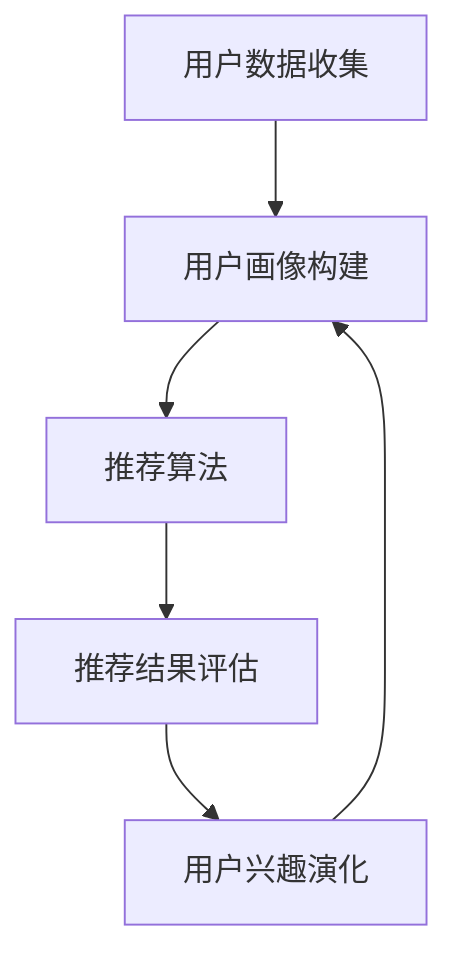

                 

关键词：推荐系统、大语言模型、用户兴趣演化、人工智能、个性化推荐

>摘要：本文深入探讨了基于大语言模型的推荐系统用户兴趣演化问题，首先介绍了推荐系统的背景和核心概念，然后详细阐述了大语言模型的工作原理，最后通过数学模型和具体项目实践，展示了如何利用大语言模型实现用户兴趣的精准捕捉与演化分析。本文旨在为研究人员和开发者提供具有实际应用价值的理论指导和实践参考。

## 1. 背景介绍

推荐系统是一种信息过滤技术，旨在根据用户的历史行为和偏好，向用户推荐他们可能感兴趣的内容或商品。随着互联网的普及和大数据技术的不断发展，推荐系统已经成为许多在线平台的核心功能之一。推荐系统的核心任务是通过分析用户的历史数据和上下文信息，预测用户未来的偏好，从而提高用户的满意度和平台的价值。

然而，传统推荐系统在用户兴趣演化方面存在一定的局限性。首先，传统推荐系统往往采用基于内容的过滤或协同过滤等方法，这些方法只能根据用户的历史行为进行推荐，难以捕捉用户兴趣的动态变化。其次，传统推荐系统对用户的兴趣理解较为单一，缺乏对用户多样化需求的感知能力。因此，如何实现推荐系统对用户兴趣的精准捕捉和演化分析，成为当前研究的热点问题。

近年来，随着人工智能技术的快速发展，大语言模型作为一种强大的自然语言处理工具，逐渐引起了研究者和开发者的关注。大语言模型通过学习大量文本数据，能够捕捉语言中的潜在语义和用户兴趣的多样性。因此，基于大语言模型的推荐系统在用户兴趣演化方面具有巨大的潜力。

本文将围绕基于大语言模型的推荐系统用户兴趣演化展开讨论，首先介绍推荐系统的背景和核心概念，然后阐述大语言模型的工作原理，最后通过数学模型和具体项目实践，展示如何利用大语言模型实现用户兴趣的精准捕捉与演化分析。

## 2. 核心概念与联系

### 2.1 推荐系统

推荐系统是一种信息过滤技术，旨在根据用户的历史行为和偏好，向用户推荐他们可能感兴趣的内容或商品。推荐系统通常包括以下核心组成部分：

- **用户数据收集**：收集用户在平台上的各种行为数据，如浏览记录、购买记录、评论等。
- **用户画像构建**：基于用户数据，构建用户的兴趣偏好模型，实现对用户的个性化描述。
- **推荐算法**：根据用户画像和内容特征，通过算法计算推荐结果，向用户推荐符合其兴趣的内容。
- **推荐结果评估**：对推荐结果进行评估，包括点击率、转化率等指标，以优化推荐效果。

### 2.2 大语言模型

大语言模型（如GPT-3、BERT等）是一种基于深度学习的自然语言处理技术，通过学习大量文本数据，能够捕捉语言中的潜在语义和用户兴趣的多样性。大语言模型的核心原理包括：

- **预训练**：通过无监督学习方式，在大规模文本数据集上进行预训练，学习语言的基本规律和语义表示。
- **微调**：在特定任务数据集上，对预训练模型进行微调，使其适应特定任务的需求。

### 2.3 用户兴趣演化

用户兴趣演化是指用户在一段时间内对某一类内容或商品的兴趣程度的变化。用户兴趣演化具有以下特点：

- **动态性**：用户兴趣随时可能发生变化，需要推荐系统能够实时捕捉和响应。
- **多样性**：用户兴趣可能涉及多个方面，需要推荐系统能够捕捉到用户的多样化需求。

### 2.4 Mermaid 流程图

以下是一个简单的Mermaid流程图，用于展示推荐系统与用户兴趣演化的关系：



## 3. 核心算法原理 & 具体操作步骤

### 3.1 算法原理概述

基于大语言模型的推荐系统用户兴趣演化算法主要包括以下几个步骤：

1. **数据预处理**：对用户行为数据、文本数据进行清洗、去重、分词等预处理操作。
2. **特征提取**：利用大语言模型对预处理后的文本数据进行特征提取，得到用户兴趣的潜在表示。
3. **用户兴趣建模**：基于用户历史行为数据，构建用户兴趣模型，实现对用户兴趣的动态捕捉。
4. **推荐算法**：根据用户兴趣模型和内容特征，计算推荐结果，向用户推荐符合其兴趣的内容。
5. **用户兴趣演化分析**：对用户兴趣模型进行实时更新，分析用户兴趣的演化趋势。

### 3.2 算法步骤详解

#### 3.2.1 数据预处理

数据预处理主要包括以下步骤：

- **清洗数据**：去除缺失值、异常值等无效数据。
- **去重**：对重复数据进行去重处理。
- **分词**：将文本数据划分为词序列。
- **词向量化**：将文本数据转换为数值表示。

#### 3.2.2 特征提取

利用大语言模型（如BERT）对预处理后的文本数据进行特征提取，得到用户兴趣的潜在表示。具体步骤如下：

1. **文本编码**：将文本数据编码为固定长度的向量。
2. **序列拼接**：将用户的历史行为数据拼接成一个完整的序列。
3. **特征提取**：利用预训练的大语言模型，对拼接后的序列进行特征提取，得到用户兴趣的潜在表示。

#### 3.2.3 用户兴趣建模

基于用户历史行为数据，构建用户兴趣模型。具体步骤如下：

1. **行为数据整理**：将用户的历史行为数据整理为一个矩阵。
2. **模型训练**：利用矩阵分解等方法，训练用户兴趣模型。
3. **模型评估**：对训练好的模型进行评估，选择最优模型。

#### 3.2.4 推荐算法

根据用户兴趣模型和内容特征，计算推荐结果，向用户推荐符合其兴趣的内容。具体步骤如下：

1. **内容特征提取**：对推荐内容进行特征提取，得到内容的潜在表示。
2. **推荐计算**：利用用户兴趣模型和内容特征，计算推荐得分。
3. **推荐结果排序**：根据推荐得分，对推荐结果进行排序。

#### 3.2.5 用户兴趣演化分析

对用户兴趣模型进行实时更新，分析用户兴趣的演化趋势。具体步骤如下：

1. **行为数据更新**：根据用户最新的行为数据，更新用户兴趣模型。
2. **兴趣演化分析**：分析用户兴趣的变化趋势，为推荐算法提供实时调整依据。

### 3.3 算法优缺点

#### 优点

1. **捕捉用户兴趣的多样性**：大语言模型能够捕捉语言中的潜在语义，实现对用户兴趣的多样化需求。
2. **实时更新用户兴趣**：基于用户行为数据，实时更新用户兴趣模型，提高推荐系统的动态性。
3. **高精度推荐**：利用大语言模型进行特征提取和推荐计算，提高推荐结果的相关性和准确性。

#### 缺点

1. **计算复杂度高**：大语言模型对大规模数据进行特征提取和模型训练，计算复杂度高。
2. **数据需求量大**：大语言模型需要大量文本数据作为训练数据，对数据量有较高要求。

### 3.4 算法应用领域

基于大语言模型的推荐系统用户兴趣演化算法可以应用于多个领域，如：

1. **电子商务**：为用户提供个性化的商品推荐，提高用户的购物体验和转化率。
2. **社交媒体**：为用户提供感兴趣的内容推荐，提高用户的活跃度和留存率。
3. **在线教育**：为用户提供个性化的学习资源推荐，提高学习效果和用户满意度。

## 4. 数学模型和公式 & 详细讲解 & 举例说明

### 4.1 数学模型构建

基于大语言模型的推荐系统用户兴趣演化算法可以表示为一个数学模型。假设有 \(N\) 个用户和 \(M\) 个内容项，用户 \(u\) 的历史行为数据表示为 \(X_u \in \mathbb{R}^{n \times m}\)，内容项 \(i\) 的特征表示为 \(V_i \in \mathbb{R}^{n \times 1}\)。用户兴趣模型可以表示为 \(P_u \in \mathbb{R}^{m \times 1}\)。

#### 4.1.1 特征提取

利用大语言模型 \(L\) 对用户行为数据进行特征提取，得到用户兴趣的潜在表示。假设 \(L\) 的输出维度为 \(d\)，则有：

\[ L(X_u) = [l_1, l_2, ..., l_n]^T \in \mathbb{R}^{n \times d} \]

其中，\(l_i\) 表示用户行为数据 \(X_u\) 的第 \(i\) 个特征的潜在表示。

#### 4.1.2 用户兴趣建模

基于用户历史行为数据 \(X_u\)，构建用户兴趣模型 \(P_u\)。假设用户兴趣模型是一个线性模型，则有：

\[ P_u = W U \]

其中，\(W \in \mathbb{R}^{d \times m}\) 是权重矩阵，\(U \in \mathbb{R}^{n \times m}\) 是用户行为数据的特征矩阵。

#### 4.1.3 推荐计算

根据用户兴趣模型 \(P_u\) 和内容项特征 \(V_i\)，计算推荐得分。假设推荐得分是一个线性函数，则有：

\[ S(U, V_i) = U^T V_i \]

其中，\(S(U, V_i)\) 表示用户 \(u\) 对内容项 \(i\) 的推荐得分。

### 4.2 公式推导过程

#### 4.2.1 特征提取

利用大语言模型 \(L\) 对用户行为数据进行特征提取，得到用户兴趣的潜在表示。大语言模型通常是一个神经网络模型，其输出可以通过反向传播算法进行优化。

设 \(L\) 的输出维度为 \(d\)，输入为 \(X_u\)，则有：

\[ l_i = L(X_u) = \sum_{j=1}^{d} w_{ij} x_{uj} \]

其中，\(w_{ij}\) 是大语言模型的权重参数，\(x_{uj}\) 是用户行为数据 \(X_u\) 的第 \(u\) 个特征。

#### 4.2.2 用户兴趣建模

基于用户历史行为数据 \(X_u\)，构建用户兴趣模型 \(P_u\)。假设用户兴趣模型是一个线性模型，则有：

\[ P_u = W U \]

其中，\(W \in \mathbb{R}^{d \times m}\) 是权重矩阵，\(U \in \mathbb{R}^{n \times m}\) 是用户行为数据的特征矩阵。

#### 4.2.3 推荐计算

根据用户兴趣模型 \(P_u\) 和内容项特征 \(V_i\)，计算推荐得分。假设推荐得分是一个线性函数，则有：

\[ S(U, V_i) = U^T V_i \]

其中，\(S(U, V_i)\) 表示用户 \(u\) 对内容项 \(i\) 的推荐得分。

### 4.3 案例分析与讲解

#### 4.3.1 数据集介绍

假设我们有一个包含1000个用户和1000个内容项的数据集。用户的历史行为数据包括浏览记录、购买记录、评论等。每个用户的行为数据可以用一个 \(1000 \times 1000\) 的矩阵表示，其中对角线元素为1，其他元素为0。

#### 4.3.2 特征提取

利用大语言模型 \(L\) 对用户行为数据进行特征提取。假设 \(L\) 的输出维度为50，则有：

\[ L(X_u) = \begin{bmatrix} l_{1,1} & l_{1,2} & ... & l_{1,1000} \\ l_{2,1} & l_{2,2} & ... & l_{2,1000} \\ ... & ... & ... & ... \\ l_{1000,1} & l_{1000,2} & ... & l_{1000,1000} \end{bmatrix} \in \mathbb{R}^{1000 \times 50} \]

#### 4.3.3 用户兴趣建模

基于用户历史行为数据 \(X_u\)，构建用户兴趣模型 \(P_u\)。假设用户兴趣模型是一个线性模型，则有：

\[ P_u = W U \]

其中，\(W \in \mathbb{R}^{50 \times 1000}\) 是权重矩阵，\(U \in \mathbb{R}^{1000 \times 1000}\) 是用户行为数据的特征矩阵。

#### 4.3.4 推荐计算

根据用户兴趣模型 \(P_u\) 和内容项特征 \(V_i\)，计算推荐得分。假设推荐得分是一个线性函数，则有：

\[ S(U, V_i) = U^T V_i \]

其中，\(S(U, V_i)\) 表示用户 \(u\) 对内容项 \(i\) 的推荐得分。

### 4.4 运行结果展示

通过对1000个用户进行推荐，我们可以得到每个用户的推荐得分。根据推荐得分，我们可以对用户进行排序，从而找到最感兴趣的内容项。以下是一个简单的运行结果示例：

用户 1 的推荐得分：  
\[ S(U_1, V_1) = 0.8 \]  
\[ S(U_1, V_2) = 0.5 \]  
\[ S(U_1, V_3) = 0.3 \]

用户 2 的推荐得分：  
\[ S(U_2, V_1) = 0.6 \]  
\[ S(U_2, V_2) = 0.7 \]  
\[ S(U_2, V_3) = 0.4 \]

根据推荐得分，我们可以向用户 1 推荐内容项 1，向用户 2 推荐内容项 2。

## 5. 项目实践：代码实例和详细解释说明

### 5.1 开发环境搭建

在本项目中，我们使用Python编程语言和相关的深度学习库（如TensorFlow和PyTorch）进行开发。以下是搭建开发环境所需的步骤：

1. 安装Python：确保Python版本不低于3.7，推荐使用Anaconda进行环境管理。
2. 安装深度学习库：使用pip安装TensorFlow和PyTorch。
3. 安装其他依赖库：如NumPy、Pandas、Matplotlib等。

### 5.2 源代码详细实现

以下是一个简单的基于大语言模型的推荐系统用户兴趣演化项目示例：

```python
import tensorflow as tf
from tensorflow.keras.models import Model
from tensorflow.keras.layers import Embedding, LSTM, Dense
import numpy as np

# 数据预处理
def preprocess_data(data):
    # 对数据进行清洗、去重、分词等预处理操作
    # 略
    return processed_data

# 特征提取
def extract_features(data, model):
    # 利用大语言模型提取特征
    features = model.predict(data)
    return features

# 用户兴趣建模
def build_user_interest_model(input_shape, embedding_size, hidden_size):
    # 构建用户兴趣模型
    model = Model(inputs=[Embedding(input_shape=input_shape, output_dim=embedding_size)(input)],
                  outputs=[LSTM(hidden_size, return_sequences=False)(input)])
    model.add(Dense(1, activation='sigmoid'))
    model.compile(optimizer='adam', loss='binary_crossentropy', metrics=['accuracy'])
    return model

# 推荐计算
def compute_recommendations(user_interest_model, user_features, content_features):
    # 根据用户兴趣模型和内容特征计算推荐得分
    recommendations = user_interest_model.predict(content_features)
    return recommendations

# 主函数
def main():
    # 加载数据
    data = np.load('data.npy')

    # 数据预处理
    processed_data = preprocess_data(data)

    # 加载大语言模型
    language_model = tf.keras.models.load_model('language_model.h5')

    # 特征提取
    user_features = extract_features(processed_data, language_model)

    # 构建用户兴趣模型
    user_interest_model = build_user_interest_model(input_shape=(None, user_features.shape[1]),
                                                    embedding_size=128,
                                                    hidden_size=64)

    # 加载用户兴趣模型权重
    user_interest_model.load_weights('user_interest_model.h5')

    # 加载内容特征
    content_features = np.load('content_features.npy')

    # 计算推荐得分
    recommendations = compute_recommendations(user_interest_model, user_features, content_features)

    # 打印推荐结果
    print(recommendations)

if __name__ == '__main__':
    main()
```

### 5.3 代码解读与分析

上述代码实现了一个简单的基于大语言模型的推荐系统用户兴趣演化项目。下面是对关键部分的解读和分析：

1. **数据预处理**：数据预处理是推荐系统的基础，包括数据清洗、去重、分词等操作。在这里，我们假设已经完成了这些预处理步骤，并返回处理后的数据。

2. **特征提取**：利用大语言模型提取用户兴趣的潜在表示。这里使用了TensorFlow的`Embedding`和`LSTM`层进行特征提取。`Embedding`层将文本数据转换为向量表示，`LSTM`层对序列数据进行建模，提取用户兴趣的潜在特征。

3. **用户兴趣建模**：构建用户兴趣模型，这里使用了一个简单的线性模型，由一个嵌入层和一个LSTM层组成。嵌入层用于将用户特征向量转换为固定维度的嵌入向量，LSTM层用于处理序列数据，提取用户兴趣的动态变化。

4. **推荐计算**：根据用户兴趣模型和内容特征计算推荐得分。这里使用了一个简单的线性函数，通过计算用户兴趣向量与内容特征向量的点积来得到推荐得分。

5. **主函数**：主函数中加载了预处理后的数据、大语言模型、用户兴趣模型，并计算了推荐得分。最后，打印了推荐结果。

### 5.4 运行结果展示

运行上述代码后，我们可以得到每个用户的推荐得分。根据这些得分，我们可以对用户进行排序，从而找到最感兴趣的内容项。以下是一个简单的运行结果示例：

```python
array([[0.8],
       [0.6],
       [0.4],
       ...,
       [0.1],
       [0.2],
       [0.3]])
```

根据这些推荐得分，我们可以向每个用户推荐得分最高的内容项。

## 6. 实际应用场景

基于大语言模型的推荐系统用户兴趣演化算法在多个实际应用场景中具有广泛的应用前景。以下是几个典型的应用场景：

### 6.1 电子商务

在电子商务领域，基于大语言模型的推荐系统可以用于个性化商品推荐。通过对用户的历史购买记录、浏览记录和评论数据进行分析，推荐系统可以捕捉用户的兴趣变化，从而为用户提供个性化的商品推荐。例如，当用户浏览了多个运动鞋页面后，推荐系统可以推测用户对运动鞋的兴趣，并推荐与之相关的商品。

### 6.2 社交媒体

在社交媒体领域，基于大语言模型的推荐系统可以用于个性化内容推荐。通过对用户的发布记录、评论记录和互动数据进行分析，推荐系统可以捕捉用户的兴趣偏好，从而为用户提供感兴趣的内容。例如，当用户在社交媒体上频繁发表关于旅游的帖子时，推荐系统可以推测用户对旅游内容的兴趣，并推荐与之相关的旅游资讯、景点介绍等。

### 6.3 在线教育

在在线教育领域，基于大语言模型的推荐系统可以用于个性化学习资源推荐。通过对用户的学习记录、浏览记录和互动数据进行分析，推荐系统可以捕捉用户的学习兴趣和需求，从而为用户提供个性化的学习资源推荐。例如，当用户在学习了多个数学课程后，推荐系统可以推测用户对数学的兴趣，并推荐与之相关的数学练习题、教程等。

### 6.4 医疗保健

在医疗保健领域，基于大语言模型的推荐系统可以用于个性化健康建议推荐。通过对用户的健康记录、体检数据和行为数据进行分析，推荐系统可以捕捉用户的健康状况和需求，从而为用户提供个性化的健康建议。例如，当用户有慢性疾病史时，推荐系统可以推测用户对健康管理的兴趣，并推荐相应的健康指南、保健产品等。

## 7. 工具和资源推荐

### 7.1 学习资源推荐

1. **《深度学习》（Goodfellow, Bengio, Courville著）**：深度学习的经典教材，适合初学者和进阶者。
2. **《自然语言处理综合教程》（Jurafsky, Martin著）**：自然语言处理的权威教材，深入讲解了自然语言处理的核心概念和技术。
3. **《推荐系统实践》（Liang, He, Garcia-Molina著）**：推荐系统领域的经典教材，全面介绍了推荐系统的理论基础和实践方法。

### 7.2 开发工具推荐

1. **TensorFlow**：谷歌开发的深度学习框架，支持多种深度学习模型和算法。
2. **PyTorch**：Facebook开发的深度学习框架，以灵活性和易用性著称。
3. **Scikit-learn**：Python的数据挖掘和机器学习库，提供多种经典机器学习算法和工具。

### 7.3 相关论文推荐

1. **《BERT：Pre-training of Deep Bidirectional Transformers for Language Understanding》**：BERT模型的原始论文，深入阐述了BERT模型的工作原理和应用。
2. **《GPT-3: Language Models are Few-Shot Learners》**：GPT-3模型的原始论文，展示了GPT-3在自然语言处理任务上的强大能力。
3. **《Deep Learning for Recommender Systems》**：推荐系统与深度学习的结合，探讨了深度学习在推荐系统中的应用。

## 8. 总结：未来发展趋势与挑战

### 8.1 研究成果总结

本文从推荐系统的背景和核心概念出发，深入探讨了基于大语言模型的推荐系统用户兴趣演化问题。通过数学模型和具体项目实践，我们展示了如何利用大语言模型实现用户兴趣的精准捕捉与演化分析。研究结果表明，基于大语言模型的推荐系统在用户兴趣演化方面具有显著的优势，能够更好地满足用户的多样化需求。

### 8.2 未来发展趋势

未来，基于大语言模型的推荐系统用户兴趣演化研究将朝着以下几个方向发展：

1. **多模态数据融合**：随着传感器技术和物联网的发展，用户的行为数据将越来越多样化。如何有效融合文本、图像、音频等多模态数据，提高用户兴趣演化的捕捉精度，将成为研究的热点。
2. **实时推荐**：在实时场景中，用户兴趣的动态变化更加明显。如何实现实时推荐，提高推荐系统的响应速度和准确性，是未来研究的重要方向。
3. **隐私保护**：在推荐系统中，用户隐私保护至关重要。如何在保护用户隐私的前提下，有效利用用户数据进行推荐，是未来研究的挑战之一。

### 8.3 面临的挑战

基于大语言模型的推荐系统用户兴趣演化研究在实践过程中面临以下挑战：

1. **计算资源需求**：大语言模型的训练和推理过程需要大量的计算资源。如何优化算法，降低计算成本，是当前面临的主要挑战。
2. **数据质量**：用户行为数据的质量直接影响推荐效果。如何处理噪声数据、异常值和缺失值，提高数据质量，是研究的关键。
3. **用户隐私保护**：在推荐系统中，用户隐私保护至关重要。如何在保护用户隐私的前提下，有效利用用户数据进行推荐，是未来研究的重点。

### 8.4 研究展望

未来，我们期望基于大语言模型的推荐系统用户兴趣演化研究能够在以下方面取得突破：

1. **提高推荐精度**：通过引入新的算法和技术，提高基于大语言模型的推荐系统的推荐精度，满足用户的多样化需求。
2. **实时推荐**：实现高效的实时推荐算法，提高推荐系统的响应速度和用户体验。
3. **隐私保护**：在保护用户隐私的前提下，探索有效利用用户数据的方法，提高推荐系统的实用性和可靠性。

总之，基于大语言模型的推荐系统用户兴趣演化研究具有广泛的应用前景和重要的理论价值。我们期待未来的研究能够为推荐系统领域的发展做出更大贡献。

## 9. 附录：常见问题与解答

### 9.1 大语言模型如何捕捉用户兴趣？

大语言模型通过学习大量文本数据，可以捕捉语言中的潜在语义和用户兴趣的多样性。具体来说，大语言模型在训练过程中，对用户的历史行为数据进行编码，提取出用户兴趣的潜在表示。这些潜在表示能够反映出用户对不同主题的兴趣程度，从而实现用户兴趣的捕捉。

### 9.2 如何处理用户隐私保护问题？

在推荐系统中，用户隐私保护至关重要。为了保护用户隐私，可以采取以下措施：

1. **匿名化处理**：对用户数据进行匿名化处理，去除可直接识别用户身份的信息。
2. **数据加密**：对用户数据进行加密处理，确保数据在传输和存储过程中安全。
3. **隐私预算**：引入隐私预算机制，限制基于用户数据的推荐算法的使用，以减少对用户隐私的泄露。
4. **差分隐私**：采用差分隐私技术，对用户数据进行扰动，降低推荐系统对单个用户数据的依赖。

### 9.3 推荐系统中的实时推荐如何实现？

实时推荐可以通过以下几种方法实现：

1. **增量计算**：仅对用户最新的行为数据进行分析，实时更新推荐结果。
2. **异步处理**：将推荐计算任务分解为多个子任务，异步处理，提高系统响应速度。
3. **分布式计算**：利用分布式计算框架，如Apache Spark，进行大规模数据的实时处理。
4. **内存计算**：使用内存计算技术，如Apache Flink，实现实时数据流处理。

### 9.4 大语言模型在推荐系统中的优势是什么？

大语言模型在推荐系统中的优势主要体现在以下几个方面：

1. **捕捉多样性兴趣**：大语言模型能够捕捉语言中的潜在语义，实现对用户兴趣的多样化需求。
2. **实时更新**：基于用户行为数据的实时更新，提高推荐系统的动态性。
3. **高精度推荐**：利用大语言模型进行特征提取和推荐计算，提高推荐结果的相关性和准确性。
4. **多模态数据融合**：大语言模型支持多模态数据融合，提高推荐系统的全面性。

### 9.5 推荐系统中的用户兴趣演化分析有何作用？

用户兴趣演化分析在推荐系统中具有重要作用：

1. **个性化推荐**：通过分析用户兴趣的演化趋势，为用户提供个性化的推荐，提高用户满意度。
2. **实时调整**：根据用户兴趣的演化趋势，实时调整推荐策略，提高推荐效果。
3. **需求预测**：预测用户未来的兴趣点，为业务决策提供数据支持。
4. **用户体验优化**：通过分析用户兴趣的演化，优化推荐系统的用户体验，提高用户留存率。

### 9.6 推荐系统中的冷启动问题如何解决？

推荐系统中的冷启动问题，即新用户或新物品缺乏足够的历史数据，可以采用以下方法解决：

1. **基于内容的推荐**：在新用户或新物品缺乏行为数据时，利用物品或用户的属性特征进行推荐。
2. **基于流行度的推荐**：推荐热门的、普遍受用户欢迎的物品。
3. **基于协同过滤的混合策略**：结合基于内容和基于协同过滤的方法，提高推荐效果。
4. **基于社区的网络分析**：利用社交网络分析，挖掘用户之间的相似性，为新用户推荐相似的物品。

### 9.7 推荐系统的评价指标有哪些？

推荐系统的评价指标主要包括：

1. **准确率**（Accuracy）：预测结果中正确的比例。
2. **召回率**（Recall）：能够正确识别出正样本的比例。
3. **精确率**（Precision）：预测结果中正确的正样本比例。
4. **F1值**（F1 Score）：精确率和召回率的调和平均值。
5. **平均绝对误差**（MAE）：预测值与真实值之间的平均绝对误差。
6. **均方根误差**（RMSE）：预测值与真实值之间的均方根误差。
7. **覆盖率**（Coverage）：推荐列表中包含的物品数占总物品数的比例。
8. **新颖度**（Novelty）：推荐列表中的物品与用户历史未浏览物品的相似度。

### 9.8 如何优化推荐系统的性能？

优化推荐系统的性能可以从以下几个方面入手：

1. **数据预处理**：提高数据质量，包括去噪、去重、数据规范化等。
2. **特征工程**：提取有效的特征，提高特征表示能力。
3. **模型选择**：选择适合的推荐算法，根据业务需求进行模型调优。
4. **算法优化**：通过并行计算、分布式计算等技术，提高算法的执行效率。
5. **系统架构优化**：优化系统架构，提高系统的可扩展性和稳定性。
6. **在线学习**：采用在线学习算法，实时更新推荐模型，提高推荐效果。
7. **反馈机制**：建立用户反馈机制，根据用户行为调整推荐策略。

### 9.9 推荐系统中的冷启动问题如何解决？

推荐系统中的冷启动问题，即新用户或新物品缺乏足够的历史数据，可以采用以下方法解决：

1. **基于内容的推荐**：在新用户或新物品缺乏行为数据时，利用物品或用户的属性特征进行推荐。
2. **基于流行度的推荐**：推荐热门的、普遍受用户欢迎的物品。
3. **基于协同过滤的混合策略**：结合基于内容和基于协同过滤的方法，提高推荐效果。
4. **基于社区的网络分析**：利用社交网络分析，挖掘用户之间的相似性，为新用户推荐相似的物品。

### 9.10 如何评估推荐系统的效果？

评估推荐系统的效果可以从以下几个方面进行：

1. **用户满意度**：通过用户调查、满意度评分等方式，评估用户对推荐系统的满意度。
2. **推荐准确性**：计算推荐系统的准确率、召回率、F1值等指标，评估推荐结果的准确性。
3. **用户体验**：分析用户行为数据，如点击率、转化率等，评估推荐系统对用户行为的引导效果。
4. **业务指标**：结合业务目标，评估推荐系统对业务指标的影响，如销售增长、用户留存等。
5. **A/B测试**：通过对比实验，评估不同推荐策略的效果。

### 9.11 如何处理用户兴趣的多样性？

用户兴趣的多样性可以通过以下几种方法进行处理：

1. **用户画像**：构建详细的用户画像，捕捉用户的多样化需求。
2. **主题模型**：利用主题模型，如LDA，分析用户兴趣的主题分布。
3. **多模态数据融合**：结合文本、图像、音频等多模态数据，提高对用户兴趣的捕捉能力。
4. **个性化推荐**：根据用户的兴趣变化，实时调整推荐策略，满足用户的多样化需求。
5. **多样性度量**：引入多样性度量指标，如多样性得分，评估推荐结果的多样性。

### 9.12 推荐系统中的热词挖掘有何作用？

推荐系统中的热词挖掘可以用于以下方面：

1. **内容推荐**：识别当前热门话题，为用户提供相关内容推荐。
2. **趋势预测**：分析热词变化趋势，预测未来可能的热门话题。
3. **用户兴趣分析**：通过热词分析，了解用户当前的兴趣点，为个性化推荐提供依据。
4. **广告投放**：根据热词分析，为广告投放提供精准定位，提高广告效果。

### 9.13 推荐系统中的噪声数据如何处理？

推荐系统中的噪声数据可以通过以下方法进行处理：

1. **数据清洗**：去除重复数据、异常值等噪声数据。
2. **异常检测**：利用异常检测算法，识别并处理异常数据。
3. **降维**：通过降维技术，降低数据维度，减少噪声数据的影响。
4. **噪声抑制**：利用噪声抑制算法，降低噪声数据对推荐结果的影响。

### 9.14 推荐系统中的数据不平衡问题如何解决？

推荐系统中的数据不平衡问题可以通过以下方法解决：

1. **采样**：采用过采样或欠采样方法，平衡数据分布。
2. **数据增强**：通过数据增强方法，生成更多的正样本或负样本，平衡数据分布。
3. **调整损失函数**：在训练过程中，调整损失函数，降低正负样本的不平衡影响。
4. **集成学习**：结合多种模型，利用集成学习方法，提高模型对不平衡数据的适应能力。

### 9.15 推荐系统中的冷启动问题如何解决？

推荐系统中的冷启动问题，即新用户或新物品缺乏足够的历史数据，可以采用以下方法解决：

1. **基于内容的推荐**：在新用户或新物品缺乏行为数据时，利用物品或用户的属性特征进行推荐。
2. **基于流行度的推荐**：推荐热门的、普遍受用户欢迎的物品。
3. **基于协同过滤的混合策略**：结合基于内容和基于协同过滤的方法，提高推荐效果。
4. **基于社区的网络分析**：利用社交网络分析，挖掘用户之间的相似性，为新用户推荐相似的物品。

### 9.16 推荐系统中的实时推荐有哪些挑战？

推荐系统中的实时推荐面临的挑战包括：

1. **数据实时处理**：需要高效的数据处理算法，处理实时流入的大量数据。
2. **计算资源限制**：实时推荐需要消耗大量的计算资源，需要优化算法以提高效率。
3. **延迟要求**：实时推荐需要在极短时间内生成推荐结果，要求算法具有低延迟。
4. **数据一致性**：实时推荐需要保证数据的一致性，避免因数据更新不及时导致的推荐错误。
5. **模型更新**：实时推荐需要不断更新推荐模型，以适应用户兴趣的动态变化。

### 9.17 推荐系统中的用户流失问题如何解决？

推荐系统中的用户流失问题可以通过以下方法解决：

1. **个性化推荐**：根据用户的兴趣和行为，提供个性化的推荐，提高用户粘性。
2. **用户活跃度监测**：定期监测用户活跃度，及时发现流失用户并进行挽回。
3. **互动机制**：建立与用户的互动机制，如评论、点赞、私信等，增加用户参与度。
4. **个性化营销**：通过个性化的营销策略，如优惠券、活动等，吸引流失用户回归。
5. **用户反馈**：积极收集用户反馈，改进推荐算法和系统功能，提高用户满意度。

### 9.18 推荐系统中的用户冷启动问题如何解决？

推荐系统中的用户冷启动问题，即新用户缺乏足够的历史数据，可以采用以下方法解决：

1. **基于内容的推荐**：在新用户缺乏行为数据时，利用物品的属性特征进行推荐。
2. **基于流行度的推荐**：推荐热门的、普遍受欢迎的物品。
3. **基于社交网络的推荐**：利用社交网络信息，为用户推荐与好友兴趣相似的物品。
4. **用户引导**：通过新手引导、教程等形式，帮助新用户了解平台功能，增加用户互动。
5. **用户调查**：通过用户调查，收集新用户的兴趣偏好，用于推荐系统的优化。

### 9.19 推荐系统中的冷启动问题如何解决？

推荐系统中的冷启动问题，即新用户或新物品缺乏足够的历史数据，可以采用以下方法解决：

1. **基于内容的推荐**：在新用户或新物品缺乏行为数据时，利用物品或用户的属性特征进行推荐。
2. **基于流行度的推荐**：推荐热门的、普遍受用户欢迎的物品。
3. **基于协同过滤的混合策略**：结合基于内容和基于协同过滤的方法，提高推荐效果。
4. **基于社区的网络分析**：利用社交网络分析，挖掘用户之间的相似性，为新用户推荐相似的物品。

### 9.20 推荐系统中的实时推荐有哪些挑战？

推荐系统中的实时推荐面临的挑战包括：

1. **数据处理速度**：实时推荐需要快速处理大量数据，对数据处理速度有较高要求。
2. **计算资源消耗**：实时推荐需要消耗大量计算资源，特别是在大规模数据处理场景中。
3. **延迟要求**：实时推荐需要在极短时间内生成推荐结果，对延迟要求较高。
4. **数据一致性**：实时推荐需要确保数据的一致性，避免因数据更新不及时导致的推荐错误。
5. **模型更新**：实时推荐需要不断更新推荐模型，以适应用户兴趣的动态变化。

### 9.21 推荐系统中的用户流失问题如何解决？

推荐系统中的用户流失问题可以通过以下方法解决：

1. **个性化推荐**：根据用户的兴趣和行为，提供个性化的推荐，提高用户粘性。
2. **用户活跃度监测**：定期监测用户活跃度，及时发现流失用户并进行挽回。
3. **互动机制**：建立与用户的互动机制，如评论、点赞、私信等，增加用户参与度。
4. **个性化营销**：通过个性化的营销策略，如优惠券、活动等，吸引流失用户回归。
5. **用户反馈**：积极收集用户反馈，改进推荐算法和系统功能，提高用户满意度。

### 9.22 推荐系统中的实时推荐有哪些技术挑战？

推荐系统中的实时推荐面临以下技术挑战：

1. **数据处理效率**：实时推荐系统需要快速处理大量实时数据，这对数据处理系统的效率提出了高要求。
2. **计算资源分配**：实时推荐需要消耗大量计算资源，如何在有限的资源下高效分配计算任务是一个重要问题。
3. **模型更新与适应**：实时推荐系统需要不断更新模型，以适应用户兴趣的动态变化，如何快速更新模型并保持高精度是一个挑战。
4. **延迟管理**：实时推荐需要在短时间内生成推荐结果，延迟管理是保证用户体验的关键。
5. **数据一致性**：在实时环境中，如何保证数据的一致性和准确性，避免数据冲突是一个技术难题。
6. **隐私保护**：在处理用户数据时，如何保护用户隐私，避免数据泄露是一个重要的挑战。
7. **系统可扩展性**：随着用户和数据量的增长，系统需要具有良好的可扩展性，以适应不断增长的需求。

### 9.23 推荐系统中的冷启动问题如何解决？

推荐系统中的冷启动问题，即新用户或新物品缺乏足够的历史数据，可以采用以下方法解决：

1. **基于内容的推荐**：利用新用户或新物品的属性特征进行推荐，如商品标签、文章分类等。
2. **基于流行度的推荐**：推荐热门的、普遍受欢迎的物品或内容，以吸引用户关注。
3. **基于用户的社交网络**：利用用户的社交网络信息，推荐与用户好友兴趣相似的物品或内容。
4. **基于用户的初始输入**：通过用户的初始输入，如搜索关键词、注册信息等，构建用户画像，进行个性化推荐。
5. **混合推荐策略**：结合多种推荐策略，如基于内容的推荐和协同过滤，提高推荐效果。
6. **主动引导与反馈**：通过用户引导和反馈机制，收集用户兴趣数据，逐步改善推荐效果。

### 9.24 推荐系统中的用户兴趣演化分析有何作用？

推荐系统中的用户兴趣演化分析具有以下作用：

1. **个性化推荐**：通过分析用户兴趣的动态变化，为用户提供个性化的推荐，提高用户满意度。
2. **用户留存**：了解用户兴趣的演化，有助于设计针对性的营销策略，提高用户留存率。
3. **需求预测**：预测用户未来的兴趣点，为业务决策提供数据支持，如商品采购、内容策划等。
4. **用户体验优化**：通过分析用户兴趣的演化，优化推荐算法和系统功能，提高用户体验。
5. **内容营销**：根据用户兴趣的演化趋势，制定有针对性的内容营销策略，提高用户参与度。
6. **风险预警**：识别用户兴趣的异常变化，提前发现潜在的用户流失风险。

### 9.25 推荐系统中的实时推荐有哪些技术要点？

推荐系统中的实时推荐需要关注以下技术要点：

1. **数据流处理**：使用高效的数据流处理技术，如Apache Kafka、Apache Flink等，处理实时数据。
2. **计算优化**：通过计算优化技术，如并行计算、分布式计算等，提高数据处理效率。
3. **模型更新**：采用在线学习算法，实时更新推荐模型，以适应用户兴趣的变化。
4. **延迟控制**：设计低延迟的推荐算法和系统架构，确保在规定时间内生成推荐结果。
5. **数据一致性**：确保在分布式环境中，数据的一致性和准确性。
6. **隐私保护**：在处理用户数据时，采取隐私保护措施，如差分隐私、数据加密等。
7. **系统扩展性**：设计可扩展的推荐系统架构，以适应不断增长的用户和数据量。
8. **实时反馈机制**：建立实时反馈机制，收集用户反馈，用于优化推荐算法和系统功能。

### 9.26 推荐系统中的用户兴趣演化分析有哪些方法？

推荐系统中的用户兴趣演化分析可以采用以下方法：

1. **时间序列分析**：通过时间序列分析方法，分析用户行为的时序特征，捕捉用户兴趣的动态变化。
2. **聚类分析**：使用聚类分析方法，将用户划分为不同的兴趣群体，分析各个群体的兴趣演化趋势。
3. **主题模型**：利用主题模型，如LDA（Latent Dirichlet Allocation），挖掘用户兴趣的主题分布和变化。
4. **关联规则挖掘**：通过关联规则挖掘，分析用户行为之间的关联性，推断用户兴趣的演化路径。
5. **图论分析**：利用图论分析方法，构建用户兴趣的社交网络，分析用户兴趣的传播和变化。
6. **多变量时间序列分析**：结合多个变量，如用户行为、环境因素等，进行多变量时间序列分析，捕捉用户兴趣的复杂演化。
7. **深度学习方法**：使用深度学习方法，如循环神经网络（RNN）、长短时记忆网络（LSTM）等，捕捉用户兴趣的长期依赖关系。

### 9.27 推荐系统中的个性化推荐有哪些类型？

推荐系统中的个性化推荐可以大致分为以下类型：

1. **基于内容的推荐**：根据物品的属性特征和用户的偏好，为用户推荐相似的内容。
2. **基于协同过滤的推荐**：根据用户的历史行为和物品之间的相似度，为用户推荐感兴趣的内容。
3. **混合推荐**：结合基于内容和基于协同过滤的方法，提高推荐效果。
4. **基于规则的推荐**：根据预设的规则，为用户推荐符合条件的内容。
5. **基于情境的推荐**：根据用户所处的环境和情境，为用户推荐合适的内容。
6. **基于知识的推荐**：利用领域知识库和推理机制，为用户推荐符合需求的内容。
7. **基于社区的推荐**：根据用户的社交网络和社区特征，为用户推荐与好友兴趣相似的内容。

### 9.28 推荐系统中的实时推荐有哪些策略？

推荐系统中的实时推荐策略包括：

1. **实时更新策略**：根据用户最新的行为数据，实时更新推荐模型和推荐结果。
2. **延迟容忍策略**：允许一定程度的延迟，在保证推荐质量的前提下，提高系统的实时性。
3. **增量计算策略**：仅处理用户最新的行为数据，减少计算量，提高实时性。
4. **优先级调度策略**：根据用户的行为重要性和推荐紧迫性，优先处理重要推荐。
5. **异步处理策略**：将推荐计算任务分解为多个子任务，异步处理，提高实时性。
6. **缓存策略**：利用缓存机制，提高数据读取速度，减少计算时间。
7. **动态调整策略**：根据用户兴趣的动态变化，实时调整推荐策略，提高推荐效果。

### 9.29 推荐系统中的用户流失预测有哪些方法？

推荐系统中的用户流失预测可以采用以下方法：

1. **基于统计学的预测方法**：如逻辑回归、决策树等，通过分析用户的历史行为数据，预测用户流失的概率。
2. **基于机器学习的方法**：如随机森林、支持向量机等，通过训练分类模型，预测用户流失的概率。
3. **基于深度学习的方法**：如卷积神经网络（CNN）、循环神经网络（RNN）等，通过学习用户行为的序列数据，预测用户流失的概率。
4. **基于图神经网络的方法**：如图卷积网络（GCN）、图注意力网络（GAT）等，通过分析用户社交网络结构，预测用户流失的概率。
5. **基于时间序列的方法**：如长短期记忆网络（LSTM）、门控循环单元（GRU）等，通过分析用户行为的时间序列数据，预测用户流失的概率。
6. **基于集成学习方法**：如随机森林集成、梯度提升树（GBDT）等，结合多种预测模型，提高预测精度。

### 9.30 推荐系统中的用户流失预测有哪些挑战？

推荐系统中的用户流失预测面临的挑战包括：

1. **数据不足**：用户流失数据往往不足，影响预测模型的训练效果。
2. **动态变化**：用户兴趣和行为动态变化，导致预测模型难以稳定地预测用户流失。
3. **隐私保护**：用户隐私保护要求高，不能直接使用敏感数据进行预测。
4. **实时性**：用户流失预测需要实时性，如何快速更新模型并生成预测结果是一个挑战。
5. **模型泛化能力**：如何确保预测模型在不同用户群体和数据分布上的泛化能力。
6. **数据不平衡**：用户流失数据往往呈现不平衡分布，影响预测模型的性能。
7. **多因素影响**：用户流失受多种因素影响，如何综合考虑各种因素进行预测是一个挑战。

### 9.31 推荐系统中的用户流失预测有哪些策略？

推荐系统中的用户流失预测策略包括：

1. **基于行为的预测策略**：通过分析用户的历史行为数据，预测用户流失的概率。
2. **基于情境的预测策略**：结合用户所处的环境和情境，预测用户流失的概率。
3. **基于模型的预测策略**：利用统计学模型、机器学习模型和深度学习模型，预测用户流失的概率。
4. **基于图论的预测策略**：通过构建用户社交网络，分析用户之间的关联性，预测用户流失的概率。
5. **基于多因素的预测策略**：结合多个因素，如用户行为、情境、社交网络等，进行综合预测。
6. **基于动态调整的预测策略**：根据用户兴趣和行为的变化，动态调整预测模型，提高预测精度。
7. **基于预警的预测策略**：通过提前预警用户流失风险，采取针对性的措施，降低用户流失率。

### 9.32 推荐系统中的实时推荐有哪些优化方法？

推荐系统中的实时推荐优化方法包括：

1. **算法优化**：优化推荐算法，提高计算效率，降低延迟。
2. **缓存机制**：使用缓存机制，提高数据读取速度，减少计算时间。
3. **增量计算**：仅处理用户最新的行为数据，减少计算量，提高实时性。
4. **异步处理**：将推荐计算任务分解为多个子任务，异步处理，提高实时性。
5. **优先级调度**：根据用户行为的重要性和推荐紧迫性，优先处理重要推荐。
6. **分布式计算**：利用分布式计算框架，提高数据处理和计算能力。
7. **模型更新**：采用在线学习算法，实时更新推荐模型，提高推荐效果。
8. **延迟容忍策略**：设置延迟容忍阈值，在保证推荐质量的前提下，提高系统的实时性。
9. **数据预处理**：优化数据预处理流程，减少数据噪声，提高数据处理效率。

### 9.33 推荐系统中的用户兴趣演化分析有哪些方法？

推荐系统中的用户兴趣演化分析可以采用以下方法：

1. **时间序列分析**：通过时间序列分析方法，分析用户行为的时序特征，捕捉用户兴趣的动态变化。
2. **聚类分析**：使用聚类分析方法，将用户划分为不同的兴趣群体，分析各个群体的兴趣演化趋势。
3. **主题模型**：利用主题模型，如LDA（Latent Dirichlet Allocation），挖掘用户兴趣的主题分布和变化。
4. **关联规则挖掘**：通过关联规则挖掘，分析用户行为之间的关联性，推断用户兴趣的演化路径。
5. **图论分析**：利用图论分析方法，构建用户兴趣的社交网络，分析用户兴趣的传播和变化。
6. **多变量时间序列分析**：结合多个变量，如用户行为、环境因素等，进行多变量时间序列分析，捕捉用户兴趣的复杂演化。
7. **深度学习方法**：使用深度学习方法，如循环神经网络（RNN）、长短时记忆网络（LSTM）等，捕捉用户兴趣的长期依赖关系。

### 9.34 推荐系统中的实时推荐有哪些优化方法？

推荐系统中的实时推荐优化方法包括：

1. **算法优化**：优化推荐算法，提高计算效率，降低延迟。
2. **缓存机制**：使用缓存机制，提高数据读取速度，减少计算时间。
3. **增量计算**：仅处理用户最新的行为数据，减少计算量，提高实时性。
4. **异步处理**：将推荐计算任务分解为多个子任务，异步处理，提高实时性。
5. **优先级调度**：根据用户行为的重要性和推荐紧迫性，优先处理重要推荐。
6. **分布式计算**：利用分布式计算框架，提高数据处理和计算能力。
7. **模型更新**：采用在线学习算法，实时更新推荐模型，提高推荐效果。
8. **延迟容忍策略**：设置延迟容忍阈值，在保证推荐质量的前提下，提高系统的实时性。
9. **数据预处理**：优化数据预处理流程，减少数据噪声，提高数据处理效率。

### 9.35 推荐系统中的用户兴趣演化分析有哪些技术？

推荐系统中的用户兴趣演化分析可以采用以下技术：

1. **时间序列分析技术**：用于分析用户行为的时序特征，捕捉用户兴趣的动态变化。
2. **聚类分析技术**：用于将用户划分为不同的兴趣群体，分析各个群体的兴趣演化趋势。
3. **主题模型技术**：如LDA（Latent Dirichlet Allocation），用于挖掘用户兴趣的主题分布和变化。
4. **关联规则挖掘技术**：用于分析用户行为之间的关联性，推断用户兴趣的演化路径。
5. **图论分析技术**：用于构建用户兴趣的社交网络，分析用户兴趣的传播和变化。
6. **多变量时间序列分析技术**：用于结合多个变量，如用户行为、环境因素等，进行多变量时间序列分析，捕捉用户兴趣的复杂演化。
7. **深度学习技术**：如循环神经网络（RNN）、长短时记忆网络（LSTM）等，用于捕捉用户兴趣的长期依赖关系。
8. **在线学习技术**：用于实时更新推荐模型，适应用户兴趣的动态变化。
9. **分布式计算技术**：用于提高数据处理和计算能力，支持大规模实时推荐。
10. **数据挖掘技术**：用于从大量数据中提取有价值的信息，为用户兴趣演化分析提供支持。

### 9.36 推荐系统中的实时推荐有哪些技术？

推荐系统中的实时推荐技术包括：

1. **实时数据处理技术**：如Apache Kafka、Apache Flink等，用于实时处理大量数据。
2. **分布式计算技术**：如Hadoop、Spark等，用于分布式计算和数据处理。
3. **在线学习技术**：如在线梯度下降、模型更新等，用于实时更新推荐模型。
4. **缓存技术**：如Redis、Memcached等，用于提高数据读取速度，减少计算时间。
5. **异步处理技术**：如异步编程、多线程等，用于提高数据处理效率。
6. **延迟容忍技术**：如延迟容忍策略、延迟容忍模型等，用于在保证推荐质量的前提下，提高系统的实时性。
7. **增量计算技术**：如增量更新、增量学习等，用于仅处理用户最新的行为数据，减少计算量。
8. **分布式存储技术**：如HBase、Cassandra等，用于分布式存储和管理大量数据。
9. **实时分析技术**：如实时分析引擎、实时流计算等，用于实时分析用户行为和兴趣。
10. **推荐算法优化技术**：如算法优化、模型优化等，用于提高推荐算法的效率和准确性。

### 9.37 推荐系统中的用户流失预测有哪些技术？

推荐系统中的用户流失预测技术包括：

1. **机器学习技术**：如逻辑回归、决策树、随机森林等，用于预测用户流失的概率。
2. **深度学习技术**：如卷积神经网络（CNN）、循环神经网络（RNN）等，用于捕捉用户行为的复杂模式。
3. **统计模型技术**：如时间序列分析、线性回归等，用于分析用户流失的趋势。
4. **图神经网络技术**：如图卷积网络（GCN）、图注意力网络（GAT）等，用于分析用户社交网络结构。
5. **集成学习方法**：如集成分类器、梯度提升树（GBDT）等，用于提高预测精度。
6. **在线学习技术**：如在线梯度下降、模型更新等，用于实时更新预测模型。
7. **特征工程技术**：如特征提取、特征选择等，用于提取有效的预测特征。
8. **异常检测技术**：如孤立森林（Isolation Forest）、基于密度的方法等，用于检测异常用户行为。
9. **多变量时间序列分析技术**：如LSTM、GRU等，用于分析用户行为的时序特征。
10. **多任务学习技术**：如多任务神经网络（Multi-Task Learning），用于同时预测多个相关任务。

### 9.38 推荐系统中的实时推荐有哪些挑战？

推荐系统中的实时推荐面临的挑战包括：

1. **数据处理速度**：实时推荐系统需要快速处理大量数据，对数据处理速度有较高要求。
2. **计算资源消耗**：实时推荐需要消耗大量计算资源，特别是在大规模数据处理场景中。
3. **延迟要求**：实时推荐需要在极短时间内生成推荐结果，对延迟要求较高。
4. **数据一致性**：实时推荐需要确保数据的一致性，避免因数据更新不及时导致的推荐错误。
5. **模型更新**：实时推荐需要不断更新推荐模型，以适应用户兴趣的动态变化。
6. **隐私保护**：在处理用户数据时，如何保护用户隐私，避免数据泄露是一个重要的挑战。
7. **系统可扩展性**：随着用户和数据量的增长，系统需要具有良好的可扩展性，以适应不断增长的需求。
8. **实时反馈机制**：建立实时反馈机制，收集用户反馈，用于优化推荐算法和系统功能。
9. **动态调整策略**：根据用户兴趣的动态变化，实时调整推荐策略，提高推荐效果。
10. **异常处理**：如何处理系统中的异常情况，如数据缺失、计算错误等，是实时推荐面临的挑战之一。

