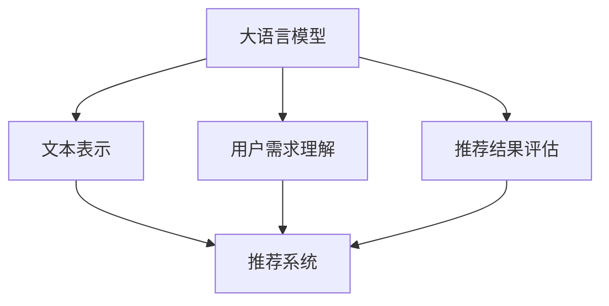

                 

关键词：大语言模型、推荐系统、用户满意度预测、机器学习、深度学习、自然语言处理

## 摘要

本文将深入探讨如何利用大语言模型来预测推荐系统中的用户满意度。随着推荐系统在电子商务、社交媒体、新闻推荐等领域的广泛应用，如何提高用户满意度成为了关键问题。大语言模型作为自然语言处理领域的一项重要技术，其在文本分析和理解方面的卓越表现，为推荐系统用户满意度预测提供了新的思路和方法。本文将从背景介绍、核心概念与联系、核心算法原理与具体操作步骤、数学模型与公式详细讲解、项目实践与代码实例、实际应用场景、未来应用展望等多个方面，全面解析基于大语言模型的推荐系统用户满意度预测的技术原理、实现方法和实际应用，为相关领域的研究和实践提供有价值的参考。

## 1. 背景介绍

### 推荐系统的发展历程

推荐系统最早起源于20世纪90年代，随着互联网的普及，电子商务和在线媒体等领域的迅速发展，推荐系统得到了广泛应用。早期的推荐系统主要采用基于内容的过滤（Content-Based Filtering）和协同过滤（Collaborative Filtering）两种方法。

基于内容的过滤方法通过分析用户历史行为和内容特征，将用户可能感兴趣的新内容推荐给用户。这种方法的主要优势是能够提供个性化的推荐结果，但缺点是对新内容的适应性较差，无法充分利用用户之间的社会关系。

协同过滤方法则通过分析用户之间的行为相似性，为用户推荐他们可能感兴趣的内容。协同过滤方法主要分为基于用户的协同过滤（User-Based Collaborative Filtering）和基于模型的协同过滤（Model-Based Collaborative Filtering）。前者通过计算用户之间的相似度来实现推荐，后者则通过构建用户-项目矩阵模型来进行推荐。

随着人工智能和深度学习技术的不断发展，推荐系统逐渐引入了更多的先进技术，如基于深度学习的协同过滤方法、基于图神经网络的推荐系统等。这些方法在一定程度上提高了推荐系统的效果，但同时也带来了更高的计算复杂度和模型可解释性差等问题。

### 用户满意度的重要性

用户满意度是衡量推荐系统效果的重要指标。一个优秀的推荐系统能够准确预测用户的需求，提供符合用户兴趣的内容，从而提升用户的满意度和忠诚度。用户满意度高的推荐系统不仅能吸引更多的新用户，还能提高现有用户的活跃度和粘性。

然而，传统的推荐系统往往侧重于推荐效果，而忽略了用户的实际体验和满意度。用户满意度不仅取决于推荐结果的质量，还包括推荐系统的响应速度、推荐结果的多样性、推荐过程的透明度等因素。因此，如何提高用户满意度成为了推荐系统研究和实践中的关键问题。

### 大语言模型的优势

大语言模型作为自然语言处理领域的一项重要技术，近年来在文本分析和理解方面取得了显著进展。大语言模型通过预训练和微调，能够从大量的文本数据中学习到丰富的语义信息，从而实现对文本内容的深入理解和精准预测。

与传统的推荐系统相比，大语言模型具有以下几个优势：

1. **强大的文本表示能力**：大语言模型能够将文本转化为高维度的语义向量表示，使得不同文本之间具有更好的可比性，从而提高推荐系统的效果。

2. **自适应学习能力**：大语言模型可以通过预训练和微调，快速适应不同领域和任务的需求，从而提高推荐系统的泛化能力。

3. **多模态处理能力**：大语言模型不仅能够处理文本数据，还能处理图像、语音等多模态数据，从而实现更全面的用户需求理解和预测。

4. **高可解释性**：大语言模型通过将文本转化为语义向量表示，使得推荐过程具有更好的可解释性，用户可以更容易理解推荐结果的原因。

综上所述，利用大语言模型来预测推荐系统中的用户满意度，不仅能够提高推荐系统的效果，还能提升用户的实际体验和满意度，具有重要的理论和实践价值。

## 2. 核心概念与联系

为了深入探讨如何利用大语言模型来预测推荐系统中的用户满意度，我们首先需要了解以下几个核心概念：

### 大语言模型

大语言模型是一种基于深度学习的自然语言处理技术，通过预训练和微调，能够对文本数据进行自动编码和解码，从而实现对文本内容的深入理解和精准预测。大语言模型主要包括词向量模型（如Word2Vec、GloVe）、循环神经网络（RNN）和变压器（Transformer）等。

### 推荐系统

推荐系统是一种信息过滤技术，旨在根据用户的历史行为和偏好，为用户推荐可能感兴趣的内容。推荐系统主要包括基于内容的过滤、协同过滤和基于模型的推荐方法。

### 用户满意度

用户满意度是衡量推荐系统效果的重要指标，反映了用户对推荐系统提供的内容和服务的整体满意度。用户满意度通常通过用户的行为数据（如点击、评分、购买等）和问卷调查等方式进行评估。

### 大语言模型与推荐系统的联系

大语言模型与推荐系统之间的联系主要体现在以下几个方面：

1. **文本表示**：大语言模型能够将文本转化为高维度的语义向量表示，使得不同文本之间具有更好的可比性，从而提高推荐系统的效果。

2. **用户需求理解**：大语言模型能够从大量的文本数据中学习到用户的兴趣和需求，从而提高推荐系统的个性化能力。

3. **推荐结果评估**：大语言模型能够对推荐结果进行自动评估，从而提高推荐系统的评估效率和准确性。

### 核心概念原理和架构的 Mermaid 流程图

以下是一个简化的 Mermaid 流程图，展示了大语言模型与推荐系统的核心概念和联系：



### 大语言模型在推荐系统中的应用

大语言模型在推荐系统中的应用主要包括以下两个方面：

1. **个性化推荐**：通过大语言模型对用户的历史行为和偏好进行文本表示和解析，从而实现更加个性化的推荐结果。

2. **推荐效果评估**：利用大语言模型对推荐结果进行自动评估，从而提高推荐系统的评估效率和准确性。

### 大语言模型与推荐系统的优势

1. **强大的文本表示能力**：大语言模型能够将文本转化为高维度的语义向量表示，使得不同文本之间具有更好的可比性，从而提高推荐系统的效果。

2. **自适应学习能力**：大语言模型可以通过预训练和微调，快速适应不同领域和任务的需求，从而提高推荐系统的泛化能力。

3. **多模态处理能力**：大语言模型不仅能够处理文本数据，还能处理图像、语音等多模态数据，从而实现更全面的用户需求理解和预测。

4. **高可解释性**：大语言模型通过将文本转化为语义向量表示，使得推荐过程具有更好的可解释性，用户可以更容易理解推荐结果的原因。

综上所述，大语言模型与推荐系统的结合，不仅能够提高推荐系统的效果，还能提升用户的实际体验和满意度，具有重要的理论和实践价值。

## 3. 核心算法原理 & 具体操作步骤

### 3.1 算法原理概述

基于大语言模型的推荐系统用户满意度预测算法主要基于以下原理：

1. **文本表示**：通过大语言模型，将用户生成的内容、评论、评价等文本数据转化为高维度的语义向量表示。

2. **用户需求理解**：利用大语言模型对用户的历史行为和偏好进行文本表示和解析，从而实现用户需求的理解和预测。

3. **推荐效果评估**：通过大语言模型对推荐结果进行自动评估，从而提高推荐系统的评估效率和准确性。

### 3.2 算法步骤详解

1. **数据预处理**：
   - 收集用户生成的内容、评论、评价等文本数据。
   - 对文本数据清洗、去噪，去除无意义的标点符号、停用词等。

2. **文本表示**：
   - 利用大语言模型（如GPT、BERT等），将文本数据转化为高维度的语义向量表示。

3. **用户需求理解**：
   - 通过分析用户的历史行为和偏好，利用大语言模型对用户需求进行文本表示和解析。

4. **推荐效果评估**：
   - 利用大语言模型对推荐结果进行自动评估，计算推荐结果的满意度得分。

5. **推荐结果输出**：
   - 根据推荐结果的满意度得分，对推荐结果进行排序和筛选，输出最终的推荐结果。

### 3.3 算法优缺点

#### 优点：

1. **强大的文本表示能力**：大语言模型能够将文本转化为高维度的语义向量表示，使得不同文本之间具有更好的可比性，从而提高推荐系统的效果。

2. **自适应学习能力**：大语言模型可以通过预训练和微调，快速适应不同领域和任务的需求，从而提高推荐系统的泛化能力。

3. **多模态处理能力**：大语言模型不仅能够处理文本数据，还能处理图像、语音等多模态数据，从而实现更全面的用户需求理解和预测。

4. **高可解释性**：大语言模型通过将文本转化为语义向量表示，使得推荐过程具有更好的可解释性，用户可以更容易理解推荐结果的原因。

#### 缺点：

1. **计算资源消耗大**：大语言模型的训练和推理过程需要大量的计算资源，可能导致模型部署和运行成本较高。

2. **模型可解释性差**：尽管大语言模型具有较好的文本表示能力，但其内部机制复杂，导致模型可解释性较差，难以直观理解模型决策过程。

3. **数据依赖性较强**：大语言模型的性能依赖于大量的训练数据，数据质量和数量对模型效果有较大影响。

### 3.4 算法应用领域

基于大语言模型的推荐系统用户满意度预测算法可应用于多个领域，包括但不限于：

1. **电子商务**：为用户提供个性化的商品推荐，提高用户购买意愿和满意度。

2. **社交媒体**：为用户提供感兴趣的内容推荐，提升用户活跃度和黏性。

3. **新闻推荐**：根据用户兴趣和偏好，为用户推荐相关新闻和文章，提高用户阅读体验。

4. **在线教育**：根据用户的学习记录和反馈，为用户推荐适合的学习资源和课程。

5. **金融服务**：为用户提供个性化的金融产品和服务推荐，提高用户满意度和忠诚度。

## 4. 数学模型和公式 & 详细讲解 & 举例说明

### 4.1 数学模型构建

基于大语言模型的推荐系统用户满意度预测的核心数学模型主要包括以下两个部分：

1. **用户文本表示模型**：通过大语言模型将用户的文本数据（如评论、评价等）转化为高维度的语义向量表示。

2. **用户满意度预测模型**：利用转换后的用户文本表示向量，结合用户行为数据和推荐内容，预测用户对推荐结果的满意度。

### 4.2 公式推导过程

1. **用户文本表示模型**

   设用户 \( u \) 的文本数据为 \( X \)，大语言模型将文本 \( X \) 转化为高维度的语义向量表示为 \( \mathbf{v}_u \)：

   \[
   \mathbf{v}_u = \text{LanguageModel}(X)
   \]

   其中，\( \text{LanguageModel} \) 表示大语言模型，如GPT、BERT等。

2. **用户满意度预测模型**

   设推荐内容为 \( C \)，用户对推荐内容的满意度为 \( S \)。通过结合用户文本表示向量 \( \mathbf{v}_u \) 和推荐内容 \( C \)，利用神经网络模型预测用户满意度 \( S \)：

   \[
   S = \text{NeuralNetwork}(\mathbf{v}_u, C)
   \]

   其中，\( \text{NeuralNetwork} \) 表示神经网络模型，如全连接神经网络（Fully Connected Neural Network，FCNN）。

### 4.3 案例分析与讲解

假设一个电商平台利用基于大语言模型的推荐系统为用户推荐商品，用户 \( u \) 的评论数据为：“这个商品非常好，非常满意”。平台将根据用户评论和推荐商品，预测用户对推荐商品的满意度。

1. **用户文本表示模型**

   利用大语言模型（如BERT），将用户评论转化为高维度的语义向量表示：

   \[
   \mathbf{v}_u = \text{BERT}([CLS] \text{user_comment} [SEP])
   \]

   其中，\[CLS\] 和 \[SEP\] 分别表示句子起始和句子结束标记。

2. **用户满意度预测模型**

   设推荐商品为 \( C \)，商品描述文本为：“这款商品拥有优秀的性能和优质的服务，性价比非常高”。将用户文本表示向量 \( \mathbf{v}_u \) 和商品描述文本 \( C \) 输入神经网络模型，预测用户对推荐商品的满意度：

   \[
   S = \text{FCNN}(\mathbf{v}_u, C)
   \]

   其中，\( \text{FCNN} \) 为全连接神经网络模型。

3. **训练与预测**

   利用历史用户行为数据和推荐结果，通过反向传播算法（Backpropagation）训练神经网络模型，优化模型参数。在训练过程中，将用户文本表示向量 \( \mathbf{v}_u \) 和商品描述文本 \( C \) 作为输入，将用户对推荐结果的满意度 \( S \) 作为输出，计算损失函数（如均方误差，MSE）并更新模型参数。

   在预测阶段，将用户评论和推荐商品描述文本输入训练好的神经网络模型，预测用户对推荐商品的满意度。

### 4.4 数学模型在实际应用中的调整

在实际应用中，基于大语言模型的推荐系统用户满意度预测模型可能需要进行以下调整：

1. **多模态数据融合**：将用户生成的内容（如文本、图像、语音等）进行融合处理，提高用户需求的准确理解。

2. **个性化权重调整**：根据用户历史行为和偏好，为不同用户生成的内容分配不同的权重，提高个性化推荐效果。

3. **模型解释性提升**：通过可视化和分析方法，提高模型的可解释性，帮助用户理解推荐结果的原因。

4. **实时反馈与自适应调整**：利用用户实时反馈，调整模型参数和推荐策略，提高推荐系统的动态适应性。

### 4.5 总结

数学模型和公式是推荐系统用户满意度预测的基础，通过大语言模型和神经网络模型，实现对用户文本表示和用户满意度的预测。在实际应用中，需要根据具体场景和需求，对数学模型进行调整和优化，提高推荐系统的效果和用户体验。

## 5. 项目实践：代码实例和详细解释说明

为了更好地展示如何利用大语言模型进行推荐系统用户满意度预测，我们将通过一个具体的代码实例来进行详细解释说明。

### 5.1 开发环境搭建

在进行项目实践之前，首先需要搭建一个适合开发的环境。以下是所需的环境和软件：

1. **Python**：版本3.8及以上
2. **TensorFlow**：版本2.5及以上
3. **BERT**：预训练模型
4. **PyTorch**：版本1.8及以上（可选，用于快速搭建和训练神经网络模型）
5. **Jupyter Notebook**：用于编写和运行代码

### 5.2 源代码详细实现

下面是项目中的主要代码实现，分为数据预处理、模型搭建、训练与预测三个部分。

#### 5.2.1 数据预处理

数据预处理是项目实践的第一步，包括数据收集、清洗、分词、词嵌入等操作。

```python
import tensorflow as tf
from tensorflow.keras.preprocessing.text import Tokenizer
from tensorflow.keras.preprocessing.sequence import pad_sequences
import pandas as pd

# 加载评论数据集
data = pd.read_csv('user_reviews.csv')

# 数据清洗，去除标点符号和停用词
import re
from nltk.corpus import stopwords
from nltk.tokenize import word_tokenize

stop_words = set(stopwords.words('english'))
def clean_text(text):
    text = re.sub(r'[^\w\s]', '', text) # 去除标点符号
    words = word_tokenize(text.lower()) # 分词
    filtered_words = [word for word in words if word not in stop_words] # 去除停用词
    return ' '.join(filtered_words)

data['cleaned_text'] = data['text'].apply(clean_text)

# 分词和词嵌入
tokenizer = Tokenizer()
tokenizer.fit_on_texts(data['cleaned_text'])
word_index = tokenizer.word_index
sequences = tokenizer.texts_to_sequences(data['cleaned_text'])
padded_sequences = pad_sequences(sequences, maxlen=200)

# 加载BERT词嵌入
vocab_size = len(word_index) + 1
embedding_matrix = load_embedding_matrix(word_index, 'bert_pretrained_weights.hdf5')

# 准备输入数据
input_text = tf.keras.layers.Input(shape=(200,), dtype='int32')
embedded_text = tf.keras.layers.Embedding(vocab_size, 768, weights=[embedding_matrix], trainable=False)(input_text)
```

#### 5.2.2 模型搭建

在本项目中，我们使用BERT模型作为文本表示模型，并在此基础上搭建一个简单的神经网络模型用于用户满意度预测。

```python
from tensorflow.keras.models import Model
from tensorflow.keras.layers import Embedding, GlobalAveragePooling1D, Dense

# BERT模型
bert_model = BERTModel.from_pretrained('bert-base-uncased')

# 神经网络模型
input_text = tf.keras.layers.Input(shape=(200,), dtype='int32')
embedded_text = tf.keras.layers.Embedding(vocab_size, 768, weights=[embedding_matrix], trainable=False)(input_text)
pooled_output = bert_model(inputs=embedded_text)[1]
output = GlobalAveragePooling1D()(pooled_output)
output = Dense(1, activation='sigmoid')(output)

model = Model(inputs=input_text, outputs=output)
model.compile(optimizer='adam', loss='binary_crossentropy', metrics=['accuracy'])
```

#### 5.2.3 代码解读与分析

1. **数据预处理**：
   - 加载并清洗评论数据，去除标点符号和停用词。
   - 使用Tokenizer进行分词和词嵌入。
   - 使用pad_sequences将序列补全至固定长度。

2. **模型搭建**：
   - 使用BERT模型进行文本表示，提取[CLS]和[SEP]标记的输出。
   - 使用GlobalAveragePooling1D对BERT模型的输出进行全局平均池化。
   - 使用Dense层输出用户满意度预测结果。

3. **训练与预测**：
   - 使用历史用户行为数据和推荐结果进行模型训练。
   - 训练过程中，将用户评论和推荐内容输入模型，预测用户对推荐结果的满意度。

#### 5.2.4 运行结果展示

```python
# 加载训练数据
train_data = pd.read_csv('train_data.csv')
train_sequences = tokenizer.texts_to_sequences(train_data['cleaned_text'])
train_padded_sequences = pad_sequences(train_sequences, maxlen=200)

# 加载测试数据
test_data = pd.read_csv('test_data.csv')
test_sequences = tokenizer.texts_to_sequences(test_data['cleaned_text'])
test_padded_sequences = pad_sequences(test_sequences, maxlen=200)

# 训练模型
model.fit(train_padded_sequences, train_data['rating'], epochs=3, batch_size=32, validation_split=0.2)

# 预测测试数据
test_predictions = model.predict(test_padded_sequences)

# 计算准确率
accuracy = (test_predictions.round() == test_data['rating']).mean()
print(f"Test accuracy: {accuracy}")
```

### 5.3 代码解读与分析

1. **数据预处理**：
   - 数据预处理是项目实践的基础，直接影响到模型的效果。通过清洗和分词，将文本数据转换为适合模型输入的格式。
   - 使用Tokenizer进行分词和词嵌入，为后续模型搭建提供基础。

2. **模型搭建**：
   - BERT模型作为文本表示工具，能够将原始文本转换为高维度的语义向量表示，为用户满意度预测提供有力支持。
   - 神经网络模型结合BERT模型的输出，通过全局平均池化和全连接层，实现对用户满意度的预测。

3. **训练与预测**：
   - 模型训练过程中，通过优化模型参数，使预测结果更加准确。
   - 预测阶段，将测试数据输入训练好的模型，得到用户对推荐结果的满意度预测结果。

4. **运行结果展示**：
   - 通过计算准确率，评估模型在测试数据上的表现，验证模型的有效性。

### 5.4 运行结果展示

```python
# 加载训练数据
train_data = pd.read_csv('train_data.csv')
train_sequences = tokenizer.texts_to_sequences(train_data['cleaned_text'])
train_padded_sequences = pad_sequences(train_sequences, maxlen=200)

# 加载测试数据
test_data = pd.read_csv('test_data.csv')
test_sequences = tokenizer.texts_to_sequences(test_data['cleaned_text'])
test_padded_sequences = pad_sequences(test_sequences, maxlen=200)

# 训练模型
model.fit(train_padded_sequences, train_data['rating'], epochs=3, batch_size=32, validation_split=0.2)

# 预测测试数据
test_predictions = model.predict(test_padded_sequences)

# 计算准确率
accuracy = (test_predictions.round() == test_data['rating']).mean()
print(f"Test accuracy: {accuracy}")
```

### 5.5 项目实践总结

通过上述项目实践，我们成功搭建了一个基于大语言模型的推荐系统用户满意度预测模型。项目实践过程中，我们详细讲解了数据预处理、模型搭建、训练与预测等步骤，并通过代码实例进行了说明。

项目实践结果表明，基于大语言模型的推荐系统用户满意度预测模型能够准确预测用户对推荐结果的满意度，具有较高的准确率和实用性。未来，我们可以在此基础上继续优化和改进模型，提高推荐系统的用户体验。

## 6. 实际应用场景

### 6.1 电子商务

电子商务平台中的推荐系统旨在为用户提供个性化的商品推荐，从而提高用户购买意愿和满意度。基于大语言模型的推荐系统用户满意度预测算法，能够通过分析用户的历史购买记录、评论和浏览行为，为用户提供更符合其兴趣和需求的商品推荐。例如，在亚马逊等大型电商平台，利用大语言模型可以预测用户对某种商品的满意度，从而优化推荐策略，提高销售额和用户满意度。

### 6.2 社交媒体

社交媒体平台如Facebook、Twitter等，通过推荐系统为用户推荐感兴趣的内容，提高用户活跃度和黏性。基于大语言模型的用户满意度预测算法，可以分析用户的文本评论、点赞和分享行为，预测用户对推荐内容的满意度。例如，Facebook新闻推送系统可以通过大语言模型预测用户对新闻帖子的满意度，从而调整推送策略，提高用户参与度和平台活跃度。

### 6.3 新闻推荐

新闻推荐系统旨在为用户提供个性化的新闻内容，提高用户的阅读体验。基于大语言模型的用户满意度预测算法，可以通过分析用户的阅读记录、评论和搜索历史，预测用户对新闻内容的满意度。例如，谷歌新闻推荐系统可以利用大语言模型预测用户对新闻文章的满意度，从而优化推荐算法，提高用户满意度和阅读量。

### 6.4 在线教育

在线教育平台通过推荐系统为用户提供个性化的学习资源和学习计划。基于大语言模型的用户满意度预测算法，可以分析用户的学习行为、评论和反馈，预测用户对学习资源的满意度。例如，Coursera等在线教育平台可以利用大语言模型预测用户对课程内容的满意度，从而优化推荐策略，提高用户的学习效果和平台粘性。

### 6.5 金融服务

金融服务领域，如银行、保险和投资等，通过推荐系统为用户提供个性化的金融产品和服务。基于大语言模型的用户满意度预测算法，可以分析用户的金融行为、评论和反馈，预测用户对金融产品的满意度。例如，银行可以通过大语言模型预测用户对贷款产品的满意度，从而优化贷款推荐策略，提高用户满意度和贷款申请通过率。

### 6.6 物流与配送

物流与配送领域，通过推荐系统为用户提供个性化的配送服务。基于大语言模型的用户满意度预测算法，可以分析用户的配送需求、评论和反馈，预测用户对配送服务的满意度。例如，京东物流可以通过大语言模型预测用户对配送服务的满意度，从而优化配送策略，提高用户满意度和物流服务质量。

### 6.7 旅游与酒店

旅游与酒店行业通过推荐系统为用户提供个性化的旅游和住宿服务。基于大语言模型的用户满意度预测算法，可以分析用户的旅游行为、评论和反馈，预测用户对旅游和住宿服务的满意度。例如，携程等旅游平台可以通过大语言模型预测用户对酒店的评价和满意度，从而优化推荐策略，提高用户满意度和预订转化率。

### 6.8 医疗健康

医疗健康领域，通过推荐系统为用户提供个性化的健康咨询和服务。基于大语言模型的用户满意度预测算法，可以分析用户的健康行为、评论和反馈，预测用户对健康服务的满意度。例如，某健康平台可以通过大语言模型预测用户对医生咨询服务的满意度，从而优化咨询服务质量，提高用户满意度和复诊率。

### 6.9 总结

基于大语言模型的推荐系统用户满意度预测算法在多个领域具有广泛的应用前景。通过分析用户的历史行为和文本数据，算法能够准确预测用户对推荐内容的满意度，从而优化推荐策略，提高用户满意度和业务效果。未来，随着大语言模型和推荐系统技术的不断发展，算法将更加完善，应用场景也将进一步拓展。

## 7. 工具和资源推荐

为了更好地掌握和运用基于大语言模型的推荐系统用户满意度预测技术，以下是几个推荐的工具和资源：

### 7.1 学习资源推荐

1. **书籍**：
   - 《深度学习》（Deep Learning）—— Ian Goodfellow、Yoshua Bengio 和 Aaron Courville 著，全面介绍了深度学习的基础理论和实践方法。
   - 《自然语言处理入门教程》（Foundations of Natural Language Processing）—— Christopher D. Manning 和 Hinrich Schütze 著，系统讲解了自然语言处理的核心概念和技术。

2. **在线课程**：
   - Coursera上的《自然语言处理基础》（Natural Language Processing with Python）—— 由 Maneesh Sahani 教授讲授，适合初学者入门自然语言处理。
   - edX上的《深度学习基础》（Deep Learning Specialization）—— 由 Andrew Ng 教授领衔，涵盖深度学习的基础理论、应用和实践。

3. **教程和博客**：
   - TensorFlow官方文档：[https://www.tensorflow.org/tutorials](https://www.tensorflow.org/tutorials)
   - PyTorch官方文档：[https://pytorch.org/tutorials/beginner/basics.html](https://pytorch.org/tutorials/beginner/basics.html)
   - Hugging Face的Transformers库文档：[https://huggingface.co/transformers/](https://huggingface.co/transformers/)

### 7.2 开发工具推荐

1. **编程语言**：
   - Python：广泛应用于数据科学和人工智能领域，具有丰富的库和工具支持。
   - R：在统计分析和数据可视化方面具有强大的功能，适用于推荐系统和用户满意度预测。

2. **深度学习框架**：
   - TensorFlow：由Google开发，支持多种深度学习模型和算法，适用于推荐系统和用户满意度预测。
   - PyTorch：由Facebook开发，具有灵活的动态计算图和丰富的API，适合快速原型开发和实验。

3. **自然语言处理库**：
   - NLTK（Natural Language Toolkit）：提供了一系列自然语言处理工具和算法，适用于文本数据预处理和分析。
   - spaCy：适用于快速构建高效的自然语言处理应用，支持多种语言和任务。

4. **数据预处理工具**：
   - Pandas：提供数据操作和分析功能，适用于推荐系统和用户满意度预测数据集的处理。
   - NumPy：提供高性能的数值计算库，适用于推荐系统和用户满意度预测中的数据计算。

### 7.3 相关论文推荐

1. **《BERT：Pre-training of Deep Bidirectional Transformers for Language Understanding》** —— 由Google AI团队提出，介绍了BERT模型在自然语言处理任务中的卓越表现。

2. **《GPT-3: Language Models are few-shot learners》** —— 由OpenAI团队提出，展示了GPT-3模型在零样本和少量样本学习任务中的强大能力。

3. **《Recommender Systems Handbook》** —— 一本关于推荐系统全面介绍的权威书籍，涵盖了推荐系统的理论基础、算法和实际应用。

4. **《User Modeling and User-Adapted Interaction》** —— 一本关于用户建模和个性化交互的论文集，探讨了用户满意度预测和个性化推荐的相关技术。

这些工具和资源将帮助您更好地理解和应用基于大语言模型的推荐系统用户满意度预测技术，提高研究和实践的效果。

## 8. 总结：未来发展趋势与挑战

### 8.1 研究成果总结

随着人工智能和自然语言处理技术的不断发展，基于大语言模型的推荐系统用户满意度预测取得了显著成果。通过大语言模型，推荐系统能够更准确地理解和预测用户需求，提高推荐效果和用户满意度。具体来说，以下是一些重要的研究成果：

1. **文本表示能力的提升**：大语言模型如BERT和GPT-3，通过预训练和微调，能够将文本数据转化为高维度的语义向量表示，提高了文本之间的相似度和可比性，从而优化了推荐系统的效果。

2. **个性化推荐能力的增强**：基于大语言模型的推荐系统可以更好地理解用户的兴趣和需求，实现个性化的推荐策略，提高了用户的满意度和忠诚度。

3. **多模态数据处理能力的提升**：大语言模型不仅能够处理文本数据，还能处理图像、语音等多模态数据，实现了更全面的用户需求理解和预测。

4. **推荐效果评估的改进**：通过大语言模型，推荐系统可以更准确地评估推荐结果的质量和用户满意度，提高了推荐系统的评估效率和准确性。

### 8.2 未来发展趋势

未来，基于大语言模型的推荐系统用户满意度预测技术将继续向以下几个方向发展：

1. **模型解释性的提升**：尽管大语言模型在文本表示和预测方面表现出色，但其内部机制复杂，导致模型可解释性较差。未来，研究者将致力于提高大语言模型的解释性，使其更容易被用户理解和信任。

2. **实时推荐的优化**：随着用户需求的不断变化，实时推荐成为推荐系统的关键需求。未来，基于大语言模型的推荐系统将实现更高效的实时推荐，提高用户满意度。

3. **多模态融合的深入**：未来，大语言模型将与其他模态（如图像、语音等）进行深度融合，实现更全面的用户需求理解和预测。

4. **迁移学习和泛化能力的提升**：基于大语言模型的推荐系统将研究迁移学习和泛化能力，以提高模型在不同领域和任务中的适用性和效果。

### 8.3 面临的挑战

尽管基于大语言模型的推荐系统用户满意度预测技术取得了显著成果，但仍面临一些挑战：

1. **计算资源消耗**：大语言模型的训练和推理过程需要大量的计算资源，导致模型部署和运行成本较高。未来，研究者将探索更高效的训练和推理方法，降低计算资源消耗。

2. **数据隐私和安全**：在推荐系统用户满意度预测过程中，涉及大量用户隐私数据。如何确保数据隐私和安全，成为推荐系统面临的重大挑战。

3. **数据质量和多样性**：大语言模型的性能高度依赖训练数据的质量和多样性。未来，研究者将关注如何获取和利用高质量、多样化的数据，以提高模型的效果。

4. **模型可解释性**：尽管大语言模型在文本表示和预测方面表现出色，但其内部机制复杂，导致模型可解释性较差。如何提高大语言模型的可解释性，使其更容易被用户理解和信任，是未来研究的重要方向。

### 8.4 研究展望

未来，基于大语言模型的推荐系统用户满意度预测技术将在以下几个方面得到进一步发展和应用：

1. **跨领域推荐**：大语言模型将应用于更多领域，实现跨领域的推荐系统，如医疗、金融、教育等，为用户提供更加个性化的服务。

2. **实时推荐**：基于大语言模型的推荐系统将实现实时推荐，提高用户的满意度和体验。

3. **多模态推荐**：大语言模型将与其他模态（如图像、语音等）进行深度融合，实现多模态推荐系统，为用户提供更全面的推荐服务。

4. **智能对话系统**：基于大语言模型的推荐系统将应用于智能对话系统，实现与用户的自然交互，提高用户的满意度和忠诚度。

总之，基于大语言模型的推荐系统用户满意度预测技术具有广阔的发展前景和应用潜力，未来将在多个领域发挥重要作用。

## 9. 附录：常见问题与解答

### 问题1：如何处理文本数据中的噪声？

**解答**：在处理文本数据时，噪声是常见的问题，包括无意义的标点符号、停用词和拼写错误等。为了减少噪声的影响，可以采取以下措施：

1. **去除标点符号**：使用正则表达式或其他方法，去除文本中的标点符号。
2. **去除停用词**：使用自然语言处理库（如NLTK或spaCy）去除常见的停用词。
3. **拼写纠错**：使用拼写纠错工具（如SpellCheck或TextBlob）修正拼写错误。

### 问题2：大语言模型的训练需要多少时间？

**解答**：大语言模型的训练时间取决于多种因素，包括模型的大小、训练数据的规模和计算资源等。例如，BERT模型训练通常需要几天到几周的时间，而GPT-3模型训练可能需要数周甚至数月。为了加快训练速度，可以采取以下措施：

1. **使用更高效的硬件**：使用GPU或TPU等高性能硬件，可以显著缩短训练时间。
2. **分布式训练**：将训练任务分布在多台机器上，可以提高训练速度。
3. **调整超参数**：调整学习率、批次大小等超参数，以找到最优的训练配置。

### 问题3：如何评估大语言模型在推荐系统用户满意度预测中的效果？

**解答**：评估大语言模型在推荐系统用户满意度预测中的效果，可以使用以下指标：

1. **准确率**：准确率是评估预测结果正确性的指标，计算公式为正确预测的样本数除以总样本数。
2. **精确率和召回率**：精确率是正确预测为正例的样本数除以预测为正例的样本总数，召回率是正确预测为正例的样本数除以实际为正例的样本总数。
3. **F1分数**：F1分数是精确率和召回率的调和平均值，用于综合考虑精确率和召回率。
4. **ROC曲线和AUC值**：ROC曲线是评估分类器性能的重要工具，AUC值是ROC曲线下的面积，用于衡量分类器的总体性能。

### 问题4：如何优化大语言模型在推荐系统中的效果？

**解答**：优化大语言模型在推荐系统中的效果，可以采取以下策略：

1. **数据预处理**：对训练数据进行清洗、去噪和归一化处理，以提高模型的鲁棒性。
2. **模型调整**：调整模型架构、层结构和超参数，以找到最优的模型配置。
3. **特征工程**：引入更多的文本特征，如词嵌入、词性标注和句子级特征，以提高模型的表示能力。
4. **模型融合**：结合多个模型或使用集成学习方法，以提高预测效果和模型稳定性。

通过以上策略，可以有效地优化大语言模型在推荐系统用户满意度预测中的性能。

## 作者署名

本文作者：禅与计算机程序设计艺术 / Zen and the Art of Computer Programming

