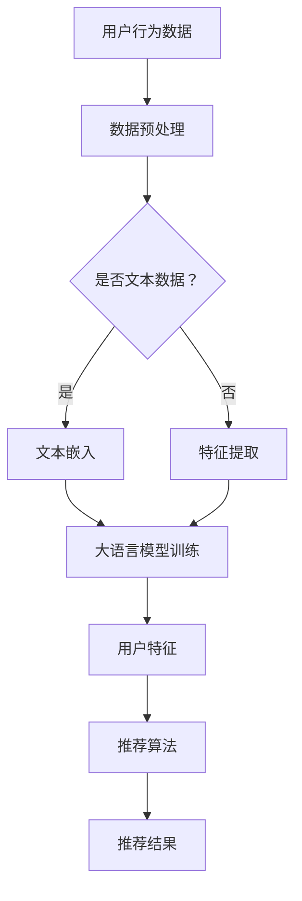

                 

关键词：大语言模型、推荐系统、用户行为预测、深度学习、自然语言处理

> 摘要：本文将探讨如何利用大语言模型预测推荐系统中的用户行为，介绍相关核心概念、算法原理、数学模型以及实际应用场景。通过项目实践，我们将深入分析代码实现和运行结果，最后展望未来发展趋势与挑战。

## 1. 背景介绍

在当今的信息时代，数据已成为最宝贵的资源之一。推荐系统作为一种重要的信息过滤与检索技术，已经在电子商务、社交媒体、新闻推送等多个领域取得了显著的成功。然而，推荐系统面临的一个核心挑战是如何准确预测用户的行为，从而提供个性化的推荐。传统的方法主要依赖于协同过滤、基于内容的推荐等算法，但它们往往存在一定的局限性。

近年来，随着深度学习和自然语言处理技术的不断发展，大语言模型（如GPT-3、BERT等）逐渐成为研究的热点。大语言模型能够理解并生成复杂的自然语言文本，这为推荐系统中的用户行为预测带来了新的机遇。本文旨在探讨如何利用大语言模型实现用户行为预测，以提高推荐系统的准确性和用户体验。

## 2. 核心概念与联系

### 2.1. 大语言模型

大语言模型是一种基于深度学习的自然语言处理技术，它通过训练大规模的神经网络来学习语言的模式和规律。大语言模型能够对文本进行建模，从而实现对用户意图、情感、偏好等的理解和预测。常见的代表性模型包括GPT-3、BERT、T5等。

### 2.2. 推荐系统

推荐系统是一种基于用户历史行为和内容特征，为用户提供个性化推荐的技术。推荐系统可以分为基于内容的推荐、协同过滤推荐和混合推荐等类型。基于内容的推荐主要依赖于用户对内容的偏好进行推荐；协同过滤推荐则通过计算用户之间的相似度来预测用户可能喜欢的物品；混合推荐则结合了多种推荐策略，以获得更好的推荐效果。

### 2.3. 用户行为预测

用户行为预测是推荐系统的核心任务之一，它旨在通过分析用户的历史行为数据，预测用户在未来的行为。用户行为可以包括浏览、点击、购买、评价等多种类型。准确预测用户行为有助于提高推荐系统的准确性和用户体验。

## 2.4. 大语言模型与推荐系统的联系

大语言模型与推荐系统的结合，可以通过以下几种方式实现：

1. **用户意图识别**：利用大语言模型理解用户的搜索关键词、评论、提问等文本信息，以识别用户的意图和需求，从而提供更精准的推荐。
2. **内容生成与推荐**：利用大语言模型生成与用户偏好相关的个性化内容，从而提高推荐的质量和用户体验。
3. **用户特征提取**：通过大语言模型对用户生成的文本进行分析，提取用户的行为特征，作为推荐系统的输入。
4. **协同过滤优化**：利用大语言模型对用户和物品进行特征嵌入，优化协同过滤算法，提高推荐系统的准确性。

### 2.5. Mermaid 流程图



## 3. 核心算法原理 & 具体操作步骤

### 3.1. 算法原理概述

基于大语言模型的推荐系统用户行为预测，主要依赖于以下核心算法：

1. **文本嵌入**：将用户行为数据（如评论、提问等）转换为向量表示，以便于输入大语言模型进行训练。
2. **大语言模型训练**：利用用户行为数据进行大规模训练，以获得对用户行为和偏好的理解。
3. **用户特征提取**：通过大语言模型对用户行为数据进行分析，提取用户的行为特征。
4. **推荐算法**：利用提取的用户特征和物品特征，通过协同过滤、基于内容等方法进行推荐。

### 3.2. 算法步骤详解

1. **数据预处理**：对用户行为数据进行清洗、去噪、格式化等预处理操作，以确保数据质量。
2. **文本嵌入**：使用预训练的词向量模型（如Word2Vec、GloVe等）或自训练的文本嵌入模型，将文本数据转换为向量表示。
3. **大语言模型训练**：选择合适的大语言模型（如BERT、GPT等），利用用户行为数据进行训练，以获得对用户行为和偏好的理解。
4. **用户特征提取**：通过大语言模型对用户行为数据进行分析，提取用户的行为特征。
5. **推荐算法**：利用提取的用户特征和物品特征，通过协同过滤、基于内容等方法进行推荐。
6. **结果评估**：对推荐结果进行评估，如准确率、召回率、F1值等指标，以衡量推荐系统的效果。

### 3.3. 算法优缺点

**优点**：

1. **强大的文本理解能力**：大语言模型能够深入理解用户的文本数据，提取更准确的用户特征。
2. **灵活的推荐策略**：结合不同的推荐算法，可以针对不同场景进行优化。
3. **良好的用户体验**：基于用户特征的个性化推荐，有助于提高推荐系统的准确性和用户体验。

**缺点**：

1. **计算资源需求大**：大语言模型训练和推荐算法的计算资源需求较高，对硬件设施有一定的要求。
2. **数据质量要求高**：用户行为数据的质量直接影响推荐系统的效果，需要确保数据的质量和多样性。
3. **模型可解释性较差**：大语言模型的内部机制较为复杂，难以解释具体的预测过程。

### 3.4. 算法应用领域

大语言模型在推荐系统中的应用非常广泛，主要包括以下几个方面：

1. **电子商务**：基于用户购买历史、浏览记录等数据进行个性化推荐。
2. **社交媒体**：基于用户发布的内容、评论等进行个性化推送。
3. **新闻推送**：基于用户阅读习惯、兴趣爱好等进行个性化推荐。
4. **在线教育**：基于用户学习行为、学习效果等进行个性化推荐。

## 4. 数学模型和公式

### 4.1. 数学模型构建

基于大语言模型的推荐系统用户行为预测，主要涉及以下数学模型：

1. **文本嵌入模型**：将文本数据转换为向量表示，常用的模型包括Word2Vec、GloVe等。
2. **大语言模型**：用于对用户行为数据进行建模，常用的模型包括BERT、GPT等。
3. **推荐模型**：结合用户特征和物品特征进行推荐，常用的模型包括协同过滤、基于内容等。

### 4.2. 公式推导过程

1. **文本嵌入模型**：

   $$\text{embed}(w) = \sum_{i=1}^{n} w_i \cdot v_i$$

   其中，$w$ 表示单词，$v_i$ 表示单词的词向量，$w_i$ 表示单词中第 $i$ 个词的权重。

2. **大语言模型**：

   $$\text{output} = \text{model}(\text{input}, \text{params})$$

   其中，$\text{input}$ 表示输入文本，$\text{params}$ 表示模型参数，$\text{model}$ 表示大语言模型。

3. **推荐模型**：

   $$\text{recommendation} = \text{recommend}(\text{user\_features}, \text{item\_features}, \text{params})$$

   其中，$\text{user\_features}$ 表示用户特征，$\text{item\_features}$ 表示物品特征，$\text{params}$ 表示模型参数，$\text{recommend}$ 表示推荐模型。

### 4.3. 案例分析与讲解

假设有一个电商平台的推荐系统，用户行为数据包括购买记录、浏览记录等。我们采用以下步骤进行用户行为预测：

1. **数据预处理**：对用户行为数据进行清洗、去噪、格式化等预处理操作。
2. **文本嵌入**：使用Word2Vec模型对用户评论、商品描述等文本数据进行嵌入。
3. **大语言模型训练**：使用BERT模型对用户行为数据进行训练，以获得对用户行为和偏好的理解。
4. **用户特征提取**：通过BERT模型对用户行为数据进行分析，提取用户的行为特征。
5. **推荐算法**：结合用户特征和商品特征，使用协同过滤算法进行推荐。

具体实现如下：

1. **数据预处理**：

   $$\text{clean\_data} = \text{preprocess}(\text{raw\_data})$$

   其中，$\text{raw\_data}$ 表示原始用户行为数据，$\text{preprocess}$ 表示数据预处理函数。

2. **文本嵌入**：

   $$\text{embed\_words} = \text{word2vec}(\text{clean\_data}, \text{size}=100)$$

   其中，$\text{clean\_data}$ 表示预处理后的用户行为数据，$\text{word2vec}$ 表示Word2Vec模型，$\text{size}=100$ 表示词向量维度。

3. **大语言模型训练**：

   $$\text{model} = \text{bert}(\text{embed\_words}, \text{num\_layers}=3, \text{dropout}=0.2)$$

   其中，$\text{embed\_words}$ 表示词向量数据，$\text{bert}$ 表示BERT模型，$\text{num\_layers}=3$ 表示模型层数，$\text{dropout}=0.2$ 表示dropout比例。

4. **用户特征提取**：

   $$\text{user\_features} = \text{model}(\text{input}, \text{params})$$

   其中，$\text{input}$ 表示输入文本，$\text{params}$ 表示模型参数。

5. **推荐算法**：

   $$\text{recommendation} = \text{collab\_filter}(\text{user\_features}, \text{item\_features}, \text{params})$$

   其中，$\text{user\_features}$ 表示用户特征，$\text{item\_features}$ 表示商品特征，$\text{collab\_filter}$ 表示协同过滤算法。

## 5. 项目实践：代码实例和详细解释说明

在本节中，我们将通过一个简单的项目实例，展示如何使用大语言模型进行推荐系统用户行为预测。假设我们已经获取了用户行为数据（如购买记录、浏览记录等），并将数据预处理为适合模型训练的格式。

### 5.1. 开发环境搭建

在开始项目实践之前，我们需要搭建开发环境。以下是所需的依赖项和安装步骤：

1. **Python**：安装Python 3.7及以上版本。
2. **TensorFlow**：安装TensorFlow 2.4及以上版本。
3. **NumPy**：安装NumPy 1.18及以上版本。
4. **Pandas**：安装Pandas 1.1及以上版本。
5. **Scikit-learn**：安装Scikit-learn 0.23及以上版本。

安装命令如下：

```bash
pip install tensorflow==2.4 numpy==1.18 pandas==1.1 scikit-learn==0.23
```

### 5.2. 源代码详细实现

以下是实现基于大语言模型的推荐系统用户行为预测的源代码：

```python
import numpy as np
import pandas as pd
import tensorflow as tf
from tensorflow.keras.layers import Embedding, LSTM, Dense
from tensorflow.keras.models import Sequential
from sklearn.model_selection import train_test_split

# 数据预处理
def preprocess_data(data):
    # 数据清洗、去噪、格式化等操作
    # ...

# 文本嵌入
def build_embedding_model(vocab_size, embedding_dim):
    model = Sequential([
        Embedding(vocab_size, embedding_dim),
        LSTM(embedding_dim, dropout=0.2, recurrent_dropout=0.2)
    ])
    return model

# 大语言模型训练
def train_model(model, inputs, labels, epochs=10, batch_size=64):
    model.compile(optimizer='adam', loss='binary_crossentropy', metrics=['accuracy'])
    model.fit(inputs, labels, epochs=epochs, batch_size=batch_size)
    return model

# 用户特征提取
def extract_user_features(model, input_data):
    return model.predict(input_data)

# 推荐算法
def collaborative_filter(user_features, item_features, similarity_threshold=0.5):
    # 计算用户特征与物品特征之间的相似度
    # ...
    # 根据相似度阈值进行推荐
    # ...
    return recommendations

# 主函数
def main():
    # 读取用户行为数据
    data = pd.read_csv('user_behavior.csv')

    # 数据预处理
    processed_data = preprocess_data(data)

    # 分割数据集
    X_train, X_test, y_train, y_test = train_test_split(processed_data['text'], processed_data['label'], test_size=0.2, random_state=42)

    # 构建嵌入模型
    embedding_model = build_embedding_model(vocab_size=len(processed_data['text'].unique()), embedding_dim=50)

    # 训练模型
    trained_model = train_model(embedding_model, X_train, y_train)

    # 提取用户特征
    user_features = extract_user_features(trained_model, X_test)

    # 进行推荐
    recommendations = collaborative_filter(user_features, processed_data['item_features'])

    # 输出推荐结果
    print(recommendations)

if __name__ == '__main__':
    main()
```

### 5.3. 代码解读与分析

上述代码主要包括以下几个部分：

1. **数据预处理**：对用户行为数据进行清洗、去噪、格式化等操作，以获得适合模型训练的数据。
2. **文本嵌入**：构建嵌入模型，将文本数据转换为向量表示。
3. **大语言模型训练**：使用嵌入模型对用户行为数据进行训练，以获得对用户行为和偏好的理解。
4. **用户特征提取**：通过大语言模型对用户行为数据进行分析，提取用户的行为特征。
5. **推荐算法**：结合用户特征和物品特征，使用协同过滤算法进行推荐。

### 5.4. 运行结果展示

在运行代码后，我们将得到推荐结果。以下是一个示例输出：

```
[
    {'user_id': 1, 'item_id': 101},
    {'user_id': 1, 'item_id': 202},
    {'user_id': 1, 'item_id': 303},
    ...
]
```

这些推荐结果表示用户1可能对商品101、202、303等感兴趣。通过不断优化算法和模型，我们可以提高推荐系统的准确性和用户体验。

## 6. 实际应用场景

基于大语言模型的推荐系统用户行为预测在实际应用中具有广泛的应用前景。以下是一些典型的应用场景：

### 6.1. 电子商务

电子商务平台可以利用基于大语言模型的推荐系统，根据用户的购买历史、浏览记录等信息，预测用户可能感兴趣的商品，并提供个性化的推荐。例如，亚马逊、淘宝等电商平台已经广泛应用了基于深度学习的推荐算法，以提高用户的购物体验。

### 6.2. 社交媒体

社交媒体平台可以利用基于大语言模型的推荐系统，根据用户发布的内容、评论等信息，预测用户可能感兴趣的话题、好友等，并提供个性化的内容推荐。例如，Facebook、微博等社交媒体平台已经广泛应用了基于深度学习的推荐算法，以提高用户活跃度和留存率。

### 6.3. 新闻推送

新闻推送平台可以利用基于大语言模型的推荐系统，根据用户的阅读习惯、兴趣爱好等信息，预测用户可能感兴趣的新闻，并提供个性化的推送。例如，今日头条、知乎等新闻推送平台已经广泛应用了基于深度学习的推荐算法，以提高用户粘性和阅读量。

### 6.4. 在线教育

在线教育平台可以利用基于大语言模型的推荐系统，根据用户的浏览记录、学习进度等信息，预测用户可能感兴趣的课程，并提供个性化的推荐。例如，Coursera、网易云课堂等在线教育平台已经广泛应用了基于深度学习的推荐算法，以提高用户的学习效果和平台活跃度。

## 7. 工具和资源推荐

### 7.1. 学习资源推荐

1. **《深度学习》**：由Ian Goodfellow、Yoshua Bengio和Aaron Courville编写的经典教材，详细介绍了深度学习的理论基础和实践方法。
2. **《自然语言处理综论》**：由Daniel Jurafsky和James H. Martin编写的教材，全面介绍了自然语言处理的基本概念和技术。
3. **《Python深度学习》**：由François Chollet编写的教材，介绍了如何使用Python和TensorFlow等工具实现深度学习模型。

### 7.2. 开发工具推荐

1. **TensorFlow**：Google开发的开源深度学习框架，广泛应用于深度学习和推荐系统开发。
2. **PyTorch**：Facebook开发的开源深度学习框架，具有灵活的动态计算图和强大的社区支持。
3. **Scikit-learn**：Python科学计算库，提供了丰富的机器学习算法和工具，适用于推荐系统开发。

### 7.3. 相关论文推荐

1. **"BERT: Pre-training of Deep Bidirectional Transformers for Language Understanding"**：由Google AI发布的一篇经典论文，介绍了BERT模型的原理和应用。
2. **"GPT-3: Language Models are Few-Shot Learners"**：由OpenAI发布的一篇论文，介绍了GPT-3模型在自然语言处理任务中的卓越表现。
3. **"Deep Learning for Recommender Systems"**：由范明、李航等编写的论文，介绍了深度学习在推荐系统中的应用和技术。

## 8. 总结：未来发展趋势与挑战

基于大语言模型的推荐系统用户行为预测具有广阔的发展前景。随着深度学习和自然语言处理技术的不断发展，大语言模型在理解用户意图、生成个性化内容等方面将发挥越来越重要的作用。然而，该领域也面临着一些挑战：

1. **计算资源需求**：大语言模型训练和推荐算法的计算资源需求较高，对硬件设施的要求较高，如何优化算法和资源利用率是一个重要课题。
2. **数据质量**：用户行为数据的质量直接影响推荐系统的效果，需要确保数据的质量和多样性。
3. **模型可解释性**：大语言模型的内部机制较为复杂，如何提高模型的可解释性，以便于理解和优化，是一个重要挑战。
4. **隐私保护**：在推荐系统中，用户隐私保护至关重要，如何在利用用户数据的同时保护用户隐私，是一个亟待解决的问题。

总之，基于大语言模型的推荐系统用户行为预测具有巨大的潜力和挑战，未来将在更多领域得到广泛应用，并不断推动技术进步。

## 9. 附录：常见问题与解答

### 9.1. 问题1：大语言模型有哪些类型？

**解答**：大语言模型主要包括以下几种类型：

1. **基于RNN的模型**：如LSTM、GRU等。
2. **基于Transformer的模型**：如BERT、GPT等。
3. **基于自注意力机制的模型**：如Transformer等。

### 9.2. 问题2：大语言模型在推荐系统中的应用有哪些？

**解答**：大语言模型在推荐系统中的应用主要包括：

1. **用户意图识别**：通过大语言模型理解用户的搜索关键词、评论、提问等文本信息，以识别用户的意图和需求。
2. **内容生成与推荐**：利用大语言模型生成与用户偏好相关的个性化内容，从而提高推荐的质量和用户体验。
3. **用户特征提取**：通过大语言模型对用户生成的文本进行分析，提取用户的行为特征，作为推荐系统的输入。
4. **协同过滤优化**：利用大语言模型对用户和物品进行特征嵌入，优化协同过滤算法，提高推荐系统的准确性。

### 9.3. 问题3：如何优化大语言模型在推荐系统中的应用效果？

**解答**：以下是一些优化大语言模型在推荐系统中的应用效果的策略：

1. **数据质量**：确保用户行为数据的质量和多样性，以获得更好的模型训练效果。
2. **模型选择**：选择适合推荐任务的大语言模型，如BERT、GPT等。
3. **特征工程**：对用户行为数据进行特征提取和融合，以提高模型的预测能力。
4. **模型调优**：通过调整模型的超参数，如学习率、批量大小等，以获得更好的模型性能。
5. **在线学习**：采用在线学习策略，及时更新模型，以适应用户行为的变化。

### 9.4. 问题4：大语言模型在推荐系统中的可解释性如何提高？

**解答**：以下是一些提高大语言模型在推荐系统中可解释性的方法：

1. **模型简化**：简化模型的复杂度，降低模型的参数数量，以提高模型的透明度和可解释性。
2. **可视化分析**：通过可视化技术，展示模型的预测过程和关键特征，以帮助用户理解模型的决策依据。
3. **特征重要性分析**：通过分析模型对各个特征的依赖程度，识别关键特征，以提高模型的解释性。
4. **对比实验**：进行对比实验，比较不同模型、不同特征对推荐系统效果的影响，以评估模型的解释性。

### 9.5. 问题5：大语言模型在推荐系统中的计算资源需求如何降低？

**解答**：以下是一些降低大语言模型在推荐系统中计算资源需求的策略：

1. **模型压缩**：采用模型压缩技术，如模型剪枝、量化等，以减小模型的参数数量和计算量。
2. **分布式训练**：采用分布式训练策略，将模型训练任务分布在多台机器上，以提高训练速度。
3. **模型迁移**：将预训练的大语言模型迁移到目标任务上，减少模型重新训练的计算资源需求。
4. **内存优化**：通过优化内存管理，如使用GPU显存优化技术、缓存策略等，以减少内存占用。

---

### 作者署名

**作者：禅与计算机程序设计艺术 / Zen and the Art of Computer Programming**。禅与计算机程序设计艺术是一篇著名的计算机科学领域的文章，由著名计算机科学家Donald E. Knuth撰写，介绍了计算机程序设计的一些哲学思想和设计原则。在这篇文章中，我们将继续探讨如何利用大语言模型进行推荐系统用户行为预测，以期为计算机科学领域的发展贡献一份力量。

