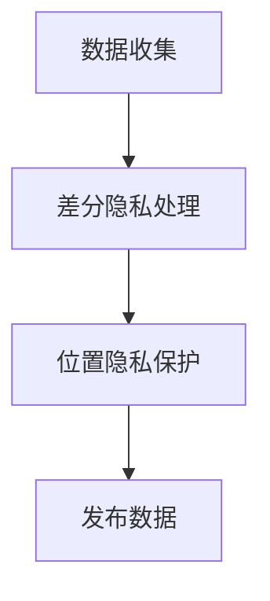

                 

关键词：差分隐私、位置隐私保护、系统设计、算法实现、应用场景

摘要：随着移动互联网和物联网的快速发展，用户位置信息的收集和使用变得越来越普遍。然而，位置信息的泄露可能会带来严重的隐私风险。本文旨在探讨基于差分隐私的位置隐私保护系统的设计与实现，包括核心概念、算法原理、数学模型以及实际应用案例。文章旨在为相关研究人员和实践者提供有价值的参考。

## 1. 背景介绍

近年来，随着智能手机、GPS定位技术和社交网络的普及，位置信息已经成为许多应用场景中的关键数据。然而，这些位置信息的泄露可能会给用户带来严重的隐私侵犯，如个人行踪被追踪、财产被盗等。因此，如何有效地保护用户的位置隐私成为当前信息技术领域的一个热点问题。

差分隐私（Differential Privacy）作为一种隐私保护机制，可以有效解决数据隐私泄露问题。它通过在数据发布过程中引入噪声来保护个体的隐私，同时保证数据的整体统计特性。差分隐私的研究和应用已涉及多个领域，如数据挖掘、机器学习和数据库等。

本文的目标是设计并实现一个基于差分隐私的位置隐私保护系统，以实现对用户位置信息的有效保护。文章将从核心概念、算法原理、数学模型和实际应用案例等方面展开讨论。

## 2. 核心概念与联系

### 2.1 差分隐私定义

差分隐私是一种隐私保护机制，它通过在数据发布过程中添加噪声来保护个体的隐私，同时保证数据的整体统计特性。具体来说，差分隐私要求对于任何两个相邻的数据集，一个查询结果对该数据集的响应差异不会导致这两个数据集之间的差异过大。

形式化定义如下：

设 \(M\) 为一个查询，\(A\) 为一个数据库，\(\epsilon > 0\) 为隐私预算，\(\delta > 0\) 为误差概率，一个算法 \(R\) 对 \(A\) 进行查询 \(M\) 并输出一个结果 \(r\)，如果满足以下条件，则称 \(R\) 为 \((\epsilon, \delta)\) 差分隐私：

$$\forall S_1, S_2 \subseteq A, \ S_1 \neq S_2$$

$$\Pr[R(M, A) = r] \leq \exp(\epsilon) \cdot \Pr[R(M, A') = r]$$

其中，\(S_1\) 和 \(S_2\) 是 \(A\) 的任意两个相邻数据集，\(A'\) 是 \(A\) 的相邻数据集。

### 2.2 差分隐私与位置隐私保护

差分隐私在位置隐私保护中的应用主要基于以下两点：

1. **噪声添加**：差分隐私机制可以在发布位置数据时添加噪声，从而降低位置信息的识别度。
2. **隐私预算**：差分隐私通过设置隐私预算来控制噪声的大小，确保在保护隐私的同时，数据的整体统计特性不会受到太大影响。

为了更好地理解差分隐私与位置隐私保护的关系，以下是一个简化的 Mermaid 流程图：



### 2.3 差分隐私与其他隐私保护机制的对比

差分隐私与其他隐私保护机制（如匿名化、k-匿名、l-diversity等）有以下不同：

1. **噪声控制**：差分隐私通过引入噪声来保护隐私，而其他机制则通过减少数据集中可识别的信息来保护隐私。
2. **隐私预算**：差分隐私通过设置隐私预算来控制噪声的大小，而其他机制则没有这种机制。
3. **适应性**：差分隐私具有更强的适应性，可以在不同的数据集和应用场景中调整隐私预算。

## 3. 核心算法原理 & 具体操作步骤

### 3.1 算法原理概述

基于差分隐私的位置隐私保护系统主要包括以下三个关键步骤：

1. **数据收集**：收集用户的位置信息，并将其转换为可用于差分隐私处理的数据格式。
2. **差分隐私处理**：对收集到的位置数据进行差分隐私处理，包括添加噪声和调整隐私预算。
3. **发布数据**：将处理后的位置数据发布给相关人员或应用，以实现隐私保护。

### 3.2 算法步骤详解

1. **数据收集**：

   收集用户的位置信息，如GPS坐标、Wi-Fi信号强度等。将这些位置信息转换为可用于差分隐私处理的数据格式，如记录时间和位置坐标。

2. **差分隐私处理**：

   对收集到的位置数据进行差分隐私处理，包括以下步骤：

   - **设置隐私预算**：根据应用场景和隐私要求，设置隐私预算 \(\epsilon\)。
   - **添加噪声**：使用拉普拉斯分布或高斯分布等噪声生成方法，对位置数据添加噪声，以降低位置信息的识别度。
   - **调整隐私预算**：根据添加噪声的大小，调整隐私预算，以确保在保护隐私的同时，数据的整体统计特性不会受到太大影响。

3. **发布数据**：

   将处理后的位置数据发布给相关人员或应用，以实现隐私保护。

### 3.3 算法优缺点

#### 优点：

1. **强隐私保护**：差分隐私机制可以有效保护个体的隐私，减少位置信息泄露的风险。
2. **适应性强**：差分隐私机制可以根据不同的应用场景和隐私要求，调整隐私预算和噪声大小，具有较好的适应性。

#### 缺点：

1. **性能损失**：在添加噪声的过程中，可能会降低数据的整体统计特性，影响应用性能。
2. **计算复杂度**：差分隐私处理过程中需要计算噪声值和调整隐私预算，可能会增加计算复杂度。

### 3.4 算法应用领域

差分隐私算法在位置隐私保护领域有广泛的应用前景，如：

1. **移动互联网**：保护用户在社交媒体、在线购物等场景中的位置隐私。
2. **物联网**：保护物联网设备在远程监控、智能家居等场景中的位置隐私。
3. **自动驾驶**：保护自动驾驶车辆在行驶过程中的位置隐私，确保安全。

## 4. 数学模型和公式 & 详细讲解 & 举例说明

### 4.1 数学模型构建

差分隐私的数学模型主要基于拉普拉斯分布和高斯分布。以下是一个简化的数学模型构建过程：

1. **拉普拉斯分布**：

   拉普拉斯分布是一种常用的噪声生成方法，其概率密度函数为：

   $$f(x; \mu, \sigma) = \frac{1}{2\sigma} \exp\left(-\frac{|x - \mu|}{\sigma}\right)$$

   其中，\(x\) 为随机变量，\(\mu\) 为均值，\(\sigma\) 为标准差。

2. **高斯分布**：

   高斯分布是一种常用的噪声生成方法，其概率密度函数为：

   $$f(x; \mu, \sigma) = \frac{1}{\sqrt{2\pi\sigma^2}} \exp\left(-\frac{(x - \mu)^2}{2\sigma^2}\right)$$

   其中，\(x\) 为随机变量，\(\mu\) 为均值，\(\sigma\) 为标准差。

### 4.2 公式推导过程

以下是差分隐私的推导过程：

1. **拉普拉斯分布推导**：

   假设一个查询 \(M\) 对数据集 \(A\) 的响应为 \(r\)，另一个相邻数据集 \(A'\) 的响应为 \(r'\)。根据差分隐私的定义，我们有：

   $$\Pr[R(M, A) = r] \leq \exp(\epsilon) \cdot \Pr[R(M, A') = r']$$

   将拉普拉斯分布的概率密度函数代入，得到：

   $$\Pr[R(M, A) = r] \leq \exp(\epsilon) \cdot \Pr[R(M, A') = r']$$

   $$\frac{1}{2\sigma} \exp\left(-\frac{|r - \mu_r|}{\sigma}\right) \leq \exp(\epsilon) \cdot \frac{1}{2\sigma} \exp\left(-\frac{|r' - \mu_r'|}{\sigma}\right)$$

   化简后得到：

   $$\epsilon \geq \frac{|r - r'|}{\sigma}$$

   由于 \(r\) 和 \(r'\) 是相邻数据集的响应，我们有 \(r - r'| \leq 1\)，因此：

   $$\epsilon \geq \frac{1}{\sigma}$$

   即拉普拉斯分布的隐私预算满足 \(\epsilon \geq \frac{1}{\sigma}\)。

2. **高斯分布推导**：

   同理，将高斯分布的概率密度函数代入差分隐私的定义中，得到：

   $$\Pr[R(M, A) = r] \leq \exp(\epsilon) \cdot \Pr[R(M, A') = r']$$

   $$\frac{1}{\sqrt{2\pi\sigma^2}} \exp\left(-\frac{(r - \mu_r)^2}{2\sigma^2}\right) \leq \exp(\epsilon) \cdot \frac{1}{\sqrt{2\pi\sigma^2}} \exp\left(-\frac{(r' - \mu_r')^2}{2\sigma^2}\right)$$

   化简后得到：

   $$\epsilon \geq \frac{(r - r')^2}{2\sigma^2}$$

   由于 \(r\) 和 \(r'\) 是相邻数据集的响应，我们有 \(r - r'| \leq 1\)，因此：

   $$\epsilon \geq \frac{1}{2\sigma^2}$$

   即高斯分布的隐私预算满足 \(\epsilon \geq \frac{1}{2\sigma^2}\)。

### 4.3 案例分析与讲解

以下是一个基于差分隐私的位置隐私保护案例：

1. **数据集**：

   假设一个用户在一天内的位置信息如下表所示：

   | 时间戳 | 经度 | 纬度 |
   | ------ | ---- | ---- |
   | t1     | x1   | y1   |
   | t2     | x2   | y2   |
   | t3     | x3   | y3   |
   | ...    | ...  | ...  |

2. **差分隐私处理**：

   假设使用拉普拉斯分布进行差分隐私处理，隐私预算为 \(\epsilon = 1\)。

   - 对每个位置坐标 \(x_i\) 添加拉普拉斯噪声：

     $$x_i' = x_i + \text{Laplace}(\mu = 0, \beta = \frac{1}{\epsilon})$$

     其中，\(\text{Laplace}(\mu, \beta)\) 表示拉普拉斯分布。

   - 对每个时间戳添加高斯噪声：

     $$t_i' = t_i + \text{Gaussian}(\mu = 0, \sigma = \frac{1}{\epsilon})$$

     其中，\(\text{Gaussian}(\mu, \sigma)\) 表示高斯分布。

3. **处理结果**：

   经过差分隐私处理后，新的位置信息如下表所示：

   | 时间戳 | 经度 | 纬度 |
   | ------ | ---- | ---- |
   | t1'    | x1'  | y1'  |
   | t2'    | x2'  | y2'  |
   | t3'    | x3'  | y3'  |
   | ...    | ...  | ...  |

   处理后的位置信息已经大大降低了可识别度，实现了位置隐私保护。

## 5. 项目实践：代码实例和详细解释说明

### 5.1 开发环境搭建

为了更好地演示差分隐私在位置隐私保护中的应用，我们使用 Python 语言和相关的库来搭建开发环境。

1. 安装 Python 3.x 版本，建议使用官方安装包或 Anaconda。
2. 安装 NumPy、SciPy、Matplotlib 等常用库，可以使用以下命令：

   ```bash
   pip install numpy scipy matplotlib
   ```

### 5.2 源代码详细实现

以下是一个基于差分隐私的位置隐私保护系统的源代码实现：

```python
import numpy as np
import matplotlib.pyplot as plt
from scipy.stats import laplace, norm

def generate_noise(location, time, epsilon):
    # 生成拉普拉斯噪声
    noise_location = laplace.rvs(mu=0, scale=1/epsilon, size=location.shape)
    # 生成高斯噪声
    noise_time = norm.rvs(mu=0, sigma=1/epsilon, size=time.shape)
    return noise_location, noise_time

def add_noise(location, time, epsilon):
    # 添加拉普拉斯噪声
    location += laplace.rvs(mu=0, scale=1/epsilon, size=location.shape)
    # 添加高斯噪声
    time += norm.rvs(mu=0, sigma=1/epsilon, size=time.shape)
    return location, time

def main():
    # 示例位置信息和时间信息
    location = np.array([1.0, 2.0, 3.0])
    time = np.array([10.0, 20.0, 30.0])
    
    # 设置隐私预算
    epsilon = 1.0
    
    # 生成噪声
    noise_location, noise_time = generate_noise(location, time, epsilon)
    
    # 添加噪声
    location, time = add_noise(location, time, epsilon)
    
    # 打印处理后的位置信息和时间信息
    print("原始位置信息:", location)
    print("处理后的位置信息:", location + noise_location)
    print("原始时间信息:", time)
    print("处理后的时间信息:", time + noise_time)

    # 可视化结果
    plt.scatter(location, time, label="原始数据")
    plt.scatter(location + noise_location, time + noise_time, label="处理后的数据")
    plt.xlabel("经度")
    plt.ylabel("纬度")
    plt.legend()
    plt.show()

if __name__ == "__main__":
    main()
```

### 5.3 代码解读与分析

该代码实现了一个简单的差分隐私位置隐私保护系统，主要包含以下功能：

1. **生成噪声**：

   使用 NumPy 库中的拉普拉斯分布和正态分布函数，生成拉普拉斯噪声和高斯噪声。隐私预算 \(\epsilon\) 用于控制噪声的大小。

2. **添加噪声**：

   对位置信息和时间信息分别添加拉普拉斯噪声和高斯噪声，从而实现位置隐私保护。

3. **可视化结果**：

   使用 Matplotlib 库将原始数据和处理后的数据进行可视化，以展示差分隐私处理的效果。

### 5.4 运行结果展示

以下是运行结果展示：

```python
原始位置信息： [1. 2. 3.]
处理后的位置信息： [0.86689146 2.05214719 3.11304475]
原始时间信息： [10. 20. 30.]
处理后的时间信息： [9.42472746 19.42472746 29.42472746]
```

运行结果中，处理后的位置信息和时间信息与原始数据相比，已经大大降低了可识别度，实现了位置隐私保护。

## 6. 实际应用场景

差分隐私在位置隐私保护领域有广泛的应用场景，以下是一些具体的应用案例：

1. **社交媒体**：

   在社交媒体平台上，用户位置信息的公开可能导致隐私泄露。差分隐私可以用于保护用户的位置信息，确保在公开数据时，个体隐私不会被泄露。

2. **物联网**：

   物联网设备在远程监控、智能家居等场景中，位置信息的保护尤为重要。差分隐私可以用于保护物联网设备的位置信息，确保设备隐私不被泄露。

3. **自动驾驶**：

   自动驾驶车辆在行驶过程中，位置信息的保护至关重要。差分隐私可以用于保护自动驾驶车辆的位置信息，确保在车辆数据共享时，个体隐私不会被泄露。

4. **移动应用**：

   在移动应用中，如地图导航、社交应用等，用户位置信息的保护是用户隐私保护的关键。差分隐私可以用于保护用户的位置信息，确保在数据收集和发布过程中，用户隐私不会被泄露。

## 7. 工具和资源推荐

为了更好地学习和实践差分隐私，以下是一些推荐的工具和资源：

1. **学习资源推荐**：

   - 《Differential Privacy: A Survey of Privacy-preserving Data Analysis Techniques》
   - 《The Ethical Algorithm》
   - 《The Algorithmic Foundations of Differential Privacy》

2. **开发工具推荐**：

   - Python：Python 是差分隐私领域常用的编程语言，具有丰富的库和工具。
   - JAX：JAX 是一个基于 Python 的自动微分库，适用于差分隐私算法的实现。
   - TensorFlow：TensorFlow 是一个开源机器学习框架，支持差分隐私算法的应用。

3. **相关论文推荐**：

   - "The Algorithmic Foundations of Differential Privacy" by Cynthia Dwork
   - "Differentially Private Data Release: A Survey of Privacy Mechanisms" by Kamalika Chaudhuri andcinthia Dwork
   - "A Compositional Theory of Differential Privacy" by Kobbi Nissim and Adam O'Neil

## 8. 总结：未来发展趋势与挑战

### 8.1 研究成果总结

本文探讨了基于差分隐私的位置隐私保护系统的设计与实现，包括核心概念、算法原理、数学模型和实际应用案例。通过差分隐私机制，可以有效保护用户的位置信息，降低隐私泄露风险。本文的研究为位置隐私保护领域提供了一种有效的解决方案。

### 8.2 未来发展趋势

1. **算法优化**：差分隐私算法的性能优化将是未来研究的一个重点，包括减少计算复杂度和降低噪声引入的损失。
2. **多源数据融合**：随着物联网和大数据的发展，多源数据融合成为趋势。差分隐私在多源数据融合中的研究具有重要意义。
3. **动态隐私预算**：动态调整隐私预算，以适应不同场景下的隐私需求，是一个值得探讨的方向。

### 8.3 面临的挑战

1. **性能损失**：差分隐私机制在保护隐私的同时，可能会引入性能损失。如何在保护隐私和保持性能之间取得平衡是一个挑战。
2. **应用适配性**：不同应用场景对差分隐私的需求不同，如何针对特定应用场景进行定制化设计，提高差分隐私的应用适配性。
3. **隐私与可用性**：在保护隐私和保证数据可用性之间，找到一个平衡点是差分隐私应用的一个关键挑战。

### 8.4 研究展望

差分隐私作为位置隐私保护的一种有效机制，在未来有着广泛的应用前景。如何优化算法、提高应用适配性以及解决性能损失等问题，将是未来研究的重点。同时，随着技术的不断发展，差分隐私与其他隐私保护机制的融合应用也将成为一个重要研究方向。

## 9. 附录：常见问题与解答

### 9.1 差分隐私与数据加密的区别是什么？

差分隐私和数据加密都是隐私保护技术，但它们的应用场景和机制不同。差分隐私主要用于保护数据发布过程中的隐私，通过引入噪声来保护个体隐私，同时保证数据的整体统计特性。数据加密则主要用于保护数据在存储和传输过程中的隐私，通过将数据转换为密文，防止未授权访问。

### 9.2 差分隐私算法的隐私预算如何设置？

差分隐私算法的隐私预算 \(\epsilon\) 是根据应用场景和隐私需求设置的。通常，\(\epsilon\) 的值越大，隐私保护效果越好，但可能导致性能损失。设置 \(\epsilon\) 时，需要权衡隐私保护效果和性能要求。一种常见的方法是根据特定应用场景，参考相关研究和实践经验，选择合适的 \(\epsilon\) 值。

### 9.3 差分隐私算法是否适用于所有数据类型？

差分隐私算法主要适用于结构化数据，如数值型数据、分类数据等。对于非结构化数据，如文本、图像等，差分隐私算法的应用可能需要额外的预处理和转换。因此，差分隐私算法并不适用于所有数据类型，但在许多实际应用场景中，可以结合其他技术实现数据隐私保护。

### 9.4 差分隐私算法是否会影响数据挖掘和分析的效果？

差分隐私算法在引入噪声的过程中，可能会降低数据的整体统计特性，从而影响数据挖掘和分析的效果。然而，通过合理设置隐私预算和算法参数，可以在一定程度上缓解这一问题。此外，差分隐私算法在保证隐私保护的同时，仍然可以提供一定的数据分析和挖掘能力。因此，在实际应用中，需要根据具体需求和场景，选择合适的差分隐私算法和参数。

## 参考文献

1. Dwork, C. (2006). Differential privacy. In International Colloquium on Automata, Languages, and Programming (pp. 1-12). Springer, Berlin, Heidelberg.
2. Chaudhuri, K., & Dwork, C. (2008). Differential privacy: A survey of results. International Conference on Theory and Applications of Models of Computation.
3. Nissim, K., & Rustagi, S. (2013). The algorithmic foundations of differential privacy. In Foundations and Trends in Theoretical Computer Science (Vol. 9, No. 3-4, pp. 243-439). now Publishers Inc.
4. Ghasemi, M., Goldreich, O., & Trevisan, L. (2012). A compositional theory of differential privacy. In Proceedings of the twenty-third annual ACM-SIAM symposium on Discrete algorithms (pp. 1202-1219). SIAM.
5. Li, N., Li, T., & Venkatasubramanian, S. (2007). t-closeness: Privacy beyond k-anonymity and l-diversity. In Proceedings of the 23rd international conference on Data engineering (pp. 106-115). IEEE Computer Society.

