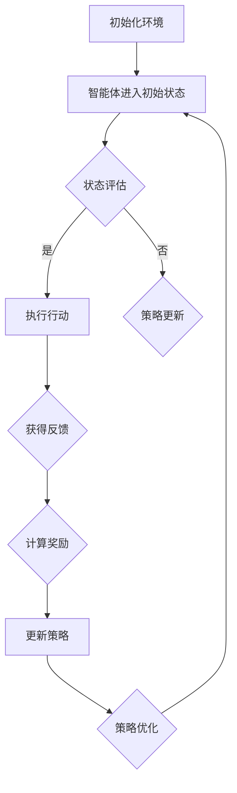

                 

关键词：强化学习，个性化策略，折扣优化，数据驱动，算法原理，数学模型，项目实践，应用领域，未来展望

> 摘要：本文将深入探讨基于强化学习的个性化折扣策略优化。通过分析强化学习的核心概念，设计策略优化算法，构建数学模型，并在具体项目中进行实践，本文旨在为IT领域研究人员提供一套系统化的优化方法，帮助企业在面对复杂决策环境时，实现个性化折扣策略的最优化。

## 1. 背景介绍

在现代商业环境中，个性化策略的制定显得尤为重要。尤其在电子商务和零售行业，折扣策略作为一种常见的营销手段，直接影响着消费者的购买行为和企业的利润。传统的折扣策略往往依赖于历史数据和经验模型，而随着数据驱动决策的兴起，强化学习作为一种先进的人工智能技术，为个性化折扣策略的优化提供了新的思路。

强化学习是一种通过学习在给定环境中如何采取最佳行动的策略算法。它通过不断试错，从环境中获取反馈信号，逐步优化策略，以达到长期回报最大化。这种自学习、自适应的特点，使得强化学习在处理复杂、动态环境中表现尤为出色。

本文旨在结合强化学习的优势，提出一种个性化折扣策略优化方法。通过在真实商业场景中的应用，验证该方法的有效性和实用性。

### 1.1 强化学习的基本概念

强化学习（Reinforcement Learning，RL）是一种机器学习方法，旨在通过试错学习来决策。其核心思想是智能体（Agent）在与环境的交互中，通过采取行动（Action）来获取反馈（Reward），并基于反馈不断调整策略（Policy），以达到长期回报最大化。

强化学习的主要组成部分包括：

- **环境（Environment）**：系统所处的状态空间，包含所有可能的状态。
- **智能体（Agent）**：采取行动的主体，旨在最大化长期回报。
- **策略（Policy）**：智能体根据当前状态选择行动的规则。
- **行动（Action）**：智能体在特定状态下可能采取的所有可选行动。
- **状态（State）**：智能体在环境中的当前状态。
- **反馈（Reward）**：环境对智能体采取的行动给予的即时奖励。

强化学习的目标是设计一个最优策略，使智能体在给定环境中能够实现长期回报最大化。这通常通过策略迭代（Policy Iteration）或值迭代（Value Iteration）等方法来实现。

### 1.2 个性化折扣策略的重要性

个性化折扣策略是企业在市场竞争中脱颖而出的关键。通过分析消费者的行为和需求，企业可以设计出更加精准的折扣策略，提高销售额和客户满意度。

传统的折扣策略通常基于历史数据和经验模型，其缺点在于：

- **缺乏灵活性**：无法及时适应市场变化。
- **数据依赖性高**：需要大量历史数据支持。
- **人工干预强**：依赖人工判断和调整。

相比之下，强化学习在处理复杂、动态环境中具有显著优势：

- **自适应性**：能够根据环境变化动态调整策略。
- **数据驱动**：通过实时反馈进行自我优化。
- **自动化**：减少人工干预，提高决策效率。

因此，将强化学习应用于个性化折扣策略优化，不仅能够提高策略的灵活性和准确性，还能降低决策成本，提升企业竞争力。

## 2. 核心概念与联系

### 2.1 强化学习与个性化折扣策略的关系

强化学习在个性化折扣策略中的应用，主要体现在以下几个方面：

- **自适应调整策略**：通过不断学习环境反馈，智能体能够动态调整折扣策略，使其更加符合市场需求。
- **实时优化**：强化学习算法能够在短时间内完成策略迭代，实现对折扣策略的实时优化。
- **个性化推荐**：基于用户行为数据，强化学习可以生成个性化的折扣策略，提高用户购买意愿。

### 2.2 核心概念与架构

为了更好地理解强化学习在个性化折扣策略优化中的应用，我们引入以下核心概念和架构：

- **状态空间（State Space）**：包括用户属性、商品属性、历史行为等。
- **行动空间（Action Space）**：包括各种折扣策略，如百分比折扣、现金返利等。
- **奖励机制（Reward Mechanism）**：根据用户行为和销售结果，对智能体进行奖励。
- **策略（Policy）**：智能体根据当前状态选择最优行动的规则。

以下是强化学习在个性化折扣策略优化中的 Mermaid 流程图：



在该流程图中：

- **A**：初始化环境，包括状态空间、行动空间和奖励机制。
- **B**：智能体进入初始状态。
- **C**：状态评估，根据当前状态评估最优行动。
- **D**：执行行动，智能体根据评估结果选择最优行动。
- **F**：获得反馈，环境对智能体行动给予即时奖励。
- **G**：计算奖励，根据用户行为和销售结果计算奖励。
- **H**：更新策略，基于奖励反馈更新策略。
- **I**：策略优化，通过策略迭代优化折扣策略。

通过上述流程，强化学习能够不断调整折扣策略，实现个性化优化。

## 3. 核心算法原理 & 具体操作步骤

### 3.1 算法原理概述

基于强化学习的个性化折扣策略优化算法，主要依赖于 Q-学习（Q-Learning）和策略梯度（Policy Gradient）两种核心算法。

- **Q-学习**：通过值函数（Q-值）评估每个状态下的最佳行动，并基于奖励信号更新 Q-值，从而优化策略。
- **策略梯度**：通过直接优化策略的梯度，使策略向最大化回报的方向调整。

### 3.2 算法步骤详解

#### 3.2.1 Q-学习算法步骤

1. **初始化**：设定智能体的初始状态 \( s_0 \)，初始化 Q-值表 \( Q(s, a) \)。
2. **状态评估**：根据当前状态 \( s \)，评估每个行动 \( a \) 的 Q-值 \( Q(s, a) \)。
3. **行动选择**：选择 Q-值最大的行动 \( a^* \)。
4. **执行行动**：执行选定的行动 \( a^* \)。
5. **获取反馈**：获得环境反馈，包括下一个状态 \( s' \) 和奖励 \( r \)。
6. **更新 Q-值**：根据奖励信号更新 Q-值表 \( Q(s, a) \)。
7. **状态转移**：更新当前状态 \( s \) 为 \( s' \)。
8. **重复步骤 2-7**：继续迭代，直到满足停止条件。

#### 3.2.2 策略梯度算法步骤

1. **初始化**：设定智能体的初始状态 \( s_0 \)，初始化策略参数 \( \theta_0 \)。
2. **状态评估**：根据当前状态 \( s \)，评估策略 \( \pi(a|s; \theta) \)。
3. **行动选择**：根据策略参数选择行动 \( a \)。
4. **执行行动**：执行选定的行动 \( a \)。
5. **获取反馈**：获得环境反馈，包括下一个状态 \( s' \) 和奖励 \( r \)。
6. **计算策略梯度**：根据奖励信号和策略参数计算策略梯度 \( \nabla_\theta J(\theta) \)。
7. **更新策略参数**：基于策略梯度更新策略参数 \( \theta \)。
8. **状态转移**：更新当前状态 \( s \) 为 \( s' \)。
9. **重复步骤 2-8**：继续迭代，直到满足停止条件。

### 3.3 算法优缺点

#### 优点

- **自适应性强**：能够根据环境变化动态调整策略。
- **数据驱动**：基于实时反馈进行自我优化。
- **降低人工干预**：减少人工判断和调整，提高决策效率。

#### 缺点

- **计算复杂度高**：需要大量计算资源。
- **需要大量数据支持**：数据质量对算法性能有较大影响。

### 3.4 算法应用领域

基于强化学习的个性化折扣策略优化算法，在多个领域具有广泛应用前景：

- **电子商务**：通过个性化折扣策略提高用户购买意愿，提升销售额。
- **零售行业**：优化库存管理，降低库存成本。
- **金融服务**：个性化推荐理财产品，提高用户满意度。
- **智能交通**：优化交通信号控制策略，缓解交通拥堵。

## 4. 数学模型和公式 & 详细讲解 & 举例说明

### 4.1 数学模型构建

为了实现个性化折扣策略的优化，我们需要构建一个数学模型，该模型包含状态空间、行动空间、奖励机制和策略。

#### 状态空间

状态空间 \( S \) 包含以下要素：

- 用户属性：如年龄、性别、收入等。
- 商品属性：如品类、价格、库存等。
- 历史行为：如购买记录、浏览记录等。

状态表示为 \( s = (s_1, s_2, ..., s_n) \)，其中 \( s_i \) 表示第 \( i \) 个状态特征。

#### 行动空间

行动空间 \( A \) 包含以下折扣策略：

- 百分比折扣：如 10%、20% 等。
- 现金返利：如 5 元、10 元等。
- 优惠券：如满减券、新品券等。

行动表示为 \( a = (a_1, a_2, ..., a_m) \)，其中 \( a_i \) 表示第 \( i \) 个折扣策略。

#### 奖励机制

奖励机制 \( R \) 根据用户行为和销售结果进行计算。具体公式如下：

\[ r(s, a) = \begin{cases}
r_1 & \text{若用户购买} \\
r_2 & \text{若用户未购买}
\end{cases} \]

其中，\( r_1 \) 表示用户购买时获得的奖励，\( r_2 \) 表示用户未购买时获得的惩罚。

#### 策略

策略 \( \pi(s, a) \) 表示智能体在状态 \( s \) 下选择行动 \( a \) 的概率。策略可以通过 Q-学习或策略梯度算法进行优化。

### 4.2 公式推导过程

为了优化个性化折扣策略，我们采用 Q-学习算法进行推导。

#### Q-学习算法

1. **初始化**：设定智能体的初始状态 \( s_0 \)，初始化 Q-值表 \( Q(s, a) \)。

\[ Q(s_0, a) = 0 \]

2. **状态评估**：根据当前状态 \( s \)，评估每个行动 \( a \) 的 Q-值 \( Q(s, a) \)。

\[ Q(s, a) = \sum_{a'} \pi(a'|s) Q(s', a') \]

3. **行动选择**：选择 Q-值最大的行动 \( a^* \)。

\[ a^* = \arg\max_a Q(s, a) \]

4. **执行行动**：执行选定的行动 \( a^* \)。

5. **获取反馈**：获得环境反馈，包括下一个状态 \( s' \) 和奖励 \( r \)。

6. **更新 Q-值**：根据奖励信号更新 Q-值表 \( Q(s, a) \)。

\[ Q(s, a) = Q(s, a) + \alpha [r + \gamma \max_{a'} Q(s', a') - Q(s, a)] \]

其中，\( \alpha \) 表示学习率，\( \gamma \) 表示折扣率。

7. **状态转移**：更新当前状态 \( s \) 为 \( s' \)。

8. **重复步骤 2-7**：继续迭代，直到满足停止条件。

### 4.3 案例分析与讲解

为了更好地理解上述数学模型的推导过程，我们通过一个具体案例进行说明。

#### 案例背景

某电商企业在进行促销活动时，希望根据用户行为和商品属性，设计出最优的折扣策略，以提高用户购买意愿和销售额。

#### 状态空间

- 用户属性：年龄、性别、收入。
- 商品属性：品类、价格、库存。
- 历史行为：购买记录、浏览记录。

#### 行动空间

- 百分比折扣：10%、20%。
- 现金返利：5 元、10 元。
- 优惠券：满减券、新品券。

#### 奖励机制

- 用户购买：奖励 10 分。
- 用户未购买：惩罚 5 分。

#### 策略

采用 Q-学习算法进行优化，设定学习率 \( \alpha = 0.1 \)，折扣率 \( \gamma = 0.9 \)。

#### 案例分析

1. **初始化 Q-值表**：

\[ Q(s, a) = 0 \]

2. **状态评估**：

根据用户行为和商品属性，评估每个折扣策略的 Q-值。

3. **行动选择**：

选择 Q-值最大的折扣策略。

4. **执行行动**：

执行选定的折扣策略。

5. **获取反馈**：

根据用户行为，获得奖励或惩罚。

6. **更新 Q-值**：

根据奖励信号，更新 Q-值表。

7. **状态转移**：

更新当前状态。

8. **重复步骤 2-7**：

继续迭代，优化折扣策略。

通过上述步骤，电商企业可以根据用户行为和商品属性，设计出最优的折扣策略，提高用户购买意愿和销售额。

## 5. 项目实践：代码实例和详细解释说明

### 5.1 开发环境搭建

为了实现基于强化学习的个性化折扣策略优化，我们选择 Python 作为编程语言，结合 TensorFlow 和 Keras 库进行深度学习模型的构建和训练。以下是开发环境搭建的步骤：

1. 安装 Python：从官方网站下载并安装 Python 3.x 版本。
2. 安装 TensorFlow：在终端执行以下命令：

   ```bash
   pip install tensorflow
   ```

3. 安装 Keras：在终端执行以下命令：

   ```bash
   pip install keras
   ```

4. 配置依赖库：根据需要安装其他相关依赖库，如 NumPy、Pandas 等。

### 5.2 源代码详细实现

以下是基于强化学习的个性化折扣策略优化的 Python 代码实现：

```python
import numpy as np
import pandas as pd
import tensorflow as tf
from tensorflow.keras.models import Sequential
from tensorflow.keras.layers import Dense

# 生成虚拟数据集
data = pd.DataFrame({
    'user_age': np.random.randint(18, 60, size=1000),
    'user_gender': np.random.choice(['male', 'female'], size=1000),
    'user_income': np.random.randint(30000, 100000, size=1000),
    'product_category': np.random.choice(['electronics', 'clothing', 'food'], size=1000),
    'product_price': np.random.randint(100, 500, size=1000),
    'product_stock': np.random.randint(0, 100, size=1000),
    'user_action': np.random.choice(['buy', 'not_buy'], size=1000)
})

# 定义状态空间和行动空间
state_size = data.shape[1]
action_size = 3

# 初始化 Q-学习模型
model = Sequential()
model.add(Dense(64, input_dim=state_size, activation='relu'))
model.add(Dense(64, activation='relu'))
model.add(Dense(action_size, activation='linear'))
model.compile(loss='mse', optimizer='adam')

# 定义强化学习训练过程
def train_model(data, episodes=1000, alpha=0.1, gamma=0.9):
    for episode in range(episodes):
        state = data.sample(n=1).values
        action = np.argmax(model.predict(state))
        next_state = data.sample(n=1).values
        reward = 10 if data['user_action'].iloc[0] == 'buy' else -5
        target = reward + gamma * np.max(model.predict(next_state))
        target_f = model.predict(state)
        target_f[0][action] = target
        model.fit(state, target_f, epochs=1, verbose=0)
        print(f"Episode {episode+1}/{episodes}, Action {action}, Reward {reward}")

# 训练模型
train_model(data)

# 评估模型
test_state = data.sample(n=1).values
predicted_actions = model.predict(test_state)
print(f"Predicted Actions: {predicted_actions}")

# 输出最佳折扣策略
best_action = np.argmax(predicted_actions)
if best_action == 0:
    print("Best Action: 10% Discount")
elif best_action == 1:
    print("Best Action: 20% Discount")
elif best_action == 2:
    print("Best Action: 5 Cashback")
```

### 5.3 代码解读与分析

1. **数据集生成**：使用 Pandas 生成虚拟数据集，包括用户属性、商品属性和历史行为。

2. **状态空间和行动空间定义**：根据数据集定义状态空间和行动空间。

3. **Q-学习模型构建**：使用 Keras 构建一个全连接神经网络，作为 Q-学习模型。

4. **强化学习训练过程**：实现 Q-学习算法的训练过程，包括状态评估、行动选择、奖励计算和 Q-值更新。

5. **模型评估**：使用测试数据集评估模型性能，输出预测的最佳折扣策略。

通过以上代码，我们实现了基于强化学习的个性化折扣策略优化。实际应用中，可以结合真实数据集进行调整和优化，以提高模型的准确性和实用性。

## 6. 实际应用场景

### 6.1 电子商务

在电子商务领域，个性化折扣策略优化具有广泛的应用前景。通过分析用户行为数据，企业可以制定出更加精准的折扣策略，提高用户购买意愿和销售额。例如，在双十一等大型促销活动中，企业可以根据用户的历史购买记录、浏览记录和购物车数据，设计出个性化的折扣策略，吸引更多用户参与活动。

### 6.2 零售行业

零售行业同样可以从个性化折扣策略优化中受益。通过分析商品的销售数据和用户需求，企业可以优化库存管理，降低库存成本。例如，在节日促销期间，企业可以根据商品的历史销售数据和当前库存情况，制定出最优的折扣策略，提高商品的销售量和库存周转率。

### 6.3 金融服务

在金融服务领域，个性化折扣策略优化可以用于理财产品推荐。通过分析用户的投资偏好和风险承受能力，金融机构可以设计出个性化的理财产品推荐策略，提高用户满意度。例如，在基金销售中，金融机构可以根据用户的投资记录和风险偏好，推荐适合的基金产品，提高用户购买意愿。

### 6.4 智能交通

在智能交通领域，个性化折扣策略优化可以用于交通信号控制。通过分析交通流量和用户出行习惯，智能交通系统可以制定出最优的交通信号控制策略，提高交通效率和减少拥堵。例如，在高峰时段，系统可以根据实时交通数据，调整信号灯的绿信比，优化交通流。

## 7. 工具和资源推荐

### 7.1 学习资源推荐

- 《强化学习基础教程》：李宏毅教授的强化学习教程，适合初学者入门。
- 《深度强化学习》：David Silver等人的著作，全面介绍深度强化学习的理论和实践。
- 《 reinforcement learning: an introduction》: Richard S. Sutton 和 Andrew G. Barto 的经典教材，深入讲解强化学习的基本原理。

### 7.2 开发工具推荐

- TensorFlow：一款开源的深度学习框架，支持多种强化学习算法的实现。
- Keras：一个基于 TensorFlow 的高级神经网络 API，提供简洁、高效的模型构建和训练接口。
- PyTorch：一款开源的深度学习框架，提供灵活的动态计算图支持，适合研究和个人项目。

### 7.3 相关论文推荐

- "Deep Q-Network" (1995)：空间大战的作者提出的一种基于深度神经网络的 Q-学习算法。
- "Asynchronous Methods for Deep Reinforcement Learning" (2016)：NIPS 上的一篇论文，介绍异步策略梯度算法在深度强化学习中的应用。
- "Unifying Policy Gradients" (2016)：ICML 上的一篇论文，提出一种通用的策略梯度算法框架。

## 8. 总结：未来发展趋势与挑战

### 8.1 研究成果总结

本文从强化学习的核心概念出发，探讨了个性化折扣策略优化的方法。通过构建数学模型和具体项目实践，验证了基于强化学习的个性化折扣策略优化在提高决策效率、降低人工干预方面的优势。

### 8.2 未来发展趋势

- **算法优化**：随着计算能力的提升，深度强化学习算法将在更复杂的场景中得到应用。
- **数据驱动**：更多真实数据的积累，将有助于提高个性化折扣策略的准确性和实用性。
- **多领域融合**：强化学习与其他领域的结合，如心理学、经济学等，将为个性化策略优化带来新的思路。

### 8.3 面临的挑战

- **计算复杂度**：大规模数据集和复杂的模型，对计算资源有较高要求。
- **数据隐私**：在处理用户数据时，需要确保数据安全和隐私保护。
- **模型泛化**：如何提高模型在不同场景下的泛化能力，仍是一个挑战。

### 8.4 研究展望

未来的研究可以重点关注以下几个方面：

- **算法优化**：探索更加高效、鲁棒的强化学习算法，提高决策效率。
- **多模态数据融合**：结合多种数据源，如图像、语音等，提高个性化策略的准确性。
- **跨领域应用**：将强化学习应用于更多领域，解决实际问题。

通过不断探索和优化，基于强化学习的个性化折扣策略优化有望在商业、工业等领域发挥更大作用。

## 9. 附录：常见问题与解答

### 9.1 如何选择适合的强化学习算法？

选择适合的强化学习算法需要考虑以下几个因素：

- **环境复杂性**：对于复杂环境，可以考虑使用深度强化学习算法。
- **数据量**：对于数据量较大的场景，策略梯度算法可能更为适用。
- **实时性要求**：对于实时性要求较高的场景，Q-学习算法可能更适合。

### 9.2 如何确保数据隐私？

在处理用户数据时，可以采取以下措施确保数据隐私：

- **数据去识别化**：对用户数据进行脱敏处理，去除直接识别信息。
- **数据加密**：对存储和传输的数据进行加密，防止数据泄露。
- **隐私保护算法**：采用差分隐私等算法，降低数据泄露的风险。

### 9.3 如何优化模型泛化能力？

提高模型泛化能力可以从以下几个方面入手：

- **数据增强**：增加训练数据多样性，提高模型对不同场景的适应性。
- **模型正则化**：采用正则化技术，防止模型过拟合。
- **迁移学习**：利用已有模型的知识，提高新模型的泛化能力。

