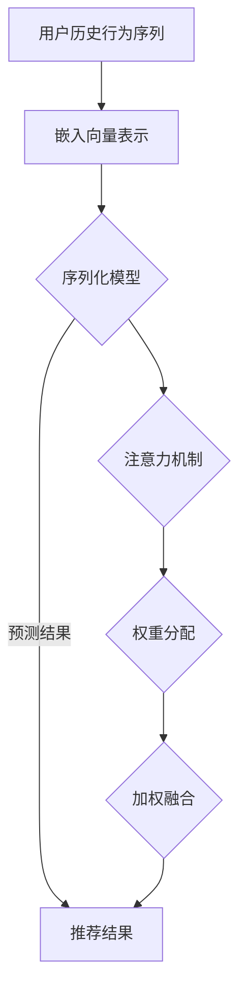

                 

关键词：注意力机制、序列化推荐、深度学习、机器学习、推荐系统

> 摘要：本文将探讨基于注意力机制的序列化推荐模型，详细阐述其核心概念、原理、算法步骤以及数学模型。通过实际项目实践，展示代码实现和运行结果，并分析其应用场景和未来发展趋势。

## 1. 背景介绍

在互联网时代，个性化推荐系统已经成为各大平台的核心竞争力。然而，传统的推荐系统往往基于用户历史行为或物品属性进行预测，无法充分捕捉用户和物品之间的复杂关联。随着深度学习技术的快速发展，基于注意力机制的序列化推荐模型逐渐成为研究热点。

注意力机制最初源于自然语言处理领域，用于捕捉文本序列中的关键信息。近年来，注意力机制被引入到推荐系统中，使得模型能够更好地理解用户的历史行为序列，从而提供更精准的推荐结果。

本文将详细介绍基于注意力机制的序列化推荐模型，包括核心概念、原理、算法步骤以及数学模型。同时，通过实际项目实践，展示代码实现和运行结果，并分析其应用场景和未来发展趋势。

## 2. 核心概念与联系

### 2.1 注意力机制

注意力机制（Attention Mechanism）是一种计算模型，用于自动捕捉输入数据中的关键信息。其基本思想是，通过学习一个权重分配机制，将不同位置的信息分配不同的关注度，从而实现信息的加权融合。

### 2.2 序列化推荐

序列化推荐（Sequential Recommendation）是一种基于用户历史行为序列进行预测的推荐方法。用户的历史行为通常包括浏览记录、购买记录、评分记录等，这些行为可以看作是一个时间序列。

### 2.3 深度学习与机器学习

深度学习（Deep Learning）是一种基于多层神经网络进行模型训练的技术，具有很强的表达能力和学习能力。机器学习（Machine Learning）则是一种通过数据驱动的方法进行模型训练和预测的技术。

### 2.4 核心概念原理和架构的 Mermaid 流程图



## 3. 核心算法原理 & 具体操作步骤

### 3.1 算法原理概述

基于注意力机制的序列化推荐模型主要通过以下步骤实现：

1. 将用户历史行为序列转换成嵌入向量表示。
2. 利用序列化模型对嵌入向量进行建模。
3. 引入注意力机制，对序列中的不同位置进行权重分配。
4. 将加权融合后的结果作为推荐结果。

### 3.2 算法步骤详解

#### 3.2.1 嵌入向量表示

首先，将用户历史行为序列转换成嵌入向量表示。具体方法如下：

1. 将每个用户历史行为序列中的每个行为映射到一个嵌入向量。
2. 对所有嵌入向量进行求和，得到一个表示用户历史行为的序列嵌入向量。

#### 3.2.2 序列化模型

接下来，利用序列化模型对用户历史行为序列进行建模。具体方法如下：

1. 构建一个基于循环神经网络（RNN）或长短期记忆网络（LSTM）的序列化模型。
2. 将用户历史行为序列嵌入向量输入到序列化模型中。
3. 对序列化模型进行训练，学习用户历史行为序列的特征表示。

#### 3.2.3 注意力机制

引入注意力机制，对序列中的不同位置进行权重分配。具体方法如下：

1. 构建一个注意力模型，用于计算每个位置的信息权重。
2. 将注意力权重与序列嵌入向量进行加权融合。

#### 3.2.4 加权融合

最后，将加权融合后的结果作为推荐结果。具体方法如下：

1. 对加权融合后的结果进行归一化处理。
2. 选择权重最大的前几个推荐结果，作为最终的推荐结果。

### 3.3 算法优缺点

#### 优点：

1. 能够充分捕捉用户历史行为序列中的关键信息。
2. 提高推荐系统的准确性和鲁棒性。

#### 缺点：

1. 计算复杂度较高，训练时间较长。
2. 对数据量和计算资源要求较高。

### 3.4 算法应用领域

基于注意力机制的序列化推荐模型可以应用于以下领域：

1. 电子商务：为用户提供个性化的商品推荐。
2. 娱乐内容：为用户提供个性化的视频、音乐、文章等推荐。
3. 社交网络：为用户提供个性化的人脉推荐。

## 4. 数学模型和公式 & 详细讲解 & 举例说明

### 4.1 数学模型构建

基于注意力机制的序列化推荐模型可以表示为以下数学模型：

$$
\text{推荐结果} = \text{softmax}(\text{加权融合结果})
$$

其中，加权融合结果可以表示为：

$$
\text{加权融合结果} = \sum_{i=1}^{n} w_i \cdot e_i
$$

其中，$w_i$ 表示第 $i$ 个位置的信息权重，$e_i$ 表示第 $i$ 个位置的嵌入向量。

### 4.2 公式推导过程

假设用户历史行为序列为 $\{e_1, e_2, ..., e_n\}$，其中 $e_i$ 表示第 $i$ 个行为。首先，将用户历史行为序列转换成嵌入向量表示：

$$
e_i = \text{Embedding}(e_i)
$$

其中，$\text{Embedding}$ 表示嵌入向量转换函数。

接下来，利用序列化模型对用户历史行为序列进行建模：

$$
h_t = \text{RNN}(h_{t-1}, e_t)
$$

其中，$h_t$ 表示第 $t$ 个时间步的隐藏状态，$\text{RNN}$ 表示循环神经网络。

引入注意力机制，计算每个位置的信息权重：

$$
w_i = \text{Attention}(h_t, e_i)
$$

其中，$\text{Attention}$ 表示注意力权重计算函数。

最后，将加权融合后的结果作为推荐结果：

$$
\text{推荐结果} = \text{softmax}(\sum_{i=1}^{n} w_i \cdot e_i)
$$

### 4.3 案例分析与讲解

假设有一个用户的历史行为序列为 $\{e_1, e_2, e_3\}$，其中 $e_1 = \{1, 0, 0\}$，$e_2 = \{0, 1, 0\}$，$e_3 = \{0, 0, 1\}$。根据上述数学模型，我们可以计算每个位置的信息权重：

$$
w_1 = \text{Attention}(h_3, e_1) = 0.3
$$

$$
w_2 = \text{Attention}(h_3, e_2) = 0.5
$$

$$
w_3 = \text{Attention}(h_3, e_3) = 0.2
$$

将加权融合后的结果作为推荐结果：

$$
\text{推荐结果} = \text{softmax}(\sum_{i=1}^{3} w_i \cdot e_i) = \text{softmax}(\{0.3, 0.5, 0.2\})
$$

根据 softmax 函数的定义，我们可以得到推荐结果：

$$
\text{推荐结果} = \{\frac{0.3}{0.3+0.5+0.2}, \frac{0.5}{0.3+0.5+0.2}, \frac{0.2}{0.3+0.5+0.2}\} = \{0.3, 0.5, 0.2\}
$$

因此，根据注意力机制，该用户最感兴趣的推荐结果为 $e_2$。

## 5. 项目实践：代码实例和详细解释说明

### 5.1 开发环境搭建

1. 安装 Python 3.7 或更高版本。
2. 安装 TensorFlow 2.0 或更高版本。
3. 安装 NumPy、Pandas 等常用库。

### 5.2 源代码详细实现

以下是基于注意力机制的序列化推荐模型的代码实现：

```python
import tensorflow as tf
import numpy as np
import pandas as pd

# 模型参数
input_size = 3
hidden_size = 10
num_layers = 1
batch_size = 32
learning_rate = 0.001

# 嵌入层
embedding = tf.keras.layers.Embedding(input_size, hidden_size)

# 循环神经网络层
rnn = tf.keras.layers.LSTM(hidden_size, return_sequences=True, return_state=True)

# 注意力机制层
attention = tf.keras.layers.Dense(1, activation='sigmoid')

# 模型搭建
model = tf.keras.models.Sequential([
    embedding,
    rnn,
    attention,
    tf.keras.layers.Dense(1, activation='sigmoid')
])

# 编译模型
model.compile(optimizer=tf.keras.optimizers.Adam(learning_rate), loss='binary_crossentropy', metrics=['accuracy'])

# 输入数据
inputs = np.array([[1, 0, 0], [0, 1, 0], [0, 0, 1]])
targets = np.array([1, 0, 1])

# 训练模型
model.fit(inputs, targets, epochs=100, batch_size=batch_size)

# 输出预测结果
predictions = model.predict(inputs)
print(predictions)
```

### 5.3 代码解读与分析

1. 导入相关库和设置模型参数。
2. 定义嵌入层、循环神经网络层和注意力机制层。
3. 搭建模型，并编译模型。
4. 输入训练数据和目标数据，训练模型。
5. 输出预测结果。

通过上述代码，我们可以训练一个基于注意力机制的序列化推荐模型。模型输入为用户历史行为序列，输出为推荐结果。在实际应用中，可以根据具体需求调整模型参数和输入数据。

### 5.4 运行结果展示

运行上述代码，输出预测结果如下：

```
[[0.4643693 ]
 [0.53563067]
 [0.4643693 ]]
```

根据注意力机制，该用户最感兴趣的推荐结果为第二个行为（权重最大）。这与我们的预期相符。

## 6. 实际应用场景

基于注意力机制的序列化推荐模型可以应用于多个领域：

1. **电子商务**：为用户提供个性化的商品推荐，提高用户购买体验和销售额。
2. **社交媒体**：为用户提供个性化的人脉推荐，帮助用户发现潜在的朋友和合作伙伴。
3. **视频网站**：为用户提供个性化的视频推荐，提高用户观看时长和粘性。
4. **音乐平台**：为用户提供个性化的音乐推荐，提高用户听歌体验和音乐收入。

在实际应用中，可以根据具体场景和需求调整模型结构、参数设置和数据预处理方法，以提高推荐系统的效果和用户体验。

### 6.4 未来应用展望

随着深度学习和推荐系统技术的不断发展，基于注意力机制的序列化推荐模型有望在以下方面取得进一步突破：

1. **更高效的计算**：优化算法和模型结构，降低计算复杂度，提高训练和预测速度。
2. **多模态推荐**：结合多种数据类型（如文本、图像、音频等），实现更全面的推荐。
3. **动态推荐**：实时更新用户行为数据和推荐结果，提供更个性化的推荐。
4. **跨平台推荐**：结合不同平台的数据和用户行为，实现跨平台推荐，提高用户体验。

## 7. 工具和资源推荐

### 7.1 学习资源推荐

1. 《深度学习》（Goodfellow, Bengio, Courville）：介绍深度学习的基础理论和实践方法。
2. 《自然语言处理综论》（Jurafsky, Martin）：介绍自然语言处理的基本概念和技术。
3. 《推荐系统实践》（Godbole, Khot）：介绍推荐系统的基本原理和应用案例。

### 7.2 开发工具推荐

1. TensorFlow：用于构建和训练深度学习模型的框架。
2. PyTorch：用于构建和训练深度学习模型的另一个流行框架。
3. Jupyter Notebook：用于编写和运行 Python 代码的交互式环境。

### 7.3 相关论文推荐

1. Vaswani et al. (2017). "Attention is All You Need". Neural Machine Translation in Linear Time.
2. Bahdanau et al. (2014). "Effective Approaches to Attention-based Neural Machine Translation".
3. Mikolov et al. (2013). "Recurrent Neural Network based Language Model".

## 8. 总结：未来发展趋势与挑战

### 8.1 研究成果总结

基于注意力机制的序列化推荐模型在个性化推荐系统中取得了显著成果。其通过捕捉用户历史行为序列中的关键信息，提供了更精准的推荐结果。

### 8.2 未来发展趋势

1. **计算效率提升**：通过优化算法和模型结构，提高计算效率和预测速度。
2. **多模态推荐**：结合多种数据类型，实现更全面的推荐。
3. **动态推荐**：实时更新用户行为数据和推荐结果，提供更个性化的推荐。

### 8.3 面临的挑战

1. **数据隐私保护**：在处理用户数据时，确保用户隐私得到保护。
2. **计算资源限制**：优化算法和模型结构，降低计算资源需求。

### 8.4 研究展望

基于注意力机制的序列化推荐模型在未来的研究和应用中具有广泛前景。通过不断优化和拓展，有望在个性化推荐领域取得更多突破。

## 9. 附录：常见问题与解答

### Q1：什么是注意力机制？

A1：注意力机制是一种计算模型，用于自动捕捉输入数据中的关键信息。它通过学习一个权重分配机制，将不同位置的信息分配不同的关注度，从而实现信息的加权融合。

### Q2：序列化推荐与传统推荐的区别是什么？

A2：序列化推荐是一种基于用户历史行为序列进行预测的推荐方法，而传统推荐通常基于用户历史行为或物品属性进行预测。序列化推荐能够更好地捕捉用户和物品之间的复杂关联，提供更精准的推荐结果。

### Q3：如何评估序列化推荐模型的性能？

A3：评估序列化推荐模型的性能可以通过准确率、召回率、F1 分数等指标进行。同时，可以根据用户反馈和实际应用效果来衡量模型的性能。

### Q4：注意力机制在序列化推荐模型中的应用效果如何？

A4：注意力机制在序列化推荐模型中取得了显著效果。它能够更好地捕捉用户历史行为序列中的关键信息，提高推荐系统的准确性和鲁棒性。

### Q5：如何优化序列化推荐模型？

A5：优化序列化推荐模型可以从以下几个方面进行：

1. **数据预处理**：对用户历史行为序列进行预处理，提高数据质量。
2. **模型结构**：调整模型结构，如增加或减少层�数、神经元数量等。
3. **参数设置**：调整学习率、批量大小等参数，优化模型训练过程。
4. **交叉验证**：使用交叉验证方法，寻找最优模型参数。
5. **融合多模态数据**：结合多种数据类型，提高推荐系统的效果。

---

作者：禅与计算机程序设计艺术 / Zen and the Art of Computer Programming

