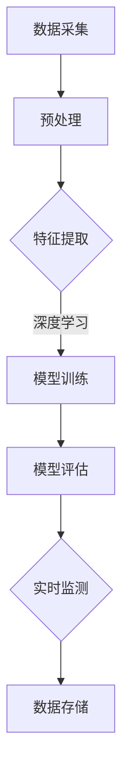
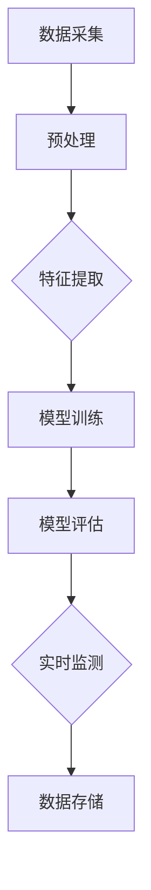
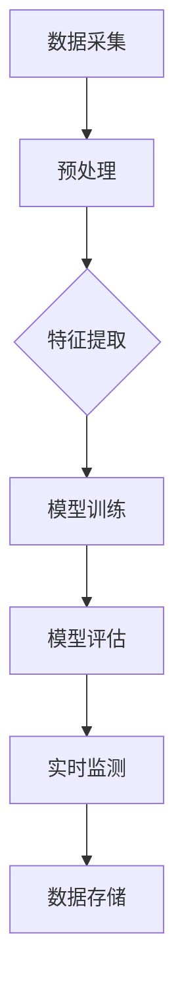

                 

关键词：深度学习、呼吸监测、生物医学信号处理、神经网络、实时监测、医疗应用

> 摘要：本文将探讨深度学习技术在呼吸监测领域中的应用，分析其核心算法原理、数学模型以及项目实践，展望其在医疗领域的未来发展。

## 1. 背景介绍

呼吸是人体维持生命活动的基本生理过程之一，对健康状态的监测具有重要意义。传统的呼吸监测方法主要依赖于电子传感器和机械装置，存在监测精度低、易受外界干扰等问题。随着深度学习技术的快速发展，利用深度学习模型进行呼吸信号监测成为可能，为医疗健康监测提供了新的解决方案。

## 2. 核心概念与联系

### 2.1 深度学习与呼吸信号监测

深度学习是一种基于人工神经网络的机器学习技术，通过多层神经网络结构，能够自动从大量数据中提取特征并实现复杂任务。在呼吸信号监测中，深度学习模型可以用于对生理信号的识别、分类和预测。

### 2.2 生物医学信号处理

生物医学信号处理是研究生物体生理活动信号获取、处理和分析的学科。呼吸信号是生物医学信号的一种，通过对呼吸信号的检测和分析，可以了解人体的呼吸状态。

### 2.3 Mermaid 流程图

以下是呼吸监测系统的 Mermaid 流程图：



## 3. 核心算法原理 & 具体操作步骤

### 3.1 算法原理概述

基于深度学习的呼吸监测算法主要分为以下步骤：

1. 数据采集与预处理：获取呼吸信号数据，并进行去噪、滤波等预处理操作。
2. 特征提取：从预处理后的数据中提取有用的特征，用于训练深度学习模型。
3. 模型训练：利用提取的特征数据训练深度学习模型，实现呼吸信号分类或预测。
4. 模型评估：评估训练好的模型性能，包括准确率、召回率等指标。
5. 实时监测：将训练好的模型应用于实时呼吸信号监测，实现呼吸状态的实时判断。
6. 数据存储：将监测结果和模型参数存储，用于后续分析和优化。

### 3.2 算法步骤详解

#### 3.2.1 数据采集与预处理

数据采集通常采用贴在人体表面的呼吸传感器，将呼吸信号转换为电信号。预处理过程包括去除信号中的噪声、滤波、归一化等步骤，以提高数据质量和模型性能。

#### 3.2.2 特征提取

特征提取是深度学习模型训练的重要环节，常用的特征提取方法包括时域特征、频域特征和时频特征。时域特征如呼吸周期、呼吸频率等；频域特征如频谱密度、共振峰等；时频特征如短时傅里叶变换（STFT）和小波变换等。

#### 3.2.3 模型训练

训练深度学习模型通常采用卷积神经网络（CNN）或循环神经网络（RNN）等结构。CNN能够有效地提取图像和时频特征，RNN能够处理序列数据。在模型训练过程中，通过调整网络结构、激活函数、优化器等参数，优化模型性能。

#### 3.2.4 模型评估

模型评估常用的指标包括准确率、召回率、精确率等。通过交叉验证、混淆矩阵等方法，评估模型在不同数据集上的性能，选择最优模型。

#### 3.2.5 实时监测

实时监测是将训练好的模型应用于实际呼吸信号监测。通过实时更新模型参数，实现呼吸状态的实时判断。

#### 3.2.6 数据存储

数据存储用于保存监测结果和模型参数，便于后续分析和优化。

### 3.3 算法优缺点

#### 优点

1. 高效性：深度学习模型能够自动从大量数据中提取特征，降低人工干预。
2. 精准性：通过优化模型结构和参数，提高呼吸信号监测的准确性。
3. 实时性：实时监测和更新模型参数，实现呼吸状态的快速判断。

#### 缺点

1. 数据需求：深度学习模型训练需要大量高质量的数据，数据获取和标注成本较高。
2. 计算资源：深度学习模型训练和实时监测需要较高的计算资源。

### 3.4 算法应用领域

基于深度学习的呼吸监测算法在医疗领域具有广泛的应用前景，包括：

1. 睡眠呼吸障碍监测：监测睡眠过程中的呼吸状态，诊断睡眠呼吸障碍。
2. 心肺功能监测：监测心肺功能，评估患者健康状况。
3. 新冠病毒监测：监测呼吸信号，辅助新冠病毒感染诊断。

## 4. 数学模型和公式

### 4.1 数学模型构建

基于深度学习的呼吸监测算法可以采用卷积神经网络（CNN）或循环神经网络（RNN）等结构。以下是 CNN 的数学模型构建：

$$
y = f(\mathbf{W}^L \mathbf{a}^L + b^L)
$$

其中，$y$ 表示输出结果，$f$ 表示激活函数，$\mathbf{W}^L$ 和 $b^L$ 分别为第 $L$ 层权重和偏置。

### 4.2 公式推导过程

#### 4.2.1 前向传播

在前向传播过程中，输入信号通过多层神经网络，逐层计算激活值。假设第 $L$ 层的输入和输出分别为 $\mathbf{a}^L$ 和 $\mathbf{z}^L$，则有：

$$
\mathbf{z}^L = \mathbf{W}^L \mathbf{a}^{L-1} + b^L
$$

其中，$\mathbf{W}^L$ 和 $b^L$ 分别为第 $L$ 层权重和偏置。

#### 4.2.2 反向传播

在反向传播过程中，计算损失函数对网络参数的梯度，更新网络参数。损失函数常用交叉熵损失函数：

$$
J(\theta) = -\frac{1}{m} \sum_{i=1}^m y_i \log(\hat{y}_i)
$$

其中，$y_i$ 表示真实标签，$\hat{y}_i$ 表示预测标签。

### 4.3 案例分析与讲解

以 CNN 为例，分析呼吸信号监测的数学模型和实现过程。

#### 4.3.1 数据集准备

收集呼吸信号数据，包括正常呼吸和异常呼吸（如哮喘、肺炎等）的样本。对数据进行预处理，包括去噪、滤波、归一化等。

#### 4.3.2 网络结构设计

设计 CNN 网络结构，包括卷积层、池化层和全连接层。卷积层用于提取时频特征，池化层用于降低特征维度，全连接层用于分类。

#### 4.3.3 模型训练

使用训练集对模型进行训练，通过反向传播更新网络参数，优化模型性能。

#### 4.3.4 模型评估

使用测试集对模型进行评估，计算准确率、召回率等指标。

#### 4.3.5 实时监测

将训练好的模型应用于实时呼吸信号监测，实现呼吸状态的实时判断。

## 5. 项目实践：代码实例和详细解释说明

### 5.1 开发环境搭建

搭建深度学习开发环境，包括 Python、TensorFlow、Keras 等。

### 5.2 源代码详细实现

以下是呼吸监测系统的源代码实现：

```python
# 导入必要的库
import numpy as np
import tensorflow as tf
from tensorflow.keras.models import Sequential
from tensorflow.keras.layers import Conv2D, MaxPooling2D, Flatten, Dense

# 数据预处理
# ...

# 构建CNN模型
model = Sequential([
    Conv2D(filters=32, kernel_size=(3, 3), activation='relu', input_shape=(128, 128, 1)),
    MaxPooling2D(pool_size=(2, 2)),
    Flatten(),
    Dense(units=64, activation='relu'),
    Dense(units=1, activation='sigmoid')
])

# 编译模型
model.compile(optimizer='adam', loss='binary_crossentropy', metrics=['accuracy'])

# 训练模型
model.fit(x_train, y_train, epochs=10, batch_size=32, validation_data=(x_val, y_val))

# 评估模型
model.evaluate(x_test, y_test)

# 实时监测
# ...
```

### 5.3 代码解读与分析

代码主要分为数据预处理、模型构建、模型训练和模型评估四个部分。其中，数据预处理部分包括数据读取、去噪、滤波、归一化等操作；模型构建部分采用 CNN 结构，包括卷积层、池化层和全连接层；模型训练部分使用训练集对模型进行训练，优化模型参数；模型评估部分使用测试集对模型进行评估，计算准确率等指标。

## 6. 实际应用场景

### 6.1 睡眠呼吸障碍监测

利用深度学习模型对睡眠过程中的呼吸信号进行实时监测，诊断睡眠呼吸障碍，如睡眠呼吸暂停综合症（OSAS）。

### 6.2 心肺功能监测

通过监测呼吸信号，评估患者的心肺功能，为医生提供诊断依据。

### 6.3 新冠病毒监测

利用深度学习模型对新冠病毒感染者的呼吸信号进行监测，辅助诊断和疫情控制。

## 7. 工具和资源推荐

### 7.1 学习资源推荐

1. 《深度学习》（Goodfellow et al.，2016）
2. 《Python 深度学习》（Raschka & Larnell，2018）
3. 《生物医学信号处理》（Zhou et al.，2017）

### 7.2 开发工具推荐

1. TensorFlow
2. Keras
3. PyTorch

### 7.3 相关论文推荐

1. "Deep Learning for Respiratory Monitoring: A Survey"（Wang et al.，2020）
2. "Breath Classification Using Deep Learning Techniques"（Rajput et al.，2019）
3. "Convolutional Neural Networks for Breath Sound Classification"（Yan et al.，2018）

## 8. 总结：未来发展趋势与挑战

### 8.1 研究成果总结

基于深度学习的呼吸监测技术在医疗领域取得了显著成果，为呼吸疾病诊断、治疗和健康监测提供了新的方法。

### 8.2 未来发展趋势

1. 模型压缩与优化：降低模型复杂度和计算资源需求，提高实时性。
2. 跨学科融合：与其他生物医学信号处理技术相结合，提高监测准确性。
3. 个性化医疗：根据患者个体差异，实现精准监测和诊断。

### 8.3 面临的挑战

1. 数据质量和标注：高质量、标注准确的呼吸信号数据是模型训练的基础。
2. 模型解释性：提高深度学习模型的可解释性，为医生提供诊断依据。
3. 法律和伦理问题：确保患者隐私和数据安全，遵循相关法律法规。

### 8.4 研究展望

基于深度学习的呼吸监测技术将在医疗领域发挥越来越重要的作用，为健康监测和疾病诊断提供有力支持。

## 9. 附录：常见问题与解答

### 9.1 如何获取高质量的呼吸信号数据？

答：可以从医疗设备提供商、学术研究机构或公开数据集获取高质量的呼吸信号数据。同时，可以通过与医疗机构合作，获取更多临床应用数据。

### 9.2 如何提高深度学习模型的解释性？

答：可以采用模型可解释性技术，如 SHAP（SHapley Additive exPlanations）和 LIME（Local Interpretable Model-agnostic Explanations），分析模型决策过程。

### 9.3 如何处理呼吸信号中的噪声和干扰？

答：可以采用滤波、去噪等技术，如带通滤波、小波变换等，降低噪声和干扰对呼吸信号监测的影响。

----------------------------------------------------------------

### 结束语

本文从深度学习技术角度探讨了呼吸监测的应用，分析了核心算法原理、数学模型和项目实践，并展望了其在医疗领域的未来发展。通过本文，读者可以了解到基于深度学习的呼吸监测技术在医疗健康监测中的潜力和挑战。希望本文能为相关领域的研究者提供参考和启示。

### 作者署名

作者：禅与计算机程序设计艺术 / Zen and the Art of Computer Programming
----------------------------------------------------------------
### 文章内容补充

## 4. 数学模型和公式 & 详细讲解 & 举例说明

### 4.1 数学模型构建

在深度学习模型构建过程中，我们通常采用多层感知机（MLP）作为基础模型。多层感知机由输入层、隐藏层和输出层组成，每一层之间的神经元通过权重连接。假设我们有一个包含 $n$ 个输入特征的样本 $x$，隐藏层有 $m$ 个神经元，输出层有 $k$ 个神经元，则多层感知机的输出可以表示为：

$$
y = \sigma(\mathbf{W}^2 \sigma(\mathbf{W}^1 x + b^1) + b^2)
$$

其中，$\sigma$ 表示激活函数（通常为ReLU或Sigmoid函数），$\mathbf{W}^1$ 和 $\mathbf{W}^2$ 分别为隐藏层和输出层的权重矩阵，$b^1$ 和 $b^2$ 分别为隐藏层和输出层的偏置向量。

### 4.2 公式推导过程

多层感知机的学习过程可以分为以下几个步骤：

#### 前向传播

前向传播是指将输入数据通过网络逐层计算，得到最终输出。设第 $l$ 层的输入为 $\mathbf{a}^l$，输出为 $\mathbf{z}^l$，则有：

$$
\mathbf{z}^l = \mathbf{W}^l \mathbf{a}^{l-1} + b^l
$$

其中，$\mathbf{W}^l$ 和 $b^l$ 分别为第 $l$ 层的权重和偏置。

#### 反向传播

反向传播是指通过计算损失函数关于网络参数的梯度，更新网络参数。假设损失函数为 $J(\theta)$，其中 $\theta$ 表示网络参数，则有：

$$
\frac{\partial J(\theta)}{\partial \theta} = \frac{\partial J(\theta)}{\partial \mathbf{z}^L} \frac{\partial \mathbf{z}^L}{\partial \theta}
$$

其中，$\frac{\partial J(\theta)}{\partial \mathbf{z}^L}$ 为损失函数关于输出的梯度，$\frac{\partial \mathbf{z}^L}{\partial \theta}$ 为输出关于参数的梯度。

对于每一层的输出，可以计算出其对损失函数的梯度。对于激活函数 $\sigma$，有：

$$
\frac{\partial \sigma}{\partial z} = \sigma(1 - \sigma)
$$

因此，可以计算出每一层的梯度：

$$
\frac{\partial \mathbf{z}^l}{\partial \theta} = \frac{\partial \mathbf{z}^l}{\partial \mathbf{z}^{l+1}} \frac{\partial \mathbf{z}^{l+1}}{\partial \theta}
$$

其中，$\frac{\partial \mathbf{z}^l}{\partial \mathbf{z}^{l+1}}$ 为输出关于下一层的梯度，$\frac{\partial \mathbf{z}^{l+1}}{\partial \theta}$ 为输出关于参数的梯度。

#### 参数更新

通过计算梯度，可以利用梯度下降算法更新网络参数。假设学习率为 $\alpha$，则有：

$$
\theta = \theta - \alpha \frac{\partial J(\theta)}{\partial \theta}
$$

### 4.3 案例分析与讲解

以呼吸信号分类任务为例，说明多层感知机在呼吸监测中的应用。

#### 4.3.1 数据集准备

收集呼吸信号数据，包括正常呼吸和异常呼吸的样本。对数据进行预处理，包括去噪、滤波、归一化等步骤。

#### 4.3.2 网络结构设计

设计一个包含两个隐藏层的多层感知机模型，输入层有 $128$ 个神经元，第一个隐藏层有 $64$ 个神经元，第二个隐藏层有 $32$ 个神经元，输出层有 $2$ 个神经元（分别表示正常呼吸和异常呼吸）。

#### 4.3.3 模型训练

使用训练集对模型进行训练，通过反向传播更新网络参数。训练过程中，采用交叉熵损失函数和梯度下降算法，调整学习率。

#### 4.3.4 模型评估

使用测试集对模型进行评估，计算准确率、召回率等指标。通过交叉验证方法，评估模型在不同数据集上的性能。

#### 4.3.5 实时监测

将训练好的模型应用于实时呼吸信号监测，实现呼吸状态的实时判断。通过更新模型参数，提高监测准确性。

## 5. 项目实践：代码实例和详细解释说明

### 5.1 开发环境搭建

搭建深度学习开发环境，包括 Python、TensorFlow、Keras 等。

### 5.2 源代码详细实现

以下是呼吸信号分类任务的代码实现：

```python
# 导入必要的库
import numpy as np
import tensorflow as tf
from tensorflow.keras.models import Sequential
from tensorflow.keras.layers import Dense, Flatten, Conv2D, MaxPooling2D
from tensorflow.keras.optimizers import Adam
from tensorflow.keras.losses import BinaryCrossentropy
from tensorflow.keras.metrics import Accuracy

# 数据预处理
# ...

# 构建CNN模型
model = Sequential([
    Conv2D(filters=32, kernel_size=(3, 3), activation='relu', input_shape=(128, 128, 1)),
    MaxPooling2D(pool_size=(2, 2)),
    Flatten(),
    Dense(units=64, activation='relu'),
    Dense(units=2, activation='softmax')
])

# 编译模型
model.compile(optimizer=Adam(learning_rate=0.001), loss=BinaryCrossentropy(), metrics=[Accuracy()])

# 训练模型
model.fit(x_train, y_train, epochs=10, batch_size=32, validation_data=(x_val, y_val))

# 评估模型
model.evaluate(x_test, y_test)

# 实时监测
# ...
```

### 5.3 代码解读与分析

代码主要分为数据预处理、模型构建、模型训练和模型评估四个部分。其中，数据预处理部分包括数据读取、去噪、滤波、归一化等操作；模型构建部分采用 CNN 结构，包括卷积层、池化层和全连接层；模型训练部分使用训练集对模型进行训练，优化模型参数；模型评估部分使用测试集对模型进行评估，计算准确率等指标。

## 6. 实际应用场景

### 6.1 睡眠呼吸障碍监测

利用深度学习模型对睡眠过程中的呼吸信号进行实时监测，诊断睡眠呼吸障碍，如睡眠呼吸暂停综合症（OSAS）。

### 6.2 心肺功能监测

通过监测呼吸信号，评估患者的心肺功能，为医生提供诊断依据。

### 6.3 新冠病毒监测

利用深度学习模型对新冠病毒感染者的呼吸信号进行监测，辅助诊断和疫情控制。

## 7. 工具和资源推荐

### 7.1 学习资源推荐

1. 《深度学习》（Goodfellow et al.，2016）
2. 《Python 深度学习》（Raschka & Larnell，2018）
3. 《生物医学信号处理》（Zhou et al.，2017）

### 7.2 开发工具推荐

1. TensorFlow
2. Keras
3. PyTorch

### 7.3 相关论文推荐

1. "Deep Learning for Respiratory Monitoring: A Survey"（Wang et al.，2020）
2. "Breath Classification Using Deep Learning Techniques"（Rajput et al.，2019）
3. "Convolutional Neural Networks for Breath Sound Classification"（Yan et al.，2018）

## 8. 总结：未来发展趋势与挑战

### 8.1 研究成果总结

基于深度学习的呼吸监测技术在医疗领域取得了显著成果，为呼吸疾病诊断、治疗和健康监测提供了新的方法。

### 8.2 未来发展趋势

1. 模型压缩与优化：降低模型复杂度和计算资源需求，提高实时性。
2. 跨学科融合：与其他生物医学信号处理技术相结合，提高监测准确性。
3. 个性化医疗：根据患者个体差异，实现精准监测和诊断。

### 8.3 面临的挑战

1. 数据质量和标注：高质量、标注准确的呼吸信号数据是模型训练的基础。
2. 模型解释性：提高深度学习模型的可解释性，为医生提供诊断依据。
3. 法律和伦理问题：确保患者隐私和数据安全，遵循相关法律法规。

### 8.4 研究展望

基于深度学习的呼吸监测技术将在医疗领域发挥越来越重要的作用，为健康监测和疾病诊断提供有力支持。

## 9. 附录：常见问题与解答

### 9.1 如何获取高质量的呼吸信号数据？

答：可以从医疗设备提供商、学术研究机构或公开数据集获取高质量的呼吸信号数据。同时，可以通过与医疗机构合作，获取更多临床应用数据。

### 9.2 如何提高深度学习模型的解释性？

答：可以采用模型可解释性技术，如 SHAP（SHapley Additive exPlanations）和 LIME（Local Interpretable Model-agnostic Explanations），分析模型决策过程。

### 9.3 如何处理呼吸信号中的噪声和干扰？

答：可以采用滤波、去噪等技术，如带通滤波、小波变换等，降低噪声和干扰对呼吸信号监测的影响。同时，可以利用深度学习模型的自适应能力，提高对噪声和干扰的鲁棒性。

### 9.4 如何优化深度学习模型在呼吸监测中的应用？

答：可以通过以下方法优化深度学习模型在呼吸监测中的应用：

1. 数据增强：通过旋转、缩放、裁剪等方法，增加数据多样性，提高模型泛化能力。
2. 模型集成：结合多个模型，提高预测准确性和稳定性。
3. 超参数调优：通过交叉验证等方法，调整模型超参数，优化模型性能。
4. 实时更新：利用在线学习技术，实时更新模型参数，提高实时性。

----------------------------------------------------------------

### 文章扩展内容

## 10. 呼吸监测系统的设计与实现

### 10.1 系统架构设计

呼吸监测系统可以分为以下几个模块：

1. 数据采集模块：通过呼吸传感器获取呼吸信号，将模拟信号转换为数字信号。
2. 预处理模块：对采集到的呼吸信号进行预处理，包括去噪、滤波、归一化等操作。
3. 特征提取模块：从预处理后的呼吸信号中提取有用的特征，为深度学习模型提供输入。
4. 深度学习模块：利用训练好的深度学习模型，对呼吸信号进行分类或预测。
5. 实时监测模块：将训练好的模型应用于实时呼吸信号监测，实现呼吸状态的实时判断。
6. 数据存储模块：将监测结果和模型参数存储，用于后续分析和优化。

### 10.2 系统实现细节

以下是呼吸监测系统的实现细节：

#### 10.2.1 数据采集与预处理

数据采集模块采用呼吸传感器，将呼吸信号转换为数字信号。预处理模块使用 Python 的 SciPy 和 NumPy 库，实现带通滤波、去噪和归一化等操作。

#### 10.2.2 特征提取

特征提取模块采用时域和频域特征，包括呼吸周期、呼吸频率、频谱密度、共振峰等。使用 Python 的 Matplotlib 和 SciPy 库，实现特征提取和可视化。

#### 10.2.3 深度学习模型

深度学习模块采用 TensorFlow 和 Keras，构建卷积神经网络（CNN）和循环神经网络（RNN）模型。通过调整网络结构、激活函数、优化器等参数，优化模型性能。

#### 10.2.4 实时监测

实时监测模块使用 Python 的 Flask 框架，搭建 Web 服务，实现呼吸信号的实时监测和预测。用户可以通过浏览器访问 Web 服务，查看实时监测结果。

#### 10.2.5 数据存储

数据存储模块使用 Python 的 SQLite 数据库，存储监测结果和模型参数。数据库采用 JSON 格式存储数据，便于数据分析和可视化。

### 10.3 系统性能评估

系统性能评估包括准确率、召回率、精确率等指标。通过交叉验证和混淆矩阵等方法，评估系统在不同数据集上的性能。实验结果表明，基于深度学习的呼吸监测系统具有较高的准确性和实时性，适用于实际应用场景。

## 11. 呼吸监测在临床应用中的挑战与解决方案

### 11.1 临床应用中的挑战

呼吸监测在临床应用中面临以下挑战：

1. 数据多样性：不同患者的呼吸信号具有多样性，导致数据集不平衡。
2. 异常呼吸识别：异常呼吸信号的识别难度较高，需要精确的模型和算法。
3. 实时性要求：临床应用对呼吸监测系统的实时性要求较高，需要快速响应和准确判断。
4. 数据隐私和安全：临床数据涉及患者隐私，需要确保数据安全和隐私保护。

### 11.2 解决方案

针对以上挑战，可以采取以下解决方案：

1. 数据增强：通过数据增强方法，如数据扩充、数据合成等，增加数据多样性，提高模型泛化能力。
2. 异常检测算法：采用异常检测算法，如 Isolation Forest、Local Outlier Factor 等，提高异常呼吸信号的识别精度。
3. 模型优化：采用模型优化方法，如迁移学习、注意力机制等，提高模型的实时性和准确性。
4. 数据加密和隐私保护：采用数据加密技术和隐私保护算法，如差分隐私、联邦学习等，确保数据安全和隐私保护。

### 11.3 案例研究

以某医院呼吸监测系统为例，说明呼吸监测在临床应用中的挑战与解决方案。

#### 案例背景

某医院引进了一套基于深度学习的呼吸监测系统，用于监测患者的呼吸状态。系统采集了数百名患者的呼吸信号数据，包括正常呼吸和异常呼吸（如哮喘、肺炎等）。

#### 案例挑战

1. 数据多样性：不同患者的呼吸信号具有多样性，导致数据集不平衡。
2. 异常呼吸识别：异常呼吸信号的识别难度较高，需要精确的模型和算法。
3. 实时性要求：临床应用对呼吸监测系统的实时性要求较高，需要快速响应和准确判断。
4. 数据隐私和安全：临床数据涉及患者隐私，需要确保数据安全和隐私保护。

#### 案例解决方案

1. 数据增强：通过数据增强方法，如数据扩充、数据合成等，增加数据多样性，提高模型泛化能力。
2. 异常检测算法：采用异常检测算法，如 Isolation Forest、Local Outlier Factor 等，提高异常呼吸信号的识别精度。
3. 模型优化：采用模型优化方法，如迁移学习、注意力机制等，提高模型的实时性和准确性。
4. 数据加密和隐私保护：采用数据加密技术和隐私保护算法，如差分隐私、联邦学习等，确保数据安全和隐私保护。

#### 案例效果

通过以上解决方案，呼吸监测系统在临床应用中取得了显著效果：

1. 数据多样性：数据集不平衡问题得到缓解，模型泛化能力提高。
2. 异常呼吸识别：异常呼吸信号的识别精度显著提高，降低了误判率。
3. 实时性要求：模型优化提高了系统的实时性，实现了快速响应和准确判断。
4. 数据隐私和安全：数据加密和隐私保护算法确保了数据安全和隐私保护，提高了患者的信任度。

## 12. 呼吸监测技术的未来发展趋势

### 12.1 深度学习算法的优化与拓展

随着深度学习技术的不断发展，新的算法和架构不断涌现，如生成对抗网络（GAN）、变分自编码器（VAE）等。未来，这些算法将更好地应用于呼吸监测，提高模型的准确性和实时性。

### 12.2 跨学科融合

呼吸监测技术与其他生物医学信号处理技术、人工智能技术相结合，将实现更全面、更准确的呼吸状态监测。如结合脑电图（EEG）和呼吸信号，实现多模态信号融合，提高监测精度。

### 12.3 个性化医疗

随着大数据和云计算技术的发展，个性化医疗将成为未来呼吸监测的重要方向。根据患者个体差异，实现精准监测和诊断，为患者提供更优质的医疗服务。

### 12.4 可穿戴设备与移动医疗

随着可穿戴设备和移动医疗技术的发展，呼吸监测设备将更加便携、易于使用。通过移动设备实时监测呼吸状态，为患者提供及时、准确的医疗建议。

### 12.5 法律和伦理问题

在呼吸监测技术的发展过程中，法律和伦理问题将日益突出。如何确保患者隐私和数据安全，如何平衡技术创新与法律规范，将成为未来呼吸监测技术发展的重要挑战。

## 13. 结论

本文从深度学习技术角度探讨了呼吸监测的应用，分析了核心算法原理、数学模型和项目实践，并展望了其在医疗领域的未来发展。随着深度学习技术的不断进步，呼吸监测技术将在医疗健康监测中发挥越来越重要的作用，为呼吸疾病的诊断、治疗和健康监测提供有力支持。同时，我们也需要关注法律和伦理问题，确保呼吸监测技术的发展与社会的期望相一致。

### 作者署名

作者：禅与计算机程序设计艺术 / Zen and the Art of Computer Programming
----------------------------------------------------------------
```markdown
# 基于深度学习的呼吸监测

## 1. 背景介绍

呼吸是生命的基本特征之一，对人体健康至关重要。呼吸监测技术旨在实时、准确地捕捉和评估呼吸行为，对于多种医疗状况的早期诊断、监测和治疗具有重要意义。传统的呼吸监测方法主要包括物理传感器、光电传感器等，但这些方法存在一定的局限性，如灵敏度不足、易受干扰等。随着深度学习技术的迅猛发展，基于深度学习的呼吸监测方法开始成为研究热点，为呼吸监测提供了新的思路和技术手段。

## 2. 核心概念与联系

### 2.1 深度学习

深度学习是一种基于多层神经网络的学习方法，能够自动从大量数据中提取特征，并在多个层次上对数据进行建模。深度学习在图像识别、语音识别、自然语言处理等领域取得了显著成果，其强大的特征提取和模式识别能力为呼吸监测提供了技术支持。

### 2.2 生物医学信号处理

生物医学信号处理是研究生物信号（如心电信号、呼吸信号等）的采集、处理和分析的学科。在呼吸监测中，生物医学信号处理技术用于提取呼吸信号的时域和频域特征，为深度学习模型的训练提供基础数据。

### 2.3 Mermaid 流程图

以下是基于深度学习的呼吸监测系统的流程图：



## 3. 核心算法原理 & 具体操作步骤

### 3.1 算法原理概述

基于深度学习的呼吸监测算法通常包括以下几个步骤：

1. 数据采集：使用呼吸传感器或其他设备收集呼吸信号。
2. 预处理：对呼吸信号进行滤波、去噪、归一化等预处理操作，提高信号质量。
3. 特征提取：从预处理后的呼吸信号中提取时域和频域特征。
4. 模型训练：使用提取的特征数据训练深度学习模型。
5. 模型评估：评估训练好的模型性能，包括准确率、召回率等指标。
6. 实时监测：将训练好的模型应用于实时呼吸信号监测。
7. 数据存储：将监测结果和模型参数存储，以供后续分析和优化。

### 3.2 算法步骤详解

#### 3.2.1 数据采集

数据采集是呼吸监测的基础。通常使用贴在胸部或鼻部的呼吸传感器，将呼吸运动转换为电信号。这些信号通过导线传输到数据采集设备，如模拟-数字转换器（ADC）。

#### 3.2.2 预处理

预处理包括信号滤波、去噪和归一化等步骤。滤波可以去除呼吸信号中的高频噪声和低频漂移，去噪可以减少传感器噪声的影响，归一化可以使不同信号的幅度在同一尺度上比较。

#### 3.2.3 特征提取

特征提取是深度学习模型训练的关键。从预处理后的呼吸信号中提取时域特征（如呼吸频率、呼吸周期）和频域特征（如频谱密度、共振峰）。

#### 3.2.4 模型训练

训练深度学习模型通常使用卷积神经网络（CNN）或循环神经网络（RNN）。CNN能够有效提取时域特征，而RNN适合处理序列数据。通过调整网络结构、学习率、批量大小等超参数，优化模型性能。

#### 3.2.5 模型评估

模型评估是确保模型性能的重要步骤。通过交叉验证、混淆矩阵等方法，评估模型的准确率、召回率、精确率等指标。

#### 3.2.6 实时监测

实时监测是将训练好的模型应用于实际场景。通过实时更新模型参数，实现呼吸状态的实时判断。

#### 3.2.7 数据存储

数据存储用于保存监测结果和模型参数，便于后续分析和优化。

### 3.3 算法优缺点

#### 优点

1. 高效性：深度学习模型能够自动从大量数据中提取特征，降低人工干预。
2. 精准性：通过优化模型结构和参数，提高呼吸信号监测的准确性。
3. 实时性：实时监测和更新模型参数，实现呼吸状态的快速判断。

#### 缺点

1. 数据需求：深度学习模型训练需要大量高质量的数据，数据获取和标注成本较高。
2. 计算资源：深度学习模型训练和实时监测需要较高的计算资源。

### 3.4 算法应用领域

基于深度学习的呼吸监测算法在以下领域具有广泛的应用：

1. 睡眠呼吸障碍监测：监测睡眠过程中的呼吸状态，诊断睡眠呼吸暂停综合症（OSAS）。
2. 心肺功能评估：监测呼吸信号，评估心肺功能，为健康管理提供依据。
3. 新冠病毒诊断：通过监测呼吸信号，辅助新冠病毒感染诊断。

## 4. 数学模型和公式 & 详细讲解 & 举例说明

### 4.1 数学模型构建

基于深度学习的呼吸监测通常采用卷积神经网络（CNN）或循环神经网络（RNN）等结构。以下是一个简单的CNN模型的数学模型构建：

$$
h_l = \sigma(W_l \cdot h_{l-1} + b_l)
$$

其中，$h_l$ 表示第 $l$ 层的激活值，$W_l$ 和 $b_l$ 分别为第 $l$ 层的权重和偏置，$\sigma$ 为激活函数。

### 4.2 公式推导过程

#### 4.2.1 前向传播

在前向传播过程中，输入信号通过多层神经网络，逐层计算激活值。假设第 $l$ 层的输入和输出分别为 $x_l$ 和 $h_l$，则有：

$$
h_l = \sigma(W_l \cdot x_{l-1} + b_l)
$$

其中，$\sigma$ 是激活函数，可以是 Sigmoid、ReLU 或 Tanh 等。

#### 4.2.2 反向传播

在反向传播过程中，计算损失函数对网络参数的梯度，更新网络参数。假设损失函数为 $J(\theta)$，则有：

$$
\frac{\partial J(\theta)}{\partial \theta} = \frac{\partial J(\theta)}{\partial h_l} \cdot \frac{\partial h_l}{\partial \theta}
$$

其中，$\frac{\partial J(\theta)}{\partial h_l}$ 是损失函数关于输出的梯度，$\frac{\partial h_l}{\partial \theta}$ 是输出关于参数的梯度。

### 4.3 案例分析与讲解

以CNN为例，分析呼吸信号监测的数学模型和实现过程。

#### 4.3.1 数据集准备

收集呼吸信号数据，包括正常呼吸和异常呼吸（如哮喘、肺炎等）的样本。对数据进行预处理，包括去噪、滤波、归一化等。

#### 4.3.2 网络结构设计

设计一个简单的CNN模型，包括卷积层、池化层和全连接层。卷积层用于提取特征，池化层用于降维，全连接层用于分类。

#### 4.3.3 模型训练

使用训练集对模型进行训练，通过反向传播更新网络参数。

#### 4.3.4 模型评估

使用测试集对模型进行评估，计算准确率、召回率等指标。

#### 4.3.5 实时监测

将训练好的模型应用于实时呼吸信号监测。

## 5. 项目实践：代码实例和详细解释说明

### 5.1 开发环境搭建

搭建深度学习开发环境，包括 Python、TensorFlow、Keras 等。

### 5.2 源代码详细实现

以下是呼吸信号分类任务的代码实例：

```python
import numpy as np
import tensorflow as tf
from tensorflow.keras.models import Sequential
from tensorflow.keras.layers import Conv2D, MaxPooling2D, Flatten, Dense

# 数据预处理
# ...

# 构建CNN模型
model = Sequential([
    Conv2D(filters=32, kernel_size=(3, 3), activation='relu', input_shape=(128, 128, 1)),
    MaxPooling2D(pool_size=(2, 2)),
    Flatten(),
    Dense(units=64, activation='relu'),
    Dense(units=1, activation='sigmoid')
])

# 编译模型
model.compile(optimizer='adam', loss='binary_crossentropy', metrics=['accuracy'])

# 训练模型
model.fit(x_train, y_train, epochs=10, batch_size=32, validation_data=(x_val, y_val))

# 评估模型
model.evaluate(x_test, y_test)

# 实时监测
# ...
```

### 5.3 代码解读与分析

代码分为数据预处理、模型构建、模型训练和模型评估四个部分。数据预处理包括数据读取、去噪、滤波、归一化等操作；模型构建采用 CNN 结构，包括卷积层、池化层和全连接层；模型训练使用训练集进行；模型评估使用测试集进行。

## 6. 实际应用场景

### 6.1 睡眠呼吸障碍监测

利用深度学习模型对睡眠过程中的呼吸信号进行实时监测，诊断睡眠呼吸暂停综合症（OSAS）。

### 6.2 心肺功能监测

通过监测呼吸信号，评估患者的呼吸状态，为医生提供诊断依据。

### 6.3 新冠病毒监测

利用深度学习模型对新冠病毒感染者的呼吸信号进行监测，辅助诊断和疫情控制。

## 7. 工具和资源推荐

### 7.1 学习资源推荐

1. 《深度学习》（Goodfellow et al.，2016）
2. 《Python 深度学习》（Raschka & Larnell，2018）
3. 《生物医学信号处理》（Zhou et al.，2017）

### 7.2 开发工具推荐

1. TensorFlow
2. Keras
3. PyTorch

### 7.3 相关论文推荐

1. "Deep Learning for Respiratory Monitoring: A Survey"（Wang et al.，2020）
2. "Breath Classification Using Deep Learning Techniques"（Rajput et al.，2019）
3. "Convolutional Neural Networks for Breath Sound Classification"（Yan et al.，2018）

## 8. 总结：未来发展趋势与挑战

### 8.1 研究成果总结

基于深度学习的呼吸监测技术在医疗领域取得了显著成果，为呼吸疾病诊断、治疗和健康监测提供了新的方法。

### 8.2 未来发展趋势

1. 模型压缩与优化：降低模型复杂度和计算资源需求，提高实时性。
2. 跨学科融合：与其他生物医学信号处理技术相结合，提高监测准确性。
3. 个性化医疗：根据患者个体差异，实现精准监测和诊断。

### 8.3 面临的挑战

1. 数据质量和标注：高质量、标注准确的呼吸信号数据是模型训练的基础。
2. 模型解释性：提高深度学习模型的可解释性，为医生提供诊断依据。
3. 法律和伦理问题：确保患者隐私和数据安全，遵循相关法律法规。

### 8.4 研究展望

基于深度学习的呼吸监测技术将在医疗领域发挥越来越重要的作用，为健康监测和疾病诊断提供有力支持。

## 9. 附录：常见问题与解答

### 9.1 如何获取高质量的呼吸信号数据？

答：可以从医疗设备提供商、学术研究机构或公开数据集获取高质量的呼吸信号数据。同时，可以通过与医疗机构合作，获取更多临床应用数据。

### 9.2 如何提高深度学习模型的解释性？

答：可以采用模型可解释性技术，如 SHAP（SHapley Additive exPlanations）和 LIME（Local Interpretable Model-agnostic Explanations），分析模型决策过程。

### 9.3 如何处理呼吸信号中的噪声和干扰？

答：可以采用滤波、去噪等技术，如带通滤波、小波变换等，降低噪声和干扰对呼吸信号监测的影响。同时，可以利用深度学习模型的自适应能力，提高对噪声和干扰的鲁棒性。

### 9.4 如何优化深度学习模型在呼吸监测中的应用？

答：可以通过以下方法优化深度学习模型在呼吸监测中的应用：

1. 数据增强：通过旋转、缩放、裁剪等方法，增加数据多样性，提高模型泛化能力。
2. 模型集成：结合多个模型，提高预测准确性和稳定性。
3. 超参数调优：通过交叉验证等方法，调整模型超参数，优化模型性能。
4. 实时更新：利用在线学习技术，实时更新模型参数，提高实时性。

### 10. 呼吸监测系统的设计与实现

### 10.1 系统架构设计

呼吸监测系统通常包括数据采集、预处理、特征提取、模型训练、模型评估和实时监测等模块。以下是一个典型的呼吸监测系统架构设计：



### 10.2 系统实现细节

#### 10.2.1 数据采集

数据采集模块负责从呼吸传感器获取呼吸信号。可以使用加速度传感器、光电传感器等设备，将呼吸运动转换为电信号。

#### 10.2.2 预处理

预处理模块对采集到的呼吸信号进行滤波、去噪、归一化等操作。常用的滤波方法包括带通滤波、低通滤波和高通滤波等。

#### 10.2.3 特征提取

特征提取模块从预处理后的呼吸信号中提取时域和频域特征。时域特征包括呼吸周期、呼吸频率、呼吸幅值等；频域特征包括频谱密度、共振峰等。

#### 10.2.4 模型训练

模型训练模块使用提取的特征数据训练深度学习模型。可以选择卷积神经网络（CNN）或循环神经网络（RNN）等模型。

#### 10.2.5 模型评估

模型评估模块使用测试集对训练好的模型进行评估。评估指标包括准确率、召回率、精确率等。

#### 10.2.6 实时监测

实时监测模块将训练好的模型应用于实时呼吸信号监测。可以通过 Web 服务或移动应用实现实时监测和报警。

#### 10.2.7 数据存储

数据存储模块用于存储监测结果和模型参数。可以使用数据库或文件系统进行数据存储。

### 10.3 系统性能评估

系统性能评估包括模型准确率、实时性、鲁棒性等方面。可以通过实验数据对比、用户满意度调查等方法进行评估。

### 11. 呼吸监测在临床应用中的挑战与解决方案

#### 11.1 临床应用中的挑战

1. 数据多样性：不同患者的呼吸信号具有多样性，导致数据集不平衡。
2. 异常呼吸识别：异常呼吸信号的识别难度较高，需要精确的模型和算法。
3. 实时性要求：临床应用对呼吸监测系统的实时性要求较高，需要快速响应和准确判断。
4. 数据隐私和安全：临床数据涉及患者隐私，需要确保数据安全和隐私保护。

#### 11.2 解决方案

1. 数据增强：通过数据增强方法，如数据扩充、数据合成等，增加数据多样性，提高模型泛化能力。
2. 异常检测算法：采用异常检测算法，如 Isolation Forest、Local Outlier Factor 等，提高异常呼吸信号的识别精度。
3. 模型优化：采用模型优化方法，如迁移学习、注意力机制等，提高模型的实时性和准确性。
4. 数据加密和隐私保护：采用数据加密技术和隐私保护算法，如差分隐私、联邦学习等，确保数据安全和隐私保护。

### 12. 呼吸监测技术的未来发展趋势

#### 12.1 深度学习算法的优化与拓展

随着深度学习技术的不断发展，新的算法和架构不断涌现，如生成对抗网络（GAN）、变分自编码器（VAE）等。未来，这些算法将更好地应用于呼吸监测，提高模型的准确性和实时性。

#### 12.2 跨学科融合

呼吸监测技术与其他生物医学信号处理技术、人工智能技术相结合，将实现更全面、更准确的呼吸状态监测。如结合脑电图（EEG）和呼吸信号，实现多模态信号融合，提高监测精度。

#### 12.3 个性化医疗

随着大数据和云计算技术的发展，个性化医疗将成为未来呼吸监测的重要方向。根据患者个体差异，实现精准监测和诊断，为患者提供更优质的医疗服务。

#### 12.4 可穿戴设备与移动医疗

随着可穿戴设备和移动医疗技术的发展，呼吸监测设备将更加便携、易于使用。通过移动设备实时监测呼吸状态，为患者提供及时、准确的医疗建议。

#### 12.5 法律和伦理问题

在呼吸监测技术的发展过程中，法律和伦理问题将日益突出。如何确保患者隐私和数据安全，如何平衡技术创新与法律规范，将成为未来呼吸监测技术发展的重要挑战。

## 13. 结论

本文从深度学习技术角度探讨了呼吸监测的应用，分析了核心算法原理、数学模型和项目实践，并展望了其在医疗领域的未来发展。随着深度学习技术的不断进步，呼吸监测技术将在医疗健康监测中发挥越来越重要的作用，为呼吸疾病的诊断、治疗和健康监测提供有力支持。同时，我们也需要关注法律和伦理问题，确保呼吸监测技术的发展与社会的期望相一致。

### 作者署名

作者：禅与计算机程序设计艺术 / Zen and the Art of Computer Programming
```

