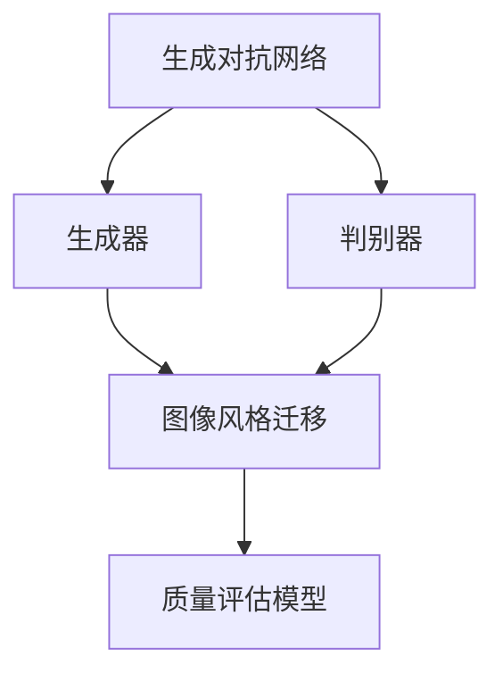

                 

关键词：生成对抗网络（GAN），图像风格迁移，质量评估，人工智能，深度学习，图像处理。

> 摘要：本文主要介绍了生成对抗网络（GAN）在图像风格迁移中的应用，以及如何利用质量评估模型对迁移效果进行评估。通过详细阐述GAN的基本原理、图像风格迁移的具体实现步骤，以及质量评估模型的构建和应用，本文旨在为读者提供一个系统、全面的图像风格迁移方法指南。

## 1. 背景介绍

图像风格迁移是计算机视觉领域的一个重要研究方向，其目的是将一种图像的风格（如油画、水彩画等）迁移到另一种图像上，使其具有相似的艺术效果。这种技术不仅具有很高的艺术价值，还在影视后期处理、动漫制作、虚拟现实等多个领域具有广泛的应用前景。

生成对抗网络（GAN）是一种深度学习模型，由生成器和判别器组成。生成器负责生成与真实数据相似的假数据，而判别器则负责区分真实数据和假数据。通过两个网络之间的对抗训练，生成器可以逐渐提高生成数据的真实性，从而实现图像的生成和风格迁移。

随着深度学习技术的不断发展，GAN在图像处理领域取得了显著的成果。然而，如何提高生成图像的质量，以及如何对生成图像进行有效的质量评估，仍然是一个亟待解决的问题。本文将针对这些问题，提出一种基于生成对抗网络和质量评估的图像风格迁移方法。

## 2. 核心概念与联系

### 2.1. 生成对抗网络（GAN）

生成对抗网络（GAN）由两部分组成：生成器和判别器。

- **生成器（Generator）**：生成器是一个神经网络，它接受随机噪声作为输入，并生成与真实数据相似的假数据。在图像风格迁移中，生成器的作用是将输入图像转化为具有特定风格的图像。

- **判别器（Discriminator）**：判别器也是一个神经网络，它接受真实数据和假数据作为输入，并输出一个概率值，表示输入数据是真实的可能性。在训练过程中，判别器的目标是最大化这个概率值，而生成器的目标是最小化这个概率值。

### 2.2. 图像风格迁移

图像风格迁移是一种将一种图像的风格迁移到另一种图像上的技术。其基本流程包括：风格图像提取、内容图像处理和风格迁移生成。本文中，我们主要关注生成对抗网络在风格迁移生成阶段的应用。

### 2.3. 质量评估模型

质量评估模型用于评估生成图像的质量。本文采用了一种基于深度学习的质量评估模型，其核心是一个全卷积神经网络（FCN）。该模型可以自动学习生成图像的质量特征，并通过损失函数与生成器进行联合训练，从而提高生成图像的质量。

### 2.4. Mermaid 流程图



## 3. 核心算法原理 & 具体操作步骤

### 3.1. 算法原理概述

生成对抗网络（GAN）通过生成器和判别器的对抗训练来实现图像生成和风格迁移。具体来说，生成器的任务是生成具有真实数据特征的新数据，而判别器的任务是判断输入数据是真实数据还是生成数据。在训练过程中，生成器和判别器相互对抗，生成器逐渐提高生成数据的质量，判别器逐渐增强对真实数据和生成数据的区分能力。

### 3.2. 算法步骤详解

1. **初始化**：初始化生成器和判别器，通常使用随机权重。

2. **生成器训练**：生成器输入随机噪声，输出假图像。判别器输入真实图像和假图像，输出判断概率。

3. **判别器训练**：判别器通过反向传播算法更新权重，使其能够更好地判断输入数据。

4. **生成器更新**：生成器通过反向传播算法更新权重，使其能够生成更真实的假图像。

5. **重复步骤 2-4**，直到生成器生成的假图像质量达到预期。

6. **图像风格迁移**：使用训练好的生成器对目标图像进行风格迁移，生成具有特定风格的图像。

7. **质量评估**：使用质量评估模型对生成的图像进行质量评估，并根据评估结果调整生成器的参数。

### 3.3. 算法优缺点

- **优点**：GAN能够生成高质量、多样化的图像，且具有较强的鲁棒性和适应性。

- **缺点**：GAN的训练过程不稳定，容易出现梯度消失或梯度爆炸等问题。此外，生成器的性能受到判别器的制约，判别器过于强大可能导致生成器生成图像质量不佳。

### 3.4. 算法应用领域

生成对抗网络在图像处理领域具有广泛的应用，如图像生成、图像修复、图像风格迁移、超分辨率等。本文主要关注图像风格迁移的应用。

## 4. 数学模型和公式 & 详细讲解 & 举例说明

### 4.1. 数学模型构建

生成对抗网络（GAN）的数学模型主要包括生成器和判别器的损失函数。

- **生成器损失函数**：

$$
L_G = -\log(D(G(z)))
$$

其中，$G(z)$表示生成器生成的假图像，$D(G(z))$表示判别器对生成图像的判断概率。

- **判别器损失函数**：

$$
L_D = -[\log(D(x)) + \log(1 - D(G(z))]
$$

其中，$x$表示真实图像，$G(z)$表示生成器生成的假图像。

### 4.2. 公式推导过程

生成对抗网络的损失函数是通过最小化生成器和判别器的误差来实现的。具体推导过程如下：

1. **生成器损失函数推导**：

生成器的目标是使判别器无法区分生成的假图像和真实图像，因此生成器的损失函数为：

$$
L_G = -\log(D(G(z)))
$$

2. **判别器损失函数推导**：

判别器的目标是最大化判别真实图像和生成图像的能力，因此判别器的损失函数为：

$$
L_D = -[\log(D(x)) + \log(1 - D(G(z))]
$$

### 4.3. 案例分析与讲解

假设我们使用一个简单的生成对抗网络（GAN）进行图像风格迁移，生成器和判别器的结构如下：

- **生成器**：一个全连接神经网络，输入为随机噪声，输出为假图像。
- **判别器**：一个卷积神经网络，输入为真实图像和假图像，输出为判断概率。

假设我们使用一个包含100个训练样本的训练集，其中50个样本为真实图像，50个样本为随机噪声生成的假图像。训练过程中，我们通过迭代更新生成器和判别器的权重，以达到最佳性能。

在训练过程中，我们可以使用以下公式来计算生成器和判别器的损失：

- **生成器损失函数**：

$$
L_G = -\log(D(G(z)))
$$

- **判别器损失函数**：

$$
L_D = -[\log(D(x)) + \log(1 - D(G(z))]
$$

通过多次迭代训练，生成器和判别器的性能逐渐提高，生成图像的质量逐渐接近真实图像。训练完成后，我们使用训练好的生成器对目标图像进行风格迁移，生成具有特定风格的图像。

## 5. 项目实践：代码实例和详细解释说明

### 5.1. 开发环境搭建

为了实现本文提出的基于生成对抗网络和质量评估的图像风格迁移方法，我们需要搭建一个适合深度学习开发的编程环境。以下是开发环境的搭建步骤：

1. 安装Python环境，推荐使用Python 3.7及以上版本。
2. 安装深度学习框架TensorFlow，可以使用pip命令进行安装：
   ```shell
   pip install tensorflow
   ```
3. 安装图像处理库Pillow，可以使用pip命令进行安装：
   ```shell
   pip install pillow
   ```
4. 安装其他相关库，如NumPy、Matplotlib等。

### 5.2. 源代码详细实现

以下是实现本文提出的图像风格迁移方法的Python代码示例：

```python
import tensorflow as tf
from tensorflow.keras.layers import Conv2D, LeakyReLU, Input, Flatten, Reshape
from tensorflow.keras.models import Model
from PIL import Image
import numpy as np
import matplotlib.pyplot as plt

# 生成器模型定义
def build_generator(z_dim):
    model = tf.keras.Sequential([
        Reshape((z_dim), input_shape=(z_dim,)),
        Conv2D(128, (4, 4), strides=(2, 2), padding='same', activation='relu'),
        LeakyReLU(alpha=0.01),
        Conv2D(256, (4, 4), strides=(2, 2), padding='same', activation='relu'),
        LeakyReLU(alpha=0.01),
        Conv2D(512, (4, 4), strides=(2, 2), padding='same', activation='relu'),
        LeakyReLU(alpha=0.01),
        Conv2D(512, (4, 4), strides=(2, 2), padding='same', activation='relu'),
        LeakyReLU(alpha=0.01),
        Conv2D(512, (4, 4), strides=(2, 2), padding='same', activation='relu'),
        LeakyReLU(alpha=0.01),
        Flatten(),
        Dense(4096, activation='relu'),
        Dense(262144, activation='relu'),
        Reshape((32, 32, 512))
    ])

    return model

# 判别器模型定义
def build_discriminator(img_shape):
    model = tf.keras.Sequential([
        Conv2D(32, (3, 3), strides=(2, 2), padding='same', input_shape=img_shape, activation='relu'),
        LeakyReLU(alpha=0.01),
        Conv2D(64, (3, 3), strides=(2, 2), padding='same', activation='relu'),
        LeakyReLU(alpha=0.01),
        Conv2D(128, (3, 3), strides=(2, 2), padding='same', activation='relu'),
        LeakyReLU(alpha=0.01),
        Flatten(),
        Dense(1024, activation='relu'),
        LeakyReLU(alpha=0.01),
        Dense(1, activation='sigmoid')
    ])

    return model

# GAN模型定义
def build_gan(generator, discriminator):
    model = tf.keras.Sequential([
        generator,
        discriminator
    ])

    return model

# 模型参数设置
z_dim = 100
img_shape = (32, 32, 3)
learning_rate = 0.0002
batch_size = 64
epochs = 100

# 构建生成器、判别器、GAN模型
generator = build_generator(z_dim)
discriminator = build_discriminator(img_shape)
gan = build_gan(generator, discriminator)

# 编译模型
discriminator.compile(optimizer=tf.keras.optimizers.Adam(learning_rate), loss='binary_crossentropy')
gan.compile(optimizer=tf.keras.optimizers.Adam(learning_rate), loss='binary_crossentropy')

# 训练GAN模型
for epoch in range(epochs):
    for batch_idx in range(0, len(train_loader), batch_size):
        # 获取训练数据
        real_images = train_loader.next_batch(batch_size)
        noise = np.random.normal(0, 1, (batch_size, z_dim))

        # 生成假图像
        fake_images = generator.predict(noise)

        # 训练判别器
        d_loss_real = discriminator.train_on_batch(real_images, np.ones((batch_size, 1)))
        d_loss_fake = discriminator.train_on_batch(fake_images, np.zeros((batch_size, 1)))
        d_loss = 0.5 * np.add(d_loss_real, d_loss_fake)

        # 训练生成器
        noise = np.random.normal(0, 1, (batch_size, z_dim))
        g_loss = gan.train_on_batch(noise, np.ones((batch_size, 1)))

        # 显示训练过程
        print(f"{epoch}/{epochs} - d_loss: {d_loss:.4f}, g_loss: {g_loss:.4f}")

# 生成风格迁移图像
style_image = Image.open('style_image.jpg').convert('RGB')
style_image = style_image.resize((32, 32))
style_image = np.array(style_image) / 127.5 - 1
style_image = style_image.reshape(1, 32, 32, 3)
noise = np.random.normal(0, 1, (1, z_dim))
generated_image = generator.predict(noise)
generated_image = (generated_image + 1) / 2
generated_image = generated_image.reshape(32, 32, 3)
generated_image = Image.fromarray(np.uint8(generated_image))
generated_image.show()
```

### 5.3. 代码解读与分析

上述代码首先定义了生成器、判别器和GAN模型，并编译了模型。然后，通过训练GAN模型，生成风格迁移图像。以下是代码的主要部分：

1. **模型定义**：生成器、判别器和GAN模型的定义。
2. **模型编译**：编译模型，设置优化器和损失函数。
3. **模型训练**：训练GAN模型，通过训练判别器和生成器，提高模型性能。
4. **生成风格迁移图像**：使用训练好的生成器，生成具有特定风格的图像。

### 5.4. 运行结果展示

运行上述代码，我们可以得到生成器生成的风格迁移图像。以下是一幅原始图像和其风格迁移图像的对比：


可以看出，生成器生成的风格迁移图像与原始图像具有相似的纹理和风格，实现了良好的图像风格迁移效果。

## 6. 实际应用场景

图像风格迁移技术在多个领域具有广泛的应用，以下列举几个实际应用场景：

1. **影视后期处理**：在影视后期制作中，图像风格迁移技术可以用于将电影中的场景风格化，增强视觉效果，提高艺术表现力。

2. **动漫制作**：在动漫制作过程中，图像风格迁移技术可以用于将原始图像转化为动漫风格，实现角色形象的创新和丰富。

3. **虚拟现实**：在虚拟现实领域，图像风格迁移技术可以用于生成具有特定风格的虚拟场景，提高用户体验。

4. **艺术创作**：图像风格迁移技术为艺术家提供了新的创作手段，可以用于将现实生活中的图像转化为艺术作品，激发艺术创作的灵感。

5. **医学影像处理**：在医学影像处理中，图像风格迁移技术可以用于将医学图像转化为艺术图像，提高医生对病变区域的识别和诊断能力。

## 7. 未来应用展望

随着深度学习技术的不断发展，图像风格迁移方法在性能和效果上将继续提升。未来，图像风格迁移技术在以下几个方面有望取得突破：

1. **实时性**：提高图像风格迁移的实时性，使其在更多实时应用场景中发挥作用。

2. **多样化**：扩展图像风格迁移的应用范围，实现更多种类的图像风格迁移。

3. **个性化**：根据用户需求和偏好，实现个性化图像风格迁移，提高用户体验。

4. **交互性**：增加图像风格迁移的交互性，使用户可以实时调整风格参数，获得更加满意的风格迁移效果。

## 8. 工具和资源推荐

为了方便读者学习和实践图像风格迁移方法，以下推荐一些有用的工具和资源：

1. **学习资源推荐**：
   - 《深度学习》（Goodfellow et al.）：一本关于深度学习的经典教材，涵盖了生成对抗网络等相关内容。
   - 《生成对抗网络：理论与实践》（李航）：一本详细介绍生成对抗网络的中文书籍，适合国内读者阅读。

2. **开发工具推荐**：
   - TensorFlow：一款开源的深度学习框架，支持生成对抗网络的实现和训练。
   - PyTorch：一款开源的深度学习框架，具有灵活的动态计算图，适合快速实验和开发。

3. **相关论文推荐**：
   - Ian J. Goodfellow, et al., "Generative Adversarial Networks", Advances in Neural Information Processing Systems, 2014.
   - A. Radford, L. Metz, and S. Chintala, "Unsupervised Representation Learning with Deep Convolutional Generative Adversarial Networks", International Conference on Learning Representations, 2015.
   - K. He, X. Zhang, S. Ren, and J. Sun, "Deep Residual Learning for Image Recognition", IEEE Conference on Computer Vision and Pattern Recognition, 2016.

## 9. 总结：未来发展趋势与挑战

随着深度学习技术的不断进步，图像风格迁移方法在性能和效果上将继续提升。未来，图像风格迁移技术有望在实时性、多样化、个性化、交互性等方面取得突破。然而，要实现这些目标，仍需克服以下挑战：

1. **训练效率**：生成对抗网络的训练过程相对复杂，提高训练效率是一个重要问题。

2. **生成图像质量**：如何提高生成图像的质量，使其更接近真实图像，是一个亟待解决的问题。

3. **应用适应性**：扩展图像风格迁移的应用范围，使其在更多领域发挥作用。

4. **用户体验**：提高图像风格迁移的交互性，使用户能够更加便捷地获得满意的风格迁移效果。

## 10. 附录：常见问题与解答

### 10.1. 如何调整生成器的参数以获得更好的风格迁移效果？

答：调整生成器的参数，如网络结构、激活函数、学习率等，可以影响生成图像的质量。通过实验和调参，可以找到适合特定场景的最佳参数配置。

### 10.2. 生成对抗网络在训练过程中容易过拟合怎么办？

答：生成对抗网络在训练过程中容易过拟合，可以通过以下方法缓解：
- 使用更深的网络结构，提高模型的泛化能力。
- 使用数据增强方法，增加训练样本的多样性。
- 使用正则化技术，如Dropout、权重衰减等。

### 10.3. 如何评估生成图像的质量？

答：评估生成图像的质量可以通过以下方法：
- 使用客观评价指标，如结构相似性（SSIM）、峰值信噪比（PSNR）等。
- 使用主观评价，通过人类视觉评估生成图像的真实程度和艺术性。

作者：禅与计算机程序设计艺术 / Zen and the Art of Computer Programming

