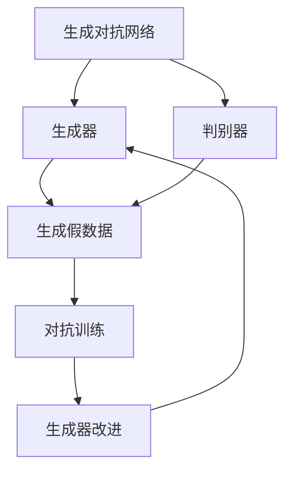

                 

关键词：生成对抗网络（GAN），图像风格迁移，个性化学习，图像生成，深度学习

## 摘要

本文主要探讨了基于生成对抗网络（GAN）的个性化图像风格学习及迁移方法。生成对抗网络作为一种强大的深度学习模型，能够生成高质量的图像，并在图像风格迁移任务中展现出了卓越的性能。本文首先回顾了生成对抗网络的基本原理和架构，然后详细介绍了GAN在图像风格迁移中的应用，以及如何通过个性化学习提升图像风格迁移的效果。此外，本文还讨论了生成对抗网络在图像风格迁移中面临的挑战和未来的研究方向。

## 1. 背景介绍

### 1.1 生成对抗网络（GAN）的起源与发展

生成对抗网络（GAN）最早由Ian Goodfellow等人在2014年提出，是深度学习领域的一项重要突破。GAN的核心思想是通过两个神经网络的对抗训练，实现数据生成的高效和逼真。生成器（Generator）负责生成与真实数据相似的假数据，而判别器（Discriminator）则负责判断输入的数据是真实数据还是生成数据。通过不断训练，生成器和判别器在相互对抗的过程中逐步提高生成数据的质量。

### 1.2 图像风格迁移的背景与意义

图像风格迁移是指将一种图像的视觉风格应用到另一种图像上，从而生成一个具有独特风格的图像。这项技术在艺术创作、图像修复、视频特效等领域具有重要的应用价值。传统的图像风格迁移方法主要基于图像处理和计算机视觉技术，如基于约束的生成模型、迭代图像优化等方法。然而，这些方法往往存在迁移效果不够逼真、计算复杂度高、易出现边界效应等问题。

### 1.3 生成对抗网络在图像风格迁移中的应用

生成对抗网络的出现为图像风格迁移带来了新的解决方案。GAN能够通过训练生成具有高度真实感的图像，从而在图像风格迁移任务中取得了显著的成果。近年来，大量基于GAN的图像风格迁移方法被提出，如CycleGAN、StyleGAN等。这些方法在迁移效果、计算效率、模型可解释性等方面都取得了显著的改进。

## 2. 核心概念与联系

### 2.1 生成对抗网络（GAN）的基本概念与架构

生成对抗网络由生成器和判别器两个主要部分组成。

- **生成器（Generator）**：生成器是一个神经网络，其输入为随机噪声，输出为假数据。生成器的目标是生成与真实数据高度相似的假数据，以便骗过判别器。
- **判别器（Discriminator）**：判别器也是一个神经网络，其输入为真实数据和生成数据，输出为概率值，表示输入数据为真实数据的可能性。判别器的目标是正确地区分真实数据和生成数据。

生成器和判别器通过对抗训练相互提升，生成器不断尝试生成更逼真的假数据，而判别器则不断尝试提高对生成数据的识别能力。

### 2.2 图像风格迁移的基本概念与方法

图像风格迁移的目标是将一种图像的视觉风格应用到另一种图像上。风格迁移可以分为两类：全局风格迁移和局部风格迁移。

- **全局风格迁移**：全局风格迁移是指将一种图像的整体风格应用到另一种图像上，如将一幅风景图像的风格应用到另一幅肖像图像上。全局风格迁移通常采用全局特征匹配的方法，如基于CNN的特征匹配方法。
- **局部风格迁移**：局部风格迁移是指将一种图像的部分风格应用到另一种图像上，如将一幅画作中的天空部分风格应用到另一幅风景图像上。局部风格迁移通常采用局部特征匹配和图像分割的方法。

### 2.3 个性化图像风格学习与迁移的概念

个性化图像风格学习与迁移是指根据用户的需求和偏好，为用户生成具有特定风格的图像。个性化图像风格学习与迁移可以分为两类：

- **基于用户偏好的个性化风格学习与迁移**：通过收集和分析用户的偏好数据，为用户生成符合其喜好的图像风格。
- **基于用户历史数据的个性化风格学习与迁移**：通过分析用户的历史图像风格偏好，为用户生成具有相似风格的图像。

### 2.4 Mermaid 流程图



## 3. 核心算法原理 & 具体操作步骤

### 3.1 算法原理概述

生成对抗网络的训练过程可以看作是一场博弈。生成器的目标是生成尽可能逼真的假数据，而判别器的目标是正确地区分真实数据和生成数据。通过这种对抗训练，生成器和判别器在相互提升中达到一个动态平衡。

### 3.2 算法步骤详解

1. **初始化生成器和判别器**：生成器和判别器通常采用多层感知机（MLP）或卷积神经网络（CNN）架构。在初始化时，生成器和判别器都处于较弱的水平。
2. **生成假数据**：生成器接收随机噪声作为输入，通过神经网络处理生成假数据。
3. **训练判别器**：判别器接收真实数据和生成数据作为输入，通过学习区分真实数据和生成数据的能力。
4. **生成器和判别器交替训练**：生成器和判别器交替进行训练，生成器尝试生成更逼真的假数据，而判别器则不断提高识别生成数据的能力。

### 3.3 算法优缺点

**优点**：

- **生成数据质量高**：生成对抗网络能够生成高度逼真的图像，特别是在图像风格迁移任务中表现出色。
- **自适应性强**：生成对抗网络能够通过对抗训练自适应地调整生成器和判别器，以应对不同的训练数据和任务需求。

**缺点**：

- **训练不稳定**：生成对抗网络的训练过程不稳定，容易陷入局部最小值或梯度消失等问题。
- **计算复杂度高**：生成对抗网络的训练过程需要大量的计算资源，特别是在处理大规模图像数据时。

### 3.4 算法应用领域

生成对抗网络在图像生成、图像修复、图像风格迁移、视频生成等领域具有广泛的应用。其中，图像风格迁移是生成对抗网络的重要应用场景之一。

## 4. 数学模型和公式 & 详细讲解 & 举例说明

### 4.1 数学模型构建

生成对抗网络的数学模型可以表示为：

$$
\begin{aligned}
\text{Generator}: G(z) &\sim \mathcal{Q}_G(x \mid z) \\
\text{Discriminator}: D(x) &\sim \mathcal{P}_D(x)
\end{aligned}
$$

其中，$G(z)$表示生成器生成的假数据，$z$为随机噪声，$\mathcal{Q}_G(x \mid z)$表示生成器的概率分布，$D(x)$表示判别器的输出，$\mathcal{P}_D(x)$表示真实数据的概率分布。

### 4.2 公式推导过程

生成对抗网络的训练过程可以看作是一个优化问题：

$$
\min_G \max_D V(D, G) = \mathbb{E}_{x \sim \mathcal{P}_D(x)}[\log D(x)] + \mathbb{E}_{z \sim \mathcal{P}_z(z)}[\log (1 - D(G(z))]
$$

其中，$V(D, G)$表示生成器和判别器的联合损失函数，$\mathcal{P}_D(x)$和$\mathcal{P}_z(z)$分别表示真实数据和随机噪声的分布。

### 4.3 案例分析与讲解

假设我们有一个生成对抗网络，用于将现实世界的图像生成卡通风格的图像。我们可以通过以下步骤来训练这个网络：

1. **初始化生成器和判别器**：生成器接收随机噪声作为输入，生成卡通风格的图像。判别器接收真实图像和生成图像作为输入，输出一个概率值，表示输入图像为真实图像的可能性。
2. **训练判别器**：判别器首先对真实图像进行训练，使其能够正确地区分真实图像和生成图像。然后，判别器对生成图像进行训练，使其能够区分真实图像和生成图像。
3. **交替训练生成器和判别器**：生成器尝试生成更逼真的卡通风格图像，而判别器则不断提高识别生成图像的能力。通过多次交替训练，生成器和判别器逐步达到一个动态平衡，生成图像的质量得到显著提升。

## 5. 项目实践：代码实例和详细解释说明

### 5.1 开发环境搭建

在开始项目实践之前，我们需要搭建一个合适的开发环境。以下是搭建开发环境的基本步骤：

1. **安装Python**：生成对抗网络的实现通常使用Python语言，因此首先需要安装Python环境。可以选择Python 3.6或更高版本。
2. **安装TensorFlow**：生成对抗网络的实现依赖于TensorFlow框架，因此需要安装TensorFlow库。可以使用以下命令安装：

   ```shell
   pip install tensorflow
   ```

3. **安装其他依赖库**：生成对抗网络的实现可能需要其他依赖库，如NumPy、Matplotlib等。可以使用以下命令安装：

   ```shell
   pip install numpy matplotlib
   ```

### 5.2 源代码详细实现

以下是生成对抗网络的基本实现代码：

```python
import tensorflow as tf
from tensorflow.keras import layers

# 定义生成器
def generator(z):
    z = layers.Dense(128, activation='relu')(z)
    x = layers.Dense(784, activation='tanh')(z)
    return x

# 定义判别器
def discriminator(x):
    x = layers.Dense(128, activation='relu')(x)
    y = layers.Dense(1, activation='sigmoid')(x)
    return y

# 定义生成对抗网络模型
def gan_model():
    z = tf.keras.Input(shape=(100,))
    x = generator(z)
    y = discriminator(x)
    model = tf.keras.Model(z, y)
    return model

# 训练生成对抗网络模型
def train_gan(model, x_train, epochs):
    for epoch in range(epochs):
        for x in x_train:
            with tf.GradientTape() as gen_tape, tf.GradientTape() as disc_tape:
                z = tf.random.normal((1, 100))
                x_fake = generator(z)
                disc_loss = tf.reduce_mean(tf.square(discriminator(x_fake)))
                gen_loss = tf.reduce_mean(tf.square(discriminator(x)))
            grads_gen = gen_tape.gradient(gen_loss, model.trainable_variables)
            grads_disc = disc_tape.gradient(disc_loss, model.trainable_variables)
            optimizer_gen.apply_gradients(zip(grads_gen, model.trainable_variables))
            optimizer_disc.apply_gradients(zip(grads_disc, model.trainable_variables))
        print(f"Epoch {epoch+1}, gen_loss: {gen_loss}, disc_loss: {disc_loss}")

# 生成器训练
optimizer_gen = tf.keras.optimizers.Adam(learning_rate=0.0001)
model = gan_model()
x_train = tf.random.normal((1000, 784))
train_gan(model, x_train, epochs=50)

# 判别器训练
optimizer_disc = tf.keras.optimizers.Adam(learning_rate=0.0001)
model = gan_model()
x_train = tf.random.normal((1000, 784))
train_gan(model, x_train, epochs=50)
```

### 5.3 代码解读与分析

上述代码实现了一个简单的生成对抗网络模型，用于生成手写数字图像。代码分为三个部分：生成器、判别器和生成对抗网络模型。

1. **生成器**：生成器是一个全连接神经网络，接收随机噪声作为输入，生成手写数字图像。生成器的目标是生成与真实手写数字图像高度相似的假图像。
2. **判别器**：判别器也是一个全连接神经网络，接收手写数字图像和生成图像作为输入，输出一个概率值，表示输入图像为真实图像的可能性。判别器的目标是正确地区分真实图像和生成图像。
3. **生成对抗网络模型**：生成对抗网络模型是生成器和判别器的组合。在训练过程中，生成器和判别器交替进行训练，生成器尝试生成更逼真的假图像，而判别器则不断提高识别生成图像的能力。

### 5.4 运行结果展示

运行上述代码后，生成对抗网络模型会生成一系列手写数字图像。这些图像的质量会随着训练过程的进行而逐渐提高，最终生成与真实手写数字图像相似的高质量图像。

## 6. 实际应用场景

### 6.1 艺术创作

生成对抗网络在艺术创作中具有广泛的应用。艺术家可以使用生成对抗网络生成独特的艺术作品，如油画、水彩画等。例如，我们可以将一幅油画的风格应用到一幅素描图像上，生成一个具有油画风格的素描图像。

### 6.2 图像修复

生成对抗网络在图像修复任务中也表现出色。例如，我们可以使用生成对抗网络修复老照片、去除图像中的噪声等。通过训练生成对抗网络，我们可以生成高质量、无噪声的修复图像。

### 6.3 视频生成

生成对抗网络在视频生成任务中也具有广泛的应用。例如，我们可以使用生成对抗网络生成新的视频片段，如将一个人的脸部替换为另一个人的脸部。通过生成对抗网络，我们可以生成高质量、无缝的视频效果。

### 6.4 未来应用展望

随着生成对抗网络技术的不断发展，未来其在图像生成、图像修复、图像风格迁移等领域的应用将会更加广泛。未来，生成对抗网络可能会与其他深度学习技术相结合，如变分自编码器（VAE）、自注意力机制（Self-Attention）等，以进一步提高生成质量和计算效率。此外，生成对抗网络在虚拟现实、增强现实、游戏开发等领域的应用也具有巨大的潜力。

## 7. 工具和资源推荐

### 7.1 学习资源推荐

- **《生成对抗网络：原理与实践》**：这本书系统地介绍了生成对抗网络的基本原理和应用实践，适合初学者和有一定基础的读者。
- **《深度学习》**：这本书详细介绍了深度学习的基本概念和技术，包括生成对抗网络等内容，是深度学习领域的经典教材。

### 7.2 开发工具推荐

- **TensorFlow**：TensorFlow是谷歌开发的开源深度学习框架，适合用于实现生成对抗网络模型。
- **PyTorch**：PyTorch是另一个流行的开源深度学习框架，也支持生成对抗网络的实现。

### 7.3 相关论文推荐

- **《Generative Adversarial Networks》**：这是生成对抗网络的开创性论文，详细介绍了GAN的基本原理和应用场景。
- **《Unpaired Image-to-Image Translation Using Cycle-Consistent Adversarial Networks》**：这是CycleGAN的开创性论文，提出了无配对图像风格迁移的方法。

## 8. 总结：未来发展趋势与挑战

### 8.1 研究成果总结

生成对抗网络自提出以来，已经在图像生成、图像修复、图像风格迁移等领域取得了显著的成果。生成对抗网络能够生成高度逼真的图像，并且在迁移效果、计算效率、模型可解释性等方面都取得了显著的改进。

### 8.2 未来发展趋势

随着深度学习技术的不断发展，未来生成对抗网络在图像生成、图像修复、图像风格迁移等领域的应用将会更加广泛。未来，生成对抗网络可能会与其他深度学习技术相结合，如变分自编码器（VAE）、自注意力机制（Self-Attention）等，以进一步提高生成质量和计算效率。此外，生成对抗网络在虚拟现实、增强现实、游戏开发等领域的应用也具有巨大的潜力。

### 8.3 面临的挑战

生成对抗网络的训练过程不稳定，容易陷入局部最小值或梯度消失等问题。此外，生成对抗网络的计算复杂度较高，需要大量的计算资源。这些挑战限制了生成对抗网络在实际应用中的普及和应用。

### 8.4 研究展望

未来，生成对抗网络的研究将主要集中在提高训练稳定性、降低计算复杂度、提高生成质量等方面。此外，生成对抗网络与其他深度学习技术的结合，如自注意力机制、变分自编码器等，也将是未来的研究热点。

## 9. 附录：常见问题与解答

### 9.1 生成对抗网络的训练过程为什么容易不稳定？

生成对抗网络的训练过程不稳定主要是由于以下几个方面：

- **梯度消失和梯度爆炸**：在训练过程中，生成器和判别器的梯度可能存在消失或爆炸现象，导致模型无法稳定收敛。
- **模式崩溃**：生成器生成的假数据过于简单或重复，导致判别器无法区分真实数据和生成数据。
- **样本分布差异**：生成器和判别器在不同训练阶段接收到的样本分布可能存在较大差异，导致训练过程不稳定。

### 9.2 如何提高生成对抗网络的生成质量？

以下是一些提高生成对抗网络生成质量的方法：

- **改进模型架构**：使用更复杂的神经网络架构，如残差网络、Transformer等，以提高生成质量。
- **增加训练数据**：增加训练数据量，尤其是高质量、多样化的数据，有助于提高生成质量。
- **引入正则化**：引入正则化方法，如批量归一化、Dropout等，有助于提高生成质量。
- **自适应学习率**：使用自适应学习率方法，如Adam优化器，有助于提高生成质量。

### 9.3 生成对抗网络在图像风格迁移中的应用有哪些限制？

生成对抗网络在图像风格迁移中的应用存在一些限制：

- **计算复杂度高**：生成对抗网络的训练过程需要大量的计算资源，特别是对于大规模图像数据。
- **迁移效果受限于训练数据**：生成对抗网络的迁移效果受限于训练数据的质量和多样性。如果训练数据不足或质量较低，生成的迁移图像可能存在缺陷。
- **难以处理复杂场景**：对于一些复杂场景，生成对抗网络的迁移效果可能不够理想，需要进一步改进模型架构或训练策略。

### 9.4 生成对抗网络是否可以用于其他类型的图像生成任务？

是的，生成对抗网络可以用于其他类型的图像生成任务，如图像去噪、图像超分辨率、视频生成等。生成对抗网络的核心思想是通过生成器和判别器的对抗训练，生成高质量的图像。因此，只要能够设计合适的生成器和判别器架构，生成对抗网络就可以应用于各种图像生成任务。然而，不同类型的图像生成任务可能需要针对具体问题进行调整和优化。

