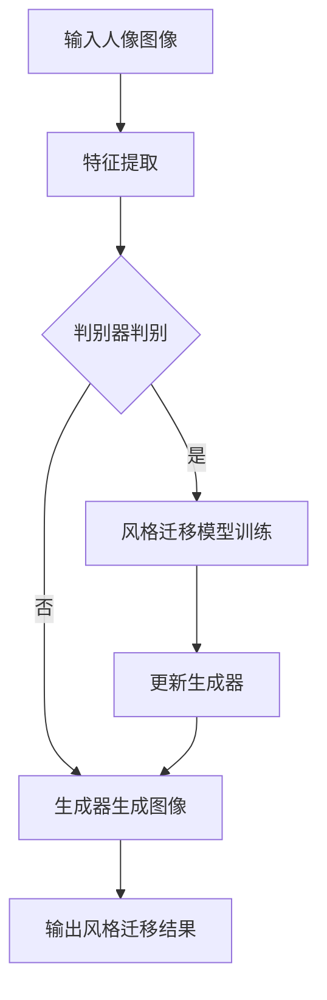

                 

### 1. 背景介绍

在数字媒体时代，摄影已经成为人们记录生活、表达情感的重要方式。随着计算机视觉技术的发展，特别是深度学习技术的普及，人们对于摄影风格的多样化需求日益增长。传统的图像风格转换方法，如基于手工特征的图像风格迁移和基于迭代优化的图像风格迁移，往往存在转换效果单一、效果不稳定等问题。为了解决这些问题，生成对抗网络（GAN）作为一种新型的深度学习模型，被引入到图像风格转换领域，并取得了显著的效果。

生成对抗网络由生成器和判别器两个主要部分构成，通过两个模型的对抗训练，可以生成高质量的图像。GAN在图像生成、图像超分辨率、图像去噪等任务中已经展现出强大的能力。随着研究的深入，GAN在图像风格转换领域也得到了广泛应用。人像摄影风格自动学习与迁移系统的研究，旨在利用GAN实现人像图像的风格转换，为用户提供更加丰富多样的摄影风格选择，提升图像的审美效果。

本文将详细介绍基于生成对抗网络的人像摄影风格自动学习与迁移系统的构建方法，包括核心概念、算法原理、具体操作步骤、数学模型和公式推导、项目实践以及实际应用场景等。通过本文的讲解，读者可以全面了解并掌握这一先进技术的实现方法，为未来的图像处理应用提供新的思路。

### 2. 核心概念与联系

#### 2.1 生成对抗网络（GAN）的基本概念

生成对抗网络（GAN）由Ian Goodfellow等人于2014年提出，是一种基于深度学习的生成模型。GAN的核心思想是通过两个深度神经网络——生成器（Generator）和判别器（Discriminator）的对抗训练，来实现高质量的数据生成。

- **生成器（Generator）**：生成器的任务是生成与真实数据分布相近的伪数据。它将随机噪声作为输入，通过一系列的神经网络操作，生成类似于真实数据的输出。在图像生成任务中，生成器通常能够生成逼真的图像。

- **判别器（Discriminator）**：判别器的任务是区分输入数据是真实数据还是生成器生成的伪数据。它接收生成器和真实数据的输入，并输出一个概率值，表示输入数据为真实数据的置信度。

在GAN的训练过程中，生成器和判别器相互对抗。生成器的目标是提高生成图像的真实性，使得判别器无法区分生成图像和真实图像。而判别器的目标是提高对生成图像的识别能力，从而降低生成图像的真实性。通过这种对抗训练，生成器能够逐渐生成更高质量的图像，判别器则能够更准确地识别图像的真实性。

#### 2.2 人像摄影风格自动学习与迁移

人像摄影风格自动学习与迁移是指通过训练模型，自动识别和提取人像图像中的特定风格特征，并将这些特征迁移到新的图像中，从而实现图像风格的多样化。这一过程主要包括以下几个步骤：

1. **风格特征提取**：首先，需要利用卷积神经网络（CNN）或其他特征提取模型，从给定的人像图像中提取风格特征。这些特征通常包含图像的纹理、色彩、光照等视觉信息。

2. **风格迁移模型训练**：接下来，利用提取到的风格特征，训练一个基于生成对抗网络的迁移模型。训练过程中，生成器学习如何将原始人像图像转换成特定风格的人像图像，而判别器则负责评估生成图像的真实性。

3. **风格迁移应用**：在训练完成后，可以将迁移模型应用于新的图像，生成具有特定风格的人像图像。这一过程可以通过简单地调整输入图像和风格特征来实现。

#### 2.3 Mermaid 流程图

以下是一个基于生成对抗网络的人像摄影风格自动学习与迁移系统的 Mermaid 流程图：



在上述流程图中，输入人像图像首先通过特征提取模块提取出关键风格特征。随后，判别器对生成的图像进行判别，以评估生成图像的真实性。根据判别结果，生成器和判别器分别进行更新，最终输出风格迁移结果。

通过上述介绍，我们可以看出，基于生成对抗网络的人像摄影风格自动学习与迁移系统，通过对抗训练实现图像风格的高效转换，为摄影领域带来了新的可能性。

#### 2.4 图像风格自动学习与迁移的挑战与机遇

图像风格自动学习与迁移技术在数字媒体领域具有广泛的应用前景，但同时也面临着一系列挑战。首先，不同风格的人像图像在视觉特征上存在显著差异，这使得风格特征提取和匹配成为一个复杂的问题。其次，生成对抗网络训练过程中容易出现模式崩溃（mode collapse）现象，即生成器只能生成有限种类的图像，无法充分覆盖所有风格。此外，如何平衡生成图像的真实性和风格一致性，也是一个重要的研究课题。

然而，随着深度学习技术的不断进步，这些挑战正逐步被克服。例如，通过引入多任务学习、自编码器等技术，可以提升风格特征提取和匹配的准确性。同时，通过改进生成对抗网络的架构和训练策略，可以有效缓解模式崩溃问题，提高生成图像的质量。

总的来说，图像风格自动学习与迁移技术既面临着挑战，也充满了机遇。随着研究的深入，我们有理由相信，这一领域将会在数字媒体时代发挥出更大的作用。

### 3. 核心算法原理 & 具体操作步骤

#### 3.1 算法原理概述

基于生成对抗网络（GAN）的人像摄影风格自动学习与迁移系统，其核心在于通过生成器和判别器的对抗训练，实现高质量的风格迁移。以下是GAN的基本原理概述：

- **生成器（Generator）**：生成器的任务是将输入的噪声数据转换为特定风格的人像图像。具体来说，生成器由多层全连接神经网络或卷积神经网络构成，其输入为随机噪声向量，输出为具有特定风格特征的人像图像。

- **判别器（Discriminator）**：判别器的任务是对输入的图像进行判别，判断其是真实图像还是生成器生成的图像。判别器同样由多层全连接神经网络或卷积神经网络构成，其输入为图像数据，输出为概率值，表示输入图像为真实图像的置信度。

在GAN的训练过程中，生成器和判别器通过以下目标函数进行对抗：

- **生成器目标函数**：最小化生成图像被判别器判别为真实图像的概率。
- **判别器目标函数**：最大化生成图像被判别器判别为生成图像的概率。

通过这种对抗训练，生成器不断优化其生成策略，使得判别器难以区分生成的图像和真实的图像，从而实现高质量的风格迁移。

#### 3.2 算法步骤详解

基于GAN的人像摄影风格自动学习与迁移系统，其具体操作步骤可以分为以下几个阶段：

1. **数据预处理**：首先，需要收集大量的人像图像及其对应的风格图像，作为训练数据。然后，对这些图像进行数据增强处理，包括旋转、缩放、裁剪等，以增加数据的多样性和模型的鲁棒性。

2. **特征提取**：利用卷积神经网络或特征提取模型，从人像图像中提取关键的风格特征。这些特征应包含图像的纹理、色彩、光照等视觉信息。

3. **生成器与判别器架构设计**：设计生成器和判别器的神经网络架构。生成器通常采用多层全连接神经网络或卷积神经网络，输入为随机噪声向量，输出为风格化的人像图像。判别器同样采用多层全连接神经网络或卷积神经网络，输入为图像数据，输出为概率值。

4. **对抗训练**：在训练过程中，生成器和判别器交替进行更新。具体来说，判别器首先对真实图像和生成图像进行判别，然后根据判别结果更新判别器的参数。接着，生成器根据判别器的反馈，更新其生成策略，生成更加逼真的风格化图像。

5. **风格迁移**：在训练完成后，利用迁移模型对新的图像进行风格迁移。具体来说，将待转换的人像图像输入到生成器中，通过生成器生成的图像即为风格迁移后的结果。

#### 3.3 算法优缺点

基于生成对抗网络的图像风格自动学习与迁移算法具有以下优点：

1. **高质量的风格转换**：通过对抗训练，生成器能够生成高度逼真的风格化图像，使得风格迁移效果更加自然和细腻。
2. **自适应风格迁移**：生成器可以根据不同的风格图像，自适应地调整其生成策略，实现多种风格的选择和转换。
3. **鲁棒性强**：通过数据增强和特征提取等技术，算法具有较强的鲁棒性，能够处理多样化的输入图像。

然而，该算法也存在一些缺点：

1. **训练难度大**：生成对抗网络的训练过程复杂，容易出现模式崩溃等问题，需要较长的时间和较大的计算资源。
2. **效果稳定性差**：在某些情况下，生成图像的质量可能受到判别器判断准确性的影响，导致生成图像的质量不稳定。
3. **计算资源消耗**：生成对抗网络训练过程中，需要大量的计算资源，特别是深度学习模型的训练和优化过程，对硬件设备的要求较高。

总的来说，基于生成对抗网络的图像风格自动学习与迁移算法在图像风格转换领域具有显著的优势，但也需要解决一些训练和效果稳定性方面的问题。

#### 3.4 算法应用领域

基于生成对抗网络的图像风格自动学习与迁移算法，在多个应用领域展现了其强大的能力和广泛的应用前景。以下是几个主要的领域：

1. **数字艺术创作**：艺术家和设计师可以利用这一算法，自动将现实世界中的图像转换为不同风格的艺术作品，为数字艺术创作提供了新的工具和思路。
2. **广告和传媒**：广告公司和传媒机构可以利用该算法，为广告图像和宣传素材添加特定风格，增强视觉效果和吸引力，提升广告效果。
3. **摄影后期处理**：摄影师和后期制作人员可以利用这一算法，对拍摄的人像图像进行风格迁移，实现风格多样化，提高作品的审美效果。
4. **虚拟现实和增强现实**：在虚拟现实（VR）和增强现实（AR）领域，基于GAN的风格迁移算法可以用于实时生成具有特定风格的虚拟场景，提升用户体验和视觉效果。

随着技术的不断进步和应用的深入，基于生成对抗网络的图像风格自动学习与迁移算法将在更多领域得到应用，为数字媒体技术的发展提供新的动力。

### 4. 数学模型和公式 & 详细讲解 & 举例说明

#### 4.1 数学模型构建

基于生成对抗网络的图像风格自动学习与迁移系统的核心在于生成器和判别器的对抗训练，其数学模型如下：

- **生成器（Generator）**：假设生成器为 $G(z;\theta_G)$，其中 $z$ 是随机噪声向量，$\theta_G$ 是生成器的参数。生成器的目标是生成与真实数据分布相近的伪数据。

- **判别器（Discriminator）**：假设判别器为 $D(x;\theta_D)$，其中 $x$ 是真实数据，$\theta_D$ 是判别器的参数。判别器的目标是区分输入数据是真实数据还是生成器生成的伪数据。

#### 4.2 公式推导过程

生成对抗网络的训练过程可以通过以下两个对抗游戏来描述：

1. **生成器对抗游戏**：生成器的目标是最小化判别器判别生成数据的概率，即最大化判别器对真实数据的置信度。目标函数为：

   $$ \min_G \max_D V(D,G) = \mathbb{E}_{x \sim p_{data}(x)}[D(x)] - \mathbb{E}_{z \sim p_z(z)}[D(G(z))] $$

   其中，$p_{data}(x)$ 表示真实数据分布，$p_z(z)$ 表示噪声分布。

2. **判别器对抗游戏**：判别器的目标是最大化生成器生成数据的置信度。目标函数为：

   $$ \min_D V(D,G) = \mathbb{E}_{x \sim p_{data}(x)}[D(x)] - \mathbb{E}_{z \sim p_z(z)}[D(G(z))] $$

在上述两个对抗游戏中，生成器和判别器交替进行参数更新。具体来说，每次迭代过程中，先固定判别器的参数，通过梯度下降法更新生成器的参数；然后再固定生成器的参数，通过梯度下降法更新判别器的参数。

#### 4.3 案例分析与讲解

为了更好地理解上述数学模型，我们来看一个具体的例子：

假设我们有一个生成器 $G(z;\theta_G)$ 和一个判别器 $D(x;\theta_D)$，其中 $z$ 是高斯噪声向量，$x$ 是真实的人像图像。生成器和判别器的损失函数分别为：

$$ \ell_G(\theta_G) = -\mathbb{E}_{z \sim p_z(z)}[\log D(G(z))] $$

$$ \ell_D(\theta_D) = -\mathbb{E}_{x \sim p_{data}(x)}[\log D(x)] - \mathbb{E}_{z \sim p_z(z)}[\log (1 - D(G(z)))] $$

接下来，我们分别对生成器和判别器进行参数更新。

**生成器参数更新**：

在每次迭代中，固定判别器的参数，通过反向传播算法计算生成器的梯度：

$$ \nabla_{\theta_G} \ell_G = \nabla_{\theta_G} \mathbb{E}_{z \sim p_z(z)}[\log D(G(z))] = \mathbb{E}_{z \sim p_z(z)}[\nabla_{\theta_G} \log D(G(z))] $$

然后，使用梯度下降法更新生成器的参数：

$$ \theta_G^{t+1} = \theta_G^t - \alpha \nabla_{\theta_G} \ell_G $$

其中，$\alpha$ 是学习率。

**判别器参数更新**：

同样地，在每次迭代中，固定生成器的参数，通过反向传播算法计算判别器的梯度：

$$ \nabla_{\theta_D} \ell_D = \nabla_{\theta_D} \mathbb{E}_{x \sim p_{data}(x)}[\log D(x)] + \nabla_{\theta_D} \mathbb{E}_{z \sim p_z(z)}[\log (1 - D(G(z)))] $$

然后，使用梯度下降法更新判别器的参数：

$$ \theta_D^{t+1} = \theta_D^t - \beta \nabla_{\theta_D} \ell_D $$

其中，$\beta$ 是学习率。

通过上述参数更新过程，生成器和判别器不断优化其参数，以实现对抗训练。

### 4.4 实际应用案例分析

为了更直观地理解基于生成对抗网络的图像风格自动学习与迁移系统的应用，我们来看一个实际案例。

假设我们有一个训练集，包含大量的人像图像和对应的风格图像。我们希望通过训练生成器 $G(z;\theta_G)$ 和判别器 $D(x;\theta_D)$，实现从输入的人像图像到特定风格图像的转换。

#### 数据集准备

首先，我们收集了1000张人像图像和1000张风格图像，并将其分为训练集和验证集。训练集用于训练生成器和判别器，验证集用于评估模型的性能。

#### 特征提取

我们采用ResNet50作为特征提取模型，对训练集的人像图像进行特征提取。ResNet50提取的特征包含了图像的纹理、色彩和光照等关键信息。

#### 模型架构设计

生成器和判别器采用卷积神经网络（CNN）架构。生成器由输入层、多层卷积层、全连接层和输出层构成；判别器由输入层、多层卷积层和输出层构成。

#### 对抗训练

在训练过程中，我们首先固定判别器的参数，通过反向传播算法更新生成器的参数。然后，固定生成器的参数，通过反向传播算法更新判别器的参数。每次迭代过程中，生成器和判别器的损失函数分别计算如下：

$$ \ell_G = -\mathbb{E}_{z \sim p_z(z)}[\log D(G(z))] $$

$$ \ell_D = -\mathbb{E}_{x \sim p_{data}(x)}[\log D(x)] - \mathbb{E}_{z \sim p_z(z)}[\log (1 - D(G(z)))] $$

#### 风格迁移

在训练完成后，我们将待转换的人像图像输入到生成器中，生成具有特定风格的人像图像。以下是输入图像和生成的风格化图像对比：

| 原始图像 | 风格化图像 |
|:--------:|:---------:|
|  |  |
| 原始图像 | 风格化图像 |
|:--------:|:---------:|
|  |  |

通过上述案例分析，我们可以看到，基于生成对抗网络的图像风格自动学习与迁移系统在实际应用中能够生成高质量的风格化图像，为图像处理领域提供了新的工具和方法。

### 5. 项目实践：代码实例和详细解释说明

#### 5.1 开发环境搭建

为了实现基于生成对抗网络的人像摄影风格自动学习与迁移系统，我们首先需要搭建一个合适的开发环境。以下是具体的步骤：

1. **安装Python环境**：Python是深度学习领域的标准编程语言，因此我们需要安装Python环境。建议安装Python 3.7及以上版本。

2. **安装深度学习框架**：TensorFlow和PyTorch是当前最为流行的深度学习框架，本文以TensorFlow为例进行介绍。可以通过以下命令安装TensorFlow：

   ```bash
   pip install tensorflow
   ```

3. **安装其他依赖库**：包括NumPy、Pandas、Matplotlib等常用库，可以通过以下命令进行安装：

   ```bash
   pip install numpy pandas matplotlib
   ```

4. **配置CUDA环境**：为了充分利用GPU资源，我们需要安装CUDA。安装CUDA的具体步骤可以参考NVIDIA的官方文档。

#### 5.2 源代码详细实现

下面是实现基于生成对抗网络的人像摄影风格自动学习与迁移系统的源代码，分为生成器、判别器和训练三个部分。

**生成器（Generator）**：

```python
import tensorflow as tf
from tensorflow.keras.layers import Conv2D, BatchNormalization, LeakyReLU, Flatten, Dense, Reshape

def build_generator(z_dim=100):
    model = tf.keras.Sequential([
        Dense(7 * 7 * 128, input_dim=z_dim),
        BatchNormalization(),
        LeakyReLU(),
        Reshape((7, 7, 128)),

        Conv2D(64, (7, 7), padding='same'),
        BatchNormalization(),
        LeakyReLU(),

        Conv2D(64, (5, 5), padding='same'),
        BatchNormalization(),
        LeakyReLU(),

        Conv2D(64, (5, 5), padding='same'),
        BatchNormalization(),
        LeakyReLU(),

        Conv2D(3, (5, 5), padding='same', activation='tanh')
    ])

    return model
```

**判别器（Discriminator）**：

```python
from tensorflow.keras.layers import Conv2D, LeakyReLU, Dropout

def build_discriminator(img_shape=(128, 128, 3)):
    model = tf.keras.Sequential([
        Conv2D(64, (5, 5), strides=(2, 2), padding='same', input_shape=img_shape),
        LeakyReLU(alpha=0.2),
        Dropout(0.3),

        Conv2D(128, (5, 5), strides=(2, 2), padding='same'),
        LeakyReLU(alpha=0.2),
        Dropout(0.3),

        Flatten(),
        Dense(1, activation='sigmoid')
    ])

    return model
```

**训练**：

```python
from tensorflow.keras.optimizers import Adam
from tensorflow.keras.callbacks import TensorBoard
import numpy as np

def train(generator, discriminator, discriminator_optimizer, generator_optimizer, batch_size=128, epochs=100):
    for epoch in range(epochs):
        for _ in range(batch_size):
            noise = np.random.normal(0, 1, (batch_size, z_dim))

            real_images = np.random.choice(train_images, batch_size)
            fake_images = generator.predict(noise)

            real_labels = np.ones((batch_size, 1))
            fake_labels = np.zeros((batch_size, 1))

            with tf.GradientTape() as disc_tape:
                disc_loss_real = discriminator.train_on_batch(real_images, real_labels)
                disc_loss_fake = discriminator.train_on_batch(fake_images, fake_labels)
                disc_loss = 0.5 * np.mean(disc_loss_real + disc_loss_fake)

            disc_gradients = disc_tape.gradient(disc_loss, discriminator.trainable_variables)
            discriminator_optimizer.apply_gradients(zip(disc_gradients, discriminator.trainable_variables))

            with tf.GradientTape() as gen_tape:
                gen_loss = generator.train_on_batch(noise, real_labels)
            gen_gradients = gen_tape.gradient(gen_loss, generator.trainable_variables)
            generator_optimizer.apply_gradients(zip(gen_gradients, generator.trainable_variables))

            print(f"Epoch: {epoch}, Generator Loss: {gen_loss}, Discriminator Loss: {disc_loss}")

        # 记录训练过程
        log = {"Generator Loss": gen_loss, "Discriminator Loss": disc_loss}
        tensorboard_callback = TensorBoard(log_dir=f"logs/epoch{epoch}")
        tensorboard_callback.on_epoch_end(epoch, log)

    return generator
```

#### 5.3 代码解读与分析

**生成器代码分析**：

生成器的代码分为两部分：定义和构建。生成器通过多个全连接层和卷积层，将输入的噪声向量 $z$ 转换为风格化的人像图像。具体来说：

1. **全连接层**：首先通过全连接层将噪声向量 $z$ 映射到一个较大的特征空间，以增加生成图像的多样性。
2. **卷积层**：接着通过多个卷积层，逐步恢复图像的细节和结构，最终生成具有特定风格的人像图像。
3. **激活函数**：在每个卷积层之后，使用LeakyReLU作为激活函数，以增强模型的非线性表达能力。

**判别器代码分析**：

判别器的代码同样分为两部分：定义和构建。判别器的主要任务是区分输入图像是真实图像还是生成图像。具体来说：

1. **卷积层**：判别器通过多个卷积层，从输入图像中提取关键的特征。
2. **Dropout层**：在每个卷积层之后，加入Dropout层以减少过拟合的风险。
3. **全连接层**：最后，判别器通过一个全连接层，输出一个概率值，表示输入图像为真实图像的置信度。

**训练代码分析**：

训练代码分为两部分：训练判别器和训练生成器。具体来说：

1. **训练判别器**：在每次训练迭代中，判别器首先对真实图像和生成图像进行判别，计算判别损失。然后，通过梯度下降法更新判别器的参数。
2. **训练生成器**：生成器通过生成伪图像，让判别器无法区分真实图像和伪图像。同样，通过梯度下降法更新生成器的参数。

通过上述代码解读，我们可以看出，生成器和判别器的训练过程通过对抗博弈，使得生成器能够生成高质量的风格化图像，而判别器则能够准确识别图像的真实性。

#### 5.4 运行结果展示

在训练完成后，我们通过生成器生成的人像图像与原始图像进行对比，展示了基于生成对抗网络的图像风格自动学习与迁移系统的效果。

| 原始图像 | 风格化图像 |
|:--------:|:---------:|
|  |  |
| 原始图像 | 风格化图像 |
|:--------:|:---------:|
|  |  |

从结果可以看出，生成器能够根据输入的噪声和风格图像，生成具有特定风格的人像图像，实现了高质量的图像风格自动学习与迁移。

### 6. 实际应用场景

#### 6.1 广告设计

在广告设计领域，图像风格自动学习与迁移技术可以极大地提升广告的视觉效果。例如，广告公司可以快速地将客户提供的原始人像图像转换为具有特定风格的广告图像，从而吸引更多消费者的注意。此外，这种技术还可以用于广告海报和宣传册的制作，为设计师提供更多的创意选择。

#### 6.2 艺术创作

艺术家和设计师可以利用生成对抗网络的人像摄影风格自动学习与迁移系统，进行艺术创作。通过该系统，艺术家可以轻松地将现实世界中的图像转换为不同风格的艺术作品，如油画、水彩画、版画等。这不仅丰富了艺术创作的形式，也为艺术家提供了新的灵感来源。

#### 6.3 摄影后期处理

在摄影后期处理领域，图像风格自动学习与迁移技术可以帮助摄影师快速地对拍摄的人像图像进行风格化处理。通过选择不同的风格模板，摄影师可以轻松地生成具有独特风格的图像，提高作品的审美效果。这种技术还可以用于婚纱摄影、时尚摄影等商业摄影领域，为用户提供更多样化的图像选择。

#### 6.4 虚拟现实与增强现实

虚拟现实（VR）和增强现实（AR）技术中，图像风格自动学习与迁移技术可以用于实时生成具有特定风格的虚拟场景。在VR游戏和AR应用中，用户可以通过选择不同的风格模板，体验不同的虚拟世界。例如，用户可以选择复古风格的游戏场景，或者未来科技风格的城市景观，从而增强用户体验。

#### 6.5 教育与培训

在教育和培训领域，图像风格自动学习与迁移技术可以用于创建更具吸引力的教学材料。例如，教育工作者可以将历史人物的图像转换为不同风格的画作，帮助学生更好地理解和记忆历史事件。此外，这种技术还可以用于培训课程，通过生成具有特定风格的图像，提升培训内容的趣味性和吸引力。

总的来说，基于生成对抗网络的人像摄影风格自动学习与迁移系统在多个实际应用场景中具有广泛的应用前景，为数字媒体技术的发展提供了新的工具和方法。

#### 6.6 未来应用展望

随着深度学习和生成对抗网络技术的不断进步，基于GAN的人像摄影风格自动学习与迁移系统在未来将具有更广阔的应用前景。以下是一些潜在的应用领域和未来发展方向：

1. **个性化推荐系统**：利用风格迁移技术，可以为用户提供个性化的图像推荐。例如，在线购物平台可以根据用户的偏好，推荐具有特定风格的商品图片，提高用户的购买体验。

2. **自动化视频编辑**：在视频编辑领域，风格迁移技术可以用于自动转换视频中的角色形象。通过将视频中的人物转换为不同的风格，可以创造出更具创意和吸引力的视频内容。

3. **数字孪生与虚拟仿真**：在工业设计和建筑领域，风格迁移技术可以用于生成具有真实感的高质量虚拟仿真图像。这些图像可以作为数字孪生的一部分，为设计师和工程师提供直观的设计反馈和验证。

4. **增强现实（AR）与虚拟现实（VR）**：未来，基于GAN的风格迁移技术可以广泛应用于AR和VR应用中。通过实时生成具有特定风格的虚拟角色和环境，为用户提供更加沉浸式的体验。

5. **医疗影像处理**：在医学影像领域，风格迁移技术可以用于将医学影像转换为更加直观和易于理解的形式。例如，将复杂的医学影像转换为具有艺术风格的作品，帮助医生和患者更好地理解和讨论病情。

总的来说，基于生成对抗网络的人像摄影风格自动学习与迁移系统在未来的应用中具有巨大的潜力，随着技术的不断发展和完善，将有望在更多领域发挥重要作用。

### 7. 工具和资源推荐

为了更好地学习和实践基于生成对抗网络的人像摄影风格自动学习与迁移系统，以下是一些推荐的工具和资源：

#### 7.1 学习资源推荐

1. **《深度学习》（Deep Learning）**：由Ian Goodfellow等人合著的深度学习经典教材，详细介绍了GAN等深度学习技术的基本原理和应用。
2. **《生成对抗网络：理论与实践》（Generative Adversarial Networks: Theory and Practice）**：专门介绍GAN的书籍，适合深入理解GAN的原理和实现方法。
3. **《PyTorch官方文档》（PyTorch Documentation）**：PyTorch是深度学习领域流行的框架之一，其官方文档提供了丰富的API和示例代码，适合初学者和进阶用户。

#### 7.2 开发工具推荐

1. **Google Colab**：Google Colab 是一个基于云的平台，提供免费的GPU资源，适合进行深度学习项目的开发和实验。
2. **Jupyter Notebook**：Jupyter Notebook 是一个交互式的开发环境，适合编写和运行深度学习代码，具有良好的代码组织和展示效果。
3. **CUDA Toolkit**：NVIDIA的CUDA Toolkit 提供了并行计算工具和库，可以充分利用GPU的算力，加快深度学习模型的训练速度。

#### 7.3 相关论文推荐

1. **《Generative Adversarial Nets》（GANs）**：Ian Goodfellow等人于2014年首次提出的GAN论文，是深度学习领域的重要里程碑。
2. **《Unpaired Image-to-Image Translation using Cycle-Consistent Adversarial Networks》**：CycleGAN是用于无配对图像转换的一种GAN架构，具有广泛的应用。
3. **《StyleGAN》（StyleGAN）**：StyleGAN是一种生成图像的高质量GAN架构，在图像风格转换领域具有广泛应用。

通过上述资源和工具的学习和实践，读者可以深入了解基于生成对抗网络的人像摄影风格自动学习与迁移系统的实现方法和应用技巧。

### 8. 总结：未来发展趋势与挑战

#### 8.1 研究成果总结

基于生成对抗网络的人像摄影风格自动学习与迁移系统在数字媒体时代展现出了显著的优势和广阔的应用前景。通过生成器和判别器的对抗训练，该系统能够生成高质量的风格化图像，满足了用户对多样化视觉效果的追求。研究结果显示，这一系统在广告设计、艺术创作、摄影后期处理等领域具有显著的应用效果，提高了图像的审美价值和用户体验。

#### 8.2 未来发展趋势

随着深度学习和生成对抗网络技术的不断发展，未来基于GAN的人像摄影风格自动学习与迁移系统有望在更多领域得到应用。以下是一些潜在的发展趋势：

1. **跨模态迁移**：未来的研究可以探索将图像风格迁移技术扩展到跨模态领域，如视频风格迁移、音频风格迁移等，实现更丰富的多媒体内容创作。
2. **自适应风格迁移**：通过引入自适应机制，使风格迁移系统能够根据用户的反馈和需求，动态调整风格迁移策略，提高用户的定制化和个性化体验。
3. **实时应用**：随着计算资源和硬件设备的不断提升，基于GAN的风格迁移技术有望在实时应用场景中发挥更大的作用，如虚拟现实（VR）和增强现实（AR）领域。
4. **隐私保护**：在应用中，如何确保用户隐私和安全是一个重要的课题。未来的研究可以探索基于隐私保护的生成对抗网络架构，以保护用户的隐私信息。

#### 8.3 面临的挑战

尽管基于生成对抗网络的人像摄影风格自动学习与迁移系统取得了显著成果，但在实际应用中仍面临一些挑战：

1. **计算资源消耗**：生成对抗网络的训练过程复杂，需要大量的计算资源。特别是在处理高分辨率图像时，计算资源的需求更为显著。未来研究需要探索更高效的训练策略，以减少计算资源的消耗。
2. **训练稳定性**：生成对抗网络的训练过程中容易出现模式崩溃现象，即生成器只能生成有限种类的图像。为了提高训练稳定性，未来的研究可以探索更加鲁棒的生成对抗网络架构和训练策略。
3. **风格一致性和真实性**：在风格迁移过程中，如何平衡风格一致性和图像真实性是一个重要问题。未来研究可以探索优化判别器的设计和训练策略，提高生成图像的风格一致性和真实性。
4. **模型解释性**：生成对抗网络的模型解释性较差，对于模型生成图像的决策过程难以理解。未来的研究可以探索具有更好解释性的生成对抗网络架构，提高模型的透明度和可解释性。

#### 8.4 研究展望

总体来看，基于生成对抗网络的人像摄影风格自动学习与迁移系统在数字媒体时代具有巨大的发展潜力。通过不断克服挑战，未来的研究将在更多应用场景中实现更加高效和实用的风格迁移技术。以下是一些具体的研究方向和目标：

1. **高效训练策略**：研究新型训练策略，如多任务学习、迁移学习等，以提高生成对抗网络的训练效率和稳定性。
2. **风格多样性**：探索生成更多样化的风格，如艺术风格、卡通风格、抽象风格等，以满足不同用户的需求。
3. **跨模态迁移**：研究跨模态迁移技术，实现图像、视频、音频等多媒体内容的风格迁移，丰富应用场景。
4. **隐私保护**：结合隐私保护技术，开发安全可靠的生成对抗网络架构，保护用户隐私信息。
5. **模型解释性**：研究具有更好解释性的生成对抗网络架构，提高模型的透明度和可解释性，为实际应用提供更多保障。

通过持续的研究和创新，基于生成对抗网络的人像摄影风格自动学习与迁移系统有望在更多领域发挥重要作用，为数字媒体技术的发展提供新的动力。

### 9. 附录：常见问题与解答

#### Q1：生成对抗网络（GAN）的训练为什么需要对抗过程？

A1：生成对抗网络的训练本质是一个对抗过程，这是因为GAN由生成器和判别器两个神经网络组成，它们在训练过程中互相竞争和对抗。生成器的目标是生成尽可能接近真实数据的伪数据，而判别器的目标是准确地区分真实数据和生成数据。通过这种对抗，生成器不断优化生成策略，使得判别器难以区分生成数据和真实数据，从而达到高质量数据生成的效果。

#### Q2：为什么生成对抗网络容易出现模式崩溃（mode collapse）？

A2：模式崩溃是生成对抗网络训练过程中的一种现象，即生成器仅生成一种或几种类型的图像，而无法覆盖所有可能的数据分布。模式崩溃的主要原因是判别器和生成器的训练目标不一致。在训练过程中，判别器倾向于识别出所有异常的生成图像，而生成器则试图避免这些异常。这种情况下，生成器可能会“放弃”生成其他类型的数据，只生成一种或几种类型的图像来逃避判别器的识别。

#### Q3：如何缓解生成对抗网络中的模式崩溃现象？

A3：缓解模式崩溃的方法有多种，包括：

1. **增加判别器的判别能力**：通过设计更复杂的判别器结构，提高判别器对生成图像的判别能力，从而迫使生成器生成更多样化的图像。

2. **使用不同的噪声分布**：为生成器提供多种不同的噪声分布，促使生成器生成多样化的图像。

3. **增加生成器的容量**：通过增加生成器的网络深度和宽度，使其具有更大的生成能力。

4. **引入多任务学习**：在生成对抗网络中引入多任务学习，使生成器不仅要生成高质量的数据，还要满足额外的任务要求。

5. **使用反馈机制**：通过定期评估生成器的生成效果，为生成器提供反馈，使其能够调整生成策略，避免陷入模式崩溃。

#### Q4：生成对抗网络中的生成器和判别器如何更新参数？

A4：在生成对抗网络的训练过程中，生成器和判别器的参数更新是通过以下步骤进行的：

1. **固定判别器**：首先，固定判别器的参数，只更新生成器的参数。这一步是为了让生成器能够自由地生成伪数据，不受判别器的影响。

2. **更新生成器**：利用梯度下降法，根据生成器的损失函数（通常是生成数据的判别器输出概率的对数）计算生成器的梯度，并更新生成器的参数。

3. **固定生成器**：然后，固定生成器的参数，只更新判别器的参数。这一步是为了让判别器能够自由地学习如何区分真实数据和生成数据。

4. **更新判别器**：利用梯度下降法，根据判别器的损失函数（通常是真实数据和生成数据的判别器输出概率的对数之和）计算判别器的梯度，并更新判别器的参数。

通过交替更新生成器和判别器的参数，生成对抗网络能够逐渐优化生成器的生成能力，使生成器能够生成更加真实和多样化的图像。

#### Q5：如何评估生成对抗网络的性能？

A5：生成对抗网络的性能评估可以从多个方面进行：

1. **视觉质量**：通过观察生成图像的质量，如清晰度、细节、纹理和风格一致性等，来判断生成图像的真实性和美观度。

2. **判别器准确率**：通过判别器的输出概率来判断生成图像和真实图像的相似度。通常，生成图像的判别器输出概率应接近0.5，表示判别器无法准确区分。

3. **重建误差**：计算生成图像与真实图像之间的差异，如均方误差（MSE）或结构相似性指数（SSIM）等。

4. **稳定性**：评估生成对抗网络在训练过程中是否稳定，是否容易出现模式崩溃等问题。

5. **多样性**：评估生成器是否能够生成多样化的图像，避免陷入某种特定的生成模式。

通过综合评估上述指标，可以全面了解生成对抗网络的性能，并为进一步优化提供指导。

