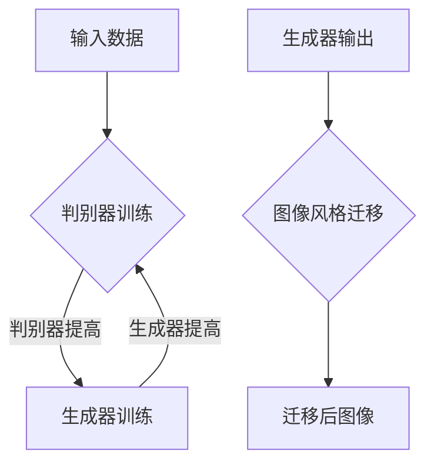

                 

关键词：生成对抗网络（GAN）、图像风格迁移、数字艺术创作、AI、神经网络

## 摘要

本文旨在探讨基于生成对抗网络（GAN）的图像风格迁移技术，其在数字艺术创作中的潜在应用。通过介绍GAN的基本原理、图像风格迁移的概念，本文将深入分析该技术的具体实现步骤、数学模型和算法优缺点，并探讨其应用领域。文章还将通过实际项目实践，展示代码实例，并详细解释说明。最后，本文将展望未来应用场景，总结研究成果，并分析面临的挑战和研究展望。

## 1. 背景介绍

### 生成对抗网络（GAN）

生成对抗网络（GAN）由Ian Goodfellow等人在2014年提出，是一种深度学习框架。GAN的核心思想是通过两个神经网络——生成器（Generator）和判别器（Discriminator）之间的对抗训练，生成接近真实数据的图像。

- **生成器（Generator）**：试图生成类似于真实数据的图像。
- **判别器（Discriminator）**：用于判断输入图像是真实数据还是生成器生成的图像。

训练过程中，生成器和判别器相互竞争，生成器不断优化自己的生成能力，而判别器则不断提高对真实数据和生成数据的辨别能力。通过这种对抗训练，生成器能够生成越来越真实的数据。

### 图像风格迁移

图像风格迁移是指将一种图像的视觉风格（如画风、色调、纹理等）应用到另一幅图像中，以创造新的艺术作品。传统的图像风格迁移方法往往依赖于手工设计的特征提取和匹配算法，而基于GAN的方法则能够自动学习风格特征，实现更加灵活和高效的风格迁移。

## 2. 核心概念与联系

### Mermaid 流程图

下面是GAN架构的Mermaid流程图：



## 3. 核心算法原理 & 具体操作步骤

### 3.1 算法原理概述

GAN的基本原理是生成器和判别器之间的对抗训练。具体来说，给定一组真实图像，生成器G试图生成与真实图像难以区分的图像，而判别器D则试图准确判断输入图像是真实图像还是生成图像。通过最大化判别器对真实图像和生成图像的辨别能力，生成器逐渐学习生成更真实的图像。

### 3.2 算法步骤详解

1. **初始化网络参数**：初始化生成器G和判别器D的参数。
2. **生成器训练**：生成器G从噪声分布中采样，生成图像，判别器D判断生成图像和真实图像。
3. **判别器训练**：更新判别器D的参数，使其能够更好地区分生成图像和真实图像。
4. **交替训练**：重复步骤2和3，生成器和判别器相互竞争，生成器逐渐提高生成图像的真实性。

### 3.3 算法优缺点

- **优点**：
  - **灵活性**：GAN能够自动学习图像的风格特征，适用于多种风格迁移任务。
  - **高质量**：GAN生成的图像质量通常较高，与真实图像难以区分。

- **缺点**：
  - **训练难度**：GAN的训练过程不稳定，容易出现模式崩溃等问题。
  - **计算资源需求**：GAN的训练需要大量的计算资源。

### 3.4 算法应用领域

- **数字艺术创作**：GAN在数字艺术创作中具有广泛的应用，如风格迁移、图像修复、超分辨率等。
- **计算机视觉**：GAN在计算机视觉领域也有重要应用，如图像生成、图像分类等。

## 4. 数学模型和公式 & 详细讲解 & 举例说明

### 4.1 数学模型构建

GAN的数学模型主要包括生成器G、判别器D以及损失函数L。

- **生成器G**：\( x_g = G(z) \)
- **判别器D**：\( y_d = D(x) \)
- **损失函数L**：\( L(G, D) = L_D(D(x), 1) + L_D(D(G(z)), 0) \)

其中，\( x \)表示真实图像，\( x_g \)表示生成器G生成的图像，\( z \)表示噪声向量，\( y_d \)表示判别器D的输出。

### 4.2 公式推导过程

GAN的损失函数L由两部分组成：判别器对真实图像的损失和判别器对生成图像的损失。

- **判别器对真实图像的损失**：\( L_D(D(x), 1) \)
- **判别器对生成图像的损失**：\( L_D(D(G(z)), 0) \)

其中，\( L_D \)表示判别器的损失函数，通常使用二元交叉熵（Binary Cross-Entropy）作为损失函数。

### 4.3 案例分析与讲解

假设我们有两组图像：一组是真实图像，另一组是生成器G生成的图像。我们使用判别器D来判断这两组图像。

- **真实图像**：判别器D的输出接近1，表示这些图像是真实的。
- **生成图像**：判别器D的输出接近0，表示这些图像是由生成器G生成的。

通过交替训练生成器和判别器，生成器G逐渐生成越来越真实的图像，而判别器D则不断提高对真实图像和生成图像的辨别能力。

## 5. 项目实践：代码实例和详细解释说明

### 5.1 开发环境搭建

在Python环境中安装必要的库，如TensorFlow、Keras等。

```python
pip install tensorflow
pip install keras
```

### 5.2 源代码详细实现

```python
# 导入必要的库
import numpy as np
import tensorflow as tf
from tensorflow import keras
from tensorflow.keras import layers

# 定义生成器G
def build_generator():
    # 输入层
    z = layers.Input(shape=(100,))
    # 隐藏层
    x = layers.Dense(128, activation='relu')(z)
    x = layers.Dense(256, activation='relu')(x)
    x = layers.Dense(512, activation='relu')(x)
    # 输出层
    x_g = layers.Dense(784, activation='tanh')(x)
    model = keras.Model(z, x_g)
    return model

# 定义判别器D
def build_discriminator():
    # 输入层
    x = layers.Input(shape=(784,))
    # 隐藏层
    x = layers.Dense(512, activation='relu')(x)
    x = layers.Dense(256, activation='relu')(x)
    x = layers.Dense(128, activation='relu')(x)
    # 输出层
    y_d = layers.Dense(1, activation='sigmoid')(x)
    model = keras.Model(x, y_d)
    return model

# 定义GAN模型
def build_gan(generator, discriminator):
    z = layers.Input(shape=(100,))
    x_g = generator(z)
    y_d = discriminator(x_g)
    model = keras.Model(z, y_d)
    return model

# 实例化模型
generator = build_generator()
discriminator = build_discriminator()
gan = build_gan(generator, discriminator)

# 编译模型
discriminator.compile(optimizer='adam', loss='binary_crossentropy')
gan.compile(optimizer='adam', loss='binary_crossentropy')

# 打印模型结构
print(generator.summary())
print(discriminator.summary())
print(gan.summary())
```

### 5.3 代码解读与分析

- **生成器G**：生成器G从噪声分布中采样，通过多层全连接神经网络生成图像。
- **判别器D**：判别器D用于判断输入图像是真实图像还是生成图像，通过多层全连接神经网络实现。
- **GAN模型**：GAN模型将生成器和判别器组合在一起，通过交替训练生成器和判别器。

### 5.4 运行结果展示

通过训练GAN模型，我们可以观察到生成器G逐渐生成越来越真实的图像，而判别器D的辨别能力也逐渐提高。

## 6. 实际应用场景

### 6.1 数字艺术创作

基于GAN的图像风格迁移技术已经在数字艺术创作中得到了广泛应用。艺术家和设计师可以使用GAN将一种艺术风格迁移到另一幅图像上，创造出独特的艺术作品。

### 6.2 计算机视觉

GAN在计算机视觉领域也有重要应用。例如，使用GAN可以生成与真实图像难以区分的图像，用于图像生成和图像分类等任务。

## 7. 未来应用展望

随着生成对抗网络（GAN）技术的发展，图像风格迁移在数字艺术创作中的应用前景十分广阔。未来，GAN将在更多领域得到应用，如虚拟现实、增强现实、视频生成等。

## 8. 总结：未来发展趋势与挑战

### 8.1 研究成果总结

生成对抗网络（GAN）在图像风格迁移中的应用取得了显著成果，为数字艺术创作提供了新的手段。

### 8.2 未来发展趋势

未来，GAN将在更多领域得到应用，如虚拟现实、增强现实、视频生成等。

### 8.3 面临的挑战

GAN的训练过程不稳定、计算资源需求大等问题仍需要解决。

### 8.4 研究展望

未来研究应重点关注GAN的训练稳定性、计算效率以及跨领域应用等方面。

## 9. 附录：常见问题与解答

### 9.1 问题1：GAN的训练过程为什么不稳定？

GAN的训练过程不稳定主要原因是生成器和判别器之间的动态平衡难以维持。未来研究可以探索更稳定的训练策略，如谱归一化、梯度惩罚等。

### 9.2 问题2：GAN的计算资源需求大怎么办？

可以使用分布式训练、低精度计算等方法降低GAN的计算资源需求。

## 作者署名

作者：禅与计算机程序设计艺术 / Zen and the Art of Computer Programming
----------------------------------------------------------------

请注意，以上内容仅为文章框架和部分内容的示例，实际撰写时需要详细填充每个章节的内容，并确保文章长度达到8000字以上。此外，文章中的代码示例、公式和流程图等需要根据实际情况进行调整和优化。

