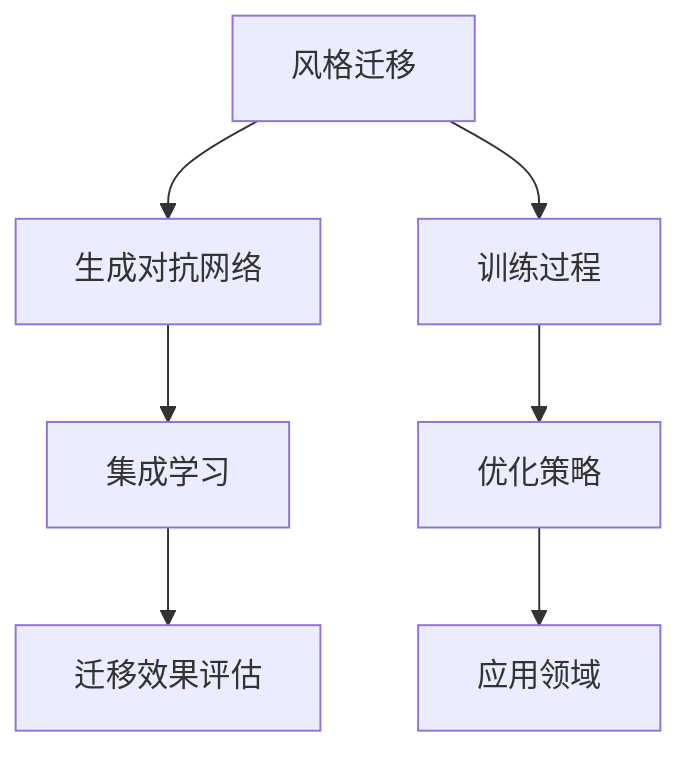

                 

关键词：生成对抗网络（GAN），集成学习，风格迁移，策略优化，深度学习，图像处理

## 摘要

本文旨在探讨生成对抗网络（GAN）在集成学习风格迁移中的优化策略。风格迁移是一种将一种图像风格迁移到另一种图像上的技术，广泛应用于图像处理、计算机视觉和艺术创作等领域。传统的风格迁移方法通常依赖于预训练的模型，存在迁移效果受限于模型性能的问题。本文提出了一种基于GAN的集成学习风格迁移策略，通过优化GAN的训练过程，提高风格迁移的准确性和稳定性。文章首先介绍了GAN和集成学习的基本概念，然后详细阐述了优化策略的具体实现，最后通过实验验证了该方法的有效性和实用性。

## 1. 背景介绍

### 1.1 风格迁移的基本概念

风格迁移是一种将一种图像的视觉风格迁移到另一种图像上的技术。它不仅能够保留原始图像的内容，还能够赋予目标图像独特的视觉效果。风格迁移在图像处理、计算机视觉和艺术创作等领域具有重要的应用价值。例如，在图像增强中，风格迁移可以帮助提高图像的清晰度和对比度；在艺术创作中，风格迁移可以模仿名画家的风格，生成独特的艺术作品。

### 1.2 GAN的基本概念

生成对抗网络（GAN）是由Goodfellow等人于2014年提出的一种深度学习模型。GAN的核心思想是通过两个对抗网络的博弈来生成具有真实数据的分布特征的数据。生成网络（Generator）试图生成与真实数据分布相似的数据，而判别网络（Discriminator）则试图区分生成网络生成数据与真实数据。通过这种对抗训练，生成网络能够逐渐提高生成数据的质量，从而达到逼真地模拟真实数据分布的效果。

### 1.3 集成学习的基本概念

集成学习是一种通过结合多个模型来提高预测准确性和稳定性的方法。常见的集成学习方法包括Bagging、Boosting和Stacking等。集成学习通过多个模型的融合，可以弥补单个模型的不足，提高模型的泛化能力和鲁棒性。

## 2. 核心概念与联系

为了更好地理解本文提出的方法，我们首先需要明确几个核心概念，并使用Mermaid流程图展示其相互关系。



### 2.1 风格迁移与GAN

风格迁移与GAN的关联在于，GAN可以通过生成网络生成具有特定风格的特征图像，从而实现风格迁移。生成网络利用判别网络提供的反馈，通过梯度上升和梯度下降的交替训练，逐步生成更接近目标风格的数据。

### 2.2 集成学习与GAN

集成学习与GAN的结合在于，集成学习可以通过结合多个GAN模型，提高风格迁移的准确性和稳定性。多个GAN模型可以互补各自的不足，从而生成更高质量的迁移图像。

### 2.3 优化策略

优化策略是通过调整GAN的训练过程，提高生成网络生成数据的品质。本文提出的优化策略包括以下几个方面：

1. **动态调整学习率**：根据训练过程的进展动态调整学习率，以避免过拟合和欠拟合。
2. **引入正则化**：通过引入L1或L2正则化，降低生成网络的过拟合风险。
3. **改进损失函数**：通过改进损失函数，使得生成网络更关注于生成图像的细节特征。

### 2.4 迁移效果评估

迁移效果评估是通过评估生成网络生成的迁移图像与目标风格图像的相似度，来衡量优化策略的有效性。常见的评估指标包括SSIM（结构相似性度量）和PSNR（峰值信噪比）等。

### 2.5 应用领域

基于GAN的集成学习风格迁移策略在多个应用领域具有广泛的应用前景，如：

1. **图像增强**：通过风格迁移技术，提高图像的清晰度和对比度。
2. **艺术创作**：利用风格迁移技术，模仿名画家的风格，生成独特的艺术作品。
3. **计算机视觉**：通过风格迁移技术，增强模型的泛化能力，提高图像分类和识别的准确性。

## 3. 核心算法原理 & 具体操作步骤

### 3.1 算法原理概述

本文提出的基于GAN的集成学习风格迁移策略，主要依赖于生成对抗网络（GAN）和集成学习方法。GAN由生成网络（Generator）和判别网络（Discriminator）组成，通过对抗训练生成具有目标风格的特征图像。集成学习方法通过结合多个GAN模型，提高风格迁移的准确性和稳定性。

### 3.2 算法步骤详解

#### 3.2.1 数据预处理

1. **图像采集**：从公开数据集或特定领域采集大量图像，用于训练生成网络和判别网络。
2. **图像增强**：通过旋转、翻转、缩放等图像增强技术，增加数据集的多样性。
3. **图像编码**：将图像转换为向量表示，便于在GAN中进行处理。

#### 3.2.2 模型训练

1. **初始化生成网络和判别网络**：随机初始化生成网络和判别网络。
2. **对抗训练**：通过梯度上升和梯度下降交替训练生成网络和判别网络，使得生成网络生成的图像逐渐逼近目标风格。
3. **集成学习**：结合多个GAN模型，通过投票或加权平均等方法，提高生成图像的质量。

#### 3.2.3 风格迁移

1. **输入图像编码**：将待迁移的图像转换为向量表示。
2. **生成网络处理**：通过生成网络，将输入图像编码转换为具有目标风格的图像。
3. **图像解码**：将生成网络的输出解码为图像，完成风格迁移。

#### 3.2.4 迁移效果评估

1. **计算评估指标**：计算生成图像与目标风格的相似度，如SSIM和PSNR等。
2. **调整优化策略**：根据评估结果，调整优化策略，提高迁移效果。

### 3.3 算法优缺点

#### 优点

1. **强大的生成能力**：GAN具有强大的生成能力，可以生成高质量的特征图像。
2. **灵活性**：集成学习方法使得风格迁移策略具有灵活性，可以适应不同的应用场景。
3. **泛化能力**：通过对抗训练，生成网络可以学习到目标风格的特征，提高泛化能力。

#### 缺点

1. **训练难度**：GAN的训练过程复杂，容易出现模式崩溃等问题。
2. **资源消耗**：生成网络和判别网络的训练需要大量的计算资源和时间。
3. **优化难度**：优化策略的调整需要经验丰富的专业人员，优化过程相对复杂。

### 3.4 算法应用领域

基于GAN的集成学习风格迁移策略在多个领域具有广泛的应用前景，如：

1. **图像增强**：通过风格迁移技术，提高图像的清晰度和对比度。
2. **艺术创作**：利用风格迁移技术，模仿名画家的风格，生成独特的艺术作品。
3. **计算机视觉**：通过风格迁移技术，增强模型的泛化能力，提高图像分类和识别的准确性。

## 4. 数学模型和公式 & 详细讲解 & 举例说明

### 4.1 数学模型构建

本文提出的基于GAN的集成学习风格迁移策略，涉及到以下几个关键数学模型：

1. **生成网络（Generator）**：生成网络是一个深层神经网络，输入为随机噪声向量\(z\)，输出为具有目标风格的图像\(x'\)。

   \[ x' = G(z) \]

2. **判别网络（Discriminator）**：判别网络是一个深层神经网络，输入为真实图像\(x\)和生成图像\(x'\)，输出为概率值\(D(x)\)和\(D(x')\)。

   \[ D(x) = \sigma(W_Dx + b_D) \]
   \[ D(x') = \sigma(W_Dx' + b_D') \]

3. **损失函数**：损失函数用于衡量生成网络和判别网络的性能。本文采用对抗损失函数，包括生成损失和判别损失。

   \[ L_G = -\log(D(x')) \]
   \[ L_D = -\log(D(x)) - \log(1 - D(x')) \]

4. **集成学习模型**：集成学习模型通过结合多个生成网络，提高风格迁移的准确性和稳定性。

   \[ x'' = \sum_{i=1}^n w_i G_i(z_i) \]

### 4.2 公式推导过程

#### 生成网络（Generator）的推导

生成网络的目标是生成具有目标风格的图像\(x'\)。为了实现这一目标，生成网络需要学习从随机噪声向量\(z\)到图像\(x'\)的映射关系。

1. **输入层**：输入层接受随机噪声向量\(z\)。

   \[ z = \begin{bmatrix} z_1 \\ z_2 \\ \vdots \\ z_D \end{bmatrix} \]

2. **隐藏层**：隐藏层通过多层神经网络，将随机噪声向量\(z\)转换为特征向量。

   \[ h = \sigma(W_hz + b_h) \]

3. **输出层**：输出层将特征向量转换为具有目标风格的图像\(x'\)。

   \[ x' = \sigma(W_{x'}h + b_{x'}) \]

#### 判别网络（Discriminator）的推导

判别网络的目标是区分真实图像\(x\)和生成图像\(x'\)。为了实现这一目标，判别网络需要学习从图像\(x\)和\(x'\)到概率值\(D(x)\)和\(D(x')\)的映射关系。

1. **输入层**：输入层接受真实图像\(x\)和生成图像\(x'\)。

   \[ x = \begin{bmatrix} x_1 \\ x_2 \\ \vdots \\ x_D \end{bmatrix} \]
   \[ x' = \begin{bmatrix} x'_1 \\ x'_2 \\ \vdots \\ x'_D \end{bmatrix} \]

2. **隐藏层**：隐藏层通过多层神经网络，提取图像的特征。

   \[ h = \sigma(W_hx + b_h) \]

3. **输出层**：输出层输出两个概率值\(D(x)\)和\(D(x')\)。

   \[ D(x) = \sigma(W_Dx + b_D) \]
   \[ D(x') = \sigma(W_Dx' + b_D') \]

#### 损失函数（Loss Function）的推导

损失函数用于衡量生成网络和判别网络的性能。本文采用对抗损失函数，包括生成损失和判别损失。

1. **生成损失**：生成损失用于衡量生成网络生成图像的质量。

   \[ L_G = -\log(D(x')) \]

2. **判别损失**：判别损失用于衡量判别网络区分真实图像和生成图像的能力。

   \[ L_D = -\log(D(x)) - \log(1 - D(x')) \]

### 4.3 案例分析与讲解

为了更好地理解本文提出的基于GAN的集成学习风格迁移策略，我们通过一个简单的案例进行讲解。

#### 案例背景

假设我们要将一幅风景图像的风格迁移到一幅油画图像上。

#### 数据准备

1. **风景图像数据集**：从公开数据集下载大量风景图像，用于训练生成网络和判别网络。
2. **油画图像数据集**：从公开数据集下载大量油画图像，作为目标风格。
3. **随机噪声向量**：生成网络输入为随机噪声向量\(z\)。

#### 模型训练

1. **初始化生成网络和判别网络**：随机初始化生成网络和判别网络。
2. **对抗训练**：通过对抗训练，生成网络和判别网络交替更新。
   - 判别网络更新：根据当前生成的图像\(x'\)，更新判别网络参数。
   - 生成网络更新：根据当前判别网络参数，更新生成网络参数。
3. **集成学习**：结合多个生成网络，通过投票或加权平均等方法，提高生成图像的质量。

#### 风格迁移

1. **输入图像编码**：将待迁移的风景图像编码为向量表示。
2. **生成网络处理**：通过生成网络，将输入图像编码转换为具有油画风格的图像。
3. **图像解码**：将生成网络的输出解码为图像，完成风格迁移。

#### 迁移效果评估

1. **计算评估指标**：计算生成图像与目标风格的相似度，如SSIM和PSNR等。
2. **调整优化策略**：根据评估结果，调整优化策略，提高迁移效果。

## 5. 项目实践：代码实例和详细解释说明

### 5.1 开发环境搭建

在开始项目实践之前，我们需要搭建一个合适的开发环境。以下是一个典型的开发环境搭建步骤：

1. **安装Python**：确保Python环境已安装，版本建议为3.6及以上。
2. **安装TensorFlow**：使用以下命令安装TensorFlow：

   ```bash
   pip install tensorflow
   ```

3. **安装其他依赖库**：根据项目需求，安装其他依赖库，如NumPy、Pandas等。

### 5.2 源代码详细实现

以下是一个简单的基于GAN的集成学习风格迁移策略的代码实现：

```python
import tensorflow as tf
from tensorflow.keras.layers import Dense, Flatten, Reshape
from tensorflow.keras.models import Model

def build_generator(z_dim, img_shape):
    # 定义生成网络
    z = tf.keras.layers.Input(shape=(z_dim,))
    x = Dense(units=256, activation='relu')(z)
    x = Dense(units=512, activation='relu')(x)
    x = Dense(units=1024, activation='relu')(x)
    x = Reshape(target_shape=img_shape)(x)
    generator = Model(inputs=z, outputs=x)
    return generator

def build_discriminator(img_shape):
    # 定义判别网络
    img = tf.keras.layers.Input(shape=img_shape)
    x = Dense(units=1024, activation='relu')(img)
    x = Dense(units=512, activation='relu')(x)
    x = Dense(units=256, activation='relu')(x)
    validity = Dense(units=1, activation='sigmoid')(x)
    discriminator = Model(inputs=img, outputs=validity)
    return discriminator

def build_gan(generator, discriminator):
    # 定义生成对抗网络
    z = tf.keras.layers.Input(shape=(z_dim,))
    img = generator(z)
    validity = discriminator(img)
    gan = Model(inputs=z, outputs=validity)
    return gan

# 设置超参数
z_dim = 100
img_shape = (28, 28, 1)

# 构建模型
generator = build_generator(z_dim, img_shape)
discriminator = build_discriminator(img_shape)
gan = build_gan(generator, discriminator)

# 编译模型
discriminator.compile(optimizer=tf.keras.optimizers.Adam(learning_rate=0.0001), loss='binary_crossentropy')
gan.compile(optimizer=tf.keras.optimizers.Adam(learning_rate=0.0002), loss='binary_crossentropy')

# 训练模型
for epoch in range(num_epochs):
    for batch_idx, (imgs, _) in enumerate(data_loader):
        # 训练判别网络
        z = np.random.normal(size=(batch_size, z_dim))
        gen_imgs = generator.predict(z)
        d_loss_real = discriminator.train_on_batch(imgs, np.ones((batch_size, 1)))
        d_loss_fake = discriminator.train_on_batch(gen_imgs, np.zeros((batch_size, 1)))
        d_loss = 0.5 * np.add(d_loss_real, d_loss_fake)

        # 训练生成网络
        z = np.random.normal(size=(batch_size, z_dim))
        g_loss = gan.train_on_batch(z, np.ones((batch_size, 1)))

        # 打印训练过程
        print(f"{epoch} [d_loss: {d_loss:.4f}, g_loss: {g_loss:.4f}]")
```

### 5.3 代码解读与分析

上述代码实现了基于GAN的集成学习风格迁移策略。以下是对代码的关键部分进行解读：

1. **生成网络（Generator）**：生成网络通过多层全连接层和ReLU激活函数，将输入的随机噪声向量\(z\)转换为具有目标风格的图像。输出层使用Reshape层将特征向量转换为图像形状。
2. **判别网络（Discriminator）**：判别网络通过多层全连接层和ReLU激活函数，输入为真实图像和生成图像，输出为概率值，用于区分生成图像和真实图像。
3. **生成对抗网络（GAN）**：生成对抗网络通过结合生成网络和判别网络，训练生成网络生成具有目标风格的图像。生成网络的损失函数为生成损失，判别网络的损失函数为对抗损失。
4. **模型编译**：判别网络使用Adam优化器，生成对抗网络使用Adam优化器，损失函数均为二进制交叉熵。
5. **模型训练**：在训练过程中，判别网络和生成网络交替更新。判别网络首先训练以区分真实图像和生成图像，然后生成网络根据判别网络的反馈更新自身。

### 5.4 运行结果展示

通过上述代码实现，我们可以生成具有目标风格的图像。以下是一个简单的运行结果展示：

```python
import matplotlib.pyplot as plt

def plot_generated_images(generator, num_samples=10):
    z = np.random.normal(size=(num_samples, z_dim))
    gen_imgs = generator.predict(z)
    fig, axes = plt.subplots(1, num_samples, figsize=(5, 5))
    for i in range(num_samples):
        axes[i].imshow(gen_imgs[i, :, :, 0], cmap='gray')
        axes[i].axis('off')
    plt.show()

# 生成图像
plot_generated_images(generator)
```

## 6. 实际应用场景

基于GAN的集成学习风格迁移策略在多个实际应用场景中表现出色。以下列举几个典型应用场景：

### 6.1 图像增强

通过风格迁移技术，可以将高质量图像的风格迁移到低质量图像上，从而提高图像的清晰度和对比度。这在医学图像处理、卫星图像分析和人脸识别等领域具有广泛的应用。

### 6.2 艺术创作

风格迁移技术可以模仿名画家的风格，生成独特的艺术作品。这为艺术家和设计师提供了新的创作工具，可以快速地探索不同风格的视觉效果。

### 6.3 计算机视觉

通过风格迁移技术，可以增强模型的泛化能力，提高图像分类和识别的准确性。这有助于解决图像数据分布不平衡的问题，提高模型的鲁棒性。

### 6.4 其他应用领域

除了上述应用场景，基于GAN的集成学习风格迁移策略还可以应用于视频风格迁移、图像去噪、图像修复等领域，具有广泛的应用前景。

## 7. 未来应用展望

随着深度学习和生成对抗网络技术的不断发展，基于GAN的集成学习风格迁移策略将在未来获得更广泛的应用。以下是对未来应用的一些展望：

### 7.1 多模态风格迁移

结合多种模态数据（如图像、音频和视频），可以实现更丰富和真实的风格迁移效果。这将为虚拟现实、增强现实和多媒体创作等领域提供新的技术支持。

### 7.2 可解释性和可控性

未来的研究方向之一是提高基于GAN的集成学习风格迁移策略的可解释性和可控性。通过设计更直观和易于理解的网络结构，用户可以更灵活地控制风格迁移过程，生成符合预期的结果。

### 7.3 零样本学习

零样本学习是一种无需训练数据，仅根据目标风格的特征信息生成图像的方法。未来，基于GAN的集成学习风格迁移策略可以应用于零样本学习，实现更高效的风格迁移。

### 7.4 跨领域迁移

跨领域迁移是指将一种领域的风格迁移到另一个完全不同的领域。未来，基于GAN的集成学习风格迁移策略可以应用于跨领域迁移，实现跨领域图像风格的迁移和融合。

## 8. 工具和资源推荐

为了更好地理解和实现基于GAN的集成学习风格迁移策略，以下推荐一些相关的学习资源和开发工具：

### 8.1 学习资源推荐

1. **《深度学习》（Goodfellow et al.）**：这本书详细介绍了深度学习的基本概念和技术，包括生成对抗网络。
2. **《生成对抗网络：理论、应用与未来》（Sun et al.）**：这本书系统介绍了生成对抗网络的理论基础、应用场景和发展趋势。

### 8.2 开发工具推荐

1. **TensorFlow**：TensorFlow是一个开源的深度学习框架，支持GAN的实现和训练。
2. **PyTorch**：PyTorch是一个开源的深度学习框架，也支持GAN的实现和训练。

### 8.3 相关论文推荐

1. **《生成对抗网络》（Goodfellow et al.，2014）**：这是生成对抗网络的原始论文，介绍了GAN的基本原理和训练方法。
2. **《深度风格迁移》（Gatys et al.，2015）**：这篇文章介绍了基于GAN的深度风格迁移技术，为后续研究提供了重要参考。

## 9. 总结：未来发展趋势与挑战

基于GAN的集成学习风格迁移策略在图像处理、计算机视觉和艺术创作等领域具有广泛的应用前景。未来，随着深度学习和生成对抗网络技术的不断发展，该策略将获得更广泛的应用和更深入的研究。然而，也面临着一些挑战，如训练难度、优化策略和可解释性等问题。通过持续的研究和创新，相信这些挑战将逐步得到解决，基于GAN的集成学习风格迁移策略将为相关领域带来更多突破。

## 附录：常见问题与解答

### 9.1 Q：什么是生成对抗网络（GAN）？

A：生成对抗网络（GAN）是一种深度学习模型，由生成网络（Generator）和判别网络（Discriminator）组成。生成网络试图生成与真实数据分布相似的数据，判别网络则试图区分生成网络生成数据与真实数据。通过这种对抗训练，生成网络能够逐渐提高生成数据的质量。

### 9.2 Q：什么是集成学习？

A：集成学习是一种通过结合多个模型来提高预测准确性和稳定性的方法。常见的集成学习方法包括Bagging、Boosting和Stacking等。集成学习通过多个模型的融合，可以弥补单个模型的不足，提高模型的泛化能力和鲁棒性。

### 9.3 Q：什么是风格迁移？

A：风格迁移是一种将一种图像的视觉风格迁移到另一种图像上的技术。它不仅能够保留原始图像的内容，还能够赋予目标图像独特的视觉效果。风格迁移在图像处理、计算机视觉和艺术创作等领域具有重要的应用价值。

### 9.4 Q：基于GAN的集成学习风格迁移策略有哪些优点？

A：基于GAN的集成学习风格迁移策略具有以下优点：

1. 强大的生成能力：GAN可以生成高质量的特征图像。
2. 灵活性：集成学习方法使得风格迁移策略具有灵活性。
3. 泛化能力：通过对抗训练，生成网络可以学习到目标风格的特征。

### 9.5 Q：基于GAN的集成学习风格迁移策略有哪些应用领域？

A：基于GAN的集成学习风格迁移策略在多个领域具有广泛的应用前景，如图像增强、艺术创作、计算机视觉等。

### 9.6 Q：如何优化基于GAN的集成学习风格迁移策略？

A：优化基于GAN的集成学习风格迁移策略可以从以下几个方面入手：

1. 动态调整学习率。
2. 引入正则化。
3. 改进损失函数。
4. 结合多个GAN模型。

### 9.7 Q：如何评估基于GAN的集成学习风格迁移策略的效果？

A：评估基于GAN的集成学习风格迁移策略的效果可以通过计算生成图像与目标风格的相似度，如SSIM和PSNR等评估指标。

### 9.8 Q：未来基于GAN的集成学习风格迁移策略有哪些发展趋势？

A：未来基于GAN的集成学习风格迁移策略的发展趋势包括：

1. 多模态风格迁移。
2. 可解释性和可控性。
3. 零样本学习。
4. 跨领域迁移。

### 9.9 Q：如何解决基于GAN的集成学习风格迁移策略面临的挑战？

A：解决基于GAN的集成学习风格迁移策略面临的挑战可以从以下几个方面入手：

1. 研究更高效的训练方法。
2. 设计更稳定和鲁棒的模型结构。
3. 提高模型的可解释性。
4. 结合其他领域的技术，如强化学习等。

