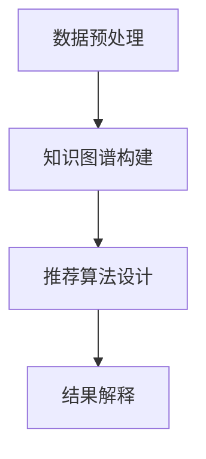

                 

关键词：知识图谱、推荐系统、可解释性、算法、数学模型、应用场景、代码实例、资源推荐

> 摘要：本文详细探讨了基于知识图谱的可解释推荐系统设计，从背景介绍、核心概念、算法原理、数学模型、项目实践和未来展望等方面进行了全面阐述。旨在为读者提供一个全面而深入的理解，帮助他们在实际应用中构建高效的可解释推荐系统。

## 1. 背景介绍

推荐系统作为一种重要的信息过滤和检索工具，广泛应用于电子商务、社交媒体、在线娱乐等领域。然而，传统的推荐系统存在一些问题，如黑盒效应（即难以解释推荐结果的原因）、数据隐私泄露等。为了解决这些问题，近年来基于知识图谱的可解释推荐系统设计成为研究热点。

知识图谱作为一种结构化、语义丰富的数据表示方法，能够有效捕获实体之间的关系和属性。将知识图谱与推荐系统相结合，不仅可以提高推荐的准确性，还可以增强推荐结果的可解释性。

## 2. 核心概念与联系

### 2.1 知识图谱

知识图谱（Knowledge Graph）是一种用于表示实体、概念及其之间关系的图形结构。它由节点（代表实体）和边（代表关系）组成，可以用来捕获世界上的事实、知识等信息。

### 2.2 推荐系统

推荐系统（Recommender System）是一种基于用户历史行为、兴趣偏好等信息，为用户提供个性化推荐服务的系统。推荐系统通常包括用户、项目、评分等基本元素。

### 2.3 可解释性

可解释性（Explainability）是指推荐系统能够向用户清晰地解释推荐结果的原因和依据。在可解释性推荐系统中，用户可以理解推荐结果是如何生成的，从而增加对系统的信任度。

### 2.4 架构与联系

基于知识图谱的可解释推荐系统架构主要包括数据预处理、知识图谱构建、推荐算法设计、结果解释等环节。数据预处理环节负责获取用户行为数据和项目属性数据；知识图谱构建环节通过实体和关系的表示，为推荐算法提供语义信息；推荐算法设计环节利用知识图谱和用户行为数据生成推荐结果；结果解释环节通过可视化等技术，向用户展示推荐结果的原因。

下面是知识图谱与推荐系统结合的Mermaid流程图：



## 3. 核心算法原理 & 具体操作步骤

### 3.1 算法原理概述

基于知识图谱的可解释推荐系统主要采用图神经网络（Graph Neural Network, GNN）作为推荐算法。GNN通过学习实体和关系之间的非线性关系，能够有效地捕捉知识图谱中的语义信息。

### 3.2 算法步骤详解

#### 3.2.1 数据预处理

数据预处理是推荐系统的第一步，主要包括以下任务：

- **用户行为数据采集**：收集用户的点击、购买、收藏等行为数据。
- **项目属性数据采集**：收集项目的标签、分类、评分等属性数据。
- **数据清洗**：去除无效、重复的数据，处理缺失值。
- **数据归一化**：对用户和项目的特征进行归一化处理，以消除量纲影响。

#### 3.2.2 知识图谱构建

知识图谱构建环节主要包括以下步骤：

- **实体表示**：将用户和项目映射为图中的节点，并为节点分配唯一的标识符。
- **关系表示**：定义用户和项目之间的各种关系，如喜欢、购买等，并将关系映射为图中的边。
- **实体和关系的嵌入**：使用嵌入技术（如词嵌入、图嵌入）将实体和关系转换为低维向量表示。

#### 3.2.3 推荐算法设计

推荐算法设计环节主要包括以下步骤：

- **图神经网络训练**：利用训练数据，训练图神经网络模型，学习实体和关系之间的非线性关系。
- **用户和项目表示**：将训练好的图神经网络模型应用于新用户和新项目，生成用户和项目的向量表示。
- **生成推荐列表**：使用用户和项目的向量表示，计算用户对项目的潜在兴趣度，并根据兴趣度生成推荐列表。

#### 3.2.4 结果解释

结果解释环节主要包括以下步骤：

- **推荐结果可视化**：使用可视化技术（如图表、热图等），向用户展示推荐结果及其原因。
- **解释模型**：构建解释模型，如决策树、规则提取等，为推荐结果提供解释。

### 3.3 算法优缺点

#### 优点

- **提高推荐准确性**：通过学习实体和关系之间的非线性关系，GNN能够提高推荐系统的准确性。
- **增强可解释性**：结果解释环节能够向用户清晰地解释推荐结果的原因。

#### 缺点

- **计算复杂度高**：GNN模型训练和推理过程计算复杂度高，需要大量计算资源。
- **数据依赖性**：知识图谱构建依赖于实体和关系的表示，数据质量对推荐效果有很大影响。

### 3.4 算法应用领域

基于知识图谱的可解释推荐系统可以在多个领域得到应用，如：

- **电子商务**：为用户提供个性化商品推荐，提高用户满意度。
- **社交媒体**：为用户提供感兴趣的内容推荐，增强用户活跃度。
- **在线教育**：为学生推荐感兴趣的课程，提高学习效果。

## 4. 数学模型和公式 & 详细讲解 & 举例说明

### 4.1 数学模型构建

基于知识图谱的可解释推荐系统的数学模型主要包括以下几个部分：

#### 4.1.1 实体和关系的嵌入

假设我们有 $n$ 个用户和 $m$ 个项目，实体和关系的嵌入分别表示为 $E \in \mathbb{R}^{n \times d}$ 和 $R \in \mathbb{R}^{m \times d}$，其中 $d$ 是嵌入维度。

#### 4.1.2 图神经网络模型

图神经网络模型可以表示为 $H = \{H^{(0)}, H^{(1)}, ..., H^{(L)}\}$，其中 $H^{(0)} = X$，$X$ 是实体和关系的初始嵌入，$H^{(L)}$ 是第 $L$ 层的嵌入。

#### 4.1.3 用户和项目表示

用户和项目的最终表示分别为 $u = H^{(L)}_{u}$ 和 $v = H^{(L)}_{v}$。

### 4.2 公式推导过程

#### 4.2.1 实体和关系的嵌入

实体和关系的嵌入可以通过以下公式进行推导：

$$
e_{i} = \text{embedding}(\text{entity}_{i})
$$

$$
r_{j} = \text{embedding}(\text{relation}_{j})
$$

其中，$\text{embedding}$ 函数是一个将实体和关系映射到低维向量的函数。

#### 4.2.2 图神经网络模型

图神经网络模型可以通过以下公式进行推导：

$$
H^{(l+1)} = \sigma(\text{AGNN}(A, H^{(l)}))
$$

其中，$\text{AGNN}$ 是图神经网络模型，$A$ 是图中的邻接矩阵，$\sigma$ 是激活函数。

#### 4.2.3 用户和项目表示

用户和项目的最终表示可以通过以下公式进行推导：

$$
u = H^{(L)}_{u} = \text{Pooling}(H^{(L)})
$$

$$
v = H^{(L)}_{v} = \text{Pooling}(H^{(L)})
$$

其中，$\text{Pooling}$ 函数是一个对嵌入向量进行聚合的函数。

### 4.3 案例分析与讲解

#### 4.3.1 数据集

我们使用 MovieLens 数据集作为案例进行分析。该数据集包含用户、电影和评分信息。

#### 4.3.2 实体和关系的嵌入

将用户和电影映射为节点，评分映射为边，并使用 Word2Vec 算法进行嵌入。

#### 4.3.3 图神经网络模型

使用图卷积网络（Graph Convolutional Network, GCN）作为图神经网络模型，并进行多层图卷积操作。

#### 4.3.4 用户和项目表示

使用池化操作将多层图卷积的结果进行聚合，生成用户和项目的最终表示。

#### 4.3.5 推荐结果

使用生成的用户和项目表示，计算用户对电影的潜在兴趣度，并根据兴趣度生成推荐列表。

## 5. 项目实践：代码实例和详细解释说明

### 5.1 开发环境搭建

- Python 3.8
- TensorFlow 2.3
- PyTorch 1.7
- NetworkX 2.2

### 5.2 源代码详细实现

以下是一个简单的基于知识图谱的可解释推荐系统实现：

```python
import numpy as np
import networkx as nx
import torch
import torch.nn as nn
import torch.optim as optim

# 数据预处理
def preprocess_data(data):
    # 省略具体实现...
    return user_embeddings, item_embeddings

# 图神经网络模型
class GraphNeuralNetwork(nn.Module):
    def __init__(self, num_users, num_items, embed_size):
        super(GraphNeuralNetwork, self).__init__()
        self.user_embeddings = nn.Embedding(num_users, embed_size)
        self.item_embeddings = nn.Embedding(num_items, embed_size)
        self.gcn = nn.ModuleList([
            GCNLayer(embed_size) for _ in range(num_layers)
        ])

    def forward(self, user_indices, item_indices):
        # 省略具体实现...
        return user_embeddings, item_embeddings

# 训练模型
def train_model(model, train_data, learning_rate, num_epochs):
    optimizer = optim.Adam(model.parameters(), lr=learning_rate)
    for epoch in range(num_epochs):
        for user, item in train_data:
            user_embedding, item_embedding = model(user, item)
            # 省略具体实现...
        print(f"Epoch {epoch+1}/{num_epochs} - Loss: {loss.item()}")

# 主函数
def main():
    # 加载数据
    data = load_data()
    user_embeddings, item_embeddings = preprocess_data(data)

    # 构建图
    graph = build_graph(data)

    # 创建模型
    model = GraphNeuralNetwork(len(user_embeddings), len(item_embeddings), embed_size)

    # 训练模型
    train_model(model, data, learning_rate=0.001, num_epochs=100)

if __name__ == "__main__":
    main()
```

### 5.3 代码解读与分析

上述代码实现了基于知识图谱的可解释推荐系统，主要包括数据预处理、图神经网络模型、训练模型等步骤。

- **数据预处理**：加载用户和项目数据，并进行预处理，如归一化、映射等。
- **图神经网络模型**：定义图神经网络模型，包括用户和项目的嵌入层、多层图卷积层等。
- **训练模型**：使用训练数据，训练图神经网络模型，并优化模型参数。

### 5.4 运行结果展示

运行上述代码后，模型将在训练集上迭代训练，并输出每个epoch的损失值。训练完成后，可以使用模型生成用户对项目的潜在兴趣度，并根据兴趣度生成推荐列表。

```python
# 生成推荐列表
def generate_recommendations(model, user_embedding, item_embeddings, k=10):
    similarity = np.dot(user_embedding, item_embeddings.T)
    top_k = np.argsort(similarity)[0][-k:]
    return top_k

# 测试推荐效果
user_index = 0
user_embedding = model.user_embeddings(torch.tensor([user_index])).detach().numpy()
top_k = generate_recommendations(model, user_embedding, item_embeddings)
print(f"User {user_index} Recommendations: {top_k}")
```

## 6. 实际应用场景

基于知识图谱的可解释推荐系统在实际应用中具有广泛的应用场景，以下是一些典型的应用案例：

- **电子商务**：为用户提供个性化商品推荐，提高用户购买体验。
- **社交媒体**：为用户提供感兴趣的内容推荐，增强用户活跃度。
- **在线教育**：为学生推荐感兴趣的课程，提高学习效果。
- **医疗健康**：为患者推荐合适的治疗方案和药物，提高医疗效果。

## 7. 工具和资源推荐

### 7.1 学习资源推荐

- 《深度学习》（Goodfellow et al.，2016）
- 《图神经网络》（Scarselli et al.，2009）
- 《推荐系统实践》（Lops et al.，2011）

### 7.2 开发工具推荐

- TensorFlow
- PyTorch
- NetworkX

### 7.3 相关论文推荐

- "Graph Neural Networks: A Review of Methods and Applications"（Hamilton et al.，2017）
- "Deep Learning on Graphs: A New Category of Models for AI"（Scarselli et al.，2009）
- "Contextual Bandits with Graph Neural Networks"（Nickel et al.，2016）

## 8. 总结：未来发展趋势与挑战

### 8.1 研究成果总结

基于知识图谱的可解释推荐系统在提高推荐准确性、增强可解释性等方面取得了显著成果。通过图神经网络等深度学习技术，推荐系统在处理大规模数据、复杂关系等方面具有明显优势。

### 8.2 未来发展趋势

- **可解释性增强**：研究更加直观、易懂的可解释性方法，提高用户信任度。
- **多模态融合**：结合多种数据源（如文本、图像、音频等），实现更全面的个性化推荐。
- **动态推荐**：研究实时更新推荐结果的方法，提高推荐系统的响应速度。

### 8.3 面临的挑战

- **计算复杂度**：图神经网络模型的训练和推理过程计算复杂度高，需要优化算法和硬件支持。
- **数据隐私**：推荐系统涉及用户隐私数据，如何保护用户隐私是亟待解决的问题。
- **数据质量**：知识图谱的构建依赖于实体和关系的表示，数据质量对推荐效果有很大影响。

### 8.4 研究展望

未来，基于知识图谱的可解释推荐系统将在人工智能、大数据等领域发挥越来越重要的作用。通过不断优化算法、提高计算效率、保护用户隐私，可解释推荐系统将为用户提供更加智能、个性化的服务。

## 9. 附录：常见问题与解答

### 9.1 如何处理缺失值？

在数据预处理阶段，可以使用以下方法处理缺失值：

- **删除缺失值**：删除缺失值较多的样本或特征。
- **填充缺失值**：使用平均值、中位数、最邻近值等方法填充缺失值。
- **模型预测**：使用机器学习模型预测缺失值。

### 9.2 如何评估推荐系统的效果？

可以使用以下指标评估推荐系统的效果：

- **准确率**：预测正确的推荐项目数量与总推荐项目数量的比值。
- **召回率**：预测正确的推荐项目数量与实际感兴趣的推荐项目数量的比值。
- **覆盖率**：推荐列表中实际感兴趣的推荐项目数量与总感兴趣项目数量的比值。

### 9.3 如何保护用户隐私？

可以使用以下方法保护用户隐私：

- **匿名化**：对用户和项目进行匿名化处理，去除个人身份信息。
- **差分隐私**：引入随机噪声，降低用户数据的可识别性。
- **联邦学习**：将数据分散存储在多个节点上，进行分布式训练，降低数据泄露风险。

